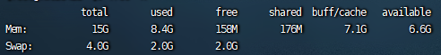

## **磁盘空间不足问题**

先用 **df -h** 从总体查看磁盘状态

```
文件系统        容量  已用  可用 已用% 挂载点
devtmpfs        1.9G  4.0K  1.9G    1% /dev
tmpfs           1.9G   24K  1.9G    1% /dev/shm
tmpfs           1.9G  740K  1.9G    1% /run
tmpfs           1.9G     0  1.9G    0% /sys/fs/cgroup
/dev/vda1        50G   12G   36G   25% /
tmpfs           379M     0  379M    0% /run/user/0
tmpfs           379M     0  379M    0% /run/user/1001
/dev/loop4     1003K   17K  935K    2% /mnt
```

很多都是无用信息，比如 tmpfs 类型的是 linux 的内存型文件系统，里面的数据是放在内存中的，你可 cd 到后面那些目录下玩玩，和操作正常的文件是一样的。一般就是看挂载点为根目录的 / 的容量咯，这里我只用了 25%，显然还没有达到瓶颈，但如果这里太大了，还要进一步看看是哪个目录大了。

此时用 **du -sh \*** 命令，查看 / 路径下的各个文件和目录的大小。

```
0  bin
166M  boot
134M  data
4.0K  dev
40M  etc
4.0K  home
0  lib
0  lib64
16K  lost+found
4.0K  media
du: 无法访问"mnt/hello": 输入/输出错误
13K  mnt
20K  opt
du: 无法访问"proc/12896/task/12896/fd/4": 没有那个文件或目录
du: 无法访问"proc/12896/task/12896/fdinfo/4": 没有那个文件或目录
du: 无法访问"proc/12896/fd/4": 没有那个文件或目录
du: 无法访问"proc/12896/fdinfo/4": 没有那个文件或目录
0  proc
953M  root
740K  run
0  sbin
4.0K  srv
2.1G  swapfile
0  sys
68K  tmp
5.3G  usr
2.9G  var
```

找到最大的那个目录，进去，再次执行这个命令，直到找到最终占地面积特别大的文件或目录为止。

当然，如果你知道里面全都是普通文件，比如你发现你的 log 目录很大，想看看里面哪个具体日志文件过大，也可以用 **ls -lh** 命令，它的输出会更丰满一些，但我们主要看占地大小，也就无所谓了。

```
drwxr-x--- 2 www   www   4.0K 2 月   3 14:56 hsperfdata_www
srwxrwxrwx 1 mysql mysql    0 2 月   3 14:56 mysql.sock
-rw-r--r-- 1 root  root     0 6 月  19 15:33 stargate.lock
drwx------ 3 root  root  4.0K 2 月   3 14:55 systemd-private
```

另外提一嘴，你如果用 **du -h \*** 去执行的话，整个屏幕会很刺激

## **CPU 与内存使用率过高**

### 进程top命令

 

* 列表表示不同进程（PID）所占用的资源情况
* **VIRT** 表示使用的虚拟内存数量
* **RES** 表示使用的物理内存数量
* **SHR** 表示使用的共享内存数量，这三者可以从内存角度看该进程的资源占用情况。

* **S** 表示进程的状态，下面的值 **S** 表示睡眠，**D** 表示不可中断睡眠，**R** 表示运行，基本知道这三个就够了。
* 后面两个值是百分比，**%CPU** 自然就是 CPU 使用率，**%MEM** 自然就是内存使用率，看这俩值可以一目了然看谁占用的资源过高了。
* **TIME** 表示累计 cpu 使用时长
* **COMMAND** 表示启动进程使用的命令行，Java 程序的话，可以看看 JVM 启动参数，看是否配置的合理。

**PS：**%cpu 是表示单核 cpu 的占用率, 而不是占用所有 cpu 的占用率. 即如果我们是 32 核 cpu, 那么 3200% 才是最高的 cpu 利用率。**`shift` `i`切换为显示 cpu 占用率**

### java的cpu占用过高

*  **jps** 命令找到它的 PID

   

* 查看java进程详情**top -p 19775 -H**

   

   

* free -h分析内存

   

  * total

    内存总数

  * used

    已经使用内存数

  * free

    完全空闲内存

  * shared

    多个进程共享的内存

  * buffers

    用于块设备数据缓冲，记录文件系统 metadata（目录，权限，属性等)

  * cached

    用于文件内容的缓冲

  * available

    真正剩余的可被程序应用的内存数

  一共有两行，mem 和 swap，**mem** 就是内存大小，**swap** 是交换区，是在物理磁盘上的一块区域，当内存不够用时，可以用这部分区域当内存

   **swapon** 命令来看下交换区的使用情况

  ```
  NAME      TYPE SIZE USED PRIO
  /swapfile file   2G 9.5M   -2
  ```

## **网络延迟**

### **netstat -a**查看socket连接

 

* LISTENING状态
  FTP服务启动后首先处于侦听（LISTENING）状态。

* ESTABLISHED状态
  ESTABLISHED的意思是**建立连接。表示两台机器正在通信**。

* CLOSE_WAIT

    对方主动关闭连接或者网络异常导致连接中断，这时我方的状态会变成CLOSE_WAIT 此时我方要调用close()来使得连接正确关

* CLOSE_WAIT

  对方主动关闭连接或者网络异常导致连接中断，这时我方的状态会变成CLOSE_WAIT 此时我方要调用close()来使得连接正确关闭

* TIME_WAIT

  **我方主动调用close()断开连接，收到对方确认后状态变为TIME_WAIT**。TCP协议规定TIME_WAIT状态会一直持续2MSL(即两倍的分 段最大生存期)，以此来确保旧的连接状态不会对新连接产生影响。处于TIME_WAIT状态的连接占用的资源不会被内核释放，所以作为服务器，在可能的情 况下，尽量不要主动断开连接，以减少TIME_WAIT状态造成的资源浪费。

  目前有一种避免TIME_WAIT资源浪费的方法，就是关闭socket的LINGER选项。但这种做法是TCP协议不推荐使用的，在某些情况下这个操作可能会带来错误。

* SYN_SENT状态

  SYN_SENT状态表示请求连接，当你要访问其它的计算机的服务时首先要发个同步信号给该端口，此时状态为SYN_SENT，如果连接成功了就变为 ESTABLISHED，此时SYN_SENT状态非常短暂。但如果发现SYN_SENT非常多且在向不同的机器发出，那你的机器可能中了冲击波或震荡波 之类的病毒了。这类病毒为了感染别的计算机，它就要扫描别的计算机，在扫描的过程中对每个要扫描的计算机都要发出了同步请求，这也是出现许多 SYN_SENT的原因。

​	根据TCP协议定义的3次握手断开连接规定,发起socket主动关闭的一方 socket将进入TIME_WAIT状态,TIME_WAIT状态将持续2个MSL(Max Segment Lifetime),在Windows下默认为4分钟,即240秒,TIME_WAIT状态下的socket不能被回收使用. 具体现象是对于一个处理大量短连接的服务器,如果是由服务器主动关闭客户端的连接,将导致服务器端存在大量的处于TIME_WAIT状态的socket, 甚至比处于Established状态下的socket多的多,严重影响服务器的处理能力,甚至耗尽可用的socket,停止服务. TIME_WAIT是TCP协议用以保证被重新分配的socket不会受到之前残留的延迟重发报文影响的机制,是必要的逻辑保证.

### **netstat -tnpa** 查看socket进程

 

### **ps -ef** 命令查看相关进程

 

### **iftop -P**实时数据

 

* 中间的 **<= =>** 这两个左右箭头，表示的是流量的方向。
* TX：发送流量
* RX：接收流量
* TOTAL：总流量
* Cumm：运行 iftop 到目前时间的总流量
* peak：流量峰值
* rates：分别表示过去 2s 10s 40s 的平均流量

**PS：在做 Server 压力测试时发现，客户端给服务器不断发请求，并接受服务器端的响应。发现接收服务器响应的过程中，会出现 recv 服务器端响应，阻塞 40ms 的情况，但是查看 server 端日志，Server 都在 2ms 内将请求处理完成，并给客户端响应。如果你了解 TCP，就知道它是由于 TCP 的延迟确认机制和 Nagle 算法及拥塞控制导致的，自然而然就会朝着这个方向 去解决了，比如打开 TCP_NODELAY 选项**

## java程序诊断

### **jmap -dump**

分析内存快照

### **jmap -heap** 

查看堆内存设置与当前使用情况

 

### **jstack** 

分析线程

**fastthread.io**分析

**arthas**

实时在线诊断

* 使用 **watch** 命令可以实时观察一个方法的入参和出参。
* 使用 **trace** 命令可以跟踪某个方法的耗时，而且可以深入这个方法所调用的方法的各个耗时。
*  **dashboard** 全局监控
* **thread** 查看所有线程信息，包括状态和 CPU 使用率
* **thread -b** 甚至可以直接定位到死锁信息
* **jad** 命令进行反编译
* **ognl** 命令查看某一个对象的具体值

## 浏览器http请求耗时过长

### 排除浏览器本身

 curl 请求后，对此请求稍加改造，加上如下 -o,-s, -w 选项

 

*  **-o /dev/null 屏蔽原有输出信息**

* **-s  静默模式，不输出任何东西**
* **-w %{http_code} 控制额外输出**
* 一般我们只要关心最后一个 time_total 参数即可，表示请求花费的全部时间

### 服务端排查

 Java 诊断工具：Arthas，采用命令行交互模式

用 arthas 的 trace 命令来追踪方法调用,什么是 trace 命令

trace com.xxx.AuthController login

### 流量的流转路径

 

请求需要经过反向代理层，接入层后才能到达我们的站点层（即我们的 Spring MVC 服务），也就是说从「反向代理层到接入层」及「接入层到站点层」都可能导致请求缓慢

通过 「curl -I www.example」的形式可以输出开头信息,然后加上 -b 选项可以带上 cookie，我们的接入层如果发现请求里带有某些特殊的 cookie 会返回一个名为「X-KF-Via」的头字段，如下

```
X-KF-Via: agw(bip=10.65.x.1:8001,10.65.x.2:8001;b=mvc_service)
```

这个头字段表示，请求 mvc_service 服务总共请求了两台机器，第一台 10.65.x.1 未成功后，再接着重试 10.65.x.2:8001，所以由此可以排查出 10.65.x.1 这台机器有问题，所以你看熟悉系统架构有多重要，如果我早知道有这么一个选项，就可以一步到位排查出此问题了


