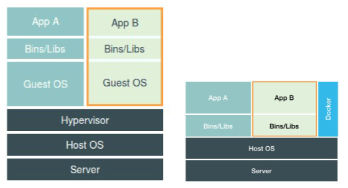
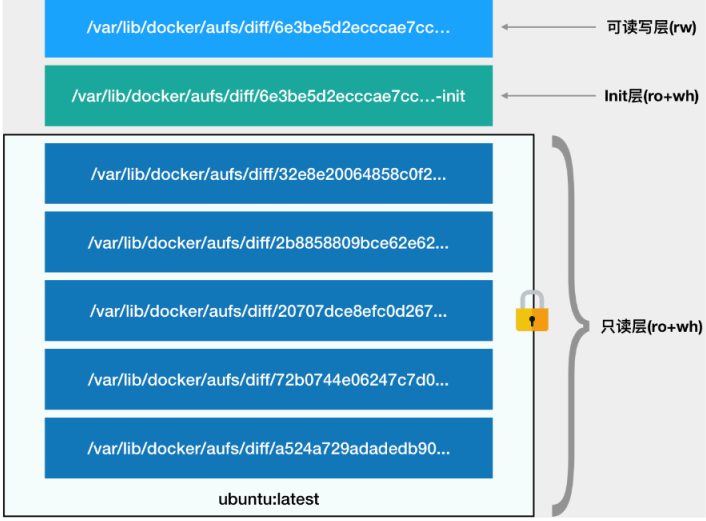

## 1. 概述

容器其实是一种沙盒技术，沙盒就是能够像一个集装箱一样，把你的应用“装”起来的技术。这样，应用与应用之间，就因为有了边界而不至于相互干扰

## 2. 容器的隔离

### 2.1. 进程

​	**容器技术的核心功能，就是通过约束和修改进程的动态表现，从而为其创造出一个“边界”**

​	对于 Docker 等大多数 Linux 容器来说，**Cgroups 技术**是用来制造约束的主要手段，而**Namespace 技术**则是用来修改进程视图的主要方法

```
$ docker run -it busybox /bin/sh
```

创建容器进程时，指定了这个进程所需要启用的一组 Namespace 参数。这样，容器就只能“看”到当前 Namespace 所限定的资源、文件、设备、状态，或者配置。而对于宿主机以及其他不相关的程序，它就完全看不到了。本质上理解，namespace 和 cgroup 是内核特性，容器本质上就是一个加了限定参数的进程

**容器，其实是一种特殊的进程而已**

​	**Namespace 技术实际上修改了应用进程看待整个计算机“视图”，即它的“视线”被操作系统做了限制，只能“看到”某些指定的内容**。但对于宿主机来说，这些被“隔离”了的进程跟其他进程并没有太大区别。

基于 Linux Namespace 的隔离机制相比于虚拟化技术也有很多不足之处，其中最主要的问题就是：**隔离得不彻底**

多个容器之间使用的就还是同一个宿主机的操作系统内核，即操作系统是不能共享的，比如高版本的镜像不能运行在低版本的宿主机上。还有很多资源是不能隔离，比如操作系统时间

### 2.2. Linux Cgroups

Linux Cgroups 的全称是 Linux Control Group。它最主要的作用，就是限制一个进程组能够使用的资源上限，包括 CPU、内存、磁盘、网络带宽等等

Linux Cgroups 的设计还是比较易用的，简单粗暴地理解呢，它就是一个子系统目录加上一组资源限制文件的组合。而对于 Docker 等 Linux 容器项目来说，它们只需要在每个子系统下面，为每个容器创建一个控制组（即创建一个新目录），然后在启动容器进程之后，把这个进程的 PID 填写到对应控制组的 tasks 文件中就可以了

#### 2.2.1. 使用命令查看可限制资源的种类：

```
$ mount -t cgroup 
cpuset on /sys/fs/cgroup/cpuset type cgroup (rw,nosuid,nodev,noexec,relatime,cpuset)
cpu on /sys/fs/cgroup/cpu type cgroup (rw,nosuid,nodev,noexec,relatime,cpu)
cpuacct on /sys/fs/cgroup/cpuacct type cgroup (rw,nosuid,nodev,noexec,relatime,cpuacct)
blkio on /sys/fs/cgroup/blkio type cgroup (rw,nosuid,nodev,noexec,relatime,blkio)
memory on /sys/fs/cgroup/memory type cgroup (rw,nosuid,nodev,noexec,relatime,memory)
...
```

#### 2.2.2. cpu限制示例

对 CPU 子系统来说，我们就可以看到如下几个配置文件

```
$ ls /sys/fs/cgroup/cpu
cgroup.clone_children cpu.cfs_period_us cpu.rt_period_us  cpu.shares notify_on_release
cgroup.procs      cpu.cfs_quota_us  cpu.rt_runtime_us cpu.stat  tasks
```

输出里注意到 cfs_period 和 cfs_quota 这样的关键词

可以用来限制进程在长度为 cfs_period 的一段时间内，只能被分配到总量为 cfs_quota 的 CPU 时间

限制示例：

* 在对应的子系统下面创建一个目录，这个目录就成为控制组

* 操作系统会在你新创建的 container 目录下，自动生成该子系统对应的资源限制文件

* 修改CPU这些文件的内容来设置限制，如向 container 组里的 cfs_quota 文件写入 20 ms

* 我们把被限制的进程的 PID 写入 container 组里的 tasks 文件，上面的设置就会对该进程生效了

  ```
  /sys/fs/cgroup/cpu/container/tasks 
  ```

*  top 指令查看一下,该进程计算机的 CPU 使用率立刻降到了 20%
* 除 CPU 子系统外，Cgroups 的每一项子系统都有其独有的资源限制能力
  - blkio，为块设备设定I/O 限制，一般用于磁盘等设备；
  - cpuset，为进程分配单独的 CPU 核和对应的内存节点；
  - memory，为进程设定内存使用的限制

#### 2.2.2. 缺陷

* 不能运行多个应用

​		在一个容器中，没办法同时运行两个不同的应用，除非你能事先找到一个公共的 PID=1 的程序来充当两个不同应用的父进程，这也		是为什么很多人都会用 systemd 或者 supervisord 这样的软件来代替应用本身作为容器的启动进程

* 信息不一致

  Cgroups 对资源的限制能力也有很多不完善的地方，被提及最多的自然是 /proc 文件系统的问题

  Linux 下的 /proc 目录存储的是记录当前内核运行状态的一系列特殊文件，用户可以通过访问这些文件，查看系统以及当前正在运行的进程的信息，比如 CPU 使用情况、内存占用率等，这些文件也是 top 指令查看系统信息的主要数据来源

  因此，如果在容器里执行 top 指令，显示宿主机的 CPU 和内存数据，而不是当前容器的数据

解决方案：

* top 是从 /prof/stats 目录下获取数据，所以道理上来讲，容器不挂载宿主机的该目录就可以了。lxcfs就是来实现这个功能的，做法是把宿主机的 /var/lib/lxcfs/proc/memoinfo 文件挂载到Docker容器的/proc/meminfo位置后。容器中进程读取相应文件内容时，lxcfs的FUSE实现会从容器对应的Cgroup中读取正确的内存限制。从而使得应用获得正确的资源约束设定。kubernetes环境下，也能用，以ds 方式运行 lxcfs ，自动给容器注入争取的 proc 信息
* 用的是vanilla kubernetes，遇到的主要挑战就是性能损失和多租户隔离问题，性能损失目前没想到好办法，可能的方案是用ipvs 替换iptables ，以及用 RPC 替换 rest。多租户隔离也没有很好的方法，现在是让不同的namespace调度到不同的物理机上。也许 rancher和openshift已经多租户隔离

#### 2.2.3. 总结

我首先介绍了容器使用 Linux Namespace 作为隔离手段的优势和劣势，对比了 Linux 容器跟虚拟机技术的不同，进一步明确了“容器只是一种特殊的进程”这个结论。

除了创建 Namespace 之外，在后续关于容器网络的分享中，我还会介绍一些其他 Namespace 的操作，比如看不见摸不着的 Linux Namespace 在计算机中到底如何表示、一个进程如何“加入”到其他进程的 Namespace 当中，等等。

紧接着，我详细介绍了容器在做好了隔离工作之后，又如何通过 Linux Cgroups 实现资源的限制，并通过一系列简单的实验，模拟了 Docker 项目创建容器限制的过程。

通过以上讲述，你现在应该能够理解，一个正在运行的 Docker 容器，其实就是一个启用了多个 Linux Namespace 的应用进程，而这个进程能够使用的资源量，则受 Cgroups 配置的限制。

这也是容器技术中一个非常重要的概念，即：**容器是一个“单进程”模型。**

由于一个容器的本质就是一个进程，用户的应用进程实际上就是容器里 PID=1 的进程，也是其他后续创建的所有进程的父进程。这就意味着，在一个容器中，你没办法同时运行两个不同的应用，除非你能事先找到一个公共的 PID=1 的程序来充当两个不同应用的父进程，这也是为什么很多人都会用 systemd 或者 supervisord 这样的软件来代替应用本身作为容器的启动进程。

但是，在后面分享容器设计模式时，我还会推荐其他更好的解决办法。这是因为容器本身的设计，就是希望容器和应用能够**同生命周期**，这个概念对后续的容器编排非常重要。否则，一旦出现类似于“容器是正常运行的，但是里面的应用早已经挂了”的情况，编排系统处理起来就非常麻烦了。

另外，跟 Namespace 的情况类似，Cgroups 对资源的限制能力也有很多不完善的地方，被提及最多的自然是 /proc 文件系统的问题。

众所周知，Linux 下的 /proc 目录存储的是记录当前内核运行状态的一系列特殊文件，用户可以通过访问这些文件，查看系统以及当前正在运行的进程的信息，比如 CPU 使用情况、内存占用率等，这些文件也是 top 指令查看系统信息的主要数据来源。

但是，你如果在容器里执行 top 指令，就会发现，它显示的信息居然是宿主机的 CPU 和内存数据，而不是当前容器的数据。

造成这个问题的原因就是，/proc 文件系统并不知道用户通过 Cgroups 给这个容器做了什么样的资源限制，即：/proc 文件系统不了解 Cgroups 限制的存在。

在生产环境中，这个问题必须进行修正，否则应用程序在容器里读取到的 CPU 核数、可用内存等信息都是宿主机上的数据，这会给应用的运行带来非常大的困惑和风险。这也是在企业中，容器化应用碰到的一个常见问题，也是容器相较于虚拟机另一个不尽如人意的地方

### 2.3. 虚拟机

​	我们不应该把 Docker Engine 或者任何容器管理工具放在跟 Hypervisor 相同的位置，因为它们并不像 Hypervisor 那样对应用进程的隔离环境负责，也不会创建任何实体的“容器”，真正对隔离环境负责的是宿主机操作系统本身。

​	用户运行在容器里的应用进程，跟宿主机上的其他进程一样，都由宿主机操作系统统一管理，只不过这些被隔离的进程拥有额外设置过的 Namespace 参数。而 Docker 项目在这里扮演的角色，更多的是旁路式的辅助和管理工作

​	使用虚拟化技术作为应用沙盒，就必须要由 Hypervisor 来负责创建虚拟机，这个虚拟机是真实存在的，并且它里面必须运行一个完整的 Guest OS 才能执行用户的应用进程。这就不可避免地带来了额外的资源消耗和占用

 


## 3. 容器镜像

### 3.1. rootfs

机制，正是我们经常提到的容器镜像，也叫作：rootfs。它只是一个操作系统的所有文件和目录，并不包含内核，最多也就几百兆。而相比之下，传统虚拟机的镜像大多是一个磁盘的“快照”，磁盘有多大，镜像就至少有多大。

通过结合使用 Mount Namespace 和 rootfs，容器就能够为进程构建出一个完善的文件系统隔离环境。当然，这个功能的实现还必须感谢 chroot 和 pivot_root 这两个系统调用切换进程根目录的能力

### 3.2. 分层

上面的读写层通常也称为容器层，下面的只读层称为镜像层，所有的增删查改操作都只会作用在容器层，相同的文件上层会覆盖掉下层。知道这一点，就不难理解镜像文件的修改，比如修改一个文件的时候，首先会从上到下查找有没有这个文件，找到，就复制到容器层中，修改，修改的结果就会作用到下层的文件，这种方式也被称为copy-on-write

 

* **只读层**

  这些层，都以增量的方式分别包含了 Ubuntu 操作系统的一部分。

* **可读写层**

  它是这个容器的 rootfs 最上面的一层，一旦在容器里做了写操作，你修改产生的内容就会以增量的方式出现在这个层中。

  最上面这个可读写层的作用，就是专门用来存放你修改 rootfs 后产生的增量，无论是增、删、改，都发生在这里。而当我们使用完了这个被修改过的容器之后，还可以使用 docker commit 和 push 指令，保存这个被修改过的可读写层，并上传到 Docker Hub 上，供其他人使用；而与此同时，原先的只读层里的内容则不会有任何变化。这，就是增量 rootfs 的好处

* **Init 层**

  它是一个以“-init”结尾的层，夹在只读层和读写层之间。Init 层是 Docker 项目单独生成的一个内部层，专门用来存放 /etc/hosts、/etc/resolv.conf 等信息

  这些文件本来属于只读的 Ubuntu 镜像的一部分，但是用户往往需要在启动容器时写入一些指定的值比如 hostname，所以就需要在可读写层对它们进行修改，这些修改往往只对当前的容器有效

## 4. docker容器

