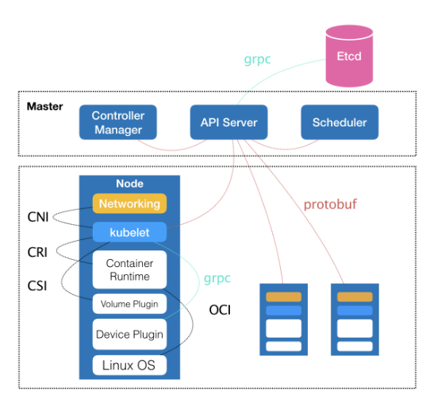

## 1. 介绍

​	容器其实可以分为两个部分：容器运行时和容器镜像。

​	Kubernetes 项目所擅长的，是按照用户的意愿和整个系统的规则，完全自动化地处理好容器之间的各种关系。**这种功能，就是我们经常听到的一个概念：编排**

​	Kubernetes 项目为用户提供的不仅限于一个工具。它真正的价值，乃在于提供了一套基于容器构建分布式系统的基础依赖

 

*  kubelet 

  用来操作 Docker 等容器运行时的核心组件

  除了跟容器运行时打交道外，kubelet 在配置容器网络、管理容器数据卷时，都需要直接操作宿主机

Kubernetes最大价值： 声明式API和控制器模式 Servless

三个特征： 按使用计费、工作流驱动、高可扩展性 

云原生本质： 敏捷、可扩展、可复制，充分利用“云”能力，发挥“云”价值的最佳上云路径 

对于应用如何部署到kuberentes的问题里，有一个例子是Tomcat里运行一个WAR包。有两个问题： 

1、为什么不把Tomcat和WAR包打包在一个镜像里   

放在一个镜像里，耦合太重。任何一方的发布都要修改整个镜像 

2、为什么不把WAR包放到一个持久化的Volume里，Tomcat容器启动的时候去挂载？  

通过Volume挂载，缺少自描述字段（比如版本）。只能知道这里面是一个必要的文件。  

当然可以通过自定义开发一个Volume插件，来从指定的描述字段中拉取一个WAR包来实现，但方案较为复杂

## 2. 部署工具

* kubeadm

  不支持高可用，但是可以通过两条指令完成一个 Kubernetes 集群的部署。并且机制和原生kubernetes更接近

* kops

  支持高可用部署

* SaltStack 

  支持高可用部署

* kubespray 

### 2.1. kubeadm使用示例

```
# 创建一个 Master 节点
$ kubeadm init
 
# 将一个 Node 节点加入到当前集群中
$ kubeadm join <Master 节点的 IP 和端口 >
```

### 2.2. 工作流程

kubernetes的每一个组件都是一个需要被执行的、单独的二进制文件。不能用容器去部署 Kubernetes 项目，因为 kubelet无法操作宿主机相关。

所以部署kubernetes的总体思路为：kubelet 直接运行在宿主机上，然后使用容器部署其他的 Kubernetes 组件

#### 2.2.1. 安装文件

在机器上手动安装 kubeadm、kubelet 和 kubectl 这三个二进制文件

```
$ apt-get install kubeadm
```

#### 2.2.2. init流程

我们主要使用kubeadm init部署 Master 节点。

* 检查机器

  主要为内核版本、端口、Cgroups 功能等必备资源是否齐全

* 生成证书和目录

  kubeadm 为 Kubernetes 项目生成的证书文件都放在 Master 节点的 /etc/kubernetes/pki

  kubeadm 为这一步生成的是 apiserver-kubelet-client.crt 文件，对应的私钥是 apiserver-kubelet-client.key从而保证kube-apiserver 向 kubelet 必须是安全的。

  Kubernetes 集群中还有 Aggregate APIServer，也需要用到专门的证书

  等等还有其它的证书

  证书的目录为：

  ```
  /etc/kubernetes/pki/ca.{crt,key}
  ```

* 生成组件配置文件

  为其他组件生成访问 kube-apiserver 所需的配置文件，路径为/etc/kubernetes/xxx.conf

  ```
  ls /etc/kubernetes/
  admin.conf  controller-manager.conf  kubelet.conf  scheduler.conf
  ```

  当前这个 Master 节点的服务器地址、监听端口、证书目录等信息。这样，对应的客户端（比如 scheduler，kubelet 等），可以直接加载相应的文件，使用里面的信息与 kube-apiserver 建立安全连接

* 静态pod文件生成

  首先会生成 Pod 配置文件,用于启动3个master组件和etcd

  Kubernetes 有三个 Master 组件 kube-apiserver、kube-controller-manager、kube-scheduler，而它们都会被使用 Pod 的方式部署起来

  在 Kubernetes 中，有一种特殊的容器启动方法叫做“Static Pod”。它允许你把要部署的 Pod 的 YAML 文件放在一个指定的目录里。这样，当这台机器上的 kubelet 启动时，它会自动检查这个目录，加载所有的 Pod YAML 文件，然后在这台机器上启动它们
  Master 组件的 YAML 文件会被生成在 /etc/kubernetes/manifests 路径下。比如，kube-apiserver.yaml：

  ```
  apiVersion: v1
  kind: Pod
  metadata:
    annotations:
      scheduler.alpha.kubernetes.io/critical-pod: ""
    creationTimestamp: null
    labels:
      component: kube-apiserver
      tier: control-plane
    name: kube-apiserver
    namespace: kube-system
  spec:
    containers:
    - command:
      - kube-apiserver
      - --authorization-mode=Node,RBAC
      - --runtime-config=api/all=true
      - --advertise-address=10.168.0.2
      ...
      - --tls-cert-file=/etc/kubernetes/pki/apiserver.crt
      - --tls-private-key-file=/etc/kubernetes/pki/apiserver.key
      image: k8s.gcr.io/kube-apiserver-amd64:v1.11.1
      imagePullPolicy: IfNotPresent
      livenessProbe:
        ...
      name: kube-apiserver
      resources:
        requests:
          cpu: 250m
      volumeMounts:
      - mountPath: /usr/share/ca-certificates
        name: usr-share-ca-certificates
        readOnly: true
      ...
    hostNetwork: true
    priorityClassName: system-cluster-critical
    volumes:
    - hostPath:
        path: /etc/ca-certificates
        type: DirectoryOrCreate
      name: etc-ca-certificates
    ...
  ```

  * 这个 Pod 里只定义了一个容器，它使用的镜像是：`k8s.gcr.io/kube-apiserver-amd64:v1.11.1` 。这个镜像是 Kubernetes 官方维护的一个组件镜像。

  * 这个容器的启动命令（commands）是 kube-apiserver --authorization-mode=Node,RBAC …，这样一句非常长的命令。其实，它就是容器里 kube-apiserver 这个二进制文件再加上指定的配置参数而已。

  * 修改一个已有集群的 kube-apiserver 的配置，需要修改这个 YAML 文件。

  * 这些组件的参数也可以在部署时指定

  kubeadm 还会再生成一个 Etcd 的 Pod YAML 文件，用来通过同样的 Static Pod 的方式启动 Etcd。

  所以，最后 Master 组件的 Pod YAML 文件如下所示：

  ```
  $ ls /etc/kubernetes/manifests/
  etcd.yaml  kube-apiserver.yaml  kube-controller-manager.yaml  kube-scheduler.yaml
  ```

  一旦这些 YAML 文件出现在被 kubelet 监视的 /etc/kubernetes/manifests 目录下，kubelet 就会自动创建这些 YAML 文件中定义的 Pod，即 Master 组件的容器。

  Master 容器启动后，kubeadm 会通过检查 localhost:6443/healthz 这个 Master 组件的健康检查 URL，等待 Master 组件完全运行起来。

  **然后，kubeadm 就会为集群生成一个 bootstrap token**。在后面，只要持有这个 token，任何一个安装了 kubelet 和 kubadm 的节点，都可以通过 kubeadm join 加入到这个集群当中。

  这个 token 的值和使用方法会，会在 kubeadm init 结束后被打印出来。

  **在 token 生成之后，kubeadm 会将 ca.crt 等 Master 节点的重要信息，通过 ConfigMap 的方式保存在 Etcd 当中，供后续部署 Node 节点使用**。这个 ConfigMap 的名字是 cluster-info

* 安装默认插件

  Kubernetes 默认 kube-proxy 和 DNS 这两个插件是必须安装的。它们分别用来提供整个集群的服务发现和 DNS 功能。其实，这两个插件也只是两个容器镜像而已，所以 kubeadm 只要用 Kubernetes 客户端创建两个 Pod 就可以了

#### 2.2.3. join流程

kubeadm init 生成 bootstrap token 之后，你就可以在任意一台安装了 kubelet 和 kubeadm 的机器上执行 kubeadm join 了.

PS:	kubeadm 至少需要发起一次“不安全模式”的访问到 kube-apiserver，从而拿到保存在 ConfigMap 中的 cluster-info（它保存了 APIServer 的授权信息）。而 bootstrap token，扮演的就是这个过程中的安全验证的角色。

只要有了 cluster-info 里的 kube-apiserver 的地址、端口、证书，kubelet 就可以以“安全模式”连接到 apiserver 上，这样一个新的节点就部署完成了。

在其他节点上重复这个指令就可以了

#### 2.2.4. 部署参数

```
kubeadm init --config kubeadm.yaml
```

可以给 kubeadm 提供一个 YAML 文件（比如，kubeadm.yaml），它的内容如下所示

```
apiVersion: kubeadm.k8s.io/v1alpha2
kind: MasterConfiguration
kubernetesVersion: v1.11.0
api:
  advertiseAddress: 192.168.0.102
  bindPort: 6443
  ...
etcd:
  local:
    dataDir: /var/lib/etcd
    image: ""
imageRepository: k8s.gcr.io
kubeProxy:
  config:
    bindAddress: 0.0.0.0
    ...
kubeletConfiguration:
  baseConfig:
    address: 0.0.0.0
    ...
networking:
  dnsDomain: cluster.local
  podSubnet: ""
  serviceSubnet: 10.96.0.0/12
nodeRegistration:
  criSocket: /var/run/dockershim.sock
  ...
```

通过制定这样一个部署参数配置文件，你就可以很方便地在这个文件里填写各种自定义的部署参数了。比如，我现在要指定 kube-apiserver 的参数

## 3. 部署Kubernetes 

## 4. 部署应用

## 5. 小结