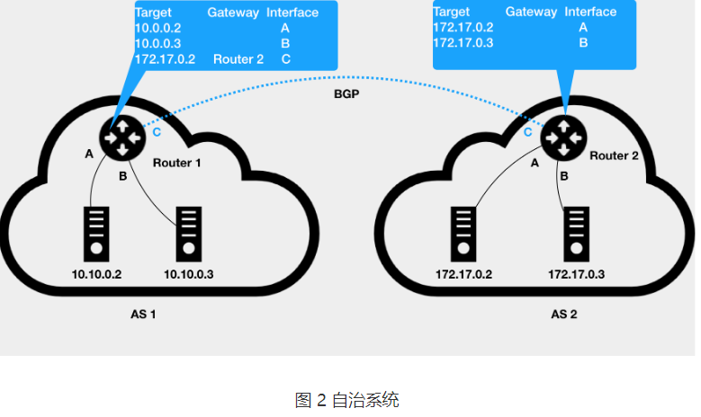

## 1. 开头


## 2. 单机网络

在前面讲解容器基础时，我曾经提到过一个 Linux 容器能看见的“网络栈”，实际上是被隔离在它自己的 Network Namespace 当中的。

而所谓“网络栈”，就包括了：网卡（Network Interface）、回环设备（Loopback Device）、路由表（Routing Table）和 iptables 规则。对于一个进程来说，这些要素，其实就构成了它发起和响应网络请求的基本环境。

需要指出的是，作为一个容器，它可以声明直接使用宿主机的网络栈（–net=host），即：不开启 Network Namespace，比如：

```
$ docker run –d –net=host --name nginx-host nginx
复制代码
```

在这种情况下，这个容器启动后，直接监听的就是宿主机的 80 端口。

像这样直接使用宿主机网络栈的方式，虽然可以为容器提供良好的网络性能，但也会不可避免地引入共享网络资源的问题，比如端口冲突。所以，**在大多数情况下，我们都希望容器进程能使用自己 Network Namespace 里的网络栈，即：拥有属于自己的 IP 地址和端口。**

这时候，一个显而易见的问题就是：这个被隔离的容器进程，该如何跟其他 Network Namespace 里的容器进程进行交互呢？

为了理解这个问题，你其实可以把每一个容器看做一台主机，它们都有一套独立的“网络栈”。

如果你想要实现两台主机之间的通信，最直接的办法，就是把它们用一根网线连接起来；而如果你想要实现多台主机之间的通信，那就需要用网线，把它们连接在一台交换机上。

在 Linux 中，能够起到虚拟交换机作用的网络设备，是网桥（Bridge）。它是一个工作在数据链路层（Data Link）的设备，主要功能是根据 MAC 地址学习来将数据包转发到网桥的不同端口（Port）上。

当然，至于为什么这些主机之间需要 MAC 地址才能进行通信，这就是网络分层模型的基础知识了。不熟悉这块内容的读者，可以通过[这篇文章](https://www.lifewire.com/layers-of-the-osi-model-illustrated-818017)来学习一下。

而为了实现上述目的，Docker 项目会默认在宿主机上创建一个名叫 docker0 的网桥，凡是连接在 docker0 网桥上的容器，就可以通过它来进行通信。

可是，我们又该如何把这些容器“连接”到 docker0 网桥上呢？

这时候，我们就需要使用一种名叫**Veth Pair**的虚拟设备了。

Veth Pair 设备的特点是：它被创建出来后，总是以两张虚拟网卡（Veth Peer）的形式成对出现的。并且，从其中一个“网卡”发出的数据包，可以直接出现在与它对应的另一张“网卡”上，哪怕这两个“网卡”在不同的 Network Namespace 里。

这就使得 Veth Pair 常常被用作连接不同 Network Namespace 的“网线”。

比如，现在我们启动了一个叫作 nginx-1 的容器：

```
$ docker run –d --name nginx-1 nginx
复制代码
```

然后进入到这个容器中查看一下它的网络设备：

```
# 在宿主机上
$ docker exec -it nginx-1 /bin/bash
# 在容器里
root@2b3c181aecf1:/# ifconfig
eth0: flags=4163<UP,BROADCAST,RUNNING,MULTICAST>  mtu 1500
        inet 172.17.0.2  netmask 255.255.0.0  broadcast 0.0.0.0
        inet6 fe80::42:acff:fe11:2  prefixlen 64  scopeid 0x20<link>
        ether 02:42:ac:11:00:02  txqueuelen 0  (Ethernet)
        RX packets 364  bytes 8137175 (7.7 MiB)
        RX errors 0  dropped 0  overruns 0  frame 0
        TX packets 281  bytes 21161 (20.6 KiB)
        TX errors 0  dropped 0 overruns 0  carrier 0  collisions 0
        
lo: flags=73<UP,LOOPBACK,RUNNING>  mtu 65536
        inet 127.0.0.1  netmask 255.0.0.0
        inet6 ::1  prefixlen 128  scopeid 0x10<host>
        loop  txqueuelen 1000  (Local Loopback)
        RX packets 0  bytes 0 (0.0 B)
        RX errors 0  dropped 0  overruns 0  frame 0
        TX packets 0  bytes 0 (0.0 B)
        TX errors 0  dropped 0 overruns 0  carrier 0  collisions 0
        
$ route
Kernel IP routing table
Destination     Gateway         Genmask         Flags Metric Ref    Use Iface
default         172.17.0.1      0.0.0.0         UG    0      0        0 eth0
172.17.0.0      0.0.0.0         255.255.0.0     U     0      0        0 eth0
```

可以看到，这个容器里有一张叫作 eth0 的网卡，它正是一个 Veth Pair 设备在容器里的这一端。

通过 route 命令查看 nginx-1 容器的路由表，我们可以看到，这个 eth0 网卡是这个容器里的默认路由设备；所有对 172.17.0.0/16 网段的请求，也会被交给 eth0 来处理（第二条 172.17.0.0 路由规则）。

而这个 Veth Pair 设备的另一端，则在宿主机上。你可以通过查看宿主机的网络设备看到它，如下所示：

```
# 在宿主机上
$ ifconfig
...
docker0   Link encap:Ethernet  HWaddr 02:42:d8:e4:df:c1  
          inet addr:172.17.0.1  Bcast:0.0.0.0  Mask:255.255.0.0
          inet6 addr: fe80::42:d8ff:fee4:dfc1/64 Scope:Link
          UP BROADCAST RUNNING MULTICAST  MTU:1500  Metric:1
          RX packets:309 errors:0 dropped:0 overruns:0 frame:0
          TX packets:372 errors:0 dropped:0 overruns:0 carrier:0
 collisions:0 txqueuelen:0 
          RX bytes:18944 (18.9 KB)  TX bytes:8137789 (8.1 MB)
veth9c02e56 Link encap:Ethernet  HWaddr 52:81:0b:24:3d:da  
          inet6 addr: fe80::5081:bff:fe24:3dda/64 Scope:Link
          UP BROADCAST RUNNING MULTICAST  MTU:1500  Metric:1
          RX packets:288 errors:0 dropped:0 overruns:0 frame:0
          TX packets:371 errors:0 dropped:0 overruns:0 carrier:0
 collisions:0 txqueuelen:0 
          RX bytes:21608 (21.6 KB)  TX bytes:8137719 (8.1 MB)
          
$ brctl show
bridge name bridge id  STP enabled interfaces
docker0  8000.0242d8e4dfc1 no  veth9c02e56
```

通过 ifconfig 命令的输出，你可以看到，nginx-1 容器对应的 Veth Pair 设备，在宿主机上是一张虚拟网卡。它的名字叫作 veth9c02e56。并且，通过 brctl show 的输出，你可以看到这张网卡被“插”在了 docker0 上。

这时候，如果我们再在这台宿主机上启动另一个 Docker 容器，比如 nginx-2：

```
$ docker run –d --name nginx-2 nginx
$ brctl show
bridge name bridge id  STP enabled interfaces
docker0  8000.0242d8e4dfc1 no  veth9c02e56
       vethb4963f3
```

你就会发现一个新的、名叫 vethb4963f3 的虚拟网卡，也被“插”在了 docker0 网桥上。

这时候，如果你在 nginx-1 容器里 ping 一下 nginx-2 容器的 IP 地址（172.17.0.3），就会发现同一宿主机上的两个容器默认就是相互连通的。

这其中的原理其实非常简单，我来解释一下。

当你在 nginx-1 容器里访问 nginx-2 容器的 IP 地址（比如 ping 172.17.0.3）的时候，这个目的 IP 地址会匹配到 nginx-1 容器里的第二条路由规则。可以看到，这条路由规则的网关（Gateway）是 0.0.0.0，这就意味着这是一条直连规则，即：凡是匹配到这条规则的 IP 包，应该经过本机的 eth0 网卡，通过二层网络直接发往目的主机。

而要通过二层网络到达 nginx-2 容器，就需要有 172.17.0.3 这个 IP 地址对应的 MAC 地址。所以 nginx-1 容器的网络协议栈，就需要通过 eth0 网卡发送一个 ARP 广播，来通过 IP 地址查找对应的 MAC 地址。

> 备注：ARP（Address Resolution Protocol），是通过三层的 IP 地址找到对应的二层 MAC 地址的协议。

我们前面提到过，这个 eth0 网卡，是一个 Veth Pair，它的一端在这个 nginx-1 容器的 Network Namespace 里，而另一端则位于宿主机上（Host Namespace），并且被“插”在了宿主机的 docker0 网桥上。

一旦一张虚拟网卡被“插”在网桥上，它就会变成该网桥的“从设备”。从设备会被“剥夺”调用网络协议栈处理数据包的资格，从而“降级”成为网桥上的一个端口。而这个端口唯一的作用，就是接收流入的数据包，然后把这些数据包的“生杀大权”（比如转发或者丢弃），全部交给对应的网桥。

所以，在收到这些 ARP 请求之后，docker0 网桥就会扮演二层交换机的角色，把 ARP 广播转发到其他被“插”在 docker0 上的虚拟网卡上。这样，同样连接在 docker0 上的 nginx-2 容器的网络协议栈就会收到这个 ARP 请求，从而将 172.17.0.3 所对应的 MAC 地址回复给 nginx-1 容器。

有了这个目的 MAC 地址，nginx-1 容器的 eth0 网卡就可以将数据包发出去。

而根据 Veth Pair 设备的原理，这个数据包会立刻出现在宿主机上的 veth9c02e56 虚拟网卡上。不过，此时这个 veth9c02e56 网卡的网络协议栈的资格已经被“剥夺”，所以这个数据包就直接流入到了 docker0 网桥里。

docker0 处理转发的过程，则继续扮演二层交换机的角色。此时，docker0 网桥根据数据包的目的 MAC 地址（也就是 nginx-2 容器的 MAC 地址），在它的 CAM 表（即交换机通过 MAC 地址学习维护的端口和 MAC 地址的对应表）里查到对应的端口（Port）为：vethb4963f3，然后把数据包发往这个端口。

而这个端口，正是 nginx-2 容器“插”在 docker0 网桥上的另一块虚拟网卡，当然，它也是一个 Veth Pair 设备。这样，数据包就进入到了 nginx-2 容器的 Network Namespace 里。

所以，nginx-2 容器看到的情况是，它自己的 eth0 网卡上出现了流入的数据包。这样，nginx-2 的网络协议栈就会对请求进行处理，最后将响应（Pong）返回到 nginx-1。

以上，就是同一个宿主机上的不同容器通过 docker0 网桥进行通信的流程了。我把这个流程总结成了一幅示意图，如下所示：

 

需要注意的是，在实际的数据传递时，上述数据的传递过程在网络协议栈的不同层次，都有 Linux 内核 Netfilter 参与其中。所以，如果感兴趣的话，你可以通过打开 iptables 的 TRACE 功能查看到数据包的传输过程，具体方法如下所示：

```
# 在宿主机上执行
$ iptables -t raw -A OUTPUT -p icmp -j TRACE
$ iptables -t raw -A PREROUTING -p icmp -j TRACE
```

通过上述设置，你就可以在 /var/log/syslog 里看到数据包传输的日志了。这一部分内容，你可以在课后结合[iptables 的相关知识](https://en.wikipedia.org/wiki/Iptables)进行实践，从而验证我和你分享的数据包传递流程。

熟悉了 docker0 网桥的工作方式，你就可以理解，在默认情况下，**被限制在 Network Namespace 里的容器进程，实际上是通过 Veth Pair 设备 + 宿主机网桥的方式，实现了跟同其他容器的数据交换。**

与之类似地，当你在一台宿主机上，访问该宿主机上的容器的 IP 地址时，这个请求的数据包，也是先根据路由规则到达 docker0 网桥，然后被转发到对应的 Veth Pair 设备，最后出现在容器里。这个过程的示意图，如下所示：

 

同样地，当一个容器试图连接到另外一个宿主机时，比如：ping 10.168.0.3，它发出的请求数据包，首先经过 docker0 网桥出现在宿主机上。然后根据宿主机的路由表里的直连路由规则（10.168.0.0/24 via eth0)），对 10.168.0.3 的访问请求就会交给宿主机的 eth0 处理。

所以接下来，这个数据包就会经宿主机的 eth0 网卡转发到宿主机网络上，最终到达 10.168.0.3 对应的宿主机上。当然，这个过程的实现要求这两台宿主机本身是连通的。这个过程的示意图，如下所示：

 

所以说，**当你遇到容器连不通“外网”的时候，你都应该先试试 docker0 网桥能不能 ping 通，然后查看一下跟 docker0 和 Veth Pair 设备相关的 iptables 规则是不是有异常，往往就能够找到问题的答案了。**

不过，在最后一个“Docker 容器连接其他宿主机”的例子里，你可能已经联想到了这样一个问题：如果在另外一台宿主机（比如：10.168.0.3）上，也有一个 Docker 容器。那么，我们的 nginx-1 容器又该如何访问它呢？

这个问题，其实就是容器的“跨主通信”问题。

在 Docker 的默认配置下，一台宿主机上的 docker0 网桥，和其他宿主机上的 docker0 网桥，没有任何关联，它们互相之间也没办法连通。所以，连接在这些网桥上的容器，自然也没办法进行通信了。

不过，万变不离其宗。

如果我们通过软件的方式，创建一个整个集群“公用”的网桥，然后把集群里的所有容器都连接到这个网桥上，不就可以相互通信了吗？

说得没错。

这样一来，我们整个集群里的容器网络就会类似于下图所示的样子：

 

可以看到，构建这种容器网络的核心在于：我们需要在已有的宿主机网络上，再通过软件构建一个覆盖在已有宿主机网络之上的、可以把所有容器连通在一起的虚拟网络。所以，这种技术就被称为：Overlay Network（覆盖网络）。

而这个 Overlay Network 本身，可以由每台宿主机上的一个“特殊网桥”共同组成。比如，当 Node 1 上的 Container 1 要访问 Node 2 上的 Container 3 的时候，Node 1 上的“特殊网桥”在收到数据包之后，能够通过某种方式，把数据包发送到正确的宿主机，比如 Node 2 上。而 Node 2 上的“特殊网桥”在收到数据包后，也能够通过某种方式，把数据包转发给正确的容器，比如 Container 3。

甚至，每台宿主机上，都不需要有一个这种特殊的网桥，而仅仅通过某种方式配置宿主机的路由表，就能够把数据包转发到正确的宿主机上。这些内容，我在后面的文章中会为你一一讲述。

#### 总结

在今天这篇文章中，我主要为你介绍了在本地环境下，单机容器网络的实现原理和 docker0 网桥的作用。

这里的关键在于，容器要想跟外界进行通信，它发出的 IP 包就必须从它的 Network Namespace 里出来，来到宿主机上。

而解决这个问题的方法就是：为容器创建一个一端在容器里充当默认网卡、另一端在宿主机上的 Veth Pair 设备。

上述单机容器网络的知识，是后面我们讲解多机容器网络的重要基础，请务必认真消化理解。

## 3. 跨主机网络

我为你详细讲解了在单机环境下，Linux 容器网络的实现原理（网桥模式）。并且提到了，在 Docker 的默认配置下，不同宿主机上的容器通过 IP 地址进行互相访问是根本做不到的。

而正是为了解决这个容器“跨主通信”的问题，社区里才出现了那么多的容器网络方案。而且，相信你一直以来都有这样的疑问：这些网络方案的工作原理到底是什么？

要理解容器“跨主通信”的原理，就一定要先从 Flannel 这个项目说起。

Flannel 项目是 CoreOS 公司主推的容器网络方案。事实上，Flannel 项目本身只是一个框架，真正为我们提供容器网络功能的，是 Flannel 的后端实现。目前，Flannel 支持三种后端实现，分别是：

- VXLAN；
- host-gw；
- UDP。

这三种不同的后端实现，正代表了三种容器跨主网络的主流实现方法。其中，host-gw 模式，我会在下一篇文章中再做详细介绍。

### 3.1. UDP

而 UDP 模式，是 Flannel 项目最早支持的一种方式，却也是性能最差的一种方式。所以，这个模式目前已经被弃用。不过，Flannel 之所以最先选择 UDP 模式，就是因为这种模式是最直接、也是最容易理解的容器跨主网络实现。

所以，在今天这篇文章中，我会先从 UDP 模式开始，来为你讲解容器“跨主网络”的实现原理。

在这个例子中，我有两台宿主机。

- 宿主机 Node 1 上有一个容器 container-1，它的 IP 地址是 100.96.1.2，对应的 docker0 网桥的地址是：100.96.1.1/24。
- 宿主机 Node 2 上有一个容器 container-2，它的 IP 地址是 100.96.2.3，对应的 docker0 网桥的地址是：100.96.2.1/24。

我们现在的任务，就是让 container-1 访问 container-2。

这种情况下，container-1 容器里的进程发起的 IP 包，其源地址就是 100.96.1.2，目的地址就是 100.96.2.3。由于目的地址 100.96.2.3 并不在 Node 1 的 docker0 网桥的网段里，所以这个 IP 包会被交给默认路由规则，通过容器的网关进入 docker0 网桥（如果是同一台宿主机上的容器间通信，走的是直连规则），从而出现在宿主机上。

这时候，这个 IP 包的下一个目的地，就取决于宿主机上的路由规则了。此时，Flannel 已经在宿主机上创建出了一系列的路由规则，以 Node 1 为例，如下所示：

```
# 在 Node 1 上
$ ip route
default via 10.168.0.1 dev eth0
100.96.0.0/16 dev flannel0  proto kernel  scope link  src 100.96.1.0
100.96.1.0/24 dev docker0  proto kernel  scope link  src 100.96.1.1
10.168.0.0/24 dev eth0  proto kernel  scope link  src 10.168.0.2
```

可以看到，由于我们的 IP 包的目的地址是 100.96.2.3，它匹配不到本机 docker0 网桥对应的 100.96.1.0/24 网段，只能匹配到第二条、也就是 100.96.0.0/16 对应的这条路由规则，从而进入到一个叫作 flannel0 的设备中。

而这个 flannel0 设备的类型就比较有意思了：它是一个 TUN 设备（Tunnel 设备）。

在 Linux 中，TUN 设备是一种工作在三层（Network Layer）的虚拟网络设备。TUN 设备的功能非常简单，即：**在操作系统内核和用户应用程序之间传递 IP 包。**

以 flannel0 设备为例：

像上面提到的情况，当操作系统将一个 IP 包发送给 flannel0 设备之后，flannel0 就会把这个 IP 包，交给创建这个设备的应用程序，也就是 Flannel 进程。这是一个从内核态（Linux 操作系统）向用户态（Flannel 进程）的流动方向。

反之，如果 Flannel 进程向 flannel0 设备发送了一个 IP 包，那么这个 IP 包就会出现在宿主机网络栈中，然后根据宿主机的路由表进行下一步处理。这是一个从用户态向内核态的流动方向。

所以，当 IP 包从容器经过 docker0 出现在宿主机，然后又根据路由表进入 flannel0 设备后，宿主机上的 flanneld 进程（Flannel 项目在每个宿主机上的主进程），就会收到这个 IP 包。然后，flanneld 看到了这个 IP 包的目的地址，是 100.96.2.3，就把它发送给了 Node 2 宿主机。

等一下，**flanneld 又是如何知道这个 IP 地址对应的容器，是运行在 Node 2 上的呢？**

这里，就用到了 Flannel 项目里一个非常重要的概念：子网（Subnet）。

事实上，在由 Flannel 管理的容器网络里，一台宿主机上的所有容器，都属于该宿主机被分配的一个“子网”。在我们的例子中，Node 1 的子网是 100.96.1.0/24，container-1 的 IP 地址是 100.96.1.2。Node 2 的子网是 100.96.2.0/24，container-2 的 IP 地址是 100.96.2.3。

而这些子网与宿主机的对应关系，正是保存在 Etcd 当中，如下所示：

```
$ etcdctl ls /coreos.com/network/subnets
/coreos.com/network/subnets/100.96.1.0-24
/coreos.com/network/subnets/100.96.2.0-24
/coreos.com/network/subnets/100.96.3.0-24
```

所以，flanneld 进程在处理由 flannel0 传入的 IP 包时，就可以根据目的 IP 的地址（比如 100.96.2.3），匹配到对应的子网（比如 100.96.2.0/24），从 Etcd 中找到这个子网对应的宿主机的 IP 地址是 10.168.0.3，如下所示：

```
$ etcdctl get /coreos.com/network/subnets/100.96.2.0-24
{"PublicIP":"10.168.0.3"}
```

而对于 flanneld 来说，只要 Node 1 和 Node 2 是互通的，那么 flanneld 作为 Node 1 上的一个普通进程，就一定可以通过上述 IP 地址（10.168.0.3）访问到 Node 2，这没有任何问题。

所以说，flanneld 在收到 container-1 发给 container-2 的 IP 包之后，就会把这个 IP 包直接封装在一个 UDP 包里，然后发送给 Node 2。不难理解，这个 UDP 包的源地址，就是 flanneld 所在的 Node 1 的地址，而目的地址，则是 container-2 所在的宿主机 Node 2 的地址。

当然，这个请求得以完成的原因是，每台宿主机上的 flanneld，都监听着一个 8285 端口，所以 flanneld 只要把 UDP 包发往 Node 2 的 8285 端口即可。

通过这样一个普通的、宿主机之间的 UDP 通信，一个 UDP 包就从 Node 1 到达了 Node 2。而 Node 2 上监听 8285 端口的进程也是 flanneld，所以这时候，flanneld 就可以从这个 UDP 包里解析出封装在里面的、container-1 发来的原 IP 包。

而接下来 flanneld 的工作就非常简单了：flanneld 会直接把这个 IP 包发送给它所管理的 TUN 设备，即 flannel0 设备。

根据我前面讲解的 TUN 设备的原理，这正是一个从用户态向内核态的流动方向（Flannel 进程向 TUN 设备发送数据包），所以 Linux 内核网络栈就会负责处理这个 IP 包，具体的处理方法，就是通过本机的路由表来寻找这个 IP 包的下一步流向。

而 Node 2 上的路由表，跟 Node 1 非常类似，如下所示：

```
# 在 Node 2 上
$ ip route
default via 10.168.0.1 dev eth0
100.96.0.0/16 dev flannel0  proto kernel  scope link  src 100.96.2.0
100.96.2.0/24 dev docker0  proto kernel  scope link  src 100.96.2.1
10.168.0.0/24 dev eth0  proto kernel  scope link  src 10.168.0.3
```

由于这个 IP 包的目的地址是 100.96.2.3，它跟第三条、也就是 100.96.2.0/24 网段对应的路由规则匹配更加精确。所以，Linux 内核就会按照这条路由规则，把这个 IP 包转发给 docker0 网桥。

接下来的流程，就如同我在上一篇文章[《浅谈容器网络》](https://time.geekbang.org/column/article/64948)中和你分享的那样，docker0 网桥会扮演二层交换机的角色，将数据包发送给正确的端口，进而通过 Veth Pair 设备进入到 container-2 的 Network Namespace 里。

而 container-2 返回给 container-1 的数据包，则会经过与上述过程完全相反的路径回到 container-1 中。

需要注意的是，上述流程要正确工作还有一个重要的前提，那就是 docker0 网桥的地址范围必须是 Flannel 为宿主机分配的子网。这个很容易实现，以 Node 1 为例，你只需要给它上面的 Docker Daemon 启动时配置如下所示的 bip 参数即可：

```
$ FLANNEL_SUBNET=100.96.1.1/24
$ dockerd --bip=$FLANNEL_SUBNET ...
```

以上，就是基于 Flannel UDP 模式的跨主通信的基本原理了。我把它总结成了一幅原理图，如下所示。

 

可以看到，Flannel UDP 模式提供的其实是一个三层的 Overlay 网络，即：它首先对发出端的 IP 包进行 UDP 封装，然后在接收端进行解封装拿到原始的 IP 包，进而把这个 IP 包转发给目标容器。这就好比，Flannel 在不同宿主机上的两个容器之间打通了一条“隧道”，使得这两个容器可以直接使用 IP 地址进行通信，而无需关心容器和宿主机的分布情况。

我前面曾经提到，上述 UDP 模式有严重的性能问题，所以已经被废弃了。通过我上面的讲述，你有没有发现性能问题出现在了哪里呢？

实际上，相比于两台宿主机之间的直接通信，基于 Flannel UDP 模式的容器通信多了一个额外的步骤，即 flanneld 的处理过程。而这个过程，由于使用到了 flannel0 这个 TUN 设备，仅在发出 IP 包的过程中，就需要经过三次用户态与内核态之间的数据拷贝，如下所示：

 

我们可以看到：

第一次：用户态的容器进程发出的 IP 包经过 docker0 网桥进入内核态；

第二次：IP 包根据路由表进入 TUN（flannel0）设备，从而回到用户态的 flanneld 进程；

第三次：flanneld 进行 UDP 封包之后重新进入内核态，将 UDP 包通过宿主机的 eth0 发出去。

此外，我们还可以看到，Flannel 进行 UDP 封装（Encapsulation）和解封装（Decapsulation）的过程，也都是在用户态完成的。在 Linux 操作系统中，上述这些上下文切换和用户态操作的代价其实是比较高的，这也正是造成 Flannel UDP 模式性能不好的主要原因。

所以说，**我们在进行系统级编程的时候，有一个非常重要的优化原则，就是要减少用户态到内核态的切换次数，并且把核心的处理逻辑都放在内核态进行**。这也是为什么，Flannel 后来支持的VXLAN 模式，逐渐成为了主流的容器网络方案的原因。

### 3.2. VXLAN

VXLAN，即 Virtual Extensible LAN（虚拟可扩展局域网），是 Linux 内核本身就支持的一种网络虚似化技术。所以说，VXLAN 可以完全在内核态实现上述封装和解封装的工作，从而通过与前面相似的“隧道”机制，构建出覆盖网络（Overlay Network）。

VXLAN 的覆盖网络的设计思想是：在现有的三层网络之上，“覆盖”一层虚拟的、由内核 VXLAN 模块负责维护的二层网络，使得连接在这个 VXLAN 二层网络上的“主机”（虚拟机或者容器都可以）之间，可以像在同一个局域网（LAN）里那样自由通信。当然，实际上，这些“主机”可能分布在不同的宿主机上，甚至是分布在不同的物理机房里。

而为了能够在二层网络上打通“隧道”，VXLAN 会在宿主机上设置一个特殊的网络设备作为“隧道”的两端。这个设备就叫作 VTEP，即：VXLAN Tunnel End Point（虚拟隧道端点）。

而 VTEP 设备的作用，其实跟前面的 flanneld 进程非常相似。只不过，它进行封装和解封装的对象，是二层数据帧（Ethernet frame）；而且这个工作的执行流程，全部是在内核里完成的（因为 VXLAN 本身就是 Linux 内核中的一个模块）。

上述基于 VTEP 设备进行“隧道”通信的流程，我也为你总结成了一幅图，如下所示：

 

可以看到，图中每台宿主机上名叫 flannel.1 的设备，就是 VXLAN 所需的 VTEP 设备，它既有 IP 地址，也有 MAC 地址。

现在，我们的 container-1 的 IP 地址是 10.1.15.2，要访问的 container-2 的 IP 地址是 10.1.16.3。

那么，与前面 UDP 模式的流程类似，当 container-1 发出请求之后，这个目的地址是 10.1.16.3 的 IP 包，会先出现在 docker0 网桥，然后被路由到本机 flannel.1 设备进行处理。也就是说，来到了“隧道”的入口。为了方便叙述，我接下来会把这个 IP 包称为“原始 IP 包”。

为了能够将“原始 IP 包”封装并且发送到正确的宿主机，VXLAN 就需要找到这条“隧道”的出口，即：目的宿主机的 VTEP 设备。

而这个设备的信息，正是每台宿主机上的 flanneld 进程负责维护的。

比如，当 Node 2 启动并加入 Flannel 网络之后，在 Node 1（以及所有其他节点）上，flanneld 就会添加一条如下所示的路由规则：

```
$ route -n
Kernel IP routing table
Destination     Gateway         Genmask         Flags Metric Ref    Use Iface
...
10.1.16.0       10.1.16.0       255.255.255.0   UG    0      0        0 flannel.1
```

这条规则的意思是：凡是发往 10.1.16.0/24 网段的 IP 包，都需要经过 flannel.1 设备发出，并且，它最后被发往的网关地址是：10.1.16.0。

从图 3 的 Flannel VXLAN 模式的流程图中我们可以看到，10.1.16.0 正是 Node 2 上的 VTEP 设备（也就是 flannel.1 设备）的 IP 地址。

为了方便叙述，接下来我会把 Node 1 和 Node 2 上的 flannel.1 设备分别称为“源 VTEP 设备”和“目的 VTEP 设备”。

而这些 VTEP 设备之间，就需要想办法组成一个虚拟的二层网络，即：通过二层数据帧进行通信。

所以在我们的例子中，“源 VTEP 设备”收到“原始 IP 包”后，就要想办法把“原始 IP 包”加上一个目的 MAC 地址，封装成一个二层数据帧，然后发送给“目的 VTEP 设备”（当然，这么做还是因为这个 IP 包的目的地址不是本机）。

这里需要解决的问题就是：**“目的 VTEP 设备”的 MAC 地址是什么？**

此时，根据前面的路由记录，我们已经知道了“目的 VTEP 设备”的 IP 地址。而要根据三层 IP 地址查询对应的二层 MAC 地址，这正是 ARP（Address Resolution Protocol ）表的功能。

而这里要用到的 ARP 记录，也是 flanneld 进程在 Node 2 节点启动时，自动添加在 Node 1 上的。我们可以通过 ip 命令看到它，如下所示：

```
# 在 Node 1 上
$ ip neigh show dev flannel.1
10.1.16.0 lladdr 5e:f8:4f:00:e3:37 PERMANENT
```

这条记录的意思非常明确，即：IP 地址 10.1.16.0，对应的 MAC 地址是 5e:f8:4f:00:e3:37。

> 可以看到，最新版本的 Flannel 并不依赖 L3 MISS 事件和 ARP 学习，而会在每台节点启动时把它的 VTEP 设备对应的 ARP 记录，直接下放到其他每台宿主机上。

有了这个“目的 VTEP 设备”的 MAC 地址，**Linux 内核就可以开始二层封包工作了**。这个二层帧的格式，如下所示：

 

可以看到，Linux 内核会把“目的 VTEP 设备”的 MAC 地址，填写在图中的 Inner Ethernet Header 字段，得到一个二层数据帧。

需要注意的是，上述封包过程只是加一个二层头，不会改变“原始 IP 包”的内容。所以图中的 Inner IP Header 字段，依然是 container-2 的 IP 地址，即 10.1.16.3。

但是，上面提到的这些 VTEP 设备的 MAC 地址，对于宿主机网络来说并没有什么实际意义。所以上面封装出来的这个数据帧，并不能在我们的宿主机二层网络里传输。为了方便叙述，我们把它称为“内部数据帧”（Inner Ethernet Frame）。

所以接下来，Linux 内核还需要再把“内部数据帧”进一步封装成为宿主机网络里的一个普通的数据帧，好让它“载着”“内部数据帧”，通过宿主机的 eth0 网卡进行传输。

我们把这次要封装出来的、宿主机对应的数据帧称为“外部数据帧”（Outer Ethernet Frame）。

为了实现这个“搭便车”的机制，Linux 内核会在“内部数据帧”前面，加上一个特殊的 VXLAN 头，用来表示这个“乘客”实际上是一个 VXLAN 要使用的数据帧。

而这个 VXLAN 头里有一个重要的标志叫作**VNI**，它是 VTEP 设备识别某个数据帧是不是应该归自己处理的重要标识。而在 Flannel 中，VNI 的默认值是 1，这也是为何，宿主机上的 VTEP 设备都叫作 flannel.1 的原因，这里的“1”，其实就是 VNI 的值。

**然后，Linux 内核会把这个数据帧封装进一个 UDP 包里发出去。**

所以，跟 UDP 模式类似，在宿主机看来，它会以为自己的 flannel.1 设备只是在向另外一台宿主机的 flannel.1 设备，发起了一次普通的 UDP 链接。它哪里会知道，这个 UDP 包里面，其实是一个完整的二层数据帧。这是不是跟特洛伊木马的故事非常像呢？

不过，不要忘了，一个 flannel.1 设备只知道另一端的 flannel.1 设备的 MAC 地址，却不知道对应的宿主机地址是什么。

也就是说，这个 UDP 包该发给哪台宿主机呢？

在这种场景下，flannel.1 设备实际上要扮演一个“网桥”的角色，在二层网络进行 UDP 包的转发。而在 Linux 内核里面，“网桥”设备进行转发的依据，来自于一个叫作 FDB（Forwarding Database）的转发数据库。

不难想到，这个 flannel.1“网桥”对应的 FDB 信息，也是 flanneld 进程负责维护的。它的内容可以通过 bridge fdb 命令查看到，如下所示：

```
# 在 Node 1 上，使用“目的 VTEP 设备”的 MAC 地址进行查询
$ bridge fdb show flannel.1 | grep 5e:f8:4f:00:e3:37
5e:f8:4f:00:e3:37 dev flannel.1 dst 10.168.0.3 self permanent
```

可以看到，在上面这条 FDB 记录里，指定了这样一条规则，即：

发往我们前面提到的“目的 VTEP 设备”（MAC 地址是 5e:f8:4f:00:e3:37）的二层数据帧，应该通过 flannel.1 设备，发往 IP 地址为 10.168.0.3 的主机。显然，这台主机正是 Node 2，UDP 包要发往的目的地就找到了。

所以**接下来的流程，就是一个正常的、宿主机网络上的封包工作。**

我们知道，UDP 包是一个四层数据包，所以 Linux 内核会在它前面加上一个 IP 头，即原理图中的 Outer IP Header，组成一个 IP 包。并且，在这个 IP 头里，会填上前面通过 FDB 查询出来的目的主机的 IP 地址，即 Node 2 的 IP 地址 10.168.0.3。

然后，Linux 内核再在这个 IP 包前面加上二层数据帧头，即原理图中的 Outer Ethernet Header，并把 Node 2 的 MAC 地址填进去。这个 MAC 地址本身，是 Node 1 的 ARP 表要学习的内容，无需 Flannel 维护。这时候，我们封装出来的“外部数据帧”的格式，如下所示： 

 

这样，封包工作就宣告完成了。

接下来，Node 1 上的 flannel.1 设备就可以把这个数据帧从 Node 1 的 eth0 网卡发出去。显然，这个帧会经过宿主机网络来到 Node 2 的 eth0 网卡。

这时候，Node 2 的内核网络栈会发现这个数据帧里有 VXLAN Header，并且 VNI=1。所以 Linux 内核会对它进行拆包，拿到里面的内部数据帧，然后根据 VNI 的值，把它交给 Node 2 上的 flannel.1 设备。

而 flannel.1 设备则会进一步拆包，取出“原始 IP 包”。接下来就回到了我在上一篇文章中分享的单机容器网络的处理流程。最终，IP 包就进入到了 container-2 容器的 Network Namespace 里。

以上，就是 Flannel VXLAN 模式的具体工作原理了。

#### 总结

在本篇文章中，我为你详细讲解了 Flannel UDP 和 VXLAN 模式的工作原理。这两种模式其实都可以称作“隧道”机制，也是很多其他容器网络插件的基础。比如 Weave 的两种模式，以及 Docker 的 Overlay 模式。

此外，从上面的讲解中我们可以看到，VXLAN 模式组建的覆盖网络，其实就是一个由不同宿主机上的 VTEP 设备，也就是 flannel.1 设备组成的虚拟二层网络。对于 VTEP 设备来说，它发出的“内部数据帧”就仿佛是一直在这个虚拟的二层网络上流动。这，也正是覆盖网络的含义。

> 备注：如果你想要在我们前面部署的集群中实践 Flannel 的话，可以在 Master 节点上执行如下命令来替换网络插件。
> 第一步，执行``
>
> ```
> MY_ZUES_CHAR
> rm -rf /etc/cni/net.d/*
> ```
>
> ；
>
> 第二步，执行
>
> ```
> $ kubectl delete -f "https://cloud.weave.works/k8s/net?k8s-version=1.11"
> ```
>
> ；
>
> 第三步，在
>
> ```
> /etc/kubernetes/manifests/kube-controller-manager.yaml
> ```
>
> 里，为容器启动命令添加如下两个参数：
>
> ```
> --allocate-node-cidrs=true
> --cluster-cidr=10.244.0.0/16
> ```
>
> 第四步， 重启所有 kubelet；
>
> 第五步， 执行
>
> ```
> $ kubectl create -f https://raw.githubusercontent.com/coreos/flannel/bc79dd1505b0c8681ece4de4c0d86c5cd2643275/Documentation/kube-flannel.yml
> ```
>
> 。

PS：这里使用UDP，不需要可靠，因为可靠性不是这一层需要考虑的事情，这一层需要考虑的事情就是把这个包发送到目标地址。如果出现了UDP丢包的情况，也完全没有关系，这里UDP包裹的是我们真正的数据包，如果我们上层使用的是TCP协议，而Flannel使用UDP包裹了我们的数据包，当出现丢包了，TCP的确认机制会发现这个丢包而重传，从而保证可靠


这个和一般的网络传输不同，一般的网络传输会直接请求ip地址，根据ip地址，发送ARP请求来获取下一跳设备的mac地址，获取mac地址之后会缓存下来，这是一般路由器或者网桥做的事情。但在容器网络里我们只知道目标容器的ip地址，并不知道宿主机的ip地址，需要将容器的ip地址和宿主机的ip地址关联起来。这个关系由路由规则, fdb存储的数据和ARP记录下来，这些都是在创建node节点的时候，由各个节点的flanneld创建出来。通过路由规则知道了该将数据包发送到flannel.1这个vtep设备处理并且知道了目地vtep的ip地址，通过vtep IP地址ip neigh show dev flannel.1 找到了对端的vtep mac地址，通过对端vtep mac地址查询 bridge fdb list 查到了这个mac地址对应的宿主机地址。 这样封装出包之后按照vxlan逻辑进行正常发送

各个node会将自己的vtep信息上报给apiserver，apiserver将信息同步给各个节点的flanneld，flanneld通过netlink下发，完成信息的同步

### 3.3. CNI

用户的容器都连接在 docker0 网桥上。而网络插件则在宿主机上创建了一个特殊的设备（UDP 模式创建的是 TUN 设备，VXLAN 模式创建的则是 VTEP 设备），docker0 与这个设备之间，通过 IP 转发（路由表）进行协作。

然后，网络插件真正要做的事情，则是通过某种方法，把不同宿主机上的特殊设备连通，从而达到容器跨主机通信的目的。

实际上，上面这个流程，也正是 Kubernetes 对容器网络的主要处理方法。只不过，Kubernetes 是通过一个叫作 CNI 的接口，维护了一个单独的网桥来代替 docker0。这个网桥的名字就叫作：CNI 网桥，它在宿主机上的设备名称默认是：cni0。

以 Flannel 的 VXLAN 模式为例，在 Kubernetes 环境里，它的工作方式跟我们在上一篇文章中讲解的没有任何不同。只不过，docker0 网桥被替换成了 CNI 网桥而已，如下所示：

 

在这里，Kubernetes 为 Flannel 分配的子网范围是 10.244.0.0/16。这个参数可以在部署的时候指定，比如：

```
$ kubeadm init --pod-network-cidr=10.244.0.0/16
复制代码
```

也可以在部署完成后，通过修改 kube-controller-manager 的配置文件来指定。

这时候，假设 Infra-container-1 要访问 Infra-container-2（也就是 Pod-1 要访问 Pod-2），这个 IP 包的源地址就是 10.244.0.2，目的 IP 地址是 10.244.1.3。而此时，Infra-container-1 里的 eth0 设备，同样是以 Veth Pair 的方式连接在 Node 1 的 cni0 网桥上。所以这个 IP 包就会经过 cni0 网桥出现在宿主机上。

此时，Node 1 上的路由表，如下所示：

```
# 在 Node 1 上
$ route -n
Kernel IP routing table
Destination     Gateway         Genmask         Flags Metric Ref    Use Iface
...
10.244.0.0      0.0.0.0         255.255.255.0   U     0      0        0 cni0
10.244.1.0      10.244.1.0      255.255.255.0   UG    0      0        0 flannel.1
172.17.0.0      0.0.0.0         255.255.0.0     U     0      0        0 docker0
```

因为我们的 IP 包的目的 IP 地址是 10.244.1.3，所以它只能匹配到第二条规则，也就是 10.244.1.0 对应的这条路由规则。

可以看到，这条规则指定了本机的 flannel.1 设备进行处理。并且，flannel.1 在处理完后，要将 IP 包转发到的网关（Gateway），正是“隧道”另一端的 VTEP 设备，也就是 Node 2 的 flannel.1 设备。所以，接下来的流程，就跟上一篇文章中介绍过的 Flannel VXLAN 模式完全一样了。

需要注意的是，CNI 网桥只是接管所有 CNI 插件负责的、即 Kubernetes 创建的容器（Pod）。而此时，如果你用 docker run 单独启动一个容器，那么 Docker 项目还是会把这个容器连接到 docker0 网桥上。所以这个容器的 IP 地址，一定是属于 docker0 网桥的 172.17.0.0/16 网段。

Kubernetes 之所以要设置这样一个与 docker0 网桥功能几乎一样的 CNI 网桥，主要原因包括两个方面：

- 一方面，Kubernetes 项目并没有使用 Docker 的网络模型（CNM），所以它并不希望、也不具备配置 docker0 网桥的能力；
- 另一方面，这还与 Kubernetes 如何配置 Pod，也就是 Infra 容器的 Network Namespace 密切相关。

我们知道，Kubernetes 创建一个 Pod 的第一步，就是创建并启动一个 Infra 容器，用来“hold”住这个 Pod 的 Network Namespace（这里，你可以再回顾一下专栏第 13 篇文章[《为什么我们需要 Pod？》](https://time.geekbang.org/column/article/40092)中的相关内容）。

所以，CNI 的设计思想，就是：**Kubernetes 在启动 Infra 容器之后，就可以直接调用 CNI 网络插件，为这个 Infra 容器的 Network Namespace，配置符合预期的网络栈。**

> 备注：在前面第 32 篇文章[《浅谈容器网络》](https://time.geekbang.org/column/article/64948)中，我讲解单机容器网络时，已经和你分享过，一个 Network Namespace 的网络栈包括：网卡（Network Interface）、回环设备（Loopback Device）、路由表（Routing Table）和 iptables 规则。

那么，这个网络栈的配置工作又是如何完成的呢？

为了回答这个问题，我们就需要从 CNI 插件的部署和实现方式谈起了。

我们在部署 Kubernetes 的时候，有一个步骤是安装 kubernetes-cni 包，它的目的就是在宿主机上安装**CNI 插件所需的基础可执行文件**。

在安装完成后，你可以在宿主机的 /opt/cni/bin 目录下看到它们，如下所示：

```
$ ls -al /opt/cni/bin/
total 73088
-rwxr-xr-x 1 root root  3890407 Aug 17  2017 bridge
-rwxr-xr-x 1 root root  9921982 Aug 17  2017 dhcp
-rwxr-xr-x 1 root root  2814104 Aug 17  2017 flannel
-rwxr-xr-x 1 root root  2991965 Aug 17  2017 host-local
-rwxr-xr-x 1 root root  3475802 Aug 17  2017 ipvlan
-rwxr-xr-x 1 root root  3026388 Aug 17  2017 loopback
-rwxr-xr-x 1 root root  3520724 Aug 17  2017 macvlan
-rwxr-xr-x 1 root root  3470464 Aug 17  2017 portmap
-rwxr-xr-x 1 root root  3877986 Aug 17  2017 ptp
-rwxr-xr-x 1 root root  2605279 Aug 17  2017 sample
-rwxr-xr-x 1 root root  2808402 Aug 17  2017 tuning
-rwxr-xr-x 1 root root  3475750 Aug 17  2017 vlan
```

这些 CNI 的基础可执行文件，按照功能可以分为三类：

**第一类，叫作 Main 插件，它是用来创建具体网络设备的二进制文件**。比如，bridge（网桥设备）、ipvlan、loopback（lo 设备）、macvlan、ptp（Veth Pair 设备），以及 vlan。

我在前面提到过的 Flannel、Weave 等项目，都属于“网桥”类型的 CNI 插件。所以在具体的实现中，它们往往会调用 bridge 这个二进制文件。这个流程，我马上就会详细介绍到。

**第二类，叫作 IPAM（IP Address Management）插件，它是负责分配 IP 地址的二进制文件**。比如，dhcp，这个文件会向 DHCP 服务器发起请求；host-local，则会使用预先配置的 IP 地址段来进行分配。

**第三类，是由 CNI 社区维护的内置 CNI 插件**。比如：flannel，就是专门为 Flannel 项目提供的 CNI 插件；tuning，是一个通过 sysctl 调整网络设备参数的二进制文件；portmap，是一个通过 iptables 配置端口映射的二进制文件；bandwidth，是一个使用 Token Bucket Filter (TBF) 来进行限流的二进制文件。

从这些二进制文件中，我们可以看到，如果要实现一个给 Kubernetes 用的容器网络方案，其实需要做两部分工作，以 Flannel 项目为例：

**首先，实现这个网络方案本身**。这一部分需要编写的，其实就是 flanneld 进程里的主要逻辑。比如，创建和配置 flannel.1 设备、配置宿主机路由、配置 ARP 和 FDB 表里的信息等等。

**然后，实现该网络方案对应的 CNI 插件**。这一部分主要需要做的，就是配置 Infra 容器里面的网络栈，并把它连接在 CNI 网桥上。

由于 Flannel 项目对应的 CNI 插件已经被内置了，所以它无需再单独安装。而对于 Weave、Calico 等其他项目来说，我们就必须在安装插件的时候，把对应的 CNI 插件的可执行文件放在 /opt/cni/bin/ 目录下。

> 实际上，对于 Weave、Calico 这样的网络方案来说，它们的 DaemonSet 只需要挂载宿主机的 /opt/cni/bin/，就可以实现插件可执行文件的安装了。你可以想一下具体应该怎么做，就当当作一个课后小问题留给你去实践了。

接下来，你就需要在宿主机上安装 flanneld（网络方案本身）。而在这个过程中，flanneld 启动后会在每台宿主机上生成它对应的**CNI 配置文件**（它其实是一个 ConfigMap），从而告诉 Kubernetes，这个集群要使用 Flannel 作为容器网络方案。

这个 CNI 配置文件的内容如下所示：

```
$ cat /etc/cni/net.d/10-flannel.conflist 
{
  "name": "cbr0",
  "plugins": [
    {
      "type": "flannel",
      "delegate": {
        "hairpinMode": true,
        "isDefaultGateway": true
      }
    },
    {
      "type": "portmap",
      "capabilities": {
        "portMappings": true
      }
    }
  ]
}
```

需要注意的是，在 Kubernetes 中，处理容器网络相关的逻辑并不会在 kubelet 主干代码里执行，而是会在具体的 CRI（Container Runtime Interface，容器运行时接口）实现里完成。对于 Docker 项目来说，它的 CRI 实现叫作 dockershim，你可以在 kubelet 的代码里找到它。

所以，接下来 dockershim 会加载上述的 CNI 配置文件。

需要注意，Kubernetes 目前不支持多个 CNI 插件混用。如果你在 CNI 配置目录（/etc/cni/net.d）里放置了多个 CNI 配置文件的话，dockershim 只会加载按字母顺序排序的第一个插件。

但另一方面，CNI 允许你在一个 CNI 配置文件里，通过 plugins 字段，定义多个插件进行协作。

比如，在我们上面这个例子里，Flannel 项目就指定了 flannel 和 portmap 这两个插件。

**这时候，dockershim 会把这个 CNI 配置文件加载起来，并且把列表里的第一个插件、也就是 flannel 插件，设置为默认插件**。而在后面的执行过程中，flannel 和 portmap 插件会按照定义顺序被调用，从而依次完成“配置容器网络”和“配置端口映射”这两步操作。

接下来，我就来为你讲解一下这样一个 CNI 插件的工作原理。

当 kubelet 组件需要创建 Pod 的时候，它第一个创建的一定是 Infra 容器。所以在这一步，dockershim 就会先调用 Docker API 创建并启动 Infra 容器，紧接着执行一个叫作 SetUpPod 的方法。这个方法的作用就是：为 CNI 插件准备参数，然后调用 CNI 插件为 Infra 容器配置网络。

这里要调用的 CNI 插件，就是 /opt/cni/bin/flannel；而调用它所需要的参数，分为两部分。

**第一部分，是由 dockershim 设置的一组 CNI 环境变量。**

其中，最重要的环境变量参数叫作：CNI_COMMAND。它的取值只有两种：ADD 和 DEL。

**这个 ADD 和 DEL 操作，就是 CNI 插件唯一需要实现的两个方法。**

其中 ADD 操作的含义是：把容器添加到 CNI 网络里；DEL 操作的含义则是：把容器从 CNI 网络里移除掉。

而对于网桥类型的 CNI 插件来说，这两个操作意味着把容器以 Veth Pair 的方式“插”到 CNI 网桥上，或者从网桥上“拔”掉。

接下来，我以 ADD 操作为重点进行讲解。

CNI 的 ADD 操作需要的参数包括：容器里网卡的名字 eth0（CNI_IFNAME）、Pod 的 Network Namespace 文件的路径（CNI_NETNS）、容器的 ID（CNI_CONTAINERID）等。这些参数都属于上述环境变量里的内容。其中，Pod（Infra 容器）的 Network Namespace 文件的路径，我在前面讲解容器基础的时候提到过，即：/proc/< 容器进程的 PID>/ns/net。

> 备注：这里你也可以再回顾下专栏第 8 篇文章[《白话容器基础（四）：重新认识 Docker 容器》](https://time.geekbang.org/column/article/18119)中的相关内容。

除此之外，在 CNI 环境变量里，还有一个叫作 CNI_ARGS 的参数。通过这个参数，CRI 实现（比如 dockershim）就可以以 Key-Value 的格式，传递自定义信息给网络插件。这是用户将来自定义 CNI 协议的一个重要方法。

**第二部分，则是 dockershim 从 CNI 配置文件里加载到的、默认插件的配置信息。**

这个配置信息在 CNI 中被叫作 Network Configuration，它的完整定义你可以参考[这个文档](https://github.com/containernetworking/cni/blob/master/SPEC.md#network-configuration)。dockershim 会把 Network Configuration 以 JSON 数据的格式，通过标准输入（stdin）的方式传递给 Flannel CNI 插件。

而有了这两部分参数，Flannel CNI 插件实现 ADD 操作的过程就非常简单了。

不过，需要注意的是，Flannel 的 CNI 配置文件（ /etc/cni/net.d/10-flannel.conflist）里有这么一个字段，叫作 delegate：

```
...
     "delegate": {
        "hairpinMode": true,
        "isDefaultGateway": true
      }
```

Delegate 字段的意思是，这个 CNI 插件并不会自己做事儿，而是会调用 Delegate 指定的某种 CNI 内置插件来完成。对于 Flannel 来说，它调用的 Delegate 插件，就是前面介绍到的 CNI bridge 插件。

所以说，dockershim 对 Flannel CNI 插件的调用，其实就是走了个过场。Flannel CNI 插件唯一需要做的，就是对 dockershim 传来的 Network Configuration 进行补充。比如，将 Delegate 的 Type 字段设置为 bridge，将 Delegate 的 IPAM 字段设置为 host-local 等。

经过 Flannel CNI 插件补充后的、完整的 Delegate 字段如下所示：

```
{
    "hairpinMode":true,
    "ipMasq":false,
    "ipam":{
        "routes":[
            {
                "dst":"10.244.0.0/16"
            }
        ],
        "subnet":"10.244.1.0/24",
        "type":"host-local"
    },
    "isDefaultGateway":true,
    "isGateway":true,
    "mtu":1410,
    "name":"cbr0",
    "type":"bridge"
}
```

其中，ipam 字段里的信息，比如 10.244.1.0/24，读取自 Flannel 在宿主机上生成的 Flannel 配置文件，即：宿主机上的 /run/flannel/subnet.env 文件。

接下来，Flannel CNI 插件就会调用 CNI bridge 插件，也就是执行：/opt/cni/bin/bridge 二进制文件。

这一次，调用 CNI bridge 插件需要的两部分参数的第一部分、也就是 CNI 环境变量，并没有变化。所以，它里面的 CNI_COMMAND 参数的值还是“ADD”。

而第二部分 Network Configration，正是上面补充好的 Delegate 字段。Flannel CNI 插件会把 Delegate 字段的内容以标准输入（stdin）的方式传递给 CNI bridge 插件。

> 此外，Flannel CNI 插件还会把 Delegate 字段以 JSON 文件的方式，保存在 /var/lib/cni/flannel 目录下。这是为了给后面删除容器调用 DEL 操作时使用的。

有了这两部分参数，接下来 CNI bridge 插件就可以“代表”Flannel，进行“将容器加入到 CNI 网络里”这一步操作了。而这一部分内容，与容器 Network Namespace 密切相关，所以我要为你详细讲解一下。

首先，CNI bridge 插件会在宿主机上检查 CNI 网桥是否存在。如果没有的话，那就创建它。这相当于在宿主机上执行：

```
# 在宿主机上
$ ip link add cni0 type bridge
$ ip link set cni0 up
```

接下来，CNI bridge 插件会通过 Infra 容器的 Network Namespace 文件，进入到这个 Network Namespace 里面，然后创建一对 Veth Pair 设备。

紧接着，它会把这个 Veth Pair 的其中一端，“移动”到宿主机上。这相当于在容器里执行如下所示的命令：

```
# 在容器里
 
# 创建一对 Veth Pair 设备。其中一个叫作 eth0，另一个叫作 vethb4963f3
$ ip link add eth0 type veth peer name vethb4963f3
 
# 启动 eth0 设备
$ ip link set eth0 up 
 
# 将 Veth Pair 设备的另一端（也就是 vethb4963f3 设备）放到宿主机（也就是 Host Namespace）里
$ ip link set vethb4963f3 netns $HOST_NS
 
# 通过 Host Namespace，启动宿主机上的 vethb4963f3 设备
$ ip netns exec $HOST_NS ip link set vethb4963f3 up 
```

这样，vethb4963f3 就出现在了宿主机上，而且这个 Veth Pair 设备的另一端，就是容器里面的 eth0。

当然，你可能已经想到，上述创建 Veth Pair 设备的操作，其实也可以先在宿主机上执行，然后再把该设备的一端放到容器的 Network Namespace 里，这个原理是一样的。

不过，CNI 插件之所以要“反着”来，是因为 CNI 里对 Namespace 操作函数的设计就是如此，如下所示：

```
err := containerNS.Do(func(hostNS ns.NetNS) error {
  ...
  return nil
})
```

这个设计其实很容易理解。在编程时，容器的 Namespace 是可以直接通过 Namespace 文件拿到的；而 Host Namespace，则是一个隐含在上下文的参数。所以，像上面这样，先通过容器 Namespace 进入容器里面，然后再反向操作 Host Namespace，对于编程来说要更加方便。

接下来，CNI bridge 插件就可以把 vethb4963f3 设备连接在 CNI 网桥上。这相当于在宿主机上执行：

```
# 在宿主机上
$ ip link set vethb4963f3 master cni0
```

在将 vethb4963f3 设备连接在 CNI 网桥之后，CNI bridge 插件还会为它设置**Hairpin Mode（发夹模式）**。这是因为，在默认情况下，网桥设备是不允许一个数据包从一个端口进来后，再从这个端口发出去的。但是，它允许你为这个端口开启 Hairpin Mode，从而取消这个限制。

这个特性，主要用在容器需要通过[NAT](https://en.wikipedia.org/wiki/Network_address_translation)（即：端口映射）的方式，“自己访问自己”的场景下。

举个例子，比如我们执行 docker run -p 8080:80，就是在宿主机上通过 iptables 设置了一条[DNAT](http://linux-ip.net/html/nat-dnat.html)（目的地址转换）转发规则。这条规则的作用是，当宿主机上的进程访问“< 宿主机的 IP 地址 >:8080”时，iptables 会把该请求直接转发到“< 容器的 IP 地址 >:80”上。也就是说，这个请求最终会经过 docker0 网桥进入容器里面。

但如果你是在容器里面访问宿主机的 8080 端口，那么这个容器里发出的 IP 包会经过 vethb4963f3 设备（端口）和 docker0 网桥，来到宿主机上。此时，根据上述 DNAT 规则，这个 IP 包又需要回到 docker0 网桥，并且还是通过 vethb4963f3 端口进入到容器里。所以，这种情况下，我们就需要开启 vethb4963f3 端口的 Hairpin Mode 了。

所以说，Flannel 插件要在 CNI 配置文件里声明 hairpinMode=true。这样，将来这个集群里的 Pod 才可以通过它自己的 Service 访问到自己。

接下来，CNI bridge 插件会调用 CNI ipam 插件，从 ipam.subnet 字段规定的网段里为容器分配一个可用的 IP 地址。然后，CNI bridge 插件就会把这个 IP 地址添加在容器的 eth0 网卡上，同时为容器设置默认路由。这相当于在容器里执行：

```
# 在容器里
$ ip addr add 10.244.0.2/24 dev eth0
$ ip route add default via 10.244.0.1 dev eth0
```

最后，CNI bridge 插件会为 CNI 网桥添加 IP 地址。这相当于在宿主机上执行：

```
# 在宿主机上
$ ip addr add 10.244.0.1/24 dev cni0
```

在执行完上述操作之后，CNI 插件会把容器的 IP 地址等信息返回给 dockershim，然后被 kubelet 添加到 Pod 的 Status 字段。

至此，CNI 插件的 ADD 方法就宣告结束了。接下来的流程，就跟我们上一篇文章中容器跨主机通信的过程完全一致了。

需要注意的是，对于非网桥类型的 CNI 插件，上述“将容器添加到 CNI 网络”的操作流程，以及网络方案本身的工作原理，就都不太一样了。我将会在后续文章中，继续为你分析这部分内容。

#### 总结

在本篇文章中，我为你详细讲解了 Kubernetes 中 CNI 网络的实现原理。根据这个原理，你其实就很容易理解所谓的“Kubernetes 网络模型”了：

1. 所有容器都可以直接使用 IP 地址与其他容器通信，而无需使用 NAT。
2. 所有宿主机都可以直接使用 IP 地址与所有容器通信，而无需使用 NAT。反之亦然。
3. 容器自己“看到”的自己的 IP 地址，和别人（宿主机或者容器）看到的地址是完全一样的。

可以看到，这个网络模型，其实可以用一个字总结，那就是“通”。

容器与容器之间要“通”，容器与宿主机之间也要“通”。并且，Kubernetes 要求这个“通”，还必须是直接基于容器和宿主机的 IP 地址来进行的。


所有容器都可以直接使用 IP 地址与其他容器通信，而无需使用 NAT。所有宿主机都可以直接使用 IP 地址与所有容器通信，而无需使用 NAT。反之亦然。容器自己“看到”的自己的 IP 地址，和别人（宿主机或者容器）看到的地址是完全一样的。

网络模型，其实可以用一个字总结，那就是“通”。容器与容器之间要“通”，容器与宿主机之间也要“通”。并且，Kubernetes 要求这个“通”，还必须是直接基于容器和宿主机的 IP 地址来进行的

总结下来：

CNI插件作用：即配置Infra容器的网络栈，并连到网桥上

整体流程是：kubelet创建Pod->创建Infra容器->调用SetUpPod（）方法，该方法需要为CNI准备参数，然后调用CNI插件（flannel)为Infra配置网络；其中参数来源于1、dockershim设置的一组CNI环境变量；2、dockershim从CNI配置文件里（有flanneld启动后生成，类型为configmap）加载到的、默认插件的配置信息（network configuration)，这里对CNI插件的调用，实际是network configuration进行补充。参数准备好后，调用Flannel CNI->调用CNI bridge（所需参数即为上面：设置的CNI环境变量和补充的network configuation）来执行具体的操作流程

### 3.4. 三层网络

除了这种模式之外，还有一种纯三层（Pure Layer 3）网络方案非常值得你注意。其中的典型例子，莫过于 Flannel 的 host-gw 模式和 Calico 项目了。

我们先来看一下 Flannel 的 host-gw 模式。

它的工作原理非常简单，我用一张图就可以和你说清楚。为了方便叙述，接下来我会称这张图为“host-gw 示意图”。

 

假设现在，Node 1 上的 Infra-container-1，要访问 Node 2 上的 Infra-container-2。

当你设置 Flannel 使用 host-gw 模式之后，flanneld 会在宿主机上创建这样一条规则，以 Node 1 为例：

```
$ ip route
...
10.244.1.0/24 via 10.168.0.3 dev eth0
```

这条路由规则的含义是：

目的 IP 地址属于 10.244.1.0/24 网段的 IP 包，应该经过本机的 eth0 设备发出去（即：dev eth0）；并且，它下一跳地址（next-hop）是 10.168.0.3（即：via 10.168.0.3）。

所谓下一跳地址就是：如果 IP 包从主机 A 发到主机 B，需要经过路由设备 X 的中转。那么 X 的 IP 地址就应该配置为主机 A 的下一跳地址。

而从 host-gw 示意图中我们可以看到，这个下一跳地址对应的，正是我们的目的宿主机 Node 2。

一旦配置了下一跳地址，那么接下来，当 IP 包从网络层进入链路层封装成帧的时候，eth0 设备就会使用下一跳地址对应的 MAC 地址，作为该数据帧的目的 MAC 地址。显然，这个 MAC 地址，正是 Node 2 的 MAC 地址。

这样，这个数据帧就会从 Node 1 通过宿主机的二层网络顺利到达 Node 2 上。

而 Node 2 的内核网络栈从二层数据帧里拿到 IP 包后，会“看到”这个 IP 包的目的 IP 地址是 10.244.1.3，即 Infra-container-2 的 IP 地址。这时候，根据 Node 2 上的路由表，该目的地址会匹配到第二条路由规则（也就是 10.244.1.0 对应的路由规则），从而进入 cni0 网桥，进而进入到 Infra-container-2 当中。

可以看到，**host-gw 模式的工作原理，其实就是将每个 Flannel 子网（Flannel Subnet，比如：10.244.1.0/24）的“下一跳”，设置成了该子网对应的宿主机的 IP 地址。**

也就是说，这台“主机”（Host）会充当这条容器通信路径里的“网关”（Gateway）。这也正是“host-gw”的含义。

当然，Flannel 子网和主机的信息，都是保存在 Etcd 当中的。flanneld 只需要 WACTH 这些数据的变化，然后实时更新路由表即可。

> 注意：在 Kubernetes v1.7 之后，类似 Flannel、Calico 的 CNI 网络插件都是可以直接连接 Kubernetes 的 APIServer 来访问 Etcd 的，无需额外部署 Etcd 给它们使用。

而在这种模式下，容器通信的过程就免除了额外的封包和解包带来的性能损耗。根据实际的测试，host-gw 的性能损失大约在 10% 左右，而其他所有基于 VXLAN“隧道”机制的网络方案，性能损失都在 20%~30% 左右。

当然，通过上面的叙述，你也应该看到，host-gw 模式能够正常工作的核心，就在于 IP 包在封装成帧发送出去的时候，会使用路由表里的“下一跳”来设置目的 MAC 地址。这样，它就会经过二层网络到达目的宿主机。

**所以说，Flannel host-gw 模式必须要求集群宿主机之间是二层连通的。**

需要注意的是，宿主机之间二层不连通的情况也是广泛存在的。比如，宿主机分布在了不同的子网（VLAN）里。但是，在一个 Kubernetes 集群里，宿主机之间必须可以通过 IP 地址进行通信，也就是说至少是三层可达的。否则的话，你的集群将不满足上一篇文章中提到的宿主机之间 IP 互通的假设（Kubernetes 网络模型）。当然，“三层可达”也可以通过为几个子网设置三层转发来实现。

而在容器生态中，要说到像 Flannel host-gw 这样的三层网络方案，我们就不得不提到这个领域里的“龙头老大”Calico 项目了。

实际上，Calico 项目提供的网络解决方案，与 Flannel 的 host-gw 模式，几乎是完全一样的。也就是说，Calico 也会在每台宿主机上，添加一个格式如下所示的路由规则：

```
< 目的容器 IP 地址段 > via < 网关的 IP 地址 > dev eth0
复制代码
```

其中，网关的 IP 地址，正是目的容器所在宿主机的 IP 地址。

而正如前所述，这个三层网络方案得以正常工作的核心，是为每个容器的 IP 地址，找到它所对应的、“下一跳”的**网关**。

不过，**不同于 Flannel 通过 Etcd 和宿主机上的 flanneld 来维护路由信息的做法，Calico 项目使用了一个“重型武器”来自动地在整个集群中分发路由信息。**

这个“重型武器”，就是 BGP。

**BGP 的全称是 Border Gateway Protocol，即：边界网关协议**。它是一个 Linux 内核原生就支持的、专门用在大规模数据中心里维护不同的“自治系统”之间路由信息的、无中心的路由协议。

这个概念可能听起来有点儿“吓人”，但实际上，我可以用一个非常简单的例子来为你讲清楚。

 

在这个图中，我们有两个自治系统（Autonomous System，简称为 AS）：AS 1 和 AS 2。而所谓的一个自治系统，指的是一个组织管辖下的所有 IP 网络和路由器的全体。你可以把它想象成一个小公司里的所有主机和路由器。在正常情况下，自治系统之间不会有任何“来往”。

但是，如果这样两个自治系统里的主机，要通过 IP 地址直接进行通信，我们就必须使用路由器把这两个自治系统连接起来。

比如，AS 1 里面的主机 10.10.0.2，要访问 AS 2 里面的主机 172.17.0.3 的话。它发出的 IP 包，就会先到达自治系统 AS 1 上的路由器 Router 1。

而在此时，Router 1 的路由表里，有这样一条规则，即：目的地址是 172.17.0.2 包，应该经过 Router 1 的 C 接口，发往网关 Router 2（即：自治系统 AS 2 上的路由器）。

所以 IP 包就会到达 Router 2 上，然后经过 Router 2 的路由表，从 B 接口出来到达目的主机 172.17.0.3。

但是反过来，如果主机 172.17.0.3 要访问 10.10.0.2，那么这个 IP 包，在到达 Router 2 之后，就不知道该去哪儿了。因为在 Router 2 的路由表里，并没有关于 AS 1 自治系统的任何路由规则。

所以这时候，网络管理员就应该给 Router 2 也添加一条路由规则，比如：目标地址是 10.10.0.2 的 IP 包，应该经过 Router 2 的 C 接口，发往网关 Router 1。

像上面这样负责把自治系统连接在一起的路由器，我们就把它形象地称为：**边界网关**。它跟普通路由器的不同之处在于，它的路由表里拥有其他自治系统里的主机路由信息。

上面的这部分原理，相信你理解起来应该很容易。毕竟，路由器这个设备本身的主要作用，就是连通不同的网络。

但是，你可以想象一下，假设我们现在的网络拓扑结构非常复杂，每个自治系统都有成千上万个主机、无数个路由器，甚至是由多个公司、多个网络提供商、多个自治系统组成的复合自治系统呢？

这时候，如果还要依靠人工来对边界网关的路由表进行配置和维护，那是绝对不现实的。

而这种情况下，BGP 大显身手的时刻就到了。

在使用了 BGP 之后，你可以认为，在每个边界网关上都会运行着一个小程序，它们会将各自的路由表信息，通过 TCP 传输给其他的边界网关。而其他边界网关上的这个小程序，则会对收到的这些数据进行分析，然后将需要的信息添加到自己的路由表里。

这样，图 2 中 Router 2 的路由表里，就会自动出现 10.10.0.2 和 10.10.0.3 对应的路由规则了。

所以说，**所谓 BGP，就是在大规模网络中实现节点路由信息共享的一种协议。**

而 BGP 的这个能力，正好可以取代 Flannel 维护主机上路由表的功能。而且，BGP 这种原生就是为大规模网络环境而实现的协议，其可靠性和可扩展性，远非 Flannel 自己的方案可比。

> 需要注意的是，BGP 协议实际上是最复杂的一种路由协议。我在这里的讲述和所举的例子，仅是为了能够帮助你建立对 BGP 的感性认识，并不代表 BGP 真正的实现方式。

接下来，我们还是回到 Calico 项目上来。

在了解了 BGP 之后，Calico 项目的架构就非常容易理解了。它由三个部分组成：

1. Calico 的 CNI 插件。这是 Calico 与 Kubernetes 对接的部分。我已经在上一篇文章中，和你详细分享了 CNI 插件的工作原理，这里就不再赘述了。
2. Felix。它是一个 DaemonSet，负责在宿主机上插入路由规则（即：写入 Linux 内核的 FIB 转发信息库），以及维护 Calico 所需的网络设备等工作。
3. BIRD。它就是 BGP 的客户端，专门负责在集群里分发路由规则信息。

**除了对路由信息的维护方式之外，Calico 项目与 Flannel 的 host-gw 模式的另一个不同之处，就是它不会在宿主机上创建任何网桥设备**。这时候，Calico 的工作方式，可以用一幅示意图来描述，如下所示（在接下来的讲述中，我会统一用“BGP 示意图”来指代它）：

 

其中的绿色实线标出的路径，就是一个 IP 包从 Node 1 上的 Container 1，到达 Node 2 上的 Container 4 的完整路径。

可以看到，Calico 的 CNI 插件会为每个容器设置一个 Veth Pair 设备，然后把其中的一端放置在宿主机上（它的名字以 cali 前缀开头）。

此外，由于 Calico 没有使用 CNI 的网桥模式，Calico 的 CNI 插件还需要在宿主机上为每个容器的 Veth Pair 设备配置一条路由规则，用于接收传入的 IP 包。比如，宿主机 Node 2 上的 Container 4 对应的路由规则，如下所示：

```
10.233.2.3 dev cali5863f3 scope link
复制代码
```

即：发往 10.233.2.3 的 IP 包，应该进入 cali5863f3 设备。

> 基于上述原因，Calico 项目在宿主机上设置的路由规则，肯定要比 Flannel 项目多得多。不过，Flannel host-gw 模式使用 CNI 网桥的主要原因，其实是为了跟 VXLAN 模式保持一致。否则的话，Flannel 就需要维护两套 CNI 插件了。

有了这样的 Veth Pair 设备之后，容器发出的 IP 包就会经过 Veth Pair 设备出现在宿主机上。然后，宿主机网络栈就会根据路由规则的下一跳 IP 地址，把它们转发给正确的网关。接下来的流程就跟 Flannel host-gw 模式完全一致了。

其中，这里最核心的“下一跳”路由规则，就是由 Calico 的 Felix 进程负责维护的。这些路由规则信息，则是通过 BGP Client 也就是 BIRD 组件，使用 BGP 协议传输而来的。

而这些通过 BGP 协议传输的消息，你可以简单地理解为如下格式：

```
[BGP 消息]
我是宿主机 192.168.1.3
10.233.2.0/24 网段的容器都在我这里
这些容器的下一跳地址是我
```

不难发现，Calico 项目实际上将集群里的所有节点，都当作是边界路由器来处理，它们一起组成了一个全连通的网络，互相之间通过 BGP 协议交换路由规则。这些节点，我们称为 BGP Peer。

需要注意的是，**Calico 维护的网络在默认配置下，是一个被称为“Node-to-Node Mesh”的模式**。这时候，每台宿主机上的 BGP Client 都需要跟其他所有节点的 BGP Client 进行通信以便交换路由信息。但是，随着节点数量 N 的增加，这些连接的数量就会以 N²的规模快速增长，从而给集群本身的网络带来巨大的压力。

所以，Node-to-Node Mesh 模式一般推荐用在少于 100 个节点的集群里。而在更大规模的集群中，你需要用到的是一个叫作 Route Reflector 的模式。

在这种模式下，Calico 会指定一个或者几个专门的节点，来负责跟所有节点建立 BGP 连接从而学习到全局的路由规则。而其他节点，只需要跟这几个专门的节点交换路由信息，就可以获得整个集群的路由规则信息了。

这些专门的节点，就是所谓的 Route Reflector 节点，它们实际上扮演了“中间代理”的角色，从而把 BGP 连接的规模控制在 N 的数量级上。

此外，我在前面提到过，Flannel host-gw 模式最主要的限制，就是要求集群宿主机之间是二层连通的。而这个限制对于 Calico 来说，也同样存在。

举个例子，假如我们有两台处于不同子网的宿主机 Node 1 和 Node 2，对应的 IP 地址分别是 192.168.1.2 和 192.168.2.2。需要注意的是，这两台机器通过路由器实现了三层转发，所以这两个 IP 地址之间是可以相互通信的。

而我们现在的需求，还是 Container 1 要访问 Container 4。

按照我们前面的讲述，Calico 会尝试在 Node 1 上添加如下所示的一条路由规则：

```
10.233.2.0/16 via 192.168.2.2 eth0
复制代码
```

但是，这时候问题就来了。

上面这条规则里的下一跳地址是 192.168.2.2，可是它对应的 Node 2 跟 Node 1 却根本不在一个子网里，没办法通过二层网络把 IP 包发送到下一跳地址。

**在这种情况下，你就需要为 Calico 打开 IPIP 模式。**

我把这个模式下容器通信的原理，总结成了一副示意图，如下所示（接下来我会称之为：IPIP 示意图）：

 

在 Calico 的 IPIP 模式下，Felix 进程在 Node 1 上添加的路由规则，会稍微不同，如下所示：

```
10.233.2.0/24 via 192.168.2.2 tunl0
复制代码
```

可以看到，尽管这条规则的下一跳地址仍然是 Node 2 的 IP 地址，但这一次，要负责将 IP 包发出去的设备，变成了 tunl0。注意，是 T-U-N-L-0，而不是 Flannel UDP 模式使用的 T-U-N-0（tun0），这两种设备的功能是完全不一样的。

Calico 使用的这个 tunl0 设备，是一个 IP 隧道（IP tunnel）设备。

在上面的例子中，IP 包进入 IP 隧道设备之后，就会被 Linux 内核的 IPIP 驱动接管。IPIP 驱动会将这个 IP 包直接封装在一个宿主机网络的 IP 包中，如下所示：

 

其中，经过封装后的新的 IP 包的目的地址（图 5 中的 Outer IP Header 部分），正是原 IP 包的下一跳地址，即 Node 2 的 IP 地址：192.168.2.2。

而原 IP 包本身，则会被直接封装成新 IP 包的 Payload。

这样，原先从容器到 Node 2 的 IP 包，就被伪装成了一个从 Node 1 到 Node 2 的 IP 包。

由于宿主机之间已经使用路由器配置了三层转发，也就是设置了宿主机之间的“下一跳”。所以这个 IP 包在离开 Node 1 之后，就可以经过路由器，最终“跳”到 Node 2 上。

这时，Node 2 的网络内核栈会使用 IPIP 驱动进行解包，从而拿到原始的 IP 包。然后，原始 IP 包就会经过路由规则和 Veth Pair 设备到达目的容器内部。

以上，就是 Calico 项目主要的工作原理了。

不难看到，当 Calico 使用 IPIP 模式的时候，集群的网络性能会因为额外的封包和解包工作而下降。在实际测试中，Calico IPIP 模式与 Flannel VXLAN 模式的性能大致相当。所以，在实际使用时，如非硬性需求，我建议你将所有宿主机节点放在一个子网里，避免使用 IPIP。

不过，通过上面对 Calico 工作原理的讲述，你应该能发现这样一个事实：

如果 Calico 项目能够让宿主机之间的路由设备（也就是网关），也通过 BGP 协议“学习”到 Calico 网络里的路由规则，那么从容器发出的 IP 包，不就可以通过这些设备路由到目的宿主机了么？

比如，只要在上面“IPIP 示意图”中的 Node 1 上，添加如下所示的一条路由规则：

```
10.233.2.0/24 via 192.168.1.1 eth0
复制代码
```

然后，在 Router 1 上（192.168.1.1），添加如下所示的一条路由规则：

```
10.233.2.0/24 via 192.168.2.1 eth0
复制代码
```

那么 Container 1 发出的 IP 包，就可以通过两次“下一跳”，到达 Router 2（192.168.2.1）了。以此类推，我们可以继续在 Router 2 上添加“下一条”路由，最终把 IP 包转发到 Node 2 上。

遗憾的是，上述流程虽然简单明了，但是在 Kubernetes 被广泛使用的公有云场景里，却完全不可行。

这里的原因在于：公有云环境下，宿主机之间的网关，肯定不会允许用户进行干预和设置。

> 当然，在大多数公有云环境下，宿主机（公有云提供的虚拟机）本身往往就是二层连通的，所以这个需求也不强烈。

不过，在私有部署的环境下，宿主机属于不同子网（VLAN）反而是更加常见的部署状态。这时候，想办法将宿主机网关也加入到 BGP Mesh 里从而避免使用 IPIP，就成了一个非常迫切的需求。

而在 Calico 项目中，它已经为你提供了两种将宿主机网关设置成 BGP Peer 的解决方案。

**第一种方案**，就是所有宿主机都跟宿主机网关建立 BGP Peer 关系。

这种方案下，Node 1 和 Node 2 就需要主动跟宿主机网关 Router 1 和 Router 2 建立 BGP 连接。从而将类似于 10.233.2.0/24 这样的路由信息同步到网关上去。

需要注意的是，这种方式下，Calico 要求宿主机网关必须支持一种叫作 Dynamic Neighbors 的 BGP 配置方式。这是因为，在常规的路由器 BGP 配置里，运维人员必须明确给出所有 BGP Peer 的 IP 地址。考虑到 Kubernetes 集群可能会有成百上千个宿主机，而且还会动态地添加和删除节点，这时候再手动管理路由器的 BGP 配置就非常麻烦了。而 Dynamic Neighbors 则允许你给路由器配置一个网段，然后路由器就会自动跟该网段里的主机建立起 BGP Peer 关系。

不过，相比之下，我更愿意推荐**第二种方案**。

这种方案，是使用一个或多个独立组件负责搜集整个集群里的所有路由信息，然后通过 BGP 协议同步给网关。而我们前面提到，在大规模集群中，Calico 本身就推荐使用 Route Reflector 节点的方式进行组网。所以，这里负责跟宿主机网关进行沟通的独立组件，直接由 Route Reflector 兼任即可。

更重要的是，这种情况下网关的 BGP Peer 个数是有限并且固定的。所以我们就可以直接把这些独立组件配置成路由器的 BGP Peer，而无需 Dynamic Neighbors 的支持。

当然，这些独立组件的工作原理也很简单：它们只需要 WATCH Etcd 里的宿主机和对应网段的变化信息，然后把这些信息通过 BGP 协议分发给网关即可。

#### 总结

在本篇文章中，我为你详细讲述了 Fannel host-gw 模式和 Calico 这两种纯三层网络方案的工作原理。

需要注意的是，在大规模集群里，三层网络方案在宿主机上的路由规则可能会非常多，这会导致错误排查变得困难。此外，在系统故障的时候，路由规则出现重叠冲突的概率也会变大。

基于上述原因，如果是在公有云上，由于宿主机网络本身比较“直白”，我一般会推荐更加简单的 Flannel host-gw 模式。

但不难看到，在私有部署环境里，Calico 项目才能够覆盖更多的场景，并为你提供更加可靠的组网方案和架构思路。

三层和隧道的异同： 相同之处是都实现了跨主机容器的三层互通，而且都是通过对目的 MAC 地址的操作来实现的；不同之处是三层通过配置下一条主机的路由规则来实现互通，隧道则是通过通过在 IP 包外再封装一层 MAC 包头来实现。 三层的优点：少了封包和解包的过程，性能肯定是更高的。 三层的缺点：需要自己想办法维护路由规则。 隧道的优点：简单，原因是大部分工作都是由 Linux 内核的模块实现了，应用层面工作量较少。 隧道的缺点：主要的问题就是性能低

## 4. 网络隔离

Kubernetes 对 Pod 进行“隔离”的手段，即：NetworkPolicy。

NetworkPolicy 实际上只是宿主机上的一系列 iptables 规则。这跟传统 IaaS 里面的安全组（Security Group）其实是非常类似的。

Kubernetes 的网络模型以及大多数容器网络实现，其实既不会保证容器之间二层网络的互通，也不会实现容器之间的二层网络隔离。这跟 IaaS 项目管理虚拟机的方式，是完全不同的。

Kubernetes 从底层的设计和实现上，更倾向于假设你已经有了一套完整的物理基础设施。然后，Kubernetes 负责在此基础上提供一种“弱多租户”

## 5. 负载均衡

Kubernets中通过Service来实现Pod实例之间的负载均衡和固定VIP的场景。 

Service的工作原理是通过kube-proxy来设置宿主机上的iptables规则来实现的。

kube-proxy来观察service的创建，然后通过修改本机的iptables规则，将访问Service VIP的请求转发到真正的Pod上。 

基于iptables规则的Service实现，导致当宿主机上有大量的Pod的时候，成百上千条iptables规则不断刷新占用大量的CPU资源。

因此出现了一种新的模式: IPVS，通过Linux的 IPVS模块将大量iptables规则放到了内核态，降低了维护这些规则的代价（部分辅助性的规则无法放到内核态，依旧是iptable形式）。

 Service的DNS记录： <myservice>.<mynamespace>.svc.cluster.local ，当访问这条记录，返回的是Service的VIP或者是所代理Pod的IP地址的集合 Pod的DNS记录： <pod_hostname>.<subdomain>.<mynamespace>.svc.cluster.local， 注意pod的hostname和subdomain都是在Pod里定义的。 Service的访问依赖宿主机的kube-proxy生成的iptables规则以及kube-dns生成的DNS记录。外部的宿主机没有kube-proxy和kube-dns应该如何访问对应的Service呢？

有以下几种方式： NodePort： 比如外部client访问任意一台宿主机的8080端口，就是访问Service所代理Pod的80端口。由接收外部请求的宿主机做转发。

 即：client --> nodeIP:nodePort --> serviceVIP:port --> podIp:targetPort LoadBalance：

由公有云提供kubernetes服务自带的loadbalancer做负载均衡和外部流量访问的入口 ExternalName：通过ExternalName或ExternalIp给Service挂在一个公有IP的地址或者域名，当访问这个公有IP地址时，就会转发到Service所代理的Pod服务上 Ingress是用来给不同Service做负载均衡服务的，也就是Service的Service

### 5.1. 服务发现

### 5.2. 反向代理

集群外访问到服务，要经过3次代理： 访问请求到达任一宿主机，会根据NodePort生成的iptables规则，跳转到nginx反向代理， 请求再按照nginx的配置跳转到后台service，nginx的配置是根据Ingress对象生成的， 后台service也是iptables规则，最后跳转到真正提供服务的POD

## 6. 总结

