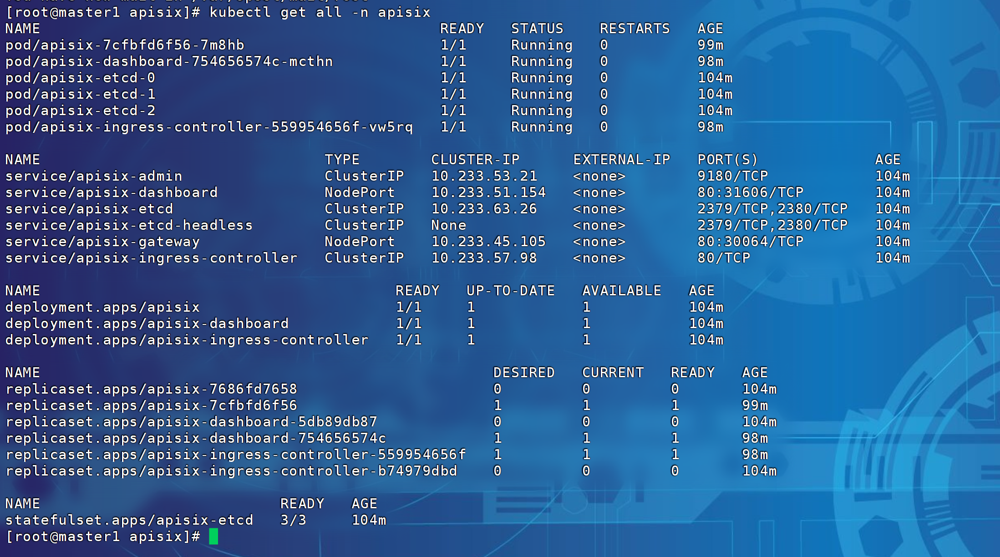
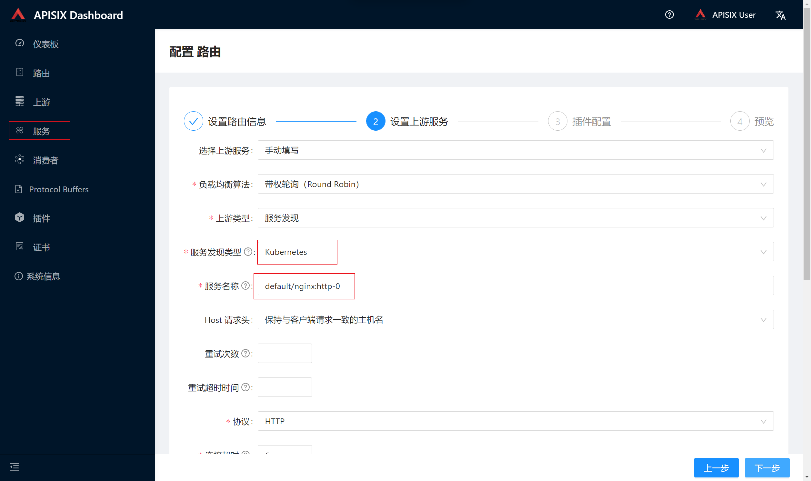
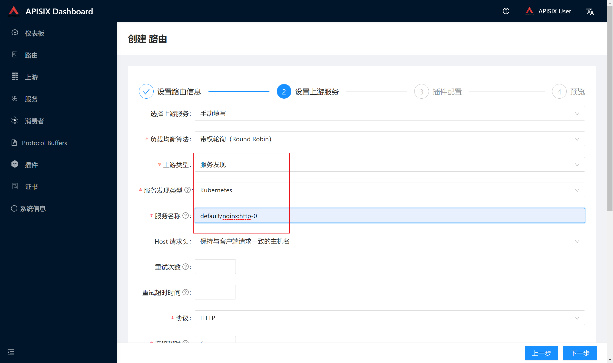

# APISIX-INGRESS

## 安装

1，下载apisixhelm包，如apisix-2.1.0.tgz

2，使用helm安装

```shell
helm install apisix apisix-2.1.0.tgz \
--set gateway.type=NodePort \
--set service.http.nodePort=30064 \
--set nodeSelector."apisix"="yes" \
--set ingress-controller.enabled=true \
--set dashboard.enabled=true \
--set replicaCount=1 \
--set hostNetwork=true \
--set gateway.tls.enabled=true \
--set etcd.volumePermissions.enabled=true \
--set etcd.persistence.storageClass="local" \
--set etcd.persistence.size="22Gi" \
--set ingress-controller.config.apisix.adminKey="edd1c9f034335f136f87ad84b625c8f1" \
--set admin.credentials.admin="edd1c9f034335f136f87ad84b625c8f1" \
--set admin.credentials.viewer="4054f7cf07e344346cd3f287985e76a2" \
--set admin.allow.ipList={0.0.0.0/0} \
--set apisix.timezone=Asia/Shanghai \
--set initContainer.pullPolicy=IfNotPresent \
--set ingress-controller.config.apisix.serviceNamespace=apisix \
--namespace apisix \
--create-namespace
```

安装完毕后执行kubectl get all -n apisix 如图所示



## 调整配置

使用apisix获取k8s服务，并设置上游，需要更改config及rolebinding，否则无法发现且无权限。

1，修改名为apisix的configmap。增加配置：

如果 Kubernetes 服务发现模块运行在 Pod 内, 你可以使用最简配置，nginx_config平级:

```yaml
discovery:
  kubernetes: { }
```

     ```yaml
     #
     # Licensed to the Apache Software Foundation (ASF) under one or more
     # contributor license agreements.  See the NOTICE file distributed with
     # this work for additional information regarding copyright ownership.
     # The ASF licenses this file to You under the Apache License, Version 2.0
     # (the "License"); you may not use this file except in compliance with
     # the License.  You may obtain a copy of the License at
     #
     #     http://www.apache.org/licenses/LICENSE-2.0
     #
     # Unless required by applicable law or agreed to in writing, software
     # distributed under the License is distributed on an "AS IS" BASIS,
     # WITHOUT WARRANTIES OR CONDITIONS OF ANY KIND, either express or implied.
     # See the License for the specific language governing permissions and
     # limitations under the License.
     #
     apisix:    # universal configurations
       node_listen:    # APISIX listening port
         - 9080
       enable_heartbeat: true
       enable_admin: true
       enable_admin_cors: true
       enable_debug: false
     
       enable_dev_mode: false                       # Sets nginx worker_processes to 1 if set to true
       enable_reuseport: true                       # Enable nginx SO_REUSEPORT switch if set to true.
       enable_ipv6: true # Enable nginx IPv6 resolver
       enable_server_tokens: true # Whether the APISIX version number should be shown in Server header
     
       # proxy_protocol:                   # Proxy Protocol configuration
       #   listen_http_port: 9181          # The port with proxy protocol for http, it differs from node_listen and admin_listen.
       #                                   # This port can only receive http request with proxy protocol, but node_listen & admin_listen
       #                                   # can only receive http request. If you enable proxy protocol, you must use this port to
       #                                   # receive http request with proxy protocol
       #   listen_https_port: 9182         # The port with proxy protocol for https
       #   enable_tcp_pp: true             # Enable the proxy protocol for tcp proxy, it works for stream_proxy.tcp option
       #   enable_tcp_pp_to_upstream: true # Enables the proxy protocol to the upstream server
     
       proxy_cache:                         # Proxy Caching configuration
         cache_ttl: 10s                     # The default caching time if the upstream does not specify the cache time
         zones:                             # The parameters of a cache
         - name: disk_cache_one             # The name of the cache, administrator can be specify
                                            # which cache to use by name in the admin api
           memory_size: 50m                 # The size of shared memory, it's used to store the cache index
           disk_size: 1G                    # The size of disk, it's used to store the cache data
           disk_path: "/tmp/disk_cache_one" # The path to store the cache data
           cache_levels: "1:2"              # The hierarchy levels of a cache
       #  - name: disk_cache_two
       #    memory_size: 50m
       #    disk_size: 1G
       #    disk_path: "/tmp/disk_cache_two"
       #    cache_levels: "1:2"
     
       router:
         http: radixtree_host_uri  # radixtree_uri: match route by uri(base on radixtree)
                                     # radixtree_host_uri: match route by host + uri(base on radixtree)
                                     # radixtree_uri_with_parameter: match route by uri with parameters
         ssl: 'radixtree_sni'        # radixtree_sni: match route by SNI(base on radixtree)
       stream_proxy:                 # TCP/UDP proxy
         only: false
         tcp:                        # TCP proxy port list
           - 9100
         udp:                        # UDP proxy port list
           - 9200
       # dns_resolver:
       #
       #   - 127.0.0.1
       #
       #   - 172.20.0.10
       #
       #   - 114.114.114.114
       #
       #   - 223.5.5.5
       #
       #   - 1.1.1.1
       #
       #   - 8.8.8.8
       #
       dns_resolver_valid: 30
       resolver_timeout: 5
       ssl:
         enable: false
         listen:
           - port: 9443
             enable_http2: true
         ssl_protocols: "TLSv1.2 TLSv1.3"
         ssl_ciphers: "ECDHE-ECDSA-AES128-GCM-SHA256:ECDHE-RSA-AES128-GCM-SHA256:ECDHE-ECDSA-AES256-GCM-SHA384:ECDHE-RSA-AES256-GCM-SHA384:ECDHE-ECDSA-CHACHA20-POLY1305:ECDHE-RSA-CHACHA20-POLY1305:DHE-RSA-AES128-GCM-SHA256:DHE-RSA-AES256-GCM-SHA384:DHE-RSA-CHACHA20-POLY1305:ECDHE-ECDSA-AES128-SHA256:ECDHE-RSA-AES128-SHA256:ECDHE-ECDSA-AES128-SHA:ECDHE-RSA-AES128-SHA:ECDHE-ECDSA-AES256-SHA384:ECDHE-RSA-AES256-SHA384:ECDHE-ECDSA-AES256-SHA:ECDHE-RSA-AES256-SHA:DHE-RSA-AES128-SHA256:DHE-RSA-AES256-SHA256:AES128-GCM-SHA256:AES256-GCM-SHA384:AES128-SHA256:AES256-SHA256:AES128-SHA:AES256-SHA:DES-CBC3-SHA"
     
     discovery:
       kubernetes: { }
     
     nginx_config:    # config for render the template to genarate nginx.conf
       error_log: "/dev/stderr"
       error_log_level: "warn"    # warn,error
       worker_processes: "auto"
       enable_cpu_affinity: true
       worker_rlimit_nofile: 20480  # the number of files a worker process can open, should be larger than worker_connections
       event:
         worker_connections: 10620
       http:
         enable_access_log: true
         access_log: "/dev/stdout"
         access_log_format: '$remote_addr - $remote_user [$time_local] $http_host \"$request\" $status $body_bytes_sent $request_time \"$http_referer\" \"$http_user_agent\" $upstream_addr $upstream_status $upstream_response_time \"$upstream_scheme://$upstream_host$upstream_uri\"'
         access_log_format_escape: default
         keepalive_timeout: 60s         # timeout during which a keep-alive client connection will stay open on the server side.
         client_header_timeout: 60s     # timeout for reading client request header, then 408 (Request Time-out) error is returned to the client
         client_body_timeout: 60s       # timeout for reading client request body, then 408 (Request Time-out) error is returned to the client
         send_timeout: 10s              # timeout for transmitting a response to the client.then the connection is closed
         underscores_in_headers: "on"   # default enables the use of underscores in client request header fields
         real_ip_header: "X-Real-IP"    # http://nginx.org/en/docs/http/ngx_http_realip_module.html#real_ip_header
         real_ip_from:                  # http://nginx.org/en/docs/http/ngx_http_realip_module.html#set_real_ip_from
           - 127.0.0.1
           - 'unix:'
     
     deployment:
       role: traditional
       role_traditional:
         config_provider: etcd
     
       admin:
         allow_admin:    # http://nginx.org/en/docs/http/ngx_http_access_module.html#allow
           - 127.0.0.1/24
           - 0.0.0.0/0
         #   - "::/64"
         admin_listen:
           ip: 0.0.0.0
           port: 9180
         # Default token when use API to call for Admin API.
         # *NOTE*: Highly recommended to modify this value to protect APISIX's Admin API.
         # Disabling this configuration item means that the Admin API does not
         # require any authentication.
         admin_key:
           # admin: can everything for configuration data
           - name: "admin"
             key: edd1c9f034335f136f87ad84b625c8f1
             role: admin
           # viewer: only can view configuration data
           - name: "viewer"
             key: 4054f7cf07e344346cd3f287985e76a2
             role: viewer
       etcd:
         host:                          # it's possible to define multiple etcd hosts addresses of the same etcd cluster.
           - "http://apisix-etcd.apisix.svc.cluster.local:2379"
         prefix: "/apisix"    # configuration prefix in etcd
         timeout: 30    # 30 seconds
     ```


 	如果 Kubernetes 服务发现模块运行在 Pod 外, 你需要新建或选取指定的 ServiceAccount, 获取其 Token 值, 然后使用如下配置:

```yaml
discovery:
  kubernetes:
    service:
      schema: https
      host: # enter apiserver host value here
      port: # enter apiServer port value here
    client:
      token: # enter serviceaccount token value here
      #token_file: # enter file path here
```

 2，创建rbac。

查看apisix deploy.yaml 绑定sc为default，未绑定ClusterRole，无权限获取service等资源信息，故创建ClusterRoleBinding。

```yaml
apiVersion: rbac.authorization.k8s.io/v1
kind: ClusterRoleBinding
metadata:
  name: apisix-default-clusterrolebinding
roleRef:
  apiGroup: rbac.authorization.k8s.io
  kind: ClusterRole
  name: apisix-clusterrole
subjects:
- kind: ServiceAccount
  name: default
  namespace: apisix
```

## 创建上游

nodeport开放apisix-dashboard，访问页面，默认账密admin/admin。服务发现类型选择k8s，服务名称格式为 namespace/servicename:portname




## 创建路由

上游类型选择k8s，服务名称自动带出。



参考：https://github.com/apache/apisix/issues/7026