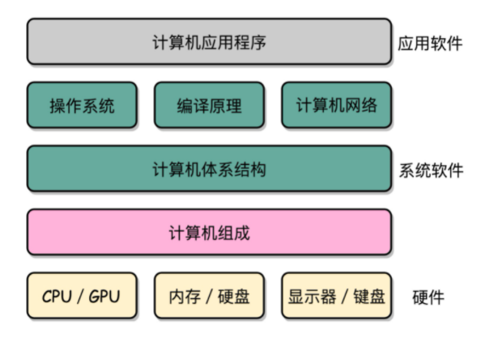
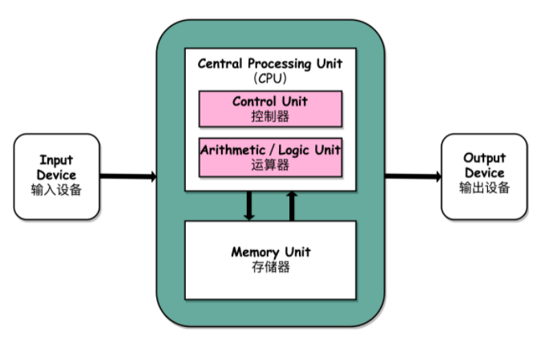
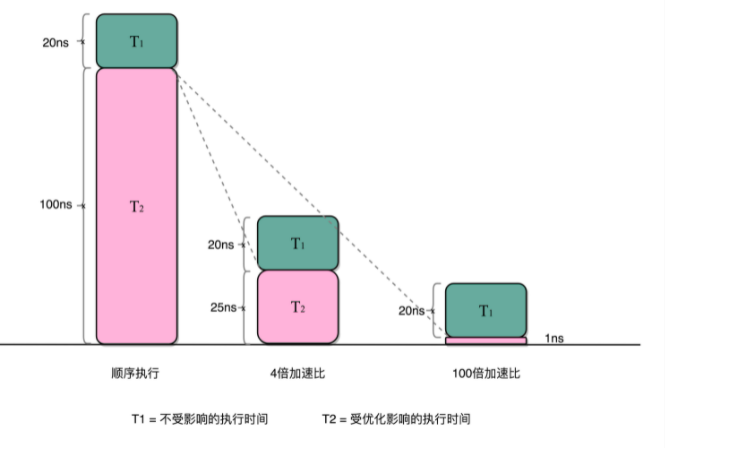

## 1. 开头
计算机体系结构：  

 


## 2. 冯·诺依曼体系结构
      
冯·诺依曼体系结构确立了我们现在每天使用的计算机硬件的基础架构:  
* CPU
  * 控制器单元(Control Unit/CU)
    * 指令寄存器（Instruction Reigster）
    * 程序计数器（Program Counter）  
    用来控制程序的流程，通常就是不同条件下的分支和跳转。在现在的计算机里，上面的算术逻辑单元和这里的控制器单元
  * 处理器单元（Processing Unit）
    * 算术逻辑单元（Arithmetic Logic Unit，ALU）
    * 处理器寄存器（Processor Register）  
    用来完成各种算术和逻辑运算。因为它能够完成各种数据的处理或者计算工作，因此也有人把这个叫作数据通路（Datapath）或者运算器
* 内存
  * 用来存储数据（Data）和指令（Instruction）
* 外部存储
  * 可能是磁带、磁鼓这样的设备，现在通常就是硬盘
* 输入和输出设备


&emsp;&emsp;**任何一台计算机的任何一个部件都可以归到运算器、控制器、存储器、输入设备和输出设备中，而所有的现代计算机也都是基于这个基础架构来设计开发的**    
&emsp;&emsp;总的来说，我们可以抽象为从输入设备读取输入信息，通过运算器和控制器来执行存储在存储器里的程序，最终把结果输出到输出设备中。而我们所有撰写的无论高级还是低级语言的程序，也都是基于这样一个抽象框架来进行运作的  


### 2.1. 图灵机  
冯·诺依曼机侧重于硬件抽象，而图灵机侧重于计算抽象。随着深度学习，IOT等的发展，体系结构又有了一波新的大发展，也许未来会有新的变化。  
图灵机是一种思想模型（计算机的基本理论基础），是一种有穷的、构造性的问题的问题求解思路，图灵认为凡是能用算法解决的问题也一定能用图灵机解决。 
冯诺依曼提出了“存储程序”的计算机设计思想，并“参照”图灵模型设计了历史上第一台电子计算机，即冯诺依曼机。  


## 3. 计算机核心概念   
### 3.1. 硬件组成
需要关注怎么对应到经典的冯·诺依曼体系结构运算器、控制器、存储器、输入设备和输出设备这五大基本组件  
### 3.2. 计算机核心指标  
计算机的两个核心指标，性能和功耗。性能和功耗也是我们在应用和设计五大基本组件中需要重点考虑的因素

### 3.3. 计算机的指令和计算原理
我们编写的程序通过编译器和汇编器变成一条条机器指令这样的编译过程，操作系统负责链接、装载、执行这些程序的。这一条条指令执行的控制过程，就是由计算机五大组件之一的控制器来控制的。  
CPU 时钟可以用来构造寄存器和内存的锁存器和触发器。数据通路，其实就是连接了整个运算器和控制器，并最终组成了 CPU。而出于对于性能和功耗的考虑，出现了面向流水线设计的 CPU、数据和控制冒险，以及分支预测的相关技术。  
CPU 作为控制器要和输入输出设备通信，它拥有异常和中断发生的机制，这个在后面进行详细阐述。  

### 3.4. 浮点数原理  
### 3.5. 存储器的原理    
&emsp;&emsp;通过存储器的层次结构作为基础的框架引导，从上到下的 CPU 高速缓存、内存、SSD 硬盘和机械硬盘之间的性能差异，在实际应用中利用这些设备也会遇到的挑战。    
&emsp;&emsp;存储器其实很多时候又扮演了输入输出设备的角色，CPU 和这些存储器之间是如何进行通信的，以及我们最重视的性能问题是怎么一回事；理解什么是 IO_WAIT，如何通过 DMA 来提升程序性能。    
&emsp;&emsp;对于存储器，我们不仅需要它们能够正常工作，还要确保里面的数据不能丢失。于是你要掌握我们是如何通过 RAID、Erasure Code、ECC 以及分布式 HDFS，这些不同的技术，来确保数据的完整性和访问性能

## 4. 计算机的性能

### 4.1. 性能的定义  
第一个是响应时间（Response time）或者叫执行时间（Execution time）。想要提升响应时间这个性能指标，你可以理解为让计算机“跑得更快”  
第二个是吞吐率（Throughput）或者带宽（Bandwidth），想要提升这个指标，你可以理解为让计算机“搬得更多”   

&emsp;&emsp;提升吞吐率的办法有很多。大部分时候，我们只要多加一些机器，多堆一些硬件就好了。但是响应时间的提升却没有那么容易。  
&emsp;&emsp;我们一般把性能，定义成响应时间的倒数  

### 4.2. CPU 时钟  
虽然时间是一个很自然的用来衡量性能的指标，但是用时间来衡量时，有两个问题:  
* 第一个就是时间不“准”  
  计算机可能同时运行着好多个程序，CPU 实际上不停地在各个程序之间进行切换。在这些走掉的时间里面，很可能 CPU 切换去运行别的程序了。而且，有些程序在运行的时候，可能要从网络、硬盘去读取数据，要等网络和硬盘把数据读出来，给到内存和 CPU。所以说，要想准确统计某个程序运行时间，进而去比较两个程序的实际性能，我们得把这些时间给刨除掉.  
  Linux 下有一个叫 time 的命令，可以帮我们统计出来，同样的 Wall Clock Time 下，程序实际在 CPU 上到底花了多少时间.  
  * real time, Wall Clock Time,运行结束的时间减去程序开始运行的时间,就是在运行程序期间，挂在墙上的钟走掉的时间
  * user time，也就是 CPU 在运行你的程序，在用户态运行指令的时间
  * sys time，是 CPU 在运行你的程序，在操作系统内核里运行指令的时间
  ```
  $ time seq 1000000 | wc -l 1000000 
    real  0m0.101s
    user  0m0.031s
    sys   0m0.016s
  ```
  实际上程序用了 0.101s，但是 CPU time 只有 0.031+0.016 = 0.047s.运行程序的时间里，只有不到一半是实际花在这个程序上的  

* 即使我们已经拿到了 CPU 时间，我们也不一定可以直接“比较”出两个程序的性能差异    
  &emsp;&emsp;即使在同一台计算机上，CPU 可能满载运行也可能降频运行，降频运行的时候自然花的时间会多一些。时间这个性能指标还会受到主板、内存这些其他相关硬件的影响。所以，我们需要对“时间”这个我们可以感知的指标进行拆解，把程序的 CPU 执行时间变成 CPU 时钟周期数（CPU Cycles）和 时钟周期时间（Clock Cycle）的乘积：    
  **程序的 CPU 执行时间 =CPU 时钟周期数×时钟周期时间**  
  &emsp;&emsp;举例：Intel Core-i7-7700HQ 2.8GHz，2.8GHz，我们可以先粗浅地认为，CPU 在 1 秒时间内，可以执行的简单指令的数量是 2.8G 条。即我们 CPU 的一个“钟表”能够识别出来的最小的时间间隔。  
  &emsp;&emsp;在 CPU 内部，和我们平时戴的电子石英表类似，有一个叫晶体振荡器（Oscillator Crystal）的东西，简称为晶振。我们把晶振当成 CPU 内部的电子表来使用。晶振带来的每一次“滴答”，就是时钟周期时间。  
  主频越高，意味着这个表走得越快，我们的 CPU 也就“被逼”着走得越快。    
  CPU 的计算跟着这个时钟的节奏，也就自然变快了。当然这个快不是没有代价的，CPU 跑得越快，散热的压力也就越大。就和人一样，超过生理极限，CPU 就会崩溃了

PS：补充知识点

①时钟周期/振荡周期：

时钟周期又叫做振荡周期、节拍周期，定义为时钟晶振频率的倒数。时钟周期是计算机中最基本的、最小的时间单位。在一个时钟周期内，CPU仅完成一个最基本的动作。例如晶振为12M，则时钟周期为1/12us。又可以被定义为节拍。

②指令周期：

指令周期是指取出并完成一条指令所需的时间，一般由若干个机器周期组成，分为单周期指令，双周期指令和多周期指令。

对于一些简单的的单字节指令，在取指令周期中，指令取出到指令寄存器后，立即译码执行，不再需要其它的机器周期。对于一些比较复杂的指令，例如转移指令、乘法指令，则需要两个或者两个以上的机器周期。

③机器周期：

在计算机中，为了便于管理，常把一条指令的执行过程划分为若干个阶段，每一阶段完成一项工作。例如，取指令、存储器读、存储器写等，这每一项工作称为一个基本操作。完成一个基本操作所需要的时间称为机器周期。一般情况下，一个机器周期由若干个S周期（状态周期）组成。比如，取值周期，取数周期。在80C51内部，机器周期一般包括于6个状态周期，12个时钟周期。例如24M的晶振，机器周期为12/24M秒。


#### 4.2.1. 性能提升  
最简单的提升性能方案，自然缩短时钟周期时间，也就是提升主频。就是换一块好一点的 CPU。不过，这个是我们这些软件工程师控制不了的事情，所以我们就把目光挪到了乘法的另一个因子——CPU 时钟周期数上。如果能够减少程序需要的 CPU 时钟周期数量，一样能够提升程序性能。  
指令数×每条指令的平均时钟周期数（Cycles Per Instruction，简称 CPI）  
不同的指令需要的 Cycles 是不同的，加法和乘法都对应着一条 CPU 指令，但是乘法需要的 Cycles 就比加法要多，自然也就慢。在这样拆分了之后，我们的程序的 CPU 执行时间就可以变成这样三个部分的乘积。  
程序的 CPU 执行时间 = 指令数×CPI×Clock Cycle Time    
所以进行优化：  
* 时钟周期时间，就是计算机主频，这个取决于计算机硬件。我们所熟知的摩尔定律就一直在不停地提高我们计算机的主频。比如说，我最早使用的 80386 主频只有 33MHz，现在手头的笔记本电脑就有 2.8GHz，在主频层面，就提升了将近 100 倍。
* 每条指令的平均时钟周期数 CPI，就是一条指令到底需要多少 CPU Cycle。在后面讲解 CPU 结构的时候，我们会看到，现代的 CPU 通过流水线技术（Pipeline），让一条指令需要的 CPU Cycle 尽可能地少。因此，对于 CPI 的优化，也是计算机组成和体系结构中的重要一环。
* 指令数，代表执行我们的程序到底需要多少条指令、用哪些指令。这个很多时候就把挑战交给了编译器。同样的代码，编译成计算机指令时候，就有各种不同的表示方式  


&emsp;&emsp;我们可以把自己想象成一个 CPU，坐在那里写程序。计算机主频就好像是你的打字速度，打字越快，你自然可以多写一点程序。CPI 相当于你在写程序的时候，熟悉各种快捷键，越是打同样的内容，需要敲击键盘的次数就越少。指令数相当于你的程序设计得够合理，同样的程序要写的代码行数就少。如果三者皆能实现，你自然可以很快地写出一个优秀的程序，你的“性能”从外面来看就是好的

**晶振时间是固定处理一个cpu简单指令的，CPI的平均时间是用来描述复杂指令的，指令数同样也是，其实整个公式如果用用简单指令来描述可能更容易理解一些，晶振时间变短后，CPU调度指令的周期变短频次变高，使得上一个指令执行完毕到下一个指令被调动期间的等待时间变短，从而提升了CPU的利用率。好比一个监工增加了抬头看监控视频的频率，一旦有员工手停下来能立马给安排任务，主频低的话，可能员工休息半天才会被发现。另外，这种情况下，似乎主频提升的倍率并不能与性能提升带来1:1的效益。晶振在触发一条一条电路变化指令，就好像你拨算牌盘的节奏一样。算盘拨得快，珠算就算得快。结果就是一条简单的指令需要的事件就和一个时钟周期一样，实际这个问题要比这样一句话复杂很多。一方面，其实时钟周期应该是放下最复杂的一条指令的时间长度。我们是通过流水线来提升cpi的。我会在讲解cpu的部分更深入讲解始终信号和计数器，让大家能够理解cpu到底是怎么回事儿**  

​	

为什么增加晶体管数量提升性能呢？    
	举例，A是14nm，B是7nm，那么，A的晶体管数量是B的4倍多出来的3倍是干什么的？做成更长的流水线把一个指令的执行过程分成5步，第一个指令的第一步完成之后直接取第二个指令的第一步，能达到5倍性能做成更加复杂的指令集一条指令处理16个数据（SIMD）5步流水线 x 16个数据 = 性能达到80倍！再加上大容量 L3 Cache，吞吐量也有保证.**增加晶体管可以增加硬件能够支持的指令数量，增加数字通路的位数，以及利用好电路天然的并行性，从硬件层面更快地实现特定的指令，所以增加晶体管也是常见的提升cpu性能的一种手段**  增加晶体管数量，其实是通过提供更复杂的电路支持更多的“指令”。也就会减少运行同样程序需要的指令数。
打个比方，比如我们最简单的电路可以只有加法功能，没有乘法功能。乘法都变成很多个加法指令，那么实现一个乘法需要的指令数就比较多。但是如果我们增加晶体管在电路层面就实现了这个，那么需要的指令数就变少了，执行时间也可以缩短

### 4.3. 功耗
在以前，为了提升程序性能，我们在 CPU 上多放一点晶体管，不断提升 CPU 的时钟频率，这样就能让 CPU 变得更快，程序的执行时间就会缩短，但是我们发现在最后没有发现性能线性增长。在 CPU 里，同样的面积里面，多放一些晶体管，也就是增加密度；另一方面，我们要让晶体管“打开”和“关闭”得更快一点，也就是提升主频。而这两者，都会增加功耗，带来耗电和散热的问题，对 CPU 来说就会崩溃出错  
降低电压可以减少功耗，电压的问题在于两个，一个是电压太低就会导致电路无法联通，因为不管用什么作为电路材料，都是有电阻的，所以没有办法无限制降低电压，另外一个是对于工艺的要求也变高了，成本也更贵啊。  

  
在电路设计上，并行和流水线通常是相互配合同时存在的，切流水线的意思是在电路的关键路径中的特定位置处插入寄存器，用空间换时间，使得切分后的关键路径的每一段具有更短的执行时间，但在总体上看单条指令的总体运行时间并不会减少。在切流水线后，电路可以使用更高的时钟频率，所以其主要目的还是在于提高主频

### 4.4. 并行计算  
我们可以通过多核来提升吞吐量来提升性能。但是，并不是所有问题，都可以通过并行提高性能来解决。如果想要使用这种思想，需要满足这样几个条件：  
* 第一，需要进行的计算，本身可以分解成几个可以并行的任务。好比上面的乘法和加法计算，几个人可以同时进行，不会影响最后的结果。
* 第二，需要能够分解好问题，并确保几个人的结果能够汇总到一起。
* 第三，在“汇总”这个阶段，是没有办法并行进行的，还是得顺序执行，一步一步来

这就引出了我们在进行性能优化中，常常用到的一个经验定律，**阿姆达尔定律**（Amdahl’s Law）。这个定律说的就是，对于一个程序进行优化之后，处理器并行运算之后效率提升的情况。具体可以用这样一个公式来表示：

优化后的执行时间 = 受优化影响的执行时间 / 加速倍数 + 不受影响的执行时间

 


### 4.5. 小结  
无论是简单地通过提升主频，还是增加更多的 CPU 核心数量，通过并行来提升性能，都会遇到相应的瓶颈。仅仅简单地通过“堆硬件”的方式，在今天已经不能很好地满足我们对于程序性能的期望了

 在“摩尔定律”和“并行计算”之外，在整个计算机组成层面，还有这样几个原则性的性能提升方法。

* **加速大概率事件**。最典型的就是，过去几年流行的深度学习，整个计算过程中，99% 都是向量和矩阵计算，于是，工程师们通过用 GPU 替代 CPU，大幅度提升了深度学习的模型训练过程。本来一个 CPU 需要跑几小时甚至几天的程序，GPU 只需要几分钟就好了。Google 更是不满足于 GPU 的性能，进一步地推出了 TPU。后面的文章，我也会为你讲解 GPU 和 TPU 的基本构造和原理。

* **通过流水线提高性能**。现代的工厂里的生产线叫“流水线”。我们可以把装配 iPhone 这样的任务拆分成一个个细分的任务，让每个人都只需要处理一道工序，最大化整个工厂的生产效率。类似的，我们的 CPU 其实就是一个“运算工厂”。我们把 CPU 指令执行的过程进行拆分，细化运行，也是现代 CPU 在主频没有办法提升那么多的情况下，性能仍然可以得到提升的重要原因之一。我们在后面也会讲到，现代 CPU 里是如何通过流水线来提升性能的，以及反面的，过长的流水线会带来什么新的功耗和效率上的负面影响。

* **通过预测提高性能**。通过预先猜测下一步该干什么，而不是等上一步运行的结果，提前进行运算，也是让程序跑得更快一点的办法。典型的例子就是在一个循环访问数组的时候，凭经验，你也会猜到下一步我们会访问数组的下一项。后面要讲的“分支和冒险”、“局部性原理”这些 CPU 和存储系统设计方法，其实都是在利用我们对于未来的“预测”，提前进行相应的操作，来提升我们的程序性能。

## 5. 总结

计算机整个组成乃至体系结构，都是基于冯·诺依曼架构组成的软硬件一体的解决方案。这里面的方方面面的设计和考虑，除了体系结构层面的抽象和通用性之外，核心需要考虑的是“性能”问题。
