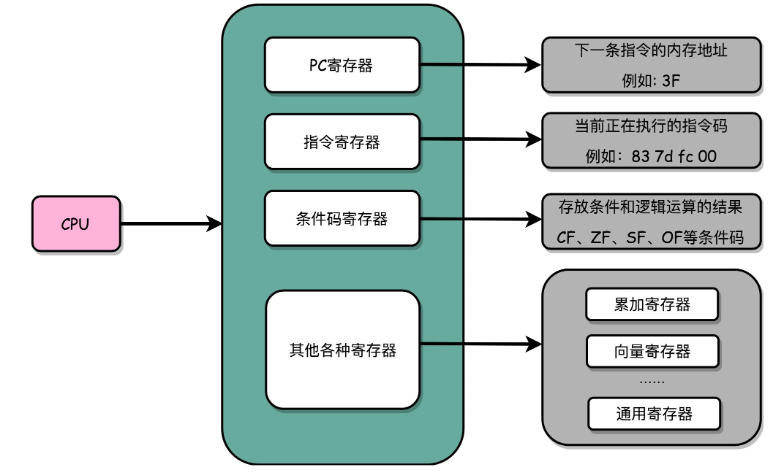
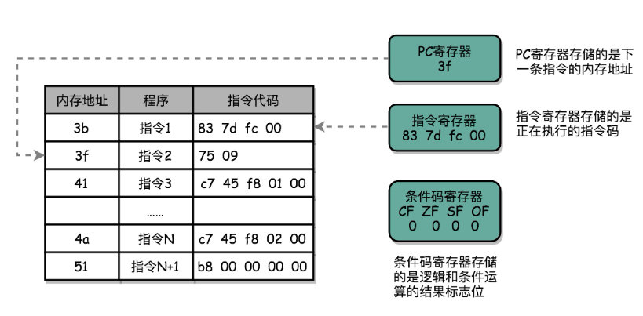
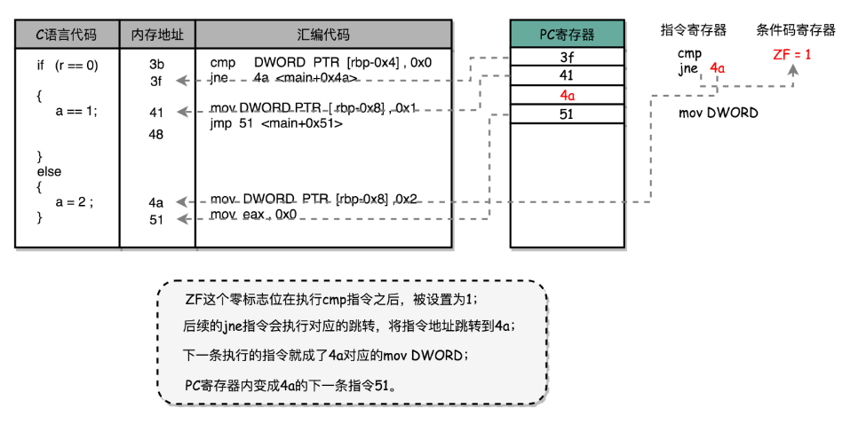
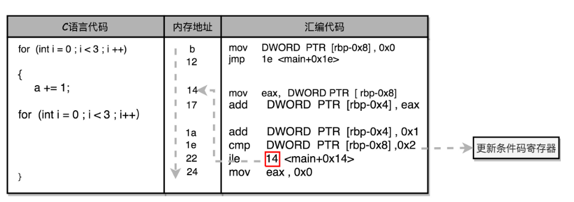

## 1. 机器码与cpu指令

​	从**硬件**的角度来看，CPU 就是一个超大规模集成电路，通过电路实现了加法、乘法乃至各种各样的处理逻辑	

​	从**软件**工程师的角度来讲，CPU 就是一个执行各种**计算机指令**（Instruction Code）的逻辑机器。这里的计算机指令，就好比一门 CPU 能够听得懂的语言，我们也可以把它叫作**机器语言**（Machine Language）

### 1.1. 指令集概述

​	不同的 CPU 能够听懂的语言不太一样。比如，我们的个人电脑用的是 Intel 的 CPU，苹果手机用的是 ARM 的 CPU。这两者能听懂的语言就不太一样。类似这样两种 CPU 各自支持的语言，就是两组不同的**计算机指令集**

​	如果我们在自己电脑上写一个程序，然后把这个程序复制一下，装到自己的手机上，肯定是没办法正常运行的，因为这两者语言不通。而一台电脑上的程序，简单复制一下到另外一台电脑上，通常就能正常运行，因为这两台 CPU 有着相同的指令集，也就是说，它们的语言相通的

​	一个计算机程序，不可能只有一条指令，而是由成千上万条指令组成的。但是 CPU 里不能一直放着所有指令，所以计算机程序平时是存储在存储器中的。这种程序指令存储在存储器里面的计算机，我们就叫作**存储程序型计算机**

PS:非存储程序型的计算机可以是插线板计算机，通过各种接线来完成不同的程序

### 1.2. 机器码与汇编

平时编写的代码，到底是怎么变成一条条计算机指令，最后被 CPU 执行的呢？

```
// test.c
int main()
{
  int a = 1; 
  int b = 2;
  a = a + b;
}
```

* 让这段程序在一个 Linux 操作系统上跑起来

  我们需要把整个程序翻译成一个**汇编语言**（ASM，Assembly Language）的程序，这个过程我们一般叫编译（Compile）成汇编代码

* 针对汇编代码，我们可以再用汇编器（Assembler）翻译成机器码（Machine Code）。这些机器码由“0”和“1”组成的机器语言表示。这一条条机器码，就是一条条的**计算机指令**

在一个 Linux 操作系统上，我们可以简单地使用 gcc 和 objdump 这样两条命令，把对应的汇编代码和机器码都打印出来

```
test.o:     file format elf64-x86-64
Disassembly of section .text:
0000000000000000 <main>:
int main()
{
   0:   55                      push   rbp
   1:   48 89 e5                mov    rbp,rsp
  int a = 1; 
   4:   c7 45 fc 01 00 00 00    mov    DWORD PTR [rbp-0x4],0x1
  int b = 2;
   b:   c7 45 f8 02 00 00 00    mov    DWORD PTR [rbp-0x8],0x2
  a = a + b;
  12:   8b 45 f8                mov    eax,DWORD PTR [rbp-0x8]
  15:   01 45 fc                add    DWORD PTR [rbp-0x4],eax
}
  18:   5d                      pop    rbp
  19:   c3                      ret    
```

* 左侧有一堆数字，这些就是一条条机器码
* 右边有一系列的 push、mov、add、pop 等，这些就是对应的汇编代码
* 一行 C 语言代码，有时候只对应一条机器码和汇编代码，有时候则是对应两条机器码和汇编代码
* 汇编代码和机器码之间是一一对应的

如下为高级语言转化为机器语言的示意图：

 

**PS: GCC（GUC 编译器套装，GUI Compiler Collectipon）编译器的时候，可以直接把代码编译成机器码**?

这里为什么需要有汇编语言？

汇编代码其实就是“给程序员看的机器码”，也正因为这样，机器码和汇编代码是一一对应的。我们人类很容易记住 add、mov 这些用英文表示的指令，而 8b 45 f8 这样的指令，由于很难一下子看明白是在干什么，所以会非常难以记忆

### 1.3. 指令和机器码分类

常见的指令可以分成五大类：

* **算术类指令**

  我们的加减乘除，在 CPU 层面，都会变成一条条算术类指令。

* **数据传输类指令**

  给变量赋值、在内存里读写数据，用的都是数据传输类指令。

* **逻辑类指令**

  逻辑上的与或非，都是这一类指令。

* **条件分支类指令**

  日常我们写的“if/else”，其实都是条件分支类指令。

* **无条件跳转指令**

  写一些大一点的程序，我们常常需要写一些函数或者方法。在调用函数的时候，其实就是发起了一个无条件跳转指令。

如下位计算机指令含义及示例

 

### 1.4. MIPS 指令集

编器是怎么把对应的汇编代码，翻译成为机器码的呢？

首先不同的 CPU 有不同的指令集，也就对应着不同的汇编语言和不同的机器码。

#### 1.4.1.  定义

这里是最简单的 MIPS 指令集:

 

​	MIPS 的指令是一个 32 位的整数，高 6 位叫**操作码**（Opcode），也就是代表这条指令具体是一条什么样的指令，剩下的 26 位有三种格式，分别是 R、I 和 J：

* **R 指令**是一般用来做算术j逻辑操作，里面有读取和写入数据的寄存器的地址。如果是逻辑位移操作，后面还有位移操作的位移量，而最后的功能码，则是在前面的操作码不够的时候，扩展操作码表示对应的具体指令的
* **I 指令**，则通常是用在数据传输、条件分支，以及在运算的时候使用的并非变量还是常数的时候。这个时候，没有了位移量和操作码，也没有了第三个寄存器，而是把这三部分直接合并成了一个地址值或者一个常数。
* **J 指令**就是一个跳转指令，高 6 位之外的 26 位都是一个跳转后的地址。

#### 1.4.2.  add指令示例

以一个简单的加法算术指令 add t0,s1, $s2, 为例，给你解释。为了方便，下面都用十进制来表示对应的代码。

```
add $t0,$s2,$s1
```

* 对应的 MIPS 指令里 opcode 是 0

* rs 代表第一个寄存器 s1 的地址是 17
* rt 代表第二个寄存器 s2 的地址是 18
* rd 代表目标的临时寄存器 t0 的地址，是 8。
* 因为不是位移操作，所以位移量是 0。
* 把这些数字拼在一起，就变成了一个 MIPS 的加法指令。

为了读起来方便，我们一般把对应的二进制数，用 16 进制表示出来。在这里，也就是 0X02324020。这个数字也就是这条指令对应的机器码:

 

如果我们用打孔代表 1，没有打孔代表 0，用 4 行 8 列代表一条指令来打一个穿孔纸带，一列代表4位的二进制数，它转换成16进制0X02324020，那么这条命令大概就长这样:

 

#### 1.4.3.  打印数字

### 1.5. 小结

* 不同指令集里，对应的汇编代码会对应这个指令集的机器码
* 高级语言在转换成为机器码的时候，是通过编译器进行的，需要编译器指定编译成哪种汇编/机器码
* 物理机自己执行的时候只有机器码，并不认识汇编代码
* 编译器如果支持编译成不同的体系结构的汇编/机器码，就要维护很多不同的对应关系表，但是这个表并不会太大。以最复杂的Intel X86的指令集为例，也只有2000条不同的指令而已
* Java 这样使用虚拟机的语言，其实最终都是由不同形式的程序，把我们写好的代码，转换成 CPU 能够理解的机器码
* 解释型语言，是通过解释器在程序运行的时候逐句翻译，而 Java 这样使用虚拟机的语言，则是由虚拟机对编译出来的中间代码进行解释，或者即时编译成为机器码来最终执行
* shell脚本是被bash解释器来运行的，调用对应的编译好的二进制可执行文件相当于bash解释器在做对应的“翻译”动作

## 2. 寄存器

### 2.1.  指令执行

​	Intel CPU 来说，里面差不多有几百亿个晶体管。实际上，一条条计算机指令执行起来非常复杂。好在 CPU 在软件层面已经为我们做好了封装。对于我们这些做软件的程序员来说，我们只要知道，写好的代码变成了指令之后，是一条一条**顺序**执行的就可以了。

### 2.2.  寄存器分类

​	逻辑上，我们可以认为，CPU 其实就是由一堆寄存器组成的。而寄存器就是 CPU 内部由多个触发器（Flip-Flop）或者锁存器（Latches）组成的简单电路。

​	N 个触发器或者锁存器，就可以组成一个 N 位（Bit）的寄存器，能够保存 N 位的数据。比方说，我们用的 64 位 Intel 服务器，寄存器就是 64 位的。而且寄存器有分类，主要是：

 

* **PC 寄存器**（Program Counter Register）

  我们也叫**指令地址寄存器**（Instruction Address Register）。顾名思义，它就是用来存放下一条需要执行的计算机指令的内存地址。

* **指令寄存器**（Instruction Register）

  用来存放当前正在执行的指令。

* **条件码寄存器**（Status Register）

  用里面的一个一个标记位（Flag），存放 CPU 进行算术或者逻辑计算的结果

* **其它寄存器**

  CPU 里面还有更多用来存储数据和内存地址的寄存器。这样的寄存器通常一类里面不止一个。我们通常根据存放的数据内容来给它们取名字，比如整数寄存器、浮点数寄存器、向量寄存器和地址寄存器等等。有些寄存器既可以存放数据，又能存放地址，我们就叫它通用寄存器

### 2.3.  寄存器执行

 

* 一个程序执行的时候，CPU 会根据 PC 寄存器里的地址，从内存里面把需要执行的指令读取到指令寄存器里面执行

* 然后根据指令长度自增，开始顺序读取下一条指令。

* 可以看到，一个程序的一条条指令，在内存里面是连续保存的，也会一条条顺序加载。

* 有些特殊指令。如 J 类指令，也就是跳转指令，会修改 PC 寄存器里面的地址值。

  那么下一条要执行的指令就不是从内存里面顺序加载的了

  因为这些跳转指令的存在，也是我们可以在写程序的时候，使用 if…else 条件语句和 while/for 循环语句的原因

#### 2.3.1.  if else

```
int main()
{
  srand(time(NULL));
  int r = rand() % 2;
  int a = 10;
  if (r == 0)
  {
    a = 1;
  } else {
    a = 2;
  } 
```

对应的汇编代码是这样的：

```
    if (r == 0)
  3b:   83 7d fc 00             cmp    DWORD PTR [rbp-0x4],0x0
  3f:   75 09                   jne    4a <main+0x4a>
    {
        a = 1;
  41:   c7 45 f8 01 00 00 00    mov    DWORD PTR [rbp-0x8],0x1
  48:   eb 07                   jmp    51 <main+0x51>
    }
    else
    {
        a = 2;
  4a:   c7 45 f8 02 00 00 00    mov    DWORD PTR [rbp-0x8],0x2
  51:   b8 00 00 00 00          mov    eax,0x0
    } ss
```

分析如下：

 对于 r == 0 的条件判断，被编译成了 cmp 和 jne 这两条指令

*  cmp指令

  * cmp    DWORD PTR [rbp-0x4],0x0

    * DWORD PTR 代表操作的数据类型是 32 位的整数

    * 而 [rbp-0x4] 则是一个寄存器的地址。

      第一个操作数就是从寄存器里拿到的变量 r 的值。

    * 0x0 就是我们设定的常量 0 的 16 进制表示。

    cmp 指令的比较结果，会存入到**条件码寄存器**当中去。如果比较的结果是 True，也就是 r == 0，就把**零标志条件码**（对应的条件码是 ZF，Zero Flag）设置为 1。

    ​	除了零标志之外，Intel 的 CPU 下还有如下几种用在不同的判断条件下

    * **进位标志**（CF，Carry Flag）
    * **符号标志**（SF，Sign Flag）
    * **溢出标志**（OF，Overflow Flag）

*  jne 的指令

  跟着的 jne 指令，是 jump if not equal 的意思，它会查看对应的零标志位。

  * 如果为 0，会跳转到后面跟着的操作数 4a 的位置。

    这个 4a，对应这里汇编代码的行号，也就是上面设置的 else 条件里的第一条指令。

    当跳转发生的时候，PC 寄存器就不再是自增变成下一条指令的地址，而是被直接设置成这里的 4a 这个地址。

    这个时候，CPU 再把 4a 地址里的指令加载到指令寄存器中来执行

  *  4a 的指令

    实际是一条 mov 指令

    * 第一个操作数和前面的 cmp 指令一样，是另一个 32 位整型的寄存器地址，以及对应的 2 的 16 进制值 0x2。
    * mov 指令把 2 设置到对应的寄存器里去，相当于一个赋值操作。
    * 然后，PC 寄存器里的值继续自增，执行下一条 mov 指令eax指令

* eax

  这条 mov 指令的第一个操作数 eax，代表累加寄存器，第二个操作数 0x0 则是 16 进制的 0 的表示。

  * 这条指令其实没有实际的作用，它的作用是一个占位符。

    前面的 if 条件，如果满足的话，在赋值的 mov 指令执行完成之后，有一个 jmp 的无条件跳转指令。跳转的地址就是这一行的地址 51。我们的 main 函数没有设定返回值，而 mov eax, 0x0 其实就是给 main 函数生成了一个默认的为 0 的返回值到累加器里面。if 条件里面的内容执行完成之后也会跳转到这里，和 else 里的内容结束之后的位置是一样的

 

读取打孔卡的机器会顺序地一段一段地读取指令，然后执行。执行完一条指令，它会自动地顺序读取下一条指令。如果执行的当前指令带有跳转的地址，比如往后跳 10 个指令，那么机器会自动将卡片带往后移动 10 个指令的位置，再来执行指令。同样的，机器也能向前移动，去读取之前已经执行过的指令。这也就是我们的 while/for 循环实现的原理

#### 2.3.2.  goto循环

```
int main()
{
    int a = 0;
    for (int i = 0; i < 3; i++)
    {
        a += i;
    }
}
```

对应的 Intel 汇编代码就是这样的

```
for (int i = 0; i < 3; i++)
   b:   c7 45 f8 00 00 00 00    mov    DWORD PTR [rbp-0x8],0x0
  12:   eb 0a                   jmp    1e <main+0x1e>
    {
        a += i;
  14:   8b 45 f8                mov    eax,DWORD PTR [rbp-0x8]
  17:   01 45 fc                add    DWORD PTR [rbp-0x4],eax
    for (int i = 0; i < 3; i++)
  1a:   83 45 f8 01             add    DWORD PTR [rbp-0x8],0x1
  1e:   83 7d f8 02             cmp    DWORD PTR [rbp-0x8],0x2
  22:   7e f0                   jle    14 <main+0x14>
  24:   b8 00 00 00 00          mov    eax,0x0
}
```

* 对应的循环也是用 1e 这个地址上的 cmp 比较指令，和紧接着的 jle 条件跳转指令来实现的。
* 主要的差别在于，这里的 jle 跳转的地址，在这条指令之前的地址 14，而非 if…else 编译出来的跳转指令之后。往前跳转使得条件满足的时候，PC 寄存器会把指令地址设置到之前执行过的指令位置，重新执行之前执行过的指令，直到条件不满足，顺序往下执行 jle 之后的指令，整个循环才结束

 

想要在硬件层面实现这个 goto 语句，除了本身需要用来保存下一条指令地址，以及当前正要执行指令的 PC 寄存器、指令寄存器外，我们只需要再增加一个条件码寄存器，来保留条件判断的状态。这样简简单单的三个寄存器，就可以实现条件判断和循环重复执行代码的功能

### 2.4. 小结

* cpu从PC寄存器中取地址，找到地址对应的内存位子
* 取出其中指令送入指令寄存器执行，然后指令自增，重复操作。
* 所以只要程序在内存中是连续存储的，就会顺序执行
* 跳转指令就是当前指令修改了当前PC寄存器中所保存的下一条指令的地址，从而实现了跳转。
* 当然各个寄存器实际上是由数电中的一个一个门电路组合出来的，而各个门电路的具体电路形式也是属于模电的东西
