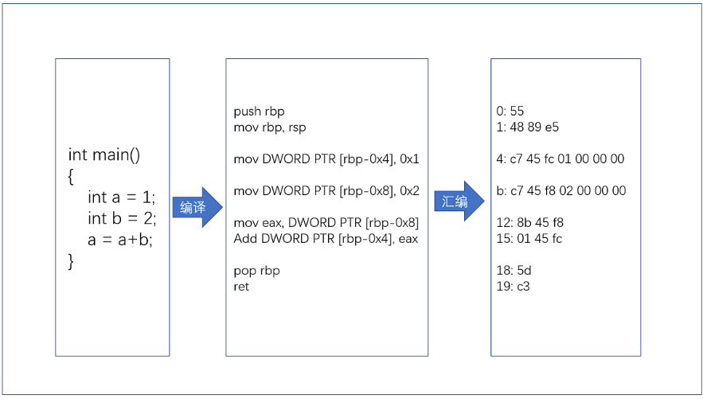
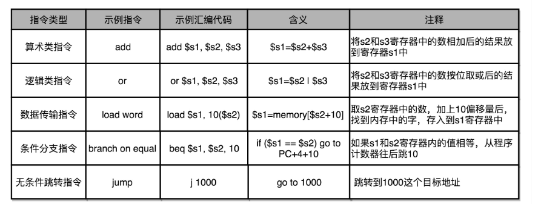
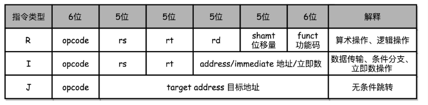
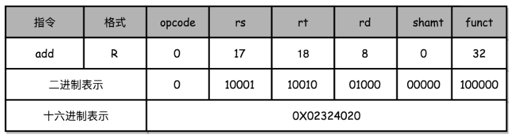
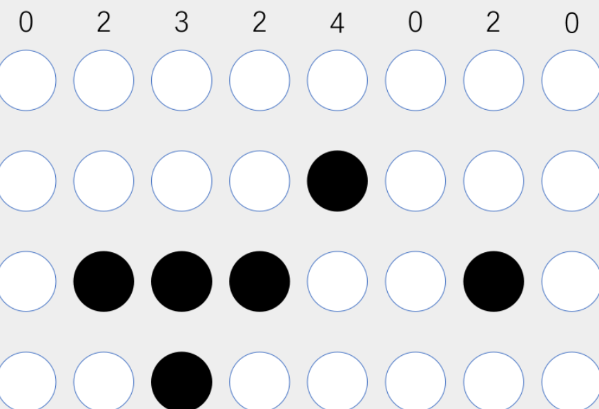

## 1. 机器码与cpu指令

​	从**硬件**的角度来看，CPU 就是一个超大规模集成电路，通过电路实现了加法、乘法乃至各种各样的处理逻辑	

​	从**软件**工程师的角度来讲，CPU 就是一个执行各种**计算机指令**（Instruction Code）的逻辑机器。这里的计算机指令，就好比一门 CPU 能够听得懂的语言，我们也可以把它叫作**机器语言**（Machine Language）

### 1.1. 指令集概述

​	不同的 CPU 能够听懂的语言不太一样。比如，我们的个人电脑用的是 Intel 的 CPU，苹果手机用的是 ARM 的 CPU。这两者能听懂的语言就不太一样。类似这样两种 CPU 各自支持的语言，就是两组不同的**计算机指令集**

​	如果我们在自己电脑上写一个程序，然后把这个程序复制一下，装到自己的手机上，肯定是没办法正常运行的，因为这两者语言不通。而一台电脑上的程序，简单复制一下到另外一台电脑上，通常就能正常运行，因为这两台 CPU 有着相同的指令集，也就是说，它们的语言相通的

​	一个计算机程序，不可能只有一条指令，而是由成千上万条指令组成的。但是 CPU 里不能一直放着所有指令，所以计算机程序平时是存储在存储器中的。这种程序指令存储在存储器里面的计算机，我们就叫作**存储程序型计算机**

PS:非存储程序型的计算机可以是插线板计算机，通过各种接线来完成不同的程序

### 1.2. 机器码与汇编

平时编写的代码，到底是怎么变成一条条计算机指令，最后被 CPU 执行的呢？

```
// test.c
int main()
{
  int a = 1; 
  int b = 2;
  a = a + b;
}
```

* 让这段程序在一个 Linux 操作系统上跑起来

  我们需要把整个程序翻译成一个**汇编语言**（ASM，Assembly Language）的程序，这个过程我们一般叫编译（Compile）成汇编代码

* 针对汇编代码，我们可以再用汇编器（Assembler）翻译成机器码（Machine Code）。这些机器码由“0”和“1”组成的机器语言表示。这一条条机器码，就是一条条的**计算机指令**

在一个 Linux 操作系统上，我们可以简单地使用 gcc 和 objdump 这样两条命令，把对应的汇编代码和机器码都打印出来

```
test.o:     file format elf64-x86-64
Disassembly of section .text:
0000000000000000 <main>:
int main()
{
   0:   55                      push   rbp
   1:   48 89 e5                mov    rbp,rsp
  int a = 1; 
   4:   c7 45 fc 01 00 00 00    mov    DWORD PTR [rbp-0x4],0x1
  int b = 2;
   b:   c7 45 f8 02 00 00 00    mov    DWORD PTR [rbp-0x8],0x2
  a = a + b;
  12:   8b 45 f8                mov    eax,DWORD PTR [rbp-0x8]
  15:   01 45 fc                add    DWORD PTR [rbp-0x4],eax
}
  18:   5d                      pop    rbp
  19:   c3                      ret    
```

* 左侧有一堆数字，这些就是一条条机器码
* 右边有一系列的 push、mov、add、pop 等，这些就是对应的汇编代码
* 一行 C 语言代码，有时候只对应一条机器码和汇编代码，有时候则是对应两条机器码和汇编代码
* 汇编代码和机器码之间是一一对应的

如下为高级语言转化为机器语言的示意图：

 

**PS: GCC（GUC 编译器套装，GUI Compiler Collectipon）编译器的时候，可以直接把代码编译成机器码**?

这里为什么需要有汇编语言？

汇编代码其实就是“给程序员看的机器码”，也正因为这样，机器码和汇编代码是一一对应的。我们人类很容易记住 add、mov 这些用英文表示的指令，而 8b 45 f8 这样的指令，由于很难一下子看明白是在干什么，所以会非常难以记忆

### 1.3. 指令和机器码分类

常见的指令可以分成五大类：

* **算术类指令**

  我们的加减乘除，在 CPU 层面，都会变成一条条算术类指令。

* **数据传输类指令**

  给变量赋值、在内存里读写数据，用的都是数据传输类指令。

* **逻辑类指令**

  逻辑上的与或非，都是这一类指令。

* **条件分支类指令**

  日常我们写的“if/else”，其实都是条件分支类指令。

* **无条件跳转指令**

  写一些大一点的程序，我们常常需要写一些函数或者方法。在调用函数的时候，其实就是发起了一个无条件跳转指令。

如下位计算机指令含义及示例

 

### 1.4. MIPS 指令集

编器是怎么把对应的汇编代码，翻译成为机器码的呢？

首先不同的 CPU 有不同的指令集，也就对应着不同的汇编语言和不同的机器码。

#### 1.4.1.  定义

这里是最简单的 MIPS 指令集:

 

​	MIPS 的指令是一个 32 位的整数，高 6 位叫**操作码**（Opcode），也就是代表这条指令具体是一条什么样的指令，剩下的 26 位有三种格式，分别是 R、I 和 J：

* **R 指令**是一般用来做算术j逻辑操作，里面有读取和写入数据的寄存器的地址。如果是逻辑位移操作，后面还有位移操作的位移量，而最后的功能码，则是在前面的操作码不够的时候，扩展操作码表示对应的具体指令的
* **I 指令**，则通常是用在数据传输、条件分支，以及在运算的时候使用的并非变量还是常数的时候。这个时候，没有了位移量和操作码，也没有了第三个寄存器，而是把这三部分直接合并成了一个地址值或者一个常数。
* **J 指令**就是一个跳转指令，高 6 位之外的 26 位都是一个跳转后的地址。

#### 1.4.2.  add指令示例

以一个简单的加法算术指令 add t0,s1, $s2, 为例，给你解释。为了方便，下面都用十进制来表示对应的代码。

```
add $t0,$s2,$s1
```

* 对应的 MIPS 指令里 opcode 是 0

* rs 代表第一个寄存器 s1 的地址是 17
* rt 代表第二个寄存器 s2 的地址是 18
* rd 代表目标的临时寄存器 t0 的地址，是 8。
* 因为不是位移操作，所以位移量是 0。
* 把这些数字拼在一起，就变成了一个 MIPS 的加法指令。

为了读起来方便，我们一般把对应的二进制数，用 16 进制表示出来。在这里，也就是 0X02324020。这个数字也就是这条指令对应的机器码:

 

如果我们用打孔代表 1，没有打孔代表 0，用 4 行 8 列代表一条指令来打一个穿孔纸带，一列代表4位的二进制数，它转换成16进制0X02324020，那么这条命令大概就长这样:

 

#### 1.4.3.  打印数字

### 1.5. 小结

* 不同指令集里，对应的汇编代码会对应这个指令集的机器码
* 高级语言在转换成为机器码的时候，是通过编译器进行的，需要编译器指定编译成哪种汇编/机器码
* 物理机自己执行的时候只有机器码，并不认识汇编代码
* 编译器如果支持编译成不同的体系结构的汇编/机器码，就要维护很多不同的对应关系表，但是这个表并不会太大。以最复杂的Intel X86的指令集为例，也只有2000条不同的指令而已
* Java 这样使用虚拟机的语言，其实最终都是由不同形式的程序，把我们写好的代码，转换成 CPU 能够理解的机器码
* 解释型语言，是通过解释器在程序运行的时候逐句翻译，而 Java 这样使用虚拟机的语言，则是由虚拟机对编译出来的中间代码进行解释，或者即时编译成为机器码来最终执行
* shell脚本是被bash解释器来运行的，调用对应的编译好的二进制可执行文件相当于bash解释器在做对应的“翻译”动作

## 2. 指令跳转

