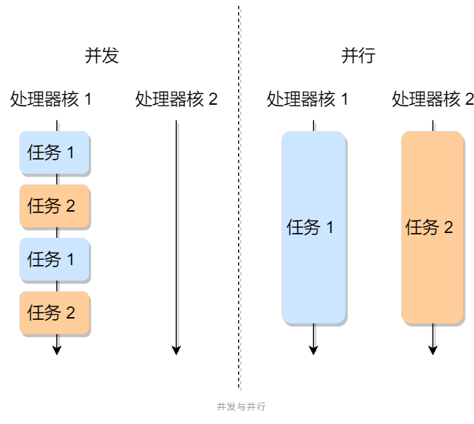

## 1. 概要

 

本文主要通过如下几块进行分析。

## 2. 进程

### 2.1. 什么是进程

​	我们编写的代码只是一个存储在硬盘的静态文件，通过编译后就会生成二进制可执行文件，当我们运行这个可执行文件后，它会被装载到内存中，接着 CPU 会执行程序中的每一条指令，那么这个**运行中的程序，就被称为「进程」**。

### 2.2. 并发与并发

#### 2.2.1. 进程并发

​	现在我们考虑有一个会读取硬盘文件数据的程序被执行了，那么当运行到读取文件的指令时，就会去从硬盘读取数据，但是硬盘的读写速度是非常慢的，那么在这个时候，如果 CPU 傻傻的等硬盘返回数据的话，那 CPU 的利用率是非常低的。

​	所以，当进程要从硬盘读取数据时，CPU 不需要阻塞等待数据的返回，而是去执行另外的进程。当硬盘数据返回时，CPU 会收到个**中断**，于是 CPU 再继续运行这个进程

 

这种**多个程序、交替执行**的思想，就有 CPU 管理多个进程的初步想法。对于一个支持多进程的系统，CPU 会从一个进程快速切换至另一个进程，其间每个进程各运行几十或几百个毫秒。虽然单核的 CPU 在某一个瞬间，只能运行一个进程。但在 1 秒钟期间，它可能会运行多个进程，这样就产生**并行的错觉**，实际上这是**并发**

#### 2.2.2. 进程并行

 

如图所示，并发和并行的区别。

### 2.3. 进程状态

#### 2.3.1. 基本状态

​	一般说来，一个进程并不是自始至终连续不停地运行的，它与并发执行中的其他进程的执行是相互制约的。

​	它有时处于运行状态，有时又由于某种原因而暂停运行处于等待状态，当使它暂停的原因消失后，它又进入准备运行状态。

​	所以，**在一个进程的活动期间至少具备三种基本状态，即运行状态、就绪状态、阻塞状态。**

 

上图中各个状态的意义：

- 运行状态（*Runing*）：该时刻进程占用 CPU；
- 就绪状态（*Ready*）：可运行，但因为其他进程正在运行而暂停停止；
- 阻塞状态（*Blocked*）：该进程正在等待某一事件发生（如等待输入/输出操作的完成）而暂时停止运行，这时，即使给它CPU控制权，它也无法运行；

当然，进程另外两个基本状态：

- 创建状态（*new*）：进程正在被创建时的状态；
- 结束状态（*Exit*）：进程正在从系统中消失时的状态；

于是，一个完整的进程状态的变迁如下图：

 

- NULL -> 创建状态

  一个新进程被创建时的第一个状态；

- 创建状态 -> 就绪状态

  当进程被创建完成并初始化后，一切就绪准备运行时，变为就绪状态，这个过程是很快的；

- 就绪态 -> 运行状态：

  处于就绪状态的进程被操作系统的进程调度器选中后，就分配给 CPU 正式运行该进程；

- 运行状态 -> 结束状态：

  当进程已经运行完成或出错时，会被操作系统作结束状态处理；

- 运行状态 -> 就绪状态：

  处于运行状态的进程在运行过程中，由于分配给它的运行时间片用完，操作系统会把该进程变为就绪态，接着从就绪态选中另外一个进程运行；

- 运行状态 -> 阻塞状态：

  当进程请求某个事件且必须等待时，例如请求 I/O 事件；

- 阻塞状态 -> 就绪状态：

  当进程要等待的事件完成时，它从阻塞状态变到就绪状态；

#### 2.3.2. 挂起状态

​	另外，还有一个状态叫**挂起状态**，它表示进程没有占有内存空间。这跟阻塞状态是不一样，阻塞状态是等待某个事件的返回。

​	由于虚拟内存管理原因，进程的所使用的空间可能并没有映射到物理内存，而是在硬盘上，这时进程就会出现挂起状态

 

挂起状态可以分为两种：

- 阻塞挂起状态：进程在外存（硬盘）并等待某个事件的出现；
- 就绪挂起状态：进程在外存（硬盘），但只要进入内存，即刻立刻运行；

#### 2.3.3. 挂起与阻塞区别

* 共同点

  都导致进程暂停执行。
  进程都释放CPU，即两个过程都会涉及上下文切换。

* 不同点：

  * 对系统资源占用不同

    虽然都释放了CPU，但阻塞的进程仍处于内存中，而挂起的进程通过“对换”技术被换出到磁盘中。

  * 发生时机不同

    阻塞一般在进程等待资源（IO资源、信号量等）时发生；

    而挂起是由于用户和系统的需要，例如，终端用户需要暂停程序研究其执行情况或对其进行修改、OS为了提高内存利用率需要将暂时不能运行的进程（处于就绪或阻塞队列的进程）调出到磁盘

  * 恢复时机不同

    阻塞要在等待的资源得到满足（例如获得了锁）后，才会进入就绪状态，等待被调度而执行；

    被挂起的进程由将其挂起的对象（如用户、系统）在时机符合时（调试结束、被调度进程选中需要重新执行）将其主动激活。

#### 2.3.4. 进程状态小结

这两种挂起状态加上前面的五种状态，就变成了七种状态变迁（留给我的颜色不多了），见如下图：

 

**sleep() 方法并不影响线程的状态。即sleep() 方法并不会触发线程状态的变化，它原来是在什么状态，现在就还是什么状态（注意这里的状态仅限于讨论JVM层面的线程状态，而不关心底层OS对线程的调度情况）**

sleep() 方法只是会让出CPU，让一个线程“等一会儿再执行”，同时它是没有释放锁的。而等待状态，则是一个线程“释放锁和CPU”，来等待另一个线程再次通知（notify）它。

阻塞状态：只有在等待锁的的时候，线程才是阻塞状态。即线程想要执行一段代码，无奈还没拿到这段代码的执行权，必须要排队**等待**执行权。这个操作对线程来说是被动的。

等待状态：等待状态是线程自己主动让出自己的资源，来等待一个条件。即线程想要的条件还没达到，自己干占着CPU也是浪费，所以让出资源，等待想要的条件满足后再执行。这个操作对线程来说是**主动的**。(等时机成熟了再行动，现在老子要先睡会儿)

### 2.4. 控制结构

在操作系统中，是用**进程控制块**（*process control block，PCB*）数据结构来描述进程的。

**PCB 是进程存在的唯一标识**，这意味着一个进程的存在，必然会有一个 PCB，如果进程消失了，那么 PCB 也会随之消失。

#### 2.4.1. PC字段

* **进程描述信息：**

  - 进程标识符：标识各个进程，每个进程都有一个并且唯一的标识符；

  - 用户标识符：进程归属的用户，用户标识符主要为共享和保护服务；

* **进程控制和管理信息：**

  - 进程当前状态，如 new、ready、running、waiting 或 blocked 等；

  - 进程优先级：进程抢占 CPU 时的优先级；

* **资源分配清单：**
  - 有关内存地址空间或虚拟地址空间的信息，所打开文件的列表和所使用的 I/O 设备信息。

* **CPU 相关信息：**
  - CPU 中各个寄存器的值，当进程被切换时，CPU 的状态信息都会被保存在相应的 PCB 中，以便进程重新执行时，能从断点处继续执行。

可见，PCB 包含信息还是比较多

#### 2.4.2. PCB链表

每个 PCB 是如何组织的呢？

通常是通过**链表**的方式进行组织，把具有**相同状态的进程链在一起，组成各种队列**。比如：

- **就绪队列** 

  将所有处于就绪状态的进程链在一起；

- **阻塞队列** 

  把所有因等待某事件而处于等待状态的进程链在一起就组成各种；

另外，对于运行队列在单核 CPU 系统中则只有一个运行指针了，因为单核 CPU 在某个时间，只能运行一个程序。

那么，就绪队列和阻塞队列链表的组织形式如下图：

 

除了链接的组织方式，还有索引方式，它的工作原理：

将同一状态的进程组织在一个索引表中，索引表项指向相应的 PCB，不同状态对应不同的索引表。

**一般会选择链表，因为可能面临进程创建，销毁等调度导致进程状态发生变化，所以链表能够更加灵活的插入和删除**。

#### 2.4.3. 进程控制

​	我们熟知了进程的状态变迁和进程的数据结构 PCB 后，再来看看进程的**创建、终止、阻塞、唤醒**的过程，这些过程也就是进程的控制

* **创建进程**

  操作系统允许一个进程创建另一个进程，而且允许子进程继承父进程所拥有的资源，当子进程被终止时，其在父进程处继承的资源应当还给父进程。同时，终止父进程时同时也会终止其所有的子进程。

  创建进程的过程如下：

  - 为新进程分配一个唯一的进程标识号，并申请一个空白的 PCB，PCB 是有限的，若申请失败则创建失败；

  - 为进程分配资源，此处如果资源不足，进程就会进入等待状态，以等待资源；

  - 初始化 PCB；

  - 如果进程的调度队列能够接纳新进程，那就将进程插入到就绪队列，等待被调度运行；

* **终止进程**

  进程可以有 3 种终止方式：正常结束、异常结束以及外界干预（信号 `kill` 掉）。

  终止进程的过程如下：

  - 查找需要终止的进程的 PCB；

  - 如果处于执行状态，则立即终止该进程的执行，然后将 CPU 资源分配给其他进程；

  - 如果其还有子进程，则应将其所有子进程终止；

  - 将该进程所拥有的全部资源都归还给父进程或操作系统；

  - 将其从 PCB 所在队列中删除；

* **阻塞进程**

  当进程需要等待某一事件完成时，它可以调用阻塞语句把自己阻塞等待。而一旦被阻塞等待，它只能由另一个进程唤醒。

  阻塞进程的过程如下：

  - 找到将要被阻塞进程标识号对应的 PCB；

  - 如果该进程为运行状态，则保护其现场，将其状态转为阻塞状态，停止运行；

  - 将该 PCB 插入的阻塞队列中去；

* **唤醒进程**

  进程由「运行」转变为「阻塞」状态是由于进程必须等待某一事件的完成，所以处于阻塞状态的进程是绝对不可能叫醒自己的。

  如果某进程正在等待 I/O 事件，需由别的进程发消息给它，则只有当该进程所期待的事件出现时，才由发现者进程用唤醒语句叫醒它。

  唤醒进程的过程如下：

  - 在该事件的阻塞队列中找到相应进程的 PCB；

  - 将其从阻塞队列中移出，并置其状态为就绪状态；

  - 把该 PCB 插入到就绪队列中，等待调度程序调度；

  进程的阻塞和唤醒是一对功能相反的语句，如果某个进程调用了阻塞语句，则必有一个与之对应的唤醒语句

### 2.5. 上下文切换

各个进程之间是共享 CPU 资源的，在不同的时候进程之间需要切换，让不同的进程可以在 CPU 执行，那么这个**一个进程切换到另一个进程运行，称为进程的上下文切换**。

#### 2.5.1. CPU上下文切换

大多数操作系统都是多任务，通常支持大于 CPU 数量的任务同时运行。实际上，这些任务并不是同时运行的，只是因为系统在很短的时间内，让各个任务分别在 CPU 运行，于是就造成同时运行的错误。

任务是交给 CPU 运行的，那么在每个任务运行前，CPU 需要知道任务从哪里加载，又从哪里开始运行。

所以，操作系统需要事先帮 CPU 设置好 **CPU 寄存器和程序计数器**。

CPU 寄存器是 CPU 内部一个容量小，但是速度极快的内存（缓存）。我举个例子，寄存器像是你的口袋，内存像你的书包，硬盘则是你家里的柜子，如果你的东西存放到口袋，那肯定是比你从书包或家里柜子取出来要快的多。再来，程序计数器则是用来存储 CPU 正在执行的指令位置、或者即将执行的下一条指令位置。

所以说，CPU 寄存器和程序计数是 CPU 在运行任何任务前，所必须依赖的环境，这些环境就叫做 **CPU 上下文**。

既然知道了什么是 CPU 上下文，那理解 CPU 上下文切换就不难了。

CPU 上下文切换就是先把前一个任务的 CPU 上下文（CPU 寄存器和程序计数器）保存起来，然后加载新任务的上下文到这些寄存器和程序计数器，最后再跳转到程序计数器所指的新位置，运行新任务。

系统内核会存储保持下来的上下文信息，当此任务再次被分配给 CPU 运行时，CPU 会重新加载这些上下文，这样就能保证任务原来的状态不受影响，让任务看起来还是连续运行。

上面说到所谓的「任务」，主要包含进程、线程和中断。所以，可以根据任务的不同，把 CPU 上下文切换分成：**进程上下文切换、线程上下文切换和中断上下文切换**。

#### 2.5.2. 进程上下文切换

进程是由内核管理和调度的，所以进程的切换只能发生在内核态。

所以，**进程的上下文切换不仅包含了虚拟内存、栈、全局变量等用户空间的资源，还包括了内核堆栈、寄存器等内核空间的资源。**

通常，会把交换的信息保存在进程的 PCB，当要运行另外一个进程的时候，我们需要从这个进程的 PCB 取出上下文，然后恢复到 CPU 中，这使得这个进程可以继续执行，如下图所示：

 

大家需要注意，进程的上下文开销是很关键的，我们希望它的开销越小越好，这样可以使得进程可以把更多时间花费在执行程序上，而不是耗费在上下文切换。

发生进程上下文切换场景：

- 为了保证所有进程可以得到公平调度，CPU 时间被划分为一段段的时间片，这些时间片再被轮流分配给各个进程。这样，当某个进程的时间片耗尽了，就会被系统挂起，切换到其它正在等待 CPU 的进程运行；
- 进程在系统资源不足（比如内存不足）时，要等到资源满足后才可以运行，这个时候进程也会被挂起，并由系统调度其他进程运行；
- 当进程通过睡眠函数 sleep 这样的方法将自己主动挂起时，自然也会重新调度；
- 当有优先级更高的进程运行时，为了保证高优先级进程的运行，当前进程会被挂起，由高优先级进程来运行；
- 发生硬件中断时，CPU 上的进程会被中断挂起，转而执行内核中的中断服务程序；

以上，就是发生进程上下文切换的常见场景了

## 3. 线程

在早期的操作系统中都是以进程作为独立运行的基本单位，直到后面，计算机科学家们又提出了更小的能独立运行的基本单位，也就是**线程。**

### 3.1. 线程使用背景

我们举个例子，假设你要编写一个视频播放器软件，那么该软件功能的核心模块有三个：

- 从视频文件当中读取数据；
- 对读取的数据进行解压缩；
- 把解压缩后的视频数据播放出来；

对于单进程的实现方式，我想大家都会是以下这个方式：

 、

对于单进程的这种方式，存在以下问题：

- 播放出来的画面和声音会不连贯，因为当 CPU 能力不够强的时候，`Read` 的时候可能进程就等在这了，这样就会导致等半天才进行数据解压和播放；
- 各个函数之间不是并发执行，影响资源的使用效率；

那改进成多进程的方式：

 

对于多进程的这种方式，依然会存在问题：

- 进程之间如何通信，共享数据？
- 维护进程的系统开销较大，如创建进程时，分配资源、建立 PCB；终止进程时，回收资源、撤销 PCB；进程切换时，保存当前进程的状态信息；

那到底如何解决呢？需要有一种新的实体，满足以下特性：

- 实体之间可以并发运行；
- 实体之间共享相同的地址空间；

这个新的实体，就是**线程( \*Thread\* )**，线程之间可以并发运行且共享相同的地址空间。