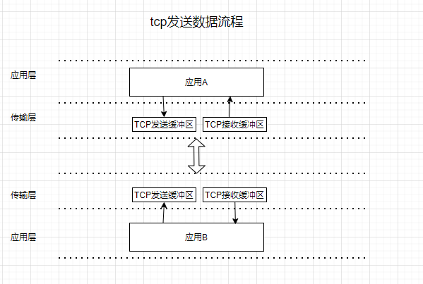
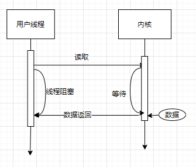
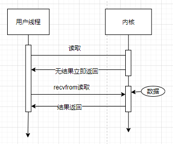
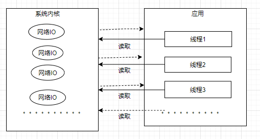
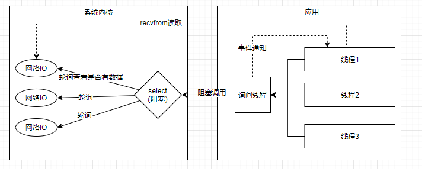
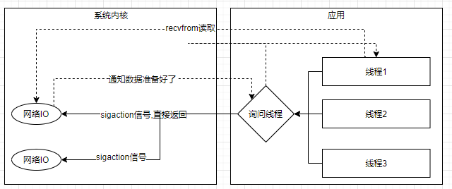
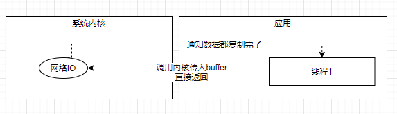
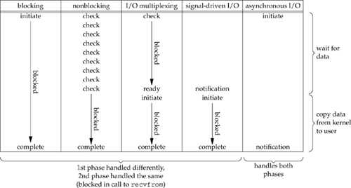

## 1. 概要
### 1.1. Tcp的发送流程
&emsp;&emsp;Tcp是传输层可靠的传输协议，我们从A向B发送数据，首先要将A放到tcp的发送缓冲区，并添加一些底层的网络协议后，传输到B所在的主机的接收缓冲区之中，应用B通过读取缓冲区的内容获取到A发送的数据。  
  
## 2. IO模型
&emsp;&emsp;应用和缓冲区进行打交道的模式有好几种，这个模式被称为IO模型。网络通讯分为阻塞和阻塞两种调用类型。什么是阻塞和非阻塞呢？  
&emsp;&emsp;当应用去缓冲区读取数据的时候，实际上调用的是recvfrom函数读取，如果数据还没到，那么这个方法是一直等着还是直接返回呢，同理应用发送数据也会有这个问题，什么阻塞和非阻塞的含义不言而喻。  
### 2.1. 阻塞IO/非阻塞IO
* 阻塞IO  
    
  &emsp;&emsp;如上图，用户线程调用方法读取数据，如果数据没有，则会一直阻塞等待，数据有了会返回给用户线程。
* 非阻塞IO  
  
    
&emsp;&emsp;如上图，用户线程调用方法读取数据，如果数据没有，则会直接返回没有的结果，用户线程则需要等一会儿或者下次获取，但是一直没有的话，则需要重复做这个动作。
### 2.2. 最初的模型的问题  
  
&emsp;&emsp;我们采用这个前面提到的简单的IO模型去处理网络请求，如上图所示。用户创建了很多线程去从内核读取数据，但是内核有很有可能没有数据，要么被阻塞，要么被直接返回无数据，为了读取数据及时，很多业务线程就可能要去轮询去重试读取，这读取的操作就非常消耗CPU资源，并且随着线程数的增大，浪费也可能越来越大。所以就有人想到了有没有来数据，这个操作是不是可以拆分出来，不用那么多线程都去做，用一个单独的或者几个线程去做，有数据的化就通知用户线程去读取，没数据的话就不要浪费资源啦。于是IO复用模型产生了。  
### 2.3. IO复用模型
PS:linux系统把所有网络请求以一个fd来标识，叫做fd文件描述符。  
  
&emsp;&emsp;正如上图所：操作系统提供了函数select，该函数内部同时监控多个fd，只要fd说自己自己准备好了，这个select函数就会返回状态，没有准备好那么就阻塞着，那么就可以通知用户线程说你去处理吧，于是用户的业务线程就知道要去调用recvfrom函数去从内核缓冲区中将数据复制过来，接着该干嘛干嘛了。  
&emsp;&emsp;当然select阻塞就是不断地轮询去查看fd是不是准备好了，还是有浪费CPU的感觉。于是有人想到是不是可以不去轮询，让fd好了通知就好了。于是就有了信号驱动模型了。

### 2.4. 信号驱动IO模型  
  
&emsp;&emsp;如上图所示，应用的用户线程先向内核注册个信号，当网络有数据来了后，就会触发这个信号，用户线程将会收到这个信号，然后发起向内核读取数据的请求。这个听上去很完美，几乎很完美，但是现实很骨感，内核发送这个信号并不完善，有时候并不知道为啥这个信号会被发送，现实的开发中这种IO模式基本很少被采用。  

### 2.5. 异步IO
&emsp;&emsp;以上的IO模型，都是需要两阶段，就是操作数据需要先去问问有没有有，不管是一个线程轮询，还是信号通知，都得让用户线程程序去recvfrom一下内核。如何一次性将数据写入到用户态呢，异步IO就可以实现；  
  
&emsp;&emsp;如上图所示：应用向内核发送一个读取数据的请求，传入用户态buffer，当缓冲区数据ready好了，直接写入用户态，然后通知用户态就可以了。那这样就完成了一个异步读取数据过程了，就是说异步IO模式，直接一次性发送了请求，内核就会把数据拷贝好，好了通知你一下就行了，这就是典型的异步。

## 3. 总结  
&emsp;&emsp;按照Linux内核设计与实现书籍中同步异步的定义，IO阻塞、IO非阻塞、IO多路复用、信号驱动IO属于同步的，因为用户线程需要同步等到内核态的数据就绪后才会拷贝数据到用户态中，当然这里面会区分阻塞和非阻塞，多路复用请求内核的时候是阻塞的，而信号驱动是调用内核注册了通知信号，然后直接返回了，这是非阻塞的，数据ready了，需要用户线程自行去读取；而异步IO是用户请求内核要读取数据了，先直接返回了，数据最后会直接将数据拷贝好了，相当于读取动作完成了，然后通知用户态，对于程序来说这个就是异步的。  
&emsp;&emsp;我从网上找了张图，可以堆这些模式进行个比较：  
