## 1. http发展史

​	在 1950 年代，通信研究者们认识到不同计算机用户和网络之间的需要通信，这促使了分布式网络、排队论和封包交互的研究。在1958 年2月7日，美国国防部长尼尔 · 麦克尔罗伊发布了国防部 5105.15 号指令，建立了高级研究计划局(ARPA) 

​	ARPA 不仅成为网络诞生地，同样也是电脑图形、平行过程、计算机模拟飞行等重要成果的诞生地。

​	1974 年 ARPA 的罗伯特·卡恩和斯坦福的文顿·瑟夫提出TCP/IP 协议。

​    1986 年，美国国家科学基金会（National Science Foundation，NSF）建立了大学之间互联的骨干网络 NSFNET ，这是互联网历史上重要的一步。

​	在 1990 年 ，蒂姆·伯纳斯-李创建了运行万维网所需的所有工具：超文本传输协议（HTTP）、超文本标记语言（HTML）、第一个网页浏览器、第一个网页服务器和第一个网站。至此，互联网开启了快速发展之路

### 1.1. HTTP0.9 时代

蒂姆·伯纳斯-李发表了一篇论文，文中提出了三项现在看来很平常的三个概念。然后付之于行动，把这些都搞出来了，称之为万维网（World Wide Web）

- URI，统一资源标识符，作为互联网上的唯一标识。
- HTML，超文本标记语言，描述超文本。
- HTTP ，超文本传输协议，传输超文本。

​	互联网初期，计算机的处理能力包括网速等等都很弱，所以 HTTP 也逃脱不了那个时代的约束，因此设计的非常简单，而且也是纯文本格式。当时的想法是文档存在服务器里面，我们只需要从服务器获取文档，因此只有 “GET”，也不需要啥请求头，并且拿完了就结束了，因此请求响应之后连接就断了。

​	这时候的 HTTP 还没有版本号的，之所以称之为 HTTP / 0.9 是后人加上去了，为了区别之后的版本

### 1.2. HTTP1.0 时代

​	随着图像和音频的发展，浏览器也在不断的进步予以支持。在 1995 年又开发出了 Apache，简化了 HTTP 服务器的搭建，越来越多的人用上了互联网，这也促进了 HTTP 协议的修改。需求促使添加各种特性来满足用户的需求，经过了一系列的草案 HTTP/1.0 于 1996 年正式发布。

​	Dave Raggett 在1995年领导了 HTTP 工作组，他希望通过扩展操作、扩展协商、更丰富的元信息以及与安全协议相关的安全协议来扩展协议，这种安全协议通过添加额外的方法和头字段来提高效率。

 HTTP/1.0 版本主要增加以下几点：

- 增加了 HEAD、POST 等新方法。

  HEAD 还可以只拿元信息不必传输全部内容，提高某些场景下的效率。

- 增加了响应状态码。

  引入的响应状态码让请求方可以得知服务端的情况，可以区分请求出错的原因，不会一头雾水。

- 引入了头部，即请求头和响应头。

  引入了头部，使得请求和响应更加的灵活，把控制数据和业务实体进行了拆分，也是一种解耦。

- 在请求中加入了 HTTP 版本号。

  新增了版本号表明这是一种工程化的象征，说明走上了正途，毕竟没版本号无法管理。

- 引入了 Content-Type ，使得传输的数据不再限于文本。

  引入了 Content-Type，支持传输不同类型的数据，丰富了协议的载体，充实了用户的眼球。

不过那时候 HTTP/1.0 还不是标准，没有实际的约束力，各方势力不吃这一套

### 1.3. HTTP1.1 时代

HTTP/1.1 版本在 1997 的 RFC 2068 中首次被记录，从 1995 年至 1999 年间的第一次浏览器大战，极大的推动了 Web 的发展。

随着发展 HTTP/1.0 演进成了 HTTP/1.1，并且在 1999 年废弃了之前的 RFC 2068，发布了 RFC 2616。

从版本号可以得知这是一个小版本的更新，更新主要是因为 HTTP/1.0 很大的性能问题：

**就是每请求一个资源都得新建一个 TCP 连接，而且只能串行请求**。

所以在 HTTP/1.1 版本主要增加以下几点：

- 新增了连接管理即 keepalive ，允许持久连接。
- 支持 pipeline，无需等待前面的请求响应，即可发送第二次请求。
- 允许响应数据分块（chunked），即响应的时候不标明Content-Length，客户端就无法断开连接，直到收到服务端的 EOF ，利于传输大文件。
- 新增缓存的控制和管理。
- 加入了 Host 头，用在你一台机子部署了多个主机，然后多个域名解析又是同一个 IP，此时加入了 Host 头就可以判断你到底是要访问哪个主机。

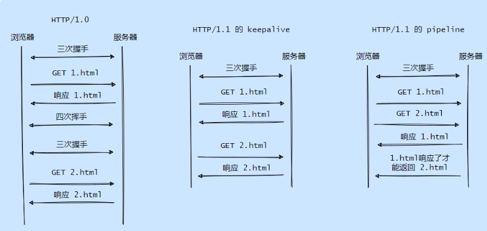 

**主要是为了解决性能的问题，包括支持持久连接、pipeline、缓存管理。**

后来到 2014 年对 HTTP/1.1 又做了一次修订，因为其太过庞大和复杂，因此进行了拆分，弄成了六份小文档 RFC7230 - RFC7235这时候 HTTP/1.1 已经成了标准，其实标准往往是在各大强力竞争对手相对稳定之后建立的，因为标准意味着统一，统一就不用费劲心思去兼容各种玩意

### 1.4. HTTP2.0 时代

随着 HTTP/1.1 的发布，互联网也开始了爆发式的增长，这种增长暴露出 HTTP 的不足，主要还是性能问题。

2015 年发布了 HTTP/2。

HTTP/2 版本主要增加以下几点：

- 是二进制协议，不再是纯文本

  简化了整齐的复杂性，解析数据的开销更小，数据更加紧凑，减少了网络的延迟，提升了整体的吞吐量

  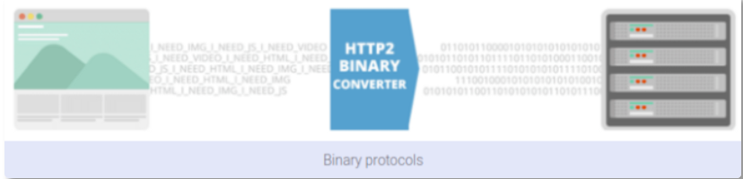 

- 支持一个 TCP 连接发起多请求，移除了 pipeline

  即支持多路复用，像 HTTP/1.1 pipeline 还是有阻塞的情况，需要等前面的一个响应返回了后面的才能返回

  多路复用就是完全异步化，这减少了整体的往返时间（RTT），解决了 HTTP 队头阻塞问题，也规避了 TCP 慢启动带来的影响

- 利用 HPACK 压缩头部，减少数据传输量

  采用了静态表、动态表和哈夫曼编码，在客户端和服务器都维护请求头的列表，所以只需要增量和压缩过的头部信息，服务端拿到之后组装一下就能得到完整的头部信息

  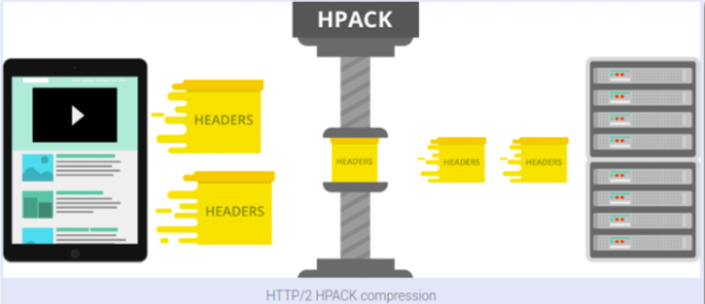 

  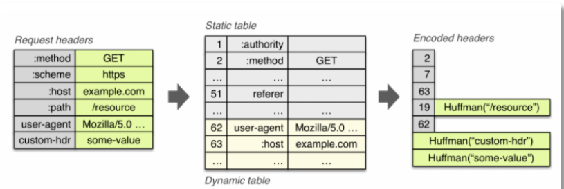 

- 允许服务端主动推送数据。

  这个其实就是减少了请求的次数，比如客户端请求 1.html，我把 1.html 需要的 js 和 css 也一块送过去，省的之后客户端再请求我要 js ，我要这个 css

可以看到 HTTP/2 的整体演进都是往性能优化的角度发展，因为此时的性能就是痛点，任何东西的演进都是哪里痛医哪里。

但是HTTP/1.1 这个历史包袱太重了，目前 HTTP/2 到现在也只有大致一半的网站使用它

 

### 1.5. HTTP2.0 时代

这 HTTP/2 还没捂热， HTTP/3 怎么就来了？

主要也是源自于痛点，这次的痛点来自于 HTTP 依赖的 TCP。

#### 1.5.1. 痛点 

* TCP 是面向可靠的、有序的传输协议，因此会有失败重传和按序机制，而 HTTP/2 是所有流共享一个 TCP 连接，所以会有 TCP 层面的队头阻塞，当发生重传时会影响多个请求响应。
* TCP 是基于四元组（源IP，源端口，目标IP，目标端口）来确定连接的，而在移动网络的情况下 IP 地址会频繁的换，这会导致反复的建连
* 还有 TCP 与 TLS 的叠加握手，增加了延时

问题就出在 TCP 身上，Google作为使用者把目光瞄向了 UDP。UDP 我们知道是无连接的，不管什么顺序，也不管你什么丢包。具体思路：把 TCP 可靠、有序的功能提到应用层来实现，因此 Google 就研究出了 QUIC 协议。

#### 1.5.2. QUIC 协议

QUIC 层来实现自己的丢包重传和拥塞控制，还有出于安全的考虑我们都会用 HTTPS ，所以需要多次握手

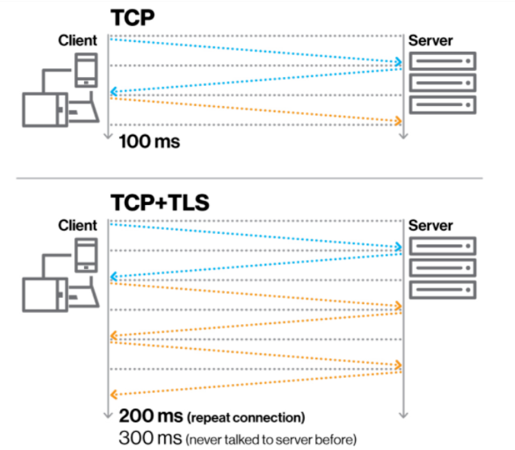 

QUIC 引入了个叫 Connection ID 来标识一个链接，所以切换网络之后可以复用这个连接，达到 0 RTT 就能开始传输

 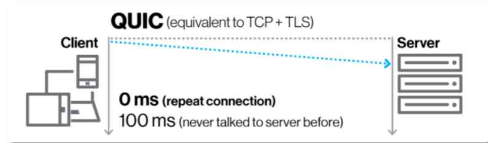 

上图是在已经和服务端握过手之后的，由于网络切换等原因才有 0 RTT ，也就是 Connection ID 在之前生成过了

如果是第一次建连还是需要多次握手的，我们来看一下简化的握手对比图:

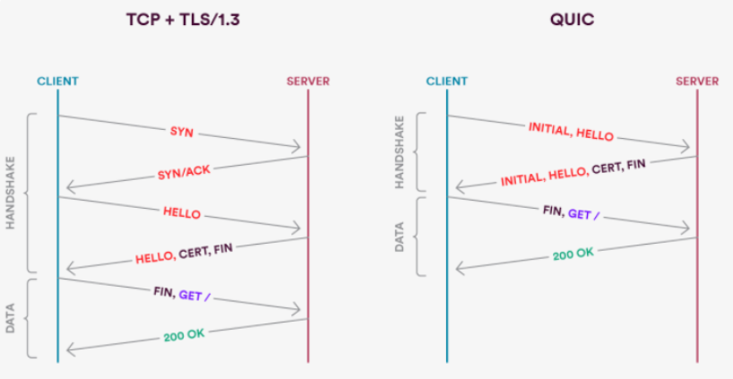 

所以所谓的 0RTT 是在之前已经建连的情况下。当然还有 HTTP/2 提到的 HPACK，这个是依赖 TCP 的可靠、有序传输的，于是 QUIC 得搞了个 QPACK，也采用了静态表、动态表和哈夫曼编码

它丰富了 HTTP/2 的静态表，从 61 项加到了 98 项。

上面提到的动态表，是用来存储未包含在静态表中的头部项，假设动态表还未收到，后面来解头部的时候肯定要被阻塞的。

所以 QPACK 就另开一条路，在单向的 Stream 里传输动态表的编解码，单向传输好了，接受端到才能开始解码，也就是说还没好你就先别管，防止做一半卡住了。

那还有前面提到的 TCP 队头阻塞， QUIC 是怎么解决的呢？毕竟它也要保证有序和可靠啊。

**因为 TCP 不认识每个流分别是哪个请求的，所以它只能全部阻塞住，而 QUIC 知道，因此比如请求 A 丢包了，我就把 A 卡住了就行，请求 B 完全可以全部放行，丝毫不受影响**。

可以看到基于 UDP 的 QUIC 还是很强大的，而且人家用户多，在 2018 年，互联网标准化组织 IETF 提议将 HTTP over QUIC 更名为 HTTP/3 并获得批准

### 1.6. 小结

就 HTTP 来说还是有很多内容的，有很多细节，很多算法，比如拿 Connection ID 来说，不同的四元组你如何保证请求一定会转发到之前的服务器上，这里只是浅显的谈了谈大致的演进

## 2. 基本概念

HTTP是什么呢？它是超文本传输协议，HTTP是缩写，它的全英文名是HyperText Transfer Protocol。

### 2.1. 超文本

超文本指的是HTML，css，JavaScript和图片等，HTTP的出现是为了接收和发布HTML页面，经过不断的发展也可以用于接收一些音频，视频，文件等内容

### 2.2. http架构

 

HTTP是基于客户端/服务端的架构模型，浏览器或其他任何客户端都可以用HTTP协议的，通过URL地址向HTTP的服务器即Web服务器发送所有请求，Web服务器端在接收到请求后会做出反应，响应给对方，就是向客户端回传响应的信息。我们可以概括为：

* **HTTP协议是用于客户端和服务器端之间的通信**

  用于客户端和服务器端之间的通信有HTTP协议和TCP/IP协议族在内的其他众多的协议。

* **请求访问文本或图片等资源的一方**我们叫做客户端；负责接收
* **提供响应的一方**称为服务器端。
* **Client客户端请求Server服务端，Server服务端响应给Client客户端。**

**注意：**在使用HTTP协议的时候，我们一端必定是客户端，另一端必定是服务器端。

有时候服务端和客户端是可以互换的，如果要决定谁是服务器端和谁是客户端，单就一条通信路线来讲，是可以确定的，因为由HTTP协议就可以区分谁是客户端，和谁是服务器端了。

### 2.3. http特点

* 支持客户端、服务器端模式，简单快速，客户端向服务器端请求服务时，只需传送请求方法和路径，灵活
  * HTTP都是由客户端发起请求的，并且由服务器端回应响应消息的

* HTTP允许传输任意类型的数据对象，无连接，限制每次连接只处理一个请求，无状态，HTTP协议是无状态协议，指明协议对于事务处理没有记忆能力

* 每次服务器在处理完客户端的请求后，并收到客户的应答后，就断开了通信，当客户端再次发送请求时就是一个新的连接，采用这种方式可以节省传输时间

  这也是**这是HTTP/1.0版的主要缺点，**每个TCP连接只能发送一个请求，发送数据完毕后，连接就关闭了，如果还要请求就必须要新建一个请求连接

* HTTP1.1虽然是无状态协议，但是为了实现期望的保持状态功能

  于是引入了Cookie技术，有了Cookie，和HTTP协议通信，就可以管理状态了

  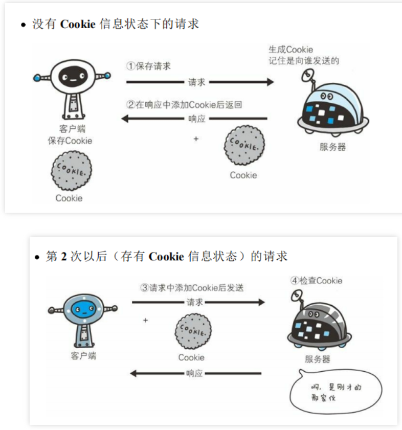 

* **TCP连接的新建成本很高，因为需要客户端和服务器端三次握手。**

  交流的简单流程：

  客户端发起连接，客户端发起请求，服务器端响应请求，服务器端关闭连接。

  HTTP、1.1版本是最流行的版本，可以持久连接，TCP连接默认不关闭，可以被多个请求复用，只有在一段时间内，没有请求，就可以自动关闭

  ```
  // 不用声明：Connection: keep-alive
  // 发送关闭Connection: close// 要求服务器关闭TCP连接
  ```

## 3. HTTP消息结构

我们可以把HTTP协议当做是一种客户端和服务器端相互沟通交流的语言，一个HTTP客户端在向服务器发送请求时会携带请求的消息，服务器端会根据客户端发送过来的请求消息了解客户端的需求，从而服务器端做出响应，发送响应消息给客户端

**HTTP超文本传输协议是一个基于请求与响应模式的，无状态的，应用层的协议，常基于TCP的连接方式。**

### 3.1. 请求消息结构

HTTP表示通过HTTP协议定位网络资源，host表示合法的Internet主机域名或者ip地址，port指定为端口号，请求有三部分构成：

* 请求行

  请求方法，URL，协议版本为

* 请求首部字段

  请求头部，头部字段名

* 内容实体

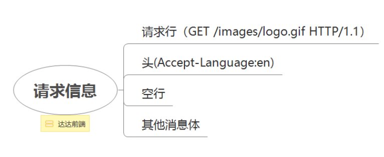 

#### 3.1.1. 请求行URL/URI

请求行由三部分组成，分别是**方法(GET)，URI(/)和http版本(HTTP/1.1)**

客户端发送给某个HTTP服务器端的请求报文中的内容，请求行 为请求消息的第一行，它说明了请求方法，**资源标示符**，HTTP版本，如下：

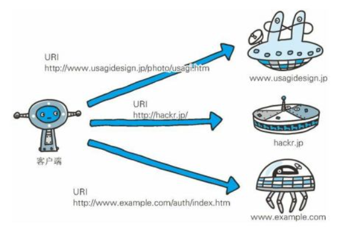 

请求URI定位资源：HTTP协议使用URI定位互联网上的资源。

URI,URL,URN是用来识别，定位和命名互联网上的资源

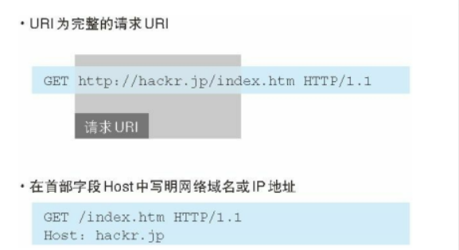 

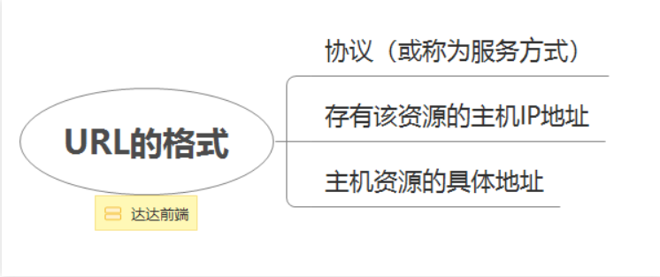 

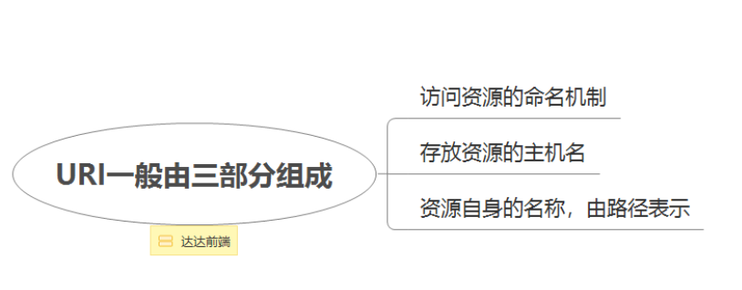 

```
URI：
Uniform Resource Identifier，统一资源标识符
URL：
Uniform Resource Locator，统一资源定位符
URN：
Uniform Resource Name，统一资源名称
```

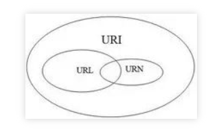 

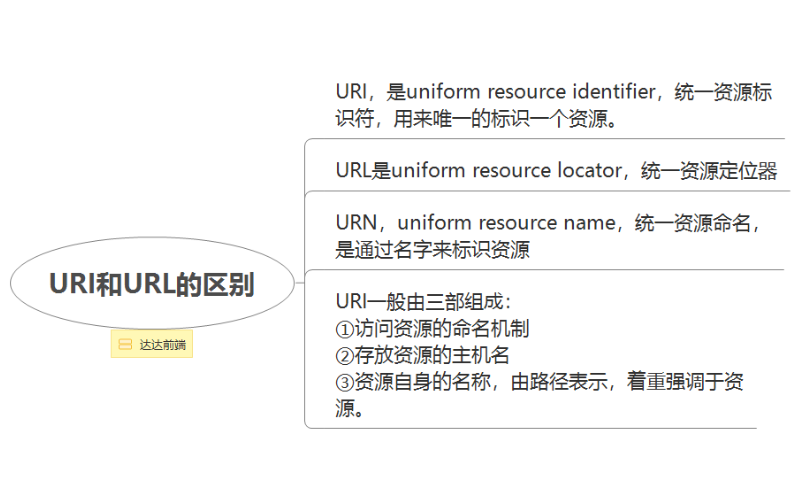 

#### 3.1.2. 请求行之方法

HTTP的请求方法有很多，但是最常见的两种请求方法是GET和POST。还有提交HTML表单或上传文件。

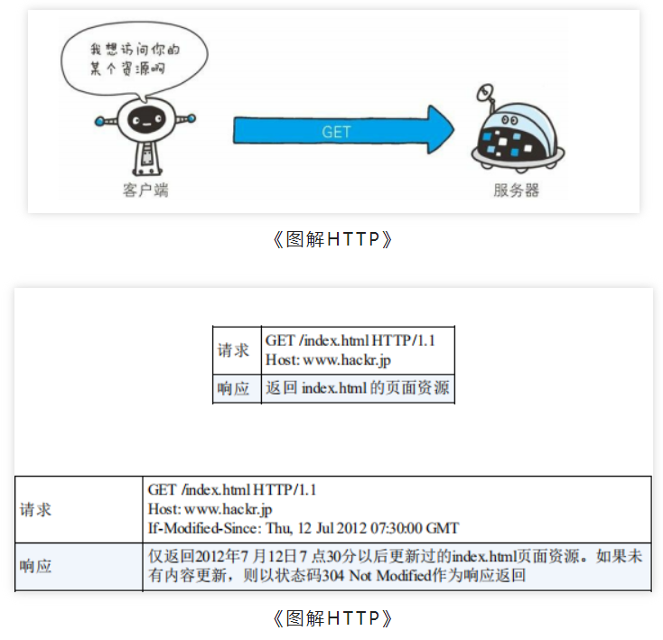 

* GET

  方法用于请求指定的页面信息，并返回请求消息的主体 

* POST

  用来传输实体的主体，方法用于向指定的资源提交数据

* PUT

  传输文件 

* HEAD

  获得报文首部 

* DELETE

  用来删除文件，是与 PUT 相反的方法

* OPTIONS

  询问支持的方法，方法用来查询针对请求 URI 指定的资源支持的方法

* TRACE

  回显服务器收到额请求

* CONNECT

  为保留将来使用

  

#### 3.1.3. 请求头

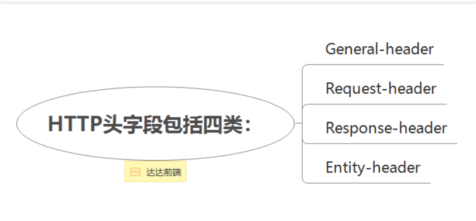 

```
GET /index.htm HTTP/1.1
User-Agent: Mozilla/4.0 (compatible; MSIE5.01; Windows NT)
Host: example.com
Accept-Language: en-us
Accept-Encoding: gzip, deflate
```

* Accept为客户端接受哪些Mine类型

* Accept-Encoding支持的编码类型

  客户端请求用Accept-Encoding字段说明自己可以接受哪些压缩方式

  ```
  Accept-Encoding: gzip, deflate
  ```

* Accept-Language为可接受的语言

* User-Agent为一个标识客户端的字符串

### 3.2. 响应消息结构

响应报文由协议版本，状态码，响应的首部字段，以及实体主体构成

* **状态行**

  HTTP/1.1为表示使用的协议是HTTP的版本，我们可以看到状态码常见返回“200 0k”代表是服务器成功响应了此次请求，消息报头，与HTTP请求头部一样，格式为“属性名:属性值"，客户端可以根据此获取服务器端响应的信息，响应正文是服务器返回响应的东西给到客户端，也是客户端想要的东西

  **HTTP状态码**（英语：HTTP Status Code）

  是用以表示网页服务器HTTP响应状态的3位数字代码。它由RFC 2616规范定义的，并得到RFC 2518、RFC 2817、RFC 2295、RFC 2774、RFC 4918等规范扩展

* **响应的首部字段**

  是互联网上应用最为广泛的一种网络协 议。设计HTTP最初的目的是为了提供一种发布和接收HTML页面的方法。通过HTTP或者HTTPS协议请求的资源由 统一资源标识符（Uniform Resource Identifiers，URI）来标识

* **实体主体**

#### 3.2.1. HTTP状态码

HTTP状态码是用来干什么的呢？它的重要作用是Web服务器用来告诉客户端，当前的网页请求发生什么事情了，或者是当前web服务器端的响应状态，**HTTP状态码是服务器端返回给客户端的**。比较常见的为

* **200** 

  常见的状态码为200，状态码200表示服务器响应成功，服务器找到了客户端请求的内容，并将内容发送给了客户端

* 202

  服务器已经接受请求

* 204

  服务器成功处理了请求，但不需要返回如何实体内容

* **301**

  而状态码301代表的是永久性的重定向

* **302**

  状态码302表示临时跳转，所请求的资源已暂时更改.通常会重定向到另一个 URL

  url地址a可以向url地址b上跳转，但这并不意味着是永久性的，有可能过短时间就从url地址a跳转到地址c

* **304**

  被请求的资源内容没有发生更改

* 400

  为包含语法错误，无法被服务器解析

* 403

  为服务器已经接收请求，但是被拒绝执行

* **404**

  状态码404表示服务器上没有该资源，或者说是服务器上没有找到客户端请求的资源，是最常见的请求错误码

* **500**

  500，状态码500表示程序错误，就是说请求的网页程序本身就报错了

  现在的浏览器会对状态码500做出一定的处理，所以在一般情况下会返回一个定制的错误页面

* 502

  作为网关或者代理工作的服务器尝试执行请求时，从上游服务器接收到无效响应

* 504

  作为网关或者代理工作的服务器尝试执行请求时，未能及时从上游服务器（URI标识出的服务器，例如HTTP、FTP、LDAP）或者辅助服务器（例如DNS）收到响应

* **403**

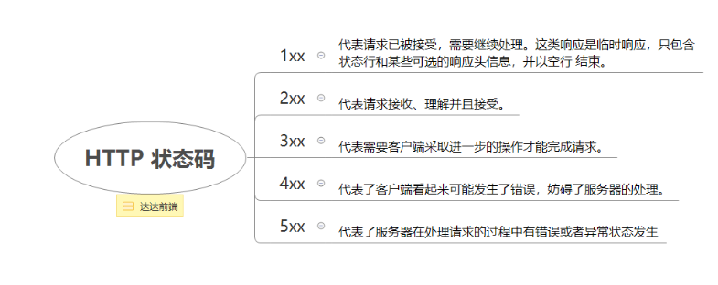 

#### 3.2.2. 响应的首部字段

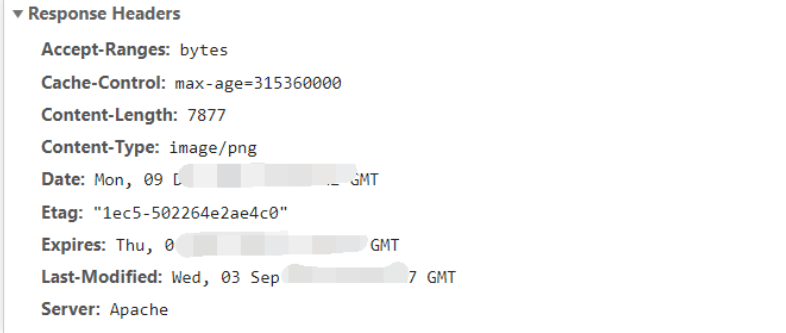 

* Server为服务器的名称

* Location为通知客户端新的资源位置

* Content-Type响应数据的类型

* Content-Encoding为响应数据的编码格式

头部信息回应的是ASCII码，后面的数据可以是任何形式，服务器返回信息的时候，告诉客户端数据是什么格式的，由Content-Type字段体现。

**Content-Type的字段值：**

```
text/plain
text/html
text/css
image/jpeg
// 上面的图片返回的是
image/png
image/svg+xml
audio/mp4
video/mp4
application/javascript
application/pdf
application/zip
application/atom+xml
```

### 3.3. 通讯示例

* 请求

  ```
  // 一个 简单的HTTP请求：
  GET / HTTP/1.1
  Host: example.com
  Connection: close
  ```

  请求行由三部分组成，分别是方法(GET)，URI(/)和http版本(HTTP/1.1)

  * GET / HTTP/1.1

    请求头

  * 消息头

    消息头host用于指定所请求的域名

  请求消息包括以下格式：

  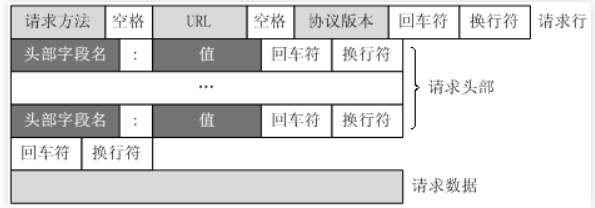 

* 响应

  ```
  HTTP/1.1 200 OK
  Content-Type: text/plain; charset=utf-8
  Content-Length: 8
  
  response
  ```

  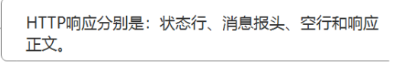 


## 4. HTTP工作原理

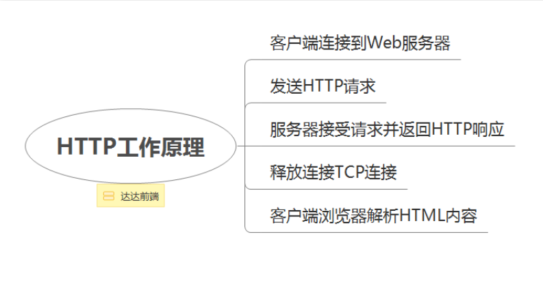 

## 5.总结