## 1. 背景

近几年来，各大公司都在大力推进 HTTPS 的建设。Google Chrome将非 HTTPS 的网站标注为「不安全」，苹果要求 APP 中需要使用HTTPS进行通信，微信小程序也要求使用HTTPS协议。那么，我们为什么非要做这么一件事呢？

​	因为HTTP 有着一个致命的缺陷，那就是内容是**明文传输**的，没有经过任何加密，而这些明文数据会经过**WiFi、路由器、运营商、机房**等多个物理设备节点，如果在这中间任意一个节点被监听，传输的内容就会完全暴露，这一攻击手法叫做MITM（Man In The Middle）**中间人**攻击。这种挂攻击主要体现在三个方面：

* **篡改信息**

- **冒充身份**
- **窃听信息**

为了解决 HTTP 协议的安全性，后面就出现了 HTTPS 协议，在 HTTP 层与 TCP 层之间加入了 TLS 协议，来保证安全可靠的信息传输：

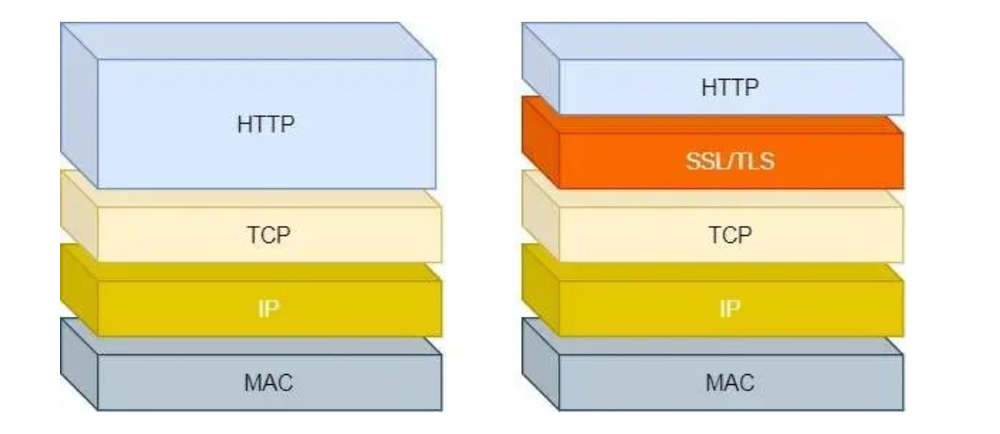 

### 1.1. 初级做法

为了保证传输的内容不被篡改，我们需要对内容计算出一个「指纹」，然后同内容一起传输给对方。对方收到后，先是对内容也计算出一个「指纹」，然后跟发送方发送的「指纹」做一个比较，如果「指纹」相同，说明内容没有被篡改，否则就可以判断出内容被篡改了。

只要内容修改了那么指纹就变了。

那么，在计算机里会**用哈希函数来计算出内容的哈希值**，也就是内容的「指纹」，这个**哈希值是唯一的，且无法通过哈希值推导出内容**。

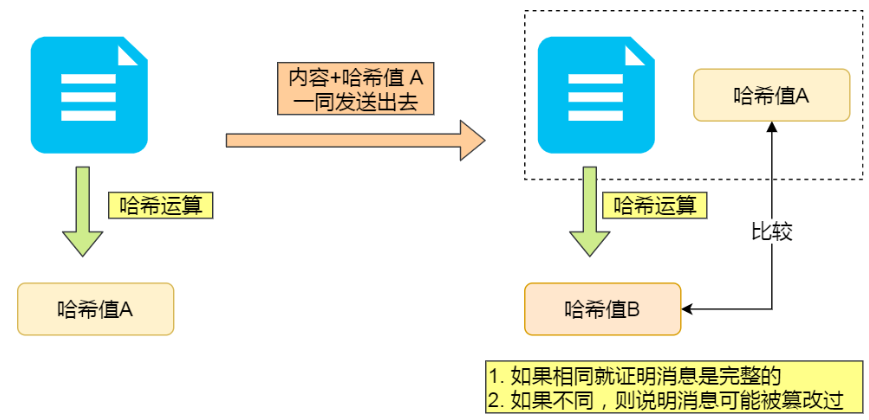 

​	通过哈希算法可以确保内容不会被篡改，**但是并不能保证「内容 + 哈希值」不会被中间人替换，因为这里缺少对客户端收到的消息是否来源于服务端的证明**。这个就需要我们进行增强。如何进行呢？

### 1.2. 非对称加密算法

计算机里会用**非对称加密算法**来解决，共有两个密钥：

- 一个是公钥，这个是可以公开给所有人的；
- 一个是私钥，这个必须由本人管理，不可泄露

这两个密钥可以**双向加解密**的，比如可以用公钥加密内容，然后用私钥解密，也可以用私钥加密内容，公钥解密内容。

流程的不同，意味着目的也不相同：

- **公钥加密，私钥解密**

  这个目的是为了**保证内容传输的安全**，因为被公钥加密的内容，其他人是无法解密的，只有持有私钥的人，才能解密出实际的内容；

- **私钥加密，公钥解密**。

  这个目的是为了**保证消息不会被冒充**，因为私钥是不可泄露的，如果公钥能正常解密出私钥加密的内容，就能证明这个消息是来源于持有私钥身份的人发送的。

**一般我们不会用非对称加密来加密实际的传输内容，因为非对称加密的计算比较耗费性能的。**

所以非对称加密的用途主要在于**通过「私钥加密，公钥解密」的方式，来确认消息的身份**，我们常说的**数字签名算法**，就是用的是这种方式，不过私钥加密内容不是内容本身，而是**对内容的哈希值加密**

**PS：这里公钥解密其实应该叫做公钥验签**

### 1.3. 增强做法

#### 1.3.1. 防篡改

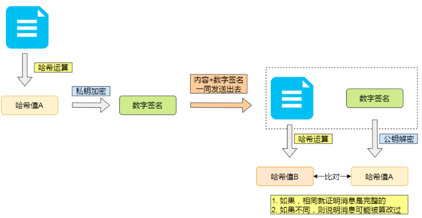 

私钥是由服务端保管，然后服务端会向客户端颁发对应的公钥。如果客户端收到的信息，能被公钥解密，就说明该消息是由服务器发送。的。这里的私钥加密其实就是生成签名。**这种可以保证不会被篡改，但是内容没有加密**

#### 1.3.2.  公钥加密

只有一组公钥私钥只能保证单程的加解密，为了将内容加密，那么如果我们准备**两组公钥私钥**

* 服务端有非对称加密的公钥A1，私钥A2；

* 客户端有非对称加密的公钥B1，私钥B2；

* 客户端向服务端发起请求，服务端将公钥A1返回给客户端；

* 浏览器收到公钥A1，将自己保存的公钥B1发送给服务端；

* 之后浏览器所有向客户端发送的数据，使用公钥B1加密，客户端可以使用私钥B2解密；

* 客户端所有向服务端发送的数据，使用公钥A1加密，服务端可以使用私钥A2解密。

在实际运用过程中，因为**非对称加解密耗时要远大于对称加解密**，所以我们一般不会使用非对称加密和解密，一般只会验签，因此会按照如下做法

#### 1.3.3. 随机key增强

为了解决上述问题，我们使用对称加密来加密内容。

* 服务端有非对称加密的公钥A1，私钥A2；

* 客户端发起请求，服务端将公钥A1返回给客户端；

* 客户端随机生成一个对称加密的密钥K，用公钥A1加密后发送给服务端；

* 服务端收到密文后用自己的私钥A2解密，得到对称密钥K，此时完成了安全的对称密钥交换，解决了对称加密时密钥传输被人窃取的问题

* 之后双方通信都使用密钥K进行对称加解密

**看起来是一个非常完美的方案，兼顾了安全性和性能，但是依然会有问题。因为对方的公钥无法辨别真伪。**因此我们需要使用ca证书来进行增强

### 1.5. CA证书

前面我们知道：

- 可以通过哈希算法来保证消息的完整性；
- 可以通过数字签名来保证消息的来源可靠性（能确认消息是由持有私钥的一方发送的）；

但是这还远远不够，**还缺少身份验证的环节**，万一公钥是被伪造的呢

#### 1.5.1.困境

非对称加密的算法都是**公开**的，所有人都可以自己生成一对公钥私钥。当服务端向客户端返回公钥A1的时候，中间人将其**替换**成自己的公钥B1传送给浏览器。而浏览器此时一无所知，傻乎乎地使用公钥B1加密了密钥K发送出去，又被**中间人截获**，中间人利用自己的私钥B2解密，得到密钥K，再使用服务端的公钥A1加密传送给服务端，完成了通信链路，而服务端和客户端毫无感知。

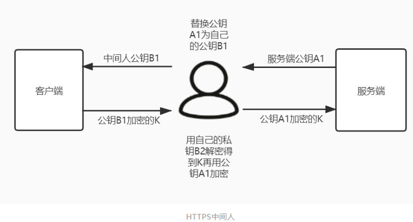 

#### 1.5.2. 解决方案

​	出现这一问题的核心原因是**客户端无法确认收到的公钥是不是真的是服务端发来的**。为了解决这个问题，互联网引入了一个公信机构，这就是CA。

​	服务端在使用HTTPS前，去经过认证的CA机构申请颁发一份**数字证书**，数字证书里包含有证书持有者、证书有效期、公钥等信息，服务端将证书发送给客户端，客户端校验证书身份和要访问的网站身份确实一致后再进行后续的加密操作

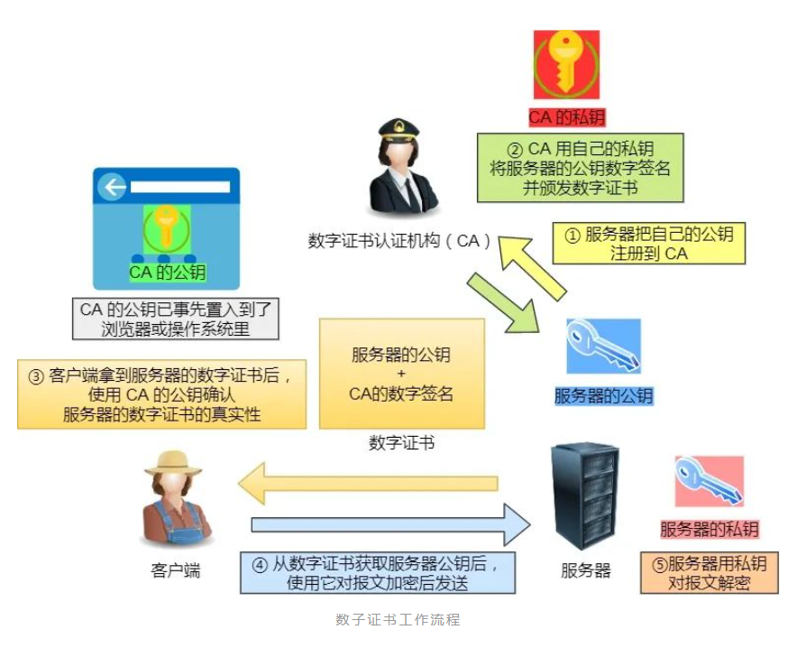 

我们详细说一下实际中数字证书签发和验证流程。如下图图所示，为数字证书签发和验证流程：

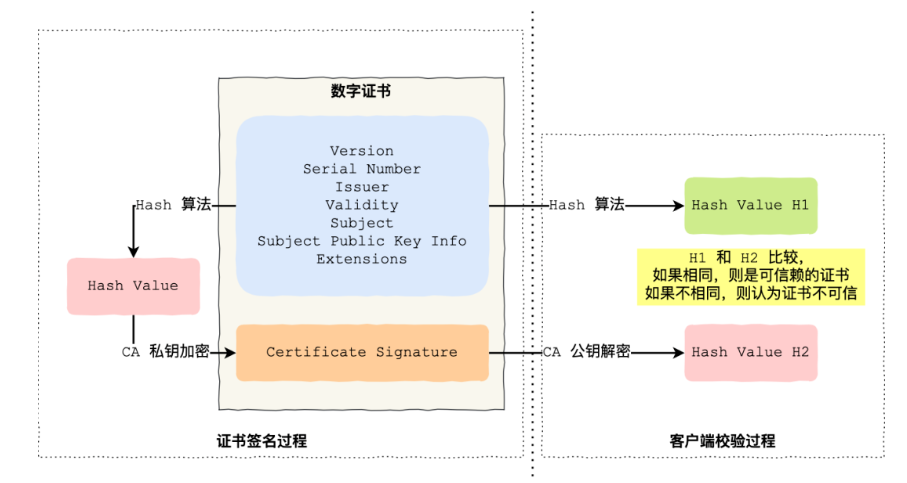

CA 签发证书的过程，如上图左边部分：

- 首先 CA 会把持有者的公钥、用途、颁发者、有效时间等信息打成一个包，然后对这些信息进行 Hash 计算，得到一个 Hash 值；
- 然后 CA 会使用自己的私钥将该 Hash 值加密，生成 Certificate Signature，也就是 CA 对证书做了签名；
- 最后将 Certificate Signature 添加在文件证书上，形成数字证书；

客户端校验服务端的数字证书的过程，如上图右边部分：

- 首先客户端会使用同样的 Hash 算法获取该证书的 Hash 值 H1；
- 通常浏览器和操作系统中集成了 CA 的公钥信息，浏览器收到证书后可以使用 CA 的公钥解密 Certificate Signature 内容，得到一个 Hash 值 H2 ；
- 最后比较 H1 和 H2，如果值相同，则为可信赖的证书，否则则认为证书不可信

#### 1.5.3. 证书链

证书的验证过程中**还存在一个证书信任链的问题**，因为我们向 CA 申请的证书一般不是根证书签发的，而是由中间证书签发的，比如百度的证书，从下图你可以看到，证书的层级有三级：

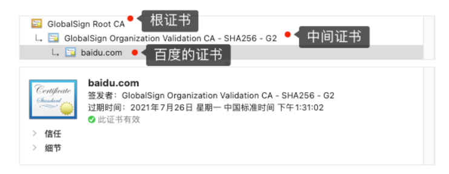 

对于这种三级层级关系的证书的验证过程如下：

- 客户端收到 baidu.com 的证书后，发现这个证书的签发者不是根证书，就无法根据本地已有的根证书中的公钥去验证 baidu.com 证书是否可信。于是，客户端根据 baidu.com 证书中的签发者，找到该证书的颁发机构是 “GlobalSign Organization Validation CA - SHA256 - G2”，然后向 CA 请求该中间证书。
- 请求到证书后发现 “GlobalSign Organization Validation CA - SHA256 - G2” 证书是由 “GlobalSign Root CA” 签发的，由于 “GlobalSign Root CA” 没有再上级签发机构，说明它是根证书，也就是自签证书。应用软件会检查此证书有否已预载于根证书清单上，如果有，则可以利用根证书中的公钥去验证 “GlobalSign Organization Validation CA - SHA256 - G2” 证书，如果发现验证通过，就认为该中间证书是可信的。
- “GlobalSign Organization Validation CA - SHA256 - G2” 证书被信任后，可以使用 “GlobalSign Organization Validation CA - SHA256 - G2” 证书中的公钥去验证 baidu.com 证书的可信性，如果验证通过，就可以信任 baidu.com 证书。

在这四个步骤中，最开始客户端只信任根证书 GlobalSign Root CA 证书的，然后 “GlobalSign Root CA” 证书信任 “GlobalSign Organization Validation CA - SHA256 - G2” 证书，而 “GlobalSign Organization Validation CA - SHA256 - G2” 证书又信任 baidu.com 证书，于是客户端也信任 baidu.com 证书。

总括来说，由于用户信任 GlobalSign，所以由 GlobalSign 所担保的 baidu.com 可以被信任，另外由于用户信任操作系统或浏览器的软件商，所以由软件商预载了根证书的 GlobalSign 都可被信任

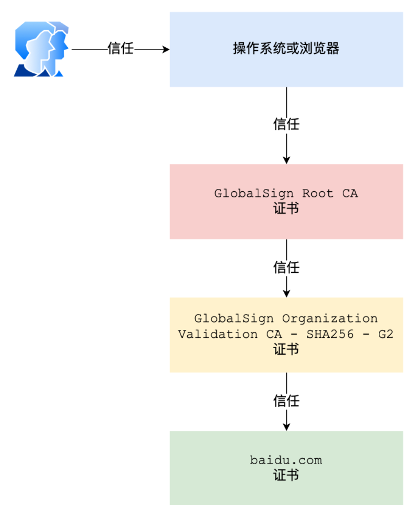 

操作系统里一般都会内置一些根证书，比如我的 MAC 电脑里内置的根证书有这么多：

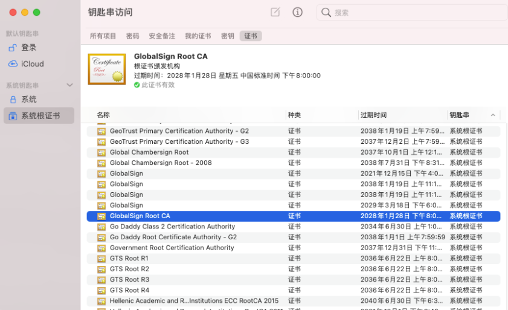 

这样的一层层地验证就构成了一条信任链路，整个证书信任链验证流程如下图所示：

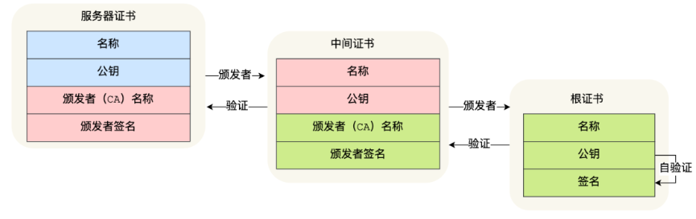 

为什么需要证书链这么麻烦的流程？Root CA 为什么不直接颁发证书，而是要搞那么多中间层级呢？

**这是为了确保根证书的绝对安全性，将根证书隔离地越严格越好，不然根证书如果失守了，那么整个信任链都会有问题**

## 2. HTTPS实现原理

前面介绍了一些安全场景和解决方案，那么https到底是什么机制呢？

### 2.1. SSL/TLS

HTTPS其实就是将HTTP的数据包再通过SSL/TLS加密后传输，那么SSL/TLS又是什么呢？

SSL（Secure Sockets Layer）安全套接层和TLS（Transport Layer Security）传输层安全协议其实是**一套东西**。

网景公司在1994年提出HTTPS协议时，使用的是SSL进行加密。后来IETF（Internet Engineering Task Force）互联网工程任务组将SSL进一步标准化，于1999年公布第一版TLS协议文件TLS 1.0。目前最新版的TLS协议是TLS 1.3，于2018年公布

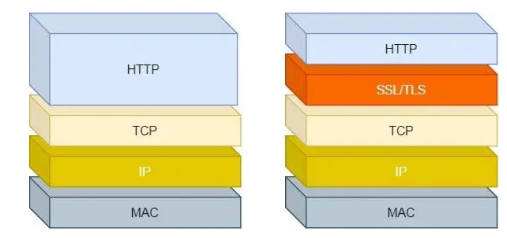 

具体怎么做到安全可靠的信息传输，这就涉及到了**数字签名和数字证书**。 

### 2.2. https机制

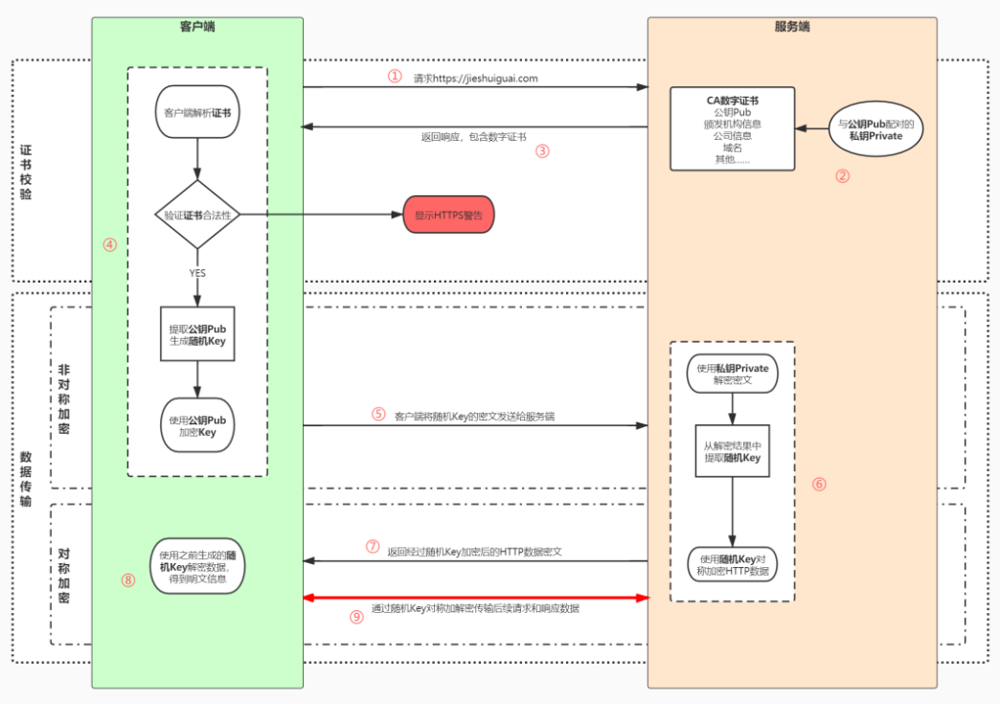 

* 用户在浏览器发起HTTPS请求（如 https://www.mogu.com/），默认使用服务端的443端口进行连接；

* HTTPS需要使用一套**CA数字证书**，证书内会附带一个**公钥Pub**，而与之对应的**私钥Private**保留在服务端不公开；

* 服务端收到请求，返回配置好的包含**公钥Pub**的证书给客户端；

* 客户端收到**证书**，校验合法性，主要包括是否在有效期内、证书的域名与请求的域名是否匹配，上一级证书是否有效（递归判断，直到判断到系统内置或浏览器配置好的根证书），如果不通过，则显示HTTPS警告信息，如果通过则继续；

* 客户端生成一个用于对称加密的**随机Key**，并用证书内的**公钥Pub**进行加密，发送给服务端；

* 服务端收到**随机Key**的密文，使用与**公钥Pub**配对的**私钥Private**进行解密，得到客户端真正想发送的**随机Key**；

* 服务端使用客户端发送过来的**随机Key**对要传输的HTTP数据进行对称加密，将密文返回客户端；

* 客户端使用**随机Key**对称解密密文，得到HTTP数据明文；

* 后续HTTPS请求使用之前交换好的**随机Key**进行对称加解密

## 3. 总结

* 我个人理解https的机制为：
  * 客户端发送数据给服务端需要加密，也不能篡改怎么办呢
  * 我可以对内容进行对称加密（保证性能）
  * 首先需要获取到服务端的公钥
  * 公钥对随机key进行非对称加密，随机key对内容进行对称加密发送到服务端
  * 服务端使用私钥解密key，使用对称key解密内容即可。
  * **现在问题是，客户端获取的服务端公钥是可能是中间人的，于是我们发给客户端的公钥，带着个签名，客户端需要验证这个签名，签名的生成时ca用私钥加密，客户端用信任的公钥进行验签(这里存在一个信任链，最终回到内置的根证书公钥验签)，否则就是不可信任的。**
  
* HTTPS 的出发点是解决HTTP明文传输时信息被篡改和监听的问题。

  - 为了兼顾性能和安全性，使用了非对称加密+对称加密的方案。

  - 为了保证公钥传输中不被篡改，又使用了非对称加密的数字签名功能，借助CA机构和系统根证书的机制保证了HTTPS证书的公信力。

* **安全培训**里都有一条「不要连陌生的WiFi」，也是类似的原因，恶意WiFi的控制者可以看到和篡改HTTP明文传输的信息

* 1994年网景公司提出了HTTPS（HyperText Transfer Protocol Secure）超文本传输安全协议，数据通信仍然是HTTP，但利用**SSL/TLS加密数据包**

  SSL（Secure Sockets Layer）安全套接层和TLS（Transport Layer Security）传输层安全协议其实是**一套东西**。

  网景公司在1994年提出HTTPS协议时，使用的是SSL进行加密。后来IETF（Internet Engineering Task Force）互联网工程任务组将SSL进一步标准化，于1999年公布第一版TLS协议文件TLS 1.0。目前最新版的TLS协议是TLS 1.3，于2018年公布