## 1.

## 2. cpu机制

* **指令**

  撰写的代码，是怎么变成一条条的机器能够理解的指令的，以及是按照什么样的顺序运行的

* **计算** 

  数据的二进制表示是怎么样的，我们执行的加法和乘法又是通过什么样的电路来实现的

CPU，只有把“指令”和“计算”这两部分功能连通起来，我们才能构成一个真正完整的 CPU

### 2.1. 指令周期

 MIPS 体系结构的计算机所用到的 R、I、J 类指令。如果我们仔细看一看，可以发现，计算机每执行一条指令的过程，可以分解成这样几个步骤

1.**Fetch**（**取得指令**），也就是从 PC 寄存器里找到对应的指令地址，根据指令地址从内存里把具体的指令，加载到指令寄存器中，然后把 PC 寄存器自增，好在未来执行下一条指令。

2.**Decode**（**指令译码**），也就是根据指令寄存器里面的指令，解析成要进行什么样的操作，是 R、I、J 中的哪一种指令，具体要操作哪些寄存器、数据或者内存地址。

3.**Execute**（**执行指令**），也就是实际运行对应的 R、I、J 这些特定的指令，进行算术逻辑操作、数据传输或者直接的地址跳转。

\4. 重复进行 1～3 的步骤。

这样的步骤，其实就是一个永不停歇的“**Fetch - Decode - Execute**”的循环，我们把这个循环称之为**指令周期**（Instruction Cycle）。

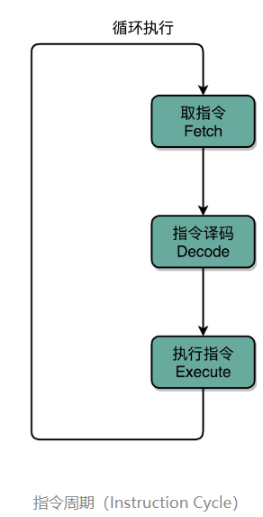 

在取指令的阶段，我们的指令是放在**存储器**里的，实际上，通过 PC 寄存器和指令寄存器取出指令的过程，是由**控制器**（Control Unit）操作的。指令的解码过程，也是由**控制器**进行的。一旦到了执行指令阶段，无论是进行算术操作、逻辑操作的 R 型指令，还是进行数据传输、条件分支的 I 型指令，都是由**算术逻辑单元**（ALU）操作的，也就是由**运算器**处理的。不过，如果是一个简单的无条件地址跳转，那么我们可以直接在**控制器**里面完成，不需要用到运算器 

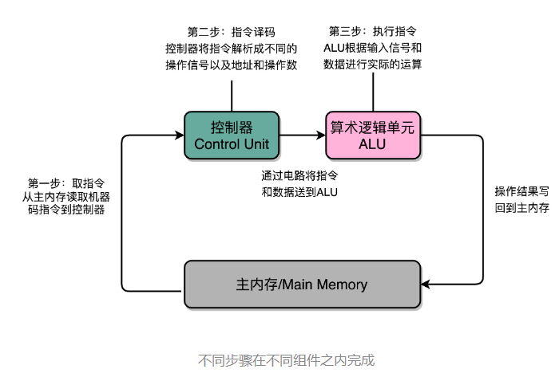 

除了 Instruction Cycle 这个指令周期，在 CPU 里面我们还会提到另外两个常见的 Cycle。一个叫**Machine Cycle**，**机器周期**或者**CPU 周期**。CPU 内部的操作速度很快，但是访问内存的速度却要慢很多。每一条指令都需要从内存里面加载而来，所以我们一般把从内存里面读取一条指令的最短时间，称为 CPU 周期。

还有一个是我们之前提过的**Clock Cycle**，也就是**时钟周期**以及我们机器的主频。一个 CPU 周期，通常会由几个时钟周期累积起来。一个 CPU 周期的时间，就是这几个 Clock Cycle 的总和。

对于一个指令周期来说，我们取出一条指令，然后执行它，至少需要两个 CPU 周期。取出指令至少需要一个 CPU 周期，执行至少也需要一个 CPU 周期，复杂的指令则需要更多的 CPU 周期。  

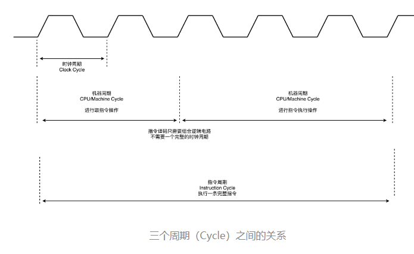 

我们说一个指令周期，包含多个 CPU 周期，而一个 CPU 周期包含多个时钟周期。 

### 2.2. 处理器单元

数据通路就是我们的处理器单元。它通常由两类原件组成

* **操作元件**

  也叫组合逻辑元件（Combinational Element），其实就是我们的 ALU。在前面讲 ALU 的过程中可以看到，它们的功能就是在特定的输入下，根据下面的组合电路的逻辑，生成特定的输出

* **存储元件** 

  叫状态元件（State Element）的。比如我们在计算过程中需要用到的寄存器，无论是通用寄存器还是状态寄存器，其实都是存储元件

通过数据总线的方式，把它们连接起来，就可以完成数据的存储、处理和传输了，这就是所谓的**建立数据通路**了

### 2.3. **控制器**

它的逻辑就没那么复杂了。我们可以把它看成只是机械地重复“Fetch - Decode - Execute“循环中的前两个步骤，然后把最后一个步骤，通过控制器产生的控制信号，交给 ALU 去处理。

一方面，所有 CPU 支持的指令，都会在控制器里面，被解析成不同的输出信号。我们之前说过，现在的 Intel CPU 支持 2000 个以上的指令。这意味着，控制器输出的控制信号，至少有 2000 种不同的组合。

运算器里的 ALU 和各种组合逻辑电路，可以认为是一个固定功能的电路。控制器“翻译”出来的，就是不同的控制信号。这些控制信号，告诉 ALU 去做不同的计算。可以说正是控制器的存在，让我们可以“编程”来实现功能，能让我们的“存储程序型计算机”名副其实。

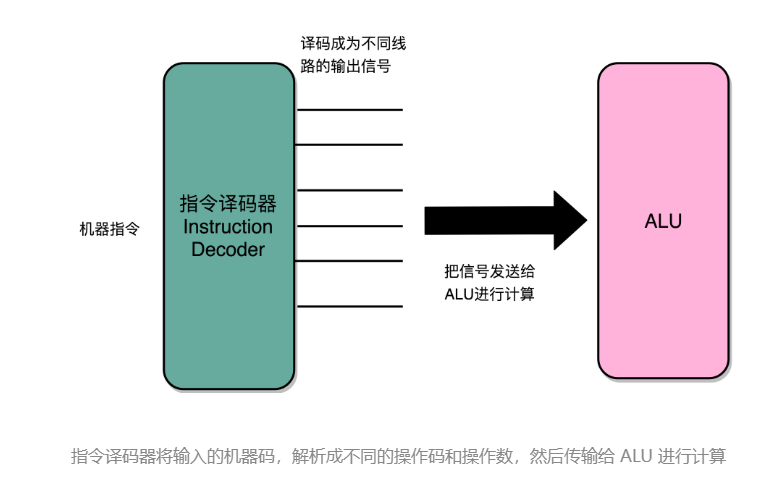 

### 2.4. cpu的硬件电路

需要四种电路，四类电路，通过各种方式组合在一起，就能最终组成功能强大的 CPU 了。但是，要实现这四种电路中的中间两种，我们还需要时钟电路的配合。

* 首先，自然是我们之前已经讲解过的 **ALU** 了，它实际就是一个没有状态的，根据输入计算输出结果的第一个电路。

* 第二，我们需要有一个能够进行状态读写的电路元件，也就是我们的**寄存器**。我们需要有一个电路，能够存储到上一次的计算结果。这个计算结果并不一定要立刻拿到电路的下游去使用，但是可以在需要的时候拿出来用。常见的能够进行状态读写的电路，就有锁存器（Latch），以及我们后面要讲的 D 触发器（Data/Delay Flip-flop）的电路。

* 第三，我们需要有一个“自动”的电路，按照固定的周期，不停地实现 **PC 寄存器自增**，自动地去执行“Fetch - Decode - Execute“的步骤。我们的程序执行，并不是靠人去拨动开关来执行指令的。我们希望有一个“自动”的电路，不停地去一条条执行指令

  我们看似写了各种复杂的高级程序进行各种函数调用、条件跳转。其实只是修改 PC 寄存器里面的地址。PC 寄存器里面的地址一修改，计算机就可以加载一条指令新指令，往下运行。实际上，PC 寄存器还有一个名字，就叫作程序计数器。顾名思义，就是随着时间变化，不断去数数。数的数字变大了，就去执行一条新指令。所以，我们需要的就是一个自动数数的电路

* 第四，我们需要有一个“译码”的电路。无论是对于指令进行 decode，还是对于拿到的内存地址去获取对应的数据或者指令，我们都需要通过一个电路找到对应的数据。这个对应的自然就是“译码器”的电路了

### 2.5. **时序逻辑电路**

要能够实现一个完整的 CPU 功能，除了加法器这样的电路之外，我们还需要实现其他功能的电路。其中有一些电路，和我们实现过的加法器一样，只需要给定输入，就能得到固定的输出。这样的电路，我们称之为**组合逻辑电路**（Combinational Logic Circuit）。

但是，光有组合逻辑电路是不够的。你可以想一下，如果只有组合逻辑电路，我们的 CPU 会是什么样的？电路输入是确定的，对应的输出自然也就确定了。那么，我们要进行不同的计算，就要去手动拨动各种开关，来改变电路的开闭状态。这样的计算机，不像我们现在每天用的功能强大的电子计算机，反倒更像古老的计算尺或者机械计算机，干不了太复杂的工作，只能协助我们完成一些计算工作

我们就需要引入第二类的电路，也就是**时序逻辑电路**（Sequential Logic Circuit）。时序逻辑电路可以帮我们解决这样几个问题。

* 第一个就是**自动运行**的问题。时序电路接通之后可以不停地开启和关闭开关，进入一个自动运行的状态。这个使得我们上一讲说的，控制器不停地让 PC 寄存器自增读取下一条指令成为可能

* 第二个是**存储**的问题。通过时序电路实现的触发器，能把计算结果存储在特定的电路里面，而不是像组合逻辑电路那样，一旦输入有任何改变，对应的输出也会改变

* 第三个本质上解决了各个功能按照**时序协调**的问题。无论是程序实现的软件指令，还是到硬件层面，各种指令的操作都有先后的顺序要求。时序电路使得不同的事件按照时间顺序发生

#### 2.5.1. 时钟信号的硬件实现

CPU 的主频是由一个晶体振荡器来实现的，而这个晶体振荡器生成的电路信号，就是我们的时钟信号

实现这样一个电路，和我们之前讲的，通过电的磁效应产生开关信号的方法是一样的。只不过，这里的磁性开关，打开的不再是后续的线路，而是当前的线路。

在下面这张图里你可以看到，我们在原先一般只放一个开关的信号输入端，放上了两个开关。一个开关 A，一开始是断开的，由我们手工控制；另外一个开关 B，一开始是合上的，磁性线圈对准一开始就合上的开关 B。

于是，一旦我们合上开关 A，磁性线圈就会通电，产生磁性，开关 B 就会从合上变成断开。一旦这个开关断开了，电路就中断了，磁性线圈就失去了磁性。于是，开关 B 又会弹回到合上的状态。这样一来，电路接通，线圈又有了磁性。我们的电路就会来回不断地在开启、关闭这两个状态中切换。

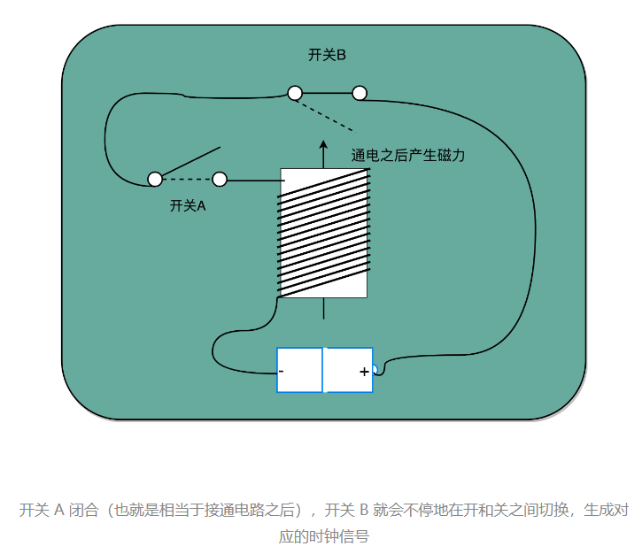 

这个不断切换的过程，对于下游电路来说，就是不断地产生新的 0 和 1 这样的信号。如果你在下游的电路上接上一个灯泡，就会发现这个灯泡在亮和暗之间不停切换。这个按照固定的周期不断在 0 和 1 之间切换的信号，就是我们的**时钟信号**（Clock Signal）。

这种电路，其实就相当于把电路的输出信号作为输入信号，再回到当前电路。这样的电路构造方式呢，我们叫作**反馈电路**（Feedback Circuit）。

接下来，我们还会看到更多的反馈电路。上面这个反馈电路一般可以用下面这个示意图来表示，其实就是一个输出结果接回输入的**反相器**（Inverter），也就是我们之前讲过的**非门**

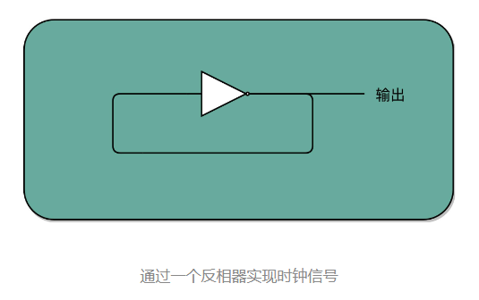 

#### 2.5.2. D 触发器

有了时钟信号，我们的系统里就有了一个像“自动门”一样的开关。利用这个开关和相同的反馈电路，我们就可以构造出一个有“记忆”功能的电路。这个有记忆功能的电路，可以实现在 CPU 中用来存储计算结果的寄存器，也可以用来实现计算机五大组成部分之一的存储器

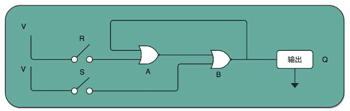  

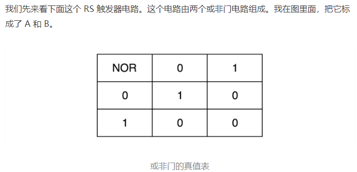  

* 在这个电路一开始，输入开关都是关闭的，所以或非门（NOR）A 的输入是 0 和 0。对应到我列的这个真值表，输出就是 1。而或非门 B 的输入是 0 和 A 的输出 1，对应输出就是 0。B 的输出 0 反馈到 A，和之前的输入没有变化，A 的输出仍然是 1。而整个电路的**输出 Q**，也就是 0。

* 当我们把 A 前面的开关 R 合上的时候，A 的输入变成了 1 和 0，输出就变成了 0，对应 B 的输入变成 0 和 0，输出就变成了 1。B 的输出 1 反馈给到了 A，A 的输入变成了 1 和 1，输出仍然是 0。所以把 A 的开关合上之后，电路仍然是稳定的，不会像晶振那样振荡，但是整个电路的**输出 Q**变成了 1。

* 这个时候，如果我们再把 A 前面的开关 R 打开，A 的输入变成和 1 和 0，输出还是 0，对应的 B 的输入没有变化，输出也还是 1。B 的输出 1 反馈给到了 A，A 的输入变成了 1 和 0，输出仍然是 0。这个时候，电路仍然稳定。**开关 R 和 S 的状态和上面的第一步是一样的，但是最终的输出 Q 仍然是 1，**和第 1 步里 Q 状态是相反的。我们的输入和刚才第二步的开关状态不一样，但是输出结果仍然保留在了第 2 步时的输出没有发生变化。

* 这个时候，只有我们再去关闭下面的开关 S，才可以看到，这个时候，B 有一个输入必然是 1，所以 B 的输出必然是 0，也就是电路的最终**输出 Q**必然是 0

**这样一个电路，我们称之为触发器（Flip-Flop）。接通开关 R，输出变为 1，即使断开开关，输出还是 1 不变。接通开关 S，输出变为 0，即使断开开关，输出也还是 0。也就是，当两个开关都断开的时候，最终的输出结果，取决于之前动作的输出结果，这个也就是我们说的记忆功能**

这里的这个电路是最简单的 RS 触发器，也就是所谓的复位置位触发器（Reset-Set Flip Flop) 。对应的输出结果的真值表，你可以看下面这个表格。可以看到，当两个开关都是 0 的时候，对应的输出不是 1 或者 0，而是和 Q 的上一个状态一致。 

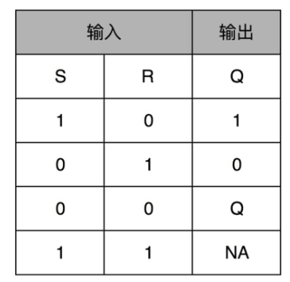 

再往这个电路里加两个与门和一个小小的时钟信号，我们就可以实现一个利用时钟信号来操作一个电路了。这个电路可以帮我们实现什么时候可以往 Q 里写入数据。

我们看看下面这个电路，这个在我们的上面的 R-S 触发器基础之上，在 R 和 S 开关之后，加入了两个与门，同时给这两个与门加入了一个**时钟信号 CLK**作为电路输入。

这样，当时钟信号 CLK 在低电平的时候，与门的输入里有一个 0，两个实际的 R 和 S 后的与门的输出必然是 0。也就是说，无论我们怎么按 R 和 S 的开关，根据 R-S 触发器的真值表，对应的 Q 的输出都不会发生变化。

只有当时钟信号 CLK 在高电平的时候，与门的一个输入是 1，输出结果完全取决于 R 和 S 的开关。我们可以在这个时候，通过开关 R 和 S，来决定对应 Q 的输出。 

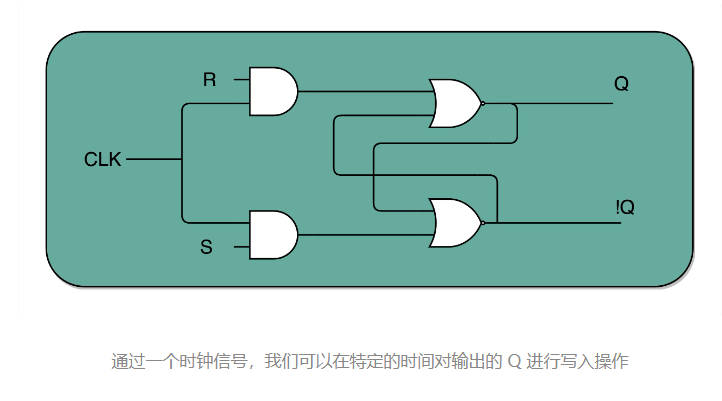 

如果这个时候，我们让 R 和 S 的开关，也用一个反相器连起来，也就是通过同一个开关控制 R 和 S。只要 CLK 信号是 1，R 和 S 就可以设置输出 Q。而当 CLK 信号是 0 的时候，无论 R 和 S 怎么设置，输出信号 Q 是不变的。这样，这个电路就成了我们最常用的 D 型触发器。用来控制 R 和 S 这两个开关的信号呢，我们视作一个输入的数据信号 D，也就是 Data，这就是 D 型触发器的由来 

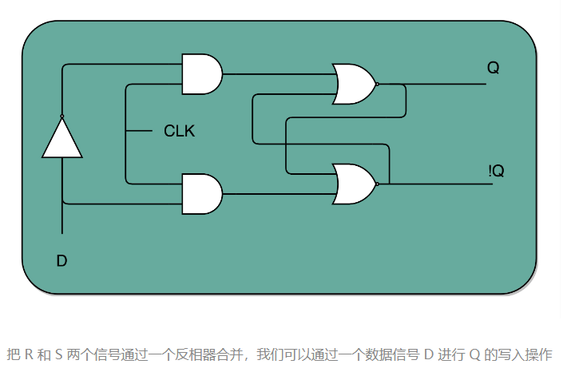 

一个 D 型触发器，只能控制 1 个比特的读写，但是如果我们同时拿出多个 D 型触发器并列在一起，并且把用同一个 CLK 信号控制作为所有 D 型触发器的开关，这就变成了一个 N 位的 D 型触发器，也就可以同时控制 N 位的读写。

CPU 里面的寄存器可以直接通过 D 型触发器来构造。我们可以在 D 型触发器的基础上，加上更多的开关，来实现清 0 或者全部置为 1 这样的快捷操作 

#### 2.5.3. 小结 

通过引入了时序电路，我们终于可以把数据“存储”下来了。我们通过反馈电路，创建了时钟信号，然后再利用这个时钟信号和门电路组合，实现了“状态记忆”的功能。

电路的输出信号不单单取决于当前的输入信号，还要取决于输出信号之前的状态。最常见的这个电路就是我们的 D 触发器，它也是我们实际在 CPU 内实现存储功能的寄存器的实现方式。

这也是现代计算机体系结构中的“冯·诺伊曼”机的一个关键，就是程序需要可以“存储”，而不是靠固定的线路连接或者手工拨动开关，来实现计算机的可存储和可编程的功能。

有了时钟信号和触发器之后，我们还差一个“自动”需求没有实现。我们的计算机还不能做到自动地不停地从内存里面读取指令去执行

### 2.6. 计数器

我们常说的 PC 寄存器，还有个名字叫程序计数器。下面我们就来看看，它为什么叫作程序计数器。

有了时钟信号，我们可以提供定时的输入；有了 D 型触发器，我们可以在时钟信号控制的时间点写入数据。我们把这两个功能组合起来，就可以实现一个自动的计数器了。

加法器的两个输入，一个始终设置成 1，另外一个来自于一个 D 型触发器 A。我们把加法器的输出结果，写到这个 D 型触发器 A 里面。于是，D 型触发器里面的数据就会在固定的时钟信号为 1 的时候更新一次。

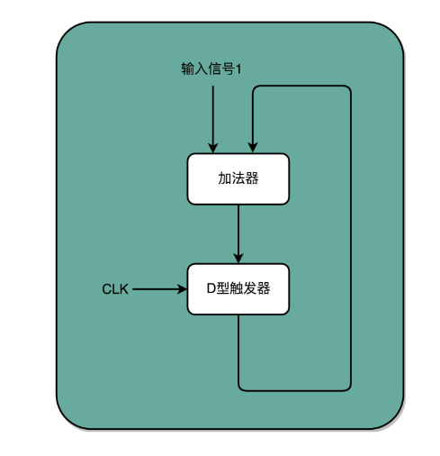 

这样，我们就有了一个每过一个时钟周期，就能固定自增 1 的自动计数器了。这个自动计数器，可以拿来当我们的 PC 寄存器。事实上，PC 寄存器的这个 PC，英文就是 Program Counter，也就是**程序计数器**的意思。

每次自增之后，我们可以去对应的 D 型触发器里面取值，这也是我们下一条需要运行指令的地址。前面第 5 讲我们讲过，同一个程序的指令应该要顺序地存放在内存里面。这里就和前面对应上了，顺序地存放指令，就是为了让我们通过程序计数器就能定时地不断执行新指令。

加法计数、内存取值，乃至后面的命令执行，最终其实都是由我们一开始讲的时钟信号，来控制执行时间点和先后顺序的，这也是我们需要时序电路最核心的原因。

在最简单的情况下，我们需要让每一条指令，从程序计数，到获取指令、执行指令，都在一个时钟周期内完成。如果 PC 寄存器自增地太快，程序就会出错。因为前一次的运算结果还没有写回到对应的寄存器里面的时候，后面一条指令已经开始读取里面的数据来做下一次计算了。这个时候，如果我们的指令使用同样的寄存器，前一条指令的计算就会没有效果，计算结果就错了。

在这种设计下，我们需要在一个时钟周期里，确保执行完一条最复杂的 CPU 指令，也就是耗时最长的一条 CPU 指令。这样的 CPU 设计，我们称之为**单指令周期处理器**（Single Cycle Processor）。

很显然，这样的设计有点儿浪费。因为即便只调用一条非常简单的指令，我们也需要等待整个时钟周期的时间走完，才能执行下一条指令。在后面章节里我们会讲到，通过流水线技术进行性能优化，可以减少需要等待的时间，这里我们暂且说到这里。

### 2.7. 译码器

#### 2.7.1. 译码器作用

我们的数据能够存储在 D 型触发器里了。如果我们把很多个 D 型触发器放在一起，就可以形成一块很大的存储空间，甚至可以当成一块内存来用。像我现在手头这台电脑，有 16G 内存。那我们怎么才能知道，写入和读取的数据，是在这么大的内存的哪几个比特呢？

于是，我们就需要有一个电路，来完成“寻址”的工作。这个“寻址”电路，就是我们接下来要讲的译码器。

在现在实际使用的计算机里面，内存所使用的 DRAM，并不是通过上面的 D 型触发器来实现的，而是使用了一种 CMOS 芯片来实现的。不过，这并不影响我们从基础原理方面来理解译码器。在这里，我们还是可以把内存芯片，当成是很多个连在一起的 D 型触发器来实现的。 

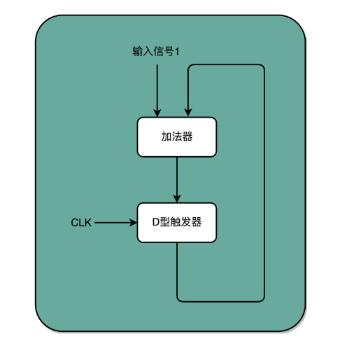 

这样，我们就有了一个每过一个时钟周期，就能固定自增 1 的自动计数器了。这个自动计数器，可以拿来当我们的 PC 寄存器。事实上，PC 寄存器的这个 PC，英文就是 Program Counter，也就是**程序计数器**的意思。

每次自增之后，我们可以去对应的 D 型触发器里面取值，这也是我们下一条需要运行指令的地址。前面第 5 讲我们讲过，同一个程序的指令应该要顺序地存放在内存里面。这里就和前面对应上了，顺序地存放指令，就是为了让我们通过程序计数器就能定时地不断执行新指令。

加法计数、内存取值，乃至后面的命令执行，最终其实都是由我们一开始讲的时钟信号，来控制执行时间点和先后顺序的，这也是我们需要时序电路最核心的原因。

在最简单的情况下，我们需要让每一条指令，从程序计数，到获取指令、执行指令，都在一个时钟周期内完成。如果 PC 寄存器自增地太快，程序就会出错。因为前一次的运算结果还没有写回到对应的寄存器里面的时候，后面一条指令已经开始读取里面的数据来做下一次计算了。这个时候，如果我们的指令使用同样的寄存器，前一条指令的计算就会没有效果，计算结果就错了。

在这种设计下，我们需要在一个时钟周期里，确保执行完一条最复杂的 CPU 指令，也就是耗时最长的一条 CPU 指令。这样的 CPU 设计，我们称之为**单指令周期处理器**（Single Cycle Processor）。

很显然，这样的设计有点儿浪费。因为即便只调用一条非常简单的指令，我们也需要等待整个时钟周期的时间走完，才能执行下一条指令。在后面章节里我们会讲到，通过流水线技术进行性能优化，可以减少需要等待的时间，这里我们暂且说到这里。

#### 2.7.2. 基础译码器

如果把“寻址”这件事情退化到最简单的情况，就是在两个地址中，去选择一个地址。这样的电路，我们叫作**2-1 选择器**。我把它的电路实现画在了这里。

我们通过一个反相器、两个与门和一个或门，就可以实现一个 2-1 选择器。通过控制反相器的输入是 0 还是 1，能够决定对应的输出信号，是和地址 A，还是地址 B 的输入信号一致。

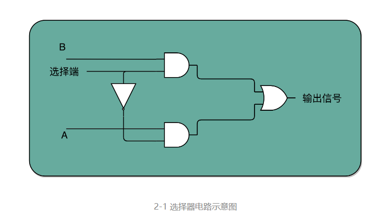 

一个反向器只能有 0 和 1 这样两个状态，所以我们只能从两个地址中选择一个。如果输入的信号有三个不同的开关，我们就能从 2^3，也就是 8 个地址中选择一个了。这样的电路，我们就叫**3-8 译码器**。现代的计算机，如果 CPU 是 64 位的，就意味着我们的寻址空间也是2^64，那么我们就需要一个有 64 个开关的译码器 

#### 2.7.3. 小结

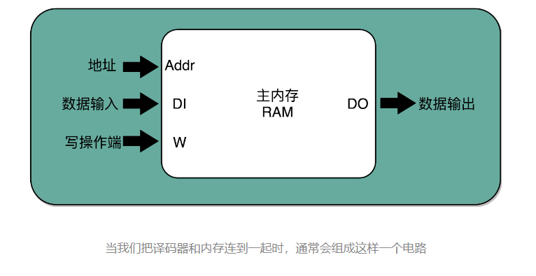 

译码器的本质，就是从输入的多个位的信号中，根据一定的开关和电路组合，选择出自己想要的信号。除了能够进行“寻址”之外，我们还可以把对应的需要运行的指令码，同样通过译码器，找出我们期望执行的指令，也就是在之前我们讲到过的 opcode，以及后面对应的操作数或者寄存器地址

### 2.8. 总结

#### 2.8.1. 处理器的整体架构图

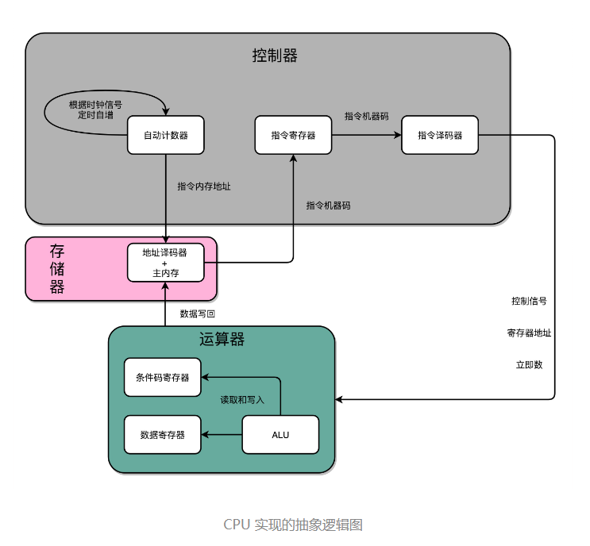 

D 触发器、自动计数以及译码器，再加上一个我们之前说过的 ALU，我们就凑齐了一个拼装一个 CPU 必须要的零件了。下面，我们就来看一看，怎么把这些零件组合起来，才能实现指令执行和算术逻辑计算的 CPU。 

* 首先，我们有一个自动计数器。这个自动计数器会随着时钟主频不断地自增，来作为我们的 PC 寄存器。
* 在这个自动计数器的后面，我们连上一个译码器。译码器还要同时连着我们通过大量的 D 触发器组成的内存。
* 自动计数器会随着时钟主频不断自增，从译码器当中，找到对应的计数器所表示的内存地址，然后读取出里面的 CPU 指令。
* 读取出来的 CPU 指令会通过我们的 CPU 时钟的控制，写入到一个由 D 触发器组成的寄存器，也就是指令寄存器当中。
* 在指令寄存器后面，我们可以再跟一个译码器。这个译码器不再是用来寻址的了，而是把我们拿到的指令，解析成 opcode 和对应的操作数。
* 当我们拿到对应的 opcode 和操作数，对应的输出线路就要连接 ALU，开始进行各种算术和逻辑运算。对应的计算结果，则会再写回到 D 触发器组成的寄存器或者内存当中。

这样的一个完整的通路，也就完成了我们的 CPU 的一条指令的执行过程

#### 2.8.2. 常见问题

* 跳转

  计算机的指令执行的时候，我们说高级语言中的 if…else，其实是变成了一条 cmp 指令和一条 jmp 指令。cmp 指令是在进行对应的比较，比较的结果会更新到条件码寄存器当中。jmp 指令则是根据条件码寄存器当中的标志位，来决定是否进行跳转以及跳转到什么地址

  cmp 指令的执行结果放到了条件码寄存器里面，我们的条件跳转指令也是在 ALU 层面执行的，而不是在控制器里面执行的。这样的实现方式在电路层面非常直观，我们不需要一个非常复杂的电路，就能实现 if…else 的功能

* 周期

  执行一条指令，其实可以不放在一个时钟周期里面，可以直接拆分到多个时钟周期

  我们可以在一个时钟周期里面，去自增 PC 寄存器的值，也就是指令对应的内存地址。然后，我们要根据这个地址从 D 触发器里面读取指令，这个还是可以在刚才那个时钟周期内。但是对应的指令写入到指令寄存器，我们可以放在一个新的时钟周期里面。指令译码给到 ALU 之后的计算结果，要写回到寄存器，又可以放到另一个新的时钟周期。所以，执行一条计算机指令，其实可以拆分到很多个时钟周期，而不是必须使用单指令周期处理器的设计

  因为从内存里面读取指令时间很长，所以如果使用单指令周期处理器，就意味着我们的指令都要去等待一些慢速的操作。这些不同指令执行速度的差异，也正是计算机指令有指令周期、CPU 周期和时钟周期之分的原因。因此，现代我们优化 CPU 的性能时，用的 CPU 都不是单指令周期处理器，而是通过流水线、分支预测等技术，来实现在一个周期里同时执行多个指令

#### 2.8.3.  小结

我们可以通过自动计数器的电路，来实现一个 PC 寄存器，不断生成下一条要执行的计算机指令的内存地址。然后通过译码器，从内存里面读出对应的指令，写入到 D 触发器实现的指令寄存器中。再通过另外一个译码器，把它解析成我们需要执行的指令和操作数的地址。这些电路，组成了我们计算机五大组成部分里面的控制器。

我们把 opcode 和对应的操作数，发送给 ALU 进行计算，得到计算结果，再写回到寄存器以及内存里面来，这个就是我们计算机五大组成部分里面的运算器。

我们的时钟信号，则提供了协调这样一条条指令的执行时间和先后顺序的机制。同样的，这也带来了一个挑战，那就是单指令周期处理器去执行一条指令的时间太长了。而这个挑战，也是我们接下来的几讲里要解答的问题