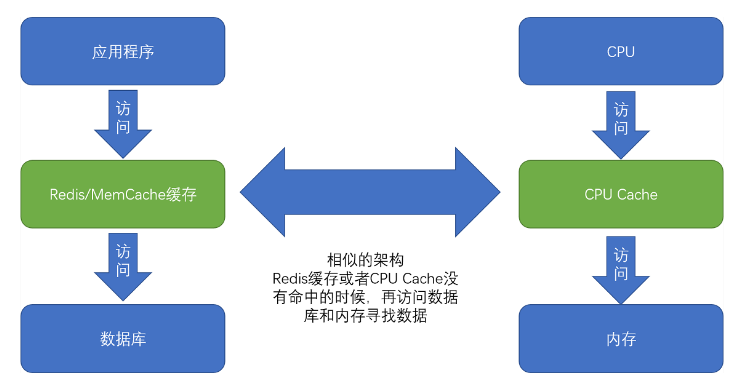
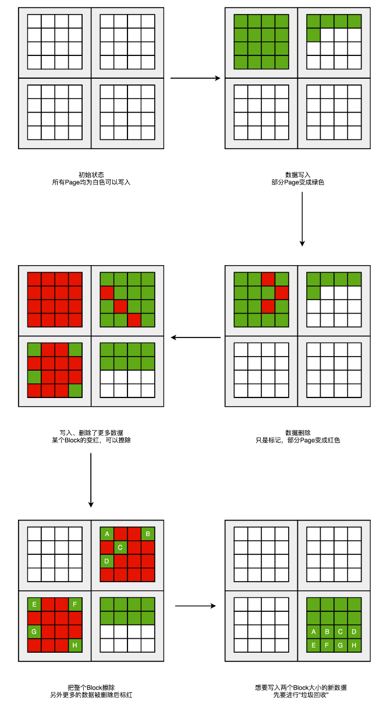
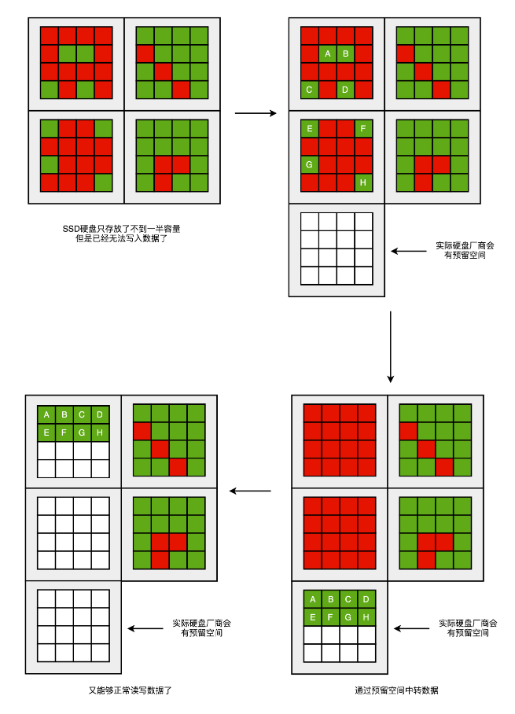
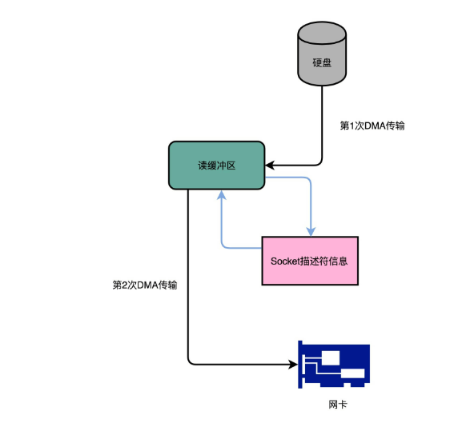
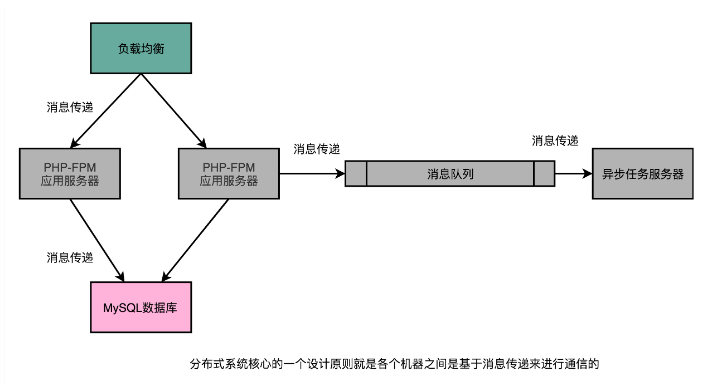

## 1

## 2. 存储器整体架构

### 2.1. 存储器层次 

我们常常把 CPU 比喻成计算机的“大脑”。我们思考的东西，就好比 CPU 中的**寄存器**（Register）。寄存器与其说是存储器，其实它更像是 CPU 本身的一部分，只能存放极其有限的信息，但是速度非常快，和 CPU 同步。

而我们大脑中的记忆，就好比**CPU Cache**（CPU 高速缓存，我们常常简称为“缓存”）。CPU Cache 用的是一种叫作**SRAM**（Static Random-Access Memory，静态随机存取存储器）的芯片。

#### 2.1.1. SRAM

SRAM 之所以被称为“静态”存储器，是因为只要处在通电状态，里面的数据就可以保持存在。而一旦断电，里面的数据就会丢失了。在 SRAM 里面，一个比特的数据，需要 6～8 个晶体管。所以 SRAM 的存储密度不高。同样的物理空间下，能够存储的数据有限。不过，因为 SRAM 的电路简单，所以访问速度非常快。

 

在 CPU 里，通常会有 L1、L2、L3 这样三层高速缓存。每个 CPU 核心都有一块属于自己的 L1 高速缓存，通常分成**指令缓存**和**数据缓存**，分开存放 CPU 使用的指令和数据。

指令缓存和数据缓存，其实就是来自于哈佛架构。L1 的 Cache 往往就嵌在 CPU 核心的内部。

L2 的 Cache 同样是每个 CPU 核心都有的，不过它往往不在 CPU 核心的内部。所以，L2 Cache 的访问速度会比 L1 稍微慢一些。而 L3 Cache，则通常是多个 CPU 核心共用的，尺寸会更大一些，访问速度自然也就更慢一些。

你可以把 CPU 中的 L1 Cache 理解为我们的短期记忆，把 L2/L3 Cache 理解成长期记忆，把内存当成我们拥有的书架或者书桌。 当我们自己记忆中没有资料的时候，可以从书桌或者书架上拿书来翻阅。这个过程中就相当于，数据从内存中加载到 CPU 的寄存器和 Cache 中，然后通过“大脑”，也就是 CPU，进行处理和运算

#### 2.1.2. DRAM

内存用的芯片和 Cache 有所不同，它用的是一种叫作**DRAM**（Dynamic Random Access Memory，动态随机存取存储器）的芯片，比起 SRAM 来说，它的密度更高，有更大的容量，而且它也比 SRAM 芯片便宜不少。

DRAM 被称为“动态”存储器，是因为 DRAM 需要靠不断地“刷新”，才能保持数据被存储起来。DRAM 的一个比特，只需要一个晶体管和一个电容就能存储。所以，DRAM 在同样的物理空间下，能够存储的数据也就更多，也就是存储的“密度”更大。但是，因为数据是存储在电容里的，电容会不断漏电，所以需要定时刷新充电，才能保持数据不丢失。DRAM 的数据访问电路和刷新电路都比 SRAM 更复杂，所以访问延时也就更长

 

#### 2.1.3. 层级结构

整个存储器的层次结构，其实都类似于 SRAM 和 DRAM 在性能和价格上的差异。SRAM 更贵，速度更快。DRAM 更便宜，容量更大。SRAM 好像我们的大脑中的记忆，而 DRAM 就好像属于我们自己的书桌。

大脑（CPU）中的记忆（L1 Cache），不仅受成本层面的限制，更受物理层面的限制。这就好比 L1 Cache 不仅昂贵，其访问速度和它到 CPU 的物理距离有关。芯片造得越大，总有部分离 CPU 的距离会变远。电信号的传输速度又受物理原理的限制，没法超过光速。所以想要快，并不是靠多花钱就能解决的。

我们自己的书房和书桌（也就是内存）空间一般是有限的，没有办法放下所有书（也就是数据）。如果想要扩大空间的话，就相当于要多买几平方米的房子，成本就会很高。于是，想要放下更多的书，我们就要寻找更加廉价的解决方案。

没错，我们想到了公共图书馆。对于内存来说，**SSD**（Solid-state drive 或 Solid-state disk，固态硬盘）、**HDD**（Hard Disk Drive，硬盘）这些被称为**硬盘**的外部存储设备，就是公共图书馆。于是，我们就可以去家附近的图书馆借书了。图书馆有更多的空间（存储空间）和更多的书（数据）。

你应该也在自己的个人电脑上用过 SSD 硬盘。过去几年，SSD 这种基于 NAND 芯片的高速硬盘，价格已经大幅度下降。

而 HDD 硬盘则是一种完全符合“磁盘”这个名字的传统硬件。“磁盘”的硬件结构，决定了它的访问速度受限于它的物理结构，是最慢的。

这些我们后面都会详细说，你可以对照下面这幅图了解一下，对存储器层次之间的作用和关联有个大致印象就可以了。

 

从 Cache、内存，到 SSD 和 HDD 硬盘，一台现代计算机中，就用上了所有这些存储器设备。其中，容量越小的设备速度越快，而且，CPU 并不是直接和每一种存储器设备打交道，而是每一种存储器设备，只和它相邻的存储设备打交道。比如，CPU Cache 是从内存里加载而来的，或者需要写回内存，并不会直接写回数据到硬盘，也不会直接从硬盘加载数据到 CPU Cache 中，而是先加载到内存，再从内存加载到 Cache 中。 

**这样，各个存储器只和相邻的一层存储器打交道，并且随着一层层向下，存储器的容量逐层增大，访问速度逐层变慢，而单位存储成本也逐层下降，也就构成了我们日常所说的存储器层次结构。**

#### 2.1.4. 小结

我们常常把 CPU 比喻成高速运转的大脑，那么和大脑同步的寄存器（Register），就存放着我们当下正在思考和处理的数据。而 L1-L3 的 CPU Cache，好比存放在我们大脑中的短期到长期的记忆。我们需要小小花费一点时间，就能调取并进行处理。

我们自己的书桌书架就好比计算机的内存，能放下更多的书也就是数据，但是找起来和看起来就要慢上不少。而图书馆更像硬盘这个外存，能够放下更多的数据，找起来也更费时间。从寄存器、CPU Cache，到内存、硬盘，这样一层层下来的存储器，速度越来越慢，空间越来越大，价格也越来越便宜。

这三个“越来越”的特性，使得我们在组装计算机的时候，要组合使用各种存储设备。越是快且贵的设备，实际在一台计算机里面的存储空间往往就越小。而越是慢且便宜的设备，在实际组装的计算机里面的存储空间就会越大。

### 2.2.局部性原理

平时进行服务端软件开发的时候，我们通常会把数据存储在数据库里。而服务端系统遇到的第一个性能瓶颈，往往就发生在访问数据库的时候。这个时候，大部分工程师和架构师会拿出一种叫作“缓存”的武器，通过使用 Redis 或者 Memcache 这样的开源软件，在数据库前面提供一层缓存的数据，来缓解数据库面临的压力，提升服务端的程序性能。

 

储器中数据的**局部性原理**（Principle of Locality）。我们可以利用这个局部性原理，来制定管理和访问数据的策略。这个局部性原理包括**时间局部性**（temporal locality）和**空间局部性**（spatial locality）这两种策略。

#### 2.2.1. **时间局部性**

这个策略是说，如果一个数据被访问了，那么它在短时间内还会被再次访问

 

#### 2.2.2. **空间局部性**

 

举个例子：

我读完了这本书之后，感觉这书不错，所以就会借阅整套“哈利波特”。这就好比我们的程序，在访问了数组的首项之后，多半会循环访问它的下一项。因为，在存储数据的时候，数组内的多项数据会存储在相邻的位置。这就好比图书馆会把“哈利波特”系列放在一个书架上，摆放在一起，加载的时候，也会一并加载。我们去图书馆借书，往往会一次性把 7 本都借回来

#### 2.2.3. **缓存算法**


我们现在要提供一个亚马逊这样的电商网站。我们假设里面有 6 亿件商品，如果每件商品需要 4MB 的存储空间（考虑到商品图片的话，4MB 已经是一个相对较小的估计了），那么一共需要 2400TB（ = 6 亿 × 4MB）的数据存储。

如果我们把数据都放在内存里面，那就需要 3600 万美元（ = 2400TB/1MB × 0.015 美元 = 3600 万美元）。但是，这 6 亿件商品中，不是每一件商品都会被经常访问。比如说，有 Kindle 电子书这样的热销商品，也一定有基本无人问津的商品，比如偏门的缅甸语词典。

如果我们只在内存里放前 1% 的热门商品，也就是 600 万件热门商品，而把剩下的商品，放在机械式的 HDD 硬盘上，那么，我们需要的存储成本就下降到 45.6 万美元（ = 3600 万美元 × 1% + 2400TB / 1MB × 0.00004 美元），是原来成本的 1.3% 左右。


用的就是时间局部性。我们把有用户访问过的数据，加载到内存中，一旦内存里面放不下了，我们就把最长时间没有在内存中被访问过的数据，从内存中移走，这个其实就是我们常用的**LRU**（Least Recently Used）**缓存算法**。热门商品被访问得多，就会始终被保留在内存里，而冷门商品被访问得少，就只存放在 HDD 硬盘上，数据的读取也都是直接访问硬盘。即使加载到内存中，也会很快被移除。越是热门的商品，越容易在内存中找到，也就更好地利用了内存的随机访问性能。

那么，只放 600 万件商品真的可以满足我们实际的线上服务请求吗？这个就要看 LRU 缓存策略的**缓存命中率**（Hit Rate/Hit Ratio）了，也就是访问的数据中，可以在我们设置的内存缓存中找到的，占有多大比例。

内存的随机访问请求需要 100ns。这也就意味着，在极限情况下，内存可以支持 1000 万次随机访问。我们用了 24TB 内存，如果 8G 一条的话，意味着有 3000 条内存，可以支持每秒 300 亿次（ = 24TB/8GB × 1s/100ns）访问。以亚马逊 2017 年 3 亿的用户数来看，我们估算每天的活跃用户为 1 亿，这 1 亿用户每人平均会访问 100 个商品，那么平均每秒访问的商品数量，就是 12 万次。

但是如果数据没有命中内存，那么对应的数据请求就要访问到 HDD 磁盘了。刚才的图表中，我写了，一块 HDD 硬盘只能支撑每秒 100 次的随机访问，2400TB 的数据，以 4TB 一块磁盘来计算，有 600 块磁盘，也就是能支撑每秒 6 万次（ = 2400TB/4TB × 1s/10ms ）的随机访问。

这就意味着，所有的商品访问请求，都直接到了 HDD 磁盘，HDD 磁盘支撑不了这样的压力。我们至少要 50% 的缓存命中率，HDD 磁盘才能支撑对应的访问次数。不然的话，我们要么选择添加更多数量的 HDD 硬盘，做到每秒 12 万次的随机访问，或者将 HDD 替换成 SSD 硬盘，让单个硬盘可以支持更多的随机访问请求。

 

当然，这里我们只是一个简单的估算。在实际的应用程序中，查看一个商品的数据可能意味着不止一次的随机内存或者随机磁盘的访问。对应的数据存储空间也不止要考虑数据，还需要考虑维护数据结构的空间，而缓存的命中率和访问请求也要考虑均值和峰值的问题。

通过这个估算过程，你需要理解，如何进行存储器的硬件规划。你需要考虑硬件的成本、访问的数据量以及访问的数据分布，然后根据这些数据的估算，来组合不同的存储器，能用尽可能低的成本支撑所需要的服务器压力。而当你用上了数据访问的局部性原理，组合起了多种存储器，你也就理解了怎么基于存储器层次结构，来进行硬件规划了。

#### 2.2.4. 小结

在实际的计算机日常的开发和应用中，我们对于数据的访问总是会存在一定的局部性。有时候，这个局部性是时间局部性，就是我们最近访问过的数据还会被反复访问。有时候，这个局部性是空间局部性，就是我们最近访问过数据附近的数据很快会被访问到。

而局部性的存在，使得我们可以在应用开发中使用缓存这个有利的武器。比如，通过将热点数据加载并保留在速度更快的存储设备里面，我们可以用更低的成本来支撑服务器

## 3.CPU高速缓存

```
int[] arr = new int[64 * 1024 * 1024];
 
 
// 循环 1
for (int i = 0; i < arr.length; i++) arr[i] *= 3;
 
 
// 循环 2
for (int i = 0; i < arr.length; i += 16) arr[i] *= 3

```

在这段 Java 程序中，我们首先构造了一个 64×1024×1024 大小的整型数组。在循环 1 里，我们遍历整个数组，将数组中每一项的值变成了原来的 3 倍；在循环 2 里，我们每隔 16 个索引访问一个数组元素，将这一项的值变成了原来的 3 倍。

按道理来说，循环 2 只访问循环 1 中 1/16 的数组元素，只进行了循环 1 中 1/16 的乘法计算，那循环 2 花费的时间应该是循环 1 的 1/16 左右。但是实际上，循环 1 在我的电脑上运行需要 50 毫秒，循环 2 只需要 46 毫秒。这两个循环花费时间之差在 15% 之内

### 3.1. 作用

​	CPU 的访问速度每 18 个月便会翻一番，相当于每年增长 60%。内存的访问速度虽然也在不断增长，却远没有这么快，每年只增长 7% 左右。而这两个增长速度的差异，使得 CPU 性能和内存访问性能的差距不断拉大。到今天来看，一次内存的访问，大约需要 120 个 CPU Cycle，这也意味着，在今天，CPU 和内存的访问速度已经有了 120 倍的差距。

​	为了弥补两者之间的性能差异，我们能真实地把 CPU 的性能提升用起来，而不是让它在那儿空转，我们在现代 CPU 中引入了高速缓存。从 CPU Cache 被加入到现有的 CPU 里开始，内存中的指令、数据，会被加载到 L1-L3 Cache 中，而不是直接由 CPU 访问内存去拿。在 95% 的情况下，CPU 都只需要访问 L1-L3 Cache，从里面读取指令和数据，而无需访问内存。要注意的是，这里我们说的 CPU Cache 或者 L1/L3 Cache，不是一个单纯的、概念上的缓存（比如之前我们说的拿内存作为硬盘的缓存），而是指特定的由 SRAM 组成的物理芯片。

这里是一张 Intel CPU 的放大照片。这里面大片的长方形芯片，就是这个 CPU 使用的 20MB 的 L3 Cache。

 

日常使用的 Intel 服务器或者 PC 里，Cache Line 的大小通常是 64 字节。而在上面的循环 2 里面，我们每隔 16 个整型数计算一次，16 个整型数正好是 64 个字节。于是，循环 1 和循环 2，需要把同样数量的 Cache Line 数据从内存中读取到 CPU Cache 中，最终两个程序花费的时间就差别不大了。

知道了为什么需要 CPU Cache，接下来，我们就来看一看，CPU 究竟是如何访问 CPU Cache 的，以及 CPU Cache 是如何组织数据，使得 CPU 可以找到自己想要访问的数据的。因为 Cache 作为“缓存”的意思，在很多别的存储设备里面都会用到。为了避免你混淆，在表示抽象的“缓存“概念时，用中文的“缓存”；如果是 CPU Cache，我会用“高速缓存“或者英文的“Cache”，来表示

### 3.2. 读取过程

现代 CPU 进行数据读取的时候，无论数据是否已经存储在 Cache 中，CPU 始终会首先访问 Cache。只有当 CPU 在 Cache 中找不到数据的时候，才会去访问内存，并将读取到的数据写入 Cache 之中。当时间局部性原理起作用后，这个最近刚刚被访问的数据，会很快再次被访问。而 Cache 的访问速度远远快于内存，这样，CPU 花在等待内存访问上的时间就大大变短了。

 

这样的访问机制，和我们自己在开发应用系统的时候，“使用内存作为硬盘的缓存”的逻辑是一样的。在各类基准测试（Benchmark）和实际应用场景中，CPU Cache 的命中率通常能达到 95% 以上。

问题来了，CPU 如何知道要访问的内存数据，存储在 Cache 的哪个位置呢？接下来，我就从最基本的**直接映射 Cache**（Direct Mapped Cache）说起，带你来看整个 Cache 的数据结构和访问逻辑。

在开头的 3 行小程序里我说过，CPU 访问内存数据，是一小块一小块数据来读取的。对于读取内存中的数据，我们首先拿到的是数据所在的**内存块**（Block）的地址。而直接映射 Cache 采用的策略，就是确保任何一个内存块的地址，始终映射到一个固定的 CPU Cache 地址（Cache Line）。而这个映射关系，通常用 mod 运算（求余运算）来实现。下面我举个例子帮你理解一下。

比如说，我们的主内存被分成 0～31 号这样 32 个块。我们一共有 8 个缓存块。用户想要访问第 21 号内存块。如果 21 号内存块内容在缓存块中的话，它一定在 5 号缓存块（21 mod 8 = 5）中。

 

实际计算中，有一个小小的技巧，通常我们会把缓存块的数量设置成 2 的 N 次方。这样在计算取模的时候，可以直接取地址的低 N 位，也就是二进制里面的后几位。比如这里的 8 个缓存块，就是 2 的 3 次方。那么，在对 21 取模的时候，可以对 21 的 2 进制表示 10101 取地址的低三位，也就是 101，对应的 5，就是对应的缓存块地址。 

 

取 Block 地址的低位，就能得到对应的 Cache Line 地址，除了 21 号内存块外，13 号、5 号等很多内存块的数据，都对应着 5 号缓存块中。既然如此，假如现在 CPU 想要读取 21 号内存块，在读取到 5 号缓存块的时候，我们怎么知道里面的数据，究竟是不是 21 号对应的数据呢？同样，建议你借助现有知识，先自己思考一下，然后再看我下面的分析，这样会印象比较深刻。

这个时候，在对应的缓存块中，我们会存储一个**组标记**（Tag）。这个组标记会记录，当前缓存块内存储的数据对应的内存块，而缓存块本身的地址表示访问地址的低 N 位。就像上面的例子，21 的低 3 位 101，缓存块本身的地址已经涵盖了对应的信息、对应的组标记，我们只需要记录 21 剩余的高 2 位的信息，也就是 10 就可以了。

除了组标记信息之外，缓存块中还有两个数据。一个自然是从主内存中加载来的实际存放的数据，另一个是**有效位**（valid bit）。啥是有效位呢？它其实就是用来标记，对应的缓存块中的数据是否是有效的，确保不是机器刚刚启动时候的空数据。如果有效位是 0，无论其中的组标记和 Cache Line 里的数据内容是什么，CPU 都不会管这些数据，而要直接访问内存，重新加载数据。

CPU 在读取数据的时候，并不是要读取一整个 Block，而是读取一个他需要的整数。这样的数据，我们叫作 CPU 里的一个字（Word）。具体是哪个字，就用这个字在整个 Block 里面的位置来决定。这个位置，我们叫作偏移量（Offset）。

总结一下，**一个内存的访问地址，最终包括高位代表的组标记、低位代表的索引，以及在对应的 Data Block 中定位对应字的位置偏移量。** 

  

而内存地址对应到 Cache 里的数据结构，则多了一个有效位和对应的数据，由“**索引 + 有效位** **+ 组标记 + 数据**”组成。如果内存中的数据已经在 CPU Cache 里了，那一个内存地址的访问，就会经历这样 4 个步骤：

1. 根据内存地址的低位，计算在 Cache 中的索引；
2. 判断有效位，确认 Cache 中的数据是有效的；
3. 对比内存访问地址的高位，和 Cache 中的组标记，确认 Cache 中的数据就是我们要访问的内存数据，从 Cache Line 中读取到对应的数据块（Data Block）；
4. 根据内存地址的 Offset 位，从 Data Block 中，读取希望读取到的字。

如果在 2、3 这两个步骤中，CPU 发现，Cache 中的数据并不是要访问的内存地址的数据，那 CPU 就会访问内存，并把对应的 Block Data 更新到 Cache Line 中，同时更新对应的有效位和组标记的数据。

好了，讲到这里，相信你明白现代 CPU，是如何通过直接映射 Cache，来定位一个内存访问地址在 Cache 中的位置了。其实，除了直接映射 Cache 之外，我们常见的缓存放置策略还有全相连 Cache（Fully Associative Cache）、组相连 Cache（Set Associative Cache）。这几种策略的数据结构都是相似的，理解了最简单的直接映射 Cache，其他的策略你很容易就能理解了。

### 3.3. 缓存写入

#### 3.3.1. volatile

Java 内存模型以及关键字 volatile 的含义。**那 volatile 关键字究竟代表什么含义呢？它会确保我们对于这个变量的读取和写入，都一定会同步到主内存里，而不是从 Cache 里面读取。**

虽然 Java 内存模型是一个隔离了硬件实现的虚拟机内的抽象模型，但是它给了我们一个很好的“缓存同步”问题的示例。也就是说，如果我们的数据，在不同的线程或者 CPU 核里面去更新，因为不同的线程或 CPU 核有着自己各自的缓存，很有可能在 A 线程的更新，到 B 线程里面是看不见的；

#### 3.3.2. 高速写入

我们现在用的 Intel CPU，通常都是多核的的。每一个 CPU 核里面，都有独立属于自己的 L1、L2 的 Cache，然后再有多个 CPU 核共用的 L3 的 Cache、主内存。

因为 CPU Cache 的访问速度要比主内存快很多，而在 CPU Cache 里面，L1/L2 的 Cache 也要比 L3 的 Cache 快。所以，上一讲我们可以看到，CPU 始终都是尽可能地从 CPU Cache 中去获取数据，而不是每一次都要从主内存里面去读取数据。

 

这个层级结构，就好像我们在 Java 内存模型里面，每一个线程都有属于自己的线程栈。线程在读取 COUNTER 的数据的时候，其实是从本地的线程栈的 Cache 副本里面读取数据，而不是从主内存里面读取数据。如果我们对于数据仅仅只是读，问题还不大。，已经看到 Cache Line 的组成，以及如何从内存里面把对应的数据加载到 Cache 里。

但是，对于数据，我们不光要读，还要去写入修改。这个时候，有两个问题来了

**第一个问题是，写入 Cache 的性能也比写入主内存要快，那我们写入的数据**

**第一个问题是，写入 Cache 的性能也比写入主内存要快，那我们写入的数据，到底应该写到 Cache 里还是主内存呢？如果我们直接写入到主内存里，Cache 里的数据是否会失效呢？**

* 写直达

  最简单的一种写入策略，叫作写直达（Write-Through）。在这个策略里，每一次数据都要写入到主内存里面。在写直达的策略里面，写入前，我们会先去判断数据是否已经在 Cache 里面了。如果数据已经在 Cache 里面了，我们先把数据写入更新到 Cache 里面，再写入到主内存里面；如果数据不在 Cache 里，我们就只更新主内存。

  写直达的这个策略很直观，但是问题也很明显，那就是这个策略很慢。无论数据是不是在 Cache 里面，我们都需要把数据写到主内存里面。这个方式就有点儿像我们上面用 volatile 关键字，始终都要把数据同步到主内存里面。

   

* 写回

   

  这个时候，我们就想了，既然我们去读数据也是默认从 Cache 里面加载，能否不用把所有的写入都同步到主内存里呢？只写入 CPU Cache 里面是不是可以？

  当然是可以的。在 CPU Cache 的写入策略里，还有一种策略就叫作写回（Write-Back）。这个策略里，我们不再是每次都把数据写入到主内存，而是只写到 CPU Cache 里。只有当 CPU Cache 里面的数据要被“替换”的时候，我们才把数据写入到主内存里面去。

  写回策略的过程是这样的：如果发现我们要写入的数据，就在 CPU Cache 里面，那么我们就只是更新 CPU Cache 里面的数据。同时，我们会标记 CPU Cache 里的这个 Block 是脏（Dirty）的。所谓脏的，就是指这个时候，我们的 CPU Cache 里面的这个 Block 的数据，和主内存是不一致的。

  如果我们发现，我们要写入的数据所对应的 Cache Block 里，放的是别的内存地址的数据，那么我们就要看一看，那个 Cache Block 里面的数据有没有被标记成脏的。如果是脏的话，我们要先把这个 Cache Block 里面的数据，写入到主内存里面。然后，再把当前要写入的数据，写入到 Cache 里，同时把 Cache Block 标记成脏的。如果 Block 里面的数据没有被标记成脏的，那么我们直接把数据写入到 Cache 里面，然后再把 Cache Block 标记成脏的就好了。

  在用了写回这个策略之后，我们在加载内存数据到 Cache 里面的时候，也要多出一步同步脏 Cache 的动作。如果加载内存里面的数据到 Cache 的时候，发现 Cache Block 里面有脏标记，我们也要先把 Cache Block 里的数据写回到主内存，才能加载数据覆盖掉 Cache。

  可以看到，在写回这个策略里，如果我们大量的操作，都能够命中缓存。那么大部分时间里，我们都不需要读写主内存，自然性能会比写直达的效果好很多。

  然而，无论是写回还是写直达，其实都还没有解决我们在上面 volatile 程序示例中遇到的问题，也就是**多个线程，或者是多个 CPU 核的缓存一致性的问题。这也就是我们在写入修改缓存后，需要解决的第二个问题。**

  要解决这个问题，我们需要引入一个新的方法，叫作 MESI 协议

#### 3.3.3. 小结

Java 内存模型和 CPU、CPU Cache 以及主内存的组织结构非常相似。在 CPU Cache 里，对于数据的写入，我们也有写直达和写回这两种解决方案。写直达把所有的数据都直接写入到主内存里面，简单直观，但是性能就会受限于内存的访问速度。而写回则通常只更新缓存，只有在需要把缓存里面的脏数据交换出去的时候，才把数据同步到主内存里。在缓存经常会命中的情况下，性能更好。

但是，除了采用读写都直接访问主内存的办法之外，如何解决缓存一致性的问题

### 3.4. MESI 协议

#### 3.4.1. 一致性问题

 

比方说，iPhone 降价了，我们要把 iPhone 最新的价格更新到内存里。为了性能问题，它采用了上一讲我们说的写回策略，先把数据写入到 L2 Cache 里面，然后把 Cache Block 标记成脏的。这个时候，数据其实并没有被同步到 L3 Cache 或者主内存里。1 号核心希望在这个 Cache Block 要被交换出去的时候，数据才写入到主内存里。

如果我们的 CPU 只有 1 号核心这一个 CPU 核，那这其实是没有问题的。不过，我们旁边还有一个 2 号核心呢！这个时候，2 号核心尝试从内存里面去读取 iPhone 的价格，结果读到的是一个错误的价格。这是因为，iPhone 的价格刚刚被 1 号核心更新过。但是这个更新的信息，只出现在 1 号核心的 L2 Cache 里，而没有出现在 2 号核心的 L2 Cache 或者主内存里面。**这个问题，就是所谓的缓存一致性问题，1 号核心和 2 号核心的缓存，在这个时候是不一致的。**

为了解决这个缓存不一致的问题，我们就需要有一种机制，来同步两个不同核心里面的缓存数据。那这样的机制需要满足什么条件呢？我觉得能够做到下面两点就是合理的

第一点叫**写传播**（Write Propagation）。写传播是说，在一个 CPU 核心里，我们的 Cache 数据更新，必须能够传播到其他的对应节点的 Cache Line 里。

第二点叫**事务的串行化**（Transaction Serialization），事务串行化是说，我们在一个 CPU 核心里面的读取和写入，在其他的节点看起来，顺序是一样的。

第一点写传播很容易理解。既然我们数据写完了，自然要同步到其他 CPU 核的 Cache 里。但是第二点事务的串行化，可能没那么好理解，我这里仔细解释一下。

我们还拿刚才修改 iPhone 的价格来解释。这一次，我们找一个有 4 个核心的 CPU。1 号核心呢，先把 iPhone 的价格改成了 5000 块。差不多在同一个时间，2 号核心把 iPhone 的价格改成了 6000 块。这里两个修改，都会传播到 3 号核心和 4 号核心。

 

3 号核心先收到了 2 号核心的写传播，再收到 1 号核心的写传播。所以 3 号核心看到的 iPhone 价格是先变成了 6000 块，再变成了 5000 块。而 4 号核心呢，是反过来的，先看到变成了 5000 块，再变成 6000 块。虽然写传播是做到了，但是各个 Cache 里面的数据，是不一致的。

事实上，我们需要的是，从 1 号到 4 号核心，都能看到相同顺序的数据变化。比如说，都是先变成了 5000 块，再变成了 6000 块。这样，我们才能称之为实现了事务的串行化。

事务的串行化，不仅仅是缓存一致性中所必须的。比如，我们平时所用到的系统当中，最需要保障事务串行化的就是数据库。多个不同的连接去访问数据库的时候，我们必须保障事务的串行化，做不到事务的串行化的数据库，根本没法作为可靠的商业数据库来使用。

而在 CPU Cache 里做到事务串行化，需要做到两点，第一点是一个 CPU 核心对于数据的操作，需要同步通信给到其他 CPU 核心。第二点是，如果两个 CPU 核心里有同一个数据的 Cache，那么对于这个 Cache 数据的更新，需要有一个“锁”的概念。只有拿到了对应 Cache Block 的“锁”之后，才能进行对应的数据更新。接下来，我们就看看实现了这两个机制的 MESI 协议。 

#### 3.4.2. **总线嗅探**

要解决缓存一致性问题，首先要解决的是多个 CPU 核心之间的数据传播问题。最常见的一种解决方案呢，叫作**总线嗅探**（Bus Snooping）。这个名字听起来，你多半会很陌生，但是其实特很好理解。

这个策略，本质上就是把所有的读写请求都通过总线（Bus）广播给所有的 CPU 核心，然后让各个核心去“嗅探”这些请求，再根据本地的情况进行响应。

总线本身就是一个特别适合广播进行数据传输的机制，所以总线嗅探这个办法也是我们日常使用的 Intel CPU 进行缓存一致性处理的解决方案。关于总线这个知识点，我们会放在后面的 I/O 部分更深入地进行讲解，这里你只需要了解就可以了。

基于总线嗅探机制，其实还可以分成很多种不同的缓存一致性协议。不过其中最常用的，就是今天我们要讲的 MESI 协议。和很多现代的 CPU 技术一样，MESI 协议也是在 Pentium 时代，被引入到 Intel CPU 中的。

MESI 协议，是一种叫作**写失效**（Write Invalidate）的协议。在写失效协议里，只有一个 CPU 核心负责写入数据，其他的核心，只是同步读取到这个写入。在这个 CPU 核心写入 Cache 之后，它会去广播一个“失效”请求告诉所有其他的 CPU 核心。其他的 CPU 核心，只是去判断自己是否也有一个“失效”版本的 Cache Block，然后把这个也标记成失效的就好了。

相对于写失效协议，还有一种叫作**写广播**（Write Broadcast）的协议。在那个协议里，一个写入请求广播到所有的 CPU 核心，同时更新各个核心里的 Cache。

写广播在实现上自然很简单，但是写广播需要占用更多的总线带宽。写失效只需要告诉其他的 CPU 核心，哪一个内存地址的缓存失效了，但是写广播还需要把对应的数据传输给其他 CPU 核心。

 

 

MESI 协议的由来呢，来自于我们对 Cache Line 的四个不同的标记，分别是：

- M：代表已修改（Modified）
- E：代表独占（Exclusive）
- S：代表共享（Shared）
- I：代表已失效（Invalidated）

我们先来看看“已修改”和“已失效”，这两个状态比较容易理解。所谓的“已修改”，就是我们上一讲所说的“脏”的 Cache Block。Cache Block 里面的内容我们已经更新过了，但是还没有写回到主内存里面。而所谓的“已失效“，自然是这个 Cache Block 里面的数据已经失效了，我们不可以相信这个 Cache Block 里面的数据。

然后，我们再来看“独占”和“共享”这两个状态。这就是 MESI 协议的精华所在了。无论是独占状态还是共享状态，缓存里面的数据都是“干净”的。这个“干净”，自然对应的是前面所说的“脏”的，也就是说，这个时候，Cache Block 里面的数据和主内存里面的数据是一致的。

那么“独占”和“共享”这两个状态的差别在哪里呢？这个差别就在于，在独占状态下，对应的 Cache Line 只加载到了当前 CPU 核所拥有的 Cache 里。其他的 CPU 核，并没有加载对应的数据到自己的 Cache 里。这个时候，如果要向独占的 Cache Block 写入数据，我们可以自由地写入数据，而不需要告知其他 CPU 核。

在独占状态下的数据，如果收到了一个来自于总线的读取对应缓存的请求，它就会变成共享状态。这个共享状态是因为，这个时候，另外一个 CPU 核心，也把对应的 Cache Block，从内存里面加载到了自己的 Cache 里来。

而在共享状态下，因为同样的数据在多个 CPU 核心的 Cache 里都有。所以，当我们想要更新 Cache 里面的数据的时候，不能直接修改，而是要先向所有的其他 CPU 核心广播一个请求，要求先把其他 CPU 核心里面的 Cache，都变成无效的状态，然后再更新当前 Cache 里面的数据。这个广播操作，一般叫作 RFO（Request For Ownership），也就是获取当前对应 Cache Block 数据的所有权。

有没有觉得这个操作有点儿像我们在多线程里面用到的读写锁。在共享状态下，大家都可以并行去读对应的数据。但是如果要写，我们就需要通过一个锁，获取当前写入位置的所有权。

整个 MESI 的状态，可以用一个有限状态机来表示它的状态流转。需要注意的是，对于不同状态触发的事件操作，可能来自于当前 CPU 核心，也可能来自总线里其他 CPU 核心广播出来的信号。我把对应的状态机流转图放在了下面，你可以对照着[Wikipedia 里面 MESI 的内容](https://zh.wikipedia.org/wiki/MESI协议)，仔细研读一下。

  

#### 3.4.3. 小结

想要实现缓存一致性，关键是要满足两点。第一个是写传播，也就是在一个 CPU 核心写入的内容，需要传播到其他 CPU 核心里。更重要的是第二点，保障事务的串行化，才能保障我们的数据是真正一致的，我们的程序在各个不同的核心上运行的结果也是一致的。这个特性不仅在 CPU 的缓存层面很重要，在数据库层面更加重要。

之后，我介绍了基于总线嗅探机制的 MESI 协议。MESI 协议是一种基于写失效的缓存一致性协议。写失效的协议的好处是，我们不需要在总线上传输数据内容，而只需要传输操作信号和地址信号就好了，不会那么占总线带宽。

MESI 协议，是已修改、独占、共享以及已失效这四个缩写的合称。独占和共享状态，就好像我们在多线程应用开发里面的读写锁机制，确保了我们的缓存一致性。而整个 MESI 的状态变更，则是根据来自自己 CPU 核心的请求，以及来自其他 CPU 核心通过总线传输过来的操作信号和地址信息，进行状态流转的一个有限状态机。

## 4. 内存

在我们日常使用的 Linux 或者 Windows 操作系统下，程序并不能直接访问物理内存

 

我们的内存需要被分成固定大小的页（Page），然后再通过虚拟内存地址（Virtual Address）到物理内存地址（Physical Address）的地址转换（Address Translation），才能到达实际存放数据的物理内存位置。而我们的程序看到的内存地址，都是虚拟内存地址。

既然如此，这些虚拟内存地址究竟是怎么转换成物理内存地址的呢？这一讲里，我们就来看一看。

### 简单页表

想要把虚拟内存地址，映射到物理内存地址，最直观的办法，就是来建一张映射表。这个映射表，能够实现虚拟内存里面的页，到物理内存里面的页的一一映射。这个映射表，在计算机里面，就叫作**页表**（Page Table）。

页表这个地址转换的办法，会把一个内存地址分成**页号**（Directory）和**偏移量**（Offset）两个部分。这么说太理论了，我以一个 32 位的内存地址为例，帮你理解这个概念。

其实，前面的高位，就是内存地址的页号。后面的低位，就是内存地址里面的偏移量。做地址转换的页表，只需要保留虚拟内存地址的页号和物理内存地址的页号之间的映射关系就可以了。同一个页里面的内存，在物理层面是连续的。以一个页的大小是 4K 比特（4KiB）为例，我们需要 20 位的高位，12 位的低位

 

对于一个内存地址转换，其实就是这样三个步骤：

1. 把虚拟内存地址，切分成页号和偏移量的组合；
2. 从页表里面，查询出虚拟页号，对应的物理页号；
3. 直接拿物理页号，加上前面的偏移量，就得到了物理内存地址。

 

看起来这个逻辑似乎很简单，很容易理解，不过问题马上就来了。你能算一算，这样一个页表需要多大的空间吗？我们以 32 位的内存地址空间为例，你可以暂停一下，拿出纸笔算一算。

不知道你算出的数字是多少？32 位的内存地址空间，页表一共需要记录 2^20 个到物理页号的映射关系。这个存储关系，就好比一个 2^20 大小的数组。一个页号是完整的 32 位的 4 字节（Byte），这样一个页表就需要 4MB 的空间。听起来 4MB 的空间好像还不大啊，毕竟我们现在的内存至少也有 4GB，服务器上有个几十 GB 的内存和很正常。

 

不过，这个空间可不是只占用一份哦。我们每一个进程，都有属于自己独立的虚拟内存地址空间。这也就意味着，每一个进程都需要这样一个页表。不管我们这个进程，是个本身只有几 KB 大小的程序，还是需要几 GB 的内存空间，都需要这样一个页表。如果你用的是 Windows，你可以打开你自己电脑上的任务管理器看看，现在你的计算机里同时在跑多少个进程，用这样的方式，页表需要占用多大的内存。

这还只是 32 位的内存地址空间，现在大家用的内存，多半已经超过了 4GB，也已经用上了 64 位的计算机和操作系统。这样的话，用上面这个数组的数据结构来保存页面，内存占用就更大了。那么，我们有没有什么更好的解决办法呢？你可以先仔细思考一下。

### 多级页表

仔细想一想，我们其实没有必要存下这 2^20 个物理页表啊。大部分进程所占用的内存是有限的，需要的页也自然是很有限的。我们只需要去存那些用到的页之间的映射关系就好了。如果你对数据结构比较熟悉，你可能要说了，那我们是不是应该用哈希表（Hash Map）这样的数据结构呢？

很可惜你猜错了：）。在实践中，我们其实采用的是一种叫作多级页表（Multi-Level Page Table）的解决方案。这是为什么呢？为什么我们不用哈希表而用多级页表呢？别着急，听我慢慢跟你讲。

我们先来看一看，一个进程的内存地址空间是怎么分配的。在整个进程的内存地址空间，通常是“两头实、中间空”。在程序运行的时候，内存地址从顶部往下，不断分配占用的栈的空间。而堆的空间，内存地址则是从底部往上，是不断分配占用的。

所以，在一个实际的程序进程里面，虚拟内存占用的地址空间，通常是两段连续的空间。而不是完全散落的随机的内存地址。而多级页表，就特别适合这样的内存地址分布。

我们以一个 4 级的多级页表为例，来看一下。同样一个虚拟内存地址，偏移量的部分和上面简单页表一样不变，但是原先的页号部分，我们把它拆成四段，从高到低，分成 4 级到 1 级这样 4 个页表索引。

 

对应的，一个进程会有一个 4 级页表。我们先通过 4 级页表索引，找到 4 级页表里面对应的条目（Entry）。这个条目里存放的是一张 3 级页表所在的位置。4 级页面里面的每一个条目，都对应着一张 3 级页表，所以我们可能有多张 3 级页表。

找到对应这张 3 级页表之后，我们用 3 级索引去找到对应的 3 级索引的条目。3 级索引的条目再会指向一个 2 级页表。同样的，2 级页表里我们可以用 2 级索引指向一个 1 级页表。

而最后一层的 1 级页表里面的条目，对应的数据内容就是物理页号了。在拿到了物理页号之后，我们同样可以用“页号 + 偏移量”的方式，来获取最终的物理内存地址。

我们可能有很多张 1 级页表、2 级页表，乃至 3 级页表。但是，因为实际的虚拟内存空间通常是连续的，我们很可能只需要很少的 2 级页表，甚至只需要 1 张 3 级页表就够了。

事实上，多级页表就像一个多叉树的数据结构，所以我们常常称它为**页表树**（Page Table Tree）。因为虚拟内存地址分布的连续性，树的第一层节点的指针，很多就是空的，也就不需要有对应的子树了。所谓不需要子树，其实就是不需要对应的 2 级、3 级的页表。找到最终的物理页号，就好像通过一个特定的访问路径，走到树最底层的叶子节点。 

 

以这样的分成 4 级的多级页表来看，每一级如果都用 5 个比特表示。那么每一张某 1 级的页表，只需要 2^5=32 个条目。如果每个条目还是 4 个字节，那么一共需要 128 个字节。而一个 1 级索引表，对应 32 个 4KiB 的也就是 16KB 的大小。一个填满的 2 级索引表，对应的就是 32 个 1 级索引表，也就是 512KB 的大小。

我们可以一起来测算一下，一个进程如果占用了 1MB 的内存空间，分成了 2 个 512KB 的连续空间。那么，它一共需要 2 个独立的、填满的 2 级索引表，也就意味着 64 个 1 级索引表，2 个独立的 3 级索引表，1 个 4 级索引表。一共需要 69 个索引表，每个 128 字节，大概就是 9KB 的空间。比起 4MB 来说，只有差不多 1/500。

不过，多级页表虽然节约了我们的存储空间，却带来了时间上的开销，所以它其实是一个“以时间换空间”的策略。原本我们进行一次地址转换，只需要访问一次内存就能找到物理页号，算出物理内存地址。但是，用了 4 级页表，我们就需要访问 4 次内存，才能找到物理页号了。

我们在前面两讲讲过，内存访问其实比 Cache 要慢很多。我们本来只是要做一个简单的地址转换，反而是一下子要多访问好多次内存。对于这个时间层面的性能损失，我们有没有什么更好的解决办法呢？

### TLB

我们从最简单的进行虚拟页号一一映射的简单页表说起，仔细讲解了现在实际应用的多级页表。多级页表就像是一颗树。因为一个进程的内存地址相对集中和连续，所以采用这种页表树的方式，可以大大节省页表所需要的空间。而因为每个进程都需要一个独立的页表，这个空间的节省是非常可观的。

在优化页表的过程中，我们可以观察到，数组这样的紧凑的数据结构，以及树这样稀疏的数据结构，在时间复杂度和空间复杂度的差异。另外，纯粹理论软件的数据结构和硬件的设计也是高度相关的。

机器指令里面的内存地址都是虚拟内存地址。程序里面的每一个进程，都有一个属于自己的虚拟内存地址空间。我们可以通过地址转换来获得最终的实际物理地址。我们每一个指令都存放在内存里面，每一条数据都存放在内存里面。因此，“地址转换”是一个非常高频的动作，“地址转换”的性能就变得至关重要了。这就是我们今天要讲的**第一个问题**，也就是**性能问题**。

因为我们的指令、数据都存放在内存里面，这里就会遇到我们今天要谈的**第二个问题**，也就是**内存安全问题**。如果被人修改了内存里面的内容，我们的 CPU 就可能会去执行我们计划之外的指令。这个指令可能是破坏我们服务器里面的数据，也可能是被人获取到服务器里面的敏感信息。

从虚拟内存地址到物理内存地址的转换，我们通过页表这个数据结构来处理。为了节约页表的内存存储空间，我们会使用多级页表数据结构。

不过，多级页表虽然节约了我们的存储空间，但是却带来了时间上的开销，变成了一个“以时间换空间”的策略。原本我们进行一次地址转换，只需要访问一次内存就能找到物理页号，算出物理内存地址。但是用了 4 级页表，我们就需要访问 4 次内存，才能找到物理页号。

我们知道，内存访问其实比 Cache 要慢很多。我们本来只是要做一个简单的地址转换，现在反而要一下子多访问好多次内存。这种情况该怎么处理呢？你是否还记得之前讲过的“加个缓存”的办法呢？我们来试一试。

程序所需要使用的指令，都顺序存放在虚拟内存里面。我们执行的指令，也是一条条顺序执行下去的。也就是说，我们对于指令地址的访问，存在前面几讲所说的“空间局部性”和“时间局部性”，而需要访问的数据也是一样的。我们连续执行了 5 条指令。因为内存地址都是连续的，所以这 5 条指令通常都在同一个“虚拟页”里。

因此，这连续 5 次的内存地址转换，其实都来自于同一个虚拟页号，转换的结果自然也就是同一个物理页号。那我们就可以用前面几讲说过的，用一个“加个缓存”的办法。把之前的内存转换地址缓存下来，使得我们不需要反复去访问内存来进行内存地址转换。

 

于是，计算机工程师们专门在 CPU 里放了一块缓存芯片。这块缓存芯片我们称之为**TLB**，全称是**地址变换高速缓冲**（Translation-Lookaside Buffer）。这块缓存存放了之前已经进行过地址转换的查询结果。这样，当同样的虚拟地址需要进行地址转换的时候，我们可以直接在 TLB 里面查询结果，而不需要多次访问内存来完成一次转换。

TLB 和我们前面讲的 CPU 的高速缓存类似，可以分成指令的 TLB 和数据的 TLB，也就是**ITLB**和**DTLB**。同样的，我们也可以根据大小对它进行分级，变成 L1、L2 这样多层的 TLB。

除此之外，还有一点和 CPU 里的高速缓存也是一样的，我们需要用脏标记这样的标记位，来实现“写回”这样缓存管理策略。

 


为了性能，我们整个内存转换过程也要由硬件来执行。在 CPU 芯片里面，我们封装了内存管理单元（MMU，Memory Management Unit）芯片，用来完成地址转换。和 TLB 的访问和交互，都是由这个 MMU 控制的。

### 安全性与内存保护

进程的程序也好，数据也好，都要存放在内存里面。实际程序指令的执行，也是通过程序计数器里面的地址，去读取内存内的内容，然后运行对应的指令，使用相应的数据。

虽然我们现代的操作系统和 CPU，已经做了各种权限的管控。正常情况下，我们已经通过虚拟内存地址和物理内存地址的区分，隔离了各个进程。但是，无论是 CPU 这样的硬件，还是操作系统这样的软件，都太复杂了，难免还是会被黑客们找到各种各样的漏洞。

就像我们在软件开发过程中，常常会有一个“兜底”的错误处理方案一样，在对于内存的管理里面，计算机也有一些最底层的安全保护机制。这些机制统称为**内存保护**（Memory Protection）。我这里就为你简单介绍两个。

#### 可执行空间保护

这个机制是说，我们对于一个进程使用的内存，只把其中的指令部分设置成“可执行”的，对于其他部分，比如数据部分，不给予“可执行”的权限。因为无论是指令，还是数据，在我们的 CPU 看来，都是二进制的数据。我们直接把数据部分拿给 CPU，如果这些数据解码后，也能变成一条合理的指令，其实就是可执行的。

这个时候，黑客们想到了一些搞破坏的办法。我们在程序的数据区里，放入一些要执行的指令编码后的数据，然后找到一个办法，让 CPU 去把它们当成指令去加载，那 CPU 就能执行我们想要执行的指令了。对于进程里内存空间的执行权限进行控制，可以使得 CPU 只能执行指令区域的代码。对于数据区域的内容，即使找到了其他漏洞想要加载成指令来执行，也会因为没有权限而被阻挡掉。

其实，在实际的应用开发中，类似的策略也很常见。我下面给你举两个例子。

比如说，在用 PHP 进行 Web 开发的时候，我们通常会禁止 PHP 有 eval 函数的执行权限。这个其实就是害怕外部的用户，所以没有把数据提交到服务器，而是把一段想要执行的脚本提交到服务器。服务器里在拼装字符串执行命令的时候，可能就会执行到预计之外被“注入”的破坏性脚本。这里我放了一个例子，用这个办法可以去删除服务器上的数据。

```
script.php?param1=xxx
 
// 我们的 PHP 接受一个传入的参数，这个参数我们希望提供计算功能
$code = eval($_GET["param1"]);
// 我们直接通过 eval 计算出来对应的参数公式的计算结果
script.php?param1=";%20echo%20exec('rm -rf ~/');%20//
// 用户传入的参数里面藏了一个命令
$code = ""; echo exec('rm -rf ~/'); //";
// 执行的结果就变成了删除服务器上的数据
```

还有一个例子就是 SQL 注入攻击。如果服务端执行的 SQL 脚本是通过字符串拼装出来的，那么在 Web 请求里面传输的参数就可以藏下一些我们想要执行的 SQL，让服务器执行一些我们没有想到过的 SQL 语句。这样的结果就是，或者破坏了数据库里的数据，或者被人拖库泄露了数据。

#### 地址空间布局随机化

第二个常见的安全机制，叫**地址空间布局随机化**（Address Space Layout Randomization）。

内存层面的安全保护核心策略，是在可能有漏洞的情况下进行安全预防。上面的可执行空间保护就是一个很好的例子。但是，内存层面的漏洞还有其他的可能性。

这里的核心问题是，其他的人、进程、程序，会去修改掉特定进程的指令、数据，然后，让当前进程去执行这些指令和数据，造成破坏。要想修改这些指令和数据，我们需要知道这些指令和数据所在的位置才行。

原先我们一个进程的内存布局空间是固定的，所以任何第三方很容易就能知道指令在哪里，程序栈在哪里，数据在哪里，堆又在哪里。这个其实为想要搞破坏的人创造了很大的便利。而地址空间布局随机化这个机制，就是让这些区域的位置不再固定，在内存空间随机去分配这些进程里不同部分所在的内存空间地址，让破坏者猜不出来。猜不出来呢，自然就没法找到想要修改的内容的位置。如果只是随便做点修改，程序只会 crash 掉，而不会去执行计划之外的代码。

 

这样的“随机化”策略，其实也是我们日常应用开发中一个常见的策略。一个大家都应该接触过的例子就是密码登陆功能。网站和 App 都会需要你设置用户名和密码，之后用来登陆自己的账号。然后，在服务器端，我们会把用户名和密码保存下来，在下一次用户登陆的时候，使用这个用户名和密码验证。

我们的密码当然不能明文存储在数据库里，不然就会有安全问题。如果明文存储在数据库里，意味着能拿到数据库访问权限的人，都能看到用户的明文密码。这个可能是因为安全漏洞导致被人拖库，而且网站的管理员也能直接看到所有的用户名和密码信息。

比如，前几年 CSDN 就发生过被人拖库的事件。虽然用户名和密码都是明文保存的，别人如果只是拿到了 CSDN 网站的用户名密码，用户的损失也不会太大。但是很多用户可能会在不同的网站使用相同的密码，如果拿到这些用户名和密码的人，能够成功登录用户的银行、支付、社交等等其他网站的话，用户损失就大了去了。

于是，大家会在数据库里存储密码的哈希值，比如用现在常用的 SHA256，生成一一个验证的密码哈希值。但是这个往往还是不够的。因为同样的密码，对应的哈希值都是相同的，大部分用户的密码又常常比较简单。于是，拖库成功的黑客可以通过[彩虹表](https://zh.wikipedia.org/wiki/彩虹表)的方式，来推测出用户的密码。

这个时候，我们的“随机化策略”就可以用上了。我们可以在数据库里，给每一个用户名生成一个随机的、使用了各种特殊字符的**盐值**（Salt）。这样，我们的哈希值就不再是仅仅使用密码来生成的了，而是密码和盐值放在一起生成的对应的哈希值。哈希值的生成中，包括了一些类似于“乱码”的随机字符串，所以通过彩虹表碰撞来猜出密码的办法就用不了了。

```
$password = "goodmorning12345";
// 我们的密码是明文存储的
 
$hashed_password = hash('sha256', password);
// 对应的 hash 值是 054df97ac847f831f81b439415b2bad05694d16822635999880d7561ee1b77ac
// 但是这个 hash 值里可以用彩虹表直接“猜出来”原始的密码就是 goodmorning12345
 
$salt = "#21Pb$Hs&Xi923^)?";
$salt_password = $salt.$password;
$hashed_salt_password = hash('sha256', salt_password);
// 这个 hash 后的 slat 因为有部分随机的字符串，不会在彩虹表里面出现。
// 261e42d94063b884701149e46eeb42c489c6a6b3d95312e25eee0d008706035f
```

可以看到，通过加入“随机”因素，我们有了一道最后防线。即使在出现安全漏洞的时候，我们也有了更多的时间和机会去补救这些问题。

虽然安全机制似乎在平时用不太到，但是在开发程序的时候，还是要有安全意识。毕竟谁也不想看到，被拖库的新闻里出现的是自己公司的名字，也不希望用户因为我们的错误遭受到损失。

### 总结

为了节约页表所需要的内存空间，我们采用了多级页表这样一个数据结构。但是，多级页表虽然节省空间了，却要花费更多的时间去多次访问内存。于是，我们在实际进行地址转换的 MMU 旁边放上了 TLB 这个用于地址转换的缓存。TLB 也像 CPU Cache 一样，分成指令和数据部分，也可以进行 L1、L2 这样的分层。

然后，我为你介绍了内存保护。无论是数据还是代码，我们都要存放在内存里面。为了防止因为各种漏洞，导致一个进程可以访问别的进程的数据或者代码，甚至是执行对应的代码，造成严重的安全问题，我们介绍了最常用的两个内存保护措施，可执行空间保护和地址空间布局随机化。

通过让数据空间里面的内容不能执行，可以避免了类似于“注入攻击”的攻击方式。通过随机化内存空间的分配，可以避免让一个进程的内存里面的代码，被推测出来，从而不容易被攻击。

## 5. 总线

CPU 所代表的控制器和运算器，要和存储器，也就是我们的主内存，以及输入和输出设备进行通信。那问题来了，CPU 从我们的键盘、鼠标接收输入信号，向显示器输出信号，这之间究竟是怎么通信的呢？换句话说，计算机是用什么样的方式来完成，CPU 和内存、以及外部输入输出设备的通信

### 5.1. 背景

 

 

总线，其实就是一组线路。我们的 CPU、内存以及输入和输出设备，都是通过这组线路，进行相互间通信的。总线的英文叫作 Bus，就是一辆公交车。这个名字很好地描述了总线的含义。我们的“公交车”的各个站点，就是各个接入设备。要想向一个设备传输数据，我们只要把数据放上公交车，在对应的车站下车就可以了。

其实，对应的设计思路，在软件开发中也是非常常见的。我们在做大型系统开发的过程中，经常会用到一种叫作事件总线（Event Bus）的设计模式。

进行大规模应用系统开发的时候，系统中的各个组件之间也需要相互通信。模块之间如果是两两之间单独去定义协议，这个软件系统一样会遇到一个复杂度变成了 N2�2 的问题。所以常见的一个解决方案，就是事件总线这个设计模式。

在事件总线这个设计模式里，各个模块触发对应的事件，并把事件对象发送到总线上。也就是说，每个模块都是一个发布者（Publisher）。而各个模块也会把自己注册到总线上，去监听总线上的事件，并根据事件的对象类型或者是对象内容，来决定自己是否要进行特定的处理或者响应。 

 

### 5.2. 总线架构

首先，CPU 和内存以及高速缓存通信的总线，这里面通常有两种总线。这种方式，我们称之为**双独立总线**（Dual Independent Bus，缩写为 DIB）。CPU 里，有一个快速的**本地总线**（Local Bus），以及一个速度相对较慢的**前端总线**（Front-side Bus）。

我们在前面几讲刚刚讲过，现代的 CPU 里，通常有专门的高速缓存芯片。这里的高速本地总线，就是用来和高速缓存通信的。而前端总线，则是用来和主内存以及输入输出设备通信的。有时候，我们会把本地总线也叫作后端总线（Back-side Bus），和前面的前端总线对应起来。而前端总线也有很多其他名字，比如处理器总线（Processor Bus）、内存总线（Memory Bus）。

 

除了前端总线呢，我们常常还会听到 PCI 总线、I/O 总线或者系统总线（System Bus）。看到这么多总线的名字，你是不是已经有点晕了。这些名词确实容易混为一谈。其实各种总线的命名一直都很混乱，我们不如直接来看一看**CPU 的硬件架构图**。对照图来看，一切问题就都清楚了。

CPU 里面的北桥芯片，把我们上面说的前端总线，一分为二，变成了三个总线。

我们的前端总线，其实就是**系统总线**。CPU 里面的内存接口，直接和系统总线通信，然后系统总线再接入一个 I/O 桥接器（I/O Bridge）。这个 I/O 桥接器，一边接入了我们的内存总线，使得我们的 CPU 和内存通信；另一边呢，又接入了一个 I/O 总线，用来连接 I/O 设备。

事实上，真实的计算机里，这个总线层面拆分得更细。根据不同的设备，还会分成独立的 PCI 总线、ISA 总线等等

 

在物理层面，其实我们完全可以把总线看作一组“电线”。不过呢，这些电线之间也是有分工的，我们通常有三类线路。

1. 数据线（Data Bus），用来传输实际的数据信息，也就是实际上了公交车的“人”。
2. 地址线（Address Bus），用来确定到底把数据传输到哪里去，是内存的某个位置，还是某一个 I/O 设备。这个其实就相当于拿了个纸条，写下了上面的人要下车的站点。
3. 控制线（Control Bus），用来控制对于总线的访问。虽然我们把总线比喻成了一辆公交车。那么有人想要做公交车的时候，需要告诉公交车司机，这个就是我们的控制信号。

尽管总线减少了设备之间的耦合，也降低了系统设计的复杂度，但同时也带来了一个新问题，那就是总线不能**同时**给多个设备提供通信功能。

我们的总线是很多个设备公用的，那多个设备都想要用总线，我们就需要有一个机制，去决定这种情况下，到底把总线给哪一个设备用。这个机制，就叫作总线裁决（Bus Arbitraction）。总线裁决的机制有很多种不同的实现，如果你对这个实现的细节感兴趣，可以去看一看 Wiki 里面关于裁决器的对应条目，这里我们就不多说了。

### 5.3. 小结

总线的设计思路，核心是为了减少多个模块之间交互的复杂性和耦合度。实际上，总线这个设计思路在我们的软件开发过程中也经常会被用到。事件总线就是我们常见的一个设计模式，通常事件总线也会和订阅者发布者模式结合起来，成为大型系统的各个松耦合的模块之间交互的一种主要模式。

在实际的硬件层面，总线其实就是一组连接电路的线路。因为不同设备之间的速度有差异，所以一台计算机里面往往会有多个总线。常见的就有在 CPU 内部和高速缓存通信的本地总线，以及和外部 I/O 设备以及内存通信的前端总线。

前端总线通常也被叫作系统总线。它可以通过一个 I/O 桥接器，拆分成两个总线，分别来和 I/O 设备以及内存通信。自然，这样拆开的两个总线，就叫作 I/O 总线和内存总线。总线本身的电路功能，又可以拆分成用来传输数据的数据线、用来传输地址的地址线，以及用来传输控制信号的控制线。

总线是一个各个接入的设备公用的线路，所以自然会在各个设备之间争夺总线所有权的情况。于是，我们需要一个机制来决定让谁来使用总线，这个决策机制就是总线裁决

## 6. io设备

输入输出设备，并不只是一个设备。大部分的输入输出设备，都有两个组成部分。第一个是它的**接口**（Interface），第二个才是**实际的 I/O 设备**（Actual I/O Device）。我们的硬件设备并不是直接接入到总线上和 CPU 通信的，而是通过接口，用接口连接到总线上，再通过总线和 CPU 通信。

### 接口

平时听说的并行接口（Parallel Interface）、串行接口（Serial Interface）、USB 接口，都是计算机主板上内置的各个接口。我们的实际硬件设备，比如，使用并口的打印机、使用串口的老式鼠标或者使用 USB 接口的 U 盘，都要插入到这些接口上，才能和 CPU 工作以及通信的。

接口本身就是一块电路板。CPU 其实不是和实际的硬件设备打交道，而是和这个接口电路板打交道。我们平时说的，设备里面有三类寄存器，其实都在这个设备的接口电路上，而不在实际的设备上

它们分别是状态寄存器（Status Register）、 命令寄存器（Command Register）以及数据寄存器（Data Register）

上世纪 90 年代的时候，大家用的硬盘都叫作**IDE 硬盘**。这个 IDE 不是像 IntelliJ 或者 WebStorm 这样的软件开发集成环境（Integrated Development Environment）的 IDE，而是代表着集成设备电路（Integrated Device Electronics）。也就是说，设备的接口电路直接在设备上，而不在主板上。我们需要通过一个线缆，把集成了接口的设备连接到主板上去。

当我们要对计算机升级，我们不会扔掉旧的计算机，直接买一台全新的计算机，而是可以单独升级硬盘这样的设备。我们把老硬盘从接口上拿下来，换一个新的上去就好了。各种输入输出设备的制造商，也可以根据接口的控制协议，来设计和制造硬盘、鼠标、键盘、打印机乃至其他种种外设。正是这样的分工协作，带来了 PC 时代的繁荣。

其实，在软件的设计模式里也有这样的思路。面向对象里的面向接口编程的接口，就是 Interface。如果你做 iOS 的开发，Objective-C 里面的 Protocol 其实也是这个意思。而 Adaptor 设计模式，更是一个常见的、用来解决不同外部应用和系统“适配”问题的方案。可以看到，计算机的软件和硬件，在逻辑抽象上，其实是相通的。

如果你用的是 Windows 操作系统，你可以打开设备管理器，里面有各种各种的 Devices（设备）、Controllers（控制器）、Adaptors（适配器）。这些，其实都是对于输入输出设备不同角度的描述。被叫作 Devices，看重的是实际的 I/O 设备本身。被叫作 Controllers，看重的是输入输出设备接口里面的控制电路。而被叫作 Adaptors，则是看重接口作为一个适配器后面可以插上不同的实际设备

### cpu通讯

无论是内置在主板上的接口，还是集成在设备上的接口，除了三类寄存器之外，还有对应的控制电路。正是通过这个控制电路，CPU 才能通过向这个接口电路板传输信号，来控制实际的硬件。

我们先来看一看，硬件设备上的这些寄存器有什么用。这里，我拿我们平时用的打印机作为例子。 

 

* 首先是数据寄存器（Data Register）。CPU 向 I/O 设备写入需要传输的数据，比如要打印的内容是“GeekTime”，我们就要先发送一个“G”给到对应的 I/O 设备。
* 然后是命令寄存器（Command Register）。CPU 发送一个命令，告诉打印机，要进行打印工作。这个时候，打印机里面的控制电路会做两个动作。第一个，是去设置我们的状态寄存器里面的状态，把状态设置成 not-ready。第二个，就是实际操作打印机进行打印。
* 而状态寄存器（Status Register），就是告诉了我们的 CPU，现在设备已经在工作了，所以这个时候，CPU 你再发送数据或者命令过来，都是没有用的。直到前面的动作已经完成，状态寄存器重新变成了 ready 状态，我们的 CPU 才能发送下一个字符和命令。

在实际情况中，打印机里通常不只有数据寄存器，还会有数据缓冲区。我们的 CPU 也不是真的一个字符一个字符这样交给打印机去打印的，而是一次性把整个文档传输到打印机的内存或者数据缓冲区里面一起打印的。不过，通过上面这个例子，相信你对 CPU 是怎么操作 I/O 设备的，应该有所了解了

### 设备指令

我们的 CPU 到底要往总线上发送一个什么样的命令，才能和 I/O 接口上的设备通信呢？

CPU 和 I/O 设备的通信，一样是通过 CPU 支持的机器指令来执行的。

MIPS 的机器指令的分类，你会发现，我们并没有一种专门的和 I/O 设备通信的指令类型。那么，MIPS 的 CPU 到底是通过什么样的指令来和 I/O 设备来通信呢？

答案就是，和访问我们的主内存一样，使用“内存地址”。为了让已经足够复杂的 CPU 尽可能简单，计算机会把 I/O 设备的各个寄存器，以及 I/O 设备内部的内存地址，都映射到主内存地址空间里来。主内存的地址空间里，会给不同的 I/O 设备预留一段一段的内存地址。CPU 想要和这些 I/O 设备通信的时候呢，就往这些地址发送数据。这些地址信息，就是通过上一讲的地址线来发送的，而对应的数据信息呢，自然就是通过数据线来发送的了。

而我们的 I/O 设备呢，就会监控地址线，并且在 CPU 往自己地址发送数据的时候，把对应的数据线里面传输过来的数据，接入到对应的设备里面的寄存器和内存里面来。CPU 无论是向 I/O 设备发送命令、查询状态还是传输数据，都可以通过这样的方式。这种方式呢，叫作**内存映射**IO（Memory-Mapped I/O，简称 MMIO）。

 

MMIO 是不是唯一一种 CPU 和设备通信的方式呢？答案是否定的。精简指令集 MIPS 的 CPU 特别简单，所以这里只有 MMIO。而我们有 2000 多个指令的 Intel X86 架构的计算机，自然可以设计专门的和 I/O 设备通信的指令，也就是 in 和 out 指令。

Intel CPU 虽然也支持 MMIO，不过它还可以通过特定的指令，来支持端口映射 I/O（Port-Mapped I/O，简称 PMIO）或者也可以叫独立输入输出（Isolated I/O）。

其实 PMIO 的通信方式和 MMIO 差不多，核心的区别在于，PMIO 里面访问的设备地址，不再是在内存地址空间里面，而是一个专门的端口（Port）。这个端口并不是指一个硬件上的插口，而是和 CPU 通信的一个抽象概念。

无论是 PMIO 还是 MMIO，CPU 都会传送一条二进制的数据，给到 I/O 设备的对应地址。设备自己本身的接口电路，再去解码这个数据。解码之后的数据呢，就会变成设备支持的一条指令，再去通过控制电路去操作实际的硬件设备。对于 CPU 来说，它并不需要关心设备本身能够支持哪些操作。它要做的，只是在总线上传输一条条数据就好了。

这个，其实也有点像我们在设计模式里面的 Command 模式。我们在总线上传输的，是一个个数据对象，然后各个接受这些对象的设备，再去根据对象内容，进行实际的解码和命令执行。 

 

这是一张我自己的显卡，在设备管理器里面的资源（Resource）信息。你可以看到，里面既有 Memory Range，这个就是设备对应映射到的内存地址，也就是我们上面所说的 MMIO 的访问方式。同样的，里面还有 I/O Range，这个就是我们上面所说的 PMIO，也就是通过端口来访问 I/O 设备的地址。最后，里面还有一个 IRQ，也就是会来自于这个设备的中断信号了

### 小结

CPU 并不是发送一个特定的操作指令来操作不同的 I/O 设备。因为如果是那样的话，随着新的 I/O 设备的发明，我们就要去扩展 CPU 的指令集了。

在计算机系统里面，CPU 和 I/O 设备之间的通信，是这么来解决的。

首先，在 I/O 设备这一侧，我们把 I/O 设备拆分成，能和 CPU 通信的接口电路，以及实际的 I/O 设备本身。接口电路里面有对应的状态寄存器、命令寄存器、数据寄存器、数据缓冲区和设备内存等等。接口电路通过总线和 CPU 通信，接收来自 CPU 的指令和数据。而接口电路中的控制电路，再解码接收到的指令，实际去操作对应的硬件设备。

而在 CPU 这一侧，对 CPU 来说，它看到的并不是一个个特定的设备，而是一个个内存地址或者端口地址。CPU 只是向这些地址传输数据或者读取数据。所需要的指令和操作内存地址的指令其实没有什么本质差别。通过软件层面对于传输的命令数据的定义，而不是提供特殊的新的指令，来实际操作对应的 I/O 硬件

## 7. 磁盘

### 磁盘性能

#### 指标

如果去看硬盘厂商的性能报告，通常你会看到两个指标。一个是**响应时间**（Response Time），另一个叫作**数据传输率**（Data Transfer Rate）。没错，这个和我们在专栏的一开始讲的 CPU 的性能一样，前面那个就是响应时间，后面那个就是吞吐率了。

我们先来看一看后面这个指标，数据传输率。

我们现在常用的硬盘有两种。一种是 HDD 硬盘，也就是我们常说的机械硬盘。另一种是 SSD 硬盘，一般也被叫作固态硬盘。现在的 HDD 硬盘，用的是 SATA 3.0 的接口。而 SSD 硬盘呢，通常会用两种接口，一部分用的也是 SATA 3.0 的接口；另一部分呢，用的是 PCI Express 的接口。

现在我们常用的 SATA 3.0 的接口，带宽是 6Gb/s。这里的“b”是比特。这个带宽相当于每秒可以传输 768MB 的数据。而我们日常用的 HDD 硬盘的数据传输率，差不多在 200MB/s 左右。

 

当我们换成 SSD 的硬盘，性能自然会好上不少。比如，我最近刚把自己电脑的 HDD 硬盘，换成了一块 Crucial MX500 的 SSD 硬盘。它的数据传输速率能到差不多 500MB/s，比 HDD 的硬盘快了一倍不止。不过 SATA 接口的硬盘，差不多到这个速度，性能也就到顶了。因为 SATA 接口的速度也就这么快。

 

不过，实际 SSD 硬盘能够更快，所以我们可以换用 PCI Express 的接口。我自己电脑的系统盘就是一块使用了 PCI Express 的三星 SSD 硬盘。它的数据传输率，在读取的时候就能做到 2GB/s 左右，差不多是 HDD 硬盘的 10 倍，而在写入的时候也能有 1.2GB/s。

除了数据传输率这个吞吐率指标，另一个我们关心的指标响应时间，其实也可以在 AS SSD 的测试结果里面看到，就是这里面的 Acc.Time 指标。

这个指标，其实就是程序发起一个硬盘的写入请求，直到这个请求返回的时间。可以看到，在上面的两块 SSD 硬盘上，大概时间都是在几十微秒这个级别。如果你去测试一块 HDD 的硬盘，通常会在几毫秒到十几毫秒这个级别。这个性能的差异，就不是 10 倍了，而是在几十倍，乃至几百倍。

光看响应时间和吞吐率这两个指标，似乎我们的硬盘性能很不错。即使是廉价的 HDD 硬盘，接收一个来自 CPU 的请求，也能够在几毫秒时间返回。一秒钟能够传输的数据，也有 200MB 左右。你想一想，我们平时往数据库里写入一条记录，也就是 1KB 左右的大小。我们拿 200MB 去除以 1KB，那差不多每秒钟可以插入 20 万条数据呢。但是这个计算出来的数字，似乎和我们日常的经验不符合啊？这又是为什么呢？

答案就来自于硬盘的读写。在**顺序读写**和**随机读写**的情况下，硬盘的性能是完全不同的

#### 诊断命令

通过 top、iostat 以及 iotop，一步一步快速定位服务器端的 I/O 带来的性能瓶颈了。你也可以自己通过 Linux 的 man 命令，看一看这些命令还有哪些参数，以及通过 stress 来模拟其他更多不同的性能压力，看看我们的机器负载会发生什么变化

* top

  在 top 命令的输出结果里面，有一行是以 %CPU 开头的。这一行里，有一个叫作 wa 的指标，这个指标就代表着 iowait，也就是 CPU 等待 IO 完成操作花费的时间占 CPU 的百分比。下一次，当你自己的服务器遇到性能瓶颈，load 很大的时候，你就可以通过 top 看一看这个指标。

*  iostat

  ```
  avg-cpu:  %user   %nice %system %iowait  %steal   %idle
            17.02    0.01    2.18    0.04    0.00   80.76
  Device:            tps    kB_read/s    kB_wrtn/s    kB_read    kB_wrtn
  sda               1.81         2.02        30.87     706768   10777408
  ```

  知道了 iowait 很大，那么我们就要去看一看，实际的 I/O 操作情况是什么样的。这个时候，你就可以去用 iostat 这个命令了。我们输入“iostat”，就能够看到实际的硬盘读写情况。

  你会看到，这个命令里，不仅有 iowait 这个 CPU 等待时间的百分比，还有一些更加具体的指标了，并且它还是按照你机器上安装的多块不同的硬盘划分的。

  这里的 tps 指标，其实就对应着我们上面所说的硬盘的 IOPS 性能。而 kB_read/s 和 kB_wrtn/s 指标，就对应着我们的数据传输率的指标。

* iotop

  通过 iotop 这个命令，你可以看到具体是哪一个进程实际占用了大量 I/O，那么你就可以有的放矢，去优化对应的程序了。

  上面的这些示例里，不管是 wa 也好，tps 也好，它们都很小。那么，接下来，我就给你用 Linux 下，用 stress 命令，来模拟一个高 I/O 复杂的情况，来看看这个时候的 iowait 是怎么样的。

  相信到了这里，你也应该学会了怎么通过 top、iostat 以及 iotop，一步一步快速定位服务器端的 I/O 带来的性能瓶颈了

#### 小结

我们从硬盘的两个核心指标，响应时间和数据传输率，来理解和研究 I/O 的性能问题。你也自己可以通过 as ssd 这样的性能评测软件，看一看自己的硬盘性能。

在顺序读取的情况下，无论是 HDD 硬盘还是 SSD 硬盘，性能看起来都是很不错的。不过，等到进行随机读取测试的时候，硬盘的性能才能见了真章。因为在大部分的应用开发场景下，我们关心的并不是在顺序读写下的数据量，而是每秒钟能够进行输入输出的操作次数，也就是 IOPS 这个核心性能指标。

你会发现，即使是使用 PCI Express 接口的 SSD 硬盘，IOPS 也就只是到了 2 万左右。这个性能，和我们 CPU 的每秒 20 亿次操作的能力比起来，可就差得远了。所以很多时候，我们的程序对外响应慢，其实都是 CPU 在等待 I/O 操作完成。

在 Linux 下，我们可以通过 top 这样的命令，来看整个服务器的整体负载。在应用响应慢的时候，我们可以先通过这个指令，来看 CPU 是否在等待 I/O 完成自己的操作。进一步地，我们可以通过 iostat 这个命令，来看到各个硬盘这个时候的读写情况。而 iotop 这个命令，能够帮助我们定位到到底是哪一个进程在进行大量的 I/O 操作。

这些命令的组合，可以快速帮你定位到是不是我们的程序遇到了 I/O 的瓶颈，以及这些瓶颈来自于哪些程序，你就可以根据定位的结果来优化你自己的程序了

### 机械硬盘

#### 结构

 

一块机械硬盘是由盘面、磁头和悬臂三个部件组成的。下面我们一一来看每一个部件。

首先，自然是**盘面**（Disk Platter）。盘面其实就是我们实际存储数据的盘片。如果你剪开过软盘的外壳，或者看过光盘 DVD，那你看到盘面应该很熟悉。盘面其实和它们长得差不多。

盘面本身通常是用的铝、玻璃或者陶瓷这样的材质做成的光滑盘片。然后，盘面上有一层磁性的涂层。我们的数据就存储在这个磁性的涂层上。盘面中间有一个受电机控制的转轴。这个转轴会控制我们的盘面去旋转。

我们平时买硬盘的时候经常会听到一个指标，叫作这个硬盘的**转速**。我们的硬盘有 5400 转的、7200 转的，乃至 10000 转的。这个多少多少转，指的就是盘面中间电机控制的转轴的旋转速度，英文单位叫**RPM**，也就是**每分钟的旋转圈数**（Rotations Per Minute）。所谓 7200 转，其实更准确地说是 7200RPM，指的就是一旦电脑开机供电之后，我们的硬盘就可以一直做到每分钟转上 7200 圈。如果折算到每一秒钟，就是 120 圈。

说完了盘面，我们来看**磁头**（Drive Head）。我们的数据并不能直接从盘面传输到总线上，而是通过磁头，从盘面上读取到，然后再通过电路信号传输给控制电路、接口，再到总线上的。

通常，我们的一个盘面上会有两个磁头，分别在盘面的正反面。盘面在正反两面都有对应的磁性涂层来存储数据，而且一块硬盘也不是只有一个盘面，而是上下堆叠了很多个盘面，各个盘面之间是平行的。每个盘面的正反两面都有对应的磁头。

最后我们来看**悬臂**（Actutor Arm）。悬臂链接在磁头上，并且在一定范围内会去把磁头定位到盘面的某个特定的磁道（Track）上。这个磁道是怎么来呢？想要了解这个问题，我们要先看一看我们的数据是怎么存放在盘面上的。

一个盘面通常是圆形的，由很多个同心圆组成，就好像是一个个大小不一样的“甜甜圈”嵌套在一起。每一个“甜甜圈”都是一个磁道。每个磁道都有自己的一个编号。悬臂其实只是控制，到底是读最里面那个“甜甜圈”的数据，还是最外面“甜甜圈”的数据

#### 读取数据

我们刚才说的一个磁道，会分成一个一个扇区（Sector）。上下平行的一个一个盘面的相同扇区呢，我们叫作一个柱面（Cylinder）。

读取数据，其实就是两个步骤。一个步骤，就是把盘面旋转到某一个位置。在这个位置上，我们的悬臂可以定位到整个盘面的某一个子区间。这个子区间的形状有点儿像一块披萨饼，我们一般把这个区间叫作**几何扇区**（Geometrical Sector），意思是，在“几何位置上”，所有这些扇区都可以被悬臂访问到。另一个步骤，就是把我们的悬臂移动到特定磁道的特定扇区，也就在这个“几何扇区”里面，找到我们实际的扇区。找到之后，我们的磁头会落下，就可以读取到正对着扇区的数据。

 

所以，我们进行一次硬盘上的随机访问，需要的时间由两个部分组成。

第一个部分，叫作**平均延时**（Average Latency）。这个时间，其实就是把我们的盘面旋转，把几何扇区对准悬臂位置的时间。这个时间很容易计算，它其实就和我们机械硬盘的转速相关。随机情况下，平均找到一个几何扇区，我们需要旋转半圈盘面。上面 7200 转的硬盘，那么一秒里面，就可以旋转 240 个半圈。那么，这个平均延时就是

1s / 240 = 4.17ms

第二个部分，叫作**平均寻道时间**（Average Seek Time），也就是在盘面选转之后，我们的悬臂定位到扇区的的时间。我们现在用的 HDD 硬盘的平均寻道时间一般在 4-10ms。

这样，我们就能够算出来，如果随机在整个硬盘上找一个数据，需要 8-14 ms。我们的硬盘是机械结构的，只有一个电机转轴，也只有一个悬臂，所以我们没有办法并行地去定位或者读取数据。那一块 7200 转的硬盘，我们一秒钟随机的 IO 访问次数，也就是

1s / 8 ms = 125 IOPS 或者 1s / 14ms = 70 IOPS

现在，你明白我们上一讲所说的，HDD 硬盘的 IOPS 每秒 100 次左右是怎么来的吧？好了，现在你再思考一个问题。如果我们不是去进行随机的数据访问，而是进行顺序的数据读写，我们应该怎么最大化读取效率呢？

我们可以选择把顺序存放的数据，尽可能地存放在同一个柱面上。这样，我们只需要旋转一次盘面，进行一次寻道，就可以去写入或者读取，同一个垂直空间上的多个盘面的数据。如果一个柱面上的数据不够，我们也不要去动悬臂，而是通过电机转动盘面，这样就可以顺序读完一个磁道上的所有数据。所以，其实对于 HDD 硬盘的顺序数据读写，吞吐率还是很不错的，可以达到 200MB/s 左右。

#### Partial Stroking

只有 100 的 IOPS，其实很难满足现在互联网海量高并发的请求。所以，今天的数据库，都会把数据存储在 SSD 硬盘上。不过，如果我们把时钟倒播 20 年，那个时候，我们可没有现在这么便宜的 SSD 硬盘。数据库里面的数据，只能存放在 HDD 硬盘上。

今天，即便是数据中心用的 HDD 硬盘，一般也是 7200 转的，因为如果要更快的随机访问速度，我们会选择用 SSD 硬盘。但是在当时，SSD 硬盘价格非常昂贵，还没有能够商业化。硬盘厂商们在不断地研发转得更快的硬盘。在数据中心里，往往我们会用上 10000 转，乃至 15000 转的硬盘。甚至直到 2010 年，SSD 硬盘已经开始逐步进入市场了，西数还在尝试研发 20000 转的硬盘。转速更高、寻道时间更短的机械硬盘，才能满足实际的数据库需求。

不过，10000 转，乃至 15000 转的硬盘也更昂贵。如果你想要节约成本，提高性价比，那就得想点别的办法。你应该听说过，Google 早年用家用 PC 乃至二手的硬件，通过软件层面的设计来解决可靠性和性能的问题。那么，我们是不是也有什么办法，能提高机械硬盘的 IOPS 呢？

还真的有。这个方法，就叫作**Partial Stroking**或者**Short Stroking**。我没有看到过有中文资料给这个方法命名。在这里，我就暂时把它翻译成“**缩短行程**”技术。

其实这个方法的思路很容易理解，我一说你就明白了。既然我们访问一次数据的时间，是“平均延时 + 寻道时间”，那么只要能缩短这两个之一，不就可以提升 IOPS 了吗？

一般情况下，硬盘的寻道时间都比平均延时要长。那么我们自然就可以想一下，有什么办法可以缩短平均的寻道时间。最极端的办法就是我们不需要寻道，也就是说，我们把所有数据都放在一个磁道上。比如，我们始终把磁头放在最外道的磁道上。这样，我们的寻道时间就基本为 0，访问时间就只有平均延时了。那样，我们的 IOPS，就变成了

1s / 4ms = 250 IOPS

不过呢，只用一个磁道，我们能存的数据就比较有限了。这个时候，可能我们还不如把这些数据直接都放到内存里面呢。所以，实践当中，我们可以只用 1/2 或者 1/4 的磁道，也就是最外面 1/4 或者 1/2 的磁道。这样，我们硬盘可以使用的容量可能变成了 1/2 或者 1/4。但是呢，我们的寻道时间，也变成了 1/4 或者 1/2，因为悬臂需要移动的“行程”也变成了原来的 1/2 或者 1/4，我们的 IOPS 就能够大幅度提升了。

比如说，我们一块 7200 转的硬盘，正常情况下，平均延时是 4.17ms，而寻道时间是 9ms。那么，它原本的 IOPS 就是

1s / (4.17ms + 9ms) = 75.9 IOPS

如果我们只用其中 1/4 的磁道，那么，它的 IOPS 就变成了

1s / (4.17ms + 9ms/4) = 155.8 IOPS

你看这个结果，IOPS 提升了一倍，和一块 15000 转的硬盘的性能差不多了。不过，这个情况下，我们的硬盘能用的空间也只有原来的 1/4 了。不过，要知道在当时，同样容量的 15000 转的硬盘的价格可不止是 7200 转硬盘的 4 倍啊。所以，这样通过软件去格式化硬盘，只保留部分磁道让系统可用的情况，可以大大提升硬件的性价比。

在 2000-2010 年这 10 年间，正是这些奇思妙想，让海量数据下的互联网蓬勃发展起来的。在没有 SSD 的硬盘的时候，聪明的工程师们从硬件到软件，设计了各种有意思的方案解决了我们遇到的各类性能问题。而对于计算机底层知识的深入了解，也是能够找到这些解决办法的核心因素。

#### 小结

机械硬盘的硬件，主要由盘面、磁头和悬臂三部分组成。我们的数据在盘面上的位置，可以通过磁道、扇区和柱面来定位。实际的一次对于硬盘的访问，需要把盘面旋转到某一个“几何扇区”，对准悬臂的位置。然后，悬臂通过寻道，把磁头放到我们实际要读取的扇区上。

受制于机械硬盘的结构，我们对于随机数据的访问速度，就要包含旋转盘面的平均延时和移动悬臂的寻道时间。通过这两个时间，我们能计算出机械硬盘的 IOPS。

7200 转机械硬盘的 IOPS，只能做到 100 左右。在互联网时代的早期，我们也没有 SSD 硬盘可以用，所以工程师们就想出了 Partial Stroking 这个浪费存储空间，但是可以缩短寻道时间来提升硬盘的 IOPS 的解决方案。这个解决方案，也是一个典型的、在深入理解了硬件原理之后的软件优化方案。

### 固态硬盘

一块普通的 SSD 硬盘，可以轻松支撑 10000 乃至 20000 的 IOPS。那个时候，不少互联网公司想要完成性能优化的 KPI，最后的解决方案都变成了换 SSD 的硬盘。如果这还不够，那就换上使用 PCI Express 接口的 SSD。

不过，只是简单地换一下 SSD 硬盘，真的最大限度地用好了 SSD 硬盘吗？另外，即便现在 SSD 硬盘很便宜了，大部分公司的批量数据处理系统，仍然在用传统的机械硬盘，这又是为什么呢？

#### 性能

SSD 没有像机械硬盘那样的寻道过程，所以它的随机读写都更快。我在下面列了一个表格，对比了一下 SSD 和机械硬盘的优缺点。

 

不管是机械硬盘不擅长的随机读写，还是它本身已经表现不错的顺序写入，SSD 在这些方面都要比 HDD 强。不过，有一点，机械硬盘要远强于 SSD，那就是耐用性。如果我们需要频繁地重复写入删除数据，那么机械硬盘要比 SSD 性价比高很多。

要想知道为什么 SSD 的耐用性不太好，我们先要理解 SSD 硬盘的存储和读写原理。我们之前说过，CPU Cache 用的 SRAM 是用一个电容来存放一个比特的数据。对于 SSD 硬盘，我们也可以先简单地认为，它是由一个电容加上一个电压计组合在一起，记录了一个或者多个比特。

#### 基本机制

SLC、MLC、TLC 和 QLC

能够记录一个比特很容易理解。给电容里面充上电有电压的时候就是 1，给电容放电里面没有电就是 0。采用这样方式存储数据的 SSD 硬盘，我们一般称之为**使用了 SLC 的颗粒**，全称是 Single-Level Cell，也就是一个存储单元中只有一位数据。

 

但是，这样的方式会遇到和 CPU Cache 类似的问题，那就是，同样的面积下，能够存放下的元器件是有限的。如果只用 SLC，我们就会遇到，存储容量上不去，并且价格下不来的问题。于是呢，硬件工程师们就陆续发明了**MLC**（Multi-Level Cell）、**TLC**（Triple-Level Cell）以及**QLC**（Quad-Level Cell），也就是能在一个电容里面存下 2 个、3 个乃至 4 个比特。

 

只有一个电容，我们怎么能够表示更多的比特呢？别忘了，这里我们还有一个电压计。4 个比特一共可以从 0000-1111 表示 16 个不同的数。那么，如果我们能往电容里面充电的时候，充上 15 个不同的电压，并且我们电压计能够区分出这 15 个不同的电压。加上电容被放空代表的 0，就能够代表从 0000-1111 这样 4 个比特了。

不过，要想表示 15 个不同的电压，充电和读取的时候，对于精度的要求就会更高。这会导致充电和读取的时候都更慢，所以 QLC 的 SSD 的读写速度，要比 SLC 的慢上好几倍。如果你想要知道是什么样的物理原理导致这个 QLC 更慢

如果我们去看一看 SSD 硬盘的硬件构造，可以看到，它大概是自顶向下是这么构成的。

 

首先，自然和其他的 I/O 设备一样，它有对应的**接口和控制电路**。现在的 SSD 硬盘用的是 SATA 或者 PCI Express 接口。在控制电路里，有一个很重要的模块，叫作**FTL**（Flash-Translation Layer），也就是**闪存转换层**。这个可以说是 SSD 硬盘的一个核心模块，SSD 硬盘性能的好坏，很大程度上也取决于 FTL 的算法好不好。现在容我卖个关子，我们晚一会儿仔细讲 FTL 的功能。

接下来是**实际 I/O 设备**，它其实和机械硬盘很像。现在新的大容量 SSD 硬盘都是 3D 封装的了，也就是说，是由很多个裸片（Die）叠在一起的，就好像我们的机械硬盘把很多个盘面（Platter）叠放再一起一样，这样可以在同样的空间下放下更多的容量。

 

接下来，一张裸片上可以放多个**平面**（Plane），一般一个平面上的存储容量大概在 GB 级别。一个平面上面，会划分成很多个块（Block），一般一个块（Block）的存储大小， 通常几百 KB 到几 MB 大小。一个块里面，还会区分很多个页（Page），就和我们内存里面的页一样，一个页的大小通常是 4KB。

在这一层一层的结构里面，处在最下面的两层块和页非常重要。

对于 SSD 硬盘来说，数据的**写入**叫作 Program。写入不能像机械硬盘一样，通过**覆写**（Overwrite）来进行的，而是要先去**擦除**（Erase），然后再写入。

SSD 的读取和写入的基本单位，不是一个比特（bit）或者一个字节（byte），而是一个**页**（Page）。SSD 的擦除单位就更夸张了，我们不仅不能按照比特或者字节来擦除，连按照**页**来擦除都不行，我们必须按照**块**来擦除。

而且，你必须记住的一点是，SSD 的使用寿命，其实是每一个块（Block）的擦除的次数。你可以把 SSD 硬盘的一个平面看成是一张白纸。我们在上面写入数据，就好像用铅笔在白纸上写字。如果想要把已经写过字的地方写入新的数据，我们先要用橡皮把已经写好的字擦掉。但是，如果频繁擦同一个地方，那这个地方就会破掉，之后就没有办法再写字了。

我们上面说的 SLC 的芯片，可以擦除的次数大概在 10 万次，MLC 就在 1 万次左右，而 TLC 和 QLC 就只在几千次了。这也是为什么，你去购买 SSD 硬盘，会看到同样的容量的价格差别很大，因为它们的芯片颗粒和寿命完全不一样。

### 生命周期

我用三种颜色分别来表示 SSD 硬盘里面的页的不同状态，白色代表这个页从来没有写入过数据，绿色代表里面写入的是有效的数据，红色代表里面的数据，在我们的操作系统看来已经是删除的了。

 

一开始，所有块的每一个页都是白色的。随着我们开始往里面写数据，里面的有些页就变成了绿色。

然后，因为我们删除了硬盘上的一些文件，所以有些页变成了红色。但是这些红色的页，并不能再次写入数据。因为 SSD 硬盘不能单独擦除一个页，必须一次性擦除整个块，所以新的数据，我们只能往后面的白色的页里面写。这些散落在各个绿色空间里面的红色空洞，就好像硬盘碎片。

如果有哪一个块的数据一次性全部被标红了，那我们就可以把整个块进行擦除。它就又会变成白色，可以重新一页一页往里面写数据。这种情况其实也会经常发生。毕竟一个块不大，也就在几百 KB 到几 MB。你删除一个几 MB 的文件，数据又是连续存储的，自然会导致整个块可以被擦除。

随着硬盘里面的数据越来越多，红色空洞占的地方也会越来越多。于是，你会发现，我们就要没有白色的空页去写入数据了。这个时候，我们要做一次类似于 Windows 里面“磁盘碎片整理”或者 Java 里面的“内存垃圾回收”工作。找一个红色空洞最多的块，把里面的绿色数据，挪到另一个块里面去，然后把整个块擦除，变成白色，可以重新写入数据。

不过，这个“磁盘碎片整理”或者“内存垃圾回收”的工作，我们不能太主动、太频繁地去做。因为 SSD 的擦除次数是有限的。如果动不动就搞个磁盘碎片整理，那么我们的 SSD 硬盘很快就会报废了。

说到这里，你可能要问了，这是不是说，我们的 SSD 硬盘的容量是用不满的？因为我们总会遇到一些红色空洞？

 

没错，一块 SSD 的硬盘容量，是没办法完全用满的。不过，为了不得罪消费者，生产 SSD 硬盘的厂商，其实是预留了一部分空间，专门用来做这个“磁盘碎片整理”工作的。一块标成 240G 的 SSD 硬盘，往往实际有 256G 的硬盘空间。SSD 硬盘通过我们的控制芯片电路，把多出来的硬盘空间，用来进行各种数据的闪转腾挪，让你能够写满那 240G 的空间。这个多出来的 16G 空间，叫作**预留空间**（Over Provisioning），一般 SSD 的硬盘的预留空间都在 7%-15% 左右。


到这里，相信你对 SSD 硬盘的写入和擦除的原理已经清楚了，也明白了 SSD 硬盘的使用寿命受限于可以擦除的次数。

仔细想一想，你会发现 SSD 硬盘，特别适合读多写少的应用。在日常应用里面，我们的系统盘适合用 SSD。但是，如果我们用 SSD 做专门的下载盘，一直下载各种影音数据，然后刻盘备份就不太好了，特别是现在 QLC 颗粒的 SSD，它只有几千次可擦写的寿命啊。

在数据中心里面，SSD 的应用场景也是适合读多写少的场景。我们拿 SSD 硬盘用来做数据库，存放电商网站的商品信息很合适。但是，用来作为 Hadoop 这样的 Map-Reduce 应用的数据盘就不行了。因为 Map-Reduce 任务会大量在任务中间向硬盘写入中间数据再删除掉，这样用不了多久，SSD 硬盘的寿命就会到了。

“电容 + 电压计”的组合，向你介绍了 SSD 硬盘存储数据的原理，以及从 SLC、MLC、TLC，直到今天的 QLC 颗粒是怎么回事儿。

然后，我们一起看了 SSD 硬盘的物理构造，也就是裸片、平面、块、页的层次结构。我们对于数据的写入，只能是一页一页的，不能对页进行覆写。对于数据的擦除，只能整块进行。所以，我们需要用一个，类似“磁盘碎片整理”或者“内存垃圾回收”这样的机制，来清理块当中的数据空洞。而 SSD 硬盘也会保留一定的预留空间，避免出现硬盘无法写满的情况。

#### 磨损均衡

如果你平时用的是 Windows 电脑，你会发现，用了 SSD 的系统盘，就不能用磁盘碎片整理功能。这是因为，一旦主动去运行磁盘碎片整理功能，就会发生一次块的擦除，对应块的寿命就少了一点点。这个 SSD 的擦除寿命的问题，不仅会影响像磁盘碎片整理这样的功能，其实也很影响我们的日常使用。

我们的操作系统上，并没有 SSD 硬盘上各个块目前已经擦写的情况和寿命，所以它对待 SSD 硬盘和普通的机械硬盘没有什么区别。

我们日常使用 PC 进行软件开发的时候，会先在硬盘上装上操作系统和常用软件，比如 Office，或者工程师们会装上 VS Code、WebStorm 这样的集成开发环境。这些软件所在的块，写入一次之后，就不太会擦除了，所以就只有读的需求。

一旦开始开发，我们就会不断添加新的代码文件，还会不断修改已经有的代码文件。因为 SSD 硬盘没有覆写（Override）的功能，所以，这个过程中，其实我们是在反复地写入新的文件，然后再把原来的文件标记成逻辑上删除的状态。等 SSD 里面空的块少了，我们会用“垃圾回收”的方式，进行擦除。这样，我们的擦除会反复发生在这些用来存放数据的地方。

 

有一天，这些块的擦除次数到了，变成了坏块。但是，我们安装操作系统和软件的地方还没有坏，而这块硬盘的可以用的容量却变小了。

那么，我们有没有什么办法，不让这些坏块那么早就出现呢？我们能不能，匀出一些存放操作系统的块的擦写次数，给到这些存放数据的地方呢？

相信你一定想到了，其实我们要的就是想一个办法，让 SSD 硬盘各个块的擦除次数，均匀分摊到各个块上。这个策略呢，就叫作**磨损均衡**（Wear-Leveling）。实现这个技术的核心办法，和我们前面讲过的虚拟内存一样，就是添加一个间接层。这个间接层，就是我们上一讲给你卖的那个关子，就是 FTL 这个**闪存转换层**。 

 

就像在管理内存的时候，我们通过一个页表映射虚拟内存页和物理页一样，在 FTL 里面，存放了**逻辑块地址**（Logical Block Address，简称 LBA）到**物理块地址**（Physical Block Address，简称 PBA）的映射。

操作系统访问的硬盘地址，其实都是逻辑地址。只有通过 FTL 转换之后，才会变成实际的物理地址，找到对应的块进行访问。操作系统本身，不需要去考虑块的磨损程度，只要和操作机械硬盘一样来读写数据就好了。

操作系统所有对于 SSD 硬盘的读写请求，都要经过 FTL。FTL 里面又有逻辑块对应的物理块，所以 FTL 能够记录下来，每个物理块被擦写的次数。如果一个物理块被擦写的次数多了，FTL 就可以将这个物理块，挪到一个擦写次数少的物理块上。但是，逻辑块不用变，操作系统也不需要知道这个变化。

这也是我们在设计大型系统中的一个典型思路，也就是各层之间是隔离的，操作系统不需要考虑底层的硬件是什么，完全交由硬件的控制电路里面的 FTL，来管理对于实际物理硬件的写入。

#### TRIM 指令

不过，操作系统不去关心实际底层的硬件是什么，在 SSD 硬盘的使用上，也会带来一个问题。这个问题就是，操作系统的逻辑层和 SSD 的逻辑层里的块状态，是不匹配的。

我们在操作系统里面去删除一个文件，其实并没有真的在物理层面去删除这个文件，只是在文件系统里面，把对应的 inode 里面的元信息清理掉，这代表这个 inode 还可以继续使用，可以写入新的数据。这个时候，实际物理层面的对应的存储空间，在操作系统里面被标记成可以写入了。

所以，其实我们日常的文件删除，都只是一个操作系统层面的逻辑删除。这也是为什么，很多时候我们不小心删除了对应的文件，我们可以通过各种恢复软件，把数据找回来。同样的，这也是为什么，如果我们想要删除干净数据，需要用各种“文件粉碎”的功能才行。

这个删除的逻辑在机械硬盘层面没有问题，因为文件被标记成可以写入，后续的写入可以直接覆写这个位置。但是，在 SSD 硬盘上就不一样了。我在这里放了一张详细的示意图。我们下面一起来看看具体是怎么回事儿。 

 

一开始，操作系统里面有好几个文件，不同的文件我用不同的颜色标记出来了。下面的 SSD 的逻辑块里面占用的页，我们也用同样的颜色标记出来文件占用的对应页。

当我们在操作系统里面，删除掉一个刚刚下载的文件，比如标记成黄色 openjdk.exe 这样一个 jdk 的安装文件，在操作系统里面，对应的 inode 里面，就没有文件的元信息。

但是，这个时候，我们的 SSD 的逻辑块层面，其实并不知道这个事情。所以在，逻辑块层面，openjdk.exe 仍然是占用了对应的空间。对应的物理页，也仍然被认为是被占用了的。

这个时候，如果我们需要对 SSD 进行垃圾回收操作，openjdk.exe 对应的物理页，仍然要在这个过程中，被搬运到其他的 Block 里面去。只有当操作系统，再在刚才的 inode 里面写入数据的时候，我们才会知道原来的些黄色的页，其实都已经没有用了，我们才会把它标记成废弃掉。

所以，在使用 SSD 的硬盘情况下，你会发现，操作系统对于文件的删除，SSD 硬盘其实并不知道。这就导致，我们为了磨损均衡，很多时候在都在搬运很多已经删除了的数据。这就会产生很多不必要的数据读写和擦除，既消耗了 SSD 的性能，也缩短了 SSD 的使用寿命。

为了解决这个问题，现在的操作系统和 SSD 的主控芯片，都支持**TRIM 命令。**这个命令可以在文件被删除的时候，让操作系统去通知 SSD 硬盘，对应的逻辑块已经标记成已删除了。现在的 SSD 硬盘都已经支持了 TRIM 命令。无论是 Linux、Windows 还是 MacOS，这些操作系统也都已经支持了 TRIM 命令了

#### 写入放大

其实，TRIM 命令的发明，也反应了一个使用 SSD 硬盘的问题，那就是，SSD 硬盘容易越用越慢。

当 SSD 硬盘的存储空间被占用得越来越多，每一次写入新数据，我们都可能没有足够的空白。我们可能不得不去进行垃圾回收，合并一些块里面的页，然后再擦除掉一些页，才能匀出一些空间来。

这个时候，从应用层或者操作系统层面来看，我们可能只是写入了一个 4KB 或者 4MB 的数据。但是，实际通过 FTL 之后，我们可能要去搬运 8MB、16MB 甚至更多的数据。

我们通过“**实际的闪存写入的数据量 / 系统通过 FTL 写入的数据量 = 写入放大**”，可以得到，写入放大的倍数越多，意味着实际的 SSD 性能也就越差，会远远比不上实际 SSD 硬盘标称的指标。

而解决写入放大，需要我们在后台定时进行垃圾回收，在硬盘比较空闲的时候，就把搬运数据、擦除数据、留出空白的块的工作做完，而不是等实际数据写入的时候，再进行这样的操作。 

#### AeroSpike

讲到这里，相信你也发现了，想要把 SSD 硬盘用好，其实没有那么简单。如果我们只是简单地拿一块 SSD 硬盘替换掉原来的 HDD 硬盘，而不是从应用层面考虑任何 SSD 硬盘特性的话，我们多半还是没法获得想要的性能提升。

不过，既然清楚了 SSD 硬盘的各种特性，我们就可以依据这些特性，来设计我们的应用。接下来，我就带你一起看一看，AeroSpike 这个专门针对 SSD 硬盘特性设计的 Key-Value 数据库（键值对数据库），是怎么利用这些物理特性的。

首先，AeroSpike 操作 SSD 硬盘，并没有通过操作系统的文件系统。而是直接操作 SSD 里面的块和页。因为操作系统里面的文件系统，对于 KV 数据库来说，只是让我们多了一层间接层，只会降低性能，对我们没有什么实际的作用。

其次，AeroSpike 在读写数据的时候，做了两个优化。在写入数据的时候，AeroSpike 尽可能去写一个较大的数据块，而不是频繁地去写很多小的数据块。这样，硬盘就不太容易频繁出现磁盘碎片。并且，一次性写入一个大的数据块，也更容易利用好顺序写入的性能优势。AeroSpike 写入的一个数据块，是 128KB，远比一个页的 4KB 要大得多。

另外，在读取数据的时候，AeroSpike 倒是可以读取 512 字节（Bytes）这样的小数据。因为 SSD 的随机读取性能很好，也不像写入数据那样有擦除寿命问题。而且，很多时候我们读取的数据是键值对里面的值的数据，这些数据要在网络上传输。如果一次性必须读出比较大的数据，就会导致我们的网络带宽不够用。

因为 AeroSpike 是一个对于响应时间要求很高的实时 KV 数据库，如果出现了严重的写放大效应，会导致写入数据的响应时间大幅度变长。所以 AeroSpike 做了这样几个动作：

第一个是持续地进行磁盘碎片整理。AeroSpike 用了所谓的高水位（High Watermark）算法。其实这个算法很简单，就是一旦一个物理块里面的数据碎片超过 50%，就把这个物理块搬运压缩，然后进行数据擦除，确保磁盘始终有足够的空间可以写入。

第二个是在 AeroSpike 给出的最佳实践中，为了保障数据库的性能，建议你只用到 SSD 硬盘标定容量的一半。也就是说，我们人为地给 SSD 硬盘预留了 50% 的预留空间，以确保 SSD 硬盘的写放大效应尽可能小，不会影响数据库的访问性能 

 

正是因为做了这种种的优化，在 NoSQL 数据库刚刚兴起的时候，AeroSpike 的性能把 Cassandra、MongoDB 这些数据库远远甩在身后，和这些数据库之间的性能差距，有时候会到达一个数量级。这也让 AeroSpike 成为了当时高性能 KV 数据库的标杆。你可以看一看 InfoQ 出的这个[Benchmark](https://www.infoq.com/news/2013/04/NoSQL-Benchmark/)，里面有 2013 年的时候，这几个 NoSQL 数据库巨大的性能差异。

#### 小结

因为 SSD 硬盘的使用寿命，受限于块的擦除次数，所以我们需要通过一个磨损均衡的策略，来管理 SSD 硬盘的各个块的擦除次数。我们通过在逻辑块地址和物理块地址之间，引入 FTL 这个映射层，使得操作系统无需关心物理块的擦写次数，而是由 FTL 里的软件算法，来协调到底每一次写入应该磨损哪一块。

除了磨损均衡之外，操作系统和 SSD 硬件的特性还有一个不匹配的地方。那就是，操作系统在删除数据的时候，并没有真的删除物理层面的数据，而只是修改了 inode 里面的数据。这个“伪删除”，使得 SSD 硬盘在逻辑和物理层面，都没有意识到有些块其实已经被删除了。这就导致在垃圾回收的时候，会浪费很多不必要的读写资源。

SSD 这个需要进行垃圾回收的特性，使得我们在写入数据的时候，会遇到写入放大。明明我们只是写入了 4MB 的数据，可能在 SSD 的硬件层面，实际写入了 8MB、16MB 乃至更多的数据。

针对这些特性，AeroSpike，这个专门针对 SSD 硬盘特性的 KV 数据库，设计了很多的优化点，包括跳过文件系统直写硬盘、写大块读小块、用高水位算法持续进行磁盘碎片整理，以及只使用 SSD 硬盘的一半空间。这些策略，使得 AeroSpike 的性能，在早年间远远超过了 Cassandra 等其他 NoSQL 数据库。

可以看到，针对硬件特性设计的软件，才能最大化发挥我们的硬件性能。

## DMA

过去几年里，整个计算机产业届，都在尝试不停地提升 I/O 设备的速度。把 HDD 硬盘换成 SSD 硬盘，我们仍然觉得不够快；用 PCI Express 接口的 SSD 硬盘替代 SATA 接口的 SSD 硬盘，我们还是觉得不够快，所以，现在就有了傲腾（Optane）这样的技术。

但是，无论 I/O 速度如何提升，比起 CPU，总还是太慢。SSD 硬盘的 IOPS 可以到 2 万、4 万，但是我们 CPU 的主频有 2GHz 以上，也就意味着每秒会有 20 亿次的操作。

如果我们对于 I/O 的操作，都是由 CPU 发出对应的指令，然后等待 I/O 设备完成操作之后返回，那 CPU 有大量的时间其实都是在等待 I/O 设备完成操作。

但是，这个 CPU 的等待，在很多时候，其实并没有太多的实际意义。我们对于 I/O 设备的大量操作，其实都只是把内存里面的数据，传输到 I/O 设备而已。在这种情况下，其实 CPU 只是在傻等而已。特别是当传输的数据量比较大的时候，比如进行大文件复制，如果所有数据都要经过 CPU，实在是有点儿太浪费时间了。

因此，计算机工程师们，就发明了 DMA 技术，也就是**直接内存访问**（Direct Memory Access）技术，来减少 CPU 等待的时间。

### DMA原理

其实 DMA 技术很容易理解，本质上，DMA 技术就是我们在主板上放一块独立的芯片。在进行内存和 I/O 设备的数据传输的时候，我们不再通过 CPU 来控制数据传输，而直接通过**DMA 控制器**（DMA Controller，简称 DMAC）。这块芯片，我们可以认为它其实就是一个**协处理器**（Co-Processor）。

**DMAC 最有价值的地方体现在，当我们要传输的数据特别大、速度特别快，或者传输的数据特别小、速度特别慢的时候。**

比如说，我们用千兆网卡或者硬盘传输大量数据的时候，如果都用 CPU 来搬运的话，肯定忙不过来，所以可以选择 DMAC。而当数据传输很慢的时候，DMAC 可以等数据到齐了，再发送信号，给到 CPU 去处理，而不是让 CPU 在那里忙等待。

好了，现在你应该明白 DMAC 的价值，知道了它适合用在什么情况下。那我们现在回过头来看。我们上面说，DMAC 是一块“协处理器芯片”，这是为什么呢？

注意，这里面的“协”字。DMAC 是在“协助”CPU，完成对应的数据传输工作。在 DMAC 控制数据传输的过程中，我们还是需要 CPU 的。

除此之外，DMAC 其实也是一个特殊的 I/O 设备，它和 CPU 以及其他 I/O 设备一样，通过连接到总线来进行实际的数据传输。总线上的设备呢，其实有两种类型。一种我们称之为**主设备**（Master），另外一种，我们称之为**从设备**（Slave）。

想要主动发起数据传输，必须要是一个主设备才可以，CPU 就是主设备。而我们从设备（比如硬盘）只能接受数据传输。所以，如果通过 CPU 来传输数据，要么是 CPU 从 I/O 设备读数据，要么是 CPU 向 I/O 设备写数据。

这个时候你可能要问了，那我们的 I/O 设备不能向主设备发起请求么？可以是可以，不过这个发送的不是数据内容，而是控制信号。I/O 设备可以告诉 CPU，我这里有数据要传输给你，但是实际数据是 CPU 从拉走的，而不是 I/O 设备推给 CPU 的。

 

不过，DMAC 就很有意思了，它既是一个主设备，又是一个从设备。对于 CPU 来说，它是一个从设备；对于硬盘这样的 IO 设备来说呢，它又变成了一个主设备。那使用 DMAC 进行数据传输的过程究竟是什么样的呢？下面我们来具体看看。

*  首先，CPU 还是作为一个主设备，向 DMAC 设备发起请求。这个请求，其实就是在 DMAC 里面修改配置寄存器。

* CPU 修改 DMAC 的配置的时候，会告诉 DMAC 这样几个信息：
  * 首先是**源地址的初始值以及传输时候的地址增减方式**。
    所谓源地址，就是数据要从哪里传输过来。如果我们要从内存里面写入数据到硬盘上，那么就是要读取的数据在内存里面的地址。如果是从硬盘读取数据到内存里，那就是硬盘的 I/O 接口的地址。
    我们讲过总线的时候说过，I/O 的地址可以是一个内存地址，也可以是一个端口地址。而地址的增减方式就是说，数据是从大的地址向小的地址传输，还是从小的地址往大的地址传输。
  * 其次是**目标地址初始值和传输时候的地址增减方式**。目标地址自然就是和源地址对应的设备，也就是我们数据传输的目的地。
  * 第三个自然是**要传输的数据长度**，也就是我们一共要传输多少数据。

* 设置完这些信息之后，DMAC 就会变成一个空闲的状态（Idle）。

* 如果我们要从硬盘上往内存里面加载数据，这个时候，硬盘就会向 DMAC 发起一个数据传输请求。这个请求并不是通过总线，而是通过一个额外的连线。

* 然后，我们的 DMAC 需要再通过一个额外的连线响应这个申请。

* 于是，DMAC 这个芯片，就向硬盘的接口发起要总线读的传输请求。数据就从硬盘里面，读到了 DMAC 的控制器里面。

* 然后，DMAC 再向我们的内存发起总线写的数据传输请求，把数据写入到内存里面。

* DMAC 会反复进行上面第 6、7 步的操作，直到 DMAC 的寄存器里面设置的数据长度传输完成。

* 数据传输完成之后，DMAC 重新回到第 3 步的空闲状态。

所以，整个数据传输的过程中，我们不是通过 CPU 来搬运数据，而是由 DMAC 这个芯片来搬运数据。但是 CPU 在这个过程中也是必不可少的。因为传输什么数据，从哪里传输到哪里，其实还是由 CPU 来设置的。这也是为什么，DMAC 被叫作“协处理器”

 

最早，计算机里是没有 DMAC 的，所有数据都是由 CPU 来搬运的。随着对于数据传输的需求越来越多，先是出现了主板上独立的 DMAC 控制器。到了今天，各种 I/O 设备越来越多，数据传输的需求越来越复杂，使用的场景各不相同。加之显示器、网卡、硬盘对于数据传输的需求都不一样，所以各个设备里面都有自己的 DMAC 芯片了。

### kafka的应用

了解了 DMAC 是怎么回事儿，那你可能要问了，这和我们实际进行程序开发有什么关系呢？有什么 API，我们直接调用一下，就能加速数据传输，减少 CPU 占用吗？

你还别说，过去几年的大数据浪潮里面，还真有一个开源项目很好地利用了 DMA 的数据传输方式，通过 DMA 的方式实现了非常大的性能提升。这个项目就是**Kafka**。下面我们就一起来看看它究竟是怎么利用 DMA 的。

Kafka 是一个用来处理实时数据的管道，我们常常用它来做一个消息队列，或者用来收集和落地海量的日志。作为一个处理实时数据和日志的管道，瓶颈自然也在 I/O 层面。

Kafka 里面会有两种常见的海量数据传输的情况。一种是从网络中接收上游的数据，然后需要落地到本地的磁盘上，确保数据不丢失。另一种情况呢，则是从本地磁盘上读取出来，通过网络发送出去。

我们来看一看后一种情况，从磁盘读数据发送到网络上去。如果我们自己写一个简单的程序，最直观的办法，自然是用一个文件读操作，从磁盘上把数据读到内存里面来，然后再用一个 Socket，把这些数据发送到网络上去。

```
File.read(fileDesc, buf, len);
Socket.send(socket, buf, len);
```

这段伪代码，来自 IBM Developer Works 上关于 Zero Copy 的文章

在这个过程中，数据一共发生了四次传输的过程。其中两次是 DMA 的传输，另外两次，则是通过 CPU 控制的传输。下面我们来具体看看这个过程。

第一次传输，是从硬盘上，读到操作系统内核的缓冲区里。这个传输是通过 DMA 搬运的。

第二次传输，需要从内核缓冲区里面的数据，复制到我们应用分配的内存里面。这个传输是通过 CPU 搬运的。

第三次传输，要从我们应用的内存里面，再写到操作系统的 Socket 的缓冲区里面去。这个传输，还是由 CPU 搬运的。

最后一次传输，需要再从 Socket 的缓冲区里面，写到网卡的缓冲区里面去。这个传输又是通过 DMA 搬运的。

 

这个时候，你可以回过头看看这个过程。我们只是要“搬运”一份数据，结果却整整搬运了四次。而且这里面，从内核的读缓冲区传输到应用的内存里，再从应用的内存里传输到 Socket 的缓冲区里，其实都是把同一份数据在内存里面搬运来搬运去，特别没有效率。

像 Kafka 这样的应用场景，其实大部分最终利用到的硬件资源，其实又都是在干这个搬运数据的事儿。所以，我们就需要尽可能地减少数据搬运的需求。

事实上，Kafka 做的事情就是，把这个数据搬运的次数，从上面的四次，变成了两次，并且只有 DMA 来进行数据搬运，而不需要 CPU。

```
@Override
public long transferFrom(FileChannel fileChannel, long position, long count) throws IOException {
    return fileChannel.transferTo(position, count, socketChannel);
}
```

如果你层层追踪 Kafka 的代码，你会发现，最终它调用了 Java NIO 库里的 transferTo 方法

Kafka 的代码调用了 Java NIO 库，具体是 FileChannel 里面的 transferTo 方法。我们的数据并没有读到中间的应用内存里面，而是直接通过 Channel，写入到对应的网络设备里。并且，对于 Socket 的操作，也不是写入到 Socket 的 Buffer 里面，而是直接根据描述符（Descriptor）写入到网卡的缓冲区里面。于是，在这个过程之中，我们只进行了两次数据传输。

 

第一次，是通过 DMA，从硬盘直接读到操作系统内核的读缓冲区里面。第二次，则是根据 Socket 的描述符信息，直接从读缓冲区里面，写入到网卡的缓冲区里面。

这样，我们同一份数据传输的次数从四次变成了两次，并且没有通过 CPU 来进行数据搬运，所有的数据都是通过 DMA 来进行传输的。

在这个方法里面，我们没有在内存层面去“复制（Copy）”数据，所以这个方法，也被称之为**零拷贝**（Zero-Copy）。

IBM Developer Works 里面有一篇文章，专门写过程序来测试过在同样的硬件下，使用零拷贝能够带来的性能提升。我在这里放上这篇文章[链接](https://developer.ibm.com/articles/j-zerocopy/)。在这篇文章最后，你可以看到，无论传输数据量的大小，传输同样的数据，使用了零拷贝能够缩短 65% 的时间，大幅度提升了机器传输数据的吞吐量。想要深入了解零拷贝，建议你可以仔细读一读这篇文章。

### 小结

如果我们始终让 CPU 来进行各种数据传输工作，会特别浪费。一方面，我们的数据传输工作用不到多少 CPU 核心的“计算”功能。另一方面，CPU 的运转速度也比 I/O 操作要快很多。所以，我们希望能够给 CPU“减负”。

于是，工程师们就在主板上放上了 DMAC 这样一个协处理器芯片。通过这个芯片，CPU 只需要告诉 DMAC，我们要传输什么数据，从哪里来，到哪里去，就可以放心离开了。后续的实际数据传输工作，都会有 DMAC 来完成。随着现代计算机各种外设硬件越来越多，光一个通用的 DMAC 芯片不够了，我们在各个外设上都加上了 DMAC 芯片，使得 CPU 很少再需要关心数据传输的工作了。

在我们实际的系统开发过程中，利用好 DMA 的数据传输机制，也可以大幅提升 I/O 的吞吐率。最典型的例子就是 Kafka。

传统地从硬盘读取数据，然后再通过网卡上向外发送，我们需要进行四次数据传输，其中有两次是发生在内存里的缓冲区和对应的硬件设备之间，我们没法节省掉。但是还有两次，完全是通过 CPU 在内存里面进行数据复制。

在 Kafka 里，通过 Java 的 NIO 里面 FileChannel 的 transferTo 方法调用，我们可以不用把数据复制到我们应用程序的内存里面。通过 DMA 的方式，我们可以把数据从内存缓冲区直接写到网卡的缓冲区里面。在使用了这样的零拷贝的方法之后呢，我们传输同样数据的时间，可以缩减为原来的 1/3，相当于提升了 3 倍的吞吐率。

这也是为什么，Kafka 是目前实时数据传输管道的标准解决方案。

## 数据完整性

### 单比特翻转

**ECC 内存**的全称是 Error-Correcting Code memory，中文名字叫作**纠错内存**。顾名思义，就是在内存里面出现错误的时候，能够自己纠正过来。

我们选择购买了普通的机械硬盘，而不是企业级的、用在数据中心的机械硬盘；采购了普通的内存条，而不是带 ECC 纠错的服务器内存条，会可能产生单比特翻转。

那这个符号是怎么来的呢？是由于内存中的一个整数字符，遇到了一次单比特翻转转化而来的。 它的 ASCII 码二进制表示是 0010 0100，所以它完全可能来自 0011 0100 遇到一次在第 4 个比特的单比特翻转，也就是从整数“4”变过来的。但是我们也只能**推测**是这个错误，而不能**确信**是这个错误。因为单比特翻转是一个随机现象，我们没法稳定复现这个问题。

 


### 奇偶校验

其实，内存里面的单比特翻转或者错误，并不是一个特别罕见的现象。无论是因为内存的制造质量造成的漏电，还是外部的射线，都有一定的概率，会造成单比特错误。而内存层面的数据出错，软件工程师并不知道，而且这个出错很有可能是随机的。遇上随机出现难以重现的错误，大家肯定受不了。我们必须要有一个办法，避免这个问题。

其实，在 ECC 内存发明之前，工程师们已经开始通过**奇偶校验**的方式，来发现这些错误。

#### 原理

奇偶校验的思路很简单。我们把内存里面的 N 位比特当成是一组。常见的，比如 8 位就是一个字节。然后，用额外的一位去记录，这 8 个比特里面有奇数个 1 还是偶数个 1。如果是奇数个 1，那额外的一位就记录为 1；如果是偶数个 1，那额外的一位就记录成 0。那额外的一位，我们就称之为**校验码位**。

 

如果在这个字节里面，我们不幸发生了单比特翻转，那么数据位计算得到的校验码，就和实际校验位里面的数据不一样。我们的内存就知道出错了。

除此之外，校验位有一个很大的优点，就是计算非常快，往往只需要遍历一遍需要校验的数据，通过一个 O(N) 的时间复杂度的算法，就能把校验结果计算出来。

校验码的思路，在很多地方都会用到。

比方说，我们下载一些软件的时候，你会看到，除了下载的包文件，还会有对应的 MD5 这样的哈希值或者循环冗余编码（CRC）的校验文件。这样，当我们把对应的软件下载下来之后，我们可以计算一下对应软件的校验码，和官方提供的校验码去做个比对，看看是不是一样。

如果不一样，你就不能轻易去安装这个软件了。因为有可能，这个软件包是坏的。但是，还有一种更危险的情况，就是你下载的这个软件包，可能是被人植入了后门的。安装上了之后，你的计算机的安全性就没有保障了。

#### 缺陷

第一个缺陷，就是奇偶校验只能解决遇到单个位的错误，或者说奇数个位的错误。如果出现 2 个位进行了翻转，那么这个字节的校验位计算结果其实没有变，我们的校验位自然也就不能发现这个错误。

第二个缺陷，是它只能发现错误，但是不能纠正错误。所以，即使在内存里面发现数据错误了，我们也只能中止程序，而不能让程序继续正常地运行下去。如果这个只是我们的个人电脑，做一些无关紧要的应用，这倒是无所谓了


### 纠错码

我们需要一个比简单的校验码更好的解决方案，一个能够发现更多位的错误，并且能够把这些错误纠正过来的解决方案，也就是工程师们发明的 ECC 内存所使用的解决方案。

我们不仅能捕捉到错误，还要能够纠正发生的错误。这个策略，我们通常叫作**纠错码**（Error Correcting Code）。它还有一个升级版本，叫作**纠删码**（Erasure Code），不仅能够纠正错误，还能够在错误不能纠正的时候，直接把数据删除。无论是我们的 ECC 内存，还是网络传输，乃至硬盘的 RAID，其实都利用了纠错码和纠删码的相关技术。

不管是校验码，还是检错码，在硬件出错的时候，只能告诉你“我错了”。但是，下一个问题，“错哪儿了”，它是回答不了的。这就导致，我们的处理方式只有一种，那就是当成“哪儿都错了”。如果是下载一个文件，发现校验码不匹配，我们只能重新去下载；如果是程序计算后放到内存里面的数据，我们只能再重新算一遍。

这样的效率实在是太低了，所以我们需要有一个办法，不仅告诉我们“我错了”，还能告诉我们“错哪儿了”。于是，计算机科学家们就发明了**纠错码**。纠错码需要更多的冗余信息，通过这些冗余信息，我们不仅可以知道哪里的数据错了，还能直接把数据给改对

#### 海明码

最知名的纠错码就是海明码。海明码（Hamming Code）是以他的发明人 Richard Hamming（理查德·海明）的名字命名的。这个编码方式早在上世纪四十年代就被发明出来了。而直到今天，我们上一讲所说到的 ECC 内存，也还在使用海明码来纠错。

最基础的海明码叫**7-4 海明码**。这里的“7”指的是实际有效的数据，一共是 7 位（Bit）。而这里的“4”，指的是我们额外存储了 4 位数据，用来纠错。

首先，你要明白一点，纠错码的纠错能力是有限的。不是说不管错了多少位，我们都能给纠正过来。不然我们就不需要那 7 个数据位，只需要那 4 个校验位就好了，这意味着我们可以不用数据位就能传输信息了。这就不科学了。事实上，在 7-4 海明码里面，我们只能纠正某 1 位的错误。这是怎么做到的呢？我们一起来看看。

4 位的校验码，一共可以表示 2^4 = 16 个不同的数。根据数据位计算出来的校验值，一定是确定的。所以，如果数据位出错了，计算出来的校验码，一定和确定的那个校验码不同。那可能的值，就是在 2^4 - 1 = 15 那剩下的 15 个可能的校验值当中。

15 个可能的校验值，其实可以对应 15 个可能出错的位。这个时候你可能就会问了，既然我们的数据位只有 7 位，那为什么我们要用 4 位的校验码呢？用 3 位不就够了吗？2^3 - 1 = 7，正好能够对上 7 个不同的数据位啊！

你别忘了，单比特翻转的错误，不仅可能出现在数据位，也有可能出现在校验位。校验位本身也是可能出错的。所以，7 位数据位和 3 位校验位，如果只有单比特出错，可能出错的位数就是 10 位，2^3 - 1 = 7 种情况是不能帮我们找到具体是哪一位出错的。

事实上，如果我们的数据位有 K 位，校验位有 N 位。那么我们需要满足下面这个不等式，才能确保我们能够对单比特翻转的数据纠错。这个不等式就是：

 

在有 7 位数据位，也就是 K=7 的情况下，N 的最小值就是 4。4 位校验位，其实最多可以支持到 11 位数据位。我在下面列了一个简单的数据位数和校验位数的对照表，你可以自己算一算，理解一下上面的公式。 

 

为了算起来简单一点，我们少用一些位数，来算一个**4-3 海明码**（也就是 4 位数据位，3 位校验位）。我们把 4 位数据位，分别记作 d1、d2、d3、d4。这里的 d，取的是数据位 data bits 的首字母。我们把 3 位校验位，分别记作 p1、p2、p3。这里的 p，取的是校验位 parity bits 的首字母。

从 4 位的数据位里面，我们拿走 1 位，然后计算出一个对应的校验位。这个校验位的计算用之前讲过的奇偶校验就可以了。比如，我们用 d1、d2、d3 来计算出一个校验位 p1；用 d1、d3、d4 计算出一个校验位 p2；用 d2、d3、d4 计算出一个校验位 p3。就像下面这个对应的表格一样：

 

这个时候，你去想一想，如果 d1 这一位的数据出错了，会发生什么情况？我们会发现，p1 和 p2 和校验的计算结果不一样。d2 出错了，是因为 p1 和 p3 的校验的计算结果不一样；d3 出错了，则是因为 p2 和 p3；如果 d4 出错了，则是 p1、p2、p3 都不一样。你会发现，当数据码出错的时候，至少会有 2 位校验码的计算是不一致的。

那我们倒过来，如果是 p1 的校验码出错了，会发生什么情况呢？这个时候，只有 p1 的校验结果出错。p2 和 p3 的出错的结果也是一样的，只有一个校验码的计算是不一致的。

所以校验码不一致，一共有 2^3-1=7 种情况，正好对应了 7 个不同的位数的错误。我把这个对应表格也放在下面了，你可以理解一下。 

 

可以看到，海明码这样的纠错过程，有点儿像电影里面看到的推理探案的过程。通过出错现场的额外信息，一步一步条分缕析地找出，到底是哪一位的数据出错，还原出错时候的“犯罪现场”。

看到这里，相信你一方面会觉得海明码特别神奇，但是同时也会冒出一个新的疑问，我们怎么才能用一套程序或者规则来生成海明码呢？其实这个步骤并不复杂，接下来我们就一起来看一下。

首先，我们先确定编码后，要传输的数据是多少位。比如说，我们这里的 7-4 海明码，就是一共 11 位。

然后，我们给这 11 位数据从左到右进行编号，并且也把它们的二进制表示写出来。

接着，我们先把这 11 个数据中的二进制的整数次幂找出来。在这个 7-4 海明码里面，就是 1、2、4、8。这些数，就是我们的校验码位，我们把他们记录做 p1～p4。如果从二进制的角度看，它们是这 11 个数当中，唯四的，在 4 个比特里面只有一个比特是 1 的数值。

那么剩下的 7 个数，就是我们 d1-d7 的数据码位了。

然后，对于我们的校验码位，我们还是用奇偶校验码。但是每一个校验码位，不是用所有的 7 位数据来计算校验码。而是 p1 用 3、5、7、9、11 来计算。也就是，在二进制表示下，从右往左数的第一位比特是 1 的情况下，用 p1 作为校验码。

剩下的 p2，我们用 3、6、10、11 来计算校验码，也就是在二进制表示下，从右往左数的第二位比特是 1 的情况下，用 p2。那么，p3 自然是从右往左数，第三位比特是 1 的情况下的数字校验码。而 p4 则是第四位比特是 1 的情况下的校验码

 

这个时候，你会发现，任何一个数据码出错了，就至少会有对应的两个或者三个校验码对不上，这样我们就能反过来找到是哪一个数据码出错了。如果校验码出错了，那么只有校验码这一位对不上，我们就知道是这个校验码出错了。

上面这个方法，我们可以用一段确定的程序表示出来，意味着无论是几位的海明码，我们都不再需要人工去精巧地设计编码方案了。

#### 海明距离

其实，我们还可以换一个角度来理解海明码的作用。对于两个二进制表示的数据，他们之间有差异的位数，我们称之为海明距离。比如 1001 和 0001 的海明距离是 1，因为他们只有最左侧的第一位是不同的。而 1001 和 0000 的海明距离是 2，因为他们最左侧和最右侧有两位是不同的。

 

于是，你很容易可以想到，所谓的进行一位纠错，也就是所有和我们要传输的数据的海明距离为 1 的数，都能被纠正回来。

而任何两个实际我们想要传输的数据，海明距离都至少要是 3。你可能会问了，为什么不能是 2 呢？因为如果是 2 的话，那么就会有一个出错的数，到两个正确的数据的海明距离都是 1。当我们看到这个出错的数的时候，我们就不知道究竟应该纠正到那一个数了。

在引入了海明距离之后，我们就可以更形象地理解纠错码了。在没有纠错功能的情况下，我们看到的数据就好像是空间里面的一个一个点。这个时候，我们可以让数据之间的距离很紧凑，但是如果这些点的坐标稍稍有错，我们就可能搞错是哪一个点。

在有了 1 位纠错功能之后，就好像我们把一个点变成了以这个点为中心，半径为 1 的球。只要坐标在这个球的范围之内，我们都知道实际要的数据就是球心的坐标。而各个数据球不能距离太近，不同的数据球之间要有 3 个单位的距离。

 


### 小结

海明码。虽然它在上世纪 40 年代早早地就诞生了，不过直到今天的 ECC 内存里面，我们还在使用这个技术方案。而海明也因为海明码获得了图灵奖。

通过在数据中添加多个冗余的校验码位，海明码不仅能够检测到数据中的错误，还能够在只有单个位的数据出错的时候，把错误的一位纠正过来。在理解和计算海明码的过程中，有一个很重要的点，就是不仅原来的数据位可能出错。我们新添加的校验位，一样可能会出现单比特翻转的错误。这也是为什么，7 位数据位用 3 位校验码位是不够的，而需要 4 位校验码位。

实际的海明码编码的过程也并不复杂，我们通过用不同过的校验位，去匹配多个不同的数据组，确保任何一个数据位出错，都会产生一个多个校验码位出错的唯一组合。这样，在出错的时候，我们就可以反过来找到出错的数据位，并纠正过来。当只有一个校验码位出错的时候，我们就知道实际出错的是校验码位了。

## 计算机高可用

一台计算机在数据中心里是不够的。因为如果只有一台计算机，我们会遇到三个核心问题。第一个核心问题，叫作**垂直扩展和水平扩展的选择问题**，第二问题叫作**如何保持高可用性**（High Availability），第三个问题叫作**一致性问题**（Consistency）

### 垂直扩展

垂直扩展背后的逻辑和优势都很简单。一般来说，垂直扩展通常不需要我们去改造程序，也就是说，我们**没有研发成本**。

### 水平扩展

那为什么我们最终还是要用水平扩展呢？你可以先自己想一想。

原因其实很简单，因为我们没有办法不停地去做垂直扩展。今天在互联网上遇到的问题，是每天数亿的访问量，靠 30～50 台个人电脑的计算能力想要支撑这样的计算需求，可谓是天方夜谭了

一旦开始采用水平扩展，我们就会面临在软件层面改造的问题了。也就是我们需要开始进行**分布式计算**了。我们需要引入**负载均衡**（Load Balancer）这样的组件，来进行流量分配。我们需要拆分应用服务器和数据库服务器，来进行垂直功能的切分。我们也需要不同的应用之间通过消息队列，来进行异步任务的执行

 

所有这些软件层面的改造，其实都是在做分布式计算的一个核心工作，就是通过消息传递（Message Passing）而不是共享内存（Shared Memory）的方式，让多台不同的计算机协作起来共同完成任务。

而因为我们最终必然要进行水平扩展，我们需要在系统设计的早期就基于消息传递而非共享内存来设计系统。即使这些消息只是在同一台服务器上进行传递。

### 高可用性

面的 1 核变 2 核的垂直扩展的方式，扩展完之后，我们还是只有 1 台服务器。如果这台服务器出现了一点硬件故障，比如，CPU 坏了，那我们的整个系统就坏了，就**不可用**了。

如果采用了水平扩展，即便有一台服务器的 CPU 坏了，我们还有另外一台服务器仍然能够提供服务。负载均衡能够通过健康检测（Health Check）发现坏掉的服务器没有响应了，就可以自动把所有的流量切换到第 2 台服务器上，这个操作就叫作**故障转移**（Failover），我们的系统仍然是**可用**的。

系统的**可用性**（Avaiability）指的就是，我们的系统可以正常服务的时间占比。无论是因为软硬件故障，还是需要对系统进行停机升级，都会让我们损失系统的可用性。可用性通常是用一个百分比的数字来表示，比如 99.99%。我们说，系统每个月的可用性要保障在 99.99%，也就是意味着一个月里，你的服务宕机的时间不能超过 4.32 分钟。

#### 高可用

有些系统可用性的损失，是在我们计划内的。比如上面说的停机升级，这个就是所谓的计划内停机时间（Scheduled Downtime）。有些系统可用性的损失，是在我们计划外的，比如一台服务器的硬盘忽然坏了，这个就是所谓的计划外停机时间（Unscheduled Downtime）。

我们的系统是一定不可能做到 100% 可用的，特别是计划外的停机时间。从简单的硬件损坏，到机房停电、光缆被挖断，乃至于各种自然灾害，比如地震、洪水、海啸，都有可能使得我们的系统不可用。作为一个工程师和架构师，我们要做的就是尽可能低成本地提高系统的可用性。

咱们的专栏是要讲计算机组成原理，那我们先来看一看硬件服务器的可用性。

现在的服务器的可用性都已经很不错了，通常都能保障 99.99% 的可用性了。如果我们有一个小小的三台服务器组成的小系统，一台部署了 Nginx 来作为负载均衡和反向代理，一台跑了 PHP-FPM 作为 Web 应用服务器，一台用来作为 MySQL 数据库服务器。每台服务器的可用性都是 99.99%。那么我们整个系统的可用性是多少呢？你可以先想一想。


答案是 99.99% × 99.99% × 99.99% = 99.97%。在这个系统当中，这个数字看起来似乎没有那么大区别。不过反过来看，我们是从损失了 0.01% 的可用性，变成了损失 0.03% 的可用性，不可用的时间变成了原来的 3 倍。

如果我们有 1000 台服务器，那么整个的可用性，就会变成 99.99% ^ 1000 = 90.5%。也就是说，我们的服务一年里有超过一个月是不可用的。这可怎么办呀？

**PS：每台机器都要可用 99.99% × 99.99% × 99.99% = 99.97%**

 


#### **单点故障**

我们先来分析一下原因。之所以会出现这个问题，是因为在这个场景下，任何一台服务器出错了，整个系统就没法用了。这个问题就叫作**单点故障问题**（Single Point of Failure，SPOF）。我们这里的这个假设特别糟糕。我们假设这 1000 台服务器，每一个都存在单点故障问题。所以，我们的服务也就特别脆弱，随便哪台出现点风吹草动，整个服务就挂了。

要解决单点故障问题，第一点就是要移除单点。其实移除单点最典型的场景，在我们水平扩展应用服务器的时候就已经看到了，那就是让两台服务器提供相同的功能，然后通过负载均衡把流量分发到两台不同的服务器去。即使一台服务器挂了，还有一台服务器可以正常提供服务。

不过光用两台服务器是不够的，单点故障其实在数据中心里面无处不在。我们现在用的是云上的两台虚拟机。如果这两台虚拟机是托管在同一台物理机上的，那这台物理机本身又成为了一个单点。那我们就需要把这两台虚拟机分到两台不同的物理机上。

不过这个还是不够。如果这两台物理机在同一个机架（Rack）上，那机架上的交换机（Switch）就成了一个单点。即使放到不同的机架上，还是有可能出现整个数据中心遭遇意外故障的情况。

 

想要让整个服务完全可用，我们就需要有一套故障转移（Failover）机制。想要进行故障转移，就首先要能发现故障。

以我们这里的 PHP-FPM 的 Web 应用为例，负载均衡通常会定时去请求一个 Web 应用提供的健康检测（Health Check）的地址。这个时间间隔可能是 5 秒钟，如果连续 2～3 次发现健康检测失败，负载均衡就会自动将这台服务器的流量切换到其他服务器上。于是，我们就自动地产生了一次故障转移。故障转移的自动化在大型系统里是很重要的，因为服务器越多，出现故障基本就是个必然发生的事情。而自动化的故障转移既能够减少运维的人手需求，也能够缩短从故障发现到问题解决的时间周期，提高可用性。

那么，让我们算一算，通过水平扩展相同功能的服务器来去掉单点故障，并且通过健康检查机制来触发自动的故障转移，这样的可用性会变成多少呢？你可以拿出纸和笔来试一下。

不知道你想明白应该怎么算了没有，在这种情况下，我们其实只要有任何一台服务器能够正常运转，就能正常提供服务。那么，我们的可用性就是：

100% - (100% - 99.99%) × (100% - 99.99%) = 99.999999%

可以看出，不能提供服务的时间就减少到了原来的万分之一。

当然，在实际情况中，可用性没法做到那么理想的地步。光从硬件的角度，从服务器到交换机，从网线连接到机房电力，从机房的整体散热到外部的光纤线路等等，可能出现问题的地方太多了。这也是为什么，我们需要从整个系统层面，去设计系统的高可用性。

**PS：每台机器都不可用 (100% - 99.99%) × (100% - 99.99%)** 

### 小结

通过升级硬件规格来提升服务能力的垂直扩展。除此之外，也可以通过增加服务器数量来提升服务能力。不过归根到底，我们一定要走上水平扩展的路径。

一方面是因为垂直扩展不可持续；另一方面，则是只有水平扩展才能保障高可用性。而通过水平扩展保障高可用性，则需要我们做三件事情。第一个是理解可用性是怎么计算的。服务器硬件的损坏只是可能导致可用性损失的因素之一，机房内的电力、散热、交换机、网络线路，都有可能导致可用性损失。而外部的光缆、自然灾害，也都有可能造成我们整个系统的不可用。

所以，在分析设计系统的时候，我们需要尽可能地排除单点故障。进一步地，对于硬件的故障，我们还要有自动化的故障转移策略