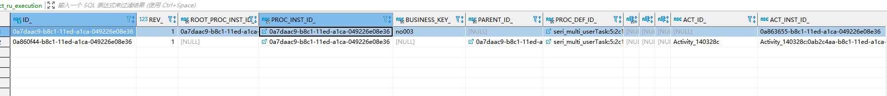

## 引擎启动

### camunda-springboot启动

camunda-bpm-spring-boot-starter启动包中的spring.factories的文件spi机制，初始化AutoConfigurations配置

```
# AutoConfigurations
org.springframework.boot.autoconfigure.EnableAutoConfiguration=org.camunda.bpm.spring.boot.starter.CamundaBpmAutoConfiguration

# Application Listeners
org.springframework.context.ApplicationListener=org.camunda.bpm.spring.boot.starter.runlistener.PropertiesListener
```

#### CamundaBpmAutoConfiguration

```
@EnableConfigurationProperties({
  CamundaBpmProperties.class,
  ManagementProperties.class
})
@Import({
  CamundaBpmConfiguration.class,
  CamundaBpmActuatorConfiguration.class,
  CamundaBpmPluginConfiguration.class,
  CamundaBpmTelemetryConfiguration.class,
  SpringProcessEngineServicesConfiguration.class
})
@Configuration
@ConditionalOnProperty(prefix = CamundaBpmProperties.PREFIX, name = "enabled", matchIfMissing = true)
@AutoConfigureAfter(HibernateJpaAutoConfiguration.class)
public class CamundaBpmAutoConfiguration {

  @SuppressWarnings("SpringJavaInjectionPointsAutowiringInspection")
  @Configuration
  class ProcessEngineConfigurationImplDependingConfiguration {

    @Autowired
    protected ProcessEngineConfigurationImpl processEngineConfigurationImpl;

    @Bean
    public ProcessEngineFactoryBean processEngineFactoryBean() {
      final ProcessEngineFactoryBean factoryBean = new ProcessEngineFactoryBean();
      factoryBean.setProcessEngineConfiguration(processEngineConfigurationImpl);

      return factoryBean;
    }

    @Bean
    @Primary
    public CommandExecutor commandExecutorTxRequired() {
      return processEngineConfigurationImpl.getCommandExecutorTxRequired();
    }

    @Bean
    public CommandExecutor commandExecutorTxRequiresNew() {
      return processEngineConfigurationImpl.getCommandExecutorTxRequiresNew();
    }

    @Bean
    public CommandExecutor commandExecutorSchemaOperations() {
      return processEngineConfigurationImpl.getCommandExecutorSchemaOperations();
    }
  }

  @Bean
  public CamundaBpmVersion camundaBpmVersion() {
    return new CamundaBpmVersion();
  }

  @Bean
  public ProcessApplicationEventPublisher processApplicationEventPublisher(ApplicationEventPublisher publisher) {
    return new ProcessApplicationEventPublisher(publisher);
  }

}
```

#### CamundaBpmProperties

camunda相关的属性会为被注入

#### ProcessEngineConfigurationImpl

```
@Bean
@ConditionalOnMissingBean(ProcessEngineConfigurationImpl.class)
public ProcessEngineConfigurationImpl processEngineConfigurationImpl(List<ProcessEnginePlugin> processEnginePlugins) {
  final SpringProcessEngineConfiguration configuration = CamundaSpringBootUtil.springProcessEngineConfiguration();
  configuration.getProcessEnginePlugins().add(new CompositeProcessEnginePlugin(processEnginePlugins));
  return configuration;
}
```

这里主要是创建CamundaSpringBootUtil.springProcessEngineConfiguration()

这个是流程引擎的核心类

ProcessEngineConfiguration是流程引擎的一个配置类，里面包含了流程引擎配置的大量参数

这里会将所有的processEnginePlugins放入到configuration之中

### 插件体系

## 部署流程

### 部署主流程

```
commandExecutor.execute(new DeployCmd(deploymentBuilder));
```

非常常见的命令模式的使用

#### 部署入口

实际上最终会调用DeployCmd的execute方法，看看DeployCmd.java

```
protected DeploymentWithDefinitions doExecute(final CommandContext commandContext) {
    DeploymentManager deploymentManager = commandContext.getDeploymentManager();

    // load deployment handler
    ProcessEngine processEngine = commandContext.getProcessEngineConfiguration().getProcessEngine();
    deploymentHandler = commandContext.getProcessEngineConfiguration()
        .getDeploymentHandlerFactory()
        .buildDeploymentHandler(processEngine);
 	。。。。。。。。。。。。
 	
    // set deployment name if it should retrieved from an existing deployment
    String nameFromDeployment = deploymentBuilder.getNameFromDeployment();
    setDeploymentName(nameFromDeployment, deploymentBuilder, commandContext);

    // get resources to re-deploy
    List<ResourceEntity> resources = getResources(deploymentBuilder, commandContext);
    // .. and add them the builder
  	//
  	
  	
    // perform deployment
  
    // save initial deployment resources before they are replaced with only the 

   	。。。。
    createUserOperationLog(deploymentBuilder, deployment, commandContext);
	。。。。
	
    return deployment;
  }
```

#### 常规处理

上面的代码会部署去重、插入缓存、部署设定、实际部署、触发ENTITY_INITIALIZED等操作

但是最终其中核心的代码在于：

```
   deploy(commandContext, deploymentToRegister);
```

#### 数据库插入

DeploymentManager的deploy方法。查看DeploymentManager.java：

```
protected void deploy(CommandContext commandContext, DeploymentEntity deployment) {
    deployment.setNew(true);
  commandContext.getDeploymentManager().insertDeployment(deployment);
  }
```

```
  public void insertDeployment(DeploymentEntity deployment) {
    getDbEntityManager().insert(deployment);
    createDefaultAuthorizations(deployment);

    for (ResourceEntity resource : deployment.getResources().values()) {
      resource.setDeploymentId(deployment.getId());
      resource.setType(ResourceTypes.REPOSITORY.getValue());
      resource.setCreateTime(ClockUtil.getCurrentTime());
      getResourceManager().insertResource(resource);
    }

//deploy会解析bpmn元素
    Context
      .getProcessEngineConfiguration()
      .getDeploymentCache()
      .deploy(deployment);
  }
```

#### bpmn元素解析

```
  public void deploy(final DeploymentEntity deployment) {
    Context.getCommandContext().runWithoutAuthorization(new Callable<Void>() {
      public Void call() throws Exception {
        for (Deployer deployer : deployers) {
          deployer.deploy(deployment);
        }
        return null;
      }
    });
  }
```

```
  public void deploy(DeploymentEntity deployment) {
    LOG.debugProcessingDeployment(deployment.getName());
    Properties properties = new Properties();
    List<DefinitionEntity> definitions = parseDefinitionResources(deployment, properties);
    ensureNoDuplicateDefinitionKeys(definitions);
    postProcessDefinitions(deployment, definitions, properties);
  }
```

会将二进制资源进行解析

```
  @Override
  protected List<ProcessDefinitionEntity> transformDefinitions(DeploymentEntity deployment, ResourceEntity resource, Properties properties) {
    byte[] bytes = resource.getBytes();
    ByteArrayInputStream inputStream = new ByteArrayInputStream(bytes);

    BpmnParse bpmnParse = bpmnParser
        .createParse()
        .sourceInputStream(inputStream)
        .deployment(deployment)
        .name(resource.getName());

    if (!deployment.isValidatingSchema()) {
      bpmnParse.setSchemaResource(null);
    }

    bpmnParse.execute();

    if (!properties.contains(JOB_DECLARATIONS_PROPERTY)) {
      properties.set(JOB_DECLARATIONS_PROPERTY, new HashMap<String, List<JobDeclaration<?, ?>>>());
    }
    properties.get(JOB_DECLARATIONS_PROPERTY).putAll(bpmnParse.getJobDeclarations());

    return bpmnParse.getProcessDefinitions();
  }
```

其中 bpmnParse.execute()就是解析BPMN相关的代码
下图是activity的解析器流程图，和camunda类似

 

上图是activity从流程文档解析到bpmnModel过程的简化过程。其中只列出了Process元素相关的解析，其实还有调用document、association/subProcess等元素的解析器，与Process元素类似。总体思路就是先新建一个BpmnModel，然后解析流程文档的外围元素和通用元素并添加到BpmnModel，再之后解析事件、活动、网关等元素添加到BpmnModel，最后返回BpmnModel。

#### 流程定义解析

camunda的解析过程：

```
  protected void parseRootElement() {
    collectElementIds();
    parseDefinitionsAttributes();
    parseImports();
    parseMessages();
    parseSignals();
    parseErrors();
    parseEscalations();
    parseProcessDefinitions();
    parseCollaboration();

    // Diagram interchange parsing must be after parseProcessDefinitions,
    // since it depends and sets values on existing process definition objects
    parseDiagramInterchangeElements();

    for (BpmnParseListener parseListener : parseListeners) {
      parseListener.parseRootElement(rootElement, getProcessDefinitions());
    }
  }
```

解析流程定义的核心为：

```
public void parseProcessDefinitions() {
  for (Element processElement : rootElement.elements("process")) {
    boolean isExecutable = !deployment.isNew();
    String isExecutableStr = processElement.attribute("isExecutable");
    if (isExecutableStr != null) {
      isExecutable = Boolean.parseBoolean(isExecutableStr);
      if (!isExecutable) {
        LOG.ignoringNonExecutableProcess(processElement.attribute("id"));
      }
    } else {
      LOG.missingIsExecutableAttribute(processElement.attribute("id"));
    }

    // Only process executable processes
    if (isExecutable) {
      processDefinitions.add(parseProcess(processElement));
    }
  }
}
```

ProcessDefinitionEntity是一个大的实例，包含解析出来bpmn的各个元素

#### activity解析

 

在解析ProcessDefinitionEntity时，会将bpmn中的元素解析程camunda所需要的对象

比如用户任务就会解析成activity

```
 parseScope(processElement, processDefinition);
```

 

每一个元素都会解析parseActivity实体

```
public void parseActivities(List<Element> activityElements, Element parentElement, ScopeImpl scopeElement) {
  for (Element activityElement : activityElements) {
    parseActivity(activityElement, parentElement, scopeElement);
  }
}
```

根据标签名称调用不同的方法：

 

其中还会设置UserTaskActivityBehavior

```
public ActivityImpl parseUserTask(Element userTaskElement, ScopeImpl scope) {
  ActivityImpl activity = createActivityOnScope(userTaskElement, scope);

  parseAsynchronousContinuationForActivity(userTaskElement, activity);

  TaskDefinition taskDefinition = parseTaskDefinition(userTaskElement, activity.getId(), activity, (ProcessDefinitionEntity) scope.getProcessDefinition());
  TaskDecorator taskDecorator = new TaskDecorator(taskDefinition, expressionManager);

  UserTaskActivityBehavior userTaskActivity = new UserTaskActivityBehavior(taskDecorator);
  activity.setActivityBehavior(userTaskActivity);

  parseProperties(userTaskElement, activity);
  parseExecutionListenersOnScope(userTaskElement, activity);

  for (BpmnParseListener parseListener : parseListeners) {
    parseListener.parseUserTask(userTaskElement, scope, activity);
  }
  return activity;
}
```

多实例任务的解析会有不同如下：

```
  public ScopeImpl parseMultiInstanceLoopCharacteristics(Element activityElement, ScopeImpl scope) {

    Element miLoopCharacteristics = activityElement.element("multiInstanceLoopCharacteristics");
    if (miLoopCharacteristics == null) {
```

会解析loopCardinality、completionCondition、collection、loopDataInputRef、elementVariable

然后设置createInstances(execution, nrOfInstances);

会获取一个acitviImpl

```
public ActivityImpl getInnerActivity(PvmActivity miBodyActivity) {
  for (PvmActivity activity : miBodyActivity.getActivities()) {
    ActivityImpl innerActivity = (ActivityImpl) activity;
    // note that miBody can contains also a compensation handler
    if (!innerActivity.isCompensationHandler()) {
      return innerActivity;
    }
  }
  throw new ProcessEngineException("inner activity of multi instance body activity '" + miBodyActivity.getId() + "' not found");
}
```

注意这里会校验是否为补偿hander：

```
protected boolean isCompensationHandler(Element activityElement) {
  String isForCompensation = activityElement.attribute("isForCompensation");
  return isForCompensation != null && isForCompensation.equalsIgnoreCase(TRUE);
}
```

如果是个补偿hander则获取为空。

### 对象解析器

在configaction初始化的时候会执行initDeployers

```
protected void initDeployers() {
  if (this.deployers == null) {
    this.deployers = new ArrayList<>();
    if (customPreDeployers != null) {
      this.deployers.addAll(customPreDeployers);
    }
    this.deployers.addAll(getDefaultDeployers());
    if (customPostDeployers != null) {
      this.deployers.addAll(customPostDeployers);
    }
  }
  if (deploymentCache == null) {
    List<Deployer> deployers = new ArrayList<>();
    if (customPreDeployers != null) {
      deployers.addAll(customPreDeployers);
    }
    deployers.addAll(getDefaultDeployers());
    if (customPostDeployers != null) {
      deployers.addAll(customPostDeployers);
    }

    initCacheFactory();
    deploymentCache = new DeploymentCache(cacheFactory, cacheCapacity);
    deploymentCache.setDeployers(deployers);
  }
}
```

这里会添加自定义前置对象解析器、默认对象解析器和后置对象解析器

getDefaultDeployers会会设置一些监听器

```
protected BpmnDeployer getBpmnDeployer() {
  BpmnDeployer bpmnDeployer = new BpmnDeployer();
  bpmnDeployer.setExpressionManager(expressionManager);
  bpmnDeployer.setIdGenerator(idGenerator);

  if (bpmnParseFactory == null) {
    bpmnParseFactory = new DefaultBpmnParseFactory();
  }

  BpmnParser bpmnParser = new BpmnParser(expressionManager, bpmnParseFactory);

  if (preParseListeners != null) {
    bpmnParser.getParseListeners().addAll(preParseListeners);
  }
  bpmnParser.getParseListeners().addAll(getDefaultBPMNParseListeners());
  if (postParseListeners != null) {
    bpmnParser.getParseListeners().addAll(postParseListeners);
  }

  bpmnDeployer.setBpmnParser(bpmnParser);

  return bpmnDeployer;
}
```

这里的BpmnParser会进行解析activity、连线等部署相关的元素的解析工作。

### 数据表

当部署一个流程后涉及的表为：

act_ge_bytearray
act_re_deployment
act_re_procdef

## 全局监听器

基于spring的事件监听器

org.camunda.bpm.spring.boot.starter.event.EventPublisherPlugin的preInit方法会进行添加全局监听器的包装类

```
  public void preInit(SpringProcessEngineConfiguration processEngineConfiguration) {
    	processEngineConfiguration.getCustomPostBPMNParseListeners().add(new PublishDelegateParseListener(this.publisher, property));
    	}
```

PublishDelegateParseListener会创建camunda的匿名监听器，监听器会发布spring事件

```
public PublishDelegateParseListener(final ApplicationEventPublisher publisher, final EventingProperty property) {

  if (property.isTask()) {//task的开关打开
    this.taskListener = delegateTask -> {//创建一个匿名的camunda的监听类，这个监听器会使用spring的event机制发布事件
      publisher.publishEvent(delegateTask);
      publisher.publishEvent(new TaskEvent(delegateTask));
    };
  } else {
    this.taskListener = null;
  }

  if (property.isExecution()) {//Execution的开关打开
    this.executionListener = delegateExecution -> {
      publisher.publishEvent(delegateExecution);
      publisher.publishEvent(new ExecutionEvent(delegateExecution));
    };
  } else {
    this.executionListener = null;
  }
}
```

而这个PublishDelegateParseListener监听器会被添加到camunda配置类的getCustomPostBPMNParseListeners

processEngineConfiguration.getCustomPostBPMNParseListeners().add(new PublishDelegateParseListener(this.publisher, property));

而这个监听器又会被转移到了bpmnParser的parseListeners监听器之中

 

当进行bpmn转化ActivityImpl时，会执行这个parseListener.parseUserTask(userTaskElement, scope, activity);

 

这个方法内部会添加各种事件对应的监听器,比如创建、完成事件名称。后序的任务的流转事件的变化执行这些监听器。

```
  private void addTaskListener(TaskDefinition taskDefinition) {
    if (taskListener != null) {
      for (String event : TASK_EVENTS) {
        taskDefinition.addTaskListener(event, taskListener);
      }
    }
  }
```


## 流程虚拟机

### 整体架构

前面在部署时会解析bpmn2.0数据，生成相关的流程定义对下个，其中包括TransitionImpl（连线）、ActivityImpl（元素），然后执行其行为，如此类推

 

#### PvmProcessElement

这个是顶级类

```
public interface PvmProcessElement extends Serializable {

  /**
   * The id of the element
   * @return the id
   */
  String getId();

  /**
   * The process definition scope, root of the scope hierarchy.
   * @return
   */
  PvmProcessDefinition getProcessDefinition();

  Object getProperty(String name);

  /**
   * Returns the properties of the element.
   *
   * @return the properties
   */
  Properties getProperties();
}
```

PvmProcessElement接口是最顶层的接口。通过上述声明的方法可以看到，对于每个ActivityImpl和TransitionImpl，我们都可以getId方法获取其id，通过getProcessDefinition方法获取其所在流程的流程定义，通过getProperty获取其属性

他有两大子接口

#### PvmScope

ScopeImpl是一个比较重要的类，**ProcessDefinitionImpl和ActivityImpl都继承了它，即活动和流程定义都会用到它的方法**。代码省略了很多。这个类的属性和方法大多涉及到Process这个元素。activities属性表示它包含的所有ActivityImpl，例如表示Process下有多少活动。namedActivities属性是用于通过id找到对应ActivityImpl的Map，与findActivity方法相关，那么就可以通过activityId找到找到流程定义中的任一活动。executionListeners是执行监听器的集合。ioSpecification属性与流程文档的DataInput、DataOutput相关。其中findActivity是我所说的“中层”api常会用到方法

```
public abstract class ScopeImpl extends CoreActivity implements PvmScope {

  private static final long serialVersionUID = 1L;

  protected boolean isSubProcessScope = false;

  /** The activities for which the flow scope is this scope  */
  protected List<ActivityImpl> flowActivities = new ArrayList<ActivityImpl>();
  protected Map<String, ActivityImpl> namedFlowActivities = new HashMap<String, ActivityImpl>();

  /** activities for which this is the event scope **/
  protected Set<ActivityImpl> eventActivities = new HashSet<ActivityImpl>();

  protected ProcessDefinitionImpl processDefinition;

  public ScopeImpl(String id, ProcessDefinitionImpl processDefinition) {
    super(id);
    this.processDefinition = processDefinition;
  }
```

#### TransitionImpl

```
public class TransitionImpl extends CoreModelElement implements PvmTransition {

  private static final long serialVersionUID = 1L;

  protected ActivityImpl source;
  protected ActivityImpl destination;

  protected ProcessDefinitionImpl processDefinition;

  /** Graphical information: a list of waypoints: x1, y1, x2, y2, x3, y3, .. */
  protected List<Integer> waypoints = new ArrayList<Integer>();
```

source属性为连线的起始节点，destination为连线的终止节点。executionListeners为执行监听器集合。skipExpression为自动跳过表达式。


#### ProcessDefinitionImpl

```

public class ProcessDefinitionImpl extends ScopeImpl implements PvmProcessDefinition {
 
  protected String name;
  protected String key;
  protected String description;
  protected ActivityImpl initial;
  protected Map<ActivityImpl, List<ActivityImpl>> initialActivityStacks = new HashMap<ActivityImpl, List<ActivityImpl>>();
  protected List<LaneSet> laneSets;
  protected ParticipantProcess participantProcess;
 
  public ProcessDefinitionImpl(String id) {
    super(id, null);
    processDefinition = this;
  }
 
  public PvmProcessInstance createProcessInstance() {
    if(initial == null) {
      throw new ActivitiException("Process '"+name+"' has no default start activity (e.g. none start event), hence you cannot use 'startProcessInstanceBy...' but have to start it using one of the modeled start events (e.g. message start events).");
    }
    return createProcessInstanceForInitial(initial);
  }
 
  public PvmProcessInstance createProcessInstanceForInitial(ActivityImpl initial) {
    //......
  }
  
  public synchronized List<ActivityImpl> getInitialActivityStack(ActivityImpl startActivity) {
    //......
  }
 
  //......

```

ProcessDefinitionImpl类中initial属性代表流程起始的活动，通常对应流程的startEvent。createProcessInstanceForInitial是启动流程时调用的方法。

#### ActivityImpl

```
public class ActivityImpl extends ScopeImpl implements PvmActivity, HasDIBounds {

  private static final long serialVersionUID = 1L;

  protected List<TransitionImpl> outgoingTransitions = new ArrayList<TransitionImpl>();
  protected Map<String, TransitionImpl> namedOutgoingTransitions = new HashMap<String, TransitionImpl>();
  protected List<TransitionImpl> incomingTransitions = new ArrayList<TransitionImpl>();

  /** the inner behavior of an activity. For activities which are flow scopes,
   * this must be a CompositeActivityBehavior. */
  protected ActivityBehavior activityBehavior;

  /** The start behavior for this activity. */
  protected ActivityStartBehavior activityStartBehavior = ActivityStartBehavior.DEFAULT;

  protected ScopeImpl eventScope;
  protected ScopeImpl flowScope;

  protected boolean isScope = false;

  protected boolean isAsyncBefore;
  protected boolean isAsyncAfter;
```

outgoingTransitions属性为从这个活动节点出去的线的集合，即“出线”的集合。namedOutgoingTransitions为一个根据“出线”的id为key、“出线”为value的map对象，方便快速找出对应“出线”。incomingTransitions为“进线”的集合。activityBehavior属性代表这个活动对应的“行为”。即流程运行到改节点时，节点会做什么，当用户调用某些方法时，节点又会进行什么处理。“行为”是activiti节点的核心。另外通过上面createOutgoingTransition、findOutgoingTransition方法可以看出，连线的对象是通过ActivityImpl进行创建的


### 流程启动

流程虚拟机的调用非常繁琐，总结起来，首先客户端调用启动流程的命令类，接着创建执行实体类ExecutionEntity并调用其start方法开始启动，然后通过原子类调用执行监听器，之后调用流程的起点startEvent的活动类，最后活动类的处理方法是找到startEvent对应的ActivityImpl上的“出现”，并从全部“出现”离开。

#### 启动命令

首先通过传入的参数获取部署时生成的流程定义，通过流程定义生成执行实体类，并且设置流程变量，该ExecutionEntity即对应数据库ACT_RU_EXECUTION表。第10步通过原子操作类开始流程虚拟机的运转。

从RuntimeService调用startProcessInstanceById，执行StartProcessInstanceCmd的execution方法开始。

```
  public ProcessInstance startProcessInstanceByKey(String processDefinitionKey) {
    return createProcessInstanceByKey(processDefinitionKey)
        .execute();
  }
```

```
public ProcessInstanceWithVariables executeWithVariablesInReturn(boolean skipCustomListeners, boolean skipIoMappings) {
  ensureOnlyOneNotNull("either process definition id or key must be set", processDefinitionId, processDefinitionKey);

	............

  Command<ProcessInstanceWithVariables> command;

	.................
	
    // start at the default start activity
    command = new StartProcessInstanceCmd(this);

	...............

  return commandExecutor.execute(command);
}
```

核心启动流程：

```
 public ProcessInstanceWithVariables execute(CommandContext commandContext) {

    ProcessDefinitionEntity processDefinition = new GetDeployedProcessDefinitionCmd(instantiationBuilder, false).execute(commandContext);

    for(CommandChecker checker : commandContext.getProcessEngineConfiguration().getCommandCheckers()) {
      checker.checkCreateProcessInstance(processDefinition);
    }

    // Start the process instance
    ExecutionEntity processInstance = processDefinition.createProcessInstance(instantiationBuilder.getBusinessKey(),
        instantiationBuilder.getCaseInstanceId());

    if (instantiationBuilder.getTenantId() != null) {
      processInstance.setTenantId(instantiationBuilder.getTenantId());
    }

    final ExecutionVariableSnapshotObserver variablesListener = new ExecutionVariableSnapshotObserver(processInstance);

    processInstance.start(instantiationBuilder.getVariables());

    commandContext.getOperationLogManager().logProcessInstanceOperation(
        UserOperationLogEntry.OPERATION_TYPE_CREATE,
        processInstance.getId(),
        processInstance.getProcessDefinitionId(),
        processInstance.getProcessDefinition().getKey(),
        Collections.singletonList(PropertyChange.EMPTY_CHANGE));

    return new ProcessInstanceWithVariablesImpl(processInstance, variablesListener.getVariables());
  }
```

* 根据流程定义id获取部署流程图时生成的流程定义

* 创建执行实体类

* 执行实体类设置流程变量

* 执行实体类。

  processInstance.start(instantiationBuilder.getVariables());

如何创建执行实体类呢？

注意这里是ProcessDefinitionEntity

```
public PvmProcessInstance createProcessInstance(String businessKey, String caseInstanceId) {
  ensureDefaultInitialExists();
  return createProcessInstance(businessKey, caseInstanceId, this.initial);
}
```

这个initial是有值的，为在start元素的activityimpl实现

```
public ExecutionEntity createProcessInstance(String businessKey, String caseInstanceId, ActivityImpl initial) {
    ensureNotSuspended();

    ExecutionEntity processInstance = (ExecutionEntity) createProcessInstanceForInitial(initial);

    // do not reset executions (CAM-2557)!
    // processInstance.setExecutions(new ArrayList<ExecutionEntity>());

    processInstance.setProcessDefinition(processDefinition);

    // Do not initialize variable map (let it happen lazily)

    // reset the process instance in order to have the db-generated process instance id available
    processInstance.setProcessInstance(processInstance);

    // initialize business key
    if (businessKey != null) {
      processInstance.setBusinessKey(businessKey);
    }

    // initialize case instance id
    if (caseInstanceId != null) {
      processInstance.setCaseInstanceId(caseInstanceId);
    }

    if(tenantId != null) {
      processInstance.setTenantId(tenantId);
    }

    return processInstance;
  }
```

如果流程开始不存在startEvent那么流程就无法开始了，只能抛出异常。用到了多态，实际上调用的是ProcessDefinitionEntity的newProcessInstance方法创建ExecutionEntity，而不是调用ProcessDefinitionImpl的newProcessInstance创建ExecutionImpl。

```
  protected static ExecutionEntity createNewExecution() {
    ExecutionEntity newExecution = new ExecutionEntity();
    initializeAssociations(newExecution);
    newExecution.insert();

    return newExecution;
  }
```

创建好了executionentity后，作为PvmExecutionImpl

```
public PvmProcessInstance createProcessInstanceForInitial(ActivityImpl initial) {
  ensureNotNull("Cannot start process instance, initial activity where the process instance should start is null", "initial", initial);

  PvmExecutionImpl processInstance = newProcessInstance();

  processInstance.setStarting(true);
  processInstance.setProcessDefinition(this);

  processInstance.setProcessInstance(processInstance);

  // always set the process instance to the initial activity, no matter how deeply it is nested;
  // this is required for firing history events (cf start activity) and persisting the initial activity
  // on async start
  processInstance.setActivity(initial);

  return processInstance;
}
```

其中processInstance.setActivity(initial)

到此为止，上面一系列的操作成功创建了执行实体类，并设置了当前活动为startEvent。下一步的工作是通过原子操作类使流程虚拟机运转起来，并执行startEvent的“行为

在StartProcessInstanceCmd的execution最后，代码执行processInstance.start()启动流程实例，此时跳到ExecutionEntity的start方法

```
protected void start(Map<String, Object> variables, VariableMap formProperties) {

  initialize();

  fireHistoricProcessStartEvent();

  if (variables != null) {
    setVariables(variables);
  }

  if (formProperties != null) {
    FormPropertyHelper.initFormPropertiesOnScope(formProperties, this);
  }

  initializeTimerDeclarations();

  performOperation(PvmAtomicOperation.PROCESS_START);
}
```

参数是AtomicOperation.PROCESS_START，这属于原子类操作。

流程文档里面设置的，判断是异步执行还是同步执行，这里我们先按同步执行去跟踪。紧接着调用CommandContext的performOperation方法。

这里是调用executionEntity的调用方法

```
  public void start(Map<String, Object> variables, VariableMap formProperties) {
    if (getSuperExecution() == null) {
      setRootProcessInstanceId(processInstanceId);
    } else {
      ExecutionEntity superExecution = getSuperExecution();
   setRootProcessInstanceId(superExecution.getRootProcessInstanceId());
    }

    // determine tenant Id if null
    provideTenantId(variables, formProperties);
    super.start(variables, formProperties);
  }
```

```
protected void start(Map<String, Object> variables, VariableMap formProperties) {

  initialize();

  fireHistoricProcessStartEvent();

  if (variables != null) {
    setVariables(variables);
  }

  if (formProperties != null) {
    FormPropertyHelper.initFormPropertiesOnScope(formProperties, this);
  }

  initializeTimerDeclarations();

  performOperation(PvmAtomicOperation.PROCESS_START);
}
```

currentOperation.execute实际调用AbstractEventAtomicOperation的execute方法

```
public void performOperation(AtomicOperation executionOperation) {
  boolean async = !isIgnoreAsync() && executionOperation.isAsync(this);

  if (!async && requiresUnsuspendedExecution(executionOperation)) {
    ensureNotSuspended();
  }

  Context
    .getCommandInvocationContext()
    .performOperation(executionOperation, this, async);
}
```

```
protected void invokeNext() {
  AtomicOperationInvocation invocation = queuedInvocations.remove(0);
  try {
    invocation.execute(bpmnStackTrace, processDataContext);
  } catch(RuntimeException e) {
    // log bpmn stacktrace
    bpmnStackTrace.printStackTrace(Context.getProcessEngineConfiguration().isBpmnStacktraceVerbose());
    // rethrow
    throw e;
  }
}
```

这里最终会指向调用原子类

#### 原子类调用

 

其中PROCESS_START、PROCESS_START_INITIAL、ACTIVITY_START等等这些便是一个一个的原子类操作

CommandContext的performOperation方法调用，最终我们会调用AbstractEventAtomicOperation的execute方法，调用链的顺序为：

AtomicOperationInvocation -》AbstractEventAtomicOperation（execute）

```
public void execute(T execution) {
  CoreModelElement scope = getScope(execution);
  List<DelegateListener<? extends BaseDelegateExecution>> listeners = getListeners(scope, execution);
  int listenerIndex = execution.getListenerIndex();

  if(listenerIndex == 0) {
    execution = eventNotificationsStarted(execution);
  }

  if(!isSkipNotifyListeners(execution)) {

    if (listeners.size()>listenerIndex) {
      execution.setEventName(getEventName());
      execution.setEventSource(scope);
      DelegateListener<? extends BaseDelegateExecution> listener = listeners.get(listenerIndex);
      execution.setListenerIndex(listenerIndex+1);

      try {
        execution.invokeListener(listener);
      } catch (Exception ex) {
        eventNotificationsFailed(execution, ex);
        // do not continue listener invocation once a listener has failed
        return;
      }

      execution.performOperationSync(this);
    } else {
      resetListeners(execution);

      eventNotificationsCompleted(execution);
    }

  } else {
    eventNotificationsCompleted(execution);

  }
}
```

这个函数主要是用于调用执行监听器的。每次调用，会触发一个执行监听器：

* 获取当前process的执行监听器集合

* 获取当前执行的序号

* 如果当前的序号大于执行监听器集合个数，即所有执行监听器已执行完毕

* 通过序号获取对应的执行监听器

* 触发执行监听器

* 执行监听器的序号加1，

* 执行ExecutionEntity的performOperation方法

  那又回到了我们流程实例启动时的调用。

  这样循环逐个调用执行监听器。当执行监听器都处理完毕之后，

  eventNotificationsCompleted方法，由于多态的原因，这里会根据流程实例启动时ExecutionEntity的start方法中的performOperation(AtomicOperation.PROCESS_START)的参数，即调用AtomicOperationProcessStart的eventNotificationsCompleted方法

```
  execution.continueIfExecutionDoesNotAffectNextOperation(new Callback<PvmExecutionImpl, Void>() {
    @Override
    public Void callback(PvmExecutionImpl execution) {
      execution.dispatchEvent(null);
      return null;
    }
  }, new Callback<PvmExecutionImpl, Void>() {
    @Override
    public Void callback(PvmExecutionImpl execution) {

      execution.setIgnoreAsync(true);
      execution.performOperation(ACTIVITY_START_CREATE_SCOPE);

      return null;
    }
  }, execution);

}
```

这里eventNotificationsCompleted的作用很简单

设置了全局事件转发器，则进行对应的事件转发

获取并设置execution当前的活动，当前的活动是startEvent。

然后执行execution.performOperation，其调用的过程与流程启动时调用performOperation(AtomicOperation.PROCESS_START)过程类似。

这里最终会调用AtomicOperationProcessStartInitial的eventNotificationsCompleted方法。


我们看看AtomicOperationProcessStartInitial

#### 行为类调用

在对象解析环节，startEvent设置的行为类是EventSubProcessStartEventActivityBehavior->EventSubProcessStartConditionalEventActivityBehavior。行为类控制活动的行为。我们看看startEvent的行为是什么，EventSubProcessStartEventActivityBehavior

```
  @Override
  public void leaveOnSatisfiedCondition(final EventSubscriptionEntity eventSubscription, final VariableEvent variableEvent) {
    PvmExecutionImpl execution = eventSubscription.getExecution();

    if (execution != null && !execution.isEnded() && execution.isScope()
        && conditionalEvent.tryEvaluate(variableEvent, execution)) {
      ActivityImpl activity = eventSubscription.getActivity();
      activity = (ActivityImpl) activity.getFlowScope();
      execution.executeEventHandlerActivity(activity);
    }
  }
```

该行为对应的活动id，也就是startEvent的activityId

流程以从startEvent节点离开

### 流程流转

前面我们们分析一下从开始节点到下一个节点之前虚拟机做了什么。假设起点startEvent的下一个节点是一个普通的userTask。

流程从一般的活动离开，就是通过ExecutionEntity的take方法，然后经历数个原子操作，触发执行监听器和全局事件转发器对应的事件，如果涉及子流程、网关形成的分支流程等，则情况会更复杂一些。最后把该触发的事件都触发完毕之后，把ExecutionEntity当前的活动设置为下一个节点，就此进入下一个节点相关的活动中

在camunda之中，离开一个activity会执行PvmAtomicOperationTransitionDestroyScope原子操作


#### userTask

##### 进入task

该过程为：到执行userTask的行为类，最后客户端调用taskService.complete方法离开userTask的过程

* 会调用AtomicOperationTransitionCreateScope类

* 当前execution调用performOperation(AtomicOperation.TRANSITION_NOTIFY_LISTENER_START)。跟踪AtomicOperationTransitionNotifyListenerStart

  ```
  public class PvmAtomicOperationTransitionNotifyListenerStart extends PvmAtomicOperationActivityInstanceStart {
  
    protected ScopeImpl getScope(PvmExecutionImpl execution) {
      return execution.getActivity();
    }
  
    protected String getEventName() {
      return ExecutionListener.EVENTNAME_START;
    }
  
    protected void eventNotificationsCompleted(PvmExecutionImpl execution) {
  	。。。。。。。。
      super.eventNotificationsCompleted(execution);
  	。。。。。。。。
      TransitionImpl transition = execution.getTransition();
      PvmActivity destination;
      if (transition == null) { 
       。。。。。。。。。。。。。。。
        destination = execution.getActivity();
      } else {
        destination = transition.getDestination();
      }
      execution.setTransition(null);
      execution.setActivity(destination);
  
      if (execution.isProcessInstanceStarting()) {
  	  。。。。。
        execution.setProcessInstanceStarting(false);
      }
  
      execution.dispatchDelayedEventsAndPerformOperation(ACTIVITY_EXECUTE);
    }
  ```

* execution的performOperation调用会触发执行监听器获取AtomicOperationTransitionNotifyListenerStart的getEventName对应的事件，这里是start事件，然后触发执行监听器的start事件

* execution当前的连线，此时连线非空，且destination就是当前的ActivityImpl

* 设置execution当前连线为null

* 设置当前活动为连线终点的活动，为userTask

* execution.performOperation(ACTIVITY_EXECUTE)

* 这里会调用userTask的行为类,原子操作触发全局事件转发器的ACTIVITY_STARTED事件

* 然后调用当前活动的行为类，UserTaskActivityBehavior

##### 执行task

UserTaskActivityBehavior

```
  public void performExecution(ActivityExecution execution) throws Exception {
    TaskEntity task = new TaskEntity((ExecutionEntity) execution);
    task.insert();

    // initialize task properties
    taskDecorator.decorate(task, execution);

    // fire lifecycle events after task is initialized
    task.transitionTo(TaskState.STATE_CREATED);
  }
```

taskDecorator.decorate(task, execution)会设置userTask相关的属性

```
public void decorate(TaskEntity task, VariableScope variableScope) {
  // set the taskDefinition
  task.setTaskDefinition(taskDefinition);

  // name
  initializeTaskName(task, variableScope);
  // description
  initializeTaskDescription(task, variableScope);
  // dueDate
  initializeTaskDueDate(task, variableScope);
  // followUpDate
  initializeTaskFollowUpDate(task, variableScope);
  // priority
  initializeTaskPriority(task, variableScope);
  // assignments
  initializeTaskAssignments(task, variableScope);
}
```

其中重要的就是获取负责人相关的属性,这里会使用el表达式解析

```
  protected void initializeTaskAssignments(TaskEntity task, VariableScope variableScope) {
    // assignee
    initializeTaskAssignee(task, variableScope);
    // candidateUsers
    initializeTaskCandidateUsers(task, variableScope);
    // candidateGroups
    initializeTaskCandidateGroups(task, variableScope);
  }

```


```
public boolean transitionTo(TaskState state) {
  this.lifecycleState = state;

  switch (state) {
    case STATE_CREATED:
      CommandContext commandContext = Context.getCommandContext();
      if (commandContext != null) {
        commandContext.getHistoricTaskInstanceManager().createHistoricTask(this);
      }
      return fireEvent(TaskListener.EVENTNAME_CREATE) && fireAssignmentEvent();
	....................
  }
}
```

以上代码会createHistoricTask插入历史表，并触发相关的事件比如创建、分配任务的执行。

##### 离开task

通常用户是通过调用TaskService.complete方法提交一个userTask，接下来我们跟踪代码是怎么提交并离开userTask，TaskService.complete方法会调用CompleteTaskCmd命令

```
public class CompleteTaskCmd implements Command<VariableMap>, Serializable {
	  public VariableMap execute(CommandContext commandContext) {
	      TaskManager taskManager = commandContext.getTaskManager();
    TaskEntity task = taskManager.findTaskById(taskId);

	........................

    checkCompleteTask(task, commandContext);

    if (variables != null) {
      task.setExecutionVariables(variables);
    }

    ExecutionEntity execution = task.getProcessInstance();
    ExecutionVariableSnapshotObserver variablesListener = null;

    if (returnVariables && execution != null) {
      variablesListener = new ExecutionVariableSnapshotObserver(execution, false, deserializeReturnedVariables);
    }

    completeTask(task);
	  }

}
```

```
public void complete() {

  if (TaskState.STATE_COMPLETED.equals(this.lifecycleState)
      || TaskListener.EVENTNAME_COMPLETE.equals(this.eventName)
      || TaskListener.EVENTNAME_DELETE.equals(this.eventName)) {

    throw LOG.invokeTaskListenerException(new IllegalStateException("invalid task state"));
  }
  // if the task is associated with a case
  // execution then call complete on the
  // associated case execution. The case
  // execution handles the completion of
  // the task.
  if (caseExecutionId != null) {
    getCaseExecution().manualComplete();
    return;
  }

  // in the other case:

  // ensure the the Task is not suspended
  ensureTaskActive();

  // trigger TaskListener.complete event
  final boolean shouldDeleteTask = transitionTo(TaskState.STATE_COMPLETED);

  // shouldn't attempt to delete the task if the COMPLETE Task listener failed,
  // or managed to cancel the Process or Task Instance
  if (shouldDeleteTask)
  {
    // delete the task
    // this method call doesn't invoke additional task listeners
    Context
    .getCommandContext()
    .getTaskManager()
    .deleteTask(this, TaskEntity.DELETE_REASON_COMPLETED, false, skipCustomListeners);

    // if the task is associated with a
    // execution (and not a case execution)
    // and it's still in the same activity
    // then call signal an the associated
    // execution.
    if (executionId !=null) {
      ExecutionEntity execution = getExecution();
      execution.removeTask(this);
      execution.signal(null, null);
    }
  }
}
```

任务监听器complete事件

IdentityLinkEntity，对应act_ru_identityLink表

把assignee设置到IdentityLinkEntity中，这里会检查如果有相同的userId则返回而不会重复插入

触发全局事件转发器的TASK_COMPLETED事件

删除task

execution.signal

```
public void signal(String signalName, Object signalData) {
  if (getActivity() == null) {
    throw new PvmException("cannot signal execution " + this.id + ": it has no current activity");
  }

  SignallableActivityBehavior activityBehavior = (SignallableActivityBehavior) activity.getActivityBehavior();
  try {
    activityBehavior.signal(this, signalName, signalData);
  } catch (RuntimeException e) {
    throw e;
  } catch (Exception e) {
    throw new PvmException("couldn't process signal '" + signalName + "' on activity '" + activity.getId() + "': " + e.getMessage(), e);
  }
}
```

确保execution当前的活动不为空。

获取当前活动的行为类

调用行为类的signal方法。

获取isUserTask是非值，这里显然activityBehavior就是UserTaskActivityBehavior，因此为true，所以不会执行的事件转发。

UserTaskActivityBehavior的signal方法

```
  public void signal(ActivityExecution execution, String signalName, Object signalData) throws Exception {
    leave(execution);
  }
  public void signal(ActivityExecution execution, String signalName, Object signalData) throws Exception {
    leave(execution);
  }
```

最终会执行BpmnActivityBehavior

```
protected void performOutgoingBehavior(ActivityExecution execution,
        boolean checkConditions) {

  LOG.leavingActivity(execution.getActivity().getId());

  String defaultSequenceFlow = (String) execution.getActivity().getProperty("default");
  List<PvmTransition> transitionsToTake = new ArrayList<>();

  List<PvmTransition> outgoingTransitions = execution.getActivity().getOutgoingTransitions();
  for (PvmTransition outgoingTransition : outgoingTransitions) {
    if (defaultSequenceFlow == null || !outgoingTransition.getId().equals(defaultSequenceFlow)) {
      Condition condition = (Condition) outgoingTransition.getProperty(BpmnParse.PROPERTYNAME_CONDITION);
      if (condition == null || !checkConditions || condition.evaluate(execution)) {
        transitionsToTake.add(outgoingTransition);
      }
    }
  }

  if (transitionsToTake.size() == 1) {

    execution.leaveActivityViaTransition(transitionsToTake.get(0));

  } else if (transitionsToTake.size() >= 1) {
    execution.leaveActivityViaTransitions(transitionsToTake, Arrays.asList(execution));
  } else {

    if (defaultSequenceFlow != null) {
      PvmTransition defaultTransition = execution.getActivity().findOutgoingTransition(defaultSequenceFlow);
      if (defaultTransition != null) {
        execution.leaveActivityViaTransition(defaultTransition);
      } else {
        throw LOG.missingDefaultFlowException(execution.getActivity().getId(), defaultSequenceFlow);
      }

    } else if (!outgoingTransitions.isEmpty()) {
      throw LOG.missingConditionalFlowException(execution.getActivity().getId());

    } else {

      if (((ActivityImpl) execution.getActivity()).isCompensationHandler() && isAncestorCompensationThrowing(execution)) {

       execution.endCompensation();

      } else {
        LOG.missingOutgoingSequenceFlow(execution.getActivity().getId());
        execution.end(true);
      }
    }
  }
}
```

获取userTask的“出线”

判断当满足“出线”条件时，把“出线”加入到待离开的连线集合中。

判断若满足跳过节点条件，也加入待离开的连线集合中。若待离开的连线集合数量是1，则执行execution.take离开，否则执行execution.takeAll离开。

关于execution的take和takeAll,前面已经分析过。

### 多实例任务

#### bpm解析

 

解析活动类设置和行为设置

```
 public ScopeImpl parseMultiInstanceLoopCharacteristics(Element activityElement, ScopeImpl scope) {

    Element miLoopCharacteristics = activityElement.element("multiInstanceLoopCharacteristics");
    if (miLoopCharacteristics == null) {
      return null;
    } else {
      String id = activityElement.attribute("id");

      LOG.parsingElement("mi body for activity", id);

      id = getIdForMiBody(id);
      ActivityImpl miBodyScope = scope.createActivity(id);
      setActivityAsyncDelegates(miBodyScope);
      miBodyScope.setProperty(PROPERTYNAME_TYPE, ActivityTypes.MULTI_INSTANCE_BODY);
      miBodyScope.setScope(true);

      boolean isSequential = parseBooleanAttribute(miLoopCharacteristics.attribute("isSequential"), false);

      MultiInstanceActivityBehavior behavior = null;
      if (isSequential) {
        behavior = new SequentialMultiInstanceActivityBehavior();
      } else {
        behavior = new ParallelMultiInstanceActivityBehavior();
      }
      miBodyScope.setActivityBehavior(behavior);

      // loopCardinality
      Element loopCardinality = miLoopCharacteristics.element("loopCardinality");
      if (loopCardinality != null) {
        String loopCardinalityText = loopCardinality.getText();
        if (loopCardinalityText == null || "".equals(loopCardinalityText)) {
          addError("loopCardinality must be defined for a multiInstanceLoopCharacteristics definition ", miLoopCharacteristics, id);
        }
        behavior.setLoopCardinalityExpression(expressionManager.createExpression(loopCardinalityText));
      }

      // completionCondition
      Element completionCondition = miLoopCharacteristics.element("completionCondition");
      if (completionCondition != null) {
        String completionConditionText = completionCondition.getText();
        behavior.setCompletionConditionExpression(expressionManager.createExpression(completionConditionText));
      }

      // activiti:collection
      String collection = miLoopCharacteristics.attributeNS(CAMUNDA_BPMN_EXTENSIONS_NS, "collection");
      if (collection != null) {
        if (collection.contains("{")) {
          behavior.setCollectionExpression(expressionManager.createExpression(collection));
        } else {
          behavior.setCollectionVariable(collection);
        }
      }

      // loopDataInputRef
      Element loopDataInputRef = miLoopCharacteristics.element("loopDataInputRef");
      if (loopDataInputRef != null) {
        String loopDataInputRefText = loopDataInputRef.getText();
        if (loopDataInputRefText != null) {
          if (loopDataInputRefText.contains("{")) {
            behavior.setCollectionExpression(expressionManager.createExpression(loopDataInputRefText));
          } else {
            behavior.setCollectionVariable(loopDataInputRefText);
          }
        }
      }

      // activiti:elementVariable
      String elementVariable = miLoopCharacteristics.attributeNS(CAMUNDA_BPMN_EXTENSIONS_NS, "elementVariable");
      if (elementVariable != null) {
        behavior.setCollectionElementVariable(elementVariable);
      }

      // dataInputItem
      Element inputDataItem = miLoopCharacteristics.element("inputDataItem");
      if (inputDataItem != null) {
        String inputDataItemName = inputDataItem.attribute("name");
        behavior.setCollectionElementVariable(inputDataItemName);
      }

      // Validation
      if (behavior.getLoopCardinalityExpression() == null && behavior.getCollectionExpression() == null && behavior.getCollectionVariable() == null) {
        addError("Either loopCardinality or loopDataInputRef/activiti:collection must been set", miLoopCharacteristics, id);
      }

      // Validation
      if (behavior.getCollectionExpression() == null && behavior.getCollectionVariable() == null && behavior.getCollectionElementVariable() != null) {
        addError("LoopDataInputRef/activiti:collection must be set when using inputDataItem or activiti:elementVariable", miLoopCharacteristics, id);
      }

      for (BpmnParseListener parseListener : parseListeners) {
        parseListener.parseMultiInstanceLoopCharacteristics(activityElement, miLoopCharacteristics, miBodyScope);
      }

      return miBodyScope;
    }
  }
```

主要内容为：解析对象，并为活动类设置行为。

若元素属于多实例任务时，获取loopCardinality属性，即多任务循环次数。

创建的当前ActivityImpl。

若为串行多实例任务则执行创建对应串行多实例行为，否则创建并行多实例行为。

把新建的多实例行为设置为当前活动的行为类。

设置miActivityBehavior各项属性，例如loopcardinality、completionCondition、collection、elementVariable等多实例任务的属性

**最终parseActivity会：**

多实例会返回多实例ScopeImpl对象Activity(Activity_140328c#multiInstanceBody)

然后执行

 

``` 
public ActivityImpl parseUserTask(Element userTaskElement, ScopeImpl scope) {
  ActivityImpl activity = createActivityOnScope(userTaskElement, scope);

  parseAsynchronousContinuationForActivity(userTaskElement, activity);

  TaskDefinition taskDefinition = parseTaskDefinition(userTaskElement, activity.getId(), activity, (ProcessDefinitionEntity) scope.getProcessDefinition());
  TaskDecorator taskDecorator = new TaskDecorator(taskDefinition, expressionManager);

  UserTaskActivityBehavior userTaskActivity = new UserTaskActivityBehavior(taskDecorator);
  activity.setActivityBehavior(userTaskActivity);

  parseProperties(userTaskElement, activity);
  parseExecutionListenersOnScope(userTaskElement, activity);

  for (BpmnParseListener parseListener : parseListeners) {
    parseListener.parseUserTask(userTaskElement, scope, activity);
  }
  return activity;
}
```

注意上面的scop对象已经是多实例对象了

```
public ActivityImpl createActivity(String activityId) {
  ActivityImpl activity = new ActivityImpl(activityId, processDefinition);
  if (activityId!=null) {
    if (processDefinition.findActivity(activityId) != null) {
      throw new PvmException("duplicate activity id '" + activityId + "'");
    }
    if (BACKLOG.containsKey(activityId)) {
      BACKLOG.remove(activityId);
    }
    namedFlowActivities.put(activityId, activity);
  }
  activity.flowScope = this;
  flowActivities.add(activity);

  return  activity;
}
```


**注意actitviyImpl继承了flowScope，即本身就是一个flowScope，他的属性namedFlowActivities是空的，但是它又持有一个FlowScope对象。**

**所以上面的代码中如果是多实例任务创建userTask的activity时，activity.flowScope = this，this为muti的activity，activity为userTask的activity，它的flowScope 指向muti的activity了。这样就会形成一种子任务的关联关系了**

#### muti行为类

当流程进入userTask前，会经过AtomicOperationTransitionCreateScope类

对于一般的userTask，activity.isScope()为false，对于多实例任务，这里的判断为true，会创建一个子execution，并为行为父execution和子execution设置属性。

```
public class PvmAtomicOperationTransitionCreateScope extends PvmAtomicOperationCreateScope {

  public boolean isAsync(PvmExecutionImpl execution) {
    PvmActivity activity = execution.getActivity();
    return activity.isAsyncBefore();
  }

  public String getCanonicalName() {
    return "transition-create-scope";
  }

  protected void scopeCreated(PvmExecutionImpl execution) {
    execution.performOperation(TRANSITION_NOTIFY_LISTENER_START);

  }

  public boolean isAsyncCapable() {
    return true;
  }
}
```

然后会调用其行为类的execute方法，我们看看SequentialMultiInstanceBehavior类的execute方法

```
public class PvmAtomicOperationActivityExecute implements PvmAtomicOperation {
public void execute(PvmExecutionImpl execution) {
  execution.activityInstanceStarted();

  execution.continueIfExecutionDoesNotAffectNextOperation(new Callback<PvmExecutionImpl, Void>() {
    @Override
    public Void callback(PvmExecutionImpl execution) {
      if (execution.getActivity().isScope()) {
        execution.dispatchEvent(null);
      }
      return null;
    }
  }, new Callback<PvmExecutionImpl, Void>() {

    @Override
    public Void callback(PvmExecutionImpl execution) {

      ActivityBehavior activityBehavior = getActivityBehavior(execution);

      ActivityImpl activity = execution.getActivity();
      LOG.debugExecutesActivity(execution, activity, activityBehavior.getClass().getName());

      try {
        activityBehavior.execute(execution);
      } catch (RuntimeException e) {
        throw e;
      } catch (Exception e) {
        throw new PvmException("couldn't execute activity <" + activity.getProperty("type") + " id=\"" + activity.getId() + "\" ...>: " + e.getMessage(), e);
      }
      return null;
    }
  }, execution);
}
```


串行多实例任务为SequentialMultiInstanceActivityBehavior

在执行多实例任务的时候PvmAtomicOperationActivityExecute，这个执行是针对mutiusertask任务的。

```
public void execute(ActivityExecution execution) throws Exception {
  int nrOfInstances = resolveNrOfInstances(execution);
  if (nrOfInstances == 0) {
    leave(execution);
  }
  else if (nrOfInstances < 0) {
    throw LOG.invalidAmountException("instances", nrOfInstances);
  }
  else {
    createInstances(execution, nrOfInstances);
  }
}
```

其中resolveNrOfInstances(execution)会解析activity的属性

执行表达式muti其中相关属性，比如集合，数量等属性

```
protected int resolveNrOfInstances(ActivityExecution execution) {
  int nrOfInstances = -1;
  if (loopCardinalityExpression != null) {
    nrOfInstances = resolveLoopCardinality(execution);
  } else if (collectionExpression != null) {
    Object obj = collectionExpression.getValue(execution);
    if (!(obj instanceof Collection)) {
      throw LOG.unresolvableExpressionException(collectionExpression.getExpressionText(), "Collection");
    }
    nrOfInstances = ((Collection<?>) obj).size();
  } else if (collectionVariable != null) {
    Object obj = execution.getVariable(collectionVariable);
    if (!(obj instanceof Collection)) {
      throw LOG.invalidVariableTypeException(collectionVariable, "Collection");
    }
    nrOfInstances = ((Collection<?>) obj).size();
  } else {
    throw LOG.resolveCollectionExpressionOrVariableReferenceException();
  }
  return nrOfInstances;
}
```


```
protected void createInstances(ActivityExecution execution, int nrOfInstances) throws Exception {

  prepareScope(execution, nrOfInstances);
  setLoopVariable(execution, NUMBER_OF_ACTIVE_INSTANCES, 1);

  ActivityImpl innerActivity = getInnerActivity(execution.getActivity());
  performInstance(execution, innerActivity, 0);
}

public ActivityImpl getInnerActivity(PvmActivity miBodyActivity) {
    for (PvmActivity activity : miBodyActivity.getActivities()) {
      ActivityImpl innerActivity = (ActivityImpl) activity;
      // note that miBody can contains also a compensation handler
      if (!innerActivity.isCompensationHandler()) {
        return innerActivity;
      }
    }
    throw new ProcessEngineException("inner activity of multi instance body activity '" + miBodyActivity.getId() + "' not found");
}

@Override
public ActivityExecution createInnerInstance(ActivityExecution scopeExecution) {

    if (hasLoopVariable(scopeExecution, NUMBER_OF_ACTIVE_INSTANCES) && getLoopVariable(scopeExecution, NUMBER_OF_ACTIVE_INSTANCES) > 0) {
      throw LOG.unsupportedConcurrencyException(scopeExecution.toString(), this.getClass().getSimpleName());
    }
    else {
      int nrOfInstances = getLoopVariable(scopeExecution, NUMBER_OF_INSTANCES);

      setLoopVariable(scopeExecution, LOOP_COUNTER, nrOfInstances);
      setLoopVariable(scopeExecution, NUMBER_OF_INSTANCES, nrOfInstances + 1);
      setLoopVariable(scopeExecution, NUMBER_OF_ACTIVE_INSTANCES, 1);
    }

    return scopeExecution;
  }
```

这个类的初始化会设置一个多实例行为类和一个内部的行为类，例如userTask的行为类。这样当处理完多实例的行为后，再调用原来活动的行为类。MultiInstanceActivityBehavior及其子类就是负责这些事情

 performInstance(execution, innerActivity, 0);会执行获取的activity的类, id其实为#muti

注意此时的innerActivity就是多实例任务的之中UserTask的activity，而不是muti了

```
 public void executeActivity(PvmActivity activity) {
    if (!activity.getIncomingTransitions().isEmpty()) {
      throw new ProcessEngineException("Activity is contained in normal flow and cannot be executed using executeActivity().");
    }

    ActivityStartBehavior activityStartBehavior = activity.getActivityStartBehavior();
    if (!isScope() && ActivityStartBehavior.DEFAULT != activityStartBehavior) {
      throw new ProcessEngineException("Activity '" + activity + "' with start behavior '" + activityStartBehavior + "'"
        + "cannot be executed by non-scope execution.");
    }

    PvmActivity activityImpl = activity;
    this.isEnded = false;
    this.isActive = true;

    switch (activityStartBehavior) {
      case CONCURRENT_IN_FLOW_SCOPE:
        this.nextActivity = activityImpl;
        performOperation(PvmAtomicOperation.ACTIVITY_START_CONCURRENT);
        break;

      case CANCEL_EVENT_SCOPE:
        this.nextActivity = activityImpl;
        performOperation(PvmAtomicOperation.ACTIVITY_START_CANCEL_SCOPE);
        break;

      case INTERRUPT_EVENT_SCOPE:
        this.nextActivity = activityImpl;
        performOperation(PvmAtomicOperation.ACTIVITY_START_INTERRUPT_SCOPE);
        break;

      default:
        setActivity(activityImpl);
        setActivityInstanceId(null);
        performOperation(PvmAtomicOperation.ACTIVITY_START_CREATE_SCOPE);
        break;
    }
  }
```

最后会执行

```
      default:
        setActivity(activityImpl);
        setActivityInstanceId(null);
        performOperation(PvmAtomicOperation.ACTIVITY_START_CREATE_SCOPE);
        break;
```

以上会执行到usertask的行为类

#### userTask创建

这里会最终切换到userTask的acitivy的行为类了

 

这里会进行设置流程分配人等操作了，和之前的类型

#### userTask的完成

会调用这个方法


执行表中串行多实例有两条记录

 

一条时父级执行（它的id为流程实例id），一条为当前的userTask的执行（新生成的id）

首先会根据流程实例id从数据库中查出父级执行，就是上面的第一条

接着执行后序的TaskEntity的方法

```
public void complete() {

  if (TaskState.STATE_COMPLETED.equals(this.lifecycleState)
      || TaskListener.EVENTNAME_COMPLETE.equals(this.eventName)
      || TaskListener.EVENTNAME_DELETE.equals(this.eventName)) {

    throw LOG.invokeTaskListenerException(new IllegalStateException("invalid task state"));
  }
  // if the task is associated with a case
  // execution then call complete on the
  // associated case execution. The case
  // execution handles the completion of
  // the task.
  if (caseExecutionId != null) {
    getCaseExecution().manualComplete();
    return;
  }
  
    // in the other case:

    // ensure the the Task is not suspended
    ensureTaskActive();

    // trigger TaskListener.complete event
    final boolean shouldDeleteTask = transitionTo(TaskState.STATE_COMPLETED);

    // shouldn't attempt to delete the task if the COMPLETE Task listener failed,
    // or managed to cancel the Process or Task Instance
    if (shouldDeleteTask)
    {
      // delete the task
      // this method call doesn't invoke additional task listeners
      Context
      .getCommandContext()
      .getTaskManager()
      .deleteTask(this, TaskEntity.DELETE_REASON_COMPLETED, false, skipCustomListeners);

      // if the task is associated with a
      // execution (and not a case execution)
      // and it's still in the same activity
      // then call signal an the associated
      // execution.
      if (executionId !=null) {
        ExecutionEntity execution = getExecution();
        execution.removeTask(this);
        execution.signal(null, null);
      }
    }
  }
```

其中最为关键的是这个

```
final boolean shouldDeleteTask = transitionTo(TaskState.STATE_COMPLETED);
```

它不仅会执行监听器，还会将execution属性封装成功

```
  public boolean transitionTo(TaskState state) {
    this.lifecycleState = state;

    switch (state) {
      case STATE_CREATED:
        CommandContext commandContext = Context.getCommandContext();
        if (commandContext != null) {
          commandContext.getHistoricTaskInstanceManager().createHistoricTask(this);
        }
        return fireEvent(TaskListener.EVENTNAME_CREATE) && fireAssignmentEvent();

      case STATE_COMPLETED:
        return fireEvent(TaskListener.EVENTNAME_COMPLETE) && TaskState.STATE_COMPLETED.equals(this.lifecycleState);

      case STATE_DELETED:
        return fireEvent(EVENTNAME_DELETE);

      case STATE_INIT:
      default:
        throw new ProcessEngineException(String.format("Task %s cannot transition into state %s.", id, state));
    }
```

taskEntity会实现这个监听器执行如下的方法

```
  protected boolean invokeListener(String taskEventName, TaskListener taskListener) {
    boolean popProcessDataContext = false;
    CommandInvocationContext commandInvocationContext = Context.getCommandInvocationContext();
    CoreExecution execution = getExecution();
    if (execution == null) {
      execution = getCaseExecution();
    } else {
      if (commandInvocationContext != null) {
        popProcessDataContext = commandInvocationContext.getProcessDataContext().pushSection((ExecutionEntity) execution);
      }
    }
    if (execution != null) {
      setEventName(taskEventName);
    }
    try {
      boolean result = invokeListener(execution, taskEventName, taskListener);
      if (popProcessDataContext) {
        commandInvocationContext.getProcessDataContext().popSection();
      }
      return result;
    } catch (Exception e) {
      throw LOG.invokeTaskListenerException(e);
    }
  }
```

会将taskId对应的exectionId对应的执行查出来

最终会执行level

```
public void leave(ActivityExecution execution) {
  ((ExecutionEntity) execution).dispatchDelayedEventsAndPerformOperation(PvmAtomicOperation.ACTIVITY_LEAVE);
}
```

然后会走向

```
PvmAtomicOperationActivityLeave
 public void execute(PvmExecutionImpl execution) {

    execution.activityInstanceDone();

    ActivityBehavior activityBehavior = getActivityBehavior(execution);

    if (activityBehavior instanceof FlowNodeActivityBehavior) {
      FlowNodeActivityBehavior behavior = (FlowNodeActivityBehavior) activityBehavior;

      ActivityImpl activity = execution.getActivity();
      String activityInstanceId = execution.getActivityInstanceId();
      if(activityInstanceId != null) {
        LOG.debugLeavesActivityInstance(execution, activityInstanceId);
      }

      try {
        behavior.doLeave(execution);
      } catch (RuntimeException e) {
        throw e;
      } catch (Exception e) {
        throw new PvmException("couldn't leave activity <"+activity.getProperty("type")+" id=\""+activity.getId()+"\" ...>: "+e.getMessage(), e);
      }
    } else {
      throw new PvmException("Behavior of current activity is not an instance of " + FlowNodeActivityBehavior.class.getSimpleName() + ". Execution " + execution);
    }
  }
```

执行FlowNodeActivityBehavior的父级然后执行出线方法

org.camunda.bpm.engine.impl.bpmn.behavior.BpmnActivityBehavior#performOutgoingBehavior

```
      } else {

        if (((ActivityImpl) execution.getActivity()).isCompensationHandler() && isAncestorCompensationThrowing(execution)) {

         execution.endCompensation();

        } else {
          LOG.missingOutgoingSequenceFlow(execution.getActivity().getId());
          execution.end(true);
        }
      }
```

执行org.camunda.bpm.engine.impl.pvm.runtime.operation.PvmAtomicOperationActivityNotifyListenerEnd

**org.camunda.bpm.engine.impl.pvm.runtime.operation.PvmAtomicOperationActivityEnd**

**会提升exection**

```
public void execute(PvmExecutionImpl execution) {
  // restore activity instance id
  if (execution.getActivityInstanceId() == null) {
    execution.setActivityInstanceId(execution.getParentActivityInstanceId());
  }

  PvmActivity activity = execution.getActivity();
  Map<ScopeImpl, PvmExecutionImpl> activityExecutionMapping = execution.createActivityExecutionMapping();

  PvmExecutionImpl propagatingExecution = execution;

  if(execution.isScope() && activity.isScope()) {
    if (!LegacyBehavior.destroySecondNonScope(execution)) {
      execution.destroy();
      if(!execution.isConcurrent()) {
        execution.remove();
        propagatingExecution = execution.getParent();
        propagatingExecution.setActivity(execution.getActivity());
      }
    }
  }

  propagatingExecution = LegacyBehavior.determinePropagatingExecutionOnEnd(propagatingExecution, activityExecutionMapping);
  PvmScope flowScope = activity.getFlowScope();

  // 1. flow scope = Process Definition
  if(flowScope == activity.getProcessDefinition()) {

    // 1.1 concurrent execution => end + tryPrune()
    if(propagatingExecution.isConcurrent()) {
      propagatingExecution.remove();
      propagatingExecution.getParent().tryPruneLastConcurrentChild();
      propagatingExecution.getParent().forceUpdate();
    }
    else {
      // 1.2 Process End
      propagatingExecution.setEnded(true);
      if (!propagatingExecution.isPreserveScope()) {
        propagatingExecution.performOperation(PROCESS_END);
      }
    }
  }
  else {
    // 2. flowScope != process definition
    PvmActivity flowScopeActivity = (PvmActivity) flowScope;

    ActivityBehavior activityBehavior = flowScopeActivity.getActivityBehavior();
    if (activityBehavior instanceof CompositeActivityBehavior) {
      CompositeActivityBehavior compositeActivityBehavior = (CompositeActivityBehavior) activityBehavior;
      // 2.1 Concurrent execution => composite behavior.concurrentExecutionEnded()
      if(propagatingExecution.isConcurrent() && !LegacyBehavior.isConcurrentScope(propagatingExecution)) {
        compositeActivityBehavior.concurrentChildExecutionEnded(propagatingExecution.getParent(), propagatingExecution);
      }
      else {
        // 2.2 Scope Execution => composite behavior.complete()
        propagatingExecution.setActivity(flowScopeActivity);
        compositeActivityBehavior.complete(propagatingExecution);
      }

    }
    else {
      // activity behavior is not composite => this is unexpected
      throw new ProcessEngineException("Expected behavior of composite scope "+activity
          +" to be a CompositeActivityBehavior but got "+activityBehavior);
    }
  }
}
```


**以上PvmScope flowScope = activity.getFlowScope();是个关键**

* flow scope = Process Definition，说明该行为为主干流程

* flowScope != process definition

  CompositeActivityBehavior，这里获取的是muti的行为类

  * Concurrent execution => composite behavior.concurrentExecutionEnded()

  * Scope Execution => composite behavior.complete()

    执行Muti的行为逻辑，由此回到了muti的行为方法了，compositeActivityBehavior.complete(propagatingExecution);

#### 回到Muti行为

```
public void complete(ActivityExecution scopeExecution) {
  int loopCounter = getLoopVariable(scopeExecution, LOOP_COUNTER) + 1;
  int nrOfInstances = getLoopVariable(scopeExecution, NUMBER_OF_INSTANCES);
  int nrOfCompletedInstances = getLoopVariable(scopeExecution, NUMBER_OF_COMPLETED_INSTANCES) + 1;

  setLoopVariable(scopeExecution, NUMBER_OF_COMPLETED_INSTANCES, nrOfCompletedInstances);

  if (loopCounter == nrOfInstances || completionConditionSatisfied(scopeExecution)) {
    leave(scopeExecution);
  }
  else {
    PvmActivity innerActivity = getInnerActivity(scopeExecution.getActivity());
    performInstance(scopeExecution, innerActivity, loopCounter);
  }
}
```

* 会判断结束条件，满足了会调用level方法离开这个activity

  ```
  public void leave(ActivityExecution execution) {
    ((ExecutionEntity) execution).dispatchDelayedEventsAndPerformOperation(PvmAtomicOperation.ACTIVITY_LEAVE);
  }
  ```

  最终会调用PvmAtomicOperationActivityLeave、SequentialMultiInstanceActivityBehavior的离开方法、FlowNodeActivityBehavior

  然后会调用通用的((ExecutionEntity) execution).dispatchDelayedEventsAndPerformOperation(PvmAtomicOperation.ACTIVITY_LEAVE);

  BpmnActivityBehavior的离开会找到出线，进入下一个节点的执行了

* 否则会继续执行（获取内部的activity，然后执行行为，进入下一个userTask）

```
PvmActivity innerActivity = getInnerActivity(scopeExecution.getActivity());
performInstance(scopeExecution, innerActivity, loopCounter);
```

### 并行网关

## 发起流程

### UserTask

发起一个流程，当流程到了一个userTask后，涉及的表为

监听器变化：

```
全局【执行】监听器onTaskEvent: start， activityName :用户集合节点1， activityId：Activity_140328c
委派方法设置审批人:test129， 执行对象null, 用户集合节点1
获取候选人委派任务执行， 名称 用户集合节点1, 类型null, 自定义属性：{test2=test3, userCeLue=guding}
全局【任务】监听器onTaskEvent: create， name :用户集合节点1
全局【任务】监听器onTaskEvent: assignment， name :用户集合节点1
```

#### act_ge_bytearray:

如果有变量的话，会存储相应的变量序列化数据

存储通用的流程定义和流程资源，保存流程定义图片和xml、Serializable(序列化)的变量,即保存所有二进制数据

#### act_hi_actinst

历史的活动实例表，历史的活动实例表，记录流程流转过的所有节点

| 字段名称                | 字段类型     | 可否为空 | 描述                 |
| :---------------------- | ------------ | -------- | :------------------- |
| ID\_                    | varchar(64)  |          | 主键                 |
| PARENT\_ACT\_INST\_ID\_ | varchar(64)  | NULL     | 父节点实例ID         |
| PROC\_DEF\_KEY\_        | varchar(255) | NULL     | 流程定义KEY          |
| PROC\_DEF\_ID\_         | varchar(64)  |          | 流程定义ID           |
| ROOT\_PROC\_INST\_ID\_  | varchar(64)  | NULL     | 流程实例根ID         |
| PROC\_INST\_ID\_        | varchar(64)  |          | 流程实例ID           |
| EXECUTION\_ID\_         | varchar(64)  |          | 执行实例ID           |
| ACT\_ID\_               | varchar(255) |          | 节点ID               |
| TASK\_ID\_              | varchar(64)  | NULL     | 任务ID               |
| CALL\_PROC\_INST\_ID\_  | varchar(64)  | NULL     | 调用外部的流程实例ID |
| CALL\_CASE\_INST\_ID\_  | varchar(64)  | NULL     | 调用外部的案例实例ID |
| ACT\_NAME\_             | varchar(255) | NULL     | 节点名称             |
| ACT\_TYPE\_             | varchar(255) |          | 节点类型             |
| ASSIGNEE\_              | varchar(64)  | NULL     | 办理人               |
| START\_TIME\_           | datetime     |          | 开始时间             |
| END\_TIME\_             | datetime     | NULL     | 结束时间             |
| DURATION\_              | bigint(20)   | NULL     | 耗时                 |
| ACT\_INST\_STATE\_      | int(11)      | NULL     | 活动实例状态         |
| SEQUENCE\_COUNTER\_     | bigint(20)   | NULL     | 序列计数器           |
| TENANT\_ID\_            | varchar(64)  | NULL     | 租户ID               |
| REMOVAL\_TIME\_         | datetime     | NULL     | 删除时间             |

#### act_hi_detail

历史的流程运行变量详情记录表。流程中产生的变量详细，包括控制流程流转的变量，业务表单中填写的流程需要用到的变量等

其中BYTEARRAY\_ID字段如果是二进制序列化数据会关联act_ge_bytearray表

| 字段名称               | 字段类型      | 可否为空 | 描述             |
| :--------------------- | ------------- | -------- | :--------------- |
| ID\_                   | varchar(64)   |          | 主键             |
| TYPE\_                 | varchar(255)  |          | 类型             |
| PROC\_DEF\_KEY\_       | varchar(255)  | NULL     | 流程定义KEY      |
| PROC\_DEF\_ID\_        | varchar(64)   | NULL     | 流程定义ID       |
| ROOT\_PROC\_INST\_ID\_ | varchar(64)   | NULL     | 流程实例根ID     |
| PROC\_INST\_ID\_       | varchar(64)   | NULL     | 流程实例ID       |
| EXECUTION\_ID\_        | varchar(64)   | NULL     | 流程执行ID       |
| CASE\_DEF\_KEY\_       | varchar(255)  | NULL     | 案例定义KEY      |
| CASE\_DEF\_ID\_        | varchar(64)   | NULL     | 案例定义ID       |
| CASE\_INST\_ID\_       | varchar(64)   | NULL     | 案例实例ID       |
| CASE\_EXECUTION\_ID\_  | varchar(64)   | NULL     | 案例执行ID       |
| TASK\_ID\_             | varchar(64)   | NULL     | 任务ID           |
| ACT\_INST\_ID\_        | varchar(64)   | NULL     | 节点实例ID       |
| VAR\_INST\_ID\_        | varchar(64)   | NULL     | 流程变量记录ID   |
| NAME\_                 | varchar(255)  |          | 名称             |
| VAR\_TYPE\_            | varchar(255)  | NULL     | 变量类型         |
| REV\_                  | int(11)       | NULL     | 版本             |
| TIME\_                 | datetime      |          | 时间戳           |
| BYTEARRAY\_ID\_        | varchar(64)   | NULL     | 二进制数据对应ID |
| DOUBLE\_               | double        | NULL     | double类型值     |
| LONG\_                 | bigint(20)    | NULL     | long类型值       |
| TEXT\_                 | varchar(4000) | NULL     | 文本类型值       |
| TEXT2\_                | varchar(4000) | NULL     | 文本类型值2      |
| SEQUENCE\_COUNTER\_    | bigint(20)    | NULL     | 序列计数器       |
| TENANT\_ID\_           | varchar(64)   | NULL     | 租户ID           |
| OPERATION\_ID\_        | varchar(64)   | NULL     |                  |
| REMOVAL\_TIME\_        | datetime      | NULL     | 移除时间         |

#### act_hi_procinst

历史的流程实例表。

| 字段名称                       | 字段类型      | 可否为空 | 描述         |
| :----------------------------- | ------------- | -------- | :----------- |
| ID\_                           | varchar(64)   |          | 主键         |
| PROC\_INST\_ID\_               | varchar(64)   |          | 流程实例ID   |
| BUSINESS\_KEY\_                | varchar(255)  | NULL     | 业务KEY      |
| PROC\_DEF\_KEY\_               | varchar(255)  | NULL     | 流程定义KEY  |
| PROC\_DEF\_ID\_                | varchar(64)   |          | 流程定义ID   |
| START\_TIME\_                  | datetime      |          | 开始时间     |
| END\_TIME\_                    | datetime      | NULL     | 结束时间     |
| REMOVAL\_TIME\_                | datetime      | NULL     | 移除时间     |
| DURATION\_                     | bigint(20)    | NULL     | 耗时         |
| START\_USER\_ID\_              | varchar(255)  | NULL     | 启动人ID     |
| START\_ACT\_ID\_               | varchar(255)  | NULL     | 启动节点ID   |
| END\_ACT\_ID\_                 | varchar(255)  | NULL     | 结束节点ID   |
| SUPER\_PROCESS\_INSTANCE\_ID\_ | varchar(64)   | NULL     | 父流程实例ID |
| ROOT\_PROC\_INST\_ID\_         | varchar(64)   | NULL     | 流程实例根ID |
| SUPER\_CASE\_INSTANCE\_ID\_    | varchar(64)   | NULL     | 父案例实例ID |
| CASE\_INST\_ID\_               | varchar(64)   | NULL     | 案例实例ID   |
| DELETE\_REASON\_               | varchar(4000) | NULL     | 删除原因     |
| TENANT\_ID\_                   | varchar(64)   | NULL     | 租户ID       |
| STATE\_                        | varchar(255)  | NULL     | 状态         |

#### act_hi_taskinst

历史的任务实例表， 存放已经办理的任务。

| 字段名称               | 字段类型      | 可否为空 | 描述         |
| :--------------------- | ------------- | -------- | :----------- |
| ID\_                   | varchar(64)   |          | 主键         |
| TASK\_DEF\_KEY\_       | varchar(255)  | NULL     | 任务定义KEY  |
| PROC\_DEF\_KEY\_       | varchar(255)  | NULL     | 流程定义KEY  |
| PROC\_DEF\_ID\_        | varchar(64)   | NULL     | 流程定义ID   |
| ROOT\_PROC\_INST\_ID\_ | varchar(64)   | NULL     | 流程实例根ID |
| PROC\_INST\_ID\_       | varchar(64)   | NULL     | 流程实例ID   |
| EXECUTION\_ID\_        | varchar(64)   | NULL     | 流程执行ID   |
| CASE\_DEF\_KEY\_       | varchar(255)  | NULL     | 案例定义KEY  |
| CASE\_DEF\_ID\_        | varchar(64)   | NULL     | 案例定义ID   |
| CASE\_INST\_ID\_       | varchar(64)   | NULL     | 案例实例ID   |
| CASE\_EXECUTION\_ID\_  | varchar(64)   | NULL     | 案例执行ID   |
| ACT\_INST\_ID\_        | varchar(64)   | NULL     | 节点实例ID   |
| NAME\_                 | varchar(255)  | NULL     | 名称         |
| PARENT\_TASK\_ID\_     | varchar(64)   | NULL     | 父任务ID     |
| DESCRIPTION\_          | varchar(4000) | NULL     | 描述         |
| OWNER\_                | varchar(255)  | NULL     | 委托人ID     |
| ASSIGNEE\_             | varchar(255)  | NULL     | 办理人ID     |
| START\_TIME\_          | datetime      |          | 开始时间     |
| END\_TIME\_            | datetime      | NULL     | 结束时间     |
| DURATION\_             | bigint(20)    | NULL     | 耗时         |
| DELETE\_REASON\_       | varchar(4000) | NULL     | 删除原因     |
| PRIORITY\_             | int(11)       | NULL     | 优先级       |
| DUE\_DATE\_            | datetime      | NULL     | 超时时间     |
| FOLLOW\_UP _DATE_      | datetime      | NULL     | 跟踪时间     |
| TENANT\_ID\_           | varchar(64)   | NULL     | 租户ID       |
| REMOVAL\_TIME\_        | datetime      | NULL     | 移除时间     |

#### act_hi_varinst

历史的流程变量表。

| 字段名称               | 字段类型      | 可否为空 | 描述         |
| :--------------------- | ------------- | -------- | :----------- |
| ID\_                   | varchar(64)   |          | 主键         |
| PROC\_DEF\_KEY\_       | varchar(255)  | NULL     | 流程定义KEY  |
| PROC\_DEF\_ID\_        | varchar(64)   | NULL     | 流程定义ID   |
| ROOT\_PROC\_INST\_ID\_ | varchar(64)   | NULL     | 流程实例根ID |
| PROC\_INST\_ID\_       | varchar(64)   | NULL     | 流程实例ID   |
| EXECUTION\_ID\_        | varchar(64)   | NULL     | 流程执行ID   |
| ACT\_INST\_ID\_        | varchar(64)   | NULL     | 节点实例ID   |
| CASE\_DEF\_KEY\_       | varchar(255)  | NULL     | 案例定义KEY  |
| CASE\_DEF\_ID\_        | varchar(64)   | NULL     | 案例定义ID   |
| CASE\_INST\_ID\_       | varchar(64)   | NULL     | 案例实例ID   |
| CASE\_EXECUTION\_ID\_  | varchar(64)   | NULL     | 案例执行ID   |
| TASK\_ID\_             | varchar(64)   | NULL     | 任务ID       |
| NAME\_                 | varchar(255)  |          | 名称         |
| VAR\_TYPE\_            | varchar(100)  | NULL     | 变量类型     |
| CREATE\_TIME\_         | datetime      | NULL     | 创建时间     |
| REV\_                  | int(11)       | NULL     | 版本         |
| BYTEARRAY\_ID\_        | varchar(64)   | NULL     | 二进制数据ID |
| DOUBLE\_               | double        | NULL     | double类型值 |
| LONG\_                 | bigint(20)    | NULL     | long类型值   |
| TEXT\_                 | varchar(4000) | NULL     | 文本类型值   |
| TEXT2\_                | varchar(4000) | NULL     | 文本类型值2  |
| TENANT\_ID\_           | varchar(64)   | NULL     | 租户ID       |
| STATE\_                | varchar(20)   | NULL     | 状态         |
| REMOVAL\_TIME\_        | datetime      | NULL     | 移除时间     |

#### act_ru_execution

BPMN流程运行时记录表。该表时整个流程引擎的核心表，它包括流程定义、父级执行、当前活动和有关执行状态的不同元数据等信息。

| 字段名称               | 字段类型     | 可否为空 | 描述                 |
| :--------------------- | ------------ | -------- | :------------------- |
| ID\_                   | varchar(64)  |          | 主键                 |
| REV\_                  | int(11)      | NULL     | 版本                 |
| ROOT\_PROC\_INST\_ID\_ | varchar(64)  | NULL     | 流程实例根ID         |
| PROC\_INST\_ID\_       | varchar(64)  | NULL     | 流程实例ID           |
| BUSINESS\_KEY\_        | varchar(255) | NULL     | 业务KEY              |
| PARENT\_ID\_           | varchar(64)  | NULL     | 流程父实例ID         |
| PROC\_DEF\_ID\_        | varchar(64)  | NULL     | 流程定义ID           |
| SUPER\_EXEC\_          | varchar(64)  | NULL     | 父流程实例对应的执行 |
| SUPER\_CASE\_EXEC\_    | varchar(64)  | NULL     | 父案例实例对应的执行 |
| CASE\_INST\_ID\_       | varchar(64)  | NULL     | 案例实例ID           |
| ACT\_ID\_              | varchar(255) | NULL     | 节点ID               |
| ACT\_INST\_ID\_        | varchar(64)  | NULL     | 节点实例ID           |
| IS\_ACTIVE\_           | tinyint(4)   | NULL     | 是否激活             |
| IS\_CONCURRENT\_       | tinyint(4)   | NULL     | 是否并行             |
| IS\_SCOPE\_            | tinyint(4)   | NULL     | 是否多实例范围       |
| IS\_EVENT\_SCOPE\_     | tinyint(4)   | NULL     | 是否事件多实例范围   |
| SUSPENSION\_STATE\_    | int(11)      | NULL     | 挂起状态             |
| CACHED\_ENT\_STATE\_   | int(11)      | NULL     | 缓存状态             |
| SEQUENCE\_COUNTER\_    | bigint(20)   | NULL     | 序列计数器           |
| TENANT\_ID\_           | varchar(64)  | NULL     | 租户ID               |

#### act_ru_meter_log

流程运行时度量日志表

#### act_ru_task

流程运行时任务表，包含所有正在运行的流程实例的所有打开的任务，包括诸如相应的流程实例、执行以及元数据（如创建时间、办理人或到期时间）等信息。

| 字段名称              | 字段类型      | 可否为空 | 描述        |
| :-------------------- | ------------- | -------- | :---------- |
| ID\_                  | varchar(64)   |          | 主键        |
| REV\_                 | int(11)       | NULL     | 版本        |
| EXECUTION\_ID\_       | varchar(64)   | NULL     | 流程执行ID  |
| PROC\_INST\_ID\_      | varchar(64)   | NULL     | 流程实例ID  |
| PROC\_DEF\_ID\_       | varchar(64)   | NULL     | 流程定义ID  |
| CASE\_EXECUTION\_ID\_ | varchar(64)   | NULL     | 案例执行ID  |
| CASE\_INST\_ID\_      | varchar(64)   | NULL     | 案例实例ID  |
| CASE\_DEF\_ID\_       | varchar(64)   | NULL     | 案例定义ID  |
| NAME\_                | varchar(255)  | NULL     | 名称        |
| PARENT\_TASK\_ID\_    | varchar(64)   | NULL     | 父任务ID    |
| DESCRIPTION\_         | varchar(4000) | NULL     | 描述        |
| TASK\_DEF\_KEY\_      | varchar(255)  | NULL     | 任务定义KEY |
| OWNER\_               | varchar(255)  | NULL     | 委托人      |
| ASSIGNEE\_            | varchar(255)  | NULL     | 办理人      |
| DELEGATION\_          | varchar(64)   | NULL     | 委托状态    |
| PRIORITY\_            | int(11)       | NULL     | 优先级      |
| CREATE\_TIME\_        | datetime      | NULL     | 创建时间    |
| DUE\_DATE\_           | datetime      | NULL     | 截止时间    |
| FOLLOW\_UP\_DATE\_    | datetime      | NULL     | 跟踪时间    |
| SUSPENSION\_STATE\_   | int(11)       | NULL     | 挂起状态    |
| TENANT\_ID\_          | varchar(64)   | NULL     | 租户ID      |

#### act_ru_variable

流程运行时变量表，包含当前运行中所有流程或任务变量，包括变量的名称、类型和值以及有关相应流程实例或任务的信息。

| 字段名称                 | 字段类型      | 可否为空 | 描述         |
| :----------------------- | ------------- | -------- | :----------- |
| ID\_                     | varchar(64)   |          | 主键         |
| REV\_                    | int(11)       | NULL     | 版本         |
| TYPE\_                   | varchar(255)  |          | 变量类型     |
| NAME\_                   | varchar(255)  |          | 变量名称     |
| EXECUTION\_ID\_          | varchar(64)   | NULL     | 流程执行ID   |
| PROC\_INST\_ID\_         | varchar(64)   | NULL     | 流程实例ID   |
| CASE\_EXECUTION\_ID\_    | varchar(64)   | NULL     | 案例执行ID   |
| CASE\_INST\_ID\_         | varchar(64)   | NULL     | 案例实例ID   |
| TASK\_ID\_               | varchar(64)   | NULL     | 任务ID       |
| BYTEARRAY\_ID\_          | varchar(64)   | NULL     | 二进制内容ID |
| DOUBLE\_                 | double        | NULL     | DOUBLE类型值 |
| LONG\_                   | bigint(20)    | NULL     | LONG类型值   |
| TEXT\_                   | varchar(4000) | NULL     | 文本值       |
| TEXT2\_                  | varchar(4000) | NULL     | 文本值２     |
| VAR\_SCOPE\_             | varchar(64)   |          | 变量范围     |
| SEQUENCE\_COUNTER\_      | bigint(20)    | NULL     | 序列计数器   |
| IS\_CONCURRENT\_LOCAL \_ | tinyint(4)    | NULL     | 是否并发     |
| TENANT\_ID\_             | varchar(64)   | NULL     | 租户ID       |


## 完成审批

## 设置审批人

设置审批人

### act_hi_identitylink

历史的流程运行过程中用户表，主要存储历史节点参与者的信息。

| 字段名称               | 字段类型     | 可否为空 | 描述         |
| :--------------------- | ------------ | -------- | :----------- |
| ID\_                   | varchar(64)  |          | 主键         |
| TIMESTAMP\_            | timestamp    |          | 时间戳       |
| TYPE\_                 | varchar(255) | NULL     | 类型         |
| USER\_ID\_             | varchar(255) | NULL     | 用户ID       |
| GROUP\_ID\_            | varchar(255) | NULL     | 用户组ID     |
| TASK\_ID\_             | varchar(64)  | NULL     | 任务ID       |
| ROOT\_PROC\_INST\_ID\_ | varchar(64)  | NULL     | 流程实例根ID |
| PROC\_DEF\_ID\_        | varchar(64)  | NULL     | 流程定义ID   |
| OPERATION\_TYPE\_      | varchar(64)  | NULL     | 操作类型     |
| ASSIGNER\_ID\_         | varchar(64)  | NULL     | 分配者ID     |
| PROC\_DEF\_KEY\_       | varchar(255) | NULL     | 流程定义KEY  |
| TENANT\_ID\_           | varchar(64)  | NULL     | 租户ID       |
| REMOVAL\_TIME\_        | datetime     | NULL     | 移除时间     |

## 数据源原理

## 定时任务

比如超时任务监听器，bpmn设置了timeout监听器-id-超时配置，parse时，将job_define插入到表之中（包含了，job相关的流程定义id、活动id、job类型、超时参数等）

当启动了实例时，插入job实例

```
public void initializeTimerDeclarations() {
  LOG.initializeTimerDeclaration(this);
  ScopeImpl scope = getScopeActivity();
  createTimerInstances(TimerDeclarationImpl.getDeclarationsForScope(scope).values());
  for (Map<String, TimerDeclarationImpl> timerDeclarations : TimerDeclarationImpl.getTimeoutListenerDeclarationsForScope(scope).values()) {
    createTimerInstances(timerDeclarations.values());
  }
}
```

会向job表插入，其中会包含执行id等信息

 


从job实例表中根据job-id查询job实例

```
final JobEntity job = commandContext.getDbEntityManager().selectById(JobEntity.class, jobId);
```

job实体中会有流程定义Key，流程实例id，acitivityId，执行id等

```
ExecutionEntity execution = getExecution();
```

然后根据执行id查询执行实体

```
jobHandler.execute(configuration, execution, commandContext, tenantId);
```

根据具体的job实例执行具体的jobhander

这里执行超时监听器TimerTaskListenerJobHandler

```
TaskEntity targetTask = null;
for (TaskEntity task : execution.getTasks()) {
  if (task.getTaskDefinitionKey().equals(activityId)) {
    targetTask = task;
  }
}
```

根据执行拿到任务对象，然后调用任务对象根据监听器id执行对应的超时监听器了

```
 if (targetTask != null) {
      targetTask.triggerTimeoutEvent(configuration.getTimerElementSecondaryKey());
```

注意（超时监听器是再parserUserTask的时候放进去的）