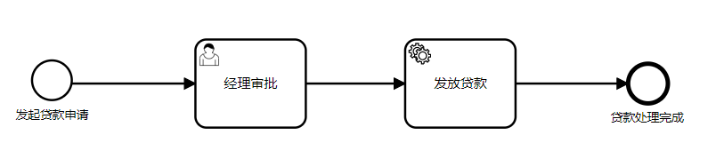
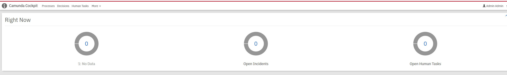

## 1. 流程引擎概述

### 1.1. 什么是工作流

工作流起源于办公自动化，是对软件中业务流程的抽象。通过工作流将各个任务有序组织起来形成一个完整的业务闭环。比如：请假审批流程，网上购物流程，银行贷款流程；

 

### 1.2. 应用场景

- 传统办公自动化业务；

- 微服务业务组装器；

- 各种能力层（如图像识别，离线分析，指纹识别，鉴黄鉴暴）组合业务；

- 低代码平台，标准化输入输出，功能独立化的业务组件，可以通过拖拽改变流程组成新的业务；

- 微服务状态机；

   

  

### 1.3. 常见工作流

#### 1.3.1. 工作流对比

最常用业务的工作流组件包括jbpm 、Activity、flowable 、camunda

功能最强大的属flowable   camunda  ，都从activity发展而来，性能，功能都比activity强大。

 

PS：流程虚拟机 （Process Virtual Machine - PVM）

* Activiti

  Activiti 由 Alfresco 公司开发，目前最高版本为 Activiti cloud 7.1.0。其中 activiti5 和 [activiti6](https://www.zhihu.com/search?q=activiti6&search_source=Entity&hybrid_search_source=Entity&hybrid_search_extra={"sourceType"%3A"answer"%2C"sourceId"%3A2279723965}) 的核心 leader 是 Tijs Rademakers，由于团队内部分歧，2017 年 Tijs Rademakers 离开团队，创建了后来的 Flowable。activiti6 以及 activiti5 代码则交接给 Salaboy 团队维护，activiti6 以及 activiti5 的代码官方已经暂停维护。往后 Salaboy 团队开发了 activiti7 框架，[activiti7](https://www.zhihu.com/search?q=activiti7&search_source=Entity&hybrid_search_source=Entity&hybrid_search_extra={"sourceType"%3A"answer"%2C"sourceId"%3A2279723965}) 内核使用的还是 activiti6，并没有为引擎注入更多的新特性，只是在 Activiti 之外的上层封装了一些应用。直到 Activiti cloud 7.1.0 版本，Activiti cloud 将系统拆分为 Runtime Bundle、Audit Service、Query Service、Cloud Connectors、Application Service、Notification Service。这些工作的主要目的其实就是为了上云，减少对 Activiti 依赖的耦合，需要使用 Activiti 的系统只需要通过调用 http 接口的方式来实现工作流能力的整合，将工作流业务托管上云。

* Flowable

  Flowable 是基于 activiti6 衍生出来的版本，目前最新版本是 v6.7.0。开发团队是从 Activiti 中分裂出来的，修复了一众 activiti6 的 bug，并在其基础上实现了 DMN 支持，BPEL 支持等。相对开源版，其商业版的功能会更强大。Flowable 是一个使用 Java 编写的轻量级业务流程引擎，使用 Apache V2 license 协议开源。2016 年 10 月，Activiti 工作流引擎的主要开发者离开 Alfresco 公司并在 Activiti 分支基础上开启了 Flowable 开源项目。Flowable 项目中包括 BPMN（Business Process Model and Notation）引擎、CMMN（Case Management Model and Notation）引擎、DMN（Decision Model and Notation）引擎和表单引擎（Form Engine）等模块。

* Camunda

  Camunda 基于 activiti5，所以其保留了 PVM，最新版本 Camunda7.17，开发团队也是从 activiti 中分裂出来的，发展轨迹与 Flowable 相似。通过压力测试验证 Camunda BPMN 引擎性能和稳定性更好。功能比较完善，除了 BPMN，Camunda 还支持 CMMN（案例管理）和 DMN（决策自动化）。Camunda 不仅带有引擎，还带有非常强大的工具]，用于建模、任务管理、操作监控和用户管理。

* jBPM

  jBPM 由 JBoss 公司开发，目前最高版本 7.61.0.Final，不过从  jBPM5 开始已经跟之前不是同一个产品了，jBPM5 的代码基础不是 jBPM4，而是从 Drools Flow 重新开始，基于 Drools Flow 技术在国内市场上用的很少，jBPM4 诞生的比较早，后来 jBPM4 创建者 Tom Baeyens 离开 JBoss 后，加入 Alfresco 后很快推出了新的基于 jBPM4 的开源工作流系统 Activiti，另外 jBPM 以 Hibernate 作为数据持久化 ORM，而 Hibernate 也已不是主流技术

* osworkflow

  osworkflow 是一个轻量化的流程引擎，基于状态机机制，数据库表很少，osworkflow 提供的工作流构成元素有：步骤（step）、条件（conditions）、循环（loops）、分支（spilts）、合并（joins）等，但不支持会签、跳转、退回、加签等这些操作，需要自己扩展开发，有一定难度。如果流程比较简单，osworkflow 是很好的选择

#### 1.3.2. 流程编辑器

* bpmn-js

  bpmn-js 是 BPMN 2.0 渲染工具包和 Web 模型。bpmn-js 正在努力成为 Camunda BPM的一部分。bpmn-js 使用 Web 建模工具可以很方便的构建 BPMN 图表，可以把 BPMN 图表嵌入到你的项目中，容易扩展。bpmn-js 是基于原生 js 开发，支持集成到 vue、react 等开源框架中。

* mxGraph

  mxGraph 是一个强大的 JavaScript 流程图前端库，可以快速创建交互式图表和图表应用程序，国内外著名的 ProcessOn和 都是使用该库创建的强大的在线流程图绘制网站。由于 mxGraph 是一个开放的 js 绘图开发框架，可以开发出很炫的样式，或者完全按照项目需求定制。

* activiti-modeler

  Activiti 开源版本中带了 web 版流程设计器，在 Activiti-explorer 项目中有 activiti-modeler，优点是集成简单，开发工作量小，缺点是界面不美观，用户体验差。

* flowable-modeler

  Flowable 开源版本中带了 web 版流程设计器，展示风格和功能基本跟 activiti-modeler 一样，优点是集成简单，开发工作量小，缺点是界面不美观，用户体验差。

* react-flow

  react-flow 是一个用于构建基于节点的应用程序的库。这些可以是简单的静态图或复杂的基于节点的编辑器。同时 react-flow 支持自定义节点类型和边线类型，并且它附带一些组件，可以查看缩略图的 Mini Map 和悬浮控制器 Controls。基于 react 生态开发，图形高度自定义，任何 ReactElement 都可以作为节点，但是不支持 bpmn 图表。

### 1.4. BPMN

#### 1.4.1. BPMN概念

BPMN（Business Process Modeling Notation）指业务流程建模与标记，由BPMI Notation Working Group超过2年的努力于2004年5月对外发布了BPMN 1.0 规范，后BPMI并入到OMG组织，OMG于2011年推出BPMN2.0标准
BPMN定义了业务流程图，其基于流程图技术，同时为创建业务流程操作的图形化模型进行了裁减。业务流程的模型就是图形化对象的网图，包括活动（也可以说工作）和定义操作顺序的流控制。

BPMN官网：https://www.bpmn.org/

### 1.4.2. 主要元素

BPMN元素的关系与作用，具体可以查看官网

 

 


## 2. camunda概述

camunda工作流源自activity5，是德国一家工作流程自动化软件开发商提供的，现在同时提供camunda7（组件方式）与camunda8(基于云原生)两种平台

### 2.1. 协议支持

- BPMN2（Business Process Model and Notation业务流程模型标记）

- CMMN ( Case Management Model and Notation.案例管理模型标记)

- DMN（Decision Model and Notation决策模型标记）

   

### 2.2. 优势

#### 功能

- 高性能（乐观锁，缓存机制）
- 高扩展性
- 高稳定性
- **独有的外部任务模式**
- 完善rest api
- 支持多租户
- 优秀的流程设计器

#### 性能

网上资料：通过flowable和camunda多组对比测试，camunda性能比flowablet提升最小10%，最大39%，而且camunda无报错，flowable有报错，camunda在高并发场景下稳定性更好。

参考：https://lowcode.blog.csdn.net/article/details/109030329

**对比：**


>   由于Flowable与Camunda好多功能都是类似的，因此在这里重点罗列差异化的功能
>
>   camunda支持****\*流程实例的迁移\*****，比如同一个流程有多个实例，多个流程版本，不同流程实例运行在不同的版本中，camunda支持任意版本的实例迁移到指定的流程版本中，***并可以在迁移的过程中支持从哪个节点开始***。
>   
>
>   camunda基于PVM技术，所以用户从Activii5迁移到camunda基本上毫无差异。flowable没有pvm了，所以迁移工作量更大（实例的迁移，流程定义的迁移、定时器的迁移都非常麻烦）。
>   
>
>   camunda对于每一个CMD命令类都提供了***权限校验机制***，flowable没有。
>   camunda继续每一个***API都有批处理的影子***，flowable几乎没有。比如批量挂起流程、激活流程等，使用***camunda可以直接使用API操作***，使用Flowable则只能自己去查询集合，然后循环遍历集合并操作。
>   camunda很多API均支持批处理，在批量处理的时候可以指定是***异步方式操作或者是同步方式操作***。异步的话定时器会去执行。Flowable没有异步批处理的机制。比如批量异步删除所有的历史数据。
>   
>
>    camunda启动实例的时候***支持从哪个节点开始***，而不是仅仅只能从开始节点运转实例。Flowable仅仅只能从开始节点运转实例。
>   camunda支持任意节点的跳转，可以跳转到连线也可以跳转到节点，并且在跳转的过程中***支持是否触发目标节点的监听器***。flowable没有改原生API需用户去扩展。
>   camunda支持链式生成流程，比如
>     Bpmn.createExecutableProcess(PROCESS_KEY)
>          .camundaHistoryTimeToLive(5)
>          .startEvent()
>          .userTask()
>          .endEvent().done(); flowable不支持。
>  
>
>    camunda支持***双异步机制***，第一个异步即***节点可以异步执行***，第二个异步方式是：****\*完成异步任务后，还可以继续异步去执行任务后面的连线\*****。所以称之为双异步机制，flowable只有第一种异步方式。
>
> 
>   camunda支持多种脚本语言，这些脚本语言可以在连线上进行条件表达式的配置，开箱即用。比如python、ruby、groovy、JUEL。flowable仅仅支持JUEL、groovy。开箱即用的意思就是如果想用python直接引入jython包就可以用了，不需要额外配置。
>
>
>   camunda支持外部任务，比如我们有时候想在一个节点中执行调用第三方的API或者完成一些特定的逻辑操作，就可以使用外部任务，外部任务有两种表，并支持第三方系统定期来抓取并锁定外部任务，然后执行业务完毕之后，完成外部任务，流程实例继续往下执行。***\*外部任务的好处就是解决了分布式事物的问题\****。在flowable中我们可以使用httpTask任务，我个人更倾向于camunda外部任务，因为这个外部任务有外部系统决定什么时候完成，httpTask是不等待任务，实例走到这个节点之后，调用一个api就直接往下跑了，外部任务不会继续往下跑，由外部系统去决定啥时候往下跑。
>
> 
>    camunda支持为用户定制一些个性化的偏好查找API，比如张三每次查询任务的时候，一般固定点击某某三个查询条件过滤数据，使用camunda就可以将这三个查询条件进行持久化，下次张三来了，就可以直接根据他的偏好进行数据的过滤，类似机器学习。
>
> 
>   camunda支持历史数据的批量删除或者批量迁移到其他介质，比如批量迁移到es，flowable没有该机制。
>   camunda支持在高并发部署流程的时候，***是否使用锁机制***，flowable没有该机制。
>   camunda支持单引擎多组合、多引擎多库。flowable仅仅支持单引擎多组合。
>   camunda支持流程实例跨流程定义跳转，flowable没有该机制。
>   camunda支持***分布式定时器***，flowable没有该机制。
>   flowable支持nosql,camunda只有nosql的解决方案。
>
>
>   camunda支持***优化流程***，以及了解流程引擎的瓶颈所在和每个环节的耗时，flowable没有该机制。
>   camunda修改了流程模板xml解析方式，相比flowable性能更好。
>   camunda在解析流程模板xml的时候，去除了activiti5的双解析机制，相对而言耗时时间更短。flowable没有了pvm所以规避了双解析机制。关于双解析机制可以参考《Activiti权威指南》一书。
>   camunda可以在***任意节点添加任意的属性***，flowable原生API没有，需要自己扩展。
>   camunda框架没有为流程生成图片的API(所有流程图展示以及高亮均在前端动态计算)，activiti5/6/flowable5/flowable6有图片生成以及高亮的API.
>   camunda可以在***节点中定义定时作业的优先级***，也可以在流程中进行全局优先级的定义。当节点没有定义优先级的时候可以使用全局的优先级字段。activiti5/6/flowable5/flowable6没有该功能。
>   camunda可以再流程中定义流程的tag标记，activiti5/6/flowable5/flowable6没有改功能。
>   camunda/activiti5/6/flowable5/flowable6 均不支持国产数据库，比如人大金仓 和 达梦。
>   flowable6支持LDAP，openLDAP,camunda不支持。activiti5不支持

### 2.3. camunda现状

一年发形两个版本
五年内保证，camunda7 与camunda8并行开发与维护。
https://camunda.com/about/customers/ 官网在册企业

 

### 2.4. 文档资料

官方文档：https://docs.camunda.org/manual/7.17/
论坛：https://forum.camunda.io/ 有问题可以在论坛提问或搜索，会有人回答
github社区：https://github.com/camunda-community-hub
github官方开源库：https://github.com/camunda
国内开源社区：https://www.oschina.net/informat/camunda

## 3. 安装与部署

camunda有多种使用方式，此处先使用独立平台的方式部署引擎，这种用法适合分布式，微服务化，多语言异构系统的使用方式。是官方推荐的使用方式。
camunda-platform-run支持的运行方式有多种，包括：

- Apache tomcat
- JBoss EAP/wildfly
- IBM WebShpere
- Oracle WebLogic
- Docker
- Spring boot启动

### 3.1. 使用方式

#### 3.1.1. 引擎嵌入用法

将camunda引擎与业务系统整合到一起，适合java单体小型项目，流程引擎的生命周期与应用程序相同，可以使用引擎的所有内部API直接调用

 

优点：使用方便，不用单独部署和维护。
缺点：与业务深度耦合，不方便扩容，只能本项目使用。

#### 3.1.2. 组件式用法

   组件式用法流程引擎在运行时容器(Servlet容器、应用程序服务器……)中启动。流程引擎作为容器服务提供，可以由部署在容器内的所有应用程序共享。这个概念可以与运行时提供的JMS消息队列进行比较，它可以被所有应用程序使用。流程部署和应用程序之间存在一对一的映射:流程引擎跟踪由应用程序部署的流程定义，并将执行委托给相关应用程序


 

#### 3.1.3. 单点中间件

 将流程引擎单独部署成平台模式，是一种单实例SAAS模式，支持多项目共用，最常用的是通过Rest api方式来通信

优点：与业务完全解耦，方便扩容，同时支持多项目，支持多租户用法；
缺点：存在单点风险，远程调用有一定性能损耗，

 

#### 3.1.4. 集群中间件

是中间件用法的扩展，部署多个流程引擎实例，连接相同流程数据库

优点：在中间件的优点上增加高可用性，支持配置负载均衡。
缺点：共享数据库可能会成为瓶颈，多实例引擎负载均衡要自己实现（比如nginx反射代理）
建议生产用法

 

#### 3.1.5. camunda8云原生用法

camunda8是与camunda7并行开发的云原生版本，基于云原生部署在k8s集群中，采用天然分布式存储elasticsearch存储数据，适合大型微服务项目。上术中间件和集群用法与业务完全解耦，方便在业务达到瓶颈时升级到camunda8云原生用法

 


### 3.2. springboot安装

参考文档：https://docs.camunda.org/manual/latest/user-guide/spring-boot-integration/
**前提条件：**
**1.安装jdk1.8以上，camunda是java语言开发的，需要有jdk环境才能运行。（jdk安装与环境变量配置自己百度 ）**
参考：https://blog.csdn.net/bestsongs/article/details/104905060
**2.安装maven3.6以上，springboot项目默认使用maven进行构建，需要maven环境。（maven安装与环境配置自行百度）**
参考：https://www.cnblogs.com/lanrenka/p/15903261.html


#### 3.2.1. 新建springboot工程

利用camnunda提供的工具快速创建springboot工程，

https://camunda.com/download/

 

点击绿色链接，跳转到camunda springboot工程初始化页面，将各项选项改成自己想要。和原生spring boot工程初始化界面类似。这里设置管理员帐号admin, 密码123456。点击GENERATE PROJECT按钮下载工程代码并解压

#### 3.2.2. maven依赖

配置界面默认是H2内存数据库，这里我需要改成mysql数据库，并添加mysql驱动与连接信息。
用ideal打开工程，没装ideal用任何文本编辑器打开都行。

打开pom.xml，去掉h2驱动，添加mysql5驱动

```
 <dependencyManagement>
    <dependencies>
<!--      <dependency>-->
<!--        <groupId>org.springframework.boot</groupId>-->
<!--        <artifactId>spring-boot-dependencies</artifactId>-->
<!--        <version>2.6.4</version>-->
<!--        <type>pom</type>-->
<!--        <scope>import</scope>-->
<!--      </dependency>-->

      <dependency>
        <groupId>org.camunda.bpm</groupId>
        <artifactId>camunda-bom</artifactId>
        <version>7.17.0</version>
        <scope>import</scope>
        <type>pom</type>
      </dependency>
    </dependencies>
  </dependencyManagement>

  <dependencies>
    <dependency>
      <groupId>org.camunda.bpm.springboot</groupId>
      <artifactId>camunda-bpm-spring-boot-starter-rest</artifactId>
    </dependency>

    <dependency>
      <groupId>org.camunda.bpm.springboot</groupId>
      <artifactId>camunda-bpm-spring-boot-starter-webapp</artifactId>
    </dependency>

    <dependency>
      <groupId>org.camunda.bpm</groupId>
      <artifactId>camunda-engine-plugin-spin</artifactId>
    </dependency>

    <dependency>
      <groupId>org.camunda.spin</groupId>
      <artifactId>camunda-spin-dataformat-all</artifactId>
    </dependency>

    <dependency>
      <groupId>mysql</groupId>
      <artifactId>mysql-connector-java</artifactId>
      <version>5.1.47</version>
    </dependency>

    <dependency>
      <groupId>org.springframework.boot</groupId>
      <artifactId>spring-boot-starter-jdbc</artifactId>
    </dependency>

    <!-- https://mvnrepository.com/artifact/org.codehaus.groovy/groovy-all -->
    <dependency>
      <groupId>org.codehaus.groovy</groupId>
      <artifactId>groovy-all</artifactId>
      <version>3.0.10</version>
      <type>pom</type>
    </dependency>

    <!--groovy发送Http请求，底层是对HTTPClient封装 HttpBuilder-->
    <dependency>
      <groupId>org.codehaus.groovy.modules.http-builder</groupId>
      <artifactId>http-builder</artifactId>
      <version>0.7.1</version>
    </dependency>
    <dependency>
      <groupId>org.camunda.bpm</groupId>
      <artifactId>camunda-engine-plugin-connect</artifactId>
      <version>7.17.0</version>
    </dependency>

    <dependency>
      <groupId>org.camunda.connect</groupId>
      <artifactId>camunda-connect-connectors-all</artifactId>
      <version>1.5.2</version>
    </dependency>

  </dependencies>
```


#### 3.2.3. 配置

```
spring:
  datasource:
    url: jdbc:mysql://10.130.36.244:3306/camunda?useUnicode=true&characterEncoding=UTF-8&autoReconnect=true&useSSL=false&nullCatalogMeansCurrent=true
    driver-class-name: com.mysql.jdbc.Driver
    username: root
    password: tech789
camunda.bpm.admin-user:
  id: admin
  password: 123456
camunda:
  bpm:
    auto-deployment-enabled: true
    history-level: audit
    authorization:
      tenant-check-enabled: true
    default-number-of-retries: 4
```

#### 3.2.4. 打包部署

```
 mvn clean package -Dmaven.test.skip=true
```

```
 java -jar camunda-engine-1.0.0-SNAPSHOT.jar
```

#### 3.1.5.  页面验证

 localhost:8080

 


### 3.3. docker安装

### 3.4.  tomcat安装

下载war包

https://docs.camunda.org/manual/7.17/installation/standalone-webapplication/

### 3.5. 设计器

地址：

https://github.com/camunda/camunda-modeler/releases

https://camunda.com/download/modeler/

#### 3.5.1. 下载

根据自己操作系统选择下载，我这里选择windows 64位 v5.2.0版本

#### 3.5.2.  解压安装

#### 3.5.3.  创建流程

使用快捷方式ctrl+p 可以切换右侧属性面板，ctrl+ shift+p 重置属性面板

 

#### 3.5.4. 部署流程

将设计好的流程加载到流程引擎中。


#### 3.5.5. 启动实例

流程部署到引擎中之后，可以通过设计器直接启动流程实例。
流程与流程实例的关系可以参数面向对象语言的类与对象之前的关系，或者模具与模具生产出来的实体。

 

 


## 4. 简单示例

设计一个最简单购物流程， **开始==》加入购物车==》付款 》物流发货》结束**。


### 4.1. 设计流程

#### 4.1.1. 定义流程

选择service task类型

 

  配置成外部任务，与业务完全解耦，设置一个topic：shopping_cart

 

其它的类似

点击空白来定义processDefinitionKey为：Process_shopping，方便代码使用


#### 4.1.2. 保存与部署

按ctrl+s保存
点击部署按钮部署，发布到流程引擎

 


### 4.2. 业务代码

新建springboot工程， paython、go语言均有camunda客户端，和流程引擎交互为此处演示的是

#### 4.2.1. 依赖

camunda-external-task-client

```
<dependencies>
        <dependency>
            <groupId>org.springframework.boot</groupId>
            <artifactId>spring-boot-starter-web</artifactId>
        </dependency>
        <dependency>
            <groupId>org.camunda.bpm</groupId>
            <artifactId>camunda-external-task-client</artifactId>
            <version>${camunda.external-task-client.version}</version>
        </dependency>

        <dependency>
            <groupId>org.projectlombok</groupId>
            <artifactId>lombok</artifactId>
            <version>1.18.24</version>
        </dependency>

        <dependency>
            <groupId>javax.xml.bind</groupId>
            <artifactId>jaxb-api</artifactId>
            <version>2.3.1</version>
        </dependency>
    </dependencies>
```

#### 4.2.2. 订阅流程

```
@Component
@Slf4j
public class SubscribeTask {
    //引擎端url 前缀
    private final static String CAMUNDA_BASE_URL = "http://localhost:8080/engine-rest";
    private ExternalTaskClient client = null;

    private ExternalTaskClient getClient() {
        if (client == null) {
            client = ExternalTaskClient.create()
                    .baseUrl(CAMUNDA_BASE_URL)
                    .asyncResponseTimeout(10000) // long polling timeout
                    .build();
        }
        return client;
    }

    @PostConstruct
    public void handleShoppingCart() {
        getClient().subscribe("shopping_cart")
                .processDefinitionKey("Process_shopping")
                .lockDuration(2000)
                .handler((externalTask, externalTaskService) -> {
                    log.info("订阅到加入购物车任务");
                    Map<String, Object> goodVariable = Variables.createVariables()
                            .putValue("size", "xl")
                            .putValue("count", 2);

                    externalTaskService.complete(externalTask, goodVariable);
                }).open();
    }


    @PostConstruct
    public void pay() {
        getClient().subscribe("pay")
                .processDefinitionKey("Process_shopping")
                .lockDuration(2000)
                .handler((externalTask, externalTaskService) -> {
                    Object count = externalTask.getVariable("count");
                    log.info("付款成功，数量{}", String.valueOf(count));
                    Map<String, Object> goodVariable = Variables.createVariables()
                            .putValue("toWhere", "南京");


                    externalTaskService.complete(externalTask, goodVariable);
                }).open();
    }


    @PostConstruct
    public void handleLogisticsDelivery() {
        getClient().subscribe("logistic_delivery")
                .processDefinitionKey("Process_shopping")
                .lockDuration(2000)
                .handler((externalTask, externalTaskService) -> {
                    Object toWhere = externalTask.getVariable("toWhere");
                    log.info("收到发货任务，目的地：{}", String.valueOf(toWhere));

                    externalTaskService.complete(externalTask);
                }).open();
    }


}
```


### 4.3. 启动实例

 

发起流程实例，即启动一次任务，这里传递一个业务key，和一次流程实例绑定，方便后序查询流程数据。

每个实例会有一个business key, 业务主键，也相当于一个流程实例唯一key，一般会与一次业务强相关，比如一个订单号

### 4.4. 验证查看

 

最终各个业务系统会执行成功，外部系统的控制台如下：

```
2022-12-07 17:40:44.457  INFO 26188 --- [criptionManager] c.y.e.task.demo.shopping.SubscribeTask   : 订阅到加入购物车任务
2022-12-07 17:40:44.650  INFO 26188 --- [criptionManager] c.y.e.task.demo.shopping.SubscribeTask   : 付款成功，数量2
2022-12-07 17:40:44.711  INFO 26188 --- [criptionManager] c.y.e.task.demo.shopping.SubscribeTask   : 收到发货任务，目的地：南京
```


## 6. 可视化控制台

流程引擎控制台的密码在配置文件中配置。登录进入首页。

 

### 6.1. 管理后台

#### 6.1.1. 基本操作


创建用户

 

用户信息

 

用户列表

 

用户组

 

点击admin用户右侧edit,进入编辑，点击左侧Group，再点击右侧Add to a group+ 加入一个组，选择camunda-admin组。 

 

#### 6.1.2. 用户，组，权限，租户之间

基于RBAC（Role-based access control）权限模型.

#### 6.1.3. 权限

 

### 6.2. 流程看板

流程与实例相关的数据查看都在cockpit

 

点击进入运行的流程实例，不同颜色区分不同流程图的实例，点击相关颜色直接进入对应的流程实例界面，点击中间数字进入流程实例列表

 

进入单个流程定义的所有流程实例

 

点击单个实例ID，进入单个流程实例界面

 

### 6.3. 用户任务列表

展示了所有用户的任务


## 7. 总结