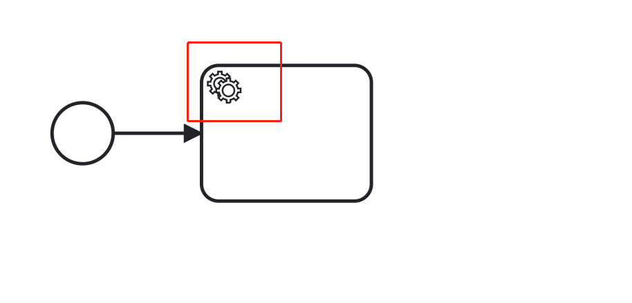
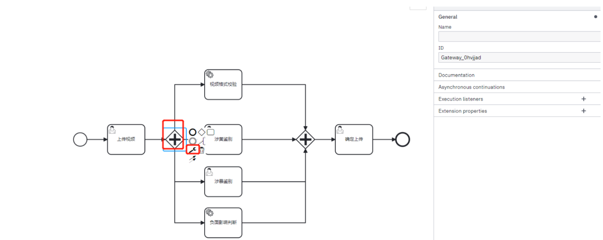
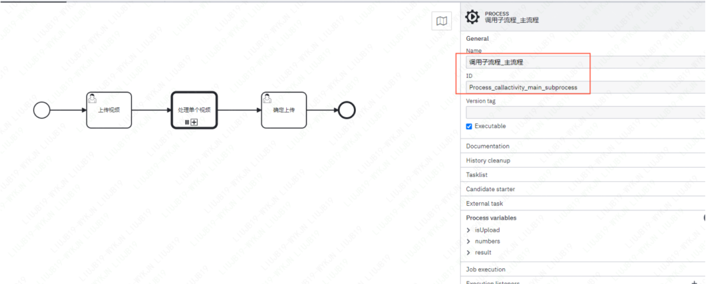
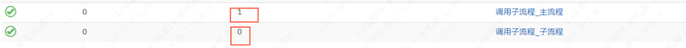
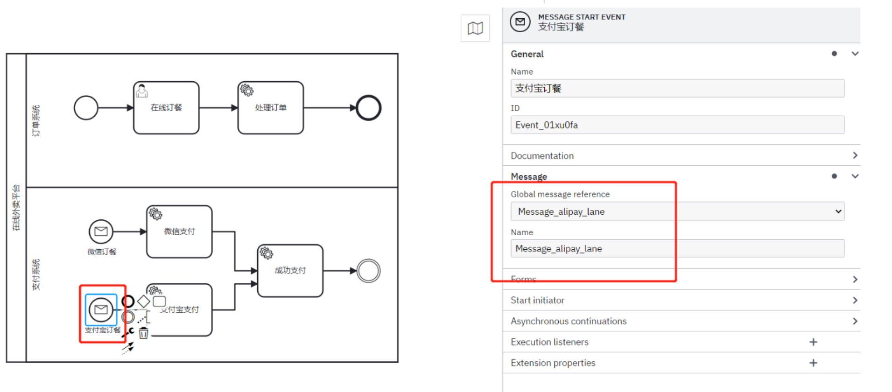

## 1. 开头


## 2. 任务

### 2.1. 用户任务

用户任务是指：需要人工处理后才能流转任务的任务类型

假设员工小明请假，并备注，请假人名，请假原因和请假天数，直接上级审批通过即可。

#### 2.1.1. 设计流程

发起传递变量


  


请假人表单


领导审批表单

 


保存文件

#### 2.1.3. 部署流程 

这里采用postman请求流程引擎。

 

返回：

```
{
    "links": [
        {
            "method": "GET",
            "href": "http://localhost:8080/engine-rest/deployment/f7c08b0f-7790-11ed-9c31-049226e08e36",
            "rel": "self"
        }
    ],
    "id": "f7c08b0f-7790-11ed-9c31-049226e08e36",
    "name": "用户任务简单请假流程",
    "source": null,
    "deploymentTime": "2022-12-09T15:13:23.394+0800",
    "tenantId": null,
    "deployedProcessDefinitions": {
        "user_task_simple_demo:1:f7c78ff1-7790-11ed-9c31-049226e08e36": {
            "id": "user_task_simple_demo:1:f7c78ff1-7790-11ed-9c31-049226e08e36",
            "key": "user_task_simple_demo",
            "category": "http://bpmn.io/schema/bpmn",
            "description": null,
            "name": "用户任务简单请假流程",
            "version": 1,
            "resource": "用户任务简单请假流程.bpmn",
            "deploymentId": "f7c08b0f-7790-11ed-9c31-049226e08e36",
            "diagram": null,
            "suspended": false,
            "tenantId": null,
            "versionTag": null,
            "historyTimeToLive": null,
            "startableInTasklist": true
        }
    },
    "deployedCaseDefinitions": null,
    "deployedDecisionDefinitions": null,
    "deployedDecisionRequirementsDefinitions": null
}
```

#### 2.1.4. 创建实例

使用postman请求流程引擎

```
{
  "variables": {
    "empCode": {
      "value": "jiangzongyan",
      "type": "String"
    }
  },
  "businessKey": "user_task_simple_demo"
}
```

可以在页面查看变量


填写表单完成

 


#### 2.1.5. 领导审批

 


### 2.2. 业务任务

业务任务通常是用来调用业务系统，camunda中可以调用JAVA代码或者restapi调用

 

在camunda中，业务任务实现方式有5种。

* Java Class
* Expression
* Delegate expression
* External
* Connector

#### 2.2.1. java classs

使用java class 模式实现业务任务

 


#### 2.2.2. Delegate expression

使用Delegate expression实现业务任务，使用EL表达式接收实现任务的Bean，不用带方法名，默认调用execute方法。 实现任务的Bean需要implements JavaDeletegate接口。

 

 

#### 2.2.3. Expression

使用Expression实现业务任务，使用EL表达式接收bean.callMethod(参数)的方式执行，也可以是一行普通的表达式，比如${a==b?a:b}，并且将方法执行结果存入Result Variable;
相比Delegate expression ，此种方式实现任务的Bean无须实现implements JavaDeletegate接口，可以是任意方法，任意参数，需要用到流程执行的参数，可以直接传入execution.

 

 

查询评分流程类似

 


#### 2.2.4. 业务任务验证

* 启动实例

   

  

* 程序打印

  各个servicetask得到了执行

   

#### 2.2.5. Extend task

外部任务（external task）是属于业务任务(service task)的一个分支，外部任务需要实现方明确告知其complete任务了，才会流转任务。camunda工作流特有的类型，是非常重要的类型，外部任务指的是任务实现在引擎服务的外面，camunda以下优势都是通过外部任务提供的：

* **多语言异构系统，常用语言支持SDK；**

* **对微服务较好的支持，与业务解耦；**

* **作为SAAS平台使用，并支持多租户；**

 

**外部应用依赖**

```
<dependency>
    <groupId>org.camunda.bpm.springboot</groupId>
    <artifactId>camunda-bpm-spring-boot-starter-external-task-client</artifactId>
    <version>7.17.0</version>
</dependency>
```

**添加spring配置**

其他支持的配置可查官网：https://docs.camunda.org/manual/7.17/user-guide/ext-client/spring-boot-starter/

```
#引擎根路径
camunda.bpm.client.base-url=http://localhost:8080/engine-rest
#长轮询的时间间隔
camunda.bpm.client.async-response-timeout=20000
#一次最多拉取任务的数量
camunda.bpm.client.max-tasks=1
#全局订阅topic上锁时间，单位毫秒，锁住期间，其他订阅者拉取不任务
camunda.bpm.client.lock-duration=10000
#指定工作节点的ID
camunda.bpm.client.worker-id=java-client
```

**添加订阅任务的Bean**

预约修理家电，任务流转到外部任务，在没启动客户端消费时，任务一直会卡住。

通过注解@ExternalTaskSubscription指定订阅的topic，包含的流程key等，此注解中的配置与配置文件中全局配置有重复时会优先使用，就近原则。
lockDuration一般每个外部任务有有差异，需要根据任务执行的预估时间设置，异步任务可能时间会比较长，锁住的时间要确保大于异步回调的时间。否则会被其他订阅者再次拉取此任务，这可能会导致业务数据重复

```
package com.yto.externaltask;

import org.camunda.bpm.client.spring.annotation.ExternalTaskSubscription;
import org.camunda.bpm.client.task.ExternalTaskHandler;
import org.springframework.context.annotation.Bean;
import org.springframework.context.annotation.Configuration;

import java.util.concurrent.TimeUnit;

@Configuration
public class SelfRepairService {

    @Bean
    @ExternalTaskSubscription(topicName = "try_self_repair", processDefinitionKeyIn = {"Process_external"},lockDuration=500000000)
    public ExternalTaskHandler doSelfRepair() {

        return (externalTask, externalTaskService) -> {
            System.out.println("外部任务进入偿试自修");
            try {
                TimeUnit.SECONDS.sleep(1);
            } catch (InterruptedException e) {
                throw new RuntimeException(e);
            }
            boolean isFree = (boolean) externalTask.getVariable("isFree");
            if (isFree) {
                System.out.println("免费维修");
                externalTaskService.handleFailure(externalTask, "维修是免费的，我不想自修了", "这里可以打印异常stacktrace", 1, 5000);
            } else {
                System.out.println("收费维修");
                externalTaskService.complete(externalTask);
            }
        };


    }
}
```

代码中假设用户根据修理是否免费，有两条逻辑，通过获取变量isFree来判断。

* 如果免费，用户不想尝试自修，直接通过上报异常消息来模拟

  实际项目中可能是走另一条业务逻辑，此处是为了模拟上报异常的功能，可以快速定位流程实例卡在哪个节点，错误原因是什么。
  上报异常handleFailure有个参数retries（重试次数）需要注意，指定重试任务的频率。必须是>= 0。如果为0，则会创建一个事件，并且不能再获取任务，除非重试次数再次增加。事件的消息被设置为errorMessage参数

  获取isFree变量为true，设置的重试频率为0，所以会上报异步，控制台中可以查看错误原因，这个功能很有用，生产环境中出错通过日志排错很麻烦，这个功能可以快速精确定位问题。所以建议这个参数都设为0，重试可以在处理的业务内部进行。或者动态调用rest api增加重试。

  当isfree=true时外部任务不会走正常的compete流程。会卡住。
  可以点击重试按钮，或rest api
  http://localhost:8080/camunda/api/engine/engine/default/external-task/b3dda76f-235a-11ed-a438-b66921cf979d/retries

* 如果不免费

  用户会选择先尝试自修。

 


 

**外部任务超时时间设置经验：**

几个时间相关的设置

* **配置文件中的 async-response-timeout**
  长轮询挂起等待任务的最大等待时间，单位毫秒，超时后即使没有任务，也会response到客户端，开始下次长轮询，默认为null，配置了此参数才会启用long polling。

* **订阅主题 时的 lockDuration**
  指定一个外部任务锁定的毫秒数。必须大于零。它会被主题订阅上配置的锁持续时间覆盖，当此外部任务处理时间较长时，lockDuration设置要大于处理时间，否则可能重复处理。

* **处理异常时的 retryTimeout**
  处理异常上报引擎时重试机制的超时间，当retries参数设置大于0时，失败的任务会重试，每次重试之间的时间间隔

#### 2.2.6. 优先级

camunda设置外部任务时，可以设置任务优先级Task priority,优先级越高越优先被执行，默认都是0。可以通过在BPMN xml中设置，也可以调API设置
在BPMN 中设置可以使用EL表达式，在并行任务控制时控制哪批任务先执行很实用

 


#### 2.2.7. 监听器

执行器监听是引擎端执行的。需要添加在引擎端。用来处理任务处理前后拦截增加，检测的功能。

这里设计了尝试自修结束后有个自动检查是否填写地址，没有地址会从系统拉取用户注册地址填充，师傅上门修理之前系统自动根据地址给用户发送短信通知师傅即将上门修理，请核实地址

流程设计图如下：


 

 


代码如下：

cn.yto.workflow.listeners.CheckHomeAddressEndListener

```
@Component("checkHomeAddress")
public class CheckHomeAddressEndListener implements ExecutionListener {
    private final String DEFAULT_ADDRESS="用户注册地址";
    @Override
    public void notify(DelegateExecution delegateExecution) throws Exception {
        System.out.println("进入检查用户地址任务");
        Object homeAddress = delegateExecution.getVariable("homeAddress");
        if (homeAddress == null){
            System.out.println("用户没填地址，使用默认地址");
            delegateExecution.setVariable("homeAddress",DEFAULT_ADDRESS);
        }

    }
}
```

cn.yto.workflow.listeners.NoticeCustomerStartListener

```
@Component("noticeCustomer")
public class NoticeCustomerStartListener implements ExecutionListener {
    @Override
    public void notify(DelegateExecution delegateExecution) throws Exception {
        System.out.println("进入通知客户任务");
        String homeAddress = String.valueOf(delegateExecution.getVariable("homeAddress"));
        TimeUnit.SECONDS.sleep(1);

        System.out.println("您好，师傅正在赶往"+homeAddress+"为您修理家电");
    }
}
```

发起实例验证：

 


 

### 2.3. 多实例任务

多实例任务，是指一个类型的任务需要循环执行多次，包括串行多实例任务和并行多实例任务。

 

#### 2.3.1. 串行任务

* 点任务 - 设置(点小扳手) - 点 三个竖线或者横线。

* 在右侧的属性面板填写：
  Collection：

  它表示一个集合Element Variable：写一个变量名，它表示遍历上面的集合元素使用的标识。然后就可以使用变量 ${ 变量名 } 了。

* Assignee 

  分配到任务的人填写 ${ 变量名 }。

* Loop **Cardinality**

  当没有设置Collection的时候，可以通过此变量设置循环的次数


 

**Loop** **Cardinality**当没有设置Collection的时候，可以通过此变量设置循环的次数。

#### 2.3.2. 并行任务

假设需求是三个领导中的任意两个审批通过即可完成请假。任意两个就不能串行。

在并行任务运行中有内置几个变量如下：

- nrOfActiviteInstances：当前活动的实例数量，即还没有完成的实例数量
- loopCounter ：循环计数器，办理人在列表中的索引
- nrOfInstances：多实例任务中总共的实例数
- nrOfCompletedInstances：已经完成的实例数量

可以通过设置Completion Condition 为${ nrOfCompletedInstances == 2} 表示任意两个人完成审批

 


### 2.4. 脚本任务

在Camunda中，脚本任务是一个自动活动，当流程执行到脚本任务时，相关的脚本自动执行。camunda支持大多是兼容JSR-223的脚本引擎实现，比如Groovy, JavaScript, JRuby and Jython，要使用脚本功能，需要在classpath中添加对应的脚本引擎，Javascript, Groovy两种脚本引擎已在发布中包含

 

相关参考文档：
https://docs.camunda.org/manual/7.17/reference/bpmn20/tasks/script-task/
https://docs.camunda.org/manual/7.17/user-guide/process-engine/scripting/#script-source
https://docs.camunda.org/manual/7.17/user-guide/process-engine/scripting/
除了脚本任务中可以使用脚本，以下元素也可以支持脚本：

 

需求：

领导批复后通过自动脚本任务对原始年假进行扣除，通过业务任务进行想看剩余的年假天数

#### 2.4.1. 设计流程

  

```
var person = execution.getVariable("name");
var originDays = execution.getVariable("originDays");
var leaveDay = execution.getVariable("leaveday");
leftAnnualDays=originDays-leaveDay;
```

业务任务查询剩余假年天数，并存更新数据库

 

查询剩余年假天数业务任务代码

```
@Service("queryAnnualLeave")
public class QueryAnnualLeaveService implements JavaDelegate {
    
    @Override
    public void execute(DelegateExecution execution) throws Exception {
        System.out.println("进入查询剩余年假任务");
        double leftAnnualDays =(double) execution.getVariable("leftAnnualDays");
        //        添加业务逻辑接口更新年假天数
        System.out.println("剩余年假天数："+leftAnnualDays);
    }
}
```

#### 2.4.2. 外部脚本

modeler设计脚本任务的时候可以选择脚本方式 ，上面例子用的是inline script写在流程BPMN xml中, 也可以选择External resource，外部资源可以使用服务器本地磁盘地址.

### 2.5. 发送、接收任务

发送任务是一个非常简单的任务，一般只用来发送一个消息

 


接收任务用来等待发送任务的消息，仅仅用来等待作用

 

需求：

发送任务根据接收任务的消息ID和业务KEY(businessKey)来绑定一个消息发送，接收任务收到发送任务的消息后才往下流转

#### 2.5.1. 设计流程

 

 

 发送任务需要根据接收任务的消息名称（接收任务中的message name）,及业务businessKey，businesskey后面会专门讲，一般与单次流程实例一一对应，常规做法会与业务侧业务ID相关联。这里使用businessKey作用就是为防止所有流程实例都收到消息。

```
@Component("sendTask")
public class SendTask implements JavaDelegate {
    @Override
    public void execute(DelegateExecution execution) throws Exception {
        System.out.println("sendTask发送消息");
        RuntimeService runtimeService = execution.getProcessEngineServices().getRuntimeService();
        runtimeService.createMessageCorrelation("Message_0uk4vbb")
                .processInstanceBusinessKey("message_bussinessKey")
                .correlate();
    }
}
```

#### 2.5.2. 验证

启动一个**接收任务的实例**，并给一个业务businessKey=message_bussinessKey

 

启动后，接收任务生成一个流程实例，并卡在接收任务中等待 

 

启动一个发送消息实例

 

将会执行代码

```
    @Override
    public void execute(DelegateExecution execution) throws Exception {
        System.out.println("sendTask发送消息");
        RuntimeService runtimeService = execution.getProcessEngineServices().getRuntimeService();
        runtimeService.createMessageCorrelation("Message_receive_task_test")
                .processInstanceBusinessKey("message_bussinessKey")
                .correlate();
    }
```

**该请求就会触发上一步卡住的接受任务的执行。**

 

## 3. 网关

### 3.1. 排它网关

排他网关是指在多条执行路径时，根据条件判断选择其中一条路径执行的网关，相当于程序中条件控制,if … elseif… else…

#### **3.1.1. 需求**

假设员工小明（xiaoming）请假，天数小于等于3天直接上级（wangbing）审批即可，大于3天小于等于5天需要直接上级（wangbing）和部门经理（zhangsan）都要审批，大于5天需要直接上级（wangbing），部门经理（zhangsan）和总经理（wangwu）三者审批

#### 3.1.2. 设计流程

开始事件中设置start initiator

 

指定任务请假人就是启动的人，添加请假表单两个属性变量reason(请假原因)，leaveDays(请假天数):

 

排他网关与条件：小于等于3天，后面任务直接指定单个assignee

 

大于3天小于等于5天，需要增加一个listener，根据条件来设置leaders 变量的内容，指定审批领导集合。
只能写成leaveDays>3 && leaveDays<=5 ,不能写成 3< leaveDays<=5

 


大于5天的也需要增加一个listener，根据条件来设置leaders 变量的内容，指定审批领导集合

 

直接领导审批，指定wangbing为唯一审批人，是个单实例任务

 

直接领导和经理审批，需要wangbing,zhangsan两们领导先后审批，设计为串行多实例任务。变量leaders为上一步监听器设置 

 

直接领导、经理、总经理审批，设计同上。

 


 


在多领导审核的任务分支为多实例任务，需要增加leaders变量的值 ，在流程分支的流程线上可以使用监听器来实现。代码如下:监听器的代码如下：

```
@Component("addLeaders")
public class AddLeadersListener implements ExecutionListener {
    @Override
    public void notify(DelegateExecution execution) throws Exception {
        long leaveDay =  (long)execution.getVariable("leaveDays");
        System.out.println("进入增加领导集合类，员工请假天数："+leaveDay);
        List<String> leaders = new ArrayList<>();
        if (leaveDay>3 && leaveDay<=5){
            leaders.add("wangbing");
            leaders.add("zhangsan");
        }else if (leaveDay>5){
            leaders.add("wangbing");
            leaders.add("zhangsan");
            leaders.add("wangwu");
        }
        execution.setVariable("leaders",leaders);
    }
}
```

#### 3.1.3. 验证

xiaoming账号(流程发起者，starter)登录填写请假天数为4天，会进入jAddLeadersListener监听类， 理想的是走第二条审批路径

测试时会根据请假天数选择走不同的审批路径，比如4天，走直接上级与经理审批路径

根据审批领导的顺序分别登录进行审批，流程可以正常结束。

### 3.2. 并行网关

并行网关（parallel gateway）是指可以同时执行所有输出路径，并且需要所有输入路径执行完毕汇总到网关后流程才往下流转的元素。

 

并行网关上的序列流即使有条件判断也会忽略。
并行网关分两部分：
叉子(fork)

* 用于并行任务开始
* 汇总（join）：用于并行任务汇总

#### 3.2.1. 需求

假设社交平台中有个需求是，对用户自上传的视频并行处理几个任务，所有任务全正常达到要求才能上传到系统中。
视频格式的校验（service task）；
内容涉黄鉴别（user task人工处理）;
内容涉暴处理（user task 人工处理）；
内容负面影响判断（external task）；

#### 3.2.2. 流程设计

assignee为xiaoming，设计一个user task，增加视频名称videoName表单字段。

 


增加fork并行网关

 

增加视频格式检验任务，service task


视频格式检验任务是普通service task，需要在引擎端增加实现JavaDelegate接口的beanName=checkVideoFormat,详细代码如下

 

 

增加涉黄鉴别任务，user task ，assignee为wangbing, 增加表单字段isYellow

 

增加涉暴鉴别任务，user task , assignee为zhangsan，增加isViolence字段

 

负面影响判断任务，external task . topic:checkNegtive

 

并行网关，join部分

 

是否上传任务，user task, assignee=wangwu

 

此任务设计成external task, topic:checkNegtive,需要在外部实现external-task-java工程体代码如下：

 

#### 3.2.3. 验证

启动，触发流程实例

 

登录xiaoming用户模拟上传视频 ，设置视频名为神雕侠侣。点击complete后会触发并行任务。

 

并行任务可以任意顺序处理，视频格式任务与负面影响判断任务采用代码断点，同时进入了断点。另外，涉黄涉暴任务都是人工任务，可任意顺序处理。这里先让视频格式任务断点走完，因为此任务是普通service task，实现在引擎端，断点期间，数据上锁，不方便查看控制台 

 

进入控制台，点击实例ID，进入实例的控制界面 

 

再以任意顺序处理完其他任务，发现只有所有并行任务全处理完时才会流转到**确定上传**任务 

 

 


### 3.3. 包含网关

包含网关（inclusive gateway）结合了排他网关与并行网关的特点，即可以根据条件判断，也可以同时多个并行执行

 

包含网关的使用也需要用到两部分。
叉子(fork): 用于并行任务开始
汇总（join）：用于并行任务汇总。

#### 3.3.1. 需求

假设排他网关中的需求中增加一条，请假天数大于3天，需要增加人事经理审批，人事经理（renyingying）审批与领导审批可并行 

#### 3.3.2. 设计流程

排他网关改成包含网关。用小扳手切换排他网关为包含网关，fork部分

 

增加人事经理审批任务，添加一个分支，条件判断是大于3天

 

增加人事经理审批任务user task，assignee为renyingying

 

增加join部分包含网关

 

#### 3.3.3. 验证

 

通过控制台可以查看并行的路径有两条

 

 

任意顺序完成任务

 

 

所有任务审批完后，任务结束

### 3.4. 事件网关

基于事件的网关最少有两条可执行路径，根据事件做出执行路径的选择决定，当执行到达事件网关时，流程进入等待状态。每个传出序列流后面只能是中间捕获事件的元素。

 


且中间捕获事件的元素只能有一个输入序列流。

#### 3.4.1. 需求

假设员工xiaoming请假后，3分钟内直接领导wangbing收到了审批提醒，就是直接领导wangbing审批，超过3分钟直接领导没收到信号，就让部门经理zhangsan审批，最后总经理wangwu审批。

#### 3.4.2. 设计流程

员工请假任务。assignee为xiaoming，并添加请假天数，请假理由表单字段。

 

基于事件网关

 

定时事件

 

信号事件

 

增加一个接口，以get请求触发一个信号，绑定事件中的信号名称Signal_direct_leader，SendSignalController代码如下

 

部门经理审批


直接领导审批 

 


总经理审批

 


#### 3.4.3. 验证

启动引擎服务，触发实例

 


xiaoming账号登录填写请假信息

 

 

 3分钟内调用接口http://localhost:8080/sendSignal触发信号事件，观察流程走向

 

等待3分钟，不调接口发送信号，观察定时事件是否触发

 

按顺序完成审批，按顺序完成各级领导的审批，流程结束

 


## 4. 事件

### 4.1. 定时事件

定时事件(Timer Events)指定时器触发的事件，可以用作启动事件、中间事件或边界事件。

用作边界事件时，任务执行到节点时，定时器开始计时，这个功能用作任务超时处理挺有用

https://docs.camunda.org/manual/latest/reference/bpmn20/events/timer-events/#time-date
Time Date: 指定的时间执行，如2022-08-29T12:13:14Z 2022-08-29T12:13:14+08:00(东八区)
Time Duration: 过多长时间后任务开始执行，如PT1H3M 表示过1小时3分钟就开始执行。
Time Cycle: 循环执行的时间间隔，如R3/PT10H 表示每十个小时执行一次，一共三次。

#### 4.1.1. 需求

假设员工请假流程，在直接领导（wangbing）的时候有时间约束，超过3分钟没有审批，直接把任务流转到部门经理（zhangsan）审批.

#### 4.1.2. 设计流程

员工请假任务

 

直接领导审批

 

定时边界事件

 

部门经理审批

 


#### 4.1.3. 验证

启动流程，启动一次请假流程实例。

 

员工填写请假，填写完信息后，点击complete完成

 

等待定时捕获，任务流程到直接领导审批时，等待三分钟，观察任务是否直接跳到部门经理审批。

 

 

使用指定assignee：zhangsan登录后完成任务。请假流程实例结束。

### 4.2. 消息事件

消息事件（Message events）是引用已命名消息的事件。一条消息有一个名称和一个有效负载。与信号不同，消息事件总是指向单个收件人。消息事件定义是通过使用messageEventDefinition元素声明的。

- Camunda消息事件包括：Message Start Event（消息启动事件）；
- Message Intermediate Catching Event（消息中间捕获事件）；
- Message Boundary Event（消息边界事件）；
- Message Intermediate Throwing Event（消息中断抛出事件）；
- Message End Event（消息结束事件）

#### 4.2.1. 需求

假设在线订餐平台分为微信小程序订餐，支付宝小程序订餐，微信订餐支持微信支付，支付宝订餐支持支付宝支付。付款流程设置两个信号事件，在处理订单任务中根据订餐端的类型启动不同支付流程。

#### 4.2.2. 设计流程

流程全局信息

 

在线订餐，设置为user task，assignee=xiaoming，增加一个表单字段设置订餐的终端类型，枚举类型

 

处理订单，普通service task，采用Delegate expression实现类型，handleOrder为bean名称

 

引擎端实现处理订单，beanName为**handleOrder，**内部获取终端类型，发送信号给对应的消息事件接收

 


微信订餐消息事件

 

支付宝订餐消息事件
 

微信支付外部任务

 

支付宝支付外部任务

 

成功支付外部任务

 


外部任务在external-task-java工程中，在一个外部任务类中实现微信支付，支付宝支付，成功支付三个任务。代码如下：

 


#### 4.2.3. 验证

启动服务，同时启动引擎端，外部任务客户端服务

 

用户下订单，以xiaoming账号登录，下订单。分别选择不同终端，点击complete后观察进入哪种支付任务。

 

 

## 5. 子流程

### 4.1. 嵌套子流程

子流程是包含其他活动、网关、事件等的活动， 嵌套子流程是指其本身形成的流程是更大流程的一部分，元素为一个大方框，方框内部是一个完整的流程。嵌套子流程分可以是并行多实例（parallel multi instance subprocess），串行多实例（Sequential multi instance subprocess）

 

子流程运行时，主流程会等待。子流程结束，主流程继续。
子流程用处：

* 分层建模
* 控制变量作用范围

#### 4.1.1. 需求

假设并行网关章节的上传视频是批量上传，对每个视频进行的格式校验、涉黄鉴别、涉暴鉴别、负面判断都是一个子流程完成。
以并行子流程演示一下，串行的操作逻辑是一样的

#### 4.1.2. 设计流程

流程全局配置，修改一下流程名称，ID

 

上传视频任务，添加一个表单属性numbers来确定上传视频的数量

 

添加内嵌子任务，创建一个并行子任务，添加Loop cardinality为EL表达式${numbers}，根据上一步任务设置的变量来确定循环次数

 

并行任务加入子流程；四个并行任务作为内嵌子流程加入，既然是子流程，就是一个完整的流程，需要加上开始，结束事件元素

 

确定上传任务。确定上传任务还是作为全局任务，内容不变

 


#### 4.1.3. 验证

同时启动引擎端和外部任务客户端，触发流程实例

 

用户上传视频，使用xiaoming的账号登录，这里说明一下为什么总是用xiaoming的账号登录第一个操作，前面已经说明了，再次声明一下，因为此任务是user task,assignee=xiaoming。假设上传3个视频。

 

观察流程执行情况

视频 格式校验任务，负面影响判断任务为代码自动执行，进入到join汇总并行网关，涉黄鉴别，涉暴鉴别任务人为usertask，卡在流程中3次，主流程在等待

 

完成所有任务。分别登录wangbing 、zhangsan的账号完成任务3次，流程会跳到确定上传任务。子流程会结束

 

 


### 4.2. 调用子流程

调用子流程是指子流程在主流程的外面。子流程一般是多个流程可重用的流程，也可以独立调用子流程。
可以对比编程中的方法抽取。子流程运行时，主流程也是等待状态。子流程结束，主流程继续。

#### 4.2.1. 主流程设计

 

上传视频

 

处理单个视频，并行处理多个任务，每个任务调用一次子流程，设置关联的子流程ID

 

并传递变量给子流程（In Mappings）,接收子流程传给主流程的变量( Out Mappings)

 

确定上传

 

#### 4.2.2. 子流程设计

ID即为主流程关联的信息

 

子流程内容不变，只是增加了开始结束事件

增加脚本传递变量给主流程，在结束的顺序流中添加脚本监听器，增加groovy脚本添加子流程结果，以变量传给主流程

引擎添加groovy脚本的支持

```
  <dependency>
      <groupId>org.codehaus.groovy</groupId>
      <artifactId>groovy-all</artifactId>
      <version>2.4.21</version>
 </dependency>
 <!--groovy发送Http请求，底层是对HTTPClient封装 HttpBuilder-->
 <dependency>
     <groupId>org.codehaus.groovy.modules.http-builder</groupId>
     <artifactId>http-builder</artifactId>
     <version>0.7.1</version>
</dependency>
```

添加videoNames集合

模拟上传的视频集合

子任务变量名修改

检测视频格式任务修改

external-task-java检测负面内容修改

#### 4.2.3. 验证

启动引擎端和客户端后，调用接口，启动一个主流程实例，子流程不用调用，后面会根据关联被主流程调用。

 

用户上传视频，xiaoming账号登录模拟上传视频，此处的视频数量随便写，控制并行次数这次用的是collection集合。

 

主流程走到处理单个视频任务，并调用了三次子流程。

 

 

此时子流程都在等待，因为有涉黄鉴别，涉暴鉴别两个任务需要人工处理。子流程中变量targetVideoName中有值。


分别登录wangbing zhangsan账号完成人工任务。发现主流程往下走。子流程结束，主流程获取到了子流程的变量值。

 


 


## 6. 泳道

BPMN规范中将参与者(participant)进行分类分组，泳池(pool)一般用来表示相对更大范围的分类，泳道(lane)一般位于泳池内部或其他泳道内部。泳道一般用来对相对较小的范围进行分类。

 

### 6.1. 需求

假设对消息事件中的示例订餐流程存在于订餐系统中，支付相关是支付系统中的业务。使用泳池泳道进行分类

### 6.2. 设计流程

泳池的配置相当于普通流程的全局配置。里面包含流程ID。 

 

泳道配置

 

 

消息事件修改，由于消息事件Name是用于接收消息的唯一标识，整个流程引擎中不能重复

 

 


### 6.3. 代码修改

外部任务的订阅topic相关的流程定义的key改成Process_pool_lane

 

### 6.4. 验证

启动流程，调用接口，验证流程与结果与**消息事件**一致

 

 

## 7. 连接器

camunda工作流设计的与外部信息沟通的方法有外部任务(external task)，业务任务(service task)，执行监听器（execution listener),

以上都是当外部业务较复杂的时候使用，如果外部调用很简单，仅是调用远程直接获取一些状态数据，可以使用camunda提供的连接器connector实现。

默认支援的connector类型：
**http connector**

用于请求协议的接口。

- 引擎内部存在一个Conectors类会自动探测Classpath下的所有connector，根据ConnectorID生成实例；
- 默认情况下使用Apache 默认配置的 http client调用；
- 返回数据使用spin json读取；
- 自定义http client;

### 7.1. 引擎引入

#### 7.1.1. 依赖

```
<dependency>
      <groupId>org.camunda.bpm</groupId>
      <artifactId>camunda-engine-plugin-connect</artifactId>
      <version>7.17.0</version>
    </dependency>
```

#### 7.1.2. 代码

实现ConnectorConfigurator

```

import connectjar.org.apache.http.impl.client.CloseableHttpClient;
import connectjar.org.apache.http.impl.client.HttpClients;
import org.camunda.connect.httpclient.HttpConnector;
import org.camunda.connect.httpclient.impl.AbstractHttpConnector;
import org.camunda.connect.spi.ConnectorConfigurator;

public class HttpConnectorConfigurator implements ConnectorConfigurator<HttpConnector> {
    public Class<HttpConnector> getConnectorClass() {
        return HttpConnector.class;
    }

    public void configure(HttpConnector connector) {
        CloseableHttpClient client = HttpClients.custom()
                .setMaxConnPerRoute(10)
                .setMaxConnTotal(200)
                .build();
        ((AbstractHttpConnector) connector).setHttpClient(client);
    }
}
```

#### 7.1.3. 配置SPI加载

为了自动控制新的配置，camunda采用SPI机制加载用户配置。resources/META-INF/services

 

#### 7.1.4. 其它

soap connector:**用于请求soap协议的webservice等接口。这里只介绍一下http connector，soap有用到的可以参考文档 https://docs.camunda.org/manual/7.17/reference/connect/soap-connector/

### 7.2. 设计流程

假设医疗体检系统，根据顾客ID请求用户系统获取顾客信息，如果是男士走男士体检流程，女士走女士体检流程.
模拟一个mock用户信息的接口，当id为偶数时为男，奇数时为女。

开始事件添加启动表单字段id

 

获取用户HTTP connector任务

 

 

 

排他网关判断男女

 

 

男士女士体检套餐任务

 


代码

```
@Configuration
public class HealthCheckExternalService {
    @Bean
    @ExternalTaskSubscription(topicName = "male_health_plan", processDefinitionKeyIn = {"Process_http_connector"},lockDuration=50000)
    public ExternalTaskHandler maleHealthPlan() {
        
        return (externalTask, externalTaskService) -> {
            System.out.println("男士体检套餐");
            externalTaskService.complete(externalTask);
            
        };
    }
    
    @Bean
    @ExternalTaskSubscription(topicName = "female_health_plan", processDefinitionKeyIn = {"Process_http_connector"},lockDuration=50000)
    public ExternalTaskHandler femaleHealthPlan() {
        
        return (externalTask, externalTaskService) -> {
            System.out.println("女士体检套餐");
            externalTaskService.complete(externalTask);
            
        };
    }
```

### 7.3. 验证

