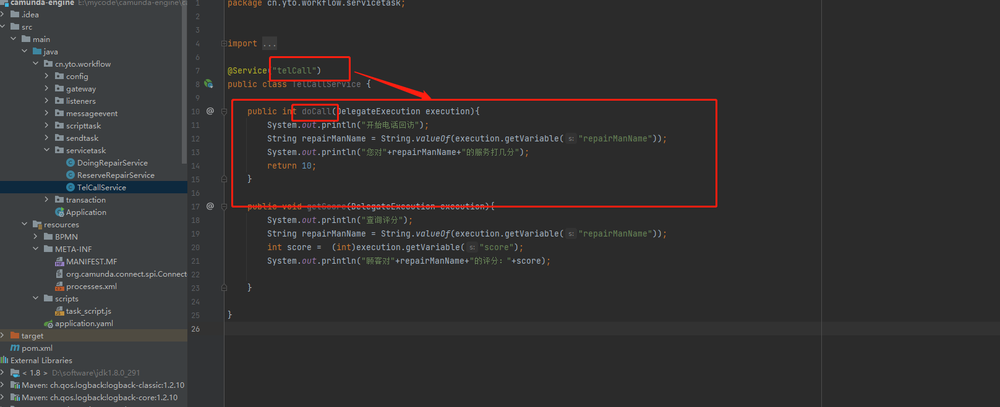

## 1. 开头


## 2. 任务

### 2.1. 用户任务

用户任务是指：需要人工处理后才能流转任务的任务类型

假设员工小明请假，并备注，请假人名，请假原因和请假天数，直接上级审批通过即可。

#### 2.1.1. 设计流程

发起传递变量


  


请假人表单


领导审批表单

 


保存文件

#### 2.1.3. 部署流程 

这里采用postman请求流程引擎。

 

返回：

```
{
    "links": [
        {
            "method": "GET",
            "href": "http://localhost:8080/engine-rest/deployment/f7c08b0f-7790-11ed-9c31-049226e08e36",
            "rel": "self"
        }
    ],
    "id": "f7c08b0f-7790-11ed-9c31-049226e08e36",
    "name": "用户任务简单请假流程",
    "source": null,
    "deploymentTime": "2022-12-09T15:13:23.394+0800",
    "tenantId": null,
    "deployedProcessDefinitions": {
        "user_task_simple_demo:1:f7c78ff1-7790-11ed-9c31-049226e08e36": {
            "id": "user_task_simple_demo:1:f7c78ff1-7790-11ed-9c31-049226e08e36",
            "key": "user_task_simple_demo",
            "category": "http://bpmn.io/schema/bpmn",
            "description": null,
            "name": "用户任务简单请假流程",
            "version": 1,
            "resource": "用户任务简单请假流程.bpmn",
            "deploymentId": "f7c08b0f-7790-11ed-9c31-049226e08e36",
            "diagram": null,
            "suspended": false,
            "tenantId": null,
            "versionTag": null,
            "historyTimeToLive": null,
            "startableInTasklist": true
        }
    },
    "deployedCaseDefinitions": null,
    "deployedDecisionDefinitions": null,
    "deployedDecisionRequirementsDefinitions": null
}
```

#### 2.1.4. 创建实例

使用postman请求流程引擎

```
{
  "variables": {
    "empCode": {
      "value": "jiangzongyan",
      "type": "String"
    }
  },
  "businessKey": "user_task_simple_demo"
}
```

可以在页面查看变量


填写表单完成

 


#### 2.1.5. 领导审批

 


### 2.2. 业务任务

业务任务通常是用来调用业务系统，camunda中可以调用JAVA代码或者restapi调用

 

在camunda中，业务任务实现方式有5种。

* Java Class
* Expression
* Delegate expression
* External
* Connector

#### 2.2.1. java classs

使用java class 模式实现业务任务

 


#### 2.2.2. Delegate expression

使用Delegate expression实现业务任务，使用EL表达式接收实现任务的Bean，不用带方法名，默认调用execute方法。 实现任务的Bean需要implements JavaDeletegate接口。

 

 

#### 2.2.3. Expression

使用Expression实现业务任务，使用EL表达式接收bean.callMethod(参数)的方式执行，也可以是一行普通的表达式，比如${a==b?a:b}，并且将方法执行结果存入Result Variable;
相比Delegate expression ，此种方式实现任务的Bean无须实现implements JavaDeletegate接口，可以是任意方法，任意参数，需要用到流程执行的参数，可以直接传入execution.

 

 

查询评分流程类似

 


#### 2.2.4. 业务任务验证

* 启动实例

   

  

* 程序打印

  各个servicetask得到了执行

   

#### 2.2.5. Extend task

外部任务（external task）是属于业务任务(service task)的一个分支，外部任务需要实现方明确告知其complete任务了，才会流转任务。camunda工作流特有的类型，是非常重要的类型，外部任务指的是任务实现在引擎服务的外面，camunda以下优势都是通过外部任务提供的：

* **多语言异构系统，常用语言支持SDK；**

* **对微服务较好的支持，与业务解耦；**

* **作为SAAS平台使用，并支持多租户；**

 

**外部应用依赖**

```
<dependency>
    <groupId>org.camunda.bpm.springboot</groupId>
    <artifactId>camunda-bpm-spring-boot-starter-external-task-client</artifactId>
    <version>7.17.0</version>
</dependency>
```

**添加spring配置**

其他支持的配置可查官网：https://docs.camunda.org/manual/7.17/user-guide/ext-client/spring-boot-starter/

```
#引擎根路径
camunda.bpm.client.base-url=http://localhost:8080/engine-rest
#长轮询的时间间隔
camunda.bpm.client.async-response-timeout=20000
#一次最多拉取任务的数量
camunda.bpm.client.max-tasks=1
#全局订阅topic上锁时间，单位毫秒，锁住期间，其他订阅者拉取不任务
camunda.bpm.client.lock-duration=10000
#指定工作节点的ID
camunda.bpm.client.worker-id=java-client
```

**添加订阅任务的Bean**

预约修理家电，任务流转到外部任务，在没启动客户端消费时，任务一直会卡住。

通过注解@ExternalTaskSubscription指定订阅的topic，包含的流程key等，此注解中的配置与配置文件中全局配置有重复时会优先使用，就近原则。
lockDuration一般每个外部任务有有差异，需要根据任务执行的预估时间设置，异步任务可能时间会比较长，锁住的时间要确保大于异步回调的时间。否则会被其他订阅者再次拉取此任务，这可能会导致业务数据重复

```
package com.yto.externaltask;

import org.camunda.bpm.client.spring.annotation.ExternalTaskSubscription;
import org.camunda.bpm.client.task.ExternalTaskHandler;
import org.springframework.context.annotation.Bean;
import org.springframework.context.annotation.Configuration;

import java.util.concurrent.TimeUnit;

@Configuration
public class SelfRepairService {

    @Bean
    @ExternalTaskSubscription(topicName = "try_self_repair", processDefinitionKeyIn = {"Process_external"},lockDuration=500000000)
    public ExternalTaskHandler doSelfRepair() {

        return (externalTask, externalTaskService) -> {
            System.out.println("外部任务进入偿试自修");
            try {
                TimeUnit.SECONDS.sleep(1);
            } catch (InterruptedException e) {
                throw new RuntimeException(e);
            }
            boolean isFree = (boolean) externalTask.getVariable("isFree");
            if (isFree) {
                System.out.println("免费维修");
                externalTaskService.handleFailure(externalTask, "维修是免费的，我不想自修了", "这里可以打印异常stacktrace", 1, 5000);
            } else {
                System.out.println("收费维修");
                externalTaskService.complete(externalTask);
            }
        };


    }
}
```

代码中假设用户根据修理是否免费，有两条逻辑，通过获取变量isFree来判断。

* 如果免费，用户不想尝试自修，直接通过上报异常消息来模拟

  实际项目中可能是走另一条业务逻辑，此处是为了模拟上报异常的功能，可以快速定位流程实例卡在哪个节点，错误原因是什么。
  上报异常handleFailure有个参数retries（重试次数）需要注意，指定重试任务的频率。必须是>= 0。如果为0，则会创建一个事件，并且不能再获取任务，除非重试次数再次增加。事件的消息被设置为errorMessage参数

  获取isFree变量为true，设置的重试频率为0，所以会上报异步，控制台中可以查看错误原因，这个功能很有用，生产环境中出错通过日志排错很麻烦，这个功能可以快速精确定位问题。所以建议这个参数都设为0，重试可以在处理的业务内部进行。或者动态调用rest api增加重试。

  当isfree=true时外部任务不会走正常的compete流程。会卡住。
  可以点击重试按钮，或rest api
  http://localhost:8080/camunda/api/engine/engine/default/external-task/b3dda76f-235a-11ed-a438-b66921cf979d/retries

* 如果不免费

  用户会选择先尝试自修。

 


 

**外部任务超时时间设置经验：**

几个时间相关的设置

* **配置文件中的 async-response-timeout**
  长轮询挂起等待任务的最大等待时间，单位毫秒，超时后即使没有任务，也会response到客户端，开始下次长轮询，默认为null，配置了此参数才会启用long polling。

* **订阅主题 时的 lockDuration**
  指定一个外部任务锁定的毫秒数。必须大于零。它会被主题订阅上配置的锁持续时间覆盖，当此外部任务处理时间较长时，lockDuration设置要大于处理时间，否则可能重复处理。

* **处理异常时的 retryTimeout**
  处理异常上报引擎时重试机制的超时间，当retries参数设置大于0时，失败的任务会重试，每次重试之间的时间间隔

#### 2.2.6. 优先级

camunda设置外部任务时，可以设置任务优先级Task priority,优先级越高越优先被执行，默认都是0。可以通过在BPMN xml中设置，也可以调API设置
在BPMN 中设置可以使用EL表达式，在并行任务控制时控制哪批任务先执行很实用

 


#### 2.2.7. 监听器

执行器监听是引擎端执行的。需要添加在引擎端。用来处理任务处理前后拦截增加，检测的功能。

这里设计了尝试自修结束后有个自动检查是否填写地址，没有地址会从系统拉取用户注册地址填充，师傅上门修理之前系统自动根据地址给用户发送短信通知师傅即将上门修理，请核实地址

流程设计图如下：


 

 


代码如下：

cn.yto.workflow.listeners.CheckHomeAddressEndListener

```
@Component("checkHomeAddress")
public class CheckHomeAddressEndListener implements ExecutionListener {
    private final String DEFAULT_ADDRESS="用户注册地址";
    @Override
    public void notify(DelegateExecution delegateExecution) throws Exception {
        System.out.println("进入检查用户地址任务");
        Object homeAddress = delegateExecution.getVariable("homeAddress");
        if (homeAddress == null){
            System.out.println("用户没填地址，使用默认地址");
            delegateExecution.setVariable("homeAddress",DEFAULT_ADDRESS);
        }

    }
}
```

cn.yto.workflow.listeners.NoticeCustomerStartListener

```
@Component("noticeCustomer")
public class NoticeCustomerStartListener implements ExecutionListener {
    @Override
    public void notify(DelegateExecution delegateExecution) throws Exception {
        System.out.println("进入通知客户任务");
        String homeAddress = String.valueOf(delegateExecution.getVariable("homeAddress"));
        TimeUnit.SECONDS.sleep(1);

        System.out.println("您好，师傅正在赶往"+homeAddress+"为您修理家电");
    }
}
```

发起实例验证：

 


 

### 2.3. 多实例任务

### 2.4. 脚本任务

### 2.5. 发送任务


## 3. 网关

### 3.1. 排它网关

### 3.2. 并行网关

### 3.3. 包含网关

### 3.4. 事件网关


## 4. 事件

### 4.1. 定时事件

### 4.2. 消息事件


## 5. 子流程

### 4.1. 嵌套子流程

### 4.2. 调用子流程


## 6. 泳道