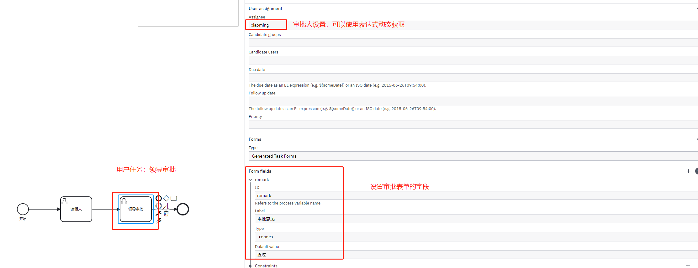

## 1. 开头


## 2. 任务

### 2.1. 用户任务

用户任务是指：需要人工处理后才能流转任务的任务类型

假设员工小明请假，并备注，请假人名，请假原因和请假天数，直接上级审批通过即可。

#### 2.1.1. 设计流程

发起传递变量


  


请假人表单


领导审批表单

 


保存文件

### 2.1.3. 部署流程 

这里采用postman请求流程引擎。

 

返回：

```
{
    "links": [
        {
            "method": "GET",
            "href": "http://localhost:8080/engine-rest/deployment/f7c08b0f-7790-11ed-9c31-049226e08e36",
            "rel": "self"
        }
    ],
    "id": "f7c08b0f-7790-11ed-9c31-049226e08e36",
    "name": "用户任务简单请假流程",
    "source": null,
    "deploymentTime": "2022-12-09T15:13:23.394+0800",
    "tenantId": null,
    "deployedProcessDefinitions": {
        "user_task_simple_demo:1:f7c78ff1-7790-11ed-9c31-049226e08e36": {
            "id": "user_task_simple_demo:1:f7c78ff1-7790-11ed-9c31-049226e08e36",
            "key": "user_task_simple_demo",
            "category": "http://bpmn.io/schema/bpmn",
            "description": null,
            "name": "用户任务简单请假流程",
            "version": 1,
            "resource": "用户任务简单请假流程.bpmn",
            "deploymentId": "f7c08b0f-7790-11ed-9c31-049226e08e36",
            "diagram": null,
            "suspended": false,
            "tenantId": null,
            "versionTag": null,
            "historyTimeToLive": null,
            "startableInTasklist": true
        }
    },
    "deployedCaseDefinitions": null,
    "deployedDecisionDefinitions": null,
    "deployedDecisionRequirementsDefinitions": null
}
```

#### 2.1.3. 创建实例

使用postman请求流程引擎

```
{
  "variables": {
    "empCode": {
      "value": "jiangzongyan",
      "type": "String"
    }
  },
  "businessKey": "user_task_simple_demo"
}
```

可以在页面查看变量


填写表单完成

 


领导审批

 


### 2.2. 业务任务


### 2.3. 多实例任务

### 2.4. 脚本任务

### 2.5. 发送任务


## 3. 网关

### 3.1. 排它网关

### 3.2. 并行网关

### 3.3. 包含网关

### 3.4. 事件网关


## 4. 事件

### 4.1. 定时事件

### 4.2. 消息事件


## 5. 子流程

### 4.1. 嵌套子流程

### 4.2. 调用子流程


## 6. 泳道