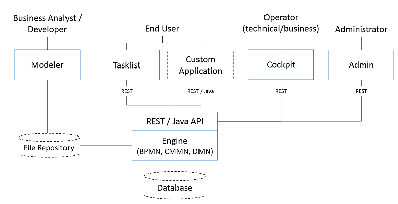
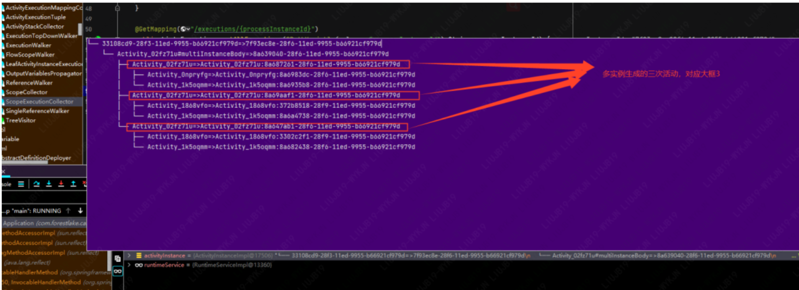
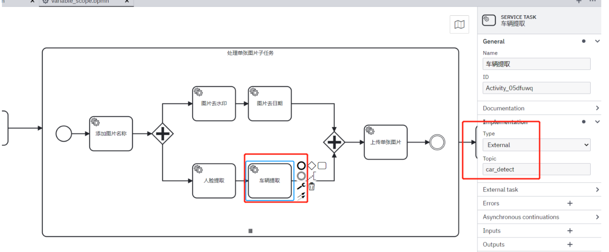
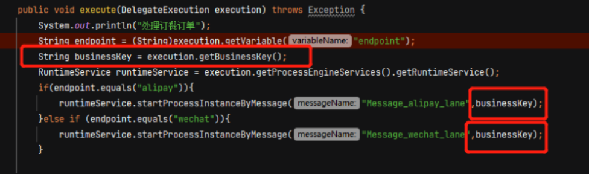
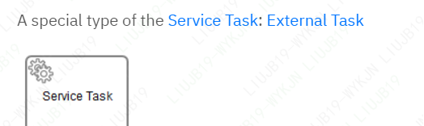
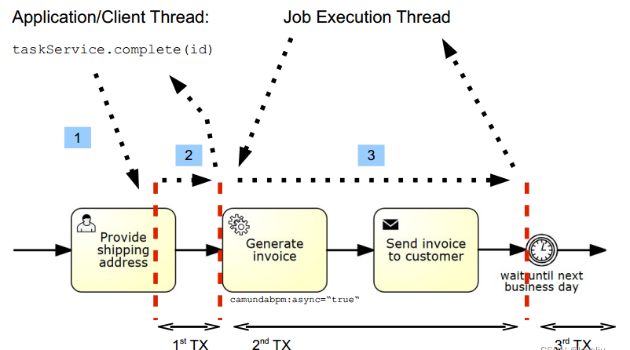
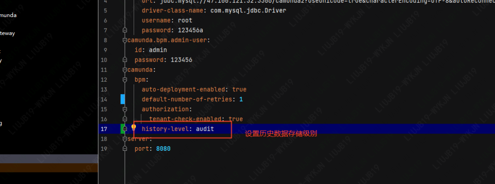
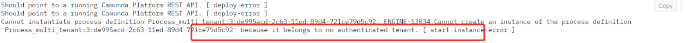

## 1. 整体架构

### 1.1. 全局架构图

 

* modeler

  模型设计器，独立工具

* File Repository

  存放模型的仓库

* Engine

  核心引擎，将模型文件解释成对象数据，并提供相关管理；

* api 

  提供java API,与rest api进行操作

* DataBase

  数据存储，支持常用的关系型数据库

* Tasklist

  任务列表，可以从管理界面查看

* Cockpit

  流程控制台，可以从管理界面操作

* Admin

  租户，用户，用户组，权限等管理操作，可以从管理界面操作

* Job executor

  处理定时任务与异步任务相关

### 1.2. 流程引擎架构

 

* **database**

  camunda7目前支持大多 数关系型数据库，camunda8云原生版本支持elasticsearch分布式存储，

* **public Api**

  提供JAVA API对部署，任务，流程实例等一系列操作；

* **Job Executor**

  提供对定时任务与异步任务的操作；

* **persistence** 

  数据持久化，采用mybatis框架；

* **BPMN2核心引擎：**

  加载BPMN流程

### 1.3. 基本概念

#### 1.3.1. 流程定义（Process Definition）

确定了流程的结构，设计的流程信息保存在xml文件中，部署到流程引擎中，引擎将xml信息解析成数据保存在数据库中，就是流程定义。
每次部署流程时，只要流程有变动，都会自动更新一个版本(version)，一个流程定义有一个definitionKey,就是流程BPMN xml中全局的ID,
每个version有一个definition ID ,由definitionKey:UUID

 

 

 

#### 1.3.2. 流程实例

是指根据流程定义开启一次实际的执行。可以把流程定义（Process definition）想像成JAVA中的类，流程实例(Process Instance)就相当于从这个类创建的对象。
流程定义如果被挂起（suspend）时，不能创建流程实例。就像是类中添加了private构造器一样。流程实例也可以被挂起，在高并发应用创建了大量流程实例时，经常会因为乐观锁导致直接删除正在执行的流程实例失败，这时可以采用先对流程实例挂起再删除

**流程执行（Process Execution）: **同果流程实例同时包含多个执行路径，比如并行网关或包含网关后面的并行任务，引擎内部会为每个路径创建一个execution。流程执行会组成一个树形结构，流程实例本身也是一个流程执行，并且是树结构中的根节点。**这个概念对局部变量的作用域可见性非常重要，否则在做高并发任务时，会有并发安全问题**

 


添加接口查询executions ，调用接口发现上图一共有6个executions，由于负面影响判断任务中有变量，多了一个scope

```
 @GetMapping("/executions/{processInstanceId}")
    public List<Execution> getAllExecutions(@PathVariable(value = "processInstanceId") String processInstanceId) {
        List<Execution> list = runtimeService.createExecutionQuery().processInstanceId(processInstanceId).list();
        return list;
    }
```


#### 1.3.3. 活动实例

活动实例概念类似于执行概念，但采用不同的视角

活动与执行的差异。

假设上述例子中并行路径只有两条，每个并行路径内部有两个任务，第一条：视频格式检查+淑黄鉴别  第二条：涉暴鉴别+负面影响 。

 

启动一个实例；

xiaoming账号登录模拟上传3个视频。wangbing登录完成两次涉暴任务，现在流程执行如下图

 

流程实例ID是：7f93ec8e-28f6-11ed-9955-b66921cf979d
调用：[http://localhost:8080/executions/](http://localhost:8080/executions/dc7562b7-28dc-11ed-bac3-b66921cf979d)7f93ec8e-28f6-11ed-9955-b66921cf979d 进断点查看一下执行和活动的数据，并与图上的数量比对
Activity_02fz71u 生成的三次多子流程多实例的3次活动

 

 生成的三次涉黄鉴别活动


Activity_0npryfg生成的一次涉暴鉴别活动

 

 

上面看完了当前的活动，再看一下执行。
当前执行涉及到6个变量范围，可以从调试中看到有六个ScopeExecution.
现在所有变量一共涉及到6种变量范围

 

当前有9次正在并行执行的task，对应9次ConcurrentExecution

 

从对比可以看出，活动（activity）只管当前的正激活的任务的状态，更注重任务本身的状态统计。
执行(execution)更像是流程执行中的token，不同的执行对应着不同范围的变量，执行可以看作是流程执行到哪里的指针

## 2. 运行态机制

### 2.2. 变量作用域

camunda中的变量主要有全局变量(variable)和局部变量(Local Variable).
前面我们使用的都是全局变量，就是整个流程实例中都可以访问的变量，作用域是整个流程实例。
现实开发中，有时候变量只希望变量部分范围可见，多实例任务时同一变量名会有多份不同数据，为了保持数据的并发安全，控制变量的作用域特别重要.

#### 2.2.1. 限制 

流程变量主要是用来方便流程流转的数据传递，大量的业务数据不要使用流程变量。最好只传一些状态数据，影响流程路径的业务数据。

流程引擎默认是给变量的内存空间是4M左右，这还包含了流程引擎内因变量，业务使用的在3M以内可以考虑是安全的

#### 2.2.2. 作用域

* 全局变量

  在整个流程实例中可见，任何地方设置新值会覆盖旧值。高作用域设置的

 

- a和b在根作用域上定义，任务A、任务B和任务C可以看到它们。
- c定义在子流程范围内，任务A和任务B可以看到它。
- b在任务A的活动范围内被再次定义，并且只能被任务A看到。它覆盖了根范围内的变量b。

全局变量传播

- 当变量合并到流程实例中时(例如，关于任务完成、消息关联等)，每个变量都从活动的范围传播到更高的范围。
- 当作用域包含具有相同名称的变量时，传播结束。在这种情况下，变量值被更新。
- 如果没有作用域包含这个变量，它将作为根作用域中的一个新变量被创建

 

任务B的任务通过变量b、c和d完成。变量b和c已经在更高的范围中定义，并使用新值进行更新。变量d以前不存在，它是在根作用域中创建的

* 局部变量

  局部变量只在设置的当前范围内可见，如果需要阻止变量范围自动传播，而是需要精准范围内的传播，可以使用局变量，再通过指定范围设置范围。

#### 2.2.3. 需求

假设用户上传一批图片数据，并行对所有图片进行处理，采用并行子流程，每个图片内部采用并行网关分两条路径并行处理，第一条路径，先处理图片去水印，再去日期，第二条路径，先对图片提取人脸数据，再提取车辆数据。再上传单张图片，所有图片处理完后再下载所有图片。通过这个任务，看一下各种环节的流程变量以及，如何准备控制变量范围，防止数据并发安全。

#### 2.2.4. 流程设计

全局设置

 

上传一批照片

 

子流程

 

添加图片名称

 

并行网关

 

图片去水印


图片去日期

 

人脸提取

 

车辆提取

 

上传单张图片

 

批量下载图片

 


#### 2.2.5. 业务任务代码

```
@Configuration
public class VariableScopeExternalTaskService {
    /**
     * 模拟上传一批一图片
     * @return
     */
    @Bean
    @ExternalTaskSubscription(topicName = "dispatch_tasks", processDefinitionKeyIn = {"Process_variable_scope"},lockDuration=50000)
    public ExternalTaskHandler dispatchTasks() {

        return (externalTask, externalTaskService) -> {
            System.out.println("上传一批图片");
            VariableMap variables = Variables.createVariables();
            List<Integer> pictureList = new ArrayList<>();
            //模拟上传50张图片
            for (int i=1;i<=20;i++){
                pictureList.add(i);
            }
            variables.put("pictures",pictureList);
             //所有图片集合变量范围需要传播，并且不会涉及到并发安全问题，使用全局变量即可
            externalTaskService.complete(externalTask,variables);

        };
    }

    /**
     * 添加图片名称
     * @return
     */
    @Bean
    @ExternalTaskSubscription(topicName = "add_pic_name", processDefinitionKeyIn = {"Process_variable_scope"},lockDuration=50000)
    public ExternalTaskHandler addPicName() {

        return (externalTask, externalTaskService) -> {
            System.out.println("-----------------进入添加图片名称----------------");
            Integer pictureId = externalTask.getVariable("picture");
            Map<String, Object> allVariables = externalTask.getAllVariables();
            allVariables.put("picName","pic_"+pictureId+".jpg");
            System.out.println("pictureId="+ pictureId+" ,picName"+"pic_"+pictureId+".jpg");
            externalTaskService.complete(externalTask,allVariables);

        };
    }

    /**
     * 去水印
     * @return
     */
    @Bean
    @ExternalTaskSubscription(topicName = "water_print_delete", processDefinitionKeyIn = {"Process_variable_scope"},lockDuration=50000)
    public ExternalTaskHandler waterPrintDelete() {

        return (externalTask, externalTaskService) -> {
            System.out.println("------------------------进入去水印任务------------------------");
            String picName = externalTask.getVariable("picName");
            Integer picId = externalTask.getVariable("picture");
            Date date = new Date();
            String dateStr = DateUtils.formatDate(date, "yyyy-MM-dd HH:mm:ss");
            System.out.println("picId="+picId+" ,picName="+picName+" ,date="+dateStr);

            VariableMap variables = Variables.createVariables();
            variables.put("picDate",dateStr);
            externalTaskService.complete(externalTask,variables);
        };
    }

    @Bean
    @ExternalTaskSubscription(topicName = "face_detect", processDefinitionKeyIn = {"Process_variable_scope"},lockDuration=50000)
    public ExternalTaskHandler faceDetect() {

        return (externalTask, externalTaskService) -> {
            System.out.println("------------------------进入人脸提取任务------------------------");
            Integer picId = externalTask.getVariable("picture");
            String picName = externalTask.getVariable("picName");
            String picFace = picId+"_face";
            System.out.println("picId="+picId+" ,picName="+picName+" ,picFace="+picFace);

            VariableMap variables = Variables.createVariables();
            variables.put("picFace",picFace);
            externalTaskService.complete(externalTask,variables);
        };
    }

    /**
     * 删除日期
     * @return
     */
    @Bean
    @ExternalTaskSubscription(topicName = "pic_date_delete", processDefinitionKeyIn = {"Process_variable_scope"},lockDuration=50000)
    public ExternalTaskHandler picDateDelete() {

        return (externalTask, externalTaskService) -> {
            System.out.println("------------------------进入删除日期任务------------------------");
            String picName = externalTask.getVariable("picName");
            Integer picId = externalTask.getVariable("picture");
            String picDate = externalTask.getVariable("picDate");
            String picIdUpperComplete = picId+"_upper_delete";
            System.out.println("picId="+picId+" ,picName="+picName+" ,date="+picDate+",picIdUpperComplete="+picIdUpperComplete);

            VariableMap variables = Variables.createVariables();
            variables.put("picIdUpperComplete",picIdUpperComplete);
            externalTaskService.complete(externalTask,variables);
        };
    }

    @Bean
    @ExternalTaskSubscription(topicName = "car_detect", processDefinitionKeyIn = {"Process_variable_scope"},lockDuration=50000)
    public ExternalTaskHandler carDetect() {

        return (externalTask, externalTaskService) -> {
            System.out.println("------------------------进入车辆提取任务------------------------");
            String picName = externalTask.getVariable("picName");
            Integer picId = externalTask.getVariable("picture");
            String picFace = externalTask.getVariable("picFace");
            String picIdLowerComplete = picId+"_lower_delete";
            System.out.println("picId="+picId+" ,picName="+picName+" ,picFace="+picFace+",picIdLowerComplete="+picIdLowerComplete);

            VariableMap variables = Variables.createVariables();
            variables.put("picIdLowerComplete",picIdLowerComplete);
            externalTaskService.complete(externalTask,variables);
        };
    }

    /**
     * 上传单个图片
     * @return
     */
    @Bean
    @ExternalTaskSubscription(topicName = "upload_single", processDefinitionKeyIn = {"Process_variable_scope"},lockDuration=50000)
    public ExternalTaskHandler uploadSingle() {

        return (externalTask, externalTaskService) -> {
            System.out.println("------------------------进入单个上传任务------------------------");
            String picName = externalTask.getVariable("picName");
            Integer picId = externalTask.getVariable("picture");
            System.out.println("picId="+picId+" ,picName="+picName);
            externalTaskService.complete(externalTask);
        };
    }

    @Bean
    @ExternalTaskSubscription(topicName = "download_pictures", processDefinitionKeyIn = {"Process_variable_scope"},lockDuration=50000)
    public ExternalTaskHandler downloadPictures() {

        return (externalTask, externalTaskService) -> {
            System.out.println("------------------------进入下载所有图片------------------------");
            String picName = externalTask.getVariable("picName");
            Integer picId = externalTask.getVariable("picture");
            System.out.println("picId="+picId+" ,picName="+picName);
            externalTaskService.complete(externalTask);
        };
    }

}
```

#### 2.2.6. 验证

代码中并发的地方采用了打印picId, picName，如果是线程安全的，数字应该是对应的。如果有一行数字对不上，说明存在并发安全问题。

 

使用全局变量很容易变量并发安全问题。从日志上可以看出主要是在两个并行网关之间的任务有并发安全问题

#### 2.2.7. 优化方案 

对子流程内部任务，及并行网关中的任务采用局部变量，防止范围传播，然后通过在任务上添加尾部监听器，采用代码监听器或者script监听器提升局部作用域为当前父级执行execution。局部变量默认只有当前任务可见。
script类型的监听器可以更好的让业务代码与camunda-platform解耦。listener需要在引擎端添加

使用JavaScript脚本添加end监听器，将外部任务上报给引擎的局部变量提升当父级执行的局部变量。达到精准控制变量范围。

 

 

 

 

 

将子任务和并行任务中添加了变量的地方改成添加局部变量，代码如下：

```
@Configuration
public class VariableScopeExternalTaskService {
    /**
     * 模拟上传一批一图片
     * @return
     */
    @Bean
    @ExternalTaskSubscription(topicName = "dispatch_tasks", processDefinitionKeyIn = {"Process_variable_scope"},lockDuration=50000)
    public ExternalTaskHandler dispatchTasks() {

        return (externalTask, externalTaskService) -> {
            System.out.println("上传一批图片");
            VariableMap variables = Variables.createVariables();
            List<Integer> pictureList = new ArrayList<>();
            //模拟上传50张图片
            for (int i=1;i<=20;i++){
                pictureList.add(i);
            }
            variables.put("pictures",pictureList);
             //所有图片集合变量范围需要传播，并且不会涉及到并发安全问题，使用全局变量即可
            externalTaskService.complete(externalTask,variables);

        };
    }

    /**
     * 添加图片名称
     * @return
     */
    @Bean
    @ExternalTaskSubscription(topicName = "add_pic_name", processDefinitionKeyIn = {"Process_variable_scope"},lockDuration=50000)
    public ExternalTaskHandler addPicName() {

        return (externalTask, externalTaskService) -> {
            System.out.println("-----------------进入添加图片名称----------------");
            Integer pictureId = externalTask.getVariable("picture");
//            Map<String, Object> allVariables = externalTask.getAllVariables();
            VariableMap localVariableMap = Variables.createVariables();
            localVariableMap.put("picName","pic_"+pictureId+".jpg");

//            allVariables.put("picName","pic_"+pictureId+".jpg");
            System.out.println("pictureId="+ pictureId+" ,picName"+"pic_"+pictureId+".jpg");
            externalTaskService.complete(externalTask,null,localVariableMap);

        };
    }

    /**
     * 去水印
     * @return
     */
    @Bean
    @ExternalTaskSubscription(topicName = "water_print_delete", processDefinitionKeyIn = {"Process_variable_scope"},lockDuration=50000)
    public ExternalTaskHandler waterPrintDelete() {

        return (externalTask, externalTaskService) -> {
            System.out.println("------------------------进入去水印任务------------------------");
            String picName = externalTask.getVariable("picName");
            Integer picId = externalTask.getVariable("picture");
            Date date = new Date();
            String dateStr = DateUtils.formatDate(date, "yyyy-MM-dd HH:mm:ss");
            System.out.println("picId="+picId+" ,picName="+picName+" ,date="+dateStr);

            VariableMap localVariables = Variables.createVariables();
            localVariables.put("picDate",dateStr);
            externalTaskService.complete(externalTask,null,localVariables);
        };
    }

    @Bean
    @ExternalTaskSubscription(topicName = "face_detect", processDefinitionKeyIn = {"Process_variable_scope"},lockDuration=50000)
    public ExternalTaskHandler faceDetect() {

        return (externalTask, externalTaskService) -> {
            System.out.println("------------------------进入人脸提取任务------------------------");
            Integer picId = externalTask.getVariable("picture");
            String picName = externalTask.getVariable("picName");
            String picFace = picId+"_face";
            System.out.println("picId="+picId+" ,picName="+picName+" ,picFace="+picFace);

            VariableMap localVariables = Variables.createVariables();
            localVariables.put("picFace",picFace);
            externalTaskService.complete(externalTask,null,localVariables);
        };
    }

    /**
     * 删除日期
     * @return
     */
    @Bean
    @ExternalTaskSubscription(topicName = "pic_date_delete", processDefinitionKeyIn = {"Process_variable_scope"},lockDuration=50000)
    public ExternalTaskHandler picDateDelete() {

        return (externalTask, externalTaskService) -> {
            System.out.println("------------------------进入删除日期任务------------------------");
            String picName = externalTask.getVariable("picName");
            Integer picId = externalTask.getVariable("picture");
            String picDate = externalTask.getVariable("picDate");
            String picIdUpperComplete = picId+"_upper_delete";
            System.out.println("picId="+picId+" ,picName="+picName+" ,date="+picDate+",picIdUpperComplete="+picIdUpperComplete);

            VariableMap localVariables = Variables.createVariables();
            localVariables.put("picIdUpperComplete",picIdUpperComplete);
            externalTaskService.complete(externalTask,null,localVariables);
        };
    }

    @Bean
    @ExternalTaskSubscription(topicName = "car_detect", processDefinitionKeyIn = {"Process_variable_scope"},lockDuration=50000)
    public ExternalTaskHandler carDetect() {

        return (externalTask, externalTaskService) -> {
            System.out.println("------------------------进入车辆提取任务------------------------");
            String picName = externalTask.getVariable("picName");
            Integer picId = externalTask.getVariable("picture");
            String picFace = externalTask.getVariable("picFace");
            String picIdLowerComplete = picId+"_lower_delete";
            System.out.println("picId="+picId+" ,picName="+picName+" ,picFace="+picFace+",picIdLowerComplete="+picIdLowerComplete);

            VariableMap localVariables = Variables.createVariables();
            localVariables.put("picIdLowerComplete",picIdLowerComplete);
            externalTaskService.complete(externalTask,null,localVariables);
        };
    }

    /**
     * 上传单个图片
     * @return
     */
    @Bean
    @ExternalTaskSubscription(topicName = "upload_single", processDefinitionKeyIn = {"Process_variable_scope"},lockDuration=50000)
    public ExternalTaskHandler uploadSingle() {

        return (externalTask, externalTaskService) -> {
            System.out.println("------------------------进入单个上传任务------------------------");
            String picName = externalTask.getVariable("picName");
            Integer picId = externalTask.getVariable("picture");
            System.out.println("picId="+picId+" ,picName="+picName);
            externalTaskService.complete(externalTask);
        };
    }

    @Bean
    @ExternalTaskSubscription(topicName = "download_pictures", processDefinitionKeyIn = {"Process_variable_scope"},lockDuration=50000)
    public ExternalTaskHandler downloadPictures() {

        return (externalTask, externalTaskService) -> {
            System.out.println("------------------------进入下载所有图片------------------------");
            String picName = externalTask.getVariable("picName");
            Integer picId = externalTask.getVariable("picture");
            System.out.println("picId="+picId+" ,picName="+picName);
            externalTaskService.complete(externalTask);
        };
    }
```

#### 2.2.8. 验证

### 2.3. 业务KEY

#### 2.3.1. 作用

BusinessKey业务键，从名称上可以看出可能与业务强相关，**businessKey设计的目的就是为了将流程引擎数据与业务数据关联上**

 

比如线上订餐采用了涉及到订单系统，支付系统，用户下一次订单会启动两个流程，流程引擎中的数据可以通过将订单Id作为BusinessKey进行关联。这样业务在查询此订单的流程数据时，可以通过businessKey查到所有相关流程实例

#### 2.3.2. 与流程变量的区别

与业务数据关联的方法除了BusinessKey外，还可能使用流程变量。但为什么有了流程变量还要设计BusinessKey？理由有如下两点：

- **性能**

  按业务键查询通常比按变量值查询更有效。例如，它不需要与变量表连接。

- **可见性**

  在像Camunda Cockpit这样的应用程序中，业务键显示在显著位置**。**

#### 2.3.3. 使用

启动流程实例的接口添加businessKey

 

发送信号的任务添加businessKey

 

 

 

restApi查询所有

 

 


## 3. api定义

流程引擎（ProcessEngine）是整个camunda工作流的大心脏，初始化好流程引擎，就可以通过它获取各种API的操作。提供的所有API都是线程安全的

 

### 3.1. java-api

### 3.2. rest-api

RestApi是指restful [api](https://so.csdn.net/so/search?q=api&spm=1001.2101.3001.7020)的简写，restful是一种接口设计风格，一句话就是对接口的定义提出一组标准.

* 每个URL代表一种资源，独一无二；
* 无状态，访问不同的实例结果一致；
* 遵守GET POST PUT PATCH DELETE对应相应的操作；
* 支持路径参数；
* 不用代码开发，直接就可以通过URL获取到数据；

设计完善的RestApi 最大的好处就是与语言无关。

camunda提供了非常完整的API，文档也非常齐全。
参考文档：https://docs.camunda.org/manual/7.17/reference/rest/

如果camunda提供的RestApi不满足业务要求，还可以通过使用springboot引擎端借助流程引擎API自己提供额外的rest api。
如果流程引擎API也不能满足要求，还可以通过直接通过SQL查询提供额外的Rest Api。

#### 3.2.1. RestApi调用

在实际开发中使用调用RestApi时，需要将入参request，返回response的json数据转换成对象，这些对象可能非常繁琐，如果是java客户端，可以使用以下方法。
https://camunda-community-hub.github.io/camunda-platform-7-rest-client-spring-boot/7.17.1/getting-started.html

#### 3.2.2. postman导入

#### 3.2.3. 外部任务

外部任务是camunda非常重要的特性，它是基于restapi实现的。

 

外部任务的执行大体分三步：

* **Process Engine**: Creation of an external task instance
* **External Worker**: Fetch and lock external tasks（根据TOPIC订阅拉取）
* **External Worker & Process Engine**: Complete external task instance

当第3步当处理业务失败时，还可以上报异常给引擎，可以从控制台可视化准确定位到流程实例失败的原因，当然，上报异常时，在异常没消失前会永远卡在失败节点，重试成功后异常会消失，流程往下走

 

**长轮询（Long Polling ）机制**

官网参考：https://docs.camunda.org/manual/7.17/user-guide/process-engine/external-tasks/
由于外部任务是通过rest api的原理实现的，并且由客户端主动拉取任务，延迟较小
如果采用普通的HTTP请求定时轮询拉取任务，摘取时间间隔慢了确实会有延迟，轮询太频繁资源开销确实很大，在高并发项目中这没法接受。

因此客户端都设计为长轮询的模式拉取任务，如果没有外部任务可用，请求会被服务器挂起并加锁，防止一个任务被 其他客户端重复消费，一旦出现新的外部任务，就重新激活请求并执行响应。请求挂起的时间可以通过订阅参数配置超时时间，超时后释放锁且不再挂起

 


## 4. 数据模型

 

### 4.1. 表名规则

camunda7.17.0共有49张表，都以ACT_开头，共分为五大类：

* ACT_GE_*

  GE为general缩写，表示通用数据，用于不同场景，有3张表；

- ACT_HI_*:

  HI为history缩写，表示历史操作数据相关，比如流程实例，流程变量，任务等数据，数据存储级别可以设置，共18张表；

- ACT_ID_*

   'ID’为identity缩写，表示组织用户信息，比如用户，组，租户等，共6张表；

- ACT_RE_*

  'RE’为repository缩写，表示流程资源存储，这个前缀的表包含了流程定义和流程静态资源（图片，规则等），共6张表；

- ACT_RU_*

  'RU’为runtime缩写，表示流程运行时。 这些运行时的表，包含流程实例，任务，变量，Job等运行中的数据。 Camunda只在流程实例执行过程中保存这些数据，在流程结束时就会删除这些记录， 这样运行时表的数据量最小，可以最快运行。共16张表

### 4.2. 数据表

| **分类**           | **表名**                | **职责**                                             | **是否永久保存**   |
| ------------------ | ----------------------- | ---------------------------------------------------- | ------------------ |
| 流程通用数据       | act_ge_bytearray        | 流程引擎二进制数据表                                 | 是                 |
|                    | act_ge_property         | 流程引擎属性配置表                                   | 是                 |
|                    | act_ge_schema_log       | 数据库脚本执行日志表                                 | 是                 |
| 流程历史记录       | act_hi_actinst          | 历史的活动实例表                                     | 根据配置的级别决定 |
|                    | act_hi_attachment       | 历史的流程附件表                                     |                    |
|                    | act_hi_batch            | 历史的批处理记录表                                   |                    |
|                    | act_hi_caseactinst      | 历史的CMMN活动实例表                                 |                    |
|                    | act_hi_caseinst         | 历史的CMMN实例表                                     |                    |
|                    | act_hi_comment          | 历史的流程审批意见表                                 |                    |
|                    | act_hi_dec_in           | 历史的DMN变量输入表                                  |                    |
|                    | act_hi_dec_out          | 历史的DMN变量输出表                                  |                    |
|                    | act_hi_decinst          | 历史的DMN实例表                                      |                    |
|                    | act_hi_detail           | 历史的流程运行时变量详情记录表                       |                    |
|                    | act_hi_ext_task_log     | 历史的外部任务执行记录                               |                    |
|                    | act_hi_identitylink     | 历史的流程运行过程中任务关联的用户表，主要是usertask |                    |
|                    | act_hi_incident         | 历史的流程异常事件记录表                             |                    |
|                    | act_hi_job_log          | 历史的流程作业记录表                                 |                    |
|                    | act_hi_op_log           | 历史的操作记录，主要是流程定义的变更，创建等         |                    |
|                    | act_hi_procinst         | 历史的流程实例                                       |                    |
|                    | act_hi_taskinst         | 历史的任务实例                                       |                    |
|                    | act_hi_varinst          | 历史的流程变量记录表                                 |                    |
| 用户，组，租户数据 | act_id_group            | 用户组信息表                                         | 是                 |
|                    | act_id_info             | 用户扩展信息表                                       |                    |
|                    | act_id_membership       | 用户与用户组的关系表                                 |                    |
|                    | act_id_tenant           | 租户信息表                                           |                    |
|                    | act_id_tenant_member    | 租户成员表                                           |                    |
|                    | act_id_user             | 用户信息表                                           |                    |
| 流程资源存储       | act_re_camformdef       | camunda表单定义表                                    | 是                 |
|                    | act_re_case_def         | CMMN案例管理模型定义表                               |                    |
|                    | act_re_decision_def     | DMN决策模型定义表                                    |                    |
|                    | act_re_decision_req_def | DMN决策请求定义表                                    |                    |
|                    | act_re_deployment       | 流程部署表                                           |                    |
|                    | act_re_procdef          | BPMN流程模型定义表                                   |                    |
| 流程运行时         | act_ru_authorization    | 流程运行时授权表                                     | 是                 |
|                    | act_ru_batch            | 流程执行批处理表                                     | 否                 |
|                    | act_ru_case_execution   | CMMN案例运行执行表                                   | 否                 |
|                    | act_ru_case_sentry_part | 运行时sentry日志监控表                               | 否                 |
|                    | act_ru_event_subscr     | 流程事件订阅表                                       | 是                 |
|                    | act_ru_execution        | BPMN流程运行时记录表                                 | 否                 |
|                    | act_ru_ext_task         | 外部任务执行表                                       | 否                 |
|                    | act_ru_filter           | 流程定义查询配置表                                   | 是                 |
|                    | act_ru_identitylink     | 运行时流程人员表                                     | 否                 |
|                    | act_ru_incident         | 运行时异常事件表                                     | 否                 |
|                    | act_ru_job              | 流程运行时作业表                                     | 否                 |
|                    | act_ru_jobdef           | 流程作业定义表                                       | 是                 |
|                    | act_ru_meter_log        | 流程运行时度量日志表                                 | 是                 |
|                    | act_ru_task             | 流程运行时任务表                                     | 否                 |
|                    | act_ru_variable         | 流程运行时变量表                                     | 否                 |
|                    | act_ru_task_meter_log   | 流程运行时任务度量表                                 | 是                 |

## 5. 流程事务

camunda事务与关系型数据库中的事务有点区别，但是通过关系型数据库事务实现的，camunda一个事务是两个wait state之间的部分。
camunda流程引擎是被动触发的，如启动流程实例、complete一次task， 发送一次执行信号，引擎内部的job executor触发等，
一次事务没结束时，数据没有被持久化到DB，相关数据表会加乐观锁。此时如果在事务中断点停止，其他访问（如访问cockpit）会被挂起，

一个事务间的所有活动要么同时成功， 要么同时失败。

### 5.1. 基本特性

#### 5.1.1. 等待状态

wait states是camunda事务的边界。位于等待状态的任务时，状态已经提交到数据库 。
以下元素，通常是处于wait state状态

 

 

 

#### 5.1.2. 事务边界

 

上图用户任务，定时事件都是wait state元素，中间形成第一个事务，如果业务任务(validate address)失败，会回滚到上次wait state元素处，也就是人工任务(provide shipping
address);

#### 5.1.3. 异步连续

Asynchronous Continuations

 

图上生成发票和发送发票给顾客是第二个事务，采用了异步延续，如果失败，并不会让流程回滚。
异步延续会创建事务边界。如图这种非异步延续的，在抛异常时会回滚到用户任务处。抛异常的任务状态不会提交到引擎数据库中

job executor发起的执行引擎OptimisticLockingException 乐观锁异常时，会自动重试。
其他外部调用引起的OptimisticLockingException 需要根据业务要求进行处理，引擎数据会回滚到上个保存点（wait state）。

#### 5.1.4. 乐观锁

camunda采用乐观锁来控制并发案例，涉及到并发控制的表中都会有字段 REV_ 版本号，每次修改都会更新版本号，查询数据时会查询指定版本的数据。乐观锁机制大大提高了camunda在高并发场景的性能。

job executor发起的执行引擎OptimisticLockingException 乐观锁异常时，会自动重试。
其他外部调用引起的OptimisticLockingException 需要根据业务要求进行处理，引擎数据会回滚到上个保存点（wait state） 

### 5.2. 验证

不使用异步延续

 

 

引擎端实现生成发票抛异常


启动实例后，可以发现代码进入到generate invoice任务的代码，并抛出异常，任务回滚到上一步的人工任务

 

使用异步延续

使用异步延续执行都是由job executor后台执行的，application.yml中default-number-of-retries一定要大于0，否则不执行任务，直接报incident

 

重启测试，发现任务抛异常时，并没有回滚到前面的人工任务

 

异步延续可以改变事务的边界，控制异常回滚的上一个savepoint，异步延续不要误认为任务执行是异步的，任务还是一样执行

## 6. 高可用

实际生产环境中流程引擎一般处理整个业务流程的核心地位，引擎服务一量不能正常使用，整个系统将会不能正常提供服务。为此，引擎高可用方案在生产环境是必不可少的一个环节，特别是SAAS模式。嵌入使用模式，引擎生命周期与业务系统一致。

 

camunda7目前支持到共享数据库。性能一般可以得到保证

* 因为数据库数据不会太大，运行时的数据存储与历史数据分开存储，运行时数据ACT_RU*开头的表数据量大，但结束就删除了；

* 只有历史数据ACT_HI开头的表，会有大量数据，可以设置保存时间与保存级别。况且历史数据不会影响到执行速度

   

   

  

https://docs.camunda.org/manual/7.17/introduction/architecture/ 官方文档高可用方案
官方没有提供直接开箱即用的高可用方案，需要使用方自己解决。

由于REST API无状态

单个流程引擎实例不维护跨事务的会话状态。每当流程引擎运行一个事务时，完整的状态就会刷新到共享数据库。这使得将在同一流程实例中工作的后续请求路由到不同的集群节点成为可能。这个模型非常简单，易于理解，并且在部署集群安装时限制有限。就流程引擎而言，放大设置和故障转移设置之间没有区别(因为流程引擎在事务之间不保持会话状态)
权重路由即可

 

控制台API有状态。由于 控制台需要登录后再进行操作，每个实例会保存自己的登录[session](https://so.csdn.net/so/search?q=session&spm=1001.2101.3001.7020)，即登录态，这就要求路由的时候需要定向路由，如果使用权重或轮询的方式路由，会有可能要多次登录的不良体验。IP路由规则。

## 7. 常见配置

### 7.1. 历史数据配置

camunda工作流的数据都存储在数据库中，历史数据会非常大，可以根据需要，选择存储历史数据的级别，camunda支持的级别如下：

* **full级别**

  所有历史数据都被保存，包括变量的更新。

* audit级别

  只有历史的流程实例，活动实例，表单数据等会被保存。

* auto级别

   数据之前配置的是什么级别就是用什么级别，如果没配置则是audit级别。

* none级别

  不存储历史数据。

springboot配置中可以加入:

```
camunda.bpm.history-level=audit
```

**生产环境中建议使用audit级别，开发测试环境可以使用full级别，方便调试查找问题。**

### 7.2. 自动部署

流程引擎中默认会自动对resources/bpmn目录下的bpmn进行部署。如果采用rest api或者model直接部署，可以添加配置进行关闭。
引擎端同时支持多个项目在使用时，不可能因为某个项目部署流程重启引擎，一般会通过rest api进行部署。
springboot配置中可以加入:

```
camunda.bpm.auto-deployment-enabled=false
###自动部署resources下面的bpmn文件
```

### 7.3. 接口鉴权 

https://docs.camunda.org/manual/7.17/reference/rest/overview/authentication/
前面所有的示例中外部任务订阅是通过rest api的基础上实现的，都没有带任何身份校验直接可以访问，数据案例存在很大问题，生产环境中不可接受。

#### 7.3.1. 添加权限过滤器

这个配置方法官网只给出了web.xml中配置方法，以下是工作中springboot中配置使用过的方法。
com.forestlake.camunda.AuthFilterConfig

```
@Configuration
public class AuthFilterConfig implements ServletContextInitializer {
    @Override
    public void onStartup(ServletContext servletContext) throws ServletException {
        FilterRegistration.Dynamic authFilter = servletContext.addFilter("camunda-auth", ProcessEngineAuthenticationFilter.class);
        authFilter.setAsyncSupported(true);
        authFilter.setInitParameter("authentication-provider","org.camunda.bpm.engine.rest.security.auth.impl.HttpBasicAuthenticationProvider");
        authFilter.addMappingForUrlPatterns(null,true,"/engine-rest/*");
    }
}
```

#### 7.3.2. 配置账号

控制台添加用户javaclient，密码123456，并加入一个组中获取组权限

 


#### 7.3.3. 客户端配置

```
camunda.bpm.client.basic-auth.username=javaclient
camunda.bpm.client.basic-auth.password=123456
```

## 8. 多租户设计

多租户指的是一个camunda引擎服务于一个以上的租户。对于每个租户，都应该做出一定的隔离保证。例如，一个租户的流程实例不应该干扰另一个租户的流程实例。
https://docs.camunda.org/manual/7.17/user-guide/process-engine/multi-tenancy/
实现方式：

* 每个租户使用一个流程引擎，数据库每个租户一个，数据库级别的隔离，数据完全不在一起，租户标识只是提示引擎去哪个数据库查数据；

* 只使用一个流程引擎，并将数据与租户标识符关联起来，SAAS用法；

   

  - 所有租户数据存在同一个数据库，流程引擎服务共用；
  - 所有数据都必须与租户唯一TENANT_ID进行关联 ;
  - 流程引擎一般独立于业务系统使用。

  Tenant_Id一般在部署流程的时候就开始关联，同一个流程定义可以同时给多个租户部署。没有关联Tenant_Id的流程定义属于所有租户

这两种方法在数据隔离级别、维护工作量和可伸缩性方面各不相同。这两种方法的组合也是可能的。

### 8.1. 添加租户绑定用户

增加两个租户shanghai beijing，同时创建两个组shanghai(上海租户组)，beijing(北京租户组)，上海租户组分别绑定用户xiaoming,wangbing，北京租户组zhangsan,wangwu，以上四个用户先去掉管理员组。
北京组有wangwu zhangsan两们用户

 

上海组有两位wangbing xiaoming两们用户

 

北京租户关系北京组，关联后，北京组的用户wangwu zhangsan直接就是北京租户的成员

 

 

 

 

 

 

 

 

 

### 8.2. 开户租户数据校验

authorization. tenant-check-enabled= true 

 

控制台分别使用北京组，上海组 ，管理员账号登录启动流程，查看哪些流程可以启动
xiaoming（上海组）登录，只能看到多组户shanghai

admin管理员登录，全可以部署

尝试用北京组zhangsan通过restApi启动上海租户的流程，结果报错，it belongs to no authenticated tenant

 