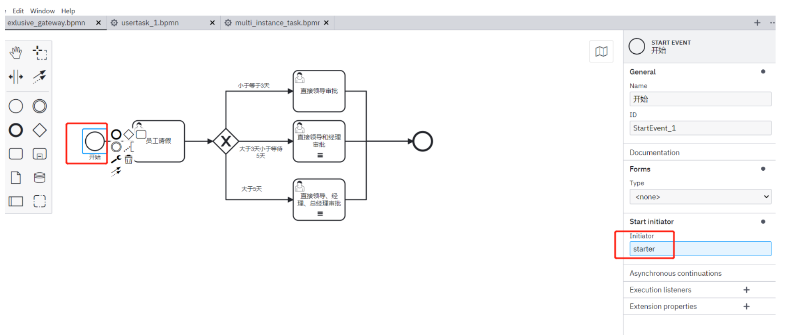
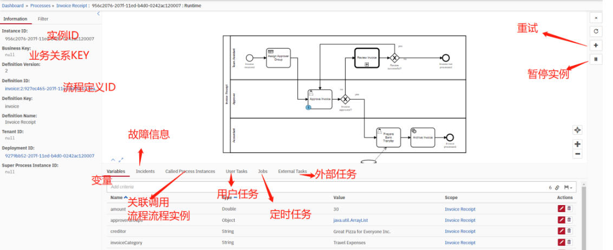
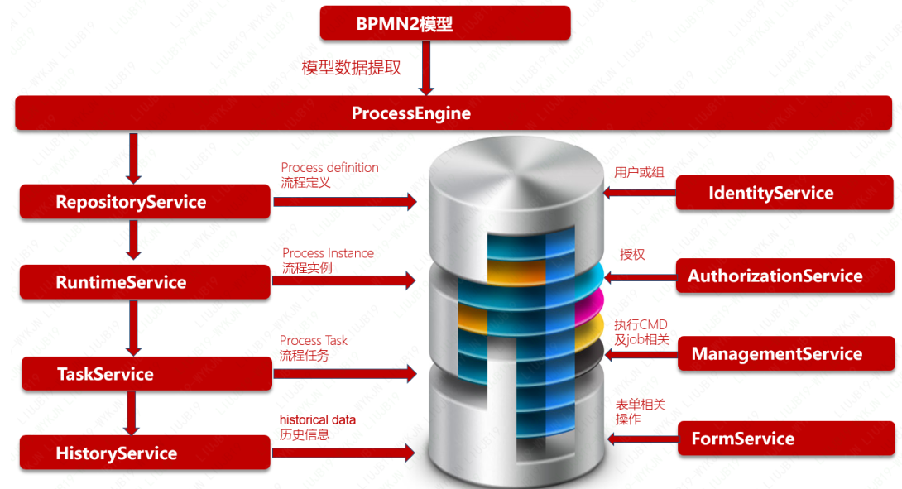
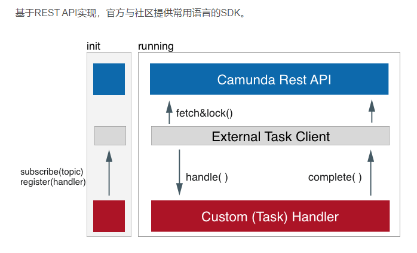

[TOC]


## 工作流（WorkFlow）

### 什么是工作流

历史发展：

> 工作流的理论起源于70年代中期办公的自动化领域。90年代。工作流技术的研究与开发进一步发展。1993年8月，成立第一个工作流技术标准话的工业组织WFMC（工作流管理联盟）。现在，工作流管理系统已由最初的无纸化办公环境，转而成为企业试下业务流程自动执行的必要工具。

定义：

> 工作流是指一类能够完全自动执行的经营过程，根据一系列的过程规则，将文档、信息或任务在不同的执行者之间进行传递与执行。

 

### 应用场景

- 传统办公自动化业务；

- 低代码平台，标准化输入输出，功能独立化的业务组件，可以通过拖拽改变流程组成新的业务；

- 微服务业务组装器；

- 微服务状态机；

   

### BPMN

#### BPMN概念

BPMN（Business Process Modeling Notation）指业务流程建模与标记，由BPMI Notation Working Group超过2年的努力于2004年5月对外发布了BPMN 1.0 规范，后BPMI并入到OMG组织，OMG于2011年推出BPMN2.0标准
BPMN定义了业务流程图，其基于流程图技术，同时为创建业务流程操作的图形化模型进行了裁减。业务流程的模型就是图形化对象的网图，包括活动（也可以说工作）和定义操作顺序的流控制。

BPMN官网：https://www.bpmn.org/

#### 主要元素

BPMN元素的关系与作用，具体可以查看官网


## 开源流程引擎

​	市场上比较有名的开源流程引擎有osworkflow、jbpm、activiti、flowable、camunda。其中：Jbpm4、Activiti、Flowable、camunda四个框架同宗同源，祖先都是Jbpm4，开发者只要用过其中一个框架，基本上就会用其它三个。低代码平台、办公自动化（OA）、BPM平台、工作流系统均需要流程引擎功能，对于市场上如此多的开源流程引擎，哪个功能和性能好，该如何选型呢？

 

 

### 主流引擎介绍

* JBPM

  JBPM由JBoss公司开发，目前最高版本JPBM7，不过从JBPM5开始已经跟之前不是同一个产品了，JBPM5的代码基础不是JBPM4，而是从Drools Flow重新开始，基于Drools Flow技术在国内市场上用的很少，所有不建议选择jBPM5以后版本，jBPM4诞生的比较早，后来JBPM4创建者Tom Baeyens离开JBoss后，加入Alfresco后很快推出了新的基于jBPM4的开源工作流系统Activiti, 另外JBPM以hibernate作为数据持久化ORM也已不是主流技术，现在时间节点选择流程引擎，JBPM不是最佳选择。

  官方网站：https://www.jbpm.org/

* Activiti

  activiti由Alfresco软件开发，目前最高版本activiti 7。activiti的版本比较复杂，有activiti5、activiti6、activiti7几个主流版本，选型时让人晕头转向，有必要先了解一下activiti这几个版本的发展历史。activiti5和activiti6的核心leader是Tijs Rademakers，由于团队内部分歧，在2017年时Tijs Rademakers离开团队，创建了后来的flowable, activiti6以及activiti5代码已经交接给了 Salaboy团队, activiti6以及activiti5的代码官方已经暂停维护了, Salaboy团队目前在开发activiti7框架，activiti7内核使用的还是activiti6，并没有为引擎注入更多的新特性，只是在activiti之外的上层封装了一些应用。结论是activiti谨慎选择。

  官方网站：https://www.activiti.org/

* flowable

  flowable基于activiti6衍生出来的版本，flowable目前最新版本是v6.6.0，开发团队是从activiti中分裂出来的，修复了一众activiti6的bug，并在其基础上研发了DMN支持，BPEL支持等等，相对开源版，其商业版的功能会更强大。以flowable6.4.1版本为分水岭，大力发展其商业版产品，开源版本维护不及时，部分功能已经不再开源版发布，比如表单生成器（表单引擎）、历史数据同步至其他数据源、ES等。Flowable 是一个使用 Java 编写的轻量级业务流程引擎，使用 Apache V2 license 协议开源。

  2016 年 10 月，Activiti 工作流引擎的主要开发者离开 Alfresco 公司并在 Activiti 分支基础上开启了 Flowable 开源项目。基于 Activiti v6 beta4 发布的第一个 Flowable release 版本为6.0。Flowable 项目中包括 BPMN（Business Process Model and Notation）引擎、CMMN（Case Management Model and Notation）引擎、DMN（Decision Model and Notation）引擎、表单引擎（Form Engine）等模块。

  官方网站：
  https://flowable.com/open-source/

* Camunda

  Camunda基于activiti5，所以其保留了PVM，最新版本Camunda7.15，保持每年发布2个小版本的节奏，开发团队也是从activiti中分裂出来的，发展轨迹与flowable相似，同时也提供了商业版，不过对于一般企业应用，开源版本也足够了，强烈推荐camunda流程引擎，功能和性能表现稳定。


### camunda

选择camunda的理由：

（1）通过压力测试验证Camunda BPMN引擎性能和稳定性更好。

（2）功能比较完善，除了BPMN，Camunda不仅带有引擎，还带有非常强大的工具，用于建模，任务管理，操作监控和用户管理，所有这些都是开源的

#### 核心特性

其它的功能：

- 高性能（乐观锁，缓存机制）
- 高扩展性
- 高稳定性
- **独有的外部任务模式**
- 完善rest api
- 支持多租户
- 优秀的流程设计器

#### 对比分析

这里主要比较flowable和camunda

##### 功能对比

> 由于Flowable与Camunda好多功能都是类似的，因此在这里重点罗列差异化的功能
>
> （1）camunda支持流程实例的迁移，比如同一个流程有多个实例，多个流程版本，不同流程实例运行在不同的版本中，camunda支持任意版本的实例迁移到指定的流程版本中，并可以在迁移的过程中支持从哪个节点开始。
>
> （2）camunda基于PVM技术，所以用户从Activii5迁移到camunda基本上毫无差异。flowable没有pvm了，所以迁移工作量更大（实例的迁移，流程定义的迁移、定时器的迁移都非常麻烦）。
>
> （3） **camunda对于每一个CMD命令类都提供了权限校验机制**，flowable没有。
>
> （4）camunda继续每一个API都有批处理的影子，flowable几乎没有。比如批量挂起流程、激活流程等，使用camunda可以直接使用API操作，使用Flowable则只能自己去查询集合，然后循环遍历集合并操作。
>
> （5）**camunda很多API均支持批处理**，在批量处理的时候可以指定是异步方式操作或者是同步方式操作。异步的话定时器会去执行。Flowable没有异步批处理的机制。比如批量异步删除所有的历史数据。
>
> （6）camunda启动实例的时候支持从哪个节点开始，而不是仅仅只能从开始节点运转实例。Flowable仅仅只能从开始节点运转实例。
>
> （7）**camunda支持任意节点的跳转**，可以跳转到连线也可以跳转到节点，并且在跳转的过程中支持是否触发目标节点的监听器。flowable没有改原生API需用户去扩展。
>
> （8）camunda支持双异步机制，第一个异步即节点可以异步执行，第二个异步方式是：完成异步任务后，还可以继续异步去执行任务后面的连线。所以称之为双异步机制，flowable只有第一种异步方式。
>
> （9）**camunda支持多种脚本语言**，这些脚本语言可以在连线上进行条件表达式的配置，开箱即用。比如python、ruby、groovy、JUEL。flowable仅仅支持JUEL、groovy。开箱即用的意思就是如果想用python直接引入jython包就可以用了，不需要额外配置。
>
> （10）**camunda支持外部任务**，比如我们有时候想在一个节点中执行调用第三方的API或者完成一些特定的逻辑操作，就可以使用外部任务，外部任务有两种表，并支持第三方系统定期来抓取并锁定外部任务，然后执行业务完毕之后，完成外部任务，流程实例继续往下执行。外部任务的好处就是解决了分布式事物的问题。在flowable中我们可以使用httpTask任务，我个人更倾向于camunda外部任务，因为这个外部任务有外部系统决定什么时候完成，httpTask是不等待任务，实例走到这个节点之后，调用一个api就直接往下跑了，外部任务不会继续往下跑，有外部系统去决定啥时候往下跑。
>
> （11）camunda支持为用户定制一些个性化的偏好查找API，比如张三每次查询任务的时候，一般固定点击某某三个查询条件过滤数据，使用camunda就可以将这三个查询条件进行持久化，下次张三来了，就可以直接根据他的偏好进行数据的过滤，类似机器学习。
>
> （12）camunda支持历史数据的批量删除或者批量迁移到其他介质，比如批量迁移到es，flowable没有该机制。
>
> （13）camunda支持在高并发部署流程的时候，是否使用锁机制，flowable没有该机制。
>
> （14） camunda支持单引擎多组合、多引擎多库。flowable仅仅支持单引擎多组合。
>
> （15） camunda支持流程实例跨流程定义跳转，flowable没有该机制。
>
> （16） camunda支持分布式定时器，flowable没有该机制。
>
> （17） flowable支持nosql,camunda只有nosql的解决方案。
>
> （18）camunda支持优化流程，以及了解流程引擎的瓶颈所在和每个环节的耗时，flowable没有该机制。
>
> （19） camunda修改了流程模板xml解析方式，相比flowable性能更好。
>
> （20）camunda在解析流程模板xml的时候，去除了activiti5的双解析机制，相对而言耗时时间更短。flowable没有了pvm所以规避了双解析机制。
>
> （21）camunda可以在任意节点添加任意的属性，flowable原生API没有，需要自己扩展。
>
> （22）camunda框架没有为流程生成图片的API(所有流程图展示以及高亮均在前端动态计算)，
> activiti5/6/flowable5/flowable6有图片生成以及高亮的API.
>
> （23）camunda可以在节点中定义定时作业的优先级，也可以在流程中进行全局优先级的定义。当节点没有定义优先级的时候可以使用全局的优先级字段。
> activiti5/6/flowable5/flowable6没有该功能。
>
> （24）camunda可以在流程中定义流程的tag标记，
> activiti5/6/flowable5/flowable6没有改功能。
>
> （25）
> camunda/activiti5/6/flowable5/flowable6 均不支持国产数据库，比如人大金仓 和 达梦。
>
> （26）flowable6支持LDAP，openLDAP,camunda不支持。activiti5不支持。

##### 性能对比

同等条件下测试，camunda性能比flowablet提升最小10%，最大39%

 

更详细内容https://lowcode.blog.csdn.net/article/details/109030329

### camunda现状

一年发形两个版本
五年内保证，camunda7 与camunda8并行开发与维护。
https://camunda.com/about/customers/ 官网在册企业


### 文档资料

官方文档：https://docs.camunda.org/manual/7.17/
论坛：https://forum.camunda.io/ 有问题可以在论坛提问或搜索，会有人回答
github社区：https://github.com/camunda-community-hub
github官方开源库：https://github.com/camunda
国内开源社区：https://www.oschina.net/informat/camunda

### 小结

推荐使用camunda（流程引擎）+bpmn-js（流程设计器）组合，camunda在功能方面比flowable、activiti流程引擎强大，性能和稳定性更突出

## camunda使用

camunda有多种使用方式，此处先使用独立平台的方式部署引擎，这种用法适合分布式，微服务化，多语言异构系统的使用方式。是官方推荐的使用方式。
camunda-platform-run支持的运行方式有多种，包括：

- Apache tomcat
- JBoss EAP/wildfly
- IBM WebShpere
- Oracle WebLogic
- Docker
- Spring boot启动

### 使用方式

#### 引擎嵌入用法

将camunda引擎与业务系统整合到一起，适合java单体小型项目，流程引擎的生命周期与应用程序相同，可以使用引擎的所有内部API直接调用

 

优点：使用方便，不用单独部署和维护，更加灵活。
缺点：与业务深度耦合，只能本项目使用。

#### 组件式用法

   组件式用法流程引擎在运行时容器(Servlet容器、应用程序服务器……)中启动。流程引擎作为容器服务提供，可以由部署在容器内的所有应用程序共享。这个概念可以与运行时提供的JMS消息队列进行比较，它可以被所有应用程序使用。流程部署和应用程序之间存在一对一的映射:流程引擎跟踪由应用程序部署的流程定义，并将执行委托给相关应用程序


 

#### 单点中间件

 将流程引擎单独部署成平台模式，是一种单实例SAAS模式，支持多项目共用，最常用的是通过Rest api方式来通信

优点：与业务完全解耦，方便扩容，同时支持多项目，支持多租户用法；
缺点：存在单点风险，远程调用有一定性能损耗，

 

#### 集群中间件

是中间件用法的扩展，部署多个流程引擎实例，连接相同流程数据库

优点：在中间件的优点上增加高可用性，支持配置负载均衡。
缺点：共享数据库可能会成为瓶颈，多实例引擎负载均衡要自己实现（比如nginx反射代理）
建议生产用法

 

### springboot安装

参考文档：https://docs.camunda.org/manual/latest/user-guide/spring-boot-integration/
**前提条件：**
**1.安装jdk1.8以上，camunda是java语言开发的，需要有jdk环境才能运行。（jdk安装与环境变量配置自己百度 ）**
参考：https://blog.csdn.net/bestsongs/article/details/104905060
**2.安装maven3.6以上，springboot项目默认使用maven进行构建，需要maven环境。（maven安装与环境配置自行百度）**
参考：https://www.cnblogs.com/lanrenka/p/15903261.html

#### 新建springboot工程

利用camnunda提供的工具快速创建springboot工程，

https://camunda.com/download/

 

点击绿色链接，跳转到camunda springboot工程初始化页面，将各项选项改成自己想要。和原生spring boot工程初始化界面类似。这里设置管理员帐号admin, 密码123456。点击GENERATE PROJECT按钮下载工程代码并解压

#### maven依赖

配置界面默认是H2内存数据库，这里我需要改成mysql数据库，并添加mysql驱动与连接信息。
用ideal打开工程，没装ideal用任何文本编辑器打开都行。

打开pom.xml，去掉h2驱动，添加mysql5驱动

```
 <dependencyManagement>
    <dependencies>
<!--      <dependency>-->
<!--        <groupId>org.springframework.boot</groupId>-->
<!--        <artifactId>spring-boot-dependencies</artifactId>-->
<!--        <version>2.6.4</version>-->
<!--        <type>pom</type>-->
<!--        <scope>import</scope>-->
<!--      </dependency>-->

      <dependency>
        <groupId>org.camunda.bpm</groupId>
        <artifactId>camunda-bom</artifactId>
        <version>7.17.0</version>
        <scope>import</scope>
        <type>pom</type>
      </dependency>
    </dependencies>
  </dependencyManagement>

  <dependencies>
    <dependency>
      <groupId>org.camunda.bpm.springboot</groupId>
      <artifactId>camunda-bpm-spring-boot-starter-rest</artifactId>
    </dependency>

    <dependency>
      <groupId>org.camunda.bpm.springboot</groupId>
      <artifactId>camunda-bpm-spring-boot-starter-webapp</artifactId>
    </dependency>

    <dependency>
      <groupId>org.camunda.bpm</groupId>
      <artifactId>camunda-engine-plugin-spin</artifactId>
    </dependency>

    <dependency>
      <groupId>org.camunda.spin</groupId>
      <artifactId>camunda-spin-dataformat-all</artifactId>
    </dependency>

    <dependency>
      <groupId>mysql</groupId>
      <artifactId>mysql-connector-java</artifactId>
      <version>5.1.47</version>
    </dependency>

    <dependency>
      <groupId>org.springframework.boot</groupId>
      <artifactId>spring-boot-starter-jdbc</artifactId>
    </dependency>

    <!-- https://mvnrepository.com/artifact/org.codehaus.groovy/groovy-all -->
    <dependency>
      <groupId>org.codehaus.groovy</groupId>
      <artifactId>groovy-all</artifactId>
      <version>3.0.10</version>
      <type>pom</type>
    </dependency>

    <!--groovy发送Http请求，底层是对HTTPClient封装 HttpBuilder-->
    <dependency>
      <groupId>org.codehaus.groovy.modules.http-builder</groupId>
      <artifactId>http-builder</artifactId>
      <version>0.7.1</version>
    </dependency>
    <dependency>
      <groupId>org.camunda.bpm</groupId>
      <artifactId>camunda-engine-plugin-connect</artifactId>
      <version>7.17.0</version>
    </dependency>

    <dependency>
      <groupId>org.camunda.connect</groupId>
      <artifactId>camunda-connect-connectors-all</artifactId>
      <version>1.5.2</version>
    </dependency>

  </dependencies>
```

#### 配置

```
spring:
  datasource:
    url: jdbc:mysql://10.130.36.244:3306/camunda?useUnicode=true&characterEncoding=UTF-8&autoReconnect=true&useSSL=false&nullCatalogMeansCurrent=true
    driver-class-name: com.mysql.jdbc.Driver
    username: root
    password: tech789
camunda.bpm.admin-user:
  id: admin
  password: 123456
camunda:
  bpm:
    auto-deployment-enabled: true
    history-level: audit
    authorization:
      tenant-check-enabled: true
    default-number-of-retries: 4
```

#### 打包部署

```
 mvn clean package -Dmaven.test.skip=true
```

```
 java -jar camunda-engine-1.0.0-SNAPSHOT.jar
```

#### 页面验证

 localhost:8080

 

### 简单设计流程演示

用户任务是指：需要人工处理后才能流转任务的任务类型

假设员工小明请假，并备注，请假人名，请假原因和请假天数，直接上级审批通过即可。

#### 设计流程

发起传递变量


  


请假人表单


领导审批表单

 


保存文件

#### 部署流程 

这里采用postman请求流程引擎。

 

返回：

```
{
    "links": [
        {
            "method": "GET",
            "href": "http://localhost:8080/engine-rest/deployment/f7c08b0f-7790-11ed-9c31-049226e08e36",
            "rel": "self"
        }
    ],
    "id": "f7c08b0f-7790-11ed-9c31-049226e08e36",
    "name": "用户任务简单请假流程",
    "source": null,
    "deploymentTime": "2022-12-09T15:13:23.394+0800",
    "tenantId": null,
    "deployedProcessDefinitions": {
        "user_task_simple_demo:1:f7c78ff1-7790-11ed-9c31-049226e08e36": {
            "id": "user_task_simple_demo:1:f7c78ff1-7790-11ed-9c31-049226e08e36",
            "key": "user_task_simple_demo",
            "category": "http://bpmn.io/schema/bpmn",
            "description": null,
            "name": "用户任务简单请假流程",
            "version": 1,
            "resource": "用户任务简单请假流程.bpmn",
            "deploymentId": "f7c08b0f-7790-11ed-9c31-049226e08e36",
            "diagram": null,
            "suspended": false,
            "tenantId": null,
            "versionTag": null,
            "historyTimeToLive": null,
            "startableInTasklist": true
        }
    },
    "deployedCaseDefinitions": null,
    "deployedDecisionDefinitions": null,
    "deployedDecisionRequirementsDefinitions": null
}
```

#### 创建实例

使用postman请求流程引擎

```
{
  "variables": {
    "empCode": {
      "value": "jiangzongyan",
      "type": "String"
    }
  },
  "businessKey": "user_task_simple_demo"
}
```

可以在页面查看变量


填写表单完成

 


#### 领导审批

 


### 排它网关演示

排他网关是指在多条执行路径时，根据条件判断选择其中一条路径执行的网关，相当于程序中条件控制,if … elseif… else…

#### 需求

假设员工小明（xiaoming）请假，天数小于等于3天直接上级（wangbing）审批即可，大于3天小于等于5天需要直接上级（wangbing）和部门经理（zhangsan）都要审批，大于5天需要直接上级（wangbing），部门经理（zhangsan）和总经理（wangwu）三者审批

#### 设计流程

开始事件中设置start initiator

 

指定任务请假人就是启动的人，添加请假表单两个属性变量reason(请假原因)，leaveDays(请假天数):

 

排他网关与条件：小于等于3天，后面任务直接指定单个assignee

 

大于3天小于等于5天，需要增加一个listener，根据条件来设置leaders 变量的内容，指定审批领导集合。
只能写成leaveDays>3 && leaveDays<=5 ,不能写成 3< leaveDays<=5

 


大于5天的也需要增加一个listener，根据条件来设置leaders 变量的内容，指定审批领导集合

 

直接领导审批，指定wangbing为唯一审批人，是个单实例任务

 

直接领导和经理审批，需要wangbing,zhangsan两们领导先后审批，设计为串行多实例任务。变量leaders为上一步监听器设置 

 

直接领导、经理、总经理审批，设计同上。

 


 


在多领导审核的任务分支为多实例任务，需要增加leaders变量的值 ，在流程分支的流程线上可以使用监听器来实现。代码如下:监听器的代码如下：

```
@Component("addLeaders")
public class AddLeadersListener implements ExecutionListener {
    @Override
    public void notify(DelegateExecution execution) throws Exception {
        long leaveDay =  (long)execution.getVariable("leaveDays");
        System.out.println("进入增加领导集合类，员工请假天数："+leaveDay);
        List<String> leaders = new ArrayList<>();
        if (leaveDay>3 && leaveDay<=5){
            leaders.add("wangbing");
            leaders.add("zhangsan");
        }else if (leaveDay>5){
            leaders.add("wangbing");
            leaders.add("zhangsan");
            leaders.add("wangwu");
        }
        execution.setVariable("leaders",leaders);
    }
}
```

#### 验证

xiaoming账号(流程发起者，starter)登录填写请假天数为4天，会进入AddLeadersListener监听类， 理想的是走第二条审批路径

测试时会根据请假天数选择走不同的审批路径，比如4天，走直接上级与经理审批路径

根据审批领导的顺序分别登录进行审批，流程可以正常结束。

### 原生可视化后台

http://10.130.10.231:8081/camunda/app/welcome/default/#!/login   admin/123456

流程与实例相关的数据查看都在cockpit

 

点击进入运行的流程实例，不同颜色区分不同流程图的实例，点击相关颜色直接进入对应的流程实例界面，点击中间数字进入流程实例列表

 

进入单个流程定义的所有流程实例

 

点击单个实例ID，进入单个流程实例界面

 

用户任务列表

展示了所有用户的任务


## camunda架构

### 架构

#### 全局架构图

 

* modeler

  模型设计器，独立工具

* File Repository

  存放模型的仓库

* Engine

  核心引擎，将模型文件解释成对象数据，并提供相关管理；

* api 

  提供java API,与rest api进行操作

* DataBase

  数据存储，支持常用的关系型数据库

* Tasklist

  任务列表，可以从管理界面查看

* Cockpit

  流程控制台，可以从管理界面操作

* Admin

  租户，用户，用户组，权限等管理操作，可以从管理界面操作

* Job executor

  处理定时任务与异步任务相关

#### 流程引擎架构

 

* **database**

  camunda7目前支持大多 数关系型数据库，camunda8云原生版本支持elasticsearch分布式存储，

* **public Api**

  提供JAVA API对部署，任务，流程实例等一系列操作；

* **Job Executor**

  提供对定时任务与异步任务的操作；

* **persistence** 

  数据持久化，采用mybatis框架；

* **BPMN2核心引擎：**

  加载BPMN流程

#### 数据模型

 


camunda7.17.0共有49张表，都以ACT_开头，共分为五大类：

* ACT_GE_*

  GE为general缩写，表示通用数据，用于不同场景，有3张表；

- ACT_HI_*:

  HI为history缩写，表示历史操作数据相关，比如流程实例，流程变量，任务等数据，数据存储级别可以设置，共18张表；

- ACT_ID_*

  'ID’为identity缩写，表示组织用户信息，比如用户，组，租户等，共6张表；

- ACT_RE_*

  'RE’为repository缩写，表示流程资源存储，这个前缀的表包含了流程定义和流程静态资源（图片，规则等），共6张表；

- ACT_RU_*

  'RU’为runtime缩写，表示流程运行时。 这些运行时的表，包含流程实例，任务，变量，Job等运行中的数据。 Camunda只在流程实例执行过程中保存这些数据，在流程结束时就会删除这些记录， 这样运行时表的数据量最小，可以最快运行。共16张表

### api

流程引擎（ProcessEngine）是整个camunda工作流的大心脏，初始化好流程引擎，就可以通过它获取各种API的操作。提供的所有API都是线程安全的

#### java-api

 


#### rest-api

RestApi是指restful [api](https://so.csdn.net/so/search?q=api&spm=1001.2101.3001.7020)的简写，restful是一种接口设计风格，一句话就是对接口的定义提出一组标准.

* 每个URL代表一种资源，独一无二；
* 无状态，访问不同的实例结果一致；
* 遵守GET POST PUT PATCH DELETE对应相应的操作；
* 支持路径参数；
* 不用代码开发，直接就可以通过URL获取到数据；

设计完善的RestApi 最大的好处就是与语言无关。

camunda提供了非常完整的API，文档也非常齐全。
参考文档：https://docs.camunda.org/manual/7.17/reference/rest/

如果camunda提供的RestApi不满足业务要求，还可以通过使用springboot引擎端借助流程引擎API自己提供额外的rest api。
如果流程引擎API也不能满足要求，还可以通过直接通过SQL查询提供额外的Rest Api。

#### 外部任务

外部任务是camunda非常重要的特性，它是基于restapi实现的。

 

外部任务的执行大体分三步：

* **Process Engine**: Creation of an external task instance
* **External Worker**: Fetch and lock external tasks（根据TOPIC订阅拉取）
* **External Worker & Process Engine**: Complete external task instance

当第3步当处理业务失败时，还可以上报异常给引擎，可以从控制台可视化准确定位到流程实例失败的原因，当然，上报异常时，在异常没消失前会永远卡在失败节点，重试成功后异常会消失，流程往下走

 

**长轮询（Long Polling ）机制**

官网参考：https://docs.camunda.org/manual/7.17/user-guide/process-engine/external-tasks/
由于外部任务是通过rest api的原理实现的，并且由客户端主动拉取任务，延迟较小
如果采用普通的HTTP请求定时轮询拉取任务，摘取时间间隔慢了确实会有延迟，轮询太频繁资源开销确实很大，在高并发项目中这没法接受。

因此客户端都设计为长轮询的模式拉取任务，如果没有外部任务可用，请求会被服务器挂起并加锁，防止一个任务被 其他客户端重复消费，一旦出现新的外部任务，就重新激活请求并执行响应。请求挂起的时间可以通过订阅参数配置超时时间，超时后释放锁且不再挂起

 

### 高可用

实际生产环境中流程引擎一般处理整个业务流程的核心地位，引擎服务一量不能正常使用，整个系统将会不能正常提供服务。为此，引擎高可用方案在生产环境是必不可少的一个环节，特别是SAAS模式。嵌入使用模式，引擎生命周期与业务系统一致。

 

camunda7目前支持到共享数据库。性能一般可以得到保证

* 因为数据库数据不会太大，运行时的数据存储与历史数据分开存储，运行时数据ACT_RU*开头的表数据量大，但结束就删除了；

* 只有历史数据ACT_HI开头的表，会有大量数据，可以设置保存时间与保存级别。况且历史数据不会影响到执行速度

   

   

  

https://docs.camunda.org/manual/7.17/introduction/architecture/ 官方文档高可用方案
官方没有提供直接开箱即用的高可用方案，需要使用方自己解决。

由于REST API无状态

单个流程引擎实例不维护跨事务的会话状态。每当流程引擎运行一个事务时，完整的状态就会刷新到共享数据库。这使得将在同一流程实例中工作的后续请求路由到不同的集群节点成为可能。这个模型非常简单，易于理解，并且在部署集群安装时限制有限。就流程引擎而言，放大设置和故障转移设置之间没有区别(因为流程引擎在事务之间不保持会话状态)
权重路由即可

 

控制台API有状态。由于 控制台需要登录后再进行操作，每个实例会保存自己的登录[session](https://so.csdn.net/so/search?q=session&spm=1001.2101.3001.7020)，即登录态，这就要求路由的时候需要定向路由，如果使用权重或轮询的方式路由，会有可能要多次登录的不良体验。IP路由规则。

## 功能扩展

目前主流的开源流程引擎主要有activiti、flowable、camunda这三款，无论选择哪一个开源流程引擎，都不可能拿来即用，需要做大量的功能扩展，才能满足项目需求

### 扩展介绍

#### 中国特色流程

开源流程引擎默认就是基于节点连线进行流程流转，没有其它流程操作功能。需要增加中国特色流程操作功能，包括：办理、加签、减签、跳转、退回申请人、退回上一步、任意退回、委托、转办、传阅、催办、收回、撤销等。都需要前后端改造

camunda自带

商业产品示例

 

#### 组织用户模型

camunda自带的用户组织模型很简单，无法适用中国企业组织架构，需要扩展了多组织用户模型，多组织架构、一人多岗、一人多部门、兼职部门等。

camunda原生 

商业产品示例

 

#### 电子表单功能

camunda自带电子表单过于简单，仅仅是一个单表，字段按顺序排列显示，没有布局，没有扩展事件等功能，无法满足企业复杂业务需求，需要扩展了电子表单功能。

camunda原生

商业产品示例

 

#### 选人规则

Camunda自带的流程审批人配置仅仅有user和group，无法满足中国企业复杂的选人需求，需要扩展流程多维度配置选人规则，包括：用户、部门、岗位、角色、关系等多种选人规则，尤其关系动态规则，审批类流程应用最多。

camunda原生

商业产品示例

 

#### 接口封装

Camunda自带的流程门户页面，包括发起流程、待办任务，流程审批，流程跟踪等功能，基本上不符合中国人操作习惯，以及对UI界面的审美需求，这部分前端界面均需要重新开发。


#### 流程监控管理

Camunda开源版本功能较为简单，流程监控管理功能在Camunda商业版上才有，基于开源版本需要自行扩展流程管理监控的功能，包括：流程实例管理功能，方便管理员后台管理流程：增加办理人、减少办理人、流程删除、流程挂起等；流程分析功能：流程模板统计分析、任务办理统计分析、流程超时统计分析、流程实例统计分析。

camunda原生

商业产品示例

 


#### 流程设计器

优化了流程设计器，camunda大部分手动输入项改成界面配置功能，提升流程设计效率，配置功能包括：流程选人、表单配置、按钮权限、流转规则、字段权限、超时流转、任务提醒、待办标题、启动权限等。

* camunda原生

* 商业产品示例

   

  

### 小结

​	能满足上述功能的国内老牌的BPM软件有：泛微、炎黄盈动、蓝凌、普元等，新型的BPM软件有：云程、轻流、氚云、简道云、易搭等，老牌的BPM软件功能比较强大，但架构普遍偏陈旧，很难满足现在主流的微服务、容器云、前后端分离等架构要求，新型的BPM软件架构较先进，基本上都是云原生架构，为应用上云设计的。

   自己研发BPM的企业，选用开源的流程引擎，比如：Activiti、Flowable、Camunda等，也是一个不错的选择，但是开发工作量较大，因为开源的流程引擎几乎没有拿来即用的，需要做大量的扩展和定制开发，才能在生产环境应用。


## 项目参考

原生

http://10.130.10.231:8081/camunda/app/welcome/default/#!/login   admin/123456


云城

https://www.yunbangong100.com:31110/


闲鹿（加密）

[http://139.198.104.199:82/index](https://gitee.com/link?target=http%3A%2F%2F139.198.104.199%3A82%2Findex) 账号密码 admin / xianluactiviti


闲鹿（开放）

http://10.130.10.231:81   admin/admin123


bpm-web（开放）

http://120.77.218.141:9992/bpm-web/index.html#/dashboard     admin /123456


flow

http://10.130.9.228:8988/idm/#/analysis      普通管理员：10101/888888 超级管理员：10100/888888


peradmin

http://10.130.9.228:8080

## 总结


