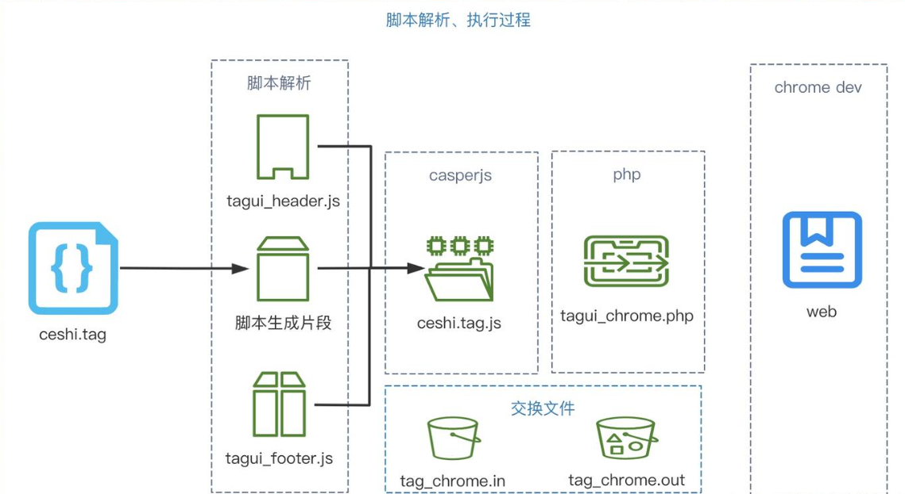
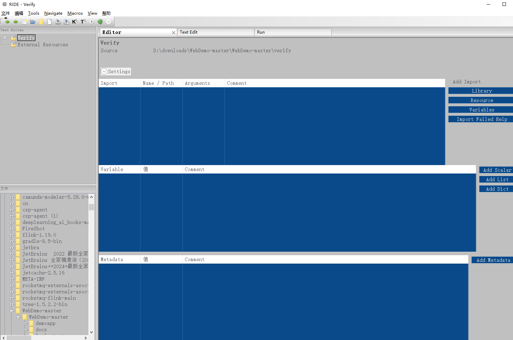
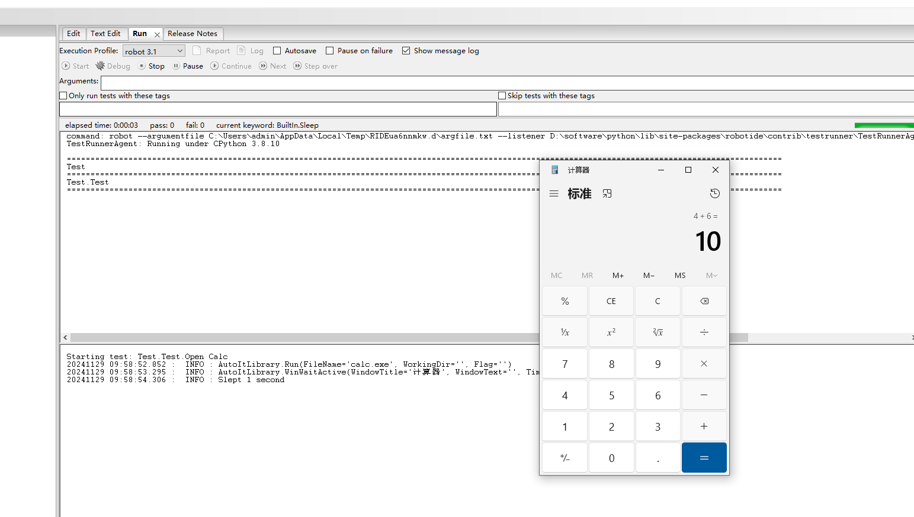

## 基本介绍

### RPA介绍

RPA（Robotic Process Automation，机器人过程自动化）是一种利用软件模拟人类操作，自动化执行日常重复性工作流程的技术；底层其实借助一些能够自动执行的脚本或程序（这些脚本可能是某些工具生成的，这些工具也可能有着非常有好的用户化图形界面）执行的，但凡具备一定脚本生成、编辑、执行能力的工具在此处都可以称之为机器人；通俗来讲，RPA比喻成企业级外挂，原来C端客户，打游戏用外挂，现在企业为了节省时间成本精力，用RPA做外挂。

### 应用场景

**RPA** 技术可以被运用于办公自动化，例如处理电子邮件、生成报告、管理文件等。通过使用 **RPA** 软件机器人，可以自动执行这些重复性、规律性的任务，从而节省员工时间和精力。举例来说，当有大量客户邮件需要回复时，**RPA** 可以被编程为自动识别并回复特定类型的邮件内容，从而提高工作效率

- 数据抓取与输入：RPA机器人可以抓取网页、Windows应用中的数据，并进行填充、编辑等操作。这大大减少了人工输入的时间和错误率，提高了数据处理的效率。
- 邮件任务处理：RPA机器人可以自动收发邮件，并对邮件内容进行处理。例如，它可以自动筛选、分类、回复邮件，提高了邮件处理的效率和准确性。
- 跨系统、跨应用交互：RPA机器人可以实现多Web系统间的交互，以及多Windows应用软件之间的交互。它可以在不同系统之间传递数据、执行命令，打破了系统间的数据孤岛，提高了业务流程的连贯性和效率。
- 规则匹配与逻辑判断：RPA机器人可以进行复杂的逻辑判断和规则匹配。它可以根据事先配置的规则，对抓取到的数据进行处理、筛选和分类，提高了数据处理的准确性和灵活性。
- 文件处理：RPA机器人可以读写、编辑、识别各种文件。例如，它可以自动生成报告、处理Excel表格、识别PDF文档等，大大减轻了人工处理文件的负担。
- 定时任务：RPA机器人可以按照制定的执行计划执行任务。例如，它可以定时抓取数据、发送邮件、执行特定操作等，满足了企业对于定时任务的需求。
- OCR技术：RPA机器人结合了多项OCR（Optical Character Recognition，光学字符识别）技术，可以识别验证码、身份证、营业执照、银行卡、票据等多种图像信息。这使得RPA机器人在处理图像数据方面具有更强的能力

如下一个费用报销流程，RPA侧重于**某个节点审批下微观视角**下的操作步骤：

 

## 产品分析

### 商业产品

#### [Uipath](https://www.uipath.com/)

UiPath是一款引领全球的RPA主流产品，通过直观的拖放功能，使业务分析师能够轻松地自动化组织中的业务流程。它无需编程知识，还支持使用Vb.net脚本语言进行更高级的自定义操作。UiPath提供了端到端的自动化解决方案，即所谓的超级自动化，通过图表进行自动化流程的视觉设计，使得过程管理变得既简单又直观

- **优点**：
  - 高效率与准确性：能够显著提升工作效率，减少错误。
  - 广泛应用场景：适用于金融、医疗保健、人力资源等多个领域。
  - 强大的社区支持：提供丰富的学习资源。
- **缺点**：
  - 初始学习曲线较陡峭：对于非技术背景用户来说可能有些挑战。
  - 成本较高：对于小型企业或初创企业来说可能略高。

 

#### [艺赛旗](https://www.i-search.com.cn/)

艺赛旗是国内较早涉足RPA领域的厂商之一。

- **优点**：
  - 无人值守操作：机器人可以独立运行，不需要人员监控。
  - 高度集成：与企业的现有系统无缝整合，如ERP、CRM等。
  - 灵活的调试辅助：提供专业的调试辅助功能，方便用户对流程进行优化和调整。
  - 易于使用：用户友好的界面和向导式操作让非技术人员也能轻松上手。
- **缺点**：可能因企业具体需求的不同而有所差异，但总体来说，艺赛旗RPA在灵活性和广泛适用性方面表现出色。

#### **影刀**

影刀RPA提供了直观简洁的可视化操作界面，用户通过简单的拖拽和点击操作即可完成流程设计和配置。

 

- **优点**：
  - 简单易用：大大降低了使用门槛，新手也能快速上手。
  - 多样化适配：支持与多种系统和应用程序的集成，实现系统间的无缝对接和数据交互。
  - 智能识别与处理：具备强大的智能识别能力，可以自动识别和处理各种数据格式和结构。
  - 高效执行：采用高度自动化的执行引擎，能够快速执行流程，并且支持24/7全天候运行。
- **缺点**：
  - 功能深度有限：对于一些非常复杂的业务逻辑和流程，影刀RPA的功能可能无法完全满足需求。
  - 稳定性有待提高：在执行大规模或长时间的自动化任务时，可能会出现一些稳定性方面的问题。
  - 数据安全风险：由于涉及到企业的大量数据交互和处理，数据安全是一个重要的问题。

界面好看，操作简单好上手，服务许多电商，但对非浏览器的系统的接管稳定性较差，缺乏大型政企方面服务经验，适合需要灵活性的个人商家

#### [uibot](https://www.uibot.com.cn/)(来也)

- **优点**：
  - **简单易用**：UIBot提供了图形化界面操作和自动化流程设计的功能，用户不需要编写代码即可完成任务，降低了学习和使用的门槛。
  - **高效稳定**：支持多线程并发请求和代理IP池，大大提高了数据采集效率和稳定性。同时，它还支持JS渲染页面，可以获取到完整的页面数据。
  - **可扩展性强**：支持插件机制，用户可以根据自己的需求编写插件，扩展功能。目前已经开发了多个插件，包括自动登录、验证码识别、图片下载等。
  - **广泛的应用场景**：UIBot可以应用于各种需要自动化界面操作的场景，如数据采集、软件自动化测试等。
- **缺点**：
  - **功能相对单一**：虽然UIBot在界面自动化方面表现出色，但相对于一些更全面的RPA工具，其功能可能略显单一。
  - **对复杂任务的支持有限**：对于需要人类判断和决策的任务，UIBot可能无法完全替代人工。
  - 调试功能较弱

 

前身是按键精灵。调试功能较弱，无法准确定位错误。但其服务的政企单位类型多，经验丰富，政务领域做的较多

关于uibot对比如下：

> 1.**从机器人运行方面**，影刀是编辑器和运行器一起的，也就是说，运行机器人的时候不能开发机器人；而 uibot 是编辑器和运行器分开的，也就是说可在机器人运行的时候开发新的流程机器人，我没有试过在影刀开发机器人的时候，如果用触发器 触发机器人的话，机器人是否会运行（我设置的触发器就没有生效过，没搞懂是为什么）;
>
> 2.**从编辑界面方面**，影刀自己封装好的功能是看不到源码的，UIBOT 可相互切换，可切换到源码修改，以达到自己想要的效果；
>
> 3.**从编程语言方面**，影刀和Python无缝衔接，很多地方可点亮图标使用Python，也可使用Python的库来开发Python流程，而UIBOT的编程语言是自己开发类似VB的语言，也和按键精灵的语言相似；
>
> 4.**从流程运行方便**，影刀是顺序运行的，当在主流程中调用封装的各个子流程的时，有些流程可能会调用多次，而UIBOT是以流程图的方式通过拉线来确定流程的运行；
>
> 5.**从功能方法方面**，影刀的相对来是比较集中，传递不同的参数可以又不同的功能，比如说写入数据到Excel，影刀一个函数可写入行、列、区域，如果是写入的内容只有一个（非数组）可直接写入单元格，而UIbot则是分开的四个函数写入单元格、写入行、写入列、写入区域（当然也可以根据数据的格式，用写入单元格写入行、列或者区域）；
>
> 6.**社区活跃方面**，影刀比UIbot好


#### [Blue prism](https://portal.blueprism.com/)

提供社区版和商业版两种版本，社区版的功能是有限的，商业版提供了财务来源， 更加偏向于给开发用的工具。

具体介绍：https://baijiahao.baidu.com/s?id=1640533046114061706&wfr=spider&for=pc

功能比较强大，也比较智能化，对 IT 团队要求高，学习难度大，社区相对较小市场占有率不大

### RPA产品架构

架构参考

 

### 功能示例

#### Studio

Actor 即命令提交者，主流厂商一般称之为 Designer 或 Creater 或Studio ，通常是流程设计，而且有专门的IDE设计工具完成流程设计；下图是艺赛旗的IDE流程设计工具截图

 

设计步骤如下：

- 新建项目openBaidu

   

- 流程的目标是打开浏览器，然后打开百度

   

* 将该流程发布到控制中心

   


#### 控制中心

控制平台端提供计划任务和调度方案的执行和监控，可将工作任务分配给RPA机器人 

 

发布之后可以在控制台的流程管理里看到该流程

 


#### RPA 机器人

RPA 机器人也被称作数字员工, 它被部署于 PC 端，用于接收控制平台分配的工作，在计算机终端中执行由设计器设计的流程任务 

点击立即执行后，可以看到机器人所在的机器打开了www.baidu.com, 并能看到IS-RPA正在执行中

 

### 开源框架

#### 对比

- TagUI

  TagUI由AI Singapore维护，是RPA的命令行界面，可以在任何主要OS上运行。 TagUI使用“流”的概念来表示运行基于计算机的自动化流程，该流程可以按需完成或按固定的时间表进行。TagUI强调其语言的简单性或自然性。[https://github.com/kelaberetiv/TagUI](https://links.jianshu.com/go?to=https%3A%2F%2Fgithub.com%2Fkelaberetiv%2FTagUI)

- Robot Framework

  Robot Framework是最活跃的开源项目，是用于测试自动化和RPA的通用框架。与其他语言一样，强调自然语言或人类可读的语言，以使其易于使用。 Robot Framework提供了Web演示和详尽的文档。[https://github.com/robotframework/robotframework](https://links.jianshu.com/go?to=https%3A%2F%2Fgithub.com%2Frobotframework%2Frobotframework)

- RPA for Python

  以前称为“ TagUI for Python”，这是用于RPA开发的Python软件包。 适用于Python的RPA是建立在TagUI上的，它具有Web自动化，Computer Vision计算机视觉自动化，OCR光学字符识别以及键盘鼠标自动化等基本功能。[https://github.com/tebelorg/RPA-Python](https://links.jianshu.com/go?to=https%3A%2F%2Fgithub.com%2Ftebelorg%2FRPA-Python)

- Automagica

  Automagica介于开源和免费增值模式之间。Automagica确实是开源的，并且对于非商业用途是免费的，但是商业用途将需要License。对于希望学习，实验和制作原型的个人而言，这是一个潜在的不错选择，但是商业用例将需要升级到其商业Automagica Portal平台。[https://github.com/automagica/automagica](https://links.jianshu.com/go?to=https%3A%2F%2Fgithub.com%2Fautomagica%2Fautomagica)

- Task

  Taskt是一个免费的开源工具，该工具无需编写代码即可执行自动任务。 屏幕录制功能可以记录用户的基于计算机的操作，然后将这些步骤转换为可重复的RPA脚本，还包括所见即所得“机器人设计者”，以及用于无代码RPA开发的标准命令菜单。[https://github.com/saucepleez/taskt](https://links.jianshu.com/go?to=https%3A%2F%2Fgithub.com%2Fsaucepleez%2Ftaskt)

- Robocorp

  Robocorp是一家风险投资支持的初创公司，承诺为开发人员提供基于云的开源RPA工具。[https://robocorp.com/](https://links.jianshu.com/go?to=https%3A%2F%2Frobocorp.com%2F)

各开源方案的比较

| 方案              | 优点                                                         | 缺点                                                  | 其它                    |
| :---------------- | :----------------------------------------------------------- | :---------------------------------------------------- | :---------------------- |
| Robotframework    | 可视化界面，开源，使用人数多                                 | 运行环境搭建复杂，依赖较多，操作复杂                  |                         |
| TagUI             | 浏览器支持好                                                 | 命令行操作，非浏览器程序支持一般（C/S支持较差）       |                         |
| OpenRPA           | 可视化界面，操作简单，基于Windows Workflow Foundation，基于Windows Workflow Foundation作为框架。WF被Uipath和许多国内RPA团队应用 | 运行环境搭建复杂，依赖较多，操作复杂                  |                         |
| Robocorp          | 有商业化团队进行维护                                         | 使用需申请                                            | 商业需付费，不考虑      |
| Automagica        | 官方示例比较详细                                             | 运行环境搭建复杂，依赖较多，操作复杂，商业需要license | 不考虑(商业需要license) |
| Selenum Webdriver | 有nuget包 支持C#开发可实现客户端与浏览器交互多浏览器支持 Firefox, Safari, Edge, Chrome, Internet Explorer and more | nuget包与chorm版本对应要求严格，上下不兼容            |                         |
| Taskt             | 基于C# 框架                                                  | 打开浏览器后不能执行执行后续操作                      |                         |

参考资料：https://enterprisersproject.com/article/2020/4/rpa-robotic-process-automation-6-open-source-tools

#### TagUI使用示例

使用文档参考：http://www.tagui.com.cn/

##### TagUI 特点

由AI Singapore提供的用于数字化流程自动化（RPA）的命令行工具，这是政府资助的旨在加速新加坡AI的计划；目的在于用简单的TagUI语言编写流程，并在屏幕上自动进行Web，鼠标和键盘交互。TagUI是免费使用和开源的。它易于设置和使用，并且可以在Windows，macOS和Linux上运行。除了英语，流程还可以用其他20种语言编写

##### Robotframework区别

##### 安装

Robotframework 提供RIDE图形化操作界面，而TagUI只提供命令行操作：

1. 下载 TugUI zip 压缩包，下载点击： [TagUI v6.109 for Windows](https://github.com/kelaberetiv/TagUI/archive/master.zip)
2. 解压到硬盘，例如： `C:\`
3. [安装 OpenJDK for Windows（已经安装可跳过）](https://corretto.aws/downloads/latest/amazon-corretto-8-x64-windows-jdk.msi)
4. [安装 Chrome 浏览器（已经安装可跳过）](https://www.google.com/chrome/)
5. [环境变量Path增加TagUI路径](https://jingyan.baidu.com/article/60ccbcebad4fe964cab197c7.html)，注意需要scr目录，不是根目录，例如： `c:\tagui\src`
6. 按Ctrl+R，输入"cmd"，进入CMD命令行模式。
7. 复制下面这行命令，粘贴到CMD运行：（路径改为您安装的实际路径）
8. tagui c:\你的TagUI目录\flows\samples\baidu.tag

##### 使用效果

**自动打开百度使用效果**：

 

 

 

**自动下载使用效果：**

 

1. 访问 https://github.com/kelaberetiv/TagUI
2. 得到license_type ，并echo 显示
3. 点击下载按钮
4. 选择 download zip

**TagUI登录：**

```
https://login.xero.com/identity/user/login
type email as user@gmail.com
type password as 12345678
click Log in
```

**UI元素的图像**

OCR识别的文本

```
type email_box.png as user@gmail.com
type password_box.png as 12345678
click login_button.png
```

TagUI还提供了许多便捷的功能,如从网页表格抓取数据、与Excel交互、发送Telegram通知等

**C/S 程序自动化：**

支持的不太完善

##### 原理分析

agUI将用户用不同人类语言编写的意图转换为可执行的JavaScript代码,从而实现UI自动化。它的底层技术栈包括:

- Chrome DevTools Protocol
- Sikuli
- CasperJS
- PhantomJS
- SlimerJS
  

 

参考：https://zhuanlan.zhihu.com/p/366304958 、https://blog.csdn.net/Nifc666/article/details/142654651

#### Robot Framework使用示例

Robot Framework是用于接受测试，接受测试驱动的开发（ATDD）和机器人流程自动化（RPA）的通用开源自动化框架。它具有简单的纯文本语法，并且可以使用使用Python或Java实现的库轻松扩展。

Robot Framework是独立于操作系统和应用程序的。该核心框架使用Python实现，同时支持Python 2.7和Python 3.5+，并且还可以在Jython（JVM）， IronPython（.NET）和PyPy上运行。该框架周围有一个丰富的生态系统，其中包含作为单独项目开发的各种通用库和工具。有关机器人框架和生态系统的更多信息，请参见 [http://robotframework.org](http://robotframework.org/)。

Robot Framework项目托管在GitHub上，您可以在其中找到源代码，问题跟踪程序和一些其他文档。 如果您有兴趣贡献，请参阅CONTRIBUTING.rst。除了在Maven Central上的独立JAR发行版之外，下载均托管在PyPI上。机器人框架开发由机器人框架基金会赞助

##### 环境安装

1. 安装python3.8+
   下载 python 安装包， 完成安装
   假定安装路径是D:\dev\python38（后续将用改路径做为演示说明）

2. 安装robotframework
   pip install robotframework

3. 安装wxpython
   pip install wxPython

4. 安装ride
   pip install robotframework-ride

5. 注意事项
   如果是windows 中文版，需要修改 D:\dev\python38\lib\site-packages\robotide\application\application.py 文件，在
   self._initial_locale = wx.Locale(wx.LANGUAGE_ENGLISH) 新增一行_

      ```
    self._initial_locale = wx.Locale(wx.LANGUAGE_ENGLISH)
    self.locale = wx.Locale(wx.LANGUAGE_CHINESE_SIMPLIFIED) # 新增的内容
      ```

   1. 注意事项验证ride
      通过命令行执行

      ```
      ride.py
      ```

 

##### 简单示例

**自动登录**

下载demo包

https://github.com/robotframework/WebDemo

 

安装demo所需的依赖包

```
pip install -r requirements.txt
```

启动demo server

```
python demoapp/server.py
```

 

打开localhost:7272

 

利用robotframwrok 自动登录

```
robot --variable BROWSER:Chrome login_tests
```

**C/S 程序示例(打开计算器)**

本demo 将演示利用robotframework 打开计算器，并自动输入6+4 = 10的过程

安装依赖工具

C/S 程序自动化主要是利用 AutoItLibrary， 而安装AutoItLibrary 又需要安装 pywin32

```
安装pywin32
pip install pywin32
安装 AutoItLibrary
pip install robotframework-autoitlibrary 
```

建立一个verify 目录， 打开RIDE ，选择file-->New project 在弹出的对话框中选择刚才的目录

 

在Text Edit 中输入如下内容

```
 *** Settings ***
   Library           AutoItLibrary
```

 

Lib加载了


建立 Cal 目录

并同样用RIDE 打开该目录
参考 AutoItLibrary 安装成功的验证 的相关内容；

```
*** Settings ***
Library           AutoItLibrary
Library           Collections
Library           String

*** Test Cases ***
Open Calc
    # 执行计算器程序    # run C:\personal\npp.7.8.9.bin.x64\notepad++.exe
    run    calc.exe
    # 等待窗口出现 win wait active | [ WindowTitle | WindowText=WindowText | TimeOut=TimeOut ]
    win wait active    计算器    \    5
    # 窗口出现后等待1秒，观察输入的过程
    sleep    1
    # 自动输入 4+6 = 10
    send    4{+}6{=}
    # 等待5秒
    sleep    5
    # 关闭 win close | [ StrTitle=Title ]
    win close    计算器
```

 

点击RIDE 的RUN 标签，执行Start 执行相关流程

 

执行过程可看到浏览器被打开、自动输入4+6 = 10

 

#### Python框架selenium使用示例

python 结合 Selenium来实现自动化, 完成登录网易云音乐、打开排行榜，搜索歌曲并播放、最后关闭

##### Selenium 介绍

Selenium是一个Web的自动化测试工具，最初是为网站自动化测试而开发的，类型像我们玩游戏用的按键精灵，可以按指定的命令自动操作，不同是Selenium 可以直接运行在浏览器上，它支持所有主流的浏览器，也包括PhantomJS这些无界面的浏览器。

Selenium 可以根据我们的指令，让浏览器自动加载页面，获取需要的数据，甚至页面截屏，或者判断网站上某些动作是否发生。

Selenium 自己不带浏览器，不支持浏览器的功能，它需要与第三方浏览器结合在一起才能使用，所以需要浏览器驱动，以便selenium操作浏览器

##### Selenium RPA 示例

新建一个py测试

```
from selenium import webdriver
from selenium.webdriver.common.keys import Keys
import time

from selenium.webdriver.common.by import By
from selenium.webdriver.support.ui import WebDriverWait
from selenium.webdriver.support import expected_conditions as EC

browser = webdriver.Chrome()
browser.get('https://music.163.com')

# browser.set_window_size(1024,768) # 设置窗口尺寸
browser.maximize_window() # 全屏

# 设置全局的隐式等待(直到找到元素),10秒后找不到抛出找不到元素
browser.implicitly_wait(10)
# 显式等待找到元素id=g_nav2， 0.5秒巡查一次，5秒超时
echoobj = WebDriverWait(browser,5,0.5).until(EC.visibility_of_element_located((By.ID,'g_nav2')))

time.sleep(1)
# 截取当前屏幕
browser.get_screenshot_as_file('./v.png')
# 仅截echoobj对象的范围，定点元素截图
echoobj.screenshot('./p.png')

print('元素大小：',echoobj.size) # g_nav2元素大小
print('元素是否显示：',echoobj.is_displayed()) # True 显示，False 隐藏
print(browser.title)
print(browser.current_url) # 当前URL
print('窗口句柄：',browser.current_window_handle)

# 点击按钮
browser.find_element_by_css_selector('.link.s-fc3').click()
# time.sleep(1)
browser.find_element_by_css_selector('.u-btn2.other').click()
# time.sleep(1)
browser.find_element_by_id('j-official-terms').click()
# time.sleep(1)
browser.find_element_by_css_selector('.u-btn2.u-btn2-2').click()
# time.sleep(1)

# 登录手机号账户
# 注意替换成正确的账号，密码
browser.find_element_by_id('p').send_keys('your user name')
browser.find_element_by_id('pw').send_keys('your password')
browser.find_element_by_css_selector('.j-primary.u-btn2.u-btn2-2').click()
browser.refresh() # 刷新页面

# 点击排行榜
browser.find_element_by_css_selector('#g_nav2 > div > ul > li:nth-child(2) > a').click()
# 切到id=g_iframe的iframe，以便播放歌曲
browser.switch_to.frame('g_iframe') 
time.sleep(1)
browser.find_element_by_css_selector(".u-btn2.u-btn2-2.u-btni-addply.f-fl").click() # 播放
time.sleep(10)

# 切换到上一层，跳出当前iframe，因为当前只有一个主 html和一个嵌套iframe，挑出后回到主html
browser.switch_to.parent_frame() 
# browser.switch_to.default_content() # 切到主HTML

# 搜索歌曲，播放
bs = browser.find_element_by_id('srch')
bs.send_keys('新年快乐')
# 键盘回车操作
bs.send_keys(Keys.ENTER)

browser.switch_to.frame('g_iframe')
# browser.find_element_by_id('song_1426649237').click() # 功能同下
browser.find_element_by_class_name('ply').click()
time.sleep(10)
browser.quit()
```

##### Selenium 主要用法介绍

-  元素定位

  ```
   #通过id方式定位
   browser.find_element_by_id("kw")
   #通过name方式定位
   browser.find_element_by_name("wd")
   #通过tag name方式定位
   browser.find_element_by_tag_name("input")
   #通过class name方式定位
   browser.find_element_by_class_name("s_ipt")
   #多个class name定位
   browser.find_element_by_css_selector(".class1.class2")
   #通过CSS方式定位
   browser.find_element_by_css_selector("#kw")
   #通过xpath方式定位
   browser.find_element_by_xpath("//input[@id='kw']")
  ```

- 操作对象

  ```
   click()：点击对象
   send_keys(“input”)：在对象上模拟按键输入
   clear()：清除对象的内容
   submit()：提交对象的内容
   text：用于获取元素的文本信息
   get_attribute("href")：获取标签的某值 
  ```

- 键盘操作

  ```
  from selenium.webdriver.common.keys import Keys
   send_keys(Keys.TAB)：tab
   send_keys(Keys.ENTER) ：回车
   send_keys(Keys.CONTROL,'a') ：全选，ctrl+a
  ```

- 鼠标操作

  ```
   from selenium.webdriver.common.action_chains import ActionChains
   ActionChains 常用方法：
   perform()：执行所有ActionChains 中存储的行为；
   context_click()：右击；
   double_click() ：双击；
   drag_and_drop() ：拖动；
   move_to_element() ：鼠标悬停。
  ```

- 截图方法

  ```
   bobj.screenshot(' ')：仅截bobj对象的范围，定点元素截图
   get_screenshot_as_file(' ')：截图屏幕
   get_screenshot_as_base64(‘ ’)：截图屏幕，base64格式
   get_screenshot_as_png(‘ ‘ )：截图屏幕，二进制格式
  ```

## 自研RPA实现思路

从开源方案入手，掌握RPA开发过程中的主要开发思想、理论，逐渐形成一套基于python 的RPA 库，通过手工调用API、命令行的方式调用RPA库，满足自己的业务需求

 

### 关键功能分析

一个较为完善的RPA产品应该具有如下能力

#### studio设计

设计流程模块需要满足如下的核心功能：

- 流程设计能力 — 主要目标就是系统通过快速的拖拉拽的方式比较快捷的构建出业务流程
- 流程静态控制能力 — 通过基本的逻辑单元来构建完整的业务逻辑流程
  - 数据循环遍历能力 — 针对复合结构化数据可以逐条或逐个循环进行读取及处理能力
  - 流程循环/中断/继续能力 — 控制流程循环执行，循环中中断，循环中断后循环能力
  - IF Else逻辑控制能力 — 基本条件判断分支控制能力
  - DoWhile/WhileDo循环控制能力
  - Switch多分支控制能力
  - 变量复制传递能力
  - 延迟执行能力

当把流程静态设计完成后，必然需要动态的跟踪及调试，以及必须要的由简单到复杂的整合能力

- 流程断点调试能力

  控制运行中流程在任意位置或环节暂停，便于设计开发人员可以逐步调试跟踪

- 流程变量观察能力

  当流程在任意位置或环节暂停时，可以观察设定变量的当前取值，便于设计开发人员调试流程逻辑

- 流程载体嵌套能力

  流程设计时可以嵌套已经完成的流程，并且可以将参数向下传递，以及接收返回结果

RPA设计器需要具备如下的非功能性能力：

- 对于已知运行环境的支持能力
  - 基于Window Framework运行的窗体程序
    可以任意进行特征对应要素的定位/要素属性获取/要素相应操作
  - 基于JVM运行的Java程序 – 其中可能是桌面Java程序也可能是浏览器内嵌套Applet
    可以任意进行特征对应要素的定位/要素属性获取/要素相应操作
  - 基于IE环境运行的Web站点 – IE浏览器依然在传统金融机构内大量使用，所以依然是我们的目标对象
    可以任意进行特征对应要素的定位/要素属性获取/要素相应操作
  - 基于现代浏览器环境运行的Web站点 – 这类浏览器包括Chrome/Edge/Firefox等占有率较高的平台
    可以任意进行特征对应要素的定位/要素属性获取/要素相应操作
    
    
- 对于未知运行环境的支持能力
  - 基于特征位图进行定位
  - 基于特征位图进行鼠标操作
  - 基于特征位图进行内容识别

#### 机器人

机器人的功能和设计器很类似，需要按照设计器的规则运行，多了和控制中心交互的通讯机制，配合控制中心的功能进行实现，也需要包括运行日志审计等功能；

**机器人需要预置与主流办公相关程序的交互能力：**

- 整合Office资源能力
  - 其中必然包含对Excel，WPS，Outlook，Word，PPT等办公基本资源的整合能力
  - 其中也必须能够具备和Office中内置宏进行交互能力
- PDF整合能力 – 基本应该涵盖PDF的常规操作，包括读取，创建，分页，合并等
- SMTP邮件整合能力 – 在部分企业内依然有使用SMTP作为自身邮件服务的
- 文件常用处理能力 – 满足业务办公时可能出现的各种文件处理场景
  - txt，csv，xml，html，等常用格式文件的解析能力
  - 文件/文件夹/压缩/解压缩等应用整合能力
- 第三方公共服务接口调用整合能力 – 这里主要是考虑可以整合公共网络服务，来弥补自身平台建设中所存在的能力短板问题
- 获取【流程管理】中【全局参照资料】的能力 – 该部分必须和【流程管理】中【全局参照资料】配合使用，主要业务目标为，在流程设计开发时避免铭感数据在开发端暴漏的问题

**机器人的扩展能力：**

- 支持引入第三方类库能力并可以调用
  该设计的目标为解决可能出现的动态补充及扩展产品实施能力的需求，希望通过它，以引入第三方类库或是自定义开发新类库的方式，动态的补充产品的新技能，来提升产品自身的使用范围
- 支持常用脚本语言调用及反馈能力
- 支持在业务流程设计中嵌入独立代码块
  该部分与前两部分设计完全不同，它主要目标为支持有代码编写能力的开发人员，针对本次设计流程，来定制代码块，该代码块的运行环境所包含的依赖与产品整体依赖完全一致，可以任意扩展
- 支持类型丰富的参数类型
  无论何种设计环境，都需要尽量提供丰富的数据类型的支持，以便于支持更加复杂业务场景

#### 控制器管理

 

主要满足流程集中管理，以及运行状态的监视，运行结果的回溯能力

- 管理终端运行机器能力
  该部分的目标是集中管理终端运行机器，监视目前机器在线/离线状态，忙碌/空闲状态等，以及可能统计出机器利用率的指标，便于管理者更高效配置终端机器的运行任务
- 统合管理业务流程能力
  该部分的目标为统一管理开发完成的流程，并处理好版本更新的管理，流程发放的管理，流程资源的配置等，以及可能流程利用率的统计
- 制定终端运行计划能力
  该部分的目标即为已经成功开发完成的流程设定周期性的运行计划，依次来满足依靠时间节点来触发的任务运行，充分体现RPA 24*7 工作的可能性
- 能回溯机器人运行任务能力
  该部分主要是通过中央控制中心来观察已经完成运行的RPA任务的运行结果，可以粗略的了解运行成功与否，可以详细的了解运行日志，甚至可以了解更丰富的视频运行过程，以及异常时视频状态
- 能管理全局参照资料能力
  该部分主要是用于集中管理流程开发中可能涉及到的业务敏感数据或是便于配置数据的统一下发，需要与机器人配合使用

### 技术实现思路

#### Studio

一般采用客户端技术实现，需要和各种软件交互以获取数据来设计规则，还有些模拟验证；比如，在设计一个库存管理自动化流程时，要与库存管理软件交互，获取实时的库存水平、商品入库和出库信息，这样才能在流程设计中合理设置库存预警阈值、补货规则等。又比如，在设计一个财务报表自动化生成流程时，可能需要从企业的会计软件中获取账户科目信息、历史财务数据等。这些数据能够帮助开发人员更准确地设计流程步骤，如数据筛选、计算规则等

##### 核心功能

- 流程编排
- 发布流程到控制中心

##### 技术模块设计

- 机器人脚本引擎（BotScript）

  内建脚本语言BotScript执行引擎，具备词法分析、编译、运行等计算机语言的标准组成组件。内置C++、Python、Lua，外置.net适配器，实现其他语言与BotScript数据类型的双向自动转换。

- RPA核心架构（RPA Core）

  RPA产品的界面识别器，能识别Desktop Application、Web、SAP、Java等各种界面元素；能动态加载自定义识别器，配合抓取工具，可快速实现目标应用的选择与抓取。

- 图形用户界面（GUI）

  GUI（Graphical User Interface）是一种用户接口，通过IPC（Inter-Process Communication，进程间通信）与相应的引擎进行通信。在RPA产品中，GUI承担流程的编写、开发、调试工作。另外通过GUI与控制中心进行通信，结合HTTP与FTP协议实现流程的发布与上传。

- 记录仪（Recorder）

  也称之为“录屏”，用以配置软件机器人。就像Excel中的宏功能，记录仪可以记录用户界面（UI）里发生的每一次鼠标动作和键盘输入。

- 插件/扩展

  为了让配置的运行软件机器人变得简单，大多数平台都提供许多插件和扩展应用

##### 通用问题

- Studio 采用何种开发语言， [基于.net](http://xn--6kq92u.net/) 的C#、python 、nodejs ?
- Studio 与控制中心采用何种通信机制，如何登录，如何将流程发布到控制中心？

https://gitee.com/rpa_ai/rpastudiobook  （画布参考）

https://github.com/wyfish/RPAStudio （画布参考）

#### RPA 机器人

执行器是用来运行已有软件机器人，或查阅运行结果的工具。开发者首先需要在设计器中完成开发任务，生成机器人文件，之后将其放置在执行器中进行执行。

为了保证开发与执行的高度统一，执行器与设计器一般采用类似的架构。以机器人脚本引擎与RPA Core为基础，辅以不同的GUI交互，满足终端执行器常见的交互控制功能。执行器可与控制中心通过Socket接口方式建立长连接，接受控制中心下发的流程执行、状态查看等指令。在执行完成时，进程将运行的结果、日志与录制视频通过指定通信协议，上报到控制中心，确保流程执行的完整性。

##### 整体思路

- 机器人终端界面的实现（一般而言是windows)
- RPA如何获取到任务
  - 维持与控制中心的长连接，控制中心一旦有任务就可以及时下发达到RPA机器人
  - RAP机器人定时调用控制中心的接口，获取任务并下载任务，最后执行
- RAP机器人对任务的执行
- 软件兼容性处理

##### 机器人终端示例

 

机器人界面一般时采用QT开发

> （Qt 是一个跨平台的 C++ 应用程序开发框架，在 Windows 平台上使用 Qt 进行开发有诸多优势。它可以帮助开发者创建具有高性能、丰富用户界面的应用程序，并且能够方便地实现跨平台兼容（如果需要将应用移植到其他操作系统，如 Linux、macOS 等，安装程序会有很多dll文件）

​	依据是否需要与用户进行交互，分为交互式RPA和非交互式RPA。非交互式RPA就是完全不需要人参与的机器人（也称为后台机器人）。交互式RPA的“交互”，从业务角度理解应该为“人机交互”（可以处理处理RPA无法处理的数据，如人脸验证码）；另外一种“交互”的理解是：机器人的启动是否需要人工触发？（必须由人工触发启动的机器人也称为前台机器人）

##### 获取任务

机器人可进行定期http轮询请求，或者保持长连接；当控制台的流程被触发执行后，机器人定期获取最新的任务状态，然后执行

##### 任务执行

参考各类产品，可以发现RAP机器人可采用执行python 脚本最终完成流程的执行的(但涉及到各类组件调用，需要不断沉淀组件库)

#### 控制中心

可采用vue + （java、python）等方式，但是需要实现核心的功能有：

- 流程的存储问题
- 机器人的监控与运行状态
- 将流程下发到机器人
- 检测任务的执行
- 权限控制
- 审计
- 安全加密等
- 其它

主要用于软件机器人的部署与管理，包括开始/停止机器人的运行，为机器人制作日程表，维护和发布代码，重新部署机器人的不同任务，管理许可证和凭证等。

> 管理调度
>
> 控制器本质上是一个管理平台，可以管控和调度无数个RPA执行器；同时，设计完成的流程也可从RPA控制中心管理平台下派至各个局域网内有权限的单机上进行执行。
>
> 当需要在多台PC上运行机器人时，也可用控制器对这些机器人进行集中控制，比如统一分发流程，统一设定启动条件等。
>
> 用户管理
>
> 用户可通过用户名和密码登录RPA控制中心。一般的控制中心会提供完备的用户管理功能，可对每个用户进行权限设定，保证数据安全。
>
> 另外，控制中心还提供了类似于组织架构的功能，用户可以利用该功能定义RPA机器人的使用权限。
>
> 流程管理
>
> 控制器会提供“流程管理”界面，用户可以查看已有流程被哪些任务使用，以及流程的激活状况等，同时也可以新建流程。
>
> 机器人视图
>
> 机器人视图功能，可以帮助用户查看所有的或某一部门下的RPA机器人流程。具体包括查看这些机器人是否在线以及到期时间，有权限的用户还可对相关机器人流程进行编辑或删除。

## RPA挑战

对于RPA类产品，它所提供的解决方案并不是范范的针对某个具体业务场景，它所需要解决的问题相对比较广，如在实施过程中可能会遇到各种技术难题，例如：

- 以及掌握各类软件程序控制（浏览器、业务子系统、办公软件、通讯软件）,需要解决如何进行信息读取，属性读取，信息写入，对象识别等，以及高扩展架构的基础设计
- 各种机器人运行环境不同的兼容性问题， 调试工具开发，留痕日志处理
- 需要各类专业技术支持（python（涉及各控制组件）、.NET、js、c#、java等）
- 安全性问题，代替人需要各类权限，数据传输安全问题
- 性能问题，控制器同时连接所有机器人，最大的复杂度n * m（n为员工数，m为机器人数）

- **流程变更：** 由于业务环境不断变化，原有流程可能需要随时调整或更新，造成管理复杂度激增

**RPA产品的挑战主要总结下几个大的方面：**

- **任务编排与设计**

  需要开发一个可视化的任务编排工具（如Studio），使用户能够直观地设计自动化流程。实现这一点需要处理复杂的用户交互和流程逻辑。

- **机器人执行能力**

  机器人需要能够高效、稳定地执行任务，并与多种应用（如办公软件、浏览器等）进行交互。不同环境和应用的兼容性可能带来技术难题。

- **通讯机制**

  机器人和控制中心之间的通讯机制需要高效、安全，确保任务的调度和执行过程无缝衔接。这涉及到数据传输、错误处理、日志管理等方面的技术设计。

- **客户端组件库建设**

  需要支持多种常用软件和平台（如WPS、浏览器、聊天工具等）的自动化，这要求不断扩展和维护客户端组件库，以应对不同场景和需求。

- **可扩展性与维护性**

  随着使用场景的增加，系统需要具备良好的扩展性和可维护性，避免架构设计上的瓶颈。

- **性能与稳定性**

  自研RPA需要确保机器人在大规模任务执行中保持稳定性和高效性，尤其是在复杂流程和高并发任务的情况下。

- **资源投入与技术积累**

  自研RPA的开发需要大量技术积累和人力投入，尤其是在初期阶段，可能需要克服技术实现和产品功能上的多重挑战。
  
- **流程变更：** 由于业务环境不断变化，原有流程可能需要随时调整或更新，造成管理复杂度激增

## 发展趋势

随着人工智能、大数据分析等新兴技术的快速发展，**RPA** 技术将更多地与这些新技术进行融合。通过结合人工智能**RPA** 将能够更加智能化地执行任务，并且具备更强大的数据处理和分析能力。如通过集成大模型的能力，基于用户的自然语言输入，可将其转化为可执行指令，并自动判断处理、执行自动化流程，同时，还能以人类能理解的语言形式返回处理结果

**针对于RPA的发展趋势，也有人提出如下观点可以参考**：**从企业整体信息化和数字化转型角度来看，RPA只能算是基于现有业务系统的临时解决方案**。它并不能从根源上解决企业在信息化架构上的短板和问题。由于RPA功能的限制（比如只能前台模拟人工操作，需要有人做定时输入，需要明确的页面定义才能识别，任何网页组件上的变化都需要导致RPA程序的修改），导致其运行的实时性和效率都无法完全取代数据集成和软件升级。RPA是信息化的补丁，但是如果业务要升级，就不能一直穿着补丁衣服登堂入室。举个例子，财务应收可以使用RPA来进行认款和开票，在业务单据量少的情况下，使用几台机器人虚拟机就可以满足业务处理。但B2C行业收入量巨大，用RPA来处理应收业务就不合适，而是需要更为高效的收款中台跟前台业务系统对接才可以满足海量数据的处理。

## 总结

RPA（Robotic Process Automation，机器人过程自动化）是一种利用软件模拟人类操作，自动化执行日常重复性工作流程的技术。例如，RPA可以模拟人工从多个系统提取数据并汇总成报表抄送邮件等。对于重复性高、规则明确的流程，RPA可以代替人工，帮助企业实现降本增效。

RPA产品通常由以下三部分组成：

- **机器人**：执行编排好的任务，通常通过客户端技术（如C#、.NET、Python）与各种办公软件、Web应用、通讯工具等交互，完成预设操作。
- **Studio**：用于任务编排和调试，设计完的任务最终发布到控制中心。Studio通常使用客户端技术进行开发。
- **控制中心**：负责管理机器人和任务，包括任务下发、监控、权限控制等。控制中心对技术要求不高，主要功能是调度和管理。

在商业RPA产品中，**UiPath**是最流行的国际品牌，但由于本地化不足和价格较高，国内一些RPA厂商，如**艺赛旗**、**影刀**等，凭借更高的本地化适应性和较低的费用，成为不错的替代选择。商业RPA的收费模式一般是按机器人数量计算。需要注意的是，RPA技术尚未形成统一标准，各家厂商在功能上有所不同，各自封闭发展。

在开源RPA领域，目前大多数工具偏向于自动化测试（如HTTP接口调用），无法直接用于企业级流程自动化。自研RPA解决方案需要从产品功能角度进行重新设计和开发，投入资源较大。可以参考开源的**Robot Framework**（基于Python），但在任务编排设计和实现上，目前还没有完善的开源工具可供借鉴。挑战主要在于**Studio**的任务编排可视化设计与实现、兼容性问题、以及机器人与控制中心的通信机制。后续需要持续扩展客户端组件库（如WPS、浏览器、聊天工具等），以完善功能。