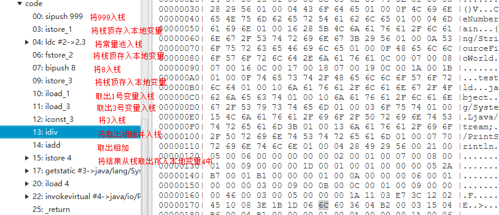

## 1. 概要  
### 1.1. 编程语言分类
&emsp;&emsp;我们知道编程语言可以根据不同的维度进行分类，比如
* 按照编程方式，面向对象、面向过程
* 是编译执行的还是解释执行的，比如html就是解释执行的，直接是源代码被解释器执行，java需要编译器编译成机器识别的语言。
* 有没有发生GC，比如java、go有GC，rust没有gc，但是编码很反人类，需要很熟徐rust设定的编程规则，rust创建的对象是再栈上的。
* 是动态语言还是静态语言，比如javascript等脚本语言就是动态语言，运行时才会检查变量的类型。

**小知识：  
&emsp;&emsp;动态语言看着代码更加简洁，使得开发者能够更加专注于逻辑。静态语言会提前编译明确了类型，能让编译器做一些优化，使得程序执行速度优化。而且避免运行时产生类型的错误。**

### 1.2.Java语言
&emsp;&emsp;Java是一种面向对象、有gc、静态的、编译执行的高级语言。  
&emsp;&emsp;java是在虚拟机运行的，做了“一次编译，到处运行”的效果，只需要这个系统安装的有虚拟机，具有很好的跨平台性。像c语言则需要针对不同平台编译，生成多种执行文件。而且java使用jvm来进行内存管理(gc)，c语言则需要自行管理内存，稍有不慎就可能内存泄露，go语言自己管理内存。  
&emsp;&emsp;如下图所示，java源码编译成java字节码文件，jvm类加载器将字节码文件加载至内存使得类的初始化。  
  
Java是编译成字节码文件，交给jvm运行的，这个字节码文件到底是什么样的呢？  

## 2. 字节码
### 2.1.什么是字节码
### 2.2.查看字节码
如图所示。我们写了个helloword代码，使用命令编译代码：javac HelloWorld.java，生成了编译后的文件。然后再使用命令查看字节码文件：javap -c -verbose HelloWorld.class    
    
如下图所示编译后的文件（助记符显示）   
  

  
我们可以直接使用classpy工具来分析class中的二进制文件和助记符之间对应关系，命令：java -jar .\classpy-0.7.jar .\HelloWorld.class    
    
如上图所示，前四个字节为魔术值，CA FE BA BE，代表是一个字节码文件；每一个方法都会创建本地变量表和栈来进行计算    

一些常见的指令如下：
* invokeinterface，接口引用调用的方法；
* invokevirtual，具体对象调用的方法；
* invokespecial，调用构造方法，比如本例中的new HelloWorld()；
* Invokestatic，调用静态方法；  

### 2.3. 栈和本地变量表  
  
我们通过工具可以看到这个操作运算转化为字节码后的运算过程如下：    
    
一些操作符如下:   
  

## 3. 类加载器  
      
&emsp;&emsp;顾名思义，类加载器就是来加载类的，我们在虚拟机唯一确认一个类是通过类加载器和这个类本身一同来确定的。比如定义的同一个class，被你自己自定义的两个不同的类加载器加载了，你使用instacneof，或者equals或者让它们或互相转换都是不相同的两个类。
### 3.1. 类加载器   
* 种类；  
  * 按照使用者的角度，一共有三种类加载器，根类加载、扩展类加载器、应用类加载器；
  * 按照jvm来看，只有根类加载器和其它类加载器，根类加载器加载java的核心代码，比如java.util等；

* 特点；  
  双亲委派机制，这里的双亲是历史原因翻译错误，应该是父辈委派，如果一个类加载器收到类加载的请求，它首先不会自己去尝试加载这个类，而是把这个请求委派给父类加载器完成。每个类加载器都是如此，只有当父加载器在自己的搜索范围内找不到指定的类时，子加载器才会尝试自己去加载。即判断父辈有没有加载，如果有加载就不加载，如果父辈没有加载，继续判断父辈的父辈，最终再从上而下，判断能不能加载，不能加载下沉至子辈。  

### 3.2. 类的生命周期 
类的加载并没有限制从哪里来，可以是从文件，网络，二进制字节流  

#### 3.2.1. 类的加载时机 
* 虚拟机启动加载main方法所在的类
* 遇到了new这样的指令时，加载new所对应的类
* 遇到了静态方法，加载静态方法所在的类
* 遇到了静态变量，加载静态变量所在类
* 如果子类有父类，则触发父类的初始化
* 反射调用，触发
  
**注意：**
* 通过子类引用父类的静态字段，不会导致子类的初始化
* 定义对象数组，不会触发该类的初始化
* 常量在编译期间会存入调用类的常量池中，本质上并没有直接引用定义常量的类，不会触发定义常量所在的类
* 通过类名获取 Class 对象，不会触发类的初始化，Hello.class 不会让 Hello 类初始化  
示例：    
    
    
      
控制台输出：  
    

#### 3.2.2. 类的加载过程  
    
* 上图所示，类的加载的过程
* 找到class文件加载，可以从多种地方来
* 验证格式，语义规范等待，判断写法是否正确
* 准备，为静态变量分配内存，赋予默认值比如0,flase,null等
* 解析符号为直接引用
* 初始化构造器，静态变量赋值，静态代码块执行
* 使用
* 卸载