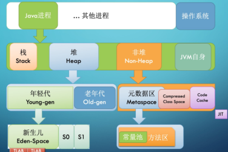

## 1. 整体结构
### 1.1 内存结构  
&emsp;&emsp;  
* jvm有线程栈和堆内存，jvm线程中创建普通局部变量是存在线程栈中的，所有线程创建的对象（其中包括Integer之类的包装类）是存在一个堆内存中的，存在线程栈中的变量和其它线程互不干扰，不能直接共享。

* 线程栈中如果是原生数据类型的则保存的是值，如果是引用类型，则保存堆内存的地址。对象保存在堆中，包含成员变量

* 静态变量和类定义都保存在堆中
* Java的内存分为：堆、栈、非堆、jvm自身  

&emsp;&emsp;我们结合java类部分，方法中的操作都会创建stack，基于statck进行变量的计算，可以得出如下的图:  
&emsp;&emsp;  
* jvm创建一个线程的时候会分配线程栈一个大小空间，-Xss1m代表分配1m的空间。
* 线程执行过程中，一般会有多个方法调用栈（Stack Trace）, 比如 A 调用 B每执行到一个方法，就会创建对应的 栈帧（Frame）

### 1.2 堆内存模型  
&emsp;&emsp;堆内存会被划分两个部分，年轻代和老年代  
&emsp;&emsp;  
&emsp;&emsp;如图所示：  
* 新创建的对象会被放在eden区，当它放满了或者达到了一定阈值，会触发minorgc。
* 随后会将存活的对象迁移至s0区，下一次minorgc，eden区对象迁移至s1区，s0的对象也复制至s1区，无用的对象将清理，s0将清空。
* 下一次minorgc, 放到s0, s1复制到s0, s1清空，如此反复。如果年龄超过15次也放到老年代。
* 终于s0/或者s1的占用达到了一定的阈值，也会将它放到老年代。  
  

&emsp;&emsp;GC的更多细节我们后面再进一步探讨

## 2. 垃圾回收
&emsp;&emsp;系统的内存资源是有限的，像C语言的应用程序就必须自行编写内存回收的代码，否则就会产生内存泄漏、应用崩溃的现象。java不会要求的开发者对使用的内存进行管理和回收，但是内存的管理和回收被JVM的垃圾回收器实现了。了解JVM有哪些垃圾回收器和一些相关的参数配置，对程序的调优非常重要，下面我们开始学习相关的知识。
### 2.1. 垃圾回收算法
### 2.1.1. 标记
内存中哪些对象是垃圾呢，哪些是有用的对象呢？  
* 引用计数算法  
  &emsp;&emsp;是一个对象被其它对象引用，就会将对象的一个引用计数的属性加1，如果一个对象的属性变成了0，就说明这个对象  
     
  如上图所示，如果出现了循环依赖的对象，那么标记永远无法清零
* 引用跟踪算法  
  &emsp;&emsp;从根开始，标记正在使用的对象，没被标记的就是废除的对象，标记的根主要又有这些对象：  
    * 活动的线程
    * 正在执行的局部方法变量
    * 静态变量对象
    * Jni引用  
  
  **注意：标记的对象和存活的对象有直接的关系，和堆内存的大小无关。**

### 2.1.2. 清理
  &emsp;&emsp;使用引用跟踪技术标记有用的对象，清除废除的对象，因为内存会产生很多碎片，需要对剩下来的对象压缩整理。
标记的时候，因为对象可能会发生变化，所以需要stw   
  
**注意：使用-XX：+MaxTenuringThreshold=15可以控制年轻代到老年代年龄阈值大小。**  
 
 &emsp;&emsp;为什么要将堆内存进行分代呢？  
  &emsp;&emsp;基于一个分代假设，大部分的对象都能够快速被回收，小部分不能被回收的对象可能会存活更长时间，那么就可以将大部分对象快速回收的放在年轻代，小部分长时间或者的对象放在老年代。
老年代中，gc过程：标记会从根开始，将存活的对象从老年代内存的开头以此存放进去，其它的地方全部清空。

### 2.1.3. 小结  
​	根据它们的行为我们一共可以将这些算法分为：标记清除、标记复制、标记清除整理
由于标记清除的不足（产生碎片），我们有了s0和s1,然后复制再来清空。
但是如果存活对象太多，那么会产生很多无效的复制以及一般空间的浪费，所以可以先清除无用的对象，然后移动剩余的对象到一块，然后清空边界以外的空间。老年代的算法一般就是标记清除整理。老年代的对象基本可能存活时间长，如果复制的话会消耗更多的空间，并且复制的对象过多，也一定程度影响效率。

### 2.2. java垃圾回收器
#### 2.2.1. 串行垃圾回收器（+UseSerialGC）  
&emsp;&emsp;在年轻代使用 标记复制算法，在老年代使用标记整理算法。
该垃圾回收器，很老，只有线程，不能充分利用cpu资源，采用的是复制算法，但是回收效率慢，停顿时间长。
#### 2.2.2. 并行GC（+UseParallelGC）  
&emsp;&emsp;在年轻代使用 标记复制算法，在老年代使用标记整理算法。Java默认垃圾回收器。
它默认gc线程为cpu核心线程数，充分利用了cpu的性能进行回收，可以使用-XX：ParallelGCThreads来显示配置gc线程数
GC充分利用了系统资源，能够大限度提高吞吐量。  
**PS:如果一个机器部署了多个java进程，那么默认每个java进程都会采用机器核心cpu数的gc线程。线程数多的情况下，上下文切换耗费过多时间，导致gc变慢。
并行垃圾回收器是java8默认的垃圾回收器，它以吞吐量优先为目的**
#### 2.2.3. cms gc(+UseConcMarkSweepGC)  

参考文章：https://javabase.cn/p/94#%E5%9E%83%E5%9C%BE%E5%9B%9E%E6%94%B6%E5%99%A8%E7%BB%84%E5%90%88

​	并行GC，在GC的时候会全心全意的进行GC，当扫描的对象特别多的时候，stw时间还是很长的，系统会有明显的卡顿。如果应用对卡顿很敏感，那么这种就不可被接受，那么cms就是因为这个被设计出来的。  
​	因为卡顿主要是老年代回收比较慢，所以尽可能加快老年代的回收速度，因为它从这两方面进行改进

* 第一，它在老年代执行的是标记清除算法，并没有整理。
* 第二，采用了空闲列表来管理内存。这一切都是为了降低回收的卡顿，它清除回收对象的时候是和业务线程并发执行的。

并发标记一般采用的是三色标记法。默认gc线程是cpu核数四分之一  
  
  
  
&emsp;&emsp;它将回收的过程拆分了很多步骤，其中大部分是和业务线程并发执行的，所以延迟较低。CMS回收分为6步：

* 初始标记(STW initial mark)
* 并发标记(Concurrent marking)
* 并发预清理(Concurrent precleaning)
* 重新标记(STW remark)
* 并发清理(Concurrent sweeping)
* 并发重置(Concurrent reset)  
  

以上过程中，带有Concurrent字样的都是和业务线程并发运行的，所以它的能尽可能减少gc的时候停顿时间;  

适用的系统：老年代对象比较多，延迟容忍度低，内存和cpu配置高的系统。

缺点：需要额外空间作为缓冲空间，以便标记时能够继续分配对象，一般不会满的时候进行回收，占一定比例后就触发垃圾回收；老年代内存不会进行内存整理，是使用可用列表，实际使用的时候对象大小不一，存在一定的浪费。

#### 2.2.4. G1(+UseG1GC -XX:MaxGCPauseMillis=30)  
&emsp;&emsp;G1收集器的设计目标是取代CMS收集器，它同CMS相比，在以下方面表现的更出色:   
* 不会产生很多内存碎片
* G1在停顿时间上添加了预测机制，用户可以指定期望停顿时间，系统hi自动调教年轻代的大小。
 &emsp;&emsp;是java推出的新概览gc,zgc的停顿时间不超过10MS,吞吐量影响不超过15%
  Shenandoah gc号称gc的停顿时间与内存大小无关。  
    
  &emsp;&emsp;一般将内存分为2048个小方块，每一块可能是eden，也可能是old，也可能是s区，回收的时候，年轻代都会gc，old的是部分gc。在并发阶段估算每个小块存活对象的总数。构建回收集的原则是，垃圾最多的小块会被优先收集。这也是 G1 名称的由来。  
    
  &emsp;&emsp;如上图所示：h代表的存放大对象的，即超过region的一半的对象。
  H区实际是属于老年代空间的。  
  G1的配置参数有很多，其中比较核心的有
* -XX：+GCTimeRatio：  
  这个参数就是计算花在 Java 应用线程上和花在 GC 线程上的时间比率，默认是9，跟新生代内存的分配比例一致。这个参数主要的目的是让用户可以控制花在应用上的时间，G1 的计算公式是 100/（1+GCTimeRatio）。这样如果参数设置为 9，则最多 10% 的时间会花在 GC 工作上面。Parallel GC 的默认值是 99，表示 1% 的时间被用在 GC 上面，这是因为 Parallel GC 贯穿整个 GC，而 G1 则根据 Region 来进行划分，不需要全局性扫描整个内存堆
* -XX：MaxGCPauseMills：  
  预期 G1 每次执行 GC 操作的暂停时间，单位是毫秒，默认值是 200 毫秒，G1 会尽量保证控制在这个范围内。

G1垃圾回收机制很复杂，具体的原理需要单独分析，后续会单独描述（参考博客
https://mp.weixin.qq.com/s?__biz=MzkzNTEwOTAxMA==&mid=2247492843&idx=1&sn=b8311c8253579bf2b5de782e41185cde&chksm=c2b1ac16f5c62500512e5aff51f0de1fe64e907c556949092f66b2c0244f4848590b61bcb799&token=1065023599&lang=zh_CN#rd）  

&emsp;&emsp;可以总结调优参数可以如下： 

&emsp;&emsp;主要是几个核心的参数可以调，需要结合实际的应用运行后的监控情况调整和验证：
* -XX:MaxGCPauseMillis（gc的最大暂停时间，默认值200ms）  
  理论肯定小点好，但是太小会导致gc的频率高，因为G1会尽量达成设置的gc时间目标，但是如果达不成会自己调整内存，最终可能导致很快触发Young GC、Mixed GC最终导致full gc。
* -XX:G1MaxNewSizePercent（新生代比例最大比率，默认值60%）  
  如果从监控中发现每次younggc效果不明显，次数多，可以适度调大点，毕竟younggc比较轻量级，但是太大留给老年代就不多了，容易full gc
* -XX:G1HeapWastePercent（触发Mixed GC的堆垃圾占比，默认值5%）  
  可以尝试适当的调高此阈值，能够适当的降低Mixed GC的频率
* -XX:G1HeapRegionSize（Region大小）  
  应用里如果有很多大小差不多的巨型对象，可以适当调整Region的大小，使得对象能够比较均匀放到region中
* -XX:ConcGCThreads、-XX:ParallelGCThreads（gc的线程数，默认根据核数自动计算）  
  可以自己调整观察

#### 2.2.5. ZGC/Shenandoah GC  
&emsp;&emsp;是java推出的新概览gc,zgc的停顿时间不超过10MS,吞吐量影响不超过15%
Shenandoah gc号称gc的停顿时间与内存大小无关。
#### 2.2.6. 如何选择GC
* 吞吐量要求较高，推荐使用 Parallel GC
* 要求低延迟，推荐cms
* 系统内存大，延迟可控，推荐，g1
* 如果可以配置的内存特别大，而且对延迟非常敏感，则推荐使用新GC（zgc和shenandoah）