## 1. 概述

前面已经介绍了响应的回收算法，分为标记和清理阶段，标记有计数和引用跟踪的方法，java自身提供的垃圾回收器有很多种，有：

* 串行垃圾回收器（+UseSerialGC）

  会停止当前应用进程，回收垃圾，停顿时间久，吞吐量大，响应时间长

* 并行GC（+UseParallelGC）  

  是多个线程同时执行串行回收算法（多核），也会使应用停顿，吞吐量大，响应时间长，用户体验差

* cms gc(+UseConcMarkSweepGC)

  应用和垃圾回收多个线程并发执行，吞吐量相对小，响应时间短，用户体验好

* G1(+UseG1GC -XX:MaxGCPauseMillis=30)  

   并发 + 并行回收 + 标记管理

* ZGC/Shenandoah GC    

  很先进

PS：

* 并行（parallel)

  指多条垃圾收集线程并行工作，但此时用户线程仍然处于等待状态

* 并发（Concurrent）

  指用户线程与垃圾收集线程同时执行（但不一定是并行的，可能会交替进行），用户程序在继续镜像，而垃圾收集程序运行于另一个CPU上。

## 2. 回收算法

之前也分析回收算法，有多种算法，标记清理、标记复制清理、标记整理算法等，但是如何进行标记的呢？主要有两种标记算法： 

### 2.1. 标记算法

#### 2.1.1. 引用计数

给对象添加一个计数器，每当有地方引用它计数器就+1，反之引用失效时就-1，那么计数器值为0的对象就是可以回收的对象，但是有一个问题就是循环引用的话无法解决

#### 2.1.2. 可达性分析(引用跟踪算法)

对于现在的虚拟机来说，主要用的算法是可达性分析算法

* 定义GC ROOTS根对象集合
* 通过GC ROOTS向下搜索，搜索的过程走过的路径称作引用链
* 如果某个对象到GC ROOTS没有任何引用链，那么就是对象不可达，是可以被回收的对象
* 不可达对象需要进行两次标记，第一次发现没有引用链相连，会被第一次标记
  * 如果需要执行finalize()方法，之后这个对象会被放进队列中等待执行finalize()
  * 如果在finalize()中成功和引用链上的其他对象关联，就会被移出可回收对象集合。（但是不建议使用finalize()方法  


### 2.2. 分代假说

有这么一个假说：

* 绝大多数对象都是朝生夕死的

* 熬过越多次垃圾回收的对象越难死亡

​	就产生了现在我们常见的年轻代和老年代

​	年轻代放死的快的对象。每次年轻代内存不够我们就触发MinorGC，以后还有存活的对象我们就根据经历过MinorGC次数和动态年龄判断来决定是否晋升老年代。老年代则存放老不死的对象，这里GC称之为OldGC，现在也有很多人把他叫做FullGC，实际上这并不准确，FullGC应该泛指年轻代和老年代的的GC

### 2.3. 记忆集

​	假如我们进行MinorGC，会不会有对象被老年代引用着，进行OldGC也可能会有对象被年轻代引用着，如果是的话，那我们进行MinorGC的时候不光要管GC Roots，还有再去遍历老年代，这个性能问题就很大。于是就有了这个假说

* 跨代引用相对于同代引用来说仅占极少数

​	当我们进行young gc时，我们的gc roots除了常见的栈引用、静态变量、常量、锁对象、class对象这些常见的之外，如果老年代有对象引用了我们的新生代对象，那么老年代的对象也应该加入gc roots的范围中，但是如果每次进行young gc我们都需要扫描一次老年代的话，那我们进行垃圾回收的代价实在是太大了，因此我们引入了一种叫做记忆集的抽象数据结构来记录这种引用关系

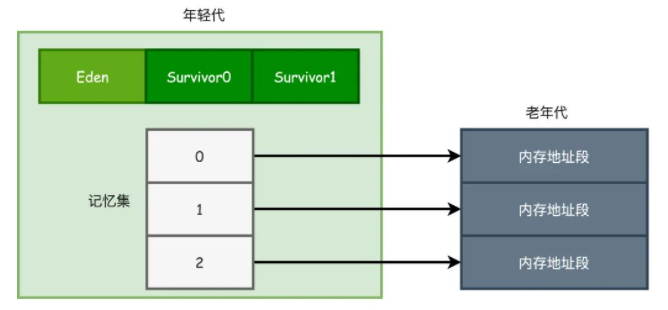 

​	记忆集是一种用于记录从非收集区域指向收集区域的指针集合的数据结构，假如所有的老年代对象都有指针指向了新生代，那么我们需要维护整个老年代大小的记忆集，毫无疑问这种方法是不可取的。因此我们引入了卡表的数据结构

#### 2.3.1.  卡表

​	卡表实际上就是记忆集的一种实现方式。

​	对于HotSpot虚拟机来说，卡表的实现方式就是一个字节数组。

​	卡表就是映射了一块块的内存地址，这些内存地址块称为**卡页**。如果该区域中有引用指向了待回收区域的对象，卡表数组对应的元素将被置为1，没有则置为0；

​	从代码可以看出每个卡页的大小就是2^9=512kb。如果转换为16进制，数组的0，1号元素就映射为0x0000～0x01FF(0-511)、0x0200～0x03FF(512-1023)内存地址的卡页。


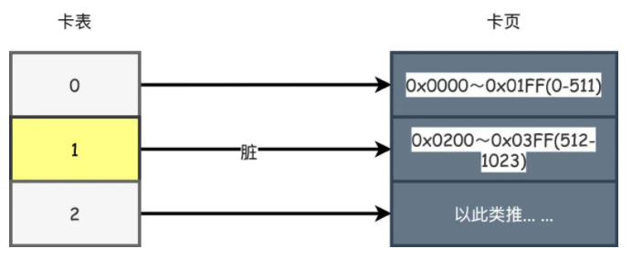

**卡表使用原理：**

* 只要一个卡页内的对象存在一个或者多个跨代对象指针，就将该位置的卡表数组元素修改为1，表示这个位置为脏，没有则为0。

* 在GC的时候，就直接把值为1对应的卡页对象指针加入GC Roots一起扫描即可。

* 我们就不需要去在发生MinorGC的时候扫描整个老年代了，性能得到了极大的提升 

**如何标记脏页：**

​	卡表的数组元素要修改成1，也就是脏的状态，对于HotSpot来说是通过写屏障来实现的，就是在其他分代引用了当前分代的对象时候，在对引用进行赋值的时候进行更新，更新的方式类似AOP的切面思想：

```
void oop_field_store(oop* field, oop new_value) { 
    // 引用字段赋值操作
    *field = new_value;
    // 写后屏障，在这里完成卡表状态更新 
    post_write_barrier(field, new_value);
}
```

**伪共享问题：**

​	假设处理器的缓存行大小为64字节，由于一个卡表元素占1个字节，64个卡表元素将共享同一个缓存行。这64个卡表元素对应的卡页总的内存为32KB（64×512字节），也就是说如果不同线程更新的对象正好处于这32KB的内存区域内，就会导致更新卡表时正好写入同一个缓存行而影响性能。为了避免伪共享问题，一种简单的解决方案是不采用无条件的写屏障，而是先检查卡表标记，只有当该卡表元素未被标记过时才将其标记为变脏，即将卡表更新的逻辑变为以下代码所示

​	我们可以使用`-XX:+UseCondCardMark`，代表是否开启卡表更新的判断，没有被标记过才标记为脏

```
if (CARD_TABLE [this address >> 9] != 0) 
   CARD_TABLE [this address >> 9] = 0;
```

**小结：**

​	具体行为是将老年代堆内存空间分为一个个相等的小区间，每一个区间被称为Card Page，每个Card Page在Dirty Card表中会有一个对应的bit位标识其状态，如果一个对象的引用关系改变，写屏障逻辑就会将其所在的Card Page就会被标记位Dirty。注意Dirty标记是不是标记在对象上面的，而是标记到对象所在的Card Page上面。扫描时是扫描Card Page中的所有对象。一个Card Page可能不只有一个对象，那么并发情况一个Card Page的多个对象发生改变，那么都需要对Dirty Card表的同一位进行标记修改，这时间就会发生伪共享（false sharding：缓存系统中是以缓存行（cache line）为单位存储的，当多线程修改互相独立的变量时，如果这些变量共享同一个缓存行，就会无意中影响彼此的性能，这就是伪共享）的问题。为了解决这个问题，JDK1.7加入一个参数-XX:+UseCondCardMark来控制是否进行有条件的写屏障，开启时就会判断目标Card Page是否已经被标记为Dirty，如果是就不再重复进行标记了。

**注意：**

​	引用关系更新是指老年代对象对老年代对象引用更新，新生代对老年代新的引用并不算引用更新

​	需要标记的是引用对象所在的Card而不是被引用对象，比如老年代中新增A->B,那么标记在A的Card，而不是标记在B的Card。原因是A引用B，扫描A所在Card时如果A是存活节点那么B也就是存活节点，A是待回收节点B也是待回收节点。如果标记在B上，那么就会出现只知道B被别人引用了，但是引用他的是一个存活节点还是死亡节点却无法判断

### 2.3. 三色标记

​	卡表解决了跨代收集和根节点枚举的性能问题。而有了这些措施实际上枚举根节点这个过程造成的STW停顿已经属于可控范围。

​	GC Roots开始遍历，怎么才能高效的标记这些对象，这就是三色标记法的作用了。**因为如果堆内的对象越多，那么显然标记产生的停顿时间就越长**。

CMS举例：

* 初始标记

  标记GC ROOT能关联到的对象，这一步需要STW，但是停顿的时间很短。

* 并发标记

  从GCRoots的直接关联对象开始遍历整个对象图的过程，这个时间会比较长，但是现在是可以和用户线程并发执行的，这个效率的问题就是三色标记关注的问题。

所以三色标记主要是解决和用户线程并发的时候标记的问题。

#### 2.3.1. 标记过程

三色标记法中，把从GC Roots开始遍历的对象标记为以下三种颜色：

* 白色，在刚开始遍历的时候，所有的对象都是白色的

  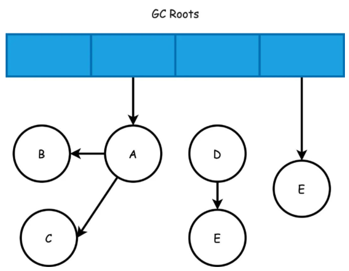 

  

* 灰色，被垃圾回收器扫描过，但是至少还有一个引用没有被扫描

  A、E对象被扫描到变成灰色，B、C对象开始被扫描变成灰色

* 黑色，被垃圾回收器扫描过，并且这个对象的引用也全部都被扫描过，是安全存活的对象

  B、C他们的引用也被扫描完成后自己也就都变成了黑色

  A、E对象的引用也都被扫描，A、E对象变成黑色

  最后剩下的E、F节点就是可以被回收的对象了

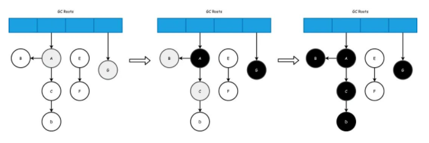 

#### 2.3.2. 三色标记问题

三色标记并发标记的时候，有两种情况：

* 有些对象在开始阶段是存活，但是后来又变成垃圾了。应该要清理的对象标记成存活，这样本次GC就无法清理这个对象，这个被称作为浮动垃圾，解决方案就是等下次GC的时候再清理

* 如果把存活对象标记成需要清理，那么就有点麻烦了，这样你的程序就该出问题了

  只有同时满足两个条件才会发生这种对象消失的问题：

  * 插入了一条或者多条黑色到白色对象的引用
  * 删除了全部从灰色到白色对象的引用

  **例子：**

  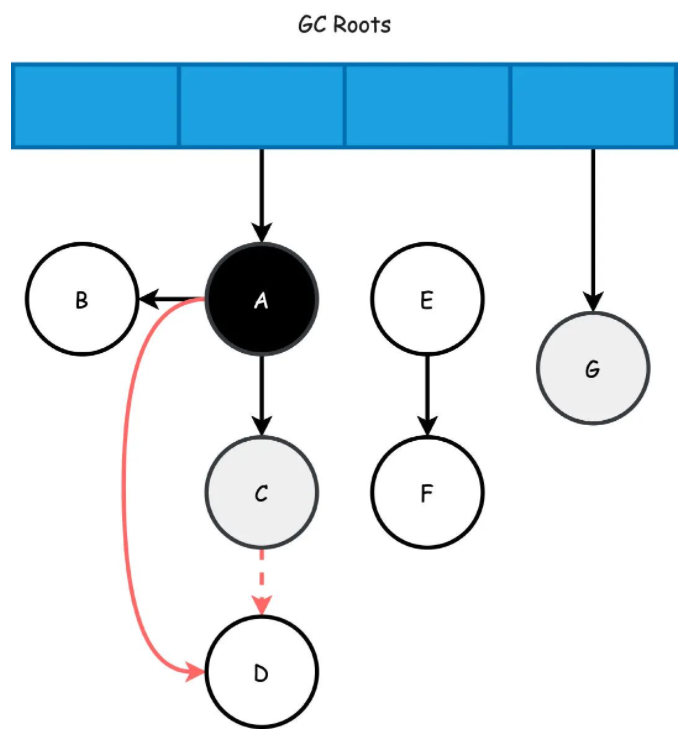 

  * 假设A扫描完，刚好C成为灰色
  * 此时C->D的引用删除，同时A->D新增了引用（同时满足两个条件了吧）
  * 这样本来按照顺序接下来D应该会变成黑色(黑色对象不应该被清理)
  * 但是由于C->D没有引用了，A已经成为了黑色对象，他不会再被重新扫描了
  * 即便新增了A->D的引用，D也只能成为白色对象，最终被无情地清理

**解决方案：**

​	针对这个问题也有两种解决方案：**增量更新**和**原始快照**，如果对应到垃圾回收器的话，CMS使用的是增量更新，而像G1则是使用原始快照。

* 增量更新

  ​	会把这些新插入的引用记录下来，扫描结束之后，再以黑色对象为根重新扫描一次。这样看起来不就是增量更新吗，新插入的记录再扫一次！

* 原始快照

  ​	破坏第二个条件，他把这个要删除的引用记录下来，扫描结束之后，以灰色对象为根重新扫描一次。所以就像是快照一样，不管你删没删，其实最终还是会按照之前的关系重新来一次

## 3. cms gc

### 3.1. 特点

* cms只会回收老年代和永久带（1.8开始为元数据区，需要设置CMSClassUnloadingEnabled），不会收集年轻带；

* cms是一种预处理垃圾回收器，它不能等到old内存用尽时回收，需要在内存用尽前，完成回收操作，否则会导致并发回收失败；所以cms垃圾回收器开始执行回收操作，有一个触发阈值，默认是老年代或永久带达到92%；

### 3.2. 回收过程

#### 3.2.1. 整体过程

1. 初始标记(CMS-initial-mark) ,会导致swt；
2. 并发标记(CMS-concurrent-mark)，与用户线程同时运行；
3. 预清理（CMS-concurrent-preclean），与用户线程同时运行；
4. 可被终止的预清理（CMS-concurrent-abortable-preclean） 与用户线程同时运行；
5. 重新标记(CMS-remark) ，会导致swt；
6. 并发清除(CMS-concurrent-sweep)，与用户线程同时运行；
7. 并发重置状态等待下次CMS的触发(CMS-concurrent-reset)，与用户线程同时运行；

#### 3.2.2. 初始标记

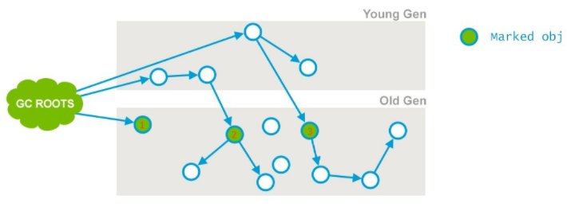 

* 标记老年代中所有的GC Roots对象

  gc roots对象的分布：

  * 虚拟机栈(栈桢中的本地变量表)中的引用的对象 ；

  * 方法区中的类静态属性引用的对象 ；

  * 方法区中的常量引用的对象 ；

  * 本地方法栈中JNI的引用的对象

* 年轻代中活着的对象引用到的老年代的对象，即指的是年轻带中还存活的引用类型对象，引用指向老年代中的对象  

**ps：为了加快此阶段处理速度，减少停顿时间，可以开启初始标记并行化，-XX:+CMSParallelInitialMarkEnabled，同时调大并行标记的线程数，线程数不要超过cpu的核数；**

#### 3.2.3.并发标记

从“初始标记”阶段标记的对象开始找出所有存活的对象;

因为是并发运行的，在运行期间会发生新生代的对象晋升到老年代、或者是直接在老年代分配对象、或者更新老年代对象的引用关系等等，对于这些对象，都是需要进行重新标记的，否则有些对象就会被遗漏，发生漏标的情况。为了提高重新标记的效率，该阶段会把上述对象所在的Card标识为Dirty，后续只需扫描这些Dirty Card的对象，避免扫描整个老年代； 并发标记阶段只负责将引用发生改变的Card标记为Dirty状态，不负责处理；

如下图所示，也就是节点1、2、3，最终找到了节点4和5。并发标记的特点是和应用程序线程同时运行。并不是老年代的所有存活对象都会被标记，因为标记的同时应用程序会改变一些对象的引用等

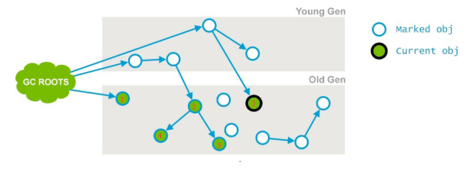 

#### 3.2.4.并发标记

前一个阶段已经说明，不能标记出老年代全部的存活对象，是因为标记的同时应用程序会改变一些对象引用，这个阶段就是用来处理前一个阶段因为引用关系改变导致没有标记到的存活对象的，它会扫描所有标记为Dirty的Card 如下图所示，在并发清理阶段，节点3的引用指向了6；则会把节点3的card标记为Dirty

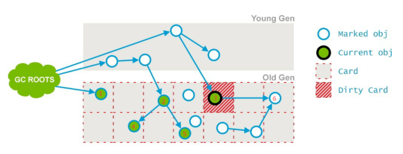 

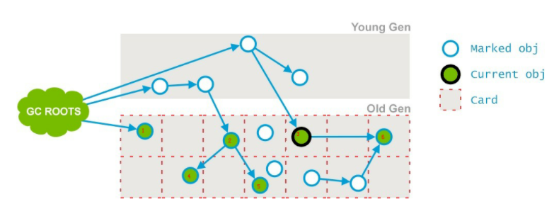 

最后将6标记为存活

#### 3.2.5. 并发标记

这个阶段尝试着去承担下一个阶段Final Remark阶段足够多的工作。这个阶段持续的时间依赖好多的因素，由于这个阶段是重复的做相同的事情直到发生aboart的条件（比如：重复的次数、多少量的工作、持续的时间等等）之一才会停止。

**ps:此阶段最大持续时间为5秒，之所以可以持续5秒，另外一个原因也是为了期待这5秒内能够发生一次ygc，清理年轻带的引用，是的下个阶段的重新标记阶段，扫描年轻带指向老年代的引用的时间减少**

#### 3.2.6. 重新标记

这个阶段会导致第二次stop the word，该阶段的任务是完成标记整个年老代的所有的存活对象。

这个阶段，重新标记的内存范围是整个堆，包含_young_gen和_old_gen。

为什么要扫描新生代呢？

因为对于老年代中的对象，如果被新生代中的对象引用，那么就会被视为存活对象，即使新生代的对象已经不可达了，也会使用这些不可达的对象当做cms的“gc root”，来扫描老年代；

因此对于老年代来说，引用了老年代中对象的新生代的对象，也会被老年代视作“GC ROOTS”

当此阶段耗时较长的时候，可以加入参数-XX:+CMSScavengeBeforeRemark，在重新标记之前，先执行一次ygc，回收掉年轻带的对象无用的对象，并将对象放入幸存带或晋升到老年代，这样再进行年轻带扫描时，只需要扫描幸存区的对象即可，一般幸存带非常小，这大大减少了扫描时间 由于之前的预处理阶段是与用户线程并发执行的，这时候可能年轻带的对象对老年代的引用已经发生了很多改变，这个时候，remark阶段要花很多时间处理这些改变，会导致很长stop the word，所以通常CMS尽量运行Final Remark阶段在年轻代是足够干净的时候。

另外，还可以开启并行收集：-XX:+CMSParallelRemarkEnabled

#### 3.2.7. 并发清理

通过以上5个阶段的标记，老年代所有存活的对象已经被标记并且现在要通过Garbage Collector采用清扫的方式回收那些不能用的对象了。 这个阶段主要是清除那些没有标记的对象并且回收空间；

由于CMS并发清理阶段用户线程还在运行着，伴随程序运行自然就还会有新的垃圾不断产生，这一部分垃圾出现在标记过程之后，CMS无法在当次收集中处理掉它们，只好留待下一次GC时再清理掉。这一部分垃圾就称为“浮动垃圾”。

#### 3.2.8. 并发重置

这个阶段并发执行，重新设置CMS算法内部的数据结构，准备下一个CMS生命周期的使用。


### 3.3.  CMS问题

#### 3.3.1. CMS不是full GC 

有一点需要注意的是：CMS并发GC不是“full GC”。HotSpot VM里对concurrent collection和full collection有明确的区分。所有带有“FullCollection”字样的VM参数都是跟真正的full GC相关，而跟CMS并发GC无关的，cms收集算法只是清理老年代。

#### 3.3.2. 减少remark阶段停顿

一般CMS的GC耗时 80%都在remark阶段，如果发现remark阶段停顿时间很长，可以尝试添加该参数：

```
-XX:+CMSScavengeBeforeRemark
```

在执行remark操作之前先做一次ygc，目的在于减少ygen对oldgen的无效引用，降低remark时的开销，如果添加该参数后 ”ygc停顿时间+remark时间<添加该参数之前的remark时间“,说明该参数是有效的；

#### 3.3.3. 内存碎片

CMS是基于标记-清除算法的，只会将标记为为存活的对象删除，并不会移动对象整理内存空间，会造成内存碎片，这时候我们需要用到这个参数;

```
-XX:CMSFullGCsBeforeCompaction=n
```

​		这个参数大部分人的使用方式都是错误的，往往会导致设置后问题更大。 CMSFullGCsBeforeCompaction这		个参数在HotSpot VM里是这样声明的：

然后这样使用的：

```
*should_compact =
    UseCMSCompactAtFullCollection &&
    ((_full_gcs_since_conc_gc >= CMSFullGCsBeforeCompaction) ||
     GCCause::is_user_requested_gc(gch->gc_cause()) ||
     gch->incremental_collection_will_fail(true /* consult_young */));
```

CMS GC要决定是否在full GC时做压缩，会依赖几个条件。其中，

1. UseCMSCompactAtFullCollection 与 CMSFullGCsBeforeCompaction 是搭配使用的；前者目前默认就是true了，也就是关键在后者上。
2. 用户调用了System.gc()，而且DisableExplicitGC没有开启。
3. young gen报告接下来如果做增量收集会失败；简单来说也就是young gen预计old gen没有足够空间来容纳下次young GC晋升的对象。 上述三种条件的任意一种成立都会让CMS决定这次做full GC时要做压缩。

CMSFullGCsBeforeCompaction 说的是，在上一次CMS并发GC执行过后，到底还要再执行多少次full GC才会做压缩。默认是0，也就是在默认配置下每次CMS GC顶不住了而要转入full GC的时候都会做压缩。 如果把CMSFullGCsBeforeCompaction配置为10，就会让上面说的第一个条件变成每隔10次真正的full GC才做一次压缩（而不是每10次CMS并发GC就做一次压缩，目前VM里没有这样的参数）。这会使full GC更少做压缩，也就更容易使CMS的old gen受碎片化问题的困扰。 本来这个参数就是用来配置降低full GC压缩的频率，以期减少某些full GC的暂停时间。CMS回退到full GC时用的算法是mark-sweep-compact，但compaction是可选的，不做的话碎片化会严重些但这次full GC的暂停时间会短些；这是个取舍。

#### 3.3.4. concurrent mode failure

这个异常发生在cms正在回收的时候。执行CMS GC的过程中，同时业务线程也在运行，当年轻带空间满了，执行ygc时，需要将存活的对象放入到老年代，而此时老年代空间不足，这时CMS还没有机会回收老年带产生的，或者在做Minor GC的时候，新生代救助空间放不下，需要放入老年代，而老年代也放不下而产生的。 设置cms触发时机有两个参数：

```
-XX:+UseCMSInitiatingOccupancyOnly
-XX:CMSInitiatingOccupancyFraction=70 
```

​	-XX:CMSInitiatingOccupancyFraction=70 是指设定CMS在对内存占用率达到70%的时候开始GC。

​	-XX:+UseCMSInitiatingOccupancyOnly如果不指定, 只是用设定的回收阈值CMSInitiatingOccupancyFraction,	则JVM仅在第一次使用设定值,后续则自动调整会导致上面的那个参数不起作用。

​	为什么要有这两个参数？

​	 由于在垃圾收集阶段用户线程还需要运行，那也就还需要预留有足够的内存空间给用户线程使用，因此CMS收集器不能像其他收集器那样等到老年代几乎完全被填满了再进行收集，需要预留一部分空间提供并发收集时的程序运作使用。

​	CMS前五个阶段都是标记存活对象的，除了”初始标记”和”重新标记”阶段会stop the word ，其它三个阶段都是与用户线程一起跑的，就会出现这样的情况gc线程正在标记存活对象，用户线程同时向老年代提升新的对象，清理工作还没有开始，old gen已经没有空间容纳更多对象了，这时候就会导致concurrent mode failure， 然后就会使用串行收集器回收老年代的垃圾，导致停顿的时间非常长。

CMSInitiatingOccupancyFraction参数要设置一个合理的值，设置大了，会增加concurrent mode failure发生的频率，设置的小了，又会增加CMS频率，所以要根据应用的运行情况来选取一个合理的值。

如果发现这两个参数设置大了会导致fullgc，设置小了会导致频繁的cmsgc，说明你的老年代空间过小，应该增加老年代空间的大小了；

#### 3.3.5. promotion failed

这个异常发生在年轻带回收的时候； 在进行Minor GC时，Survivor Space放不下，对象只能放入老年代，而此时老年代也放不下造成的，多数是由于老年带有足够的空闲空间，但是由于碎片较多，新生代要转移到老年带的对象比较大,找不到一段连续区域存放这个对象导致的，以下是一段promotion failed的日志： 

```
106.641: [GC 106.641: [ParNew (promotion failed): 14784K->14784K(14784K), 0.0370328 secs]106.678: [CMS106.715: [CMS-concurrent-mark: 0.065/0.103 secs] [Times: user=0.17 sys=0.00, real=0.11 secs] (concurrent mode failure): 41568K->27787K(49152K), 0.2128504 secs] 52402K->27787K(63936K), [CMS Perm : 2086K->2086K(12288K)], 0.2499776 secs] [Times: user=0.28 sys=0.00, real=0.25 secs]
```

##### 3.3.5.1. 过早提升与提升失败

​	在 Minor GC 过程中，Survivor Unused 可能不足以容纳 Eden 和另一个 Survivor 中的存活对象， 那么多余的将被移到老年代， 称为过早提升（Premature Promotion）,这会导致老年代中短期存活对象的增长， 可能会引发严重的性能问题。 再进一步， 如果老年代满了， Minor GC 后会进行 Full GC， 这将导致遍历整个堆， 称为提升失败（Promotion Failure）。

##### 3.3.5.2. 早提升的原因

1. Survivor空间太小，容纳不下全部的运行时短生命周期的对象，如果是这个原因，可以尝试将Survivor调大，否则端生命周期的对象提升过快，导致老年代很快就被占满，从而引起频繁的full gc；
2. 对象太大，Survivor和Eden没有足够大的空间来存放这些大象；

##### 3.3.5.3. 提升失败原因

当提升的时候，发现老年代也没有足够的连续空间来容纳该对象。 为什么是没有足够的连续空间而不是空闲空间呢？ 老年代容纳不下提升的对象有两种情况：

* 老年代空闲空间不够用了；

* 老年代虽然空闲空间很多，但是碎片太多，没有连续的空闲空间存放该对象；

解决方法:

* 如果是因为内存碎片导致的大对象提升失败，cms需要进行空间整理压缩；

* 如果是因为提升过快导致的，说明Survivor 空闲空间不足，那么可以尝试调大 Survivor；

* 如果是因为老年代空间不够导致的，尝试将CMS触发的阈值调低；

#### 3.3.6. 其它导致回收停顿时间变长原因

linux使用了swap，内存换入换出（vmstat），尤其是开启了大内存页的时候，因为swap只支持4k的内存页，大内存页的大小为2M，大内存页在swap的交换的时候需要先将swap中4k内存页合并成一个大内存页再放入内存或将大内存页切分为4k的内存页放入swap，合并和切分的操作会导致操作系统占用cup飙高，用户cpu占用反而很低； 除了swap交换外，网络io（netstat）、磁盘I/O （iostat）在 GC 过程中发生会使 GC 时间变长。 如果是以上原因，就要去查看gc日志中的Times耗时：

```
[Times: user=0.00 sys=0.00, real=0.00 secs] 
```

user是用户线程占用的时间，sys是系统线程占用的时间，如果是io导致的问题，会有两种情况

1. user与sys时间都非常小，但是real却很长，如下：

```
[ Times: user=0.51 sys=0.10, real=5.00 secs ] 
```

user+sys的时间远远小于real的值，这种情况说明停顿的时间并不是消耗在cup执行上了，不是cup肯定就是io导致的了，所以这时候要去检查系统的io情况。

1. sys时间很长，user时间很短，real几乎等于sys的时间，如下：

```
[ Times: user=0.11 sys=31.10, real=33.12 secs ] 
```

这时候其中一种原因是开启了大内存页，还开启了swap，大内存进行swap交换时会有这种现象；

#### 3.3.7. 增加线程数

CMS默认启动的回收线程数目是 (ParallelGCThreads + 3)/4) ，这里的ParallelGCThreads是年轻代的并行收集线程数，感觉有点怪怪的； 年轻代的并行收集线程数默认是(ncpus <= 8) ? ncpus : 3 + ((ncpus * 5) / 8)，可以通过-XX:ParallelGCThreads= N 来调整； 如果要直接设定CMS回收线程数，可以通过-XX:ParallelCMSThreads=n，注意这个n不能超过cpu线程数，需要注意的是增加gc线程数，就会和应用争抢资源；

参考：https://javabase.cn/p/94#%E5%9E%83%E5%9C%BE%E5%9B%9E%E6%94%B6%E5%99%A8%E7%BB%84%E5%90%88

## 4. G1 gc

​	所有的垃圾回收器的目的都是朝着减少STW的目的而前进，G1(Garbage First)回收器的出现颠覆了之前版本CMS、Parallel等垃圾回收器的分代收集方式，从2004年Sun发布第一篇关于G1的论文后，直到2012年JDK7发布更新版本，花了将近10年的时间G1才达到商用的程度，而到JDK9发布之后，G1成为了默认的垃圾回收器。


### 4.1. 结构

内存划分为多个大小相等的独立区域Region，每个大小为1~32MB，默认最多可以有2048个Region，那么按照默认值计算G1能管理的最大内存就是32MB*2048=64G

一共有4种Region：

* 自由分区Free Region

* 年轻代分区Young Region（年轻代还是会存在Eden和Survivor的区分）

* 老年代分区Old Region

* 大对象分区Humongous Region

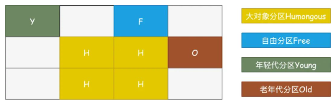 

**注意：对于大对象的存储，存在Humongous概念，对G1来说，超过一个Region一半大小的对象都被认为大对象，将会被放入Humongous Region，而对于超过整个Region的大对象，则用几个连续的Humongous来存储**

### 4.2. 机制

​	G1最大的优势就在于**可预测的停顿时间模型**，我们可以自己通过参数`-XX:MaxGCPauseMillis`来设置允许的停顿时间(默认200ms)，G1会收集每个Region的回收之后的空间大小、回收需要的时间，根据评估得到的价值，在后台维护一个优先级列表，然后基于我们设置的停顿时间优先回收**价值收益最大**的Region。

#### 4.2.1. 停顿时间模型

​	基于**衰减平均值**的理论基础，衰减平均是一种数学方法，用来计算一个数列的平均值，给近期的数据更高的权重，强调近期数据对结果的影响

```
hotspot/src/share/vm/gc_implementation/g1/g1CollectorPolicy.hpp
double get_new_prediction(TruncatedSeq* seq) {
  return MAX2(seq->davg() + sigma() * seq->dsd(),
              seq->davg() * confidence_factor(seq->num()));
}
```

**解释：**

* `davg`表示衰减值
* `dsd`表示衰减标准偏差
* `confidence_factor`表示可信度系数，用于当样本数据不足(小于5个)时取一个大于1的值，样本数据越少该值越大  

​	G1希望根据用户设置的停顿时间（只是期望时间，尽量努力在这个范围内完成GC）来选择需要对哪些Region进行回收，能回收多大空间。比如过去10次回收10G内存花费1s，如果预设的停顿时间是200ms，那么就最多可以回收2G的内存空间

#### 4.2.2. 新生代和老年代划分

新生代和老年代的空间如何划分呢？

​	G1中，新增了两个参数`G1MaxNewSizePercent`、`G1NewSizePercent`，用来控制新生代的大小，默认的情况下`G1NewSizePercent`为5，也就是占整个堆空间的5%，`G1MaxNewSizePercent`默认为60，也就是堆空间的60%

举例，我们可以粗略的估算：

* 假设现在我们的堆空间大小是4G
* 按照默认最大2048个Region计算，每个Region的大小就是2M。
* 初始新生代的大小那么就是200M，大约100个Region格子，
* 动态扩展最大就是60%*4G=2.4G大小，大约1200个Region格子

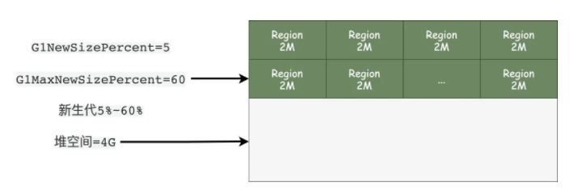 

​	我们还可以通过原有参数`-Xms`设置初始堆的大小，`-Xmx`设置最大堆的大小还是生效的，可以设置堆的大小。其规则如下：

* 可以通过原有参数`-Xmn`或者新的参数`G1NewSizePercent`、`G1MaxNewSizePercent`来设置年轻代的大小，如果设置了`-Xmn`相当于设置`G1NewSizePercent`=`G1MaxNewSizePercent`
* 接着看是不是设置了`-XX:NewRatio`(表示年轻代与老年代比值，默认值为2，代表年轻代老年代大小为1:2)，如果**1**都设置了，那么忽略`NewRatio`，反之则代表`G1NewSizePercent`=`G1MaxNewSizePercent`，并且分配规则还是按照`NewRatio`的规则
* 如果只是设置了`G1NewSizePercent`、`G1MaxNewSizePercent`中的一个，那么就按照这两个参数的默认值5%和60%来设置
* 如果设置了`-XX:SurvivorRatio`，默认为8，那么Eden和Survivor还是按照这个比例来分配

**注意：如果说新生代走默认的规则，每次动态扩展空间大小怎么办？**

有一个参数叫做`-XX:GCTimeRatio`表示GC时间与应用耗费时间比，默认为9，就是说GC时间和应用时间占比超过10%才进行扩展，扩展比例为20%，最小不能小于1M

#### 4.2.3. 回收过程

总体的步骤：

* 初始标记：标记GC ROOT能关联到的对象，需要STW

* 并发标记：从GCRoots的直接关联对象开始遍历整个对象图的过程，扫描完成后还会重新处理并发标记过程中产生变动的对象
* 最终标记：短暂暂停用户线程，再处理一次，需要STW
* 筛选回收：更新Region的统计数据，对每个Region的回收价值和成本排序，根据用户设置的停顿时间制定回收计划。再把需要回收的Region中存活对象复制到空的Region，同时清理旧的Region。需要STW

分代：

G1也又分代的概念

* 年轻代GC

  年轻代Region在超过我们默认设置的最大大小之后就会触发GC，还是用的我们熟悉的复制算法，Eden和Survivor来回倒腾

* Mixed GC混合回收

  混合回收类似于之前我们的Full GC概念，既会回收年轻代的Region，也会回收老年代的Region，还有我们新的Humongous大对象区域。触发规则根据参数`-XX:InitiatingHeapOccupancyPercent`(默认45%)值，也就是说老年代Region达到整个堆内存的45%时触发Mixed GC

#### 4.2.4. 跨代引用

​	为了避免GC时扫描整个堆内存，用来标志哪些区域存在跨代引用，对于G1来说也一样，只不过G1的记忆集会更复杂一点

* 每个Region中都存在一个Hash Table结构的记忆集，Key为其他Region的起始地址，Value是其他Card Table卡表的索引集合。
* 原来我们的卡表指向的是卡页的内存地址段，代表我引用了谁，现在的记忆集则是代表着谁引用了我，因此收集的过程会更复杂一点，并且需要额外的10%~20%的堆内存空间来维持。
* 维护记忆集的方式也和卡表类似，通过**写屏障**来实现
* 在三色标记中我们也提到过，并发标记用户线程和收集线程一起工作会产生问题，解决方案CMS使用的是增量更新，G1则是用原始快照

## 5. 总结

垃圾回收器组合：

| young             | old                          | JVM options                                     |
| ----------------- | ---------------------------- | ----------------------------------------------- |
| Serial            | Serial                       | -XX:+UseSerialGC                                |
| Parallel Scavenge | Serial    -XX:+UseParallelGC | -XX:-UseParallelOldGC                           |
| Parallel Scavenge | Parallel Old                 | -XX:+UseParallelGC -XX:+UseParallelOldGC        |
| Parallel          | New或Serial                  | CMS    -XX:+UseParNewGC -XX:+UseConcMarkSweepGC |
| G1                |                              | -XX:+UseG1GC                                    |

垃圾回收器从线程运行情况分类有三种：

1. 串行回收，Serial回收器，单线程回收，全程stw；
2. 并行回收，名称以Parallel开头的回收器，多线程回收，全程stw；
3. 并发回收，cms与G1，多线程分阶段回收，只有某阶段会stw
