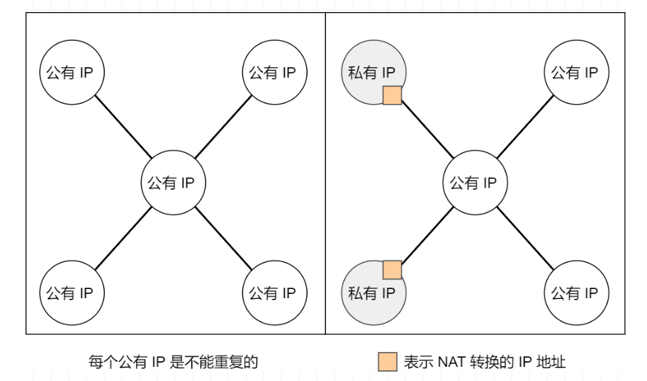
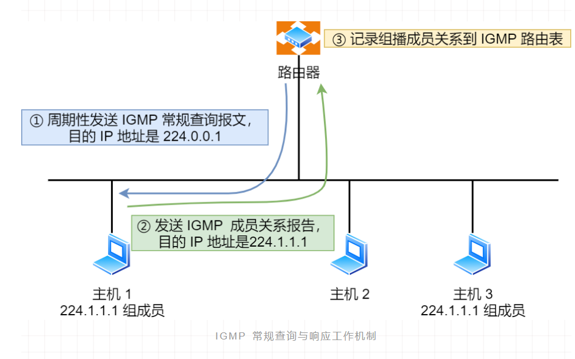

## 1. 开头

本文主要介绍tcp/ip协议蔟中ip协议。主要从三大块介绍：

* IP基本认识
* IP地址的基础知识
* IP协议相关技术

## 2. ip基本认识

### 2.1. ip的作用

​	IP 在 TCP/IP 参考模型中处于第三层，也就是**网络层**。而网络层的主要作用是：**实现主机与主机之间的通信，也叫点对点（end to end）通信**。

 

### 2.2. IP与MAC

 IP 的作用是主机之间通信中的，而 **MAC 的作用则是实现「直连」的两个设备之间通信，而 IP 则负责在「没有直连」的两个网络之间进行通信传输**

 

* **计算机网络中需要「数据链路层」和「网络层」这个分层才能实现向最终目标地址的通信**
* **源IP地址和目标IP地址在传输过程中是不会变化的，只有源 MAC 地址和目标 MAC 一直在变化**

## 3. ip地址

​	在 TCP/IP 网络通信时，为了保证能正常通信，每个设备都需要配置正确的 IP 地址，否则无法实现正常的通信。IP 地址（IPv4 地址）由 `32` 位正整数来表示，IP 地址在计算机是以二进制的方式处理的。

​	人类为了方便记忆采用了**点分十进制**的标记方式，也就是将 32 位 IP 地址以每 8 位为组，共分为 `4` 组，每组以「`.`」隔开，再将每组转换成十进制。

​	 	

**IP的最大数量为2的32次方，最大允许 43 亿台计算机连接到网络。**

​	IP 地址并不是根据主机台数来配置的，而是以网卡。像服务器、路由器等设备都是有 2 个以上的网卡，也就是它们会有 2 个以上的 IP 地址

 

43 亿台计算机全部连网其实是不可能的，更何况 IP 地址是由「网络标识」和「主机标识」这两个部分组成的。计算机使用了NAT更换 IP 地址的技术 使得可连接计算机数超过 43 亿台。`NAT` 技术后续会进一步讨论和说明。

### 3.1. ip分类

IP 地址分类成了 5 种类型，分别是 A 类、B 类、C 类、D 类、E 类。

 

#### 3.1.1. ABC类地址

其中对于 A、B、C 类主要分为两个部分，分别是**网络号和主机号**。这很好理解，他是 A 小区 1 栋 101 号，你是 B 小区 1 栋 101 号。

 

最大主机个数，就是要看主机号的位数，如 C 类地址的主机号占 8 位，那么 C 类地址的最大主机个数：

 

在 IP 地址中，有两个 IP 是特殊的，分别是主机号全为 1 和 全为 0 地址

 

- 主机号全为 1 指定某个网络下的所有主机，用于广播
- 主机号全为 0 指定某个网络

#### 3.1.2. 广播地址

广播地址用于在**同一个链路中相互连接的主机之间发送数据包**。

当主机号全为 1 时，就表示该网络的广播地址。例如把 `172.20.0.0/16` 用二进制表示如下：

10101100.00010100.00000000.00000000

将这个地址的**主机部分全部改为 1**，则形成广播地址：

10101100.00010100.**11111111.11111111**

再将这个地址用十进制表示，则为 `172.20.255.255`。

广播地址可以分为本地广播和直接广播两种。

- **在本网络内广播的叫做本地广播**。

  例如网络地址为 192.168.0.0/24 的情况下，广播地址是 192.168.0.255 。因为这个广播地址的 IP 包会被路由器屏蔽，所以不会到达 192.168.0.0/24 以外的其他链路上。

- **在不同网络之间的广播叫做直接广播**。

  例如网络地址为 192.168.0.0/24 的主机向 192.168.1.255/24 的目标地址发送 IP 包。收到这个包的路由器，将数据转发给192.168.1.0/24，从而使得所有 192.168.1.1~192.168.1.254 的主机都能收到这个包（由于直接广播有一定的安全问题，多数情况下会在路由器上设置为不转发）


#### 3.1.3. DE类地址

而 D 类和 E 类地址是没有主机号的，所以不可用于主机 IP，D 类常被用于**多播**，E 类是预留的分类，暂时未使用

 

多播用于**将包发送给特定组内的所有主机**

 

多播使用的 D 类地址，其前四位是 `1110` 就表示是多播地址，而剩下的 28 位是多播的组编号

224.0.0.0 ~ 239.255.255.255 都是多播的可用范围，其划分为以下三类：

- 224.0.0.0 ~ 224.0.0.255 为预留的组播地址，只能局域网中，路由器是不会进行转发的
- 224.0.1.0 ~ 238.255.255.255  为用户可用的组播地址，可以用于 Internet 上
- 239.0.0.0 ~ 239.255.255.255 为本地管理组播地址，可供内部网在内部使用，仅在特定的本地范围内有效

#### 3.1.4. 优缺点

* **优点：**

​	不管是路由器还是主机解析到一个 IP 地址时候，我们判断其 IP 地址的首位是否为 0，为 0 则为 A 类地址，那么就能很快的找出网络地	址和主机地址

 

简单明了、选路（基于网络地址）简单

**缺点：**

* **同一网络下没有地址层次**

  比如一个公司里用了 B 类地址，但是可能需要根据生产环境、测试环境、开发环境来划分地址层次，而这种 IP 分类是没有地址层次划分的功能，所以这就**缺少地址的灵活性**。

* A、B、C类有个尴尬处境。就是**不能很好的与现实网络匹配**。

  - C 类地址能包含的最大主机数量实在太少了，只有 254 个，估计一个网吧都不够用。

  - 而 B 类地址能包含的最大主机数量又太多了，6 万多台机器放在一个网络下面，一般的企业基本达不到这个规模，闲着的地址就是浪费

### 3.2. 无分类地址 CIDR

正因为 IP 分类存在许多缺点，所有后面提出了无分类地址的方案，即 `CIDR`。这种方式不再有分类地址的概念，32 比特的 IP 地址被划分为两部分，前面是**网络号**，后面是**主机号**。CIDR格式的格式有两种。

#### 3.2.1.  斜杠

表示形式 `a.b.c.d/x`，其中 `/x` 表示前 x 位属于**网络号**， x 的范围是 `0 ~ 32`。

**例如：**10.100.122.2/24，这种地址表示形式就是 CIDR，`/24` 表示前 24 位是网络号，剩余的 8 位是主机号。

 

#### 3.2.2. 子网掩码

还有另一种划分网络号与主机号形式，那就是**子网掩码**，掩码的意思就是掩盖掉主机号，剩余的就是网络号。

**将子网掩码和 IP 地址按位计算 AND，就可得到网络号**

 


​	因为两台计算机要通讯，首先要判断是否处于同一个广播域内，即网络地址是否相同。如果网络地址相同，表明接受方在本网络上，那么可以把数据包直接发送到目标主机，路由器寻址工作中，也就是通过这样的方式来找到对应的网络号的，进而把数据包转发给对应的网络内

 

#### 3.2.3. 子网划分

上面我们知道可以通过子网掩码划分出网络号和主机号，那实际上子网掩码还有一个作用，那就是**划分子网**

**子网划分实际上是将主机地址分为两个部分：子网网络地址和子网主机地址**。形式如下：

 

- 未做子网划分的 ip 地址：网络地址＋主机地址
- 做子网划分后的 ip 地址：网络地址＋（子网网络地址＋子网主机地址）

举例如下：

假设对 C 类地址进行子网划分，网络地址 192.168.1.0，使用子网掩码 255.255.255.192 对其进行子网划分

C 类地址中前 24 位 是网络号，最后 8 位是主机号，根据子网掩码可知**从 8 位主机号中借用 2 位作为子网号**

 

由于子网网络地址被划分成 2 位，那么子网地址就有 4 个，分别是 00、01、10、11，

 

### 3.3. 公有私有地址

在 A、B、C 分类地址，实际上有分公有 IP 地址和 私有 IP 地址。

 

​	平时我们办公室、家里、学校用的 IP 地址，一般都是私有 IP 地址。因为这些地址允许组织内部的 IT 人员自己管理、自己分配，而且可以重复。因此，你学校的某个私有 IP 地址和我学校的可以是一样的

​	就像每个小区都有自己的楼编号和门牌号，你小区家可以叫  1 栋 101 号，我小区家也可以叫 1 栋 101，没有任何问题。但一旦出了小区，就需要带上中山路 666 号（公网 IP 地址），是国家统一分配的，不能两个小区都叫中山路 666

​	公有 IP 地址是有个组织统一分配的，假设你要开一个博客网站，那么你就需要去申请购买一个公有 IP，这样全世界的人才能访问。并且公有 IP 地址基本上要在整个互联网范围内保持唯一

 

私有 IP 地址通常是内部的 IT 人员值管理，公有 IP 地址是由 `ICANN` 组织管理，中文叫「互联网名称与数字地址分配机构」。

IANA 是 ICANN 的其中一个机构，它负责分配互联网 IP 地址，是按州的方式层层分配。

 

- ARIN 北美地区
- LACNIC 拉丁美洲和一些加勒比群岛
- RIPE NCC 欧洲、中东和中亚
- AfriNIC 非洲地区
- APNIC 亚太地区

其中，在中国是由 CNNIC 的机构进行管理，它是中国国内唯一指定的全局 IP 地址管理的组织

### 3.4. 路由控制

IP地址的**网络地址**这一部分是用于进行路由控制。路由控制表中记录着网络地址与下一步应该发送至路由器的地址，在主机和路由器上都会有各自的路由器控制表。

​	在发送 IP 包时，首先要确定 IP 包首部中的目标地址，再从路由控制表中找到与该地址具有**相同网络地址**的记录，根据该记录将 IP 包转发给相应的下一个路由器。如果路由控制表中存在多条相同网络地址的记录，就选择相同位数最多的网络地址，也就是最长匹配。

#### 3.4.1. 案例

 

* 主机 A 要发送一个 IP 包

  其源地址是 `10.1.1.30` 和目标地址是 `10.1.2.10`，由于没有在主机 A 的路由表找到与目标地址 `10.1.2.10` 的网络地址，于是把包被转发到默认路由（路由器 `1` ）

* 路由器 `1` 收到 IP 包后

  也在路由器 `1` 的路由表匹配与目标地址相同的网络地址记录，发现匹配到了，于是就把 IP 数据包转发到了 `10.1.0.2` 这台路由器 `2`

* 路由器 `2` 收到后

  同样对比自身的路由表，发现匹配到了，于是把 IP 包从路由器 `2` 的 `10.1.2.1` 这个接口出去，最终经过交换机把 IP 数据包转发到了目标主机

#### 3.4.2. 环回地址

环回地址是在同一台计算机上的程序之间进行网络通信时所使用的一个默认地址。计算机使用一个特殊的 IP 地址 **127.0.0.1 作为环回地址，**与该地址具有相同意义的是一个叫做 `localhost` 的主机名。使用这个 IP 或主机名时，数据包不会流向网络

### 3.5. IP分片与重组

​	每种数据链路的最大传输单元 `MTU` 都是不相同的，如 FDDI 数据链路 MTU 4352、以太网的 MTU 是 1500 字节等。每种数据链路的 MTU 之所以不同，是因为每个不同类型的数据链路的使用目的不同。使用目的不同，可承载的 MTU 也就不同。

​	其中，我们最常见数据链路是以太网，它的 MTU 是 `1500` 字节。那么当 IP 数据包大小大于 MTU 时， IP 数据包就会被分片。经过分片之后的 IP 数据报在被重组的时候，只能由目标主机进行，路由器是不会进行重组的。

​	假设发送方发送一个 4000 字节的大数据报，若要传输在以太网链路，则需要把数据报分片成 3 个小数据报进行传输，再交由接收方重组成大数据报

 

在分片传输中，一旦某个分片丢失，则会造成整个 IP 数据报作废，所以 TCP 引入了 `MSS` 也就是在 TCP 层进行分片不由 IP 层分片，那么对于 UDP 我们尽量不要发送一个大于 `MTU` 的数据报文

### 3.6. IPv6

IPv4 的地址是 32 位的，大约可以提供 42 亿个地址，但是早在 2011 年 IPv4 地址就已经被分配完了。

IPv6 的地址是 `128` 位的，这可分配的地址数量是大的惊人，说个段子 **IPv6 可以保证地球上的每粒沙子都能被分配到一个 IP 地址**

但 IPv6 除了有更多的地址之外，还有更好的安全性和扩展性，说简单点就是 IPv6 相比于 IPv4 能带来更好的网络体验。但是因为 IPv4 和 IPv6 不能相互兼容，所以不但要我们电脑、手机之类的设备支持，还需要网络运营商对现有的设备进行升级，所以这可能是 IPv6 普及率比较慢的一个原因

#### 3.6.1. IPv6优点

IPv6 不仅仅只是可分配的地址变多了，他还有非常多的亮点。

- IPv6 可自动配置，即使没有 DHCP 服务器也可以实现自动分配IP地址，真是**便捷到即插即用**啊。
- IPv6 包头包首部长度采用固定的值 `40` 字节，去掉了包头校验和，简化了首部结构，减轻了路由器负荷，大大**提高了传输的性能**。
- IPv6 有应对伪造 IP 地址的网络安全功能以及防止线路窃听的功能，大大**提升了安全性**。

#### 3.6.2.  IPv6 地址格式

* IPv4 地址长度共 32 位，是以每 8 位作为一组，并用点分十进制的表示方式。

* IPv6 地址长度是 128 位，是以每 16 位作为一组，每组用冒号 「:」 隔开。

   

  

* 如果出现连续的 0 时还可以将这些 0 省略，并用两个冒号 「::」隔开。但是，一个 IP 地址中只允许出现一次两个连续的冒号

   

#### 3.6.3.  IPv6 地址的结构

IPv6 类似 IPv4，也是通过 IP 地址的前几位标识 IP 地址的种类。

IPv6 的地址主要有一下类型地址：

- 单播地址，用于一对一的通信
- 组播地址，用于一对多的通信
- 任播地址，用于通信最近的节点，最近的节点是由路由协议决定
- 没有广播地址

 

#### 3.6.4.  IPv6单播地址类型

对于一对一通信的 IPv6 地址，主要划分了三类单播地址，每类地址的有效范围都不同。

- 在同一链路单播通信，不经过路由器，可以使用**链路本地单播地址**，IPv4 没有此类型
- 在内网里单播通信，可以使用**唯一本地地址**，相当于 IPv4 的私有 IP
- 在互联网通信，可以使用**全局单播地址**，相当于 IPv4 的公有 IP

 

#### 3.6.5.  IPv4 与 IPv6 首部

 

IPv6 相比 IPv4 的首部改进：

- **取消了首部校验和字段。**

   因为在数据链路层和传输层都会校验，因此 IPv6 直接取消了 IP 的校验。

- **取消了分片/重新组装相关字段。**

  分片与重组是耗时的过程，IPv6 不允许在中间路由器进行分片与重组，这种操作只能在源与目标主机，这将大大提高了路由器转发的速度。

- **取消选项字段。**

   选项字段不再是标准 IP 首部的一部分了，但它并没有消失，而是可能出现在 IPv6 首部中的「下一个首部」指出的位置上。删除该选项字段是的 IPv6 的首部成为固定长度的 `40` 字节。

## 4. ip协议

IP 协议相关的技术也不少，接下来说说与 IP 协议相关的重要且常见的技术。

- DNS 域名解析
- ARP 与 RARP 协议
- DHCP 动态获取 IP 地址
- NAT 网络地址转换
- ICMP 互联网控制报文协议
- IGMP 因特网组管理协

### 4.1. DNS

​	我们在上网的时候，通常使用的方式域名，而不是 IP 地址，因为域名方便人类记忆。那么实现这一技术的就是 **DNS 域名解析**，DNS 可以将域名网址自动转换为具体的 IP 地址。

#### 4.1.1. 域名层级关系

DNS 中的域名都是用**句点**来分隔的，比如 `www.server.com`，这里的句点代表了不同层次之间的**界限**在域名中，**越靠右**的位置表示其层级**越高**

域名的层级关系类似一个树状结构：

 

- 根 DNS 服务器

  根域的 DNS 服务器信息保存在互联网中所有的 DNS 服务器中。

  这样一来，任何 DNS 服务器就都可以找到并访问根域 DNS 服务器了

- 顶级域 DNS 服务器（com）

- 权威 DNS 服务器（server.com）

客户端只要能够找到任意一台 DNS 服务器，就可以通过它找到根域 DNS 服务器，然后再一路顺藤摸瓜找到位于下层的某台目标 DNS 服务器

#### 4.1.2. 域名解析流程

浏览器首先看一下自己的缓存里有没有，如果没有就向操作系统的缓存要，还没有就检查本机域名解析文件 `hosts`，如果还是没有，就会 DNS 服务器进行查询，查询的过程如下：

 

* 客户端首先会发出一个 DNS 请求问 www.server.com 的 IP 是啥，并发给本地 DNS 服务器（也就是客户端的 TCP/IP 设置中填写的 DNS 服务器地址）。

* 本地域名服务器收到客户端的请求后，如果缓存里的表格能找到 www.server.com，则它直接返回 IP 地址。如果没有，本地 DNS 会去问它的根域名服务器，根域名服务器是最高层次的，它不直接用于域名解析，但能指明一条道路。

* 根 DNS 收到来自本地 DNS 的请求后，发现后置是 .com，会返回 .com 顶级域名服务器地址给你

* 本地 DNS 收到顶级域名服务器的地址后，会向.com顶级域名服务器索要ip地址？”

* .com顶级域名服务器返回权威 DNS 服务器的地址”。

* 本地 DNS 于是转向问权威 DNS 服务器请求， server.com 的权威 DNS 服务器，它是域名解析结果的原出处。为啥叫权威呢？就是我的域名我做主。

* 权威 DNS 服务器查询后将对应的 IP 地址 X.X.X.X 告诉本地 DNS。

* 本地 DNS 再将 IP 地址返回客户端，客户端和目标建立连接

整个过程就和我们工作的时候，像其他部门沟通，不知道找谁，但是根据地址能找到老大，老二，最后能找到老三

### 4.2. ARP

在传输一个 IP 数据报的时候，确定了源 IP 地址和目标 IP 地址后，就会通过主机「路由表」确定 IP 数据包下一跳。

然而，网络层的下一层是数据链路层，所以我们还要知道「下一跳」的 MAC 地址。

由于主机的路由表中可以找到下一条的 IP 地址，所以可以通过 **ARP 协议**，求得下一跳的 MAC 地址。

#### 4.2.1. ARP寻址

 

ARP 是借助 **ARP 请求与 ARP 响应**两种类型的包确定 MAC 地址：

- 主机会通过**广播发送 ARP 请求**

  这个包中包含了想要知道的 MAC 地址的主机 IP 地址。

- 当同个链路中的所有设备收到 ARP 请求时

  会去拆开 ARP 请求包里的内容，如果 ARP 请求包中的目标 IP 地址与自己的 IP 地址一致，那么这个设备就将自己的 MAC 地址塞入 **ARP 响应包**返回给主机

- 操作系统通常会把第一次通过 ARP 获取的 MAC 地址缓存起来，以便下次直接从缓存中找到对应 IP 地址的 MAC 地址

  MAC 地址的缓存是有一定期限的，超过这个期限，缓存的内容将被清除

#### 4.2.2. RARP 协议

ARP 协议是已知 IP 地址 求 MAC 地址，那 RARP 协议正好相反。

它是**已知 MAC 地址求 IP 地址**。例如将打印机服务器等小型嵌入式设备接入到网络时就经常会用得到。

通常这需要架设一台 `RARP` 服务器，在这个服务器上注册设备的 MAC 地址及其 IP 地址。然后再将这个设备接入到网络：

- 该设备会发送一条「我的 MAC 地址是XXXX，请告诉我，我的IP地址应该是什么」的请求信息。
- RARP 服务器接到这个消息后返回「MAC地址为 XXXX 的设备，IP地址为 XXXX」的信息给这个设备
- 最后，设备就根据从 RARP 服务器所收到的应答信息设置自己的 IP 地址

 

### 4.3. DHCP

DHCP 在生活中我们是很常见的了，我们的电脑通常都是通过 DHCP 动态获取 IP 地址，大大省去了配 IP 信息繁琐的过程。

#### 4.3.1. 获取IP过程

我们来看看我们的电脑是如何通过 4 个步骤的过程，获取到 IP 的：

 

DHCP 客户端进程监听的是 68 端口号，DHCP 服务端进程监听的是 67 端口号。

- 客户端首先发起 **DHCP 发现报文（DHCP DISCOVER）** 的 IP 数据报，由于客户端没有 IP 地址，也不知道 DHCP 服务器的地址，所以使用的是 UDP **广播**通信，其使用的广播目的地址是 255.255.255.255（端口 67） 并且使用 0.0.0.0（端口 68） 作为源 IP 地址。DHCP 客户端将该 IP 数据报传递给链路层，链路层然后将帧广播到所有的网络中设备。
- DHCP 服务器收到 DHCP 发现报文时，用 **DHCP 提供报文（DHCP OFFER）** 向客户端做出响应。该报文仍然使用 IP 广播地址 255.255.255.255，该报文信息携带服务器提供可租约的 IP 地址、子网掩码、默认网关、DNS 服务器以及 **IP 地址租用期**。
- 客户端收到一个或多个服务器的 DHCP 提供报文后，从中选择一个服务器，并向选中的服务器发送 **DHCP 请求报文（DHCP REQUEST**进行响应，回显配置的参数。
- 最后，服务端用 **DHCP ACK 报文**对 DHCP 请求报文进行响应，应答所要求的参数。
- 一旦客户端收到 DHCP ACK 后，交互便完成了，并且客户端能够在租用期内使用 DHCP 服务器分配的 IP 地址
- 如果租约的 DHCP IP 地址快期后，客户端会向服务器发送 DHCP 请求报文：
  - 服务器如果同意继续租用，则用 DHCP ACK 报文进行应答，客户端就会延长租期。
  - 服务器如果不同意继续租用，则用 DHCP NACK 报文，客户端就要停止使用租约的 IP 地址

**PS：DHCP 交互中，全程都是使用 UDP 广播通信**

#### 4.3.2. **DHCP 中继代理**

DHCP用的是广播，那如果 DHCP 服务器和客户端不是在同一个局域网内，路由器又不会转发广播包，那不是每个网络都要配一个 DHCP 服务器吗，为了解决这一问题，就出现了 **DHCP 中继代理**。有了 DHCP 中继代理以后，**对不同网段的 IP 地址分配也可以由一个 DHCP 服务器统一进行管理**

 

- DHCP 客户端会向 DHCP 中继代理发送 DHCP 请求包，而 DHCP 中继代理在收到这个广播包以后，再以**单播**的形式发给 DHCP 服务器。
- 服务器端收到该包以后再向 DHCP 中继代理返回应答，并由 DHCP 中继代理将此包转发给 DHCP 客户端
- DHCP 服务器即使不在同一个链路上也可以实现统一分配和管理IP地址

### 4.4. NAT

IPv4 的地址是非常紧缺的，在前面我们也提到可以通过无分类地址来减缓 IPv4 地址耗尽的速度，但是互联网的用户增速是非常惊人的，所以 IPv4 地址依然有被耗尽的危险。于是，提出了一个种**网络地址转换 NAT** 的方法，再次缓解了 IPv4 地址耗尽的问题。

#### 4.4.1. 转换机制

简单的来说 NAT 就是在同个公司、家庭、教室内的主机对外部通信时，把私有 IP 地址转换成公有 IP 地址。

 

普通的 NAT 转换没什么意义，因为N 个 私有 IP 地址，你就要 N 个公有 IP 地址。但是绝大多数的网络应用都是使用传输层协议 TCP 或 UDP 来传输数据的。因此，可以把 IP 地址 + 端口号一起进行转换。

这样，就用一个全球 IP 地址就可以了，这种转换技术就叫**网络地址与端口转换 NAPT**

 

* 图中有两个客户端 192.168.1.10 和 192.168.1.11 同时与服务器 183.232.231.172 进行通信，并且这两个客户端的本地端口都是 1025。

* **两个私有 IP 地址都转换 IP 地址为公有地址 120.229.175.121，但是以不同的端口号作为区分。**

* 生成一个 NAPT 路由器的转换表，就可以正确地转换地址跟端口的组合，令客户端 A、B 能同时与服务器之间进行通信。

* 这种转换表在 NAT 路由器上自动生成。

  例如，在 TCP 的情况下，建立 TCP 连接首次握手时的 SYN 包一经发出，就会生成这个表。而后又随着收到关闭连接时发出 FIN 包的确认应答从表中被删除

#### 4.4.2. 缺陷

NAT/NAPT 都依赖于自己的转换表，因此会有以下的问题：

- 外部无法主动与 NAT 内部服务器建立连接，因为 NAPT 转换表没有转换记录。
- 转换表的生产与转换操作都会产生性能开销。
- 通信过程中，如果 NAT 路由器重启了，所有的 TCP 连接都将被重置

#### 4.4.3. 解决方案

* 改用 IPv6

  IPv6 可用范围非常大，以至于每台设备都可以配置一个公有 IP 地址，就不搞那么多花里胡哨的地址转换了，但是 IPv6 普及速度还需要一些时间

* NAT 穿透技术

  NAT 穿越技术拥有这样的功能，它能够让网络应用程序主动发现自己位于 NAT 设备之后，并且会主动获得 NAT 设备的公有 IP，并为自己建立端口映射条目，注意这些都是 NAT设备后的应用程序自动完成的。

  也就是说，在 NAT 穿越技术中，NAT 设备后的应用程序处于主动地位，它已经明确地知道 NAT 设备要修改它外发的数据包，于是它主动配合 NAT 设备的操作，主动地建立好映射，这样就不像以前由 NAT 设备来建立映射了。

  说人话，就是客户端主动从 NAT 设备获取公有 IP 地址，然后自己建立端口映射条目，然后用这个条目对外通信，就不需要 NAT 设备来进行转换了
  
  > ##### A 与 B 分别在不同的局域网中
  >
  > 这样实际上 A 与 B 中间就隔了两个 NAT 网关，这是最普遍的一种情况。
  >
  > STUN/TURN 的 NAT 穿透流程大致如下：
  >
  > - 首先，A 跟 B 两个程序启动时，需要把自己的内外网 IP 及端口信息上报到一台中介服务器 S
  >
  > - 现在假设 A 想要跟 B 建立一个 P2P 连接，首先他们需要从 S 获得对方的 ID
  >
  > - A 将 B 的 ID 发送给中介服务器 S，请求与 B 建立 P2P 连接
  >
  > - 中介服务器将 B 的内外网 IP 及端口信息发送给 A，同时将 A 的网络信息发送给 B
  >
  > - A 尝试请求 B 的公网地址
  >
  >    
  >
  >   ```
  >   B_public_ip:B_public_port
  >   ```
  >
  >   - 这肯定会失败，但是会在 A 的 NAT 网关上留下记录：A 曾经请求过这个地址，那之后这个地址发到 A 的 NAT 网关的流量就可以进来了。
  >
  > - B 尝试请求 A 的公网地址
  >
  >    
  >
  >   ```
  >   A_public_ip:A_public_port
  >   ```
  >
  >   - 同样这肯定也会失败，但是会在 B 的 NAT 网关上流量记录：B 曾经请求过这个地址，那之后这个地址发到 B 的 NAT 网关的流量就可以进来了
  >
  > - 中间的两层 NAT 网关均形成 NAT 穿越记录，**穿越完成**。
  >
  > - 现在 A 尝试请求 B 的公网地址 `B_public_ip:B_public_port`，由于 B 的 NAT 已有记录，流量顺利通过 NAT 到达程序 B
  >
  > - B 发送给 A 的数据也同样，可以顺利到达 A
  >
  > 上述流程中的关键点在于，如何查出内网服务器被 NAT 分配的外部 IP 及端口，只要有了这两个信息，就可以通过 STUN 中介服务器交换这个信息，然后完成连接的建立了。家庭服务器通常都只有一个公网 IP，所以基本可以认为 IP 是固定的，因此最关键的问题就是「**如何知道 NAT 为会话分配的端口地址**」。
  >
  > 对端口的限制严格程度跟 NAPT 的类型有关，**Full-cone 跟 Restricted cone 对端口都没有任何限制，所以上述流程肯定可以成功**
  
  

### 4.5. ICMP

ICMP 全称是 **Internet Control Message Protocol**，也就是**互联网控制报文协议**。

#### 4.5.1. ICMP功能

`ICMP` 主要的功能包括：**确认 IP 包是否成功送达目标地址、报告发送过程中 IP 包被废弃的原因和改善网络设置等**。

即 在 `IP` 通信中如果某个 `IP` 包因为某种原因未能达到目标地址，那么这个具体的原因将**由 ICMP 负责通知**

 

如上图例子

* 主机 `A` 向主机 `B` 发送了数据包
* 由于某种原因，途中的路由器 `2` 未能发现主机 `B` 的存在
* 这时，路由器 `2` 就会向主机 `A` 发送一个 `ICMP` 目标不可达数据包，说明发往主机 `B` 的包未能成功。
* ICMP 的这种通知消息会使用 `IP` 进行发送 。
* 因此，从路由器 `2` 返回的 ICMP 包会按照往常的路由控制先经过路由器 `1` 再转发给主机 `A` 。收到该 ICMP 包的主机 `A` 则分解 ICMP 的首部和数据域以后得知具体发生问题的原因

#### 4.5.2. ICMP类型

ICMP 大致可以分为两大类：

- 一类是用于诊断的查询消息，也就是「**查询报文类型**」
- 另一类是通知出错原因的错误消息，也就是「**差错报文类型**」

 

### 4.6. IGMP

ICMP 跟 IGMP 是一点关系都没有

在前面我们知道了组播地址，也就是 D 类地址，既然是组播，那就说明是只有一组的主机能收到数据包，不在一组的主机不能收到数组包，怎么管理是否是在一组呢？那么，就需要 `IGMP` 协议了

#### 4.6.1. 基本架构

 

**IGMP 是因特网组管理协议，工作在主机（组播成员）和最后一跳路由之间**，如上图中的蓝色部分。

- IGMP 报文向路由器申请加入和退出组播组，默认情况下路由器是不会转发组播包到连接中的主机，除非主机通过 IGMP 加入到组播组，主机申请加入到组播组时，路由器就会记录 IGMP 路由器表，路由器后续就会转发该组播地址的数据包了。
- IGMP 报文采用 IP 封装，IP 头部的协议号为 2，而且 TTL 字段值通常 为 1，因为 IGMP 是工作在主机与连接的路由器之间

IGMP 分为了三个版本分别是，IGMPv1、IGMPv2、IGMPv3。以 IGMPv2 作为例子，说说常规查询与响应和离开组广播这两个工作机制

#### 4.6.2. 常规查询与响应


 

* 路由器会周期性发送目的地址为 `224.0.0.1`（表示同一网段内所有主机和路由器） **IGMP 常规查询报文；**

* 主机1 和 主机 3 收到这个查询，随后会启动「报告延迟计时器」，计时器的时间是随机的，通常是 0~10 秒，计时器超时后主机就会发送 **IGMP 成员关系报告报文**（源 IP 地址为自己主机的 IP 地址，目的 IP 地址为组播地址）。如果在定时器超时之前，收到同一个组内的其他主机发送的成员关系报告报文，则自己不再发送，这样可以减少网络中多余的 IGMP 报文数量；

* 路由器收到主机的成员关系报告报文后，就会在 IGMP 路由表中加入该组播组，后续网络中一旦该组播地址的数据到达路由器，它会把数据包转发出去

#### 4.6.3. **离开组播组**

**情况一，网段中仍有该组播组：**

 

* 主机 1 要离开组 224.1.1.1

  发送 IGMPv2 离组报文，报文的目的地址是 224.0.0.2（表示发向网段内的所有路由器）；

* 路由器收到该报文后

  以 1 秒为间隔连续发送 IGMP 特定组查询报文（共计发送 2 个），以便确认该网络是否还有 224.1.1.1 组的其他成员；

* 主机 3 仍然是组 224.1.1.1 的成员

  因此它立即响应这个特定组查询。路由器知道该网络中仍然存在该组播组的成员，于是继续向该网络转发 224.1.1.1 的组播数据包；

**情况二，网段中没有该组播组：**

 

* 主机 1 要离开组播组 224.1.1.1，发送 IGMP 离组报文；

* 路由器收到该报文后，以 1 秒为间隔连续发送 IGMP 特定组查询报文（共计发送 2 个）。此时在该网段内，组 224.1.1.1 已经没有其他成员了，因此没有主机响应这个查询；

* 一定时间后，路由器认为该网段中已经没有 224.1.1.1 组播组成员了，将不会再向这个网段转发该组播地址的数据包

## 5. 总结

