## 1. 开头

我们在判断与对方**网络是否畅通**，使用的最多的莫过于 `ping` 命令。但是我们需要知道其工作原理

## 2. ICMP协议

ping 是基于 `ICMP` 协议工作的，这个我们在IP协议解析过，我们这里需要回顾一下。

### 2.1. ICMP是什么

​	ICMP 全称是 **Internet Control Message Protocol**，也就是**互联网控制报文协议**

​	网络包在复杂的网络传输环境里，常常会遇到各种问题。当遇到问题的时候，要传出消息，报告遇到了什么问题，这样才可以调整传输策略，以此来控制整个局面。

### 2.2. ICMP工作机制

`ICMP` 主要的功能包括：**确认 IP 包是否成功送达目标地址、报告发送过程中 IP 包被废弃的原因和改善网络设置等**

在 `IP` 通信中如果某个 `IP` 包因为某种原因未能达到目标地址，那么这个具体的原因将**由 ICMP 负责通知**

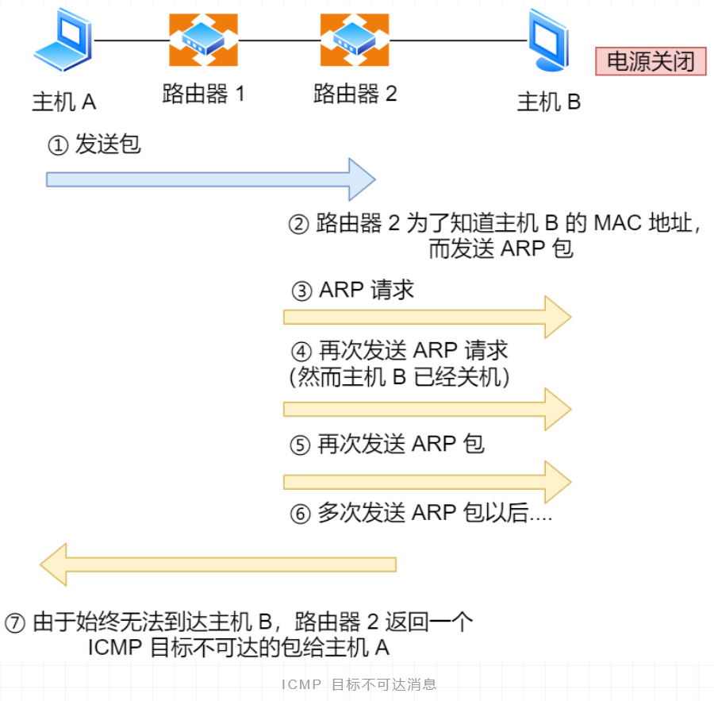 

* 主机 `A` 向主机 `B` 发送了数据包，由于某种原因。途中的路由器 `2` 未能发现主机 `B` 的存在，这时，路由器 `2` 就会向主机 `A` 发送一个 `ICMP` 目标不可达数据包，说明发往主机 `B` 的包未能成功。
* ICMP 的这种通知消息会使用 `IP` 进行发送 
* 从路由器 `2` 返回的 ICMP 包会按照往常的路由控制先经过路由器 `1` 再转发给主机 `A`
* 收到该 ICMP 包的主机 `A` 则分解 ICMP 的首部和数据域以后得知具体发生问题的原因

### 2.3. ICMP包头格式

ICMP 报文是封装在 IP 包里面，它工作在网络层，是 IP 协议的助手。

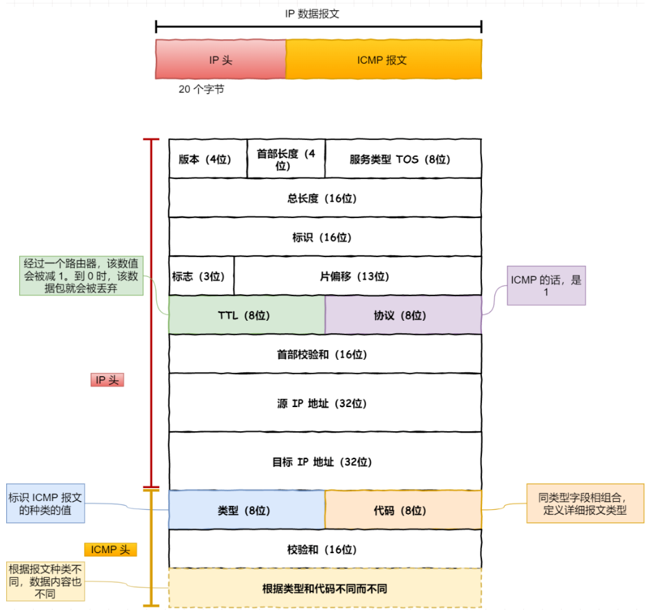 

### 2.4. ICMP类型

ICMP 包头的**类型**字段，大致可以分为两大类：

- 一类是用于诊断的查询消息，也就是「**查询报文类型**」
- 另一类是通知出错原因的错误消息，也就是「**差错报文类型**」

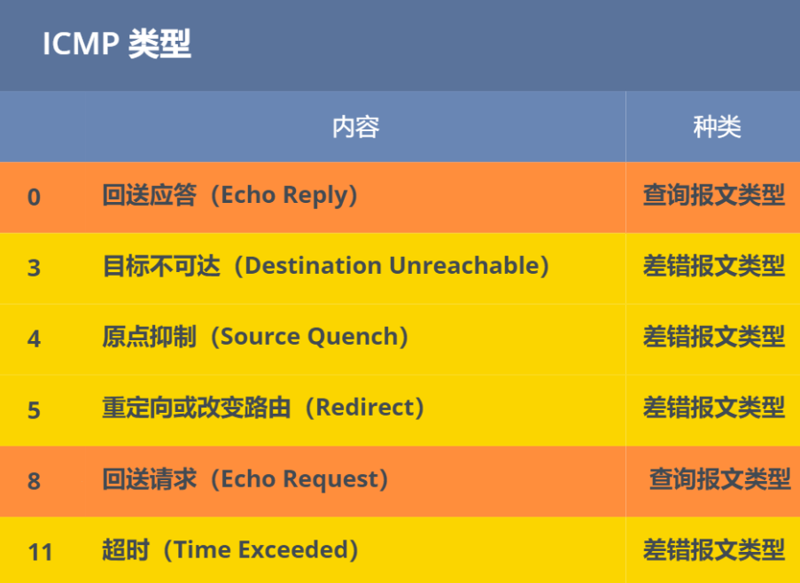 

## 3. 报文类型

### 3.1. 查询报文

**回送消息**用于进行通信的主机或路由器之间，判断所发送的数据包是否已经成功到达对端的一种消息，`ping` 命令就是利用这个消息实现的。回送消息 —— 类型 `0` 和 `8`。

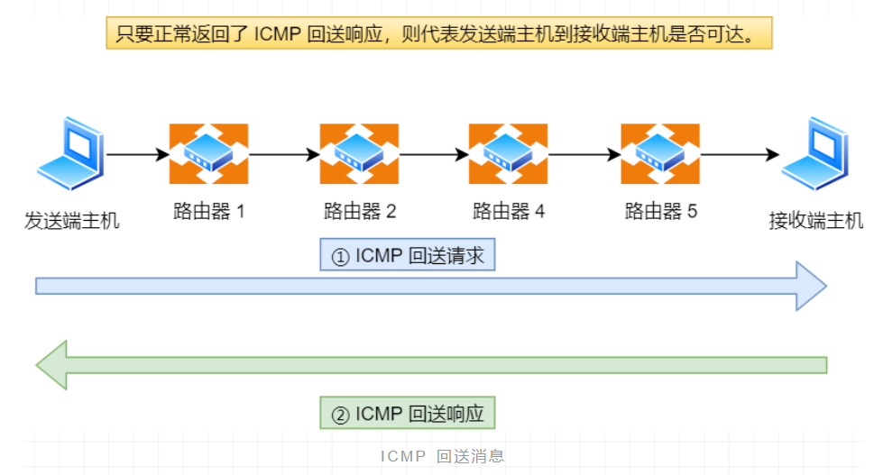 

* 可以向对端主机发送**回送请求**的消息（`ICMP Echo Request Message`，类型 `8`）
* 也可以接收对端主机发回来的**回送应答**消息（`ICMP Echo Reply Message`，类型 `0`）

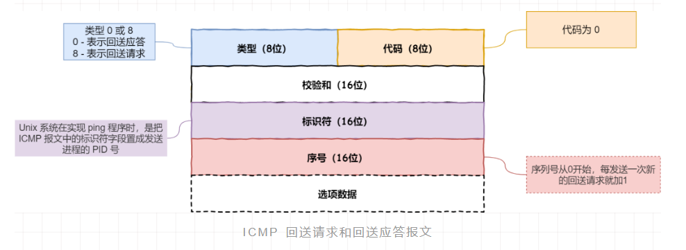 

相比原生的 ICMP，这里多了两个字段：

- **标识符**：用以区分是哪个应用程序发 ICMP 包，比如用进程 `PID` 作为标识符；
- **序号**：序列号从 `0` 开始，每发送一次新的回送请求就会加 `1`， 可以用来确认网络包是否有丢失。

在**选项数据**中，`ping` 还会存放发送请求的时间值，来计算往返时间，说明路程的长短；

### 3.2. 差错报文

常用的 ICMP 差错报文的例子：

- 目标不可达消息

   类型 为 `3`

- 原点抑制消息

  类型 `4`

- 重定向消息

  类型 `5`

- 超时消息

  类型 `11`

#### 3.2.1. 目标不可达

IP 路由器无法将 IP 数据包发送给目标地址时，会给发送端主机返回一个**目标不可达**的 ICMP 消息，并在这个消息中显示不可达的具体原因，原因记录在 ICMP 包头的**代码**字段。由此，根据 ICMP 不可达的具体消息，发送端主机也就可以了解此次发送**不可达的具体原因**。

目标不可达类型的**代码**：

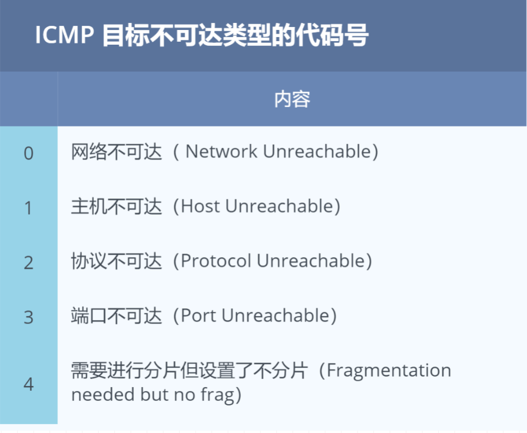 

- 网络不可达代码为 `0`

  IP 地址是分为网络号和主机号的，所以当路由器中的路由器表匹配不到接收方 IP 的网络号，就通过 ICMP 协议以**网络不可达**（`Network Unreachable`）的原因告知主机。自从不再有网络分类以后，网络不可达也渐渐不再使用了

- 主机不可达代码为 `1`

  当路由表中没有该主机的信息，或者该主机没有连接到网络，那么会通过 ICMP 协议以**主机不可达**（`Host Unreachable`）的原因告知主机

- 协议不可达代码为 `2`

  当主机使用 TCP 协议访问对端主机时，能找到对端的主机了，可是对端主机的防火墙已经禁止 TCP 协议访问，那么会通过 ICMP 协议以**协议不可达**的原因告知主机。

- 端口不可达代码为 `3`

  当主机访问对端主机 8080 端口时，这次能找到对端主机了，防火墙也没有限制，可是发现对端主机没有进程监听 8080 端口，那么会通过 ICMP 协议以**端口不可达**的原因告知主机

- 需要进行分片但设置了不分片位代码为 `4`

  发送端主机发送 IP 数据报时，将 IP 首部的**分片禁止标志位**设置为`1`。根据这个标志位，途中的路由器遇到超过 MTU 大小的数据包时，不会进行分片，而是直接抛弃。

  随后，通过一个 ICMP 的不可达消息类型，**代码为 4** 的报文，告知发送端主机。

#### 3.2.2. 原点抑制消息

原点抑制消息（ICMP Source Quench Message） —— 类型 `4`

在使用低速广域线路的情况下，连接 WAN 的路由器可能会遇到网络拥堵的问题。`ICMP` 原点抑制消息的目的就是**为了缓和这种拥堵情况**。当路由器向低速线路发送数据时，其发送队列的缓存变为零而无法发送出去时，可以向 IP 包的源地址发送一个 ICMP **原点抑制消息**。收到这个消息的主机借此了解在整个线路的某一处发生了拥堵的情况，从而增大 IP 包的传输间隔，减少网络拥堵的情况。

然而，由于这种 ICMP 可能会引起不公平的网络通信，一般不被使用

#### 3.2.3. 重定向消息

重定向消息（ICMP Redirect Message） —— 类型 `5`

如果路由器发现发送端主机使用了「不是最优」的路径发送数据，那么它会返回一个 ICMP **重定向消息**给这个主机。在这个消息中包含了**最合适的路由信息和源数据**。这主要发生在路由器持有更好的路由信息的情况下。路由器会通过这样的 ICMP 消息告知发送端，让它下次发给另外一个路由器.

#### 3.2.4. 超时消息

超时消息（ICMP Time Exceeded Message） —— 类型 `11`

IP 包中有一个字段叫做 `TTL` （`Time To Live`，生存周期），它的**值随着每经过一次路由器就会减 1，直到减到 0 时该 IP 包会被丢弃。**

此时，IP 路由器将会发送一个 ICMP **超时消息**给发送端主机，并通知该包已被丢弃。设置 IP 包生存周期的主要目的，是为了在路由控制遇到问题发生循环状况时，避免 IP 包无休止地在网络上被转发。

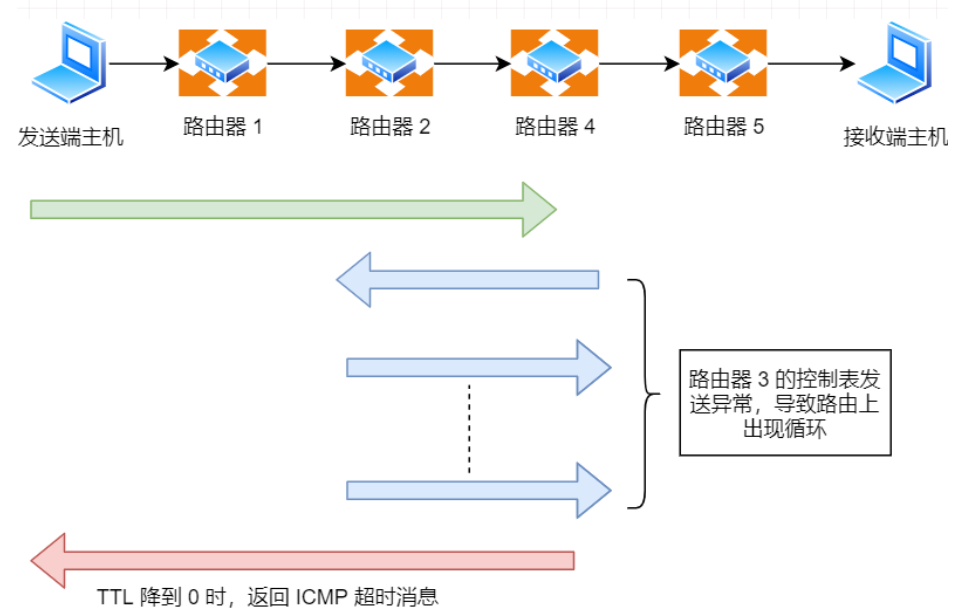 

有时可以用 TTL 控制包的到达范围，例如设置一个**较小的 TTL 值**

## 4. ping的使用

ping就是一类查询报文

我们重点来看 `ping` 的**发送和接收过程**。

* 同个子网下的主机 A 和 主机 B，主机 A 执行`ping` 主机 B 后

  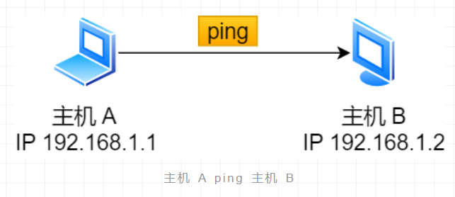 

* ping 命令执行的时候，源主机首先会构建一个 **ICMP 回送请求消息**数据包

  ICMP 数据包内包含多个字段，最重要的是两个：

  - 第一个是**类型**，对于回送请求消息而言该字段为 `8`；
  - 另外一个是**序号**，主要用于区分连续 ping 的时候发出的多个数据包

* 每发出一个请求数据包，序号会自动加 `1`。为了能够计算往返时间 `RTT`，它会在报文的数据部分插入发送时间

  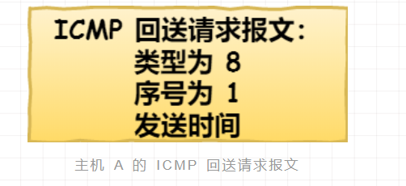 

* 由 ICMP 协议将这个数据包连同地址 192.168.1.2 一起交给 IP 层。

  IP 层将以 192.168.1.2 作为**目的地址**，本机 IP 地址作为**源地址**，**协议**字段设置为 `1` 表示是 `ICMP` 协议，在加上一些其他控制信息，构建一个 `IP` 数据包

   

* 接下来，需要加入 `MAC` 头

  * 如果在本地 ARP 映射表中查找出 IP 地址 192.168.1.2 所对应的 MAC 地址，则可以直接使用；
  * 如果没有，则需要发送 `ARP` 协议查询 MAC 地址

  获得 MAC 地址后，由数据链路层构建一个数据帧，目的地址是 IP 层传过来的 MAC 地址，源地址则是本机的 MAC 地址；还要附加上一些控制信息，依据以太网的介质访问规则，将它们传送出去

   

* 主机 `B` 收到这个数据帧后

  * 先检查它的目的 MAC 地址，并和本机的 MAC 地址对比，如符合，则接收，否则就丢弃
  * 接收后检查该数据帧，将 IP 数据包从帧中提取出来，交给本机的 IP 层。
  * 同样，IP 层检查后，将有用的信息提取后交给 ICMP 协议

* 主机 `B` 会构建一个 **ICMP 回送响应消息**数据包，回送响应数据包的**类型**字段为 `0`，**序号**为接收到的请求数据包中的序号，然后再发送出去给主机 A

   

* 在规定的时候间内，源主机会进行检查

  * 源主机如果没有接到 ICMP 的应答包，则说明目标主机不可达；
  * 如果接收到了 ICMP 回送响应消息，则说明目标主机可达

  源主机会检查，用当前时刻减去该数据包最初从源主机上发出的时刻，就是 ICMP 数据包的时间延迟

如下为整个过程的示例：

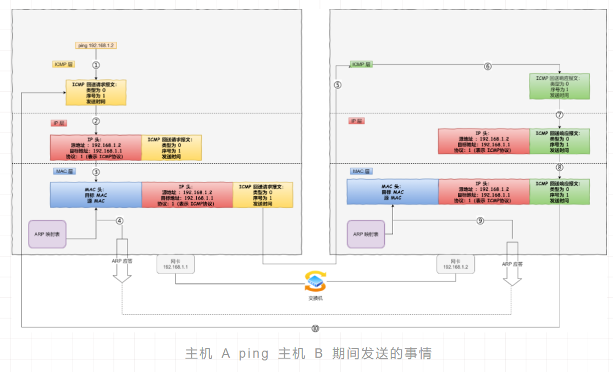 

这只是最简单的，同一个局域网里面的情况。如果跨网段的话，还会涉及网关的转发、路由器的转发等等。但是对于 ICMP 的头来讲，是没什么影响的。会影响的是根据目标 IP 地址，选择路由的下一跳，还有每经过一个路由器到达一个新的局域网，需要换 MAC 头里面的 MAC 地址。

我们可以看出 ping 这个程序是**使用了 ICMP 里面的 ECHO REQUEST（类型为 8 ） 和 ECHO REPLY （类型为 0）**

## 5. traceroute的使用

traceroute是一种差错报文类。

有一款充分利用 ICMP **差错报文类型**的应用叫做 `traceroute`（在UNIX、MacOS中是这个命令，而在Windows中对等的命令叫做 tracert 

这种报文的作用有两种：

### 5.1. 搜索路由IP

traceroute 的第一个作用就是**故意设置特殊的 TTL，来追踪去往目的地时沿途经过的路由器**。

traceroute 的参数指向某个**目的 IP 地址**：

```
traceroute 192.168.1.100
```

**工作原理：**

它的原理就是利用 IP 包的**生存期限** 从 `1` 开始按照顺序递增的同时发送 **UDP 包**，强制接收 **ICMP 超时消息**的一种方法：

* 将 TTL 设置 为 `1`，则遇到第一个路由器，就牺牲了，接着返回 ICMP 差错报文网络包，类型是**时间超时**
* 将 TTL 设置为 `2`，第一个路由器过了，遇到第二个路由器也牺牲了，也同意返回了 ICMP 差错报文数据包
* 如此往复，直到到达目的主机
* 这样的过程，traceroute 就可以拿到了所有的路由器 IP

**PS：当然有的路由器根本就不会返回这个 ICMP，所以对于有的公网地址，是看不到中间经过的路由的**

**注意：traceroute 在发送 `UDP` 包时，会填入一个不可能的端口号值作为 UDP 目标端口号（大于 `3000` ）。当目的主机，收到 UDP 包后，会返回 ICMP 差错报文消息，但这个差错报文消息的类型「端口不可达」**

**当差错报文类型是端口不可达时，说明发送方发出的 UDP 包到达了目的主机**

### 5.2. 确定路径的 MTU

traceroute 还有一个作用是**故意设置不分片，从而确定路径的 MTU**

有的时候我们并不知道路由器的 `MTU` 大小，以太网的数据链路上的 `MTU` 通常是 `1500` 字节，但是非以太网的 `MTU` 值就不一样了，所以我们要知道 `MTU` 的大小，从而控制发送的包大小

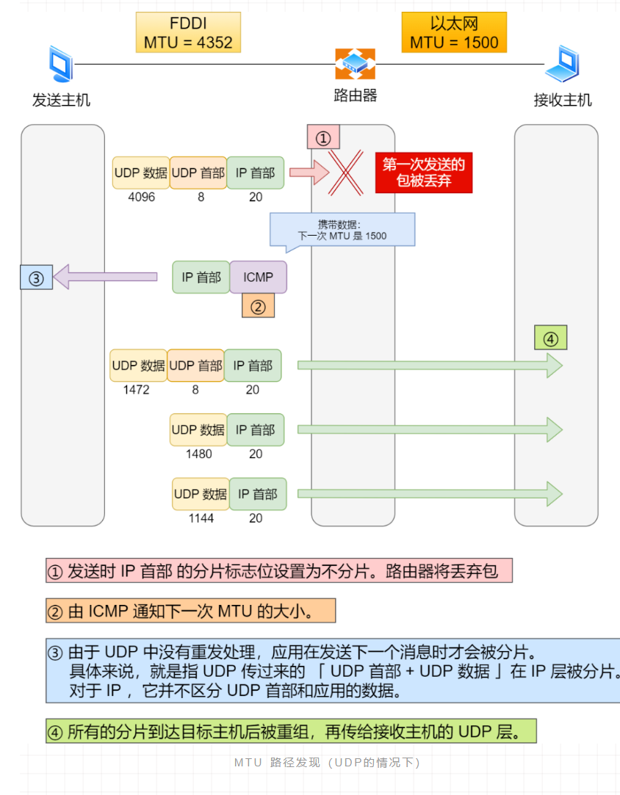 

* 首先在发送端主机发送 `IP` 数据报时，将 `IP` 包首部的**分片禁止标志位设置为 1**。

  根据这个标志位，途中的路由器不会对大数据包进行分片，而是将包丢弃。

* 随后，通过一个 ICMP 的不可达消息将**数据链路上 MTU 的值**一起给发送主机

  不可达消息的类型为「**需要进行分片但设置了不分片位**」。

* 发送主机端每次收到 ICMP 差错报文时就**减少**包的大小

  以此来定位一个合适的 `MTU` 值，以便能到达目标主机

## 6.总结