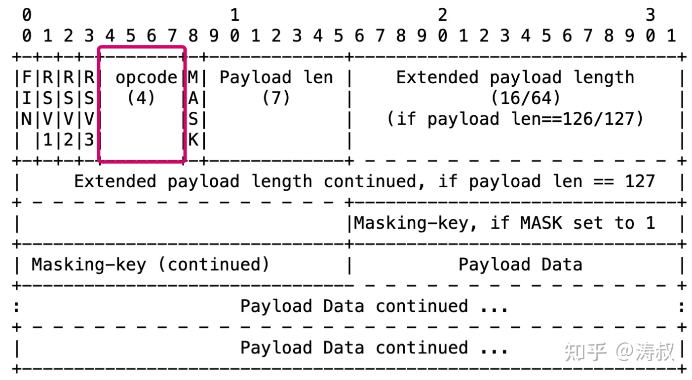
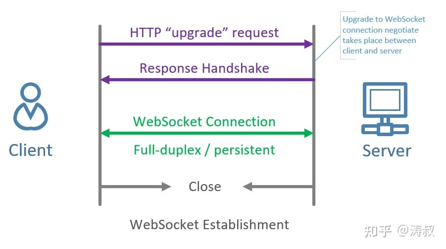
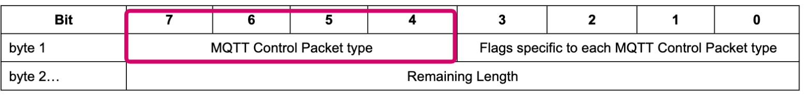
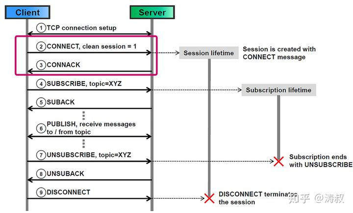
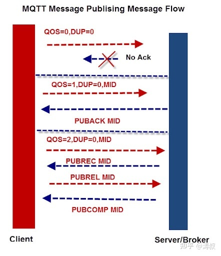
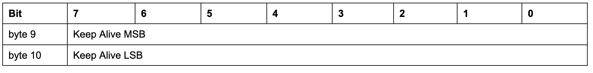

## 1. 开头   

## 2. websocket协议     

### 2.1. websocket报文结构  
    
其中操作类型的字段只有4 位，最多有 16 种组合。
* 0 表示当前消息是上一条消息一部分
* 1 表示当前消息传输的是文本内容
* 2 表示当前消息传输的是二进制内容
* 3-7 预留
* 8 表示关闭会话
* 9 ping
* 10 pong   
WebSocket 规定了 ping 和 pong 报文，却并强制要求大家实现    
* 11-15 预留  

### 2.2. websocket消息交互  
        

* 完成协商，就会获得一个双工信道，可以双向传递数据。  
* WebSocket 收发消息不需要对方确认。因为底层的 TCP 协议会完成可靠传输：
参考资料：https://dotnetplaybook.com/which-is-best-websockets-or-signalr/  

### 2.3. 保持会话  
WebSocket 只规定了 ping/pong 两种报文，但并不强制要求定时收发心跳包。  

## 3. mqtt协议   
### 3.1.mqtt协议报文结构    
     
&emsp;&emsp;高4位(bit7~bit4)表示协议类型，总共可以表示16种协议类型，其中0000和1111是保留字段
* 保留	0	禁用	保留
* CONNECT	1	Client ---> Server	客户端连接到服务器
* CONNACK	2	Server ---> Client	连接确认
* PUBLISH	3	Client <--> Server	发布消息
* PUBACK	4	Client <--> Server	发不确认
* PUBREC	5	Client <--> Server	消息已接收(QoS2第一阶段)
* PUBREL	6	Client <--> Server	消息释放(QoS2第二阶段)
* PUBCOMP	7	Client <--> Server	发布结束(QoS2第三阶段)
* SUBSCRIBE	8	Client ---> Server	客户端订阅请求
* SUBACK	9	Server ---> Client	服务端订阅确认
* UNSUBACRIBE	10	Client ---> Server	客户端取消订阅
* UNSUBACK	11	Server ---> Client	服务端取消订阅确认
* PINGREQ	12	Client ---> Server	客户端发送心跳
* PINGRESP	13	Server ---> Client	服务端回复心跳
* DISCONNECT	14	Client ---> Server	客户端断开连接请求
* 保留	15	禁用	保留

### 3.2. mqtt消息交互
  
  
* TCP连接建立之后，客户端会主动发送 CONNECT 报文。服务端准备好之后会回应 CONNACK 报文
* MQTT 收发消息需要根据投递级别进行确认
* 对于只发布一次的消息甚至需要两次确认！
   

### 3.3. mqtt保持会话
MQTT 则有明确的心跳协商机制。协商会话使用的 CONNECT 报文包含 Keep Alive 头部信息  
   

## 4. websocket和mqtt比较  
* 相同点
  * MQTT 和 WebSocket 都是应用层协议
  * 目前底层都是使用 TCP 协议确保可靠传输数据
  * 都规定了自己的报文（消息）结构
  * 都支持双向通信
  * 都使用二进制编码（有别于 HTTP 这一类基于文本编码的协议）
  * 都是公开标准 mqttrfc6455
  * MQTT和WebSocket都是面向报文的二进制传输协议。
* 不同点
  * WebSocket更简单，更灵活，WebSocket则只是在TCP协议之上实现了简单的报文通信  
    &emsp;&emsp;着重解决浏览器和服务端不能进行双向通信的问题。本质上有点像是 TCP 协议之上的 UDP 协议。WebSocket 仅仅定义了会话的发起方式和报文格式及类型。
  * MQTT相对复杂，但功能强大，MQTT 是一套比较复杂的消息投递协议。   
    &emsp;&emsp;MQTT 则是一种比较复杂的消息协议。MQTT 不仅规定了具体的协议编码，还规定了客户端和服务器的通信模型。具体来说就是MQTT是一种面向主题（topic）的消息广播协议。客户端可以创建、加入和订阅任意主题，并向主题发布消息或者接收广播消息。除此之外，MQTT 还规定了消息的投放级别（QoS），支持至少一次、至多一次和精确投递三种级别，在协议层规定了是否会产生重复投递

参考资料：  
https://www.jianshu.com/p/31a7a69f9438  
https://bbs.huaweicloud.com/blogs/detail/233932