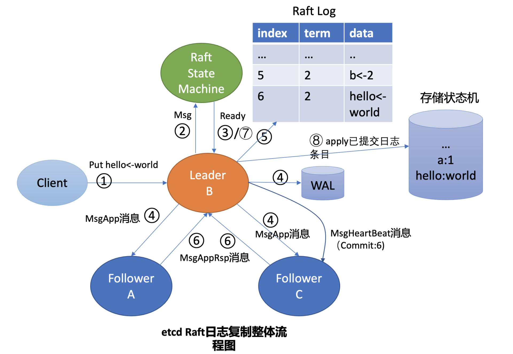
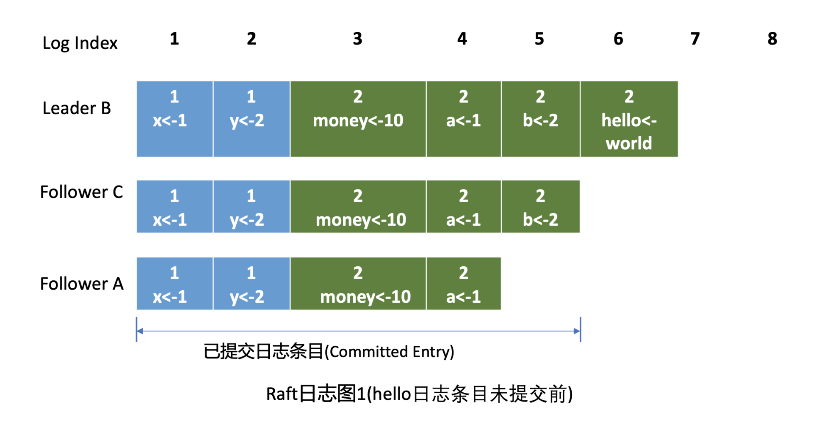
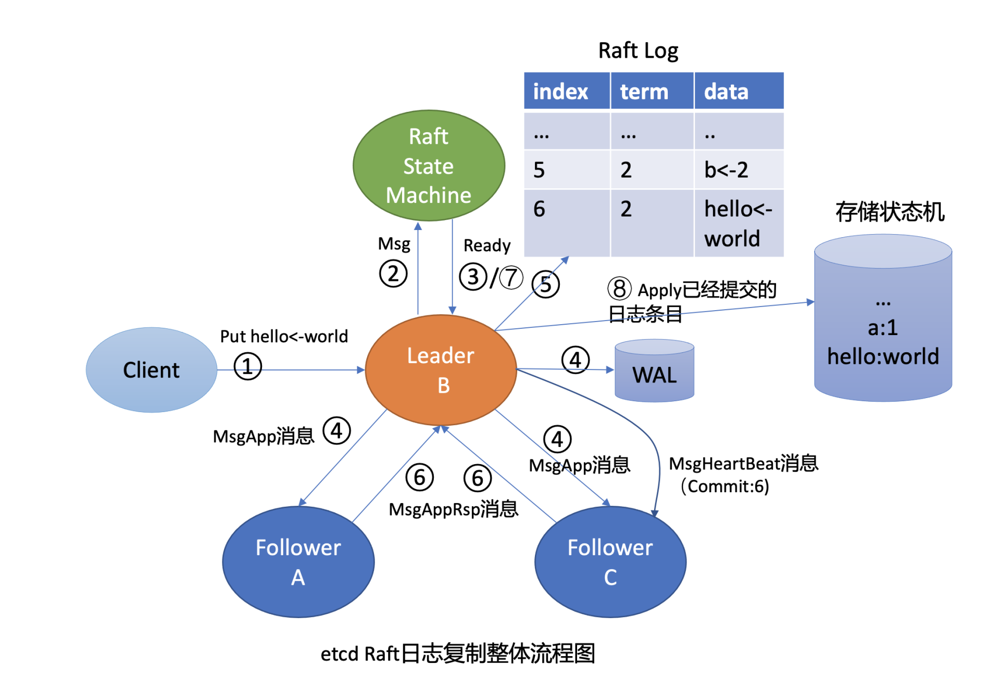
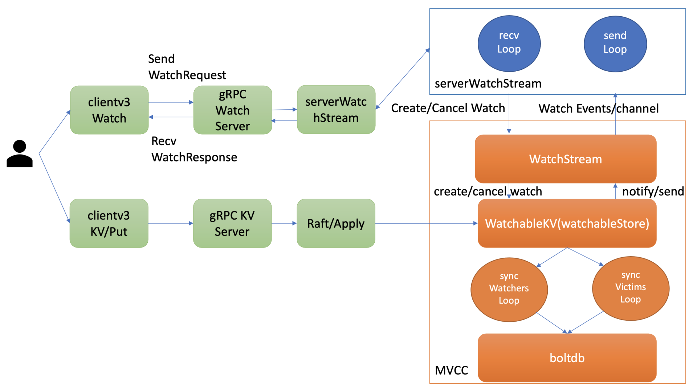

## 概述

### 核心模块


### etcd的发展史

#### etcd设计目标

大概需要满足以下五个目标：

1. **可用性角度：高可用**。协调服务作为集群的控制面存储，它保存了各个服务的部署、运行信息。若它故障，可能会导致集群无法变更、服务副本数无法协调。业务服务若此时出现故障，无法创建新的副本，可能会影响用户数据面。
2. **数据一致性角度：提供读取“最新”数据的机制**。既然协调服务必须具备高可用的目标，就必然不能存在单点故障（single point of failure），而多节点又引入了新的问题，即多个节点之间的数据一致性如何保障？比如一个集群3个节点A、B、C，从节点A、B获取服务镜像版本是新的，但节点C因为磁盘 I/O异常导致数据更新缓慢，若控制端通过C节点获取数据，那么可能会导致读取到过期数据，服务镜像无法及时更新。
3. **容量角度：低容量、仅存储关键元数据配置。**协调服务保存的仅仅是服务、节点的配置信息（属于控制面配置），而不是与用户相关的数据。所以存储上不需要考虑数据分片，无需过度设计。
4. **功能：增删改查，监听数据变化的机制**。协调服务保存了服务的状态信息，若服务有变更或异常，相比控制端定时去轮询检查一个个服务状态，若能快速推送变更事件给控制端，则可提升服务可用性、减少协调服务不必要的性能开销。
5. **运维复杂度：可维护性。**在分布式系统中往往会遇到硬件Bug、软件Bug、人为操作错误导致节点宕机，以及新增、替换节点等运维场景，都需要对协调服务成员进行变更。若能提供API实现平滑地变更成员节点信息，就可以大大降低运维复杂度，减少运维成本，同时可避免因人工变更不规范可能导致的服务异常。

了解完理想中的解决方案目标，我们再来看CoreOS团队当时为什么选择了从0到1开发一个新的协调服务呢？

如果使用开源软件，当时其实是有ZooKeeper的，但是他们为什么不用ZooKeeper呢？我们来分析一下。

从高可用性、数据一致性、功能这三个角度来说，ZooKeeper是满足CoreOS诉求的。然而当时的ZooKeeper不支持通过API安全地变更成员，需要人工修改一个个节点的配置，并重启进程。

若变更姿势不正确，则有可能出现脑裂等严重故障。适配云环境、可平滑调整集群规模、在线变更运行时配置是CoreOS的期望目标，而ZooKeeper在这块的可维护成本相对较高。

其次ZooKeeper是用 Java 编写的，部署较繁琐，占用较多的内存资源，同时ZooKeeper RPC的序列化机制用的是Jute，自己实现的RPC API。无法使用curl之类的常用工具与之互动，CoreOS期望使用比较简单的HTTP + JSON。

因此，CoreOS决定自己造轮子，那CoreOS团队是如何根据系统目标进行技术方案选型的呢？

#### etcd v1和v2诞生

首先我们来看服务高可用及数据一致性。前面我们提到单副本存在单点故障，而多副本又引入数据一致性问题。

因此为了解决数据一致性问题，需要引入一个共识算法，确保各节点数据一致性，并可容忍一定节点故障。常见的共识算法有Paxos、ZAB、Raft等。CoreOS团队选择了易理解实现的Raft算法，它将复杂的一致性问题分解成Leader选举、日志同步、安全性三个相对独立的子问题，只要集群一半以上节点存活就可提供服务，具备良好的可用性。

其次我们再来看数据模型（Data Model）和API。数据模型参考了ZooKeeper，使用的是基于目录的层次模式。API相比ZooKeeper来说，使用了简单、易用的REST API，提供了常用的Get/Set/Delete/Watch等API，实现对key-value数据的查询、更新、删除、监听等操作。

key-value存储引擎上，ZooKeeper使用的是Concurrent HashMap，而etcd使用的是则是简单内存树，它的节点数据结构精简后如下，含节点路径、值、孩子节点信息。这是一个典型的低容量设计，数据全放在内存，无需考虑数据分片，只能保存key的最新版本，简单易实现。


```go
type node struct {
   Path string  //节点路径
   Parent *node //关联父亲节点
   Value      string     //key的value值
   ExpireTime time.Time //过期时间
   Children   map[string]*node //此节点的孩子节点
}
```

最后我们再来看可维护性。Raft算法提供了成员变更算法，可基于此实现成员在线、安全变更，同时此协调服务使用Go语言编写，无依赖，部署简单。


基于以上技术方案和架构图，CoreOS团队在2013年8月对外发布了第一个测试版本v0.1，API v1版本，命名为etcd。

那么etcd这个名字是怎么来的呢？其实它源于两个方面，unix的“/etc”文件夹和分布式系统(“D”istribute system)的D，组合在一起表示etcd是用于存储分布式配置的信息存储服务。

v0.1版本实现了简单的HTTP Get/Set/Delete/Watch API，但读数据一致性无法保证。v0.2版本，支持通过指定consistent模式，从Leader读取数据，并将Test And Set机制修正为CAS(Compare And Swap)，解决原子更新的问题，同时发布了新的API版本v2，这就是大家熟悉的etcd v2版本，第一个非stable版本。

下面，我用一幅时间轴图，给你总结一下etcd v1/v2关键特性。


#### 为什么Kubernetes使用etcd?

这张图里，我特别标注出了Kubernetes的发布时间点，这个非常关键。我们必须先来说说这个事儿，也就是Kubernetes和etcd的故事。

2014年6月，Google的Kubernetes项目诞生了，我们前面所讨论到Go语言编写、etcd高可用、Watch机制、CAS、TTL等特性正是Kubernetes所需要的，它早期的0.4版本，使用的正是etcd v0.2版本。

Kubernetes是如何使用etcd v2这些特性的呢？举几个简单小例子。

当你使用Kubernetes声明式API部署服务的时候，Kubernetes的控制器通过etcd Watch机制，会实时监听资源变化事件，对比实际状态与期望状态是否一致，并采取协调动作使其一致。Kubernetes更新数据的时候，通过CAS机制保证并发场景下的原子更新，并通过对key设置TTL来存储Event事件，提升Kubernetes集群的可观测性，基于TTL特性，Event事件key到期后可自动删除。

Kubernetes项目使用etcd，除了技术因素也与当时的商业竞争有关。CoreOS是Kubernetes容器生态圈的核心成员之一。

当时Docker容器浪潮正席卷整个开源技术社区，CoreOS也将容器集成到自家产品中。一开始与Docker公司还是合作伙伴，然而Docker公司不断强化Docker的PaaS平台能力，强势控制Docker社区，这与CoreOS核心商业战略出现了冲突，也损害了Google、RedHat等厂商的利益。

最终CoreOS与Docker分道扬镳，并推出了rkt项目来对抗Docker，然而此时Docker已深入人心，CoreOS被Docker全面压制。

以Google、RedHat为首的阵营，基于Google多年的大规模容器管理系统Borg经验，结合社区的建议和实践，构建以Kubernetes为核心的容器生态圈。相比Docker的垄断、独裁，Kubernetes社区推行的是民主、开放原则，Kubernetes每一层都可以通过插件化扩展，在Google、RedHat的带领下不断发展壮大，etcd也进入了快速发展期。

在2015年1月，CoreOS发布了etcd第一个稳定版本2.0，支持了quorum read，提供了严格的线性一致性读能力。7月，基于etcd 2.0的Kubernetes第一个生产环境可用版本v1.0.1发布了，Kubernetes开始了新的里程碑的发展。

etcd v2在社区获得了广泛关注，GitHub star数在2015年6月就高达6000+，超过500个项目使用，被广泛应用于配置存储、服务发现、主备选举等场景。

下图我从构建分布式系统的核心要素角度，给你总结了etcd v2核心技术点。无论是NoSQL存储还是SQL存储、文档存储，其实大家要解决的问题都是类似的，基本就是图中总结的数据模型、复制、共识算法、API、事务、一致性、成员故障检测等方面。

希望通过此图帮助你了解从0到1如何构建、学习一个分布式系统，要解决哪些技术点，在心中有个初步认识，后面的课程中我会再深入介绍。


#### etcd v3诞生

然而随着Kubernetes项目不断发展，v2版本的瓶颈和缺陷逐渐暴露，遇到了若干性能和稳定性问题，Kubernetes社区呼吁支持新的存储、批评etcd不可靠的声音开始不断出现。

具体有哪些问题呢？我给你总结了如下图：


下面我分别从功能局限性、Watch事件的可靠性、性能、内存开销来分别给你剖析etcd v2的问题。

首先是**功能局限性问题。**它主要是指etcd v2不支持范围和分页查询、不支持多key事务。

第一，etcd v2不支持范围查询和分页。分页对于数据较多的场景是必不可少的。在Kubernetes中，在集群规模增大后，Pod、Event等资源可能会出现数千个以上，但是etcd v2不支持分页，不支持范围查询，大包等expensive request会导致严重的性能乃至雪崩问题。

第二，etcd v2不支持多key事务。在实际转账等业务场景中，往往我们需要在一个事务中同时更新多个key。

然后是**Watch机制可靠性问题**。Kubernetes项目严重依赖etcd Watch机制，然而etcd v2是内存型、不支持保存key历史版本的数据库，只在内存中使用滑动窗口保存了最近的1000条变更事件，当etcd server写请求较多、网络波动时等场景，很容易出现事件丢失问题，进而又触发client数据全量拉取，产生大量expensive request，甚至导致etcd雪崩。

其次是**性能瓶颈问题**。etcd v2早期使用了简单、易调试的HTTP/1.x API，但是随着Kubernetes支撑的集群规模越来越大，HTTP/1.x协议的瓶颈逐渐暴露出来。比如集群规模大时，由于HTTP/1.x协议没有压缩机制，批量拉取较多Pod时容易导致APIServer和etcd出现CPU高负载、OOM、丢包等问题。

另一方面，etcd v2 client会通过HTTP长连接轮询Watch事件，当watcher较多的时候，因HTTP/1.x不支持多路复用，会创建大量的连接，消耗server端过多的socket和内存资源。

同时etcd v2支持为每个key设置TTL过期时间，client为了防止key的TTL过期后被删除，需要周期性刷新key的TTL。

实际业务中很有可能若干key拥有相同的TTL，可是在etcd v2中，即使大量key TTL一样，你也需要分别为每个key发起续期操作，当key较多的时候，这会显著增加集群负载、导致集群性能显著下降。

最后是**内存开销问题。**etcd v2在内存维护了一颗树来保存所有节点key及value。在数据量场景略大的场景，如配置项较多、存储了大量Kubernetes Events， 它会导致较大的内存开销，同时etcd需要定时把全量内存树持久化到磁盘。这会消耗大量的CPU和磁盘 I/O资源，对系统的稳定性造成一定影响。

为什么etcd v2有以上若干问题，Consul等其他竞品依然没有被Kubernetes支持呢？

一方面当时包括Consul在内，没有一个开源项目是十全十美完全满足Kubernetes需求。而CoreOS团队一直在聆听社区的声音并积极改进，解决社区的痛点。用户吐槽etcd不稳定，他们就设计实现自动化的测试方案，模拟、注入各类故障场景，及时发现修复Bug，以提升etcd稳定性。

另一方面，用户吐槽性能问题，针对etcd v2各种先天性缺陷问题，他们从2015年就开始设计、实现新一代etcd v3方案去解决以上痛点，并积极参与Kubernetes项目，负责etcd v2到v3的存储引擎切换，推动Kubernetes项目的前进。同时，设计开发通用压测工具、输出Consul、ZooKeeper、etcd性能测试报告，证明etcd的优越性。

etcd v3就是为了解决以上稳定性、扩展性、性能问题而诞生的。

在内存开销、Watch事件可靠性、功能局限上，它通过引入B-tree、boltdb实现一个MVCC数据库，数据模型从层次型目录结构改成扁平的key-value，提供稳定可靠的事件通知，实现了事务，支持多key原子更新，同时基于boltdb的持久化存储，显著降低了etcd的内存占用、避免了etcd v2定期生成快照时的昂贵的资源开销。

性能上，首先etcd v3使用了gRPC API，使用protobuf定义消息，消息编解码性能相比JSON超过2倍以上，并通过HTTP/2.0多路复用机制，减少了大量watcher等场景下的连接数。

其次使用Lease优化TTL机制，每个Lease具有一个TTL，相同的TTL的key关联一个Lease，Lease过期的时候自动删除相关联的所有key，不再需要为每个key单独续期。

最后是etcd v3支持范围、分页查询，可避免大包等expensive request。

2016年6月，etcd 3.0诞生，随后Kubernetes 1.6发布，默认启用etcd v3，助力Kubernetes支撑5000节点集群规模。

下面的时间轴图，我给你总结了etcd3重要特性及版本发布时间。从图中你可以看出，从3.0到未来的3.5，更稳、更快是etcd的追求目标。


从2013年发布第一个版本v0.1到今天的3.5.0-pre，从v2到v3，etcd走过了7年的历程，etcd的稳定性、扩展性、性能不断提升。

发展到今天，在GitHub上star数超过34K。在Kubernetes的业务场景磨炼下它不断成长，走向稳定和成熟，成为技术圈众所周知的开源产品，而**v3方案的发布，也标志着etcd进入了技术成熟期，成为云原生时代的首选元数据存储产品。**

#### 小结

最后我们来小结下今天的内容，我们从如下几个方面介绍了etcd的前世今生，并在过程中详细解读了为什么Kubernetes使用etcd：

- etcd诞生背景， etcd v2源自CoreOS团队遇到的服务协调问题。
- etcd目标，我们通过实际业务场景分析，得到理想中的协调服务核心目标：高可用、数据一致性、Watch、良好的可维护性等。而在CoreOS团队看来，高可用、可维护性、适配云、简单的API、良好的性能对他们而言是非常重要的，ZooKeeper无法满足所有诉求，因此决定自己构建一个分布式存储服务。
- 介绍了v2基于目录的层级数据模型和API，并从分布式系统的角度给你详细总结了etcd v2技术点。etcd的高可用、Watch机制与Kubernetes期望中的元数据存储是匹配的。etcd v2在Kubernetes的带动下，获得了广泛的应用，但也出现若干性能和稳定性、功能不足问题，无法满足Kubernetes项目发展的需求。
- CoreOS团队未雨绸缪，从问题萌芽时期就开始构建下一代etcd v3存储模型，分别从性能、稳定性、功能上等成功解决了Kubernetes发展过程中遇到的瓶颈，也捍卫住了作为Kubernetes存储组件的地位。

希望通过今天的介绍， 让你对etcd为什么有v2和v3两个大版本，etcd如何从HTTP/1.x API到gRPC API、单版本数据库到多版本数据库、内存树到boltdb、TTL到Lease、单key原子更新到支持多key事务的演进过程有个清晰了解。希望你能有所收获，在后续的课程中我会和你深入讨论各个模块的细节。

### ETCD基础架构

下面是一张etcd的简要基础架构图，我们先从宏观上了解一下etcd都有哪些功能模块。


你可以看到，按照分层模型，etcd可分为Client层、API网络层、Raft算法层、逻辑层和存储层。这些层的功能如下：

- **Client层**：Client层包括client v2和v3两个大版本API客户端库，提供了简洁易用的API，同时支持负载均衡、节点间故障自动转移，可极大降低业务使用etcd复杂度，提升开发效率、服务可用性。
- **API网络层**：API网络层主要包括client访问server和server节点之间的通信协议。一方面，client访问etcd server的API分为v2和v3两个大版本。v2 API使用HTTP/1.x协议，v3 API使用gRPC协议。同时v3通过etcd grpc-gateway组件也支持HTTP/1.x协议，便于各种语言的服务调用。另一方面，server之间通信协议，是指节点间通过Raft算法实现数据复制和Leader选举等功能时使用的HTTP协议。
- **Raft算法层**：Raft算法层实现了Leader选举、日志复制、ReadIndex等核心算法特性，用于保障etcd多个节点间的数据一致性、提升服务可用性等，是etcd的基石和亮点。
- **功能逻辑层**：etcd核心特性实现层，如典型的KVServer模块、MVCC模块、Auth鉴权模块、Lease租约模块、Compactor压缩模块等，其中MVCC模块主要由treeIndex模块和boltdb模块组成。
- **存储层**：存储层包含预写日志(WAL)模块、快照(Snapshot)模块、boltdb模块。其中WAL可保障etcd crash后数据不丢失，boltdb则保存了集群元数据和用户写入的数据。

etcd是典型的读多写少存储，在我们实际业务场景中，读一般占据2/3以上的请求。为了让你对etcd有一个深入的理解，接下来我会分析一个读请求是如何执行的，带你了解etcd的核心模块，进而由点及线、由线到面地帮助你构建etcd的全景知识脉络。

## 读流程

在下面这张架构图中，我用序号标识了etcd默认读模式（线性读）的执行流程，接下来，我们就按照这个执行流程从头开始说。


### client

启动完etcd集群后，当你用etcd的客户端工具etcdctl执行一个get hello命令（如下）时，对应到图中流程一，etcdctl是如何工作的呢？

```csharp
etcdctl get hello --endpoints http://127.0.0.1:2379  
hello  
world  
```

首先，etcdctl会对命令中的参数进行解析。我们来看下这些参数的含义，其中，参数“get”是请求的方法，它是KVServer模块的API；“hello”是我们查询的key名；“endpoints”是我们后端的etcd地址，通常，生产环境下中需要配置多个endpoints，这样在etcd节点出现故障后，client就可以自动重连到其它正常的节点，从而保证请求的正常执行。

在etcd v3.4.9版本中，etcdctl是通过clientv3库来访问etcd server的，clientv3库基于gRPC client API封装了操作etcd KVServer、Cluster、Auth、Lease、Watch等模块的API，同时还包含了负载均衡、健康探测和故障切换等特性。

在解析完请求中的参数后，etcdctl会创建一个clientv3库对象，使用KVServer模块的API来访问etcd server。

接下来，就需要为这个get hello请求选择一个合适的etcd server节点了，这里得用到负载均衡算法。在etcd 3.4中，clientv3库采用的负载均衡算法为Round-robin。针对每一个请求，Round-robin算法通过轮询的方式依次从endpoint列表中选择一个endpoint访问(长连接)，使etcd server负载尽量均衡。

关于负载均衡算法，你需要特别注意以下两点。

1. 如果你的client 版本<= 3.3，那么当你配置多个endpoint时，负载均衡算法仅会从中选择一个IP并创建一个连接（Pinned endpoint），这样可以节省服务器总连接数。但在这我要给你一个小提醒，在heavy usage场景，这可能会造成server负载不均衡。
2. 在client 3.4之前的版本中，负载均衡算法有一个严重的Bug：如果第一个节点异常了，可能会导致你的client访问etcd server异常，特别是在Kubernetes场景中会导致APIServer不可用。不过，该Bug已在 Kubernetes 1.16版本后被修复。

为请求选择好etcd server节点，client就可调用etcd server的KVServer模块的Range RPC方法，把请求发送给etcd server。

这里我说明一点，client和server之间的通信，使用的是基于HTTP/2的gRPC协议。相比etcd v2的HTTP/1.x，HTTP/2是基于二进制而不是文本、支持多路复用而不再有序且阻塞、支持数据压缩以减少包大小、支持server push等特性。因此，基于HTTP/2的gRPC协议具有低延迟、高性能的特点，有效解决了我们在上一讲中提到的etcd v2中HTTP/1.x 性能问题

### KVServer

client发送Range RPC请求到了server后，就开始进入我们架构图中的流程二，也就是KVServer模块了。

etcd提供了丰富的metrics、日志、请求行为检查等机制，可记录所有请求的执行耗时及错误码、来源IP等，也可控制请求是否允许通过，比如etcd Learner节点只允许指定接口和参数的访问，帮助大家定位问题、提高服务可观测性等，而这些特性是怎么非侵入式的实现呢？

答案就是拦截器

### 拦截器

etcd server定义了如下的Service KV和Range方法，启动的时候它会将实现KV各方法的对象注册到gRPC Server，并在其上注册对应的拦截器。下面的代码中的Range接口就是负责读取etcd key-value的的RPC接口。

```cpp
service KV {  
  // Range gets the keys in the range from the key-value store.  
  rpc Range(RangeRequest) returns (RangeResponse) {  
      option (google.api.http) = {  
        post: "/v3/kv/range"  
        body: "*"  
      };  
  }  
  ....
}  
```

拦截器提供了在执行一个请求前后的hook能力，除了我们上面提到的debug日志、metrics统计、对etcd Learner节点请求接口和参数限制等能力，etcd还基于它实现了以下特性:

- 要求执行一个操作前集群必须有Leader；
- 请求延时超过指定阈值的，打印包含来源IP的慢查询日志(3.5版本)。

server收到client的Range RPC请求后，根据ServiceName和RPC Method将请求转发到对应的handler实现，handler首先会将上面描述的一系列拦截器串联成一个执行，在拦截器逻辑中，通过调用KVServer模块的Range接口获取数据。

### 一致性读

#### 不一致读

进入KVServer模块后，我们就进入核心的读流程了，对应架构图中的流程三和四。我们知道etcd为了保证服务高可用，生产环境一般部署多个节点，那各个节点数据在任意时间点读出来都是一致的吗？什么情况下会读到旧数据呢？

这里为了帮助你更好的理解读流程，我先简单提下写流程。如下图所示，当client发起一个更新hello为world请求后，若Leader收到写请求，它会将此请求持久化到WAL日志，并广播给各个节点，若一半以上节点持久化成功，则该请求对应的日志条目被标识为已提交，etcdserver模块异步从Raft模块获取已提交的日志条目，应用到状态机(boltdb等)。


此时若client发起一个读取hello的请求，假设此请求直接从状态机中读取， 如果连接到的是C节点，若C节点磁盘I/O出现波动，可能导致它应用已提交的日志条目很慢，则会出现更新hello为world的写命令，在client读hello的时候还未被提交到状态机，因此就可能读取到旧数据，如上图查询hello流程所示。

从以上介绍我们可以看出，在多节点etcd集群中，各个节点的状态机数据一致性存在差异。而我们不同业务场景的读请求对数据是否最新的容忍度是不一样的，有的场景它可以容忍数据落后几秒甚至几分钟，有的场景要求必须读到反映集群共识的最新数据。

我们首先来看一个**对数据敏感度较低的场景**。

假如老板让你做一个旁路数据统计服务，希望你每分钟统计下etcd里的服务、配置信息等，这种场景其实对数据时效性要求并不高，读请求可直接从节点的状态机获取数据。即便数据落后一点，也不影响业务，毕竟这是一个定时统计的旁路服务而已。

这种直接读状态机数据返回、无需通过Raft协议与集群进行交互的模式，在etcd里叫做**串行(****Serializable****)读**，它具有低延时、高吞吐量的特点，适合对数据一致性要求不高的场景。

我们再看一个**对数据敏感性高的场景**。

当你发布服务，更新服务的镜像的时候，提交的时候显示更新成功，结果你一刷新页面，发现显示的镜像的还是旧的，再刷新又是新的，这就会导致混乱。再比如说一个转账场景，Alice给Bob转账成功，钱被正常扣出，一刷新页面发现钱又回来了，这也是令人不可接受的。

以上的业务场景就对数据准确性要求极高了，在etcd里面，提供了一种线性读模式来解决对数据一致性要求高的场景。

#### 线性读

**什么是线性读呢?**

你可以理解一旦一个值更新成功，随后任何通过线性读的client都能及时访问到。虽然集群中有多个节点，但client通过线性读就如访问一个节点一样。etcd默认读模式是线性读，因为它需要经过Raft协议模块，反应的是集群共识，因此在延时和吞吐量上相比串行读略差一点，适用于对数据一致性要求高的场景。

如果你的etcd读请求显示指定了是串行读，就不会经过架构图流程中的流程三、四。默认是线性读，因此接下来我们看看读请求进入线性读模块，它是如何工作的。

前面我们聊到串行读时提到，它之所以能读到旧数据，主要原因是Follower节点收到Leader节点同步的写请求后，应用日志条目到状态机是个异步过程，那么我们能否有一种机制在读取的时候，确保最新的数据已经应用到状态机中？


其实这个机制就是叫ReadIndex，它是在etcd 3.1中引入的，我把简化后的原理图放在了上面。当收到一个线性读请求时，它首先会从Leader获取集群最新的已提交的日志索引(committed index)，如上图中的流程二所示。

Leader收到ReadIndex请求时，为防止脑裂等异常场景，会向Follower节点发送心跳确认，一半以上节点确认Leader身份后才能将已提交的索引(committed index)返回给节点C(上图中的流程三)。

C节点则会等待，直到状态机已应用索引(applied index)大于等于Leader的已提交索引时(committed Index)(上图中的流程四)，然后去通知读请求，数据已赶上Leader，你可以去状态机中访问数据了(上图中的流程五)。

以上就是线性读通过ReadIndex机制保证数据一致性原理， 当然还有其它机制也能实现线性读，如在早期etcd 3.0中读请求通过走一遍Raft协议保证一致性， 这种Raft log read机制依赖磁盘IO， 性能相比ReadIndex较差。

总体而言，KVServer模块收到线性读请求后，通过架构图中流程三向Raft模块发起ReadIndex请求，Raft模块将Leader最新的已提交日志索引封装在流程四的ReadState结构体，通过channel层层返回给线性读模块，线性读模块等待本节点状态机追赶上Leader进度，追赶完成后，就通知KVServer模块，进行架构图中流程五，与状态机中的MVCC模块进行进行交互了。

### MVCC

流程五中的多版本并发控制(Multiversion concurrency control)模块是为了解决上一讲我们提到etcd v2不支持保存key的历史版本、不支持多key事务等问题而产生的。

它核心由内存树形索引模块(treeIndex)和嵌入式的KV持久化存储库boltdb组成。

首先我们需要简单了解下boltdb，它是个基于B+ tree实现的key-value键值库，支持事务，提供Get/Put等简易API给etcd操作。

那么etcd如何基于boltdb保存一个key的多个历史版本呢?

比如我们现在有以下方案：方案1是一个key保存多个历史版本的值；方案2每次修改操作，生成一个新的版本号(revision)，以版本号为key， value为用户key-value等信息组成的结构体。

很显然方案1会导致value较大，存在明显读写放大、并发冲突等问题，而方案2正是etcd所采用的。boltdb的key是全局递增的版本号(revision)，value是用户key、value等字段组合成的结构体，然后通过treeIndex模块来保存用户key和版本号的映射关系。

treeIndex与boltdb关系如下面的读事务流程图所示，从treeIndex中获取key hello的版本号，再以版本号作为boltdb的key，从boltdb中获取其value信息。


#### treeIndex

treeIndex模块是基于Google开源的内存版btree库实现的，为什么etcd选择上图中的B-tree数据结构保存用户key与版本号之间的映射关系，而不是哈希表、二叉树呢？在后面的课程中我会再和你介绍。

treeIndex模块只会保存用户的key和相关版本号信息，用户key的value数据存储在boltdb里面，相比ZooKeeper和etcd v2全内存存储，etcd v3对内存要求更低。

简单介绍了etcd如何保存key的历史版本后，架构图中流程六也就非常容易理解了， 它需要从treeIndex模块中获取hello这个key对应的版本号信息。treeIndex模块基于B-tree快速查找此key，返回此key对应的索引项keyIndex即可。索引项中包含版本号等信息。

#### buffer

在获取到版本号信息后，就可从boltdb模块中获取用户的key-value数据了。不过有一点你要注意，并不是所有请求都一定要从boltdb获取数据。

etcd出于数据一致性、性能等考虑，在访问boltdb前，首先会从一个内存读事务buffer中，二分查找你要访问key是否在buffer里面，若命中则直接返回。

#### boltdb

若buffer未命中，此时就真正需要向boltdb模块查询数据了，进入了流程七。

我们知道MySQL通过table实现不同数据逻辑隔离，那么在boltdb是如何隔离集群元数据与用户数据的呢？答案是bucket。boltdb里每个bucket类似对应MySQL一个表，用户的key数据存放的bucket名字的是key，etcd MVCC元数据存放的bucket是meta。

因boltdb使用B+ tree来组织用户的key-value数据，获取bucket key对象后，通过boltdb的游标Cursor可快速在B+ tree找到key hello对应的value数据，返回给client。

到这里，一个读请求之路执行完成。

### 小结

最后我们来小结一下，一个读请求从client通过Round-robin负载均衡算法，选择一个etcd server节点，发出gRPC请求，经过etcd server的KVServer模块、线性读模块、MVCC的treeIndex和boltdb模块紧密协作，完成了一个读请求。

通过一个读请求，我带你初步了解了etcd的基础架构以及各个模块之间是如何协作的。

在这过程中，我想和你特别总结下client的节点故障自动转移和线性读。

一方面， client的通过负载均衡、错误处理等机制实现了etcd节点之间的故障的自动转移，它可助你的业务实现服务高可用，建议使用etcd 3.4分支的client版本。

另一方面，我详细解释了etcd提供的两种读机制(串行读和线性读)原理和应用场景。通过线性读，对业务而言，访问多个节点的etcd集群就如访问一个节点一样简单，能简洁、快速的获取到集群最新共识数据。

早期etcd线性读使用的Raft log read，也就是说把读请求像写请求一样走一遍Raft的协议，基于Raft的日志的有序性，实现线性读。但此方案读涉及磁盘IO开销，性能较差，后来实现了ReadIndex读机制来提升读性能，满足了Kubernetes等业务的诉求。

## 写流程

### 整体架构


为了让你能够更直观地理解etcd的写请求流程，我在如上的架构图中，用序号标识了下面的一个put hello为world的写请求的简要执行流程，帮助你从整体上快速了解一个写请求的全貌。

```cpp
etcdctl put hello world --endpoints http://127.0.0.1:2379
OK
```

首先client端通过负载均衡算法选择一个etcd节点，发起gRPC调用。然后etcd节点收到请求后经过gRPC拦截器、Quota模块后，进入KVServer模块，KVServer模块向Raft模块提交一个提案，提案内容为“大家好，请使用put方法执行一个key为hello，value为world的命令”。

随后此提案通过RaftHTTP网络模块转发、经过集群多数节点持久化后，状态会变成已提交，etcdserver从Raft模块获取已提交的日志条目，传递给Apply模块，Apply模块通过MVCC模块执行提案内容，更新状态机。

与读流程不一样的是写流程还涉及Quota、WAL、Apply三个模块。crash-safe及幂等性也正是基于WAL和Apply流程的consistent index等实现的，因此今天我会重点和你介绍这三个模块。

下面就让我们沿着写请求执行流程图，从0到1分析一个key-value是如何安全、幂等地持久化到磁盘的。

### Quota模块

首先是流程一client端发起gRPC调用到etcd节点，和读请求不一样的是，写请求需要经过流程二db配额（Quota）模块，它有什么功能呢？

我们先从此模块的一个常见错误说起，你在使用etcd过程中是否遇到过”etcdserver: mvcc: database space exceeded”错误呢？

我相信只要你使用过etcd或者Kubernetes，大概率见过这个错误。它是指当前etcd db文件大小超过了配额，当出现此错误后，你的整个集群将不可写入，只读，对业务的影响非常大。

哪些情况会触发这个错误呢？

一方面默认db配额仅为2G，当你的业务数据、写入QPS、Kubernetes集群规模增大后，你的etcd db大小就可能会超过2G。

另一方面我们知道etcd v3是个MVCC数据库，保存了key的历史版本，当你未配置压缩策略的时候，随着数据不断写入，db大小会不断增大，导致超限。

最后你要特别注意的是，如果你使用的是etcd 3.2.10之前的旧版本，请注意备份可能会触发boltdb的一个Bug，它会导致db大小不断上涨，最终达到配额限制。

了解完触发Quota限制的原因后，我们再详细了解下Quota模块它是如何工作的。

当etcd server收到put/txn等写请求的时候，会首先检查下当前etcd db大小加上你请求的key-value大小之和是否超过了配额（quota-backend-bytes）。

如果超过了配额，它会产生一个告警（Alarm）请求，告警类型是NO SPACE，并通过Raft日志同步给其它节点，告知db无空间了，并将告警持久化存储到db中。

最终，无论是API层gRPC模块还是负责将Raft侧已提交的日志条目应用到状态机的Apply模块，都拒绝写入，集群只读。

那遇到这个错误时应该如何解决呢？

首先当然是调大配额。具体多大合适呢？etcd社区建议不超过8G。遇到过这个错误的你是否还记得，为什么当你把配额（quota-backend-bytes）调大后，集群依然拒绝写入呢?

原因就是我们前面提到的NO SPACE告警。Apply模块在执行每个命令的时候，都会去检查当前是否存在NO SPACE告警，如果有则拒绝写入。所以还需要你额外发送一个取消告警（etcdctl alarm disarm）的命令，以消除所有告警。

其次你需要检查etcd的压缩（compact）配置是否开启、配置是否合理。etcd保存了一个key所有变更历史版本，如果没有一个机制去回收旧的版本，那么内存和db大小就会一直膨胀，在etcd里面，压缩模块负责回收旧版本的工作。

压缩模块支持按多种方式回收旧版本，比如保留最近一段时间内的历史版本。不过你要注意，它仅仅是将旧版本占用的空间打个空闲（Free）标记，后续新的数据写入的时候可复用这块空间，而无需申请新的空间。

如果你需要回收空间，减少db大小，得使用碎片整理（defrag）， 它会遍历旧的db文件数据，写入到一个新的db文件。但是它对服务性能有较大影响，不建议你在生产集群频繁使用。

最后你需要注意配额（quota-backend-bytes）的行为，默认’0’就是使用etcd默认的2GB大小，你需要根据你的业务场景适当调优。如果你填的是个小于0的数，就会禁用配额功能，这可能会让你的db大小处于失控，导致性能下降，不建议你禁用配额。

### KVServer模块

通过流程二的配额检查后，请求就从API层转发到了流程三的KVServer模块的put方法，我们知道etcd是基于Raft算法实现节点间数据复制的，因此它需要将put写请求内容打包成一个提案消息，提交给Raft模块。不过KVServer模块在提交提案前，还有如下的一系列检查和限速。

#### Preflight Check

为了保证集群稳定性，避免雪崩，任何提交到Raft模块的请求，都会做一些简单的限速判断。如下面的流程图所示，首先，如果Raft模块已提交的日志索引（committed index）比已应用到状态机的日志索引（applied index）超过了5000，那么它就返回一个”etcdserver: too many requests”错误给client。


然后它会尝试去获取请求中的鉴权信息，若使用了密码鉴权、请求中携带了token，如果token无效，则返回”auth: invalid auth token”错误给client。

其次它会检查你写入的包大小是否超过默认的1.5MB， 如果超过了会返回”etcdserver: request is too large”错误给给client。

#### Propose

最后通过一系列检查之后，会生成一个唯一的ID，将此请求关联到一个对应的消息通知channel，然后向Raft模块发起（Propose）一个提案（Proposal），提案内容为“大家好，请使用put方法执行一个key为hello，value为world的命令”，也就是整体架构图里的流程四。

向Raft模块发起提案后，KVServer模块会等待此put请求，等待写入结果通过消息通知channel返回或者超时。etcd默认超时时间是7秒（5秒磁盘IO延时+2*1秒竞选超时时间），如果一个请求超时未返回结果，则可能会出现你熟悉的etcdserver: request timed out错误。

### WAL模块

Raft模块收到提案后，如果当前节点是Follower，它会转发给Leader，只有Leader才能处理写请求。Leader收到提案后，通过Raft模块输出待转发给Follower节点的消息和待持久化的日志条目，日志条目则封装了我们上面所说的put hello提案内容。

etcdserver从Raft模块获取到以上消息和日志条目后，作为Leader，它会将put提案消息广播给集群各个节点，同时需要把集群Leader任期号、投票信息、已提交索引、提案内容持久化到一个WAL（Write Ahead Log）日志文件中，用于保证集群的一致性、可恢复性，也就是我们图中的流程五模块。

WAL日志结构是怎样的呢？


上图是WAL结构，它由多种类型的WAL记录顺序追加写入组成，每个记录由类型、数据、循环冗余校验码组成。不同类型的记录通过Type字段区分，Data为对应记录内容，CRC为循环校验码信息。

WAL记录类型目前支持5种，分别是文件元数据记录、日志条目记录、状态信息记录、CRC记录、快照记录：

- 文件元数据记录包含节点ID、集群ID信息，它在WAL文件创建的时候写入；
- 日志条目记录包含Raft日志信息，如put提案内容；
- 状态信息记录，包含集群的任期号、节点投票信息等，一个日志文件中会有多条，以最后的记录为准；
- CRC记录包含上一个WAL文件的最后的CRC（循环冗余校验码）信息， 在创建、切割WAL文件时，作为第一条记录写入到新的WAL文件， 用于校验数据文件的完整性、准确性等；
- 快照记录包含快照的任期号、日志索引信息，用于检查快照文件的准确性。

WAL模块又是如何持久化一个put提案的日志条目类型记录呢?

首先我们来看看put写请求如何封装在Raft日志条目里面。下面是Raft日志条目的数据结构信息，它由以下字段组成：

- Term是Leader任期号，随着Leader选举增加；
- Index是日志条目的索引，单调递增增加；
- Type是日志类型，比如是普通的命令日志（EntryNormal）还是集群配置变更日志（EntryConfChange）；
- Data保存我们上面描述的put提案内容。

```csharp
type Entry struct {
   Term             uint64    `protobuf:"varint，2，opt，name=Term" json:"Term"`
   Index            uint64    `protobuf:"varint，3，opt，name=Index" json:"Index"`
   Type             EntryType `protobuf:"varint，1，opt，name=Type，enum=Raftpb.EntryType" json:"Type"`
   Data             []byte    `protobuf:"bytes，4，opt，name=Data" json:"Data，omitempty"`
}
```

了解完Raft日志条目数据结构后，我们再看WAL模块如何持久化Raft日志条目。它首先先将Raft日志条目内容（含任期号、索引、提案内容）序列化后保存到WAL记录的Data字段， 然后计算Data的CRC值，设置Type为Entry Type， 以上信息就组成了一个完整的WAL记录。

最后计算WAL记录的长度，顺序先写入WAL长度（Len Field），然后写入记录内容，调用fsync持久化到磁盘，完成将日志条目保存到持久化存储中。

当一半以上节点持久化此日志条目后， Raft模块就会通过channel告知etcdserver模块，put提案已经被集群多数节点确认，提案状态为已提交，你可以执行此提案内容了。

于是进入流程六，etcdserver模块从channel取出提案内容，添加到先进先出（FIFO）调度队列，随后通过Apply模块按入队顺序，异步、依次执行提案内容。

PS: etcd通过客户端id和sessionid保证重复请求幂等性

### Apply模块

执行put提案内容对应我们架构图中的流程七，其细节图如下。那么Apply模块是如何执行put请求的呢？若put请求提案在执行流程七的时候etcd突然crash了， 重启恢复的时候，etcd是如何找回异常提案，再次执行的呢？


核心就是我们上面介绍的WAL日志，因为提交给Apply模块执行的提案已获得多数节点确认、持久化，etcd重启时，会从WAL中解析出Raft日志条目内容，追加到Raft日志的存储中，并重放已提交的日志提案给Apply模块执行。

然而这又引发了另外一个问题，如何确保幂等性，防止提案重复执行导致数据混乱呢?

我们在上一节课里讲到，etcd是个MVCC数据库，每次更新都会生成新的版本号。如果没有幂等性保护，同样的命令，一部分节点执行一次，一部分节点遭遇异常故障后执行多次，则系统的各节点一致性状态无法得到保证，导致数据混乱，这是严重故障。

因此etcd必须要确保幂等性。怎么做呢？Apply模块从Raft模块获得的日志条目信息里，是否有唯一的字段能标识这个提案？

答案就是我们上面介绍Raft日志条目中的索引（index）字段。日志条目索引是全局单调递增的，每个日志条目索引对应一个提案， 如果一个命令执行后，我们在db里面也记录下当前已经执行过的日志条目索引，是不是就可以解决幂等性问题呢？

是的。但是这还不够安全，如果执行命令的请求更新成功了，更新index的请求却失败了，是不是一样会导致异常？

因此我们在实现上，还需要将两个操作作为原子性事务提交，才能实现幂等。

正如我们上面的讨论的这样，etcd通过引入一个consistent index的字段，来存储系统当前已经执行过的日志条目索引，实现幂等性。

Apply模块在执行提案内容前，首先会判断当前提案是否已经执行过了，如果执行了则直接返回，若未执行同时无db配额满告警，则进入到MVCC模块，开始与持久化存储模块打交道。

### MVCC简单介绍

Apply模块判断此提案未执行后，就会调用MVCC模块来执行提案内容。MVCC主要由两部分组成，一个是内存索引模块treeIndex，保存key的历史版本号信息，另一个是boltdb模块，用来持久化存储key-value数据。那么MVCC模块执行put hello为world命令时，它是如何构建内存索引和保存哪些数据到db呢？

#### treeIndex

首先我们来看MVCC的索引模块treeIndex，当收到更新key hello为world的时候，此key的索引版本号信息是怎么生成的呢？需要维护、持久化存储一个全局版本号吗？

版本号（revision）在etcd里面发挥着重大作用，它是etcd的逻辑时钟。etcd启动的时候默认版本号是1，随着你对key的增、删、改操作而全局单调递增。

因为boltdb中的key就包含此信息，所以etcd并不需要再去持久化一个全局版本号。我们只需要在启动的时候，从最小值1开始枚举到最大值，未读到数据的时候则结束，最后读出来的版本号即是当前etcd的最大版本号currentRevision。

MVCC写事务在执行put hello为world的请求时，会基于currentRevision自增生成新的revision如{2,0}，然后从treeIndex模块中查询key的创建版本号、修改次数信息。这些信息将填充到boltdb的value中，同时将用户的hello key和revision等信息存储到B-tree，也就是下面简易写事务图的流程一，整体架构图中的流程八。


#### boltdb

MVCC写事务自增全局版本号后生成的revision{2,0}，它就是boltdb的key，通过它就可以往boltdb写数据了，进入了整体架构图中的流程九。

boltdb上一篇我们提过它是一个基于B+tree实现的key-value嵌入式db，它通过提供桶（bucket）机制实现类似MySQL表的逻辑隔离。

在etcd里面你通过put/txn等KV API操作的数据，全部保存在一个名为key的桶里面，这个key桶在启动etcd的时候会自动创建。

除了保存用户KV数据的key桶，etcd本身及其它功能需要持久化存储的话，都会创建对应的桶。比如上面我们提到的etcd为了保证日志的幂等性，保存了一个名为consistent index的变量在db里面，它实际上就存储在元数据（meta）桶里面。

那么写入boltdb的value含有哪些信息呢？

写入boltdb的value， 并不是简单的”world”，如果只存一个用户value，索引又是保存在易失的内存上，那重启etcd后，我们就丢失了用户的key名，无法构建treeIndex模块了。

因此为了构建索引和支持Lease等特性，etcd会持久化以下信息:

- key名称；
- key创建时的版本号（create_revision）、最后一次修改时的版本号（mod_revision）、key自身修改的次数（version）；
- value值；
- 租约信息（后面介绍）。

boltdb value的值就是将含以上信息的结构体序列化成的二进制数据，然后通过boltdb提供的put接口，etcd就快速完成了将你的数据写入boltdb，对应上面简易写事务图的流程二。

但是put调用成功，就能够代表数据已经持久化到db文件了吗？

这里需要注意的是，在以上流程中，etcd并未提交事务（commit），因此数据只更新在boltdb所管理的内存数据结构中。

事务提交的过程，包含B+tree的平衡、分裂，将boltdb的脏数据（dirty page）、元数据信息刷新到磁盘，因此事务提交的开销是昂贵的。如果我们每次更新都提交事务，etcd写性能就会较差。

那么解决的办法是什么呢？etcd的解决方案是合并再合并。

首先boltdb key是版本号，put/delete操作时，都会基于当前版本号递增生成新的版本号，因此属于顺序写入，可以调整boltdb的bucket.FillPercent参数，使每个page填充更多数据，减少page的分裂次数并降低db空间。

其次etcd通过合并多个写事务请求，通常情况下，是异步机制定时（默认每隔100ms）将批量事务一次性提交（pending事务过多才会触发同步提交）， 从而大大提高吞吐量，对应上面简易写事务图的流程三。

但是这优化又引发了另外的一个问题， 因为事务未提交，读请求可能无法从boltdb获取到最新数据。

为了解决这个问题，etcd引入了一个bucket buffer来保存暂未提交的事务数据。在更新boltdb的时候，etcd也会同步数据到bucket buffer。因此etcd处理读请求的时候会优先从bucket buffer里面读取，其次再从boltdb读，通过bucket buffer实现读写性能提升，同时保证数据一致性。

### 小结

最后我们来小结一下，今天我给你介绍了etcd的写请求流程，重点介绍了Quota、WAL、Apply模块。

首先我们介绍了Quota模块工作原理和我们熟悉的database space exceeded错误触发原因，写请求导致db大小增加、compact策略不合理、boltdb Bug等都会导致db大小超限。

其次介绍了WAL模块的存储结构，它由一条条记录顺序写入组成，每个记录含有Type、CRC、Data，每个提案被提交前都会被持久化到WAL文件中，以保证集群的一致性和可恢复性。

随后我们介绍了Apply模块基于consistent index和事务实现了幂等性，保证了节点在异常情况下不会重复执行重放的提案。

最后我们介绍了MVCC模块是如何维护索引版本号、重启后如何从boltdb模块中获取内存索引结构的。以及etcd通过异步、批量提交事务机制，以提升写QPS和吞吐量。

通过以上介绍，希望你对etcd的一个写语句执行流程有个初步的理解，明白WAL模块、Apply模块、MVCC模块三者是如何相互协作的，从而实现在节点遭遇crash等异常情况下，不丢任何已提交的数据、不重复执行任何提案

## raft协议

### 多副本

#### 如何避免单点故障

在介绍Raft算法之前，我们首先了解下它的诞生背景，Raft解决了分布式系统什么痛点呢？

首先我们回想下，早期我们使用的数据存储服务，它们往往是部署在单节点上的。但是单节点存在单点故障，一宕机就整个服务不可用，对业务影响非常大。

随后，为了解决单点问题，软件系统工程师引入了数据复制技术，实现多副本。通过数据复制方案，一方面我们可以提高服务可用性，避免单点故障。另一方面，多副本可以提升读吞吐量、甚至就近部署在业务所在的地理位置，降低访问延迟。

#### **多副本复制是如何实现的呢？**

多副本常用的技术方案主要有主从复制和去中心化复制。主从复制，又分为全同步复制、异步复制、半同步复制，比如MySQL/Redis单机主备版就基于主从复制实现的。

**全同步复制**是指主收到一个写请求后，必须等待全部从节点确认返回后，才能返回给客户端成功。因此如果一个从节点故障，整个系统就会不可用。这种方案为了保证多副本的一致性，而牺牲了可用性，一般使用不多。

**异步复制**是指主收到一个写请求后，可及时返回给client，异步将请求转发给各个副本，若还未将请求转发到副本前就故障了，则可能导致数据丢失，但是可用性是最高的。

**半同步复制**介于全同步复制、异步复制之间，它是指主收到一个写请求后，至少有一个副本接收数据后，就可以返回给客户端成功，在数据一致性、可用性上实现了平衡和取舍。

跟主从复制相反的就是**去中心化复制**，它是指在一个n副本节点集群中，任意节点都可接受写请求，但一个成功的写入需要w个节点确认，读取也必须查询至少r个节点。

你可以根据实际业务场景对数据一致性的敏感度，设置合适w/r参数。比如你希望每次写入后，任意client都能读取到新值，如果n是3个副本，你可以将w和r设置为2，这样当你读两个节点时候，必有一个节点含有最近写入的新值，这种读我们称之为法定票数读（quorum read）。

AWS的Dynamo系统就是基于去中心化的复制算法实现的。它的优点是节点角色都是平等的，降低运维复杂度，可用性更高。但是缺陷是去中心化复制，势必会导致各种写入冲突，业务需要关注冲突处理。

从以上分析中，为了解决单点故障，从而引入了多副本。但基于复制算法实现的数据库，为了保证服务可用性，大多数提供的是最终一致性，总而言之，不管是主从复制还是异步复制，都存在一定的缺陷。

### Raft方案

#### **如何解决以上复制算法的困境呢？**

答案就是共识算法，它最早是基于复制状态机背景下提出来的。 下图是复制状态机的结构（引用自Raft paper）， 它由共识模块、日志模块、状态机组成。通过共识模块保证各个节点日志的一致性，然后各个节点基于同样的日志、顺序执行指令，最终各个复制状态机的结果实现一致。


共识算法的祖师爷是Paxos， 但是由于它过于复杂，难于理解，工程实践上也较难落地，导致在工程界落地较慢。standford大学的Diego提出的Raft算法正是为了可理解性、易实现而诞生的，它通过问题分解，将复杂的共识问题拆分成三个子问题，分别是：

- Leader选举，Leader故障后集群能快速选出新Leader；
- 日志复制， 集群只有Leader能写入日志， Leader负责复制日志到Follower节点，并强制Follower节点与自己保持相同；
- 安全性，一个任期内集群只能产生一个Leader、已提交的日志条目在发生Leader选举时，一定会存在更高任期的新Leader日志中、各个节点的状态机应用的任意位置的日志条目内容应一样等。

下面我以实际场景为案例，分别和你深入讨论这三个子问题，看看Raft是如何解决这三个问题，以及在etcd中的应用实现。

#### Leader选举

当etcd server收到client发起的put hello写请求后，KV模块会向Raft模块提交一个put提案，我们知道只有集群Leader才能处理写提案，如果此时集群中无Leader， 整个请求就会超时。

那么Leader是怎么诞生的呢？Leader crash之后其他节点如何竞选呢？

首先在Raft协议中它定义了集群中的如下节点状态，任何时刻，每个节点肯定处于其中一个状态：

- Follower，跟随者， 同步从Leader收到的日志，etcd启动的时候默认为此状态；
- Candidate，竞选者，可以发起Leader选举；
- Leader，集群领导者， 唯一性，拥有同步日志的特权，需定时广播心跳给Follower节点，以维持领导者身份。


上图是节点状态变化关系图，当Follower节点接收Leader节点心跳消息超时后，它会转变成Candidate节点，并可发起竞选Leader投票，若获得集群多数节点的支持后，它就可转变成Leader节点。

下面我以Leader crash场景为案例，给你详细介绍一下etcd Leader选举原理。

假设集群总共3个节点，A节点为Leader，B、C节点为Follower。


如上Leader选举图左边部分所示， 正常情况下，Leader节点会按照心跳间隔时间，定时广播心跳消息（MsgHeartbeat消息）给Follower节点，以维持Leader身份。 Follower收到后回复心跳应答包消息（MsgHeartbeatResp消息）给Leader。

细心的你可能注意到上图中的Leader节点下方有一个任期号（term）， 它具有什么样的作用呢？

这是因为Raft将时间划分成一个个任期，任期用连续的整数表示，每个任期从一次选举开始，赢得选举的节点在该任期内充当Leader的职责，随着时间的消逝，集群可能会发生新的选举，任期号也会单调递增。

通过任期号，可以比较各个节点的数据新旧、识别过期的Leader等，它在Raft算法中充当逻辑时钟，发挥着重要作用。

了解完正常情况下Leader维持身份的原理后，我们再看异常情况下，也就Leader crash后，etcd是如何自愈的呢？

如上Leader选举图右边部分所示，当Leader节点异常后，Follower节点会接收Leader的心跳消息超时，当超时时间大于竞选超时时间后，它们会进入Candidate状态。

这里要提醒下你，etcd默认心跳间隔时间（heartbeat-interval）是100ms， 默认竞选超时时间（election timeout）是1000ms， 你需要根据实际部署环境、业务场景适当调优，否则就很可能会频繁发生Leader选举切换，导致服务稳定性下降，后面我们实践篇会再详细介绍。

进入Candidate状态的节点，会立即发起选举流程，自增任期号，投票给自己，并向其他节点发送竞选Leader投票消息（MsgVote）。

C节点收到Follower B节点竞选Leader消息后，这时候可能会出现如下两种情况：

- 第一种情况是C节点判断B节点的数据至少和自己一样新、B节点任期号大于C当前任期号、并且C未投票给其他候选者，就可投票给B。这时B节点获得了集群多数节点支持，于是成为了新的Leader。
- 第二种情况是，恰好C也心跳超时超过竞选时间了，它也发起了选举，并投票给了自己，那么它将拒绝投票给B，这时谁也无法获取集群多数派支持，只能等待竞选超时，开启新一轮选举。Raft为了优化选票被瓜分导致选举失败的问题，引入了随机数，每个节点等待发起选举的时间点不一致，优雅的解决了潜在的竞选活锁，同时易于理解。

Leader选出来后，它什么时候又会变成Follower状态呢？ 从上面的状态转换关系图中你可以看到，如果现有Leader发现了新的Leader任期号，那么它就需要转换到Follower节点。A节点crash后，再次启动成为Follower，假设因为网络问题无法连通B、C节点，这时候根据状态图，我们知道它将不停自增任期号，发起选举。等A节点网络异常恢复后，那么现有Leader收到了新的任期号，就会触发新一轮Leader选举，影响服务的可用性。

然而A节点的数据是远远落后B、C的，是无法获得集群Leader地位的，发起的选举无效且对集群稳定性有伤害。

那如何避免以上场景中的无效的选举呢？

在etcd 3.4中，etcd引入了一个PreVote参数（默认false），可以用来启用PreCandidate状态解决此问题，如下图所示。Follower在转换成Candidate状态前，先进入PreCandidate状态，不自增任期号， 发起预投票。若获得集群多数节点认可，确定有概率成为Leader才能进入Candidate状态，发起选举流程。


因A节点数据落后较多，预投票请求无法获得多数节点认可，因此它就不会进入Candidate状态，导致集群重新选举。

这就是Raft Leader选举核心原理，使用心跳机制维持Leader身份、触发Leader选举，etcd基于它实现了高可用，只要集群一半以上节点存活、可相互通信，Leader宕机后，就能快速选举出新的Leader，继续对外提供服务。

#### 日志复制

假设在上面的Leader选举流程中，B成为了新的Leader，它收到put提案后，它是如何将日志同步给Follower节点的呢？ 什么时候它可以确定一个日志条目为已提交，通知etcdserver模块应用日志条目指令到状态机呢？

这就涉及到Raft日志复制原理，为了帮助你理解日志复制的原理，下面我给你画了一幅Leader收到put请求后，向Follower节点复制日志的整体流程图，简称流程图，在图中我用序号给你标识了核心流程。

我将结合流程图、后面的Raft的日志图和你简要分析Leader B收到put hello为world的请求后，是如何将此请求同步给其他Follower节点的。



首先Leader收到client的请求后，etcdserver的KV模块会向Raft模块提交一个put hello为world提案消息（流程图中的序号2流程）， 它的消息类型是MsgProp。

Leader的Raft模块获取到MsgProp提案消息后，为此提案生成一个日志条目，追加到未持久化、不稳定的Raft日志中，随后会遍历集群Follower列表和进度信息，为每个Follower生成追加（MsgApp）类型的RPC消息，此消息中包含待复制给Follower的日志条目。

这里就出现两个疑问了。第一，Leader是如何知道从哪个索引位置发送日志条目给Follower，以及Follower已复制的日志最大索引是多少呢？第二，日志条目什么时候才会追加到稳定的Raft日志中呢？Raft模块负责持久化吗？

首先我来给你介绍下什么是Raft日志。下图是Raft日志复制过程中的日志细节图，简称日志图1。

在日志图中，最上方的是日志条目序号/索引，日志由有序号标识的一个个条目组成，每个日志条目内容保存了Leader任期号和提案内容。最开始的时候，A节点是Leader，任期号为1，A节点crash后，B节点通过选举成为新的Leader， 任期号为2。

日志图1描述的是hello日志条目未提交前的各节点Raft日志状态。



我们现在就可以来回答第一个疑问了。Leader会维护两个核心字段来追踪各个Follower的进度信息，一个字段是NextIndex， 它表示Leader发送给Follower节点的下一个日志条目索引。一个字段是MatchIndex， 它表示Follower节点已复制的最大日志条目的索引，比如上面的日志图1中C节点的已复制最大日志条目索引为5，A节点为4。

我们再看第二个疑问。etcd Raft模块设计实现上抽象了网络、存储、日志等模块，它本身并不会进行网络、存储相关的操作，上层应用需结合自己业务场景选择内置的模块或自定义实现网络、存储、日志等模块。

上层应用通过Raft模块的输出接口（如Ready结构），获取到待持久化的日志条目和待发送给Peer节点的消息后（如上面的MsgApp日志消息），需持久化日志条目到自定义的WAL模块，通过自定义的网络模块将消息发送给Peer节点。

日志条目持久化到稳定存储中后，这时候你就可以将日志条目追加到稳定的Raft日志中。即便这个日志是内存存储，节点重启时也不会丢失任何日志条目，因为WAL模块已持久化此日志条目，可通过它重建Raft日志。

etcd Raft模块提供了一个内置的内存存储（MemoryStorage）模块实现，etcd使用的就是它，Raft日志条目保存在内存中。网络模块并未提供内置的实现，etcd基于HTTP协议实现了peer节点间的网络通信，并根据消息类型，支持选择pipeline、stream等模式发送，显著提高了网络吞吐量、降低了延时。

解答完以上两个疑问后，我们继续分析etcd是如何与Raft模块交互，获取待持久化的日志条目和发送给peer节点的消息。

正如刚刚讲到的，Raft模块输入是Msg消息，输出是一个Ready结构，它包含待持久化的日志条目、发送给peer节点的消息、已提交的日志条目内容、线性查询结果等Raft输出核心信息。

etcdserver模块通过channel从Raft模块获取到Ready结构后（流程图中的序号3流程），因B节点是Leader，它首先会通过基于HTTP协议的网络模块将追加日志条目消息（MsgApp）广播给Follower，并同时将待持久化的日志条目持久化到WAL文件中（流程图中的序号4流程），最后将日志条目追加到稳定的Raft日志存储中（流程图中的序号5流程）。

各个Follower收到追加日志条目（MsgApp）消息，并通过安全检查后，它会持久化消息到WAL日志中，并将消息追加到Raft日志存储，随后会向Leader回复一个应答追加日志条目（MsgAppResp）的消息，告知Leader当前已复制的日志最大索引（流程图中的序号6流程）。

Leader收到应答追加日志条目（MsgAppResp）消息后，会将Follower回复的已复制日志最大索引更新到跟踪Follower进展的Match Index字段，如下面的日志图2中的Follower C MatchIndex为6，Follower A为5，日志图2描述的是hello日志条目提交后的各节点Raft日志状态。


最后Leader根据Follower的MatchIndex信息，计算出一个位置，如果这个位置已经被一半以上节点持久化，那么这个位置之前的日志条目都可以被标记为已提交。

在我们这个案例中日志图2里6号索引位置之前的日志条目已被多数节点复制，那么他们状态都可被设置为已提交。Leader可通过在发送心跳消息（MsgHeartbeat）给Follower节点时，告知它已经提交的日志索引位置。

最后各个节点的etcdserver模块，可通过channel从Raft模块获取到已提交的日志条目（流程图中的序号7流程），应用日志条目内容到存储状态机（流程图中的序号8流程），返回结果给client。

通过以上流程，Leader就完成了同步日志条目给Follower的任务，一个日志条目被确定为已提交的前提是，它需要被Leader同步到一半以上节点上。以上就是etcd Raft日志复制的核心原理。

### 安全性

介绍完Leader选举和日志复制后，最后我们再来看看Raft是如何保证安全性的。

如果在上面的日志图2中，Leader B在应用日志指令put hello为world到状态机，并返回给client成功后，突然crash了，那么Follower A和C是否都有资格选举成为Leader呢？

从日志图2中我们可以看到，如果A成为了Leader那么就会导致数据丢失，因为它并未含有刚刚client已经写入成功的put hello为world指令。

Raft算法如何确保面对这类问题时不丢数据和各节点数据一致性呢？

这就是Raft的第三个子问题需要解决的。Raft通过给选举和日志复制增加一系列规则，来实现Raft算法的安全性。

#### 选举规则

当节点收到选举投票的时候，需检查候选者的最后一条日志中的任期号，若小于自己则拒绝投票。如果任期号相同，日志却比自己短，也拒绝为其投票。

比如在日志图2中，Folllower A和C任期号相同，但是Follower C的数据比Follower A要长，那么在选举的时候，Follower C将拒绝投票给A， 因为它的数据不是最新的。

同时，对于一个给定的任期号，最多只会有一个leader被选举出来，leader的诞生需获得集群一半以上的节点支持。每个节点在同一个任期内只能为一个节点投票，节点需要将投票信息持久化，防止异常重启后再投票给其他节点。

通过以上规则就可防止日志图2中的Follower A节点成为Leader。

#### 日志复制规则

在日志图2中，Leader B返回给client成功后若突然crash了，此时可能还并未将6号日志条目已提交的消息通知到Follower A和C，那么如何确保6号日志条目不被新Leader删除呢？ 同时在etcd集群运行过程中，Leader节点若频繁发生crash后，可能会导致Follower节点与Leader节点日志条目冲突，如何保证各个节点的同Raft日志位置含有同样的日志条目？

以上各类异常场景的安全性是通过Raft算法中的Leader完全特性和只附加原则、日志匹配等安全机制来保证的。

**Leader完全特性**是指如果某个日志条目在某个任期号中已经被提交，那么这个条目必然出现在更大任期号的所有Leader中。

Leader只能追加日志条目，不能删除已持久化的日志条目（**只附加原则**），因此Follower C成为新Leader后，会将前任的6号日志条目复制到A节点。

为了保证各个节点日志一致性，Raft算法在追加日志的时候，引入了一致性检查。Leader在发送追加日志RPC消息时，会把新的日志条目紧接着之前的条目的索引位置和任期号包含在里面。Follower节点会检查相同索引位置的任期号是否与Leader一致，一致才能追加，这就是**日志匹配特性**。它本质上是一种归纳法，一开始日志空满足匹配特性，随后每增加一个日志条目时，都要求上一个日志条目信息与Leader一致，那么最终整个日志集肯定是一致的。

通过以上的Leader选举限制、Leader完全特性、只附加原则、日志匹配等安全特性，Raft就实现了一个可严格通过数学反证法、归纳法证明的高可用、一致性算法，为etcd的安全性保驾护航。

### 小结

最后我们来小结下今天的内容。我从如何避免单点故障说起，给你介绍了分布式系统中实现多副本技术的一系列方案，从主从复制到去中心化复制、再到状态机、共识算法，让你了解了各个方案的优缺点，以及主流存储产品的选择。

Raft虽然诞生晚，但它却是共识算法里面在工程界应用最广泛的。它将一个复杂问题拆分成三个子问题，分别是Leader选举、日志复制和安全性。

Raft通过心跳机制、随机化等实现了Leader选举，只要集群半数以上节点存活可相互通信，etcd就可对外提供高可用服务。

Raft日志复制确保了etcd多节点间的数据一致性，我通过一个etcd日志复制整体流程图为你详细介绍了etcd写请求从提交到Raft模块，到被应用到状态机执行的各个流程，剖析了日志复制的核心原理，即一个日志条目只有被Leader同步到一半以上节点上，此日志条目才能称之为成功复制、已提交。Raft的安全性，通过对Leader选举和日志复制增加一系列规则，保证了整个集群的一致性、完整性。

## 鉴权

不知道你有没有过这样的困惑，当你使用etcd存储业务敏感数据、多租户共享使用同etcd集群的时候，应该如何防止匿名用户访问你的etcd数据呢？多租户场景又如何最小化用户权限分配，防止越权访问的？

etcd鉴权模块就是为了解决以上痛点而生。

那么etcd是如何实现多种鉴权机制和细粒度的权限控制的？在实现鉴权模块的过程中最核心的挑战是什么？又该如何确保鉴权的安全性以及提升鉴权性能呢？

今天这节课，我将为你介绍etcd的鉴权模块，深入剖析etcd如何解决上面的这些痛点和挑战。希望通过这节课，帮助你掌握etcd鉴权模块的设计、实现精要，了解各种鉴权方案的优缺点。你能在实际应用中，根据自己的业务场景、安全诉求，选择合适的方案保护你的etcd数据安全。同时，你也可以参考其设计、实现思想应用到自己业务的鉴权系统上。

### 整体架构

在详细介绍etcd的认证、鉴权实现细节之前，我先给你从整体上介绍下etcd鉴权体系。

etcd鉴权体系架构由控制面和数据面组成。


上图是是etcd鉴权体系控制面，你可以通过客户端工具etcdctl和鉴权API动态调整认证、鉴权规则，AuthServer收到请求后，为了确保各节点间鉴权元数据一致性，会通过Raft模块进行数据同步。

当对应的Raft日志条目被集群半数以上节点确认后，Apply模块通过鉴权存储(AuthStore)模块，执行日志条目的内容，将规则存储到boltdb的一系列“鉴权表”里面。

下图是数据面鉴权流程，由认证和授权流程组成。认证的目的是检查client的身份是否合法、防止匿名用户访问等。目前etcd实现了两种认证机制，分别是密码认证和证书认证。


认证通过后，为了提高密码认证性能，会分配一个Token（类似我们生活中的门票、通信证）给client，client后续其他请求携带此Token，server就可快速完成client的身份校验工作。

实现分配Token的服务也有多种，这是TokenProvider所负责的，目前支持SimpleToken和JWT两种。

通过认证后，在访问MVCC模块之前，还需要通过授权流程。授权的目的是检查client是否有权限操作你请求的数据路径，etcd实现了RBAC机制，支持为每个用户分配一个角色，为每个角色授予最小化的权限。


好了，etcd鉴权体系的整个流程讲完了，下面我们就以[第三节课](https://time.geekbang.org/column/article/336766)中提到的put hello命令为例，给你深入分析以上鉴权体系是如何进行身份认证来防止匿名访问的，又是如何实现细粒度的权限控制以防止越权访问的。

### 认证

首先我们来看第一个问题，如何防止匿名用户访问你的etcd数据呢？

解决方案当然是认证用户身份。那etcd提供了哪些机制来验证client身份呢?

正如我整体架构中给你介绍的，etcd目前实现了两种机制，分别是用户密码认证和证书认证，下面我分别给你介绍这两种机制在etcd中如何实现，以及这两种机制各自的优缺点。

#### 密码认证

首先我们来讲讲用户密码认证。etcd支持为每个用户分配一个账号名称、密码。密码认证在我们生活中无处不在，从银行卡取款到微信、微博app登录，再到核武器发射，密码认证应用及其广泛，是最基础的鉴权的方式。

但密码认证存在两大难点，它们分别是如何保障密码安全性和提升密码认证性能。

##### 如何保障密码安全性

我们首先来看第一个难点：如何保障密码安全性。

也许刚刚毕业的你会说直接明文存储，收到用户鉴权请求的时候，检查用户请求中密码与存储中是否一样，不就可以了吗？ 这种方案的确够简单，但你是否想过，若存储密码的文件万一被黑客脱库了，那么所有用户的密码都将被泄露，进而可能会导致重大数据泄露事故。

也许你又会说，自己可以奇思妙想构建一个加密算法，然后将密码翻译下，比如将密码中的每个字符按照字母表序替换成字母后的第XX个字母。然而这种加密算法，它是可逆的，一旦被黑客识别到规律，还原出你的密码后，脱库后也将导致全部账号数据泄密。

那么是否我们用一种不可逆的加密算法就行了呢？比如常见的MD5，SHA-1，这方案听起来似乎有点道理，然而还是不严谨，因为它们的计算速度非常快，黑客可以通过暴力枚举、字典、彩虹表等手段，快速将你的密码全部破解。

LinkedIn在2012年的时候650万用户密码被泄露，黑客3天就暴力破解出90%用户的密码，原因就是LinkedIn仅仅使用了SHA-1加密算法。

**那应该如何进一步增强不可逆hash算法的破解难度？**

一方面我们可以使用安全性更高的hash算法，比如SHA-256，它输出位数更多、计算更加复杂且耗CPU。

另一方面我们可以在每个用户密码hash值的计算过程中，引入一个随机、较长的加盐(salt)参数，它可以让相同的密码输出不同的结果，这让彩虹表破解直接失效。

彩虹表是黑客破解密码的一种方法之一，它预加载了常用密码使用MD5/SHA-1计算的hash值，可通过hash值匹配快速破解你的密码。

最后我们还可以增加密码hash值计算过程中的开销，比如循环迭代更多次，增加破解的时间成本。

**etcd的鉴权模块如何安全存储用户密码？**

etcd的用户密码存储正是融合了以上讨论的高安全性hash函数（Blowfish encryption algorithm）、随机的加盐salt、可自定义的hash值计算迭代次数cost。

下面我将通过几个简单etcd鉴权API，为你介绍密码认证的原理。

首先你可以通过如下的auth enable命令开启鉴权，注意etcd会先要求你创建一个root账号，它拥有集群的最高读写权限。

```shell
$ etcdctl user add root:root
User root created
$ etcdctl auth enable
Authentication Enabled
```

启用鉴权后，这时client发起如下put hello操作时， etcd server会返回”user name is empty”错误给client，就初步达到了防止匿名用户访问你的etcd数据目的。 那么etcd server是在哪里做的鉴权的呢?

```sql
$ etcdctl put hello world
Error: etcdserver: user name is empty
```

etcd server收到put hello请求的时候，在提交到Raft模块前，它会从你请求的上下文中获取你的用户身份信息。如果你未通过认证，那么在状态机应用put命令的时候，检查身份权限的时候发现是空，就会返回此错误给client。

下面我通过鉴权模块的user命令，给etcd增加一个alice账号。我们一起来看看etcd鉴权模块是如何基于我上面介绍的技术方案，来安全存储alice账号信息。

```sql
$ etcdctl user add alice:alice --user root:root
User alice created
```

鉴权模块收到此命令后，它会使用bcrpt库的blowfish算法，基于明文密码、随机分配的salt、自定义的cost、迭代多次计算得到一个hash值，并将加密算法版本、salt值、cost、hash值组成一个字符串，作为加密后的密码。

最后，鉴权模块将用户名alice作为key，用户名、加密后的密码作为value，存储到boltdb的authUsers bucket里面，完成一个账号创建。

当你使用alice账号访问etcd的时候，你需要先调用鉴权模块的Authenticate接口，它会验证你的身份合法性。

那么etcd如何验证你密码正确性的呢？

鉴权模块首先会根据你请求的用户名alice，从boltdb获取加密后的密码，因此hash值包含了算法版本、salt、cost等信息，因此可以根据你请求中的明文密码，计算出最终的hash值，若计算结果与存储一致，那么身份校验通过。

##### 如何提升密码认证性能

通过以上的鉴权安全性的深入分析，我们知道身份验证这个过程开销极其昂贵，那么问题来了，如何避免频繁、昂贵的密码计算匹配，提升密码认证的性能呢？

这就是密码认证的第二个难点，如何保证性能。

想想我们办理港澳通行证的时候，流程特别复杂，需要各种身份证明、照片、指纹信息，办理成功后，下发通信证，每次过关你只需要刷下通信证即可，高效而便捷。

那么，在软件系统领域如果身份验证通过了后，我们是否也可以返回一个类似通信证的凭据给client，后续请求携带通信证，只要通行证合法且在有效期内，就无需再次鉴权了呢？

是的，etcd也有类似这样的凭据。当etcd server验证用户密码成功后，它就会返回一个Token字符串给client，用于表示用户的身份。后续请求携带此Token，就无需再次进行密码校验，实现了通信证的效果。

etcd目前支持两种Token，分别为Simple Token和JWT Token。

**Simple Token**

Simple Token实现正如名字所言，简单。

Simple Token的核心原理是当一个用户身份验证通过后，生成一个随机的字符串值Token返回给client，并在内存中使用map存储用户和Token映射关系。当收到用户的请求时， etcd会从请求中获取Token值，转换成对应的用户名信息，返回给下层模块使用。

Token是你身份的象征，若此Token泄露了，那你的数据就可能存在泄露的风险。etcd是如何应对这种潜在的安全风险呢？

etcd生成的每个Token，都有一个过期时间TTL属性，Token过期后client需再次验证身份，因此可显著缩小数据泄露的时间窗口，在性能上、安全性上实现平衡。

在etcd v3.4.9版本中，Token默认有效期是5分钟，etcd server会定时检查你的Token是否过期，若过期则从map数据结构中删除此Token。

不过你要注意的是，Simple Token字符串本身并未含任何有价值信息，因此client无法及时、准确获取到Token过期时间。所以client不容易提前去规避因Token失效导致的请求报错。

从以上介绍中，你觉得Simple Token有哪些不足之处？为什么etcd社区仅建议在开发、测试环境中使用Simple Token呢？

首先它是有状态的，etcd server需要使用内存存储Token和用户名的映射关系。

其次，它的可描述性很弱，client无法通过Token获取到过期时间、用户名、签发者等信息。

etcd鉴权模块实现的另外一个Token Provider方案JWT，正是为了解决这些不足之处而生。

**JWT Token**

JWT是Json Web Token缩写， 它是一个基于JSON的开放标准（RFC 7519）定义的一种紧凑、独立的格式，可用于在身份提供者和服务提供者间，传递被认证的用户身份信息。它由Header、Payload、Signature三个对象组成， 每个对象都是一个JSON结构体。

第一个对象是Header，它包含alg和typ两个字段，alg表示签名的算法，etcd支持RSA、ESA、PS系列，typ表示类型就是JWT。

```bash
{
"alg": "RS256"，
"typ": "JWT"
}
```

第二对象是Payload，它表示载荷，包含用户名、过期时间等信息，可以自定义添加字段。

```css
{
"username": username，
"revision": revision，
"exp":      time.Now().Add(t.ttl).Unix()，
}
```

第三个对象是签名，首先它将header、payload使用base64 url编码，然后将编码后的

字符串用”.“连接在一起，最后用我们选择的签名算法比如RSA系列的私钥对其计算签名，输出结果即是Signature。

```makefile
signature=RSA256(
base64UrlEncode(header) + "." +
base64UrlEncode(payload)，
key)
```

JWT就是由base64UrlEncode(header).base64UrlEncode(payload).signature组成。

为什么说JWT是独立、紧凑的格式呢？

从以上原理介绍中我们知道，它是无状态的。JWT Token自带用户名、版本号、过期时间等描述信息，etcd server不需要保存它，client可方便、高效的获取到Token的过期时间、用户名等信息。它解决了Simple Token的若干不足之处，安全性更高，etcd社区建议大家在生产环境若使用了密码认证，应使用JWT Token( –auth-token ‘jwt’)，而不是默认的Simple Token。

在给你介绍完密码认证实现过程中的两个核心挑战，密码存储安全和性能的解决方案之后，你是否对密码认证的安全性、性能还有所担忧呢？

接下来我给你介绍etcd的另外一种高性能、更安全的鉴权方案，x509证书认证。

#### 证书认证

密码认证一般使用在client和server基于HTTP协议通信的内网场景中。当对安全有更高要求的时候，你需要使用HTTPS协议加密通信数据，防止中间人攻击和数据被篡改等安全风险。

HTTPS是利用非对称加密实现身份认证和密钥协商，因此使用HTTPS协议的时候，你需要使用CA证书给client生成证书才能访问。

那么一个client证书包含哪些信息呢？使用证书认证的时候，etcd server如何知道你发送的请求对应的用户名称？

我们可以使用下面的openssl命令查看client证书的内容，下图是一个x509 client证书的内容，它含有证书版本、序列号、签名算法、签发者、有效期、主体名等信息，我们重点要关注的是主体名中的CN字段。

在etcd中，如果你使用了HTTPS协议并启用了client证书认证(–client-cert-auth)，它会取CN字段作为用户名，在我们的案例中，alice就是client发送请求的用户名。

```scss
openssl x509 -noout -text -in client.pem
```


证书认证在稳定性、性能上都优于密码认证。

稳定性上，它不存在Token过期、使用更加方便、会让你少踩坑，避免了不少Token失效而触发的Bug。性能上，证书认证无需像密码认证一样调用昂贵的密码认证操作(Authenticate请求)，此接口支持的性能极低，后面实践篇会和你深入讨论。

### 授权

当我们使用如上创建的alice账号执行put hello操作的时候，etcd却会返回如下的”etcdserver: permission denied”无权限错误，这是为什么呢？

```javascript
$ etcdctl put hello world --user alice:alice
Error: etcdserver: permission denied
```

这是因为开启鉴权后，put请求命令在应用到状态机前，etcd还会对发出此请求的用户进行权限检查， 判断其是否有权限操作请求的数据。常用的权限控制方法有ACL(Access Control List)、ABAC(Attribute-based access control)、RBAC(Role-based access control)，etcd实现的是RBAC机制。

#### RBAC

什么是基于角色权限的控制系统(RBAC)呢？

它由下图中的三部分组成，User、Role、Permission。User表示用户，如alice。Role表示角色，它是权限的赋予对象。Permission表示具体权限明细，比如赋予Role对key范围在[key，KeyEnd]数据拥有什么权限。目前支持三种权限，分别是READ、WRITE、READWRITE。


下面我们通过etcd的RBAC机制，给alice用户赋予一个可读写[hello,helly]数据范围的读写权限， 如何操作呢?

按照上面介绍的RBAC原理，首先你需要创建一个role，这里我们命名为admin，然后新增了一个可读写[hello,helly]数据范围的权限给admin角色，并将admin的角色的权限授予了用户alice。详细如下：

```sql
$ #创建一个admin role 
etcdctl role add admin  --user root:root
Role admin created
# #分配一个可读写[hello，helly]范围数据的权限给admin role
$ etcdctl role grant-permission admin readwrite hello helly --user root:root
Role admin updated
# 将用户alice和admin role关联起来，赋予admin权限给user
$ etcdctl user grant-role alice admin --user root:root
Role admin is granted to user alice
```

然后当你再次使用etcdctl执行put hello命令时，鉴权模块会从boltdb查询alice用户对应的权限列表。

因为有可能一个用户拥有成百上千个权限列表，etcd为了提升权限检查的性能，引入了区间树，检查用户操作的key是否在已授权的区间，时间复杂度仅为O(logN)。

在我们的这个案例中，很明显hello在admin角色可读写的[hello，helly)数据范围内，因此它有权限更新key hello，执行成功。你也可以尝试更新key hey，因为此key未在鉴权的数据区间内，因此etcd server会返回”etcdserver: permission denied”错误给client，如下所示。

```lua
$ etcdctl put hello world --user alice:alice
OK
$ etcdctl put hey hey --user alice:alice
Error: etcdserver: permission denied
```

### 小结

最后我和你总结下今天的内容，从etcd鉴权模块核心原理分析过程中，你会发现设计实现一个鉴权模块最关键的目标和挑战应该是安全、性能以及一致性。

首先鉴权目的是为了保证安全，必须防止恶意用户绕过鉴权系统、伪造、篡改、越权等行为，同时设计上要有前瞻性，做到即使被拖库也影响可控。etcd的解决方案是通过密码安全加密存储、证书认证、RBAC等机制保证其安全性。

然后，鉴权作为了一个核心的前置模块，性能上不能拖后腿，不能成为影响业务性能的一个核心瓶颈。etcd的解决方案是通过Token降低频繁、昂贵的密码验证开销，可应用在内网、小规模业务场景，同时支持使用证书认证，不存在Token过期，巧妙的取CN字段作为用户名，可满足较大规模的业务场景鉴权诉求。

接着，鉴权系统面临的业务场景是复杂的，因此权限控制系统应当具备良好的扩展性，业务可根据自己实际场景选择合适的鉴权方法。etcd的Token Provider和RBAC扩展机制，都具备较好的扩展性、灵活性。尤其是RBAC机制，让你可以精细化的控制每个用户权限，实现权限最小化分配。

最后鉴权系统元数据的存储应当是可靠的，各个节点鉴权数据应确保一致，确保鉴权行为一致性。早期etcd v2版本时，因鉴权命令未经过Raft模块，存在数据不一致的问题，在etcd v3中通过Raft模块同步鉴权指令日志指令，实现鉴权数据一致性。

## 租约

### **租约是什么**

我们都知道Redis可以通过expire命令对key设置过期时间，来实现缓存的ttl，etcd同样有一种特性可以对key设置过期时间，也就是租约（Lease）。不过相较来说，两者的适用场景并不相同，etcd的Lease广泛的用在服务注册与保活上，redis则主要用于淘汰缓存。下面介绍一下etcd的Lease机制，会从使用方式，以及实现原理来逐步探究。


### **使用方式**

首先通过一个案例简单介绍它的使用方式。

```go
package main

import (
    "context"
    "log"
    "os"
    "os/signal"
    "syscall"
    "time"

    clientv3 "go.etcd.io/etcd/client/v3"
)

func main() {

    key := "linugo-lease"

    cli, err := clientv3.New(clientv3.Config{
        Endpoints:   []string{"127.0.0.1:23790"},
        DialTimeout: time.Second,
    })
    if err != nil {
        log.Fatal("new client err: ", err)
    }

    //首先创建一个Lease并通过Grant方法申请一个租约，设置ttl为20秒，没有续约的话，该租约会在20s后消失
    ls := clientv3.NewLease(cli)
    grantResp, err := ls.Grant(context.TODO(), 20)
    if err != nil {
        log.Fatal("grant err: ", err)
    }
    log.Printf("grant id: %x\n", grantResp.ID)

    //接下来插入一个键值对绑定该租约，该键值对会随着租约的到期而相应被删除
    putResp, err := cli.Put(context.TODO(), key, "value", clientv3.WithLease(grantResp.ID))
    if err != nil {
        log.Fatal("put err: ", err)
    }

    log.Printf("create version: %v\n", putResp.Header.Revision)
    //通过KeepAliveOnce方法对该租约进行续期，每隔5s会将该租约续期到初始的20s
    go func() {
        for {
            time.Sleep(time.Second * 5)
            resp, err := ls.KeepAliveOnce(context.TODO(), grantResp.ID)
            if err != nil {
                log.Println("keep alive once err: ", err)
                break
            }
            log.Println("keep alive: ", resp.TTL)
        }
    }()

    sigC := make(chan os.Signal, 1)
    signal.Notify(sigC, os.Interrupt, syscall.SIGTERM)
    s := <-sigC
    log.Println("exit with: ", s.String())
}

```

我们可以通过上述方式实现某个服务模块的保活，可以将节点的地址注册到etcd中，并绑定适当时长的租约，定时进行续约操作，若节点宕机，超过了租约时长，etcd中该节点的信息就会被移除掉，实现服务的自动摘除，通常配合etcd的watch特性来做到实时的感知。

v3版的客户端接口除了上述的Grant，KeepAliveOnce方法，还包括了一些其他重要的方法如Revoke删除某个租约，TimeToLive查看某个租约剩余时长等。

etcd服务端面向租约对客户端服务的有5个接口，分别对client端的方法给予了实现。本次主要对服务端的实现方法进行分析。

```go
type LeaseServer interface {
    //对应客户端的Grant方法，创建租约
    LeaseGrant(context.Context, *LeaseGrantRequest) (*LeaseGrantResponse, error)
    //删除某个租约
    LeaseRevoke(context.Context, *LeaseRevokeRequest) (*LeaseRevokeResponse, error)
    //租约某个续期
    LeaseKeepAlive(Lease_LeaseKeepAliveServer) error
    //租约剩余时长查询
    LeaseTimeToLive(context.Context, *LeaseTimeToLiveRequest) (*LeaseTimeToLiveResponse, error)
    //查看所有租约
    LeaseLeases(context.Context, *LeaseLeasesRequest) (*LeaseLeasesResponse, error)
}
```


#### **初始化**

在etcd启动时候，会初始化一个lessor，lessor内部存储了所有有关租约的信息，包括租约ID，到期时间，租约绑定的键值对等；lessor实现了一系列接口，是租约功能的具体实现逻辑，包括Grant(创建)，Revoke(撤销)，Renew(续租)等。

```go
type lessor struct {
    mu sync.RWMutex
    demotec chan struct{}
    //存放所有有效的lease信息，key为leaseID，value包括该租约的ID，ttl，lease绑定的key等信息
    leaseMap             map[LeaseID]*Lease
    //便于查找lease的一个数据结构，基于最小堆实现，可以将快到期的租约放到队头，检查是否过期时候，只需要检查队头即可
    leaseExpiredNotifier *LeaseExpiredNotifier
    //用于实时更新lease的剩余时间
    leaseCheckpointHeap  LeaseQueue
    //用户存放的key与lease的绑定关系，通过key可以找到租约
    itemMap              map[LeaseItem]LeaseID
    ......
    //过期的lease会被放到该chan中，被消费者清理
    expiredC chan []*Lease
    ......
}
```

在lessor被初始化后，同时会启动一个goroutine，用于频繁的检查是否有过期的lease以及更新lease剩余时间。lease的这些检查是集群的leader节点做的，包括更新剩余的时间，维护lease的最小堆，到期时候撤销lease。而follower节点只用于响应leader节点的存储、更新或撤销lease请求。

```go
func (le *lessor) runLoop() {
    defer close(le.doneC)
    for {
        //检查是否有过期的lease
        le.revokeExpiredLeases()
        //checkpoint机制检查并更新lease的剩余时间
        le.checkpointScheduledLeases()
        //每500毫秒检查一次
        select {
        case <-time.After(500 * time.Millisecond):
        case <-le.stopC:
            return
        }
    }
}
```


> 为了涵盖大部分场景，我们假设一个三节点的etcd集群的场景，通过上面的案例代码对其中的一个follower节点发起请求。


#### **创建**

当v3客户端调用Grant方法时候，会对应到server端LeaseServer的LeaseGrant方法，该方法会经过一系列的中间步骤（鉴权等）到达etcdServer包装实现的LeaseGrant方法，该方法会调用raft模块并封装一个Lease的提案并进行数据同步流程。由于此时节点是follower，会将请求转交给leader进行处理，leader接到请求后会将该提案封装成一个日志，并广播到follower节点，follower节点执行提案消息，并回复给leader节点。


在follower节点执行提案内容时候，会解析出该请求是一个创建lease的请求，该流程是在apply模块执行的。apply模块会调用自己包装好的LeaseGrant方法。

```go
func (a *applierV3backend) Apply(r *pb.InternalRaftRequest, shouldApplyV3 membership.ShouldApplyV3) *applyResult {
    op := "unknown"
    ar := &applyResult{}
    ......

    // call into a.s.applyV3.F instead of a.F so upper appliers can check individual calls
    switch {
    ......
    case r.LeaseGrant != nil:
        op = "LeaseGrant"
        ar.resp, ar.err = a.s.applyV3.LeaseGrant(r.LeaseGrant)
    ......
    default:
        a.s.lg.Panic("not implemented apply", zap.Stringer("raft-request", r))
    }
    return ar
}
```

LeaseGrant方法是对lessor实现的Grant方法的进一步封装。

```go
func (a *applierV3backend) LeaseGrant(lc *pb.LeaseGrantRequest) (*pb.LeaseGrantResponse, error) {
    l, err := a.s.lessor.Grant(lease.LeaseID(lc.ID), lc.TTL)
    resp := &pb.LeaseGrantResponse{}
    if err == nil {
        resp.ID = int64(l.ID)
        resp.TTL = l.TTL()
        resp.Header = newHeader(a.s)
    }
    return resp, err
}
```

lessor通过Grant方法将lease封装并存入到自己的leaseMap，并经lease持久化到boltdb。

```go
func (le *lessor) Grant(id LeaseID, ttl int64) (*Lease, error) {
    ......
    //封装lease
    l := &Lease{
        ID:      id,
        ttl:     ttl,
         //用于存放该lease绑定的key，用于在lease过期时删除key
        itemSet: make(map[LeaseItem]struct{}),
        revokec: make(chan struct{}),
    }
    ......
    //如果是leader节点，则刷新lease的到期时间
    if le.isPrimary() {
        l.refresh(0)
    } else {
        //follower节点中没有存储lease的到期时间
        l.forever()
    }

    le.leaseMap[id] = l
    //lease信息持久化
    l.persistTo(le.b)
    //如果是leader节点，就将lease信息放到最小堆中
    if le.isPrimary() {
        item := &LeaseWithTime{id: l.ID, time: l.expiry}
        le.leaseExpiredNotifier.RegisterOrUpdate(item)
        le.scheduleCheckpointIfNeeded(l)
    }

    return l, nil
}
```


#### **绑定**

lease创建好之后，就可以通过Put指令创建一个数据并与lease进行绑定。在Put时候，put的value字段中会有一个leaseID，并存到了boltDB。这样可以在etcd挂掉之后，可以根据持久化存储来恢复lease与数据的对应关系。

```go
func (tw *storeTxnWrite) put(key, value []byte, leaseID lease.LeaseID) {
    ......
    kv := mvccpb.KeyValue{
        Key:            key,
        Value:          value,
        CreateRevision: c,
        ModRevision:    rev,
        Version:        ver,
        //lease字段
        Lease:          int64(leaseID),
    }
    //....持久化等操作
    //attach操作
    if leaseID != lease.NoLease {
        if tw.s.le == nil {
            panic("no lessor to attach lease")
        }
        err = tw.s.le.Attach(leaseID, []lease.LeaseItem{{Key: string(key)}})
        if err != nil {
            panic("unexpected error from lease Attach")
        }
    }
    tw.trace.Step("attach lease to kv pair")
}
```

lessor的Attach操作会将lease与key两者进行绑定并存到自身的itemMap以及lease的itemSet中。

```go
func (le *lessor) Attach(id LeaseID, items []LeaseItem) error {
    ......
    l := le.leaseMap[id]
    l.mu.Lock()
    for _, it := range items {
        //存到lease的itemSet
        l.itemSet[it] = struct{}{}
        //存到lessor的itemMap中
        le.itemMap[it] = id
    }
    l.mu.Unlock()
    return nil
}
```


#### **保活**

客户端提供的keepAlive方法用于lease进行续租，每次调用都会使得lease的剩余时间回到初始化时候设定的剩余时间。由于lease的一些检查以及维护都是由leader节点维持，所以当我们发送请求到follower时，会直接将请求重定向到leader节点。

```go
func (s *EtcdServer) LeaseRenew(ctx context.Context, id lease.LeaseID) (int64, error) {
    //发送到follower会返回ErrNotPrimary的错误
    ttl, err := s.lessor.Renew(id)
    if err == nil { // already requested to primary lessor(leader)
        return ttl, nil
    }
    ......
    for cctx.Err() == nil && err != nil {
        //获取leader节点
        leader, lerr := s.waitLeader(cctx)
        if lerr != nil {
            return -1, lerr
        }
        for _, url := range leader.PeerURLs {
            lurl := url + leasehttp.LeasePrefix
             //通过http接口请求到leader的keeplaive接口
            ttl, err = leasehttp.RenewHTTP(cctx, id, lurl, s.peerRt)
            if err == nil || err == lease.ErrLeaseNotFound {
                return ttl, err
            }
        }
        time.Sleep(50 * time.Millisecond)
    }
    ......
    return -1, ErrCanceled
}
```

到达Leader节点之后会通过Renew更新该lease的剩余时间，过期时间以及最小堆中的lease。

```go
func (le *lessor) Renew(id LeaseID) (int64, error) {
    le.mu.RLock()
    if !le.isPrimary() {
        le.mu.RUnlock()
        return -1, ErrNotPrimary
    }

    demotec := le.demotec

    l := le.leaseMap[id]
    if l == nil {
        le.mu.RUnlock()
        return -1, ErrLeaseNotFound
    }
    //当cp（checkpoint方法，需要通过raft做数据同步的方法）不为空而且剩余时间大于0时为true
    clearRemainingTTL := le.cp != nil && l.remainingTTL > 0

    le.mu.RUnlock()
    //如果lease过期
    if l.expired() {
        select {
        case <-l.revokec: //revoke时候会直接返回
            return -1, ErrLeaseNotFound
        // The expired lease might fail to be revoked if the primary changes.
        // The caller will retry on ErrNotPrimary.
        case <-demotec:
            return -1, ErrNotPrimary
        case <-le.stopC:
            return -1, ErrNotPrimary
        }
    }

    if clearRemainingTTL {
        //通过checkpoint方法同步到各个节点lease的剩余时间
        le.cp(context.Background(), &pb.LeaseCheckpointRequest{Checkpoints: []*pb.LeaseCheckpoint{{ID: int64(l.ID), Remaining_TTL: 0}}})
    }

    le.mu.Lock()
    l.refresh(0)
    item := &LeaseWithTime{id: l.ID, time: l.expiry}
    //更新最小堆中的lease
    le.leaseExpiredNotifier.RegisterOrUpdate(item)
    le.mu.Unlock()
    return l.ttl, nil
}
```


#### **撤销**

撤销操作可以由两种方式触发，一种是通过客户端直接调用Revoke方法被动触发，一种是leader节点检测到lease过期时候的主动触发。被动触发相对简单，follower节点收到请求后直接调用raft模块同步该请求，各个节点收到请求后通过lessor主动删除该lease（删除并没有直接删除leaseMap中的lease，而是关闭对应revokec），以及删除绑定在上面的key。

```go
func (le *lessor) Revoke(id LeaseID) error {
    le.mu.Lock()
    l := le.leaseMap[id]
    //关闭通知的管道
    defer close(l.revokec)
    le.mu.Unlock()

    if le.rd == nil {
        return nil
    }

    txn := le.rd()
    //Keys方法会将lease中itemSet的key取出
    keys := l.Keys()
    sort.StringSlice(keys).Sort()
    //删除lease绑定的key
    for _, key := range keys {
        txn.DeleteRange([]byte(key), nil)
    }

    le.mu.Lock()
    defer le.mu.Unlock()
    delete(le.leaseMap, l.ID)
    //删除boltdb持久化的lease
    le.b.BatchTx().UnsafeDelete(buckets.Lease, int64ToBytes(int64(l.ID)))

    txn.End()
    return nil
}
```

主动触发则通过创建lessor时候启动的异步协程runLoop()，每500ms轮询调用revokeExpiredLeases来检查是否过期。

```go
func (le *lessor) revokeExpiredLeases() {
    var ls []*Lease
    // rate limit
    revokeLimit := leaseRevokeRate / 2
    le.mu.RLock()
    //如果是leader节点
    if le.isPrimary() {
        //在leaseExpiredNotifier最小堆中找到过期的lease
        ls = le.findExpiredLeases(revokeLimit)
    }
    le.mu.RUnlock()
    if len(ls) != 0 {
        select {
        case <-le.stopC:
            return
        case le.expiredC <- ls://将过期的lease发送到expireC中
        default:
        }
    }
}
```

在etcd启动时候，会另外启动一个异步run协程，会订阅该expireC，收到消息后发起一个Revoke提案并进行同步操作。

```go
//leassor通过ExpiredLeasesC方法把expiredC暴露出来
func (le *lessor) ExpiredLeasesC() <-chan []*Lease {
    return le.expiredC
}

//etcd启动的异步run协程
func (s *EtcdServer) run() {
    ......
    var expiredLeaseC <-chan []*lease.Lease
    if s.lessor != nil {
        expiredLeaseC = s.lessor.ExpiredLeasesC()
    }
    for{
        select{
           case leases := <-expiredLeaseC://接到过期消息
            s.GoAttach(func() {
                for _, lease := range leases {
                    ......
                    lid := lease.ID
                    s.GoAttach(func() {
                        ctx := s.authStore.WithRoot(s.ctx)
                         //调用revoke方法
                        _, lerr := s.LeaseRevoke(ctx, &pb.LeaseRevokeRequest{ID: int64(lid)})
                        ......
                        <-c
                    })
                }
            })
           ......
            //其他case操作
        }
    }
}

```

#### checkpoint

了解完Lease的创建、续期、自动淘汰机制后，你可能已经发现，检查Lease是否过期、维护最小堆、针对过期的Lease发起revoke操作，都是Leader节点负责的，它类似于Lease的仲裁者，通过以上清晰的权责划分，降低了Lease特性的实现复杂度。

那么当Leader因重启、crash、磁盘IO等异常不可用时，Follower节点就会发起Leader选举，新Leader要完成以上职责，必须重建Lease过期最小堆等管理数据结构，那么以上重建可能会触发什么问题呢？

当你的集群发生Leader切换后，新的Leader基于Lease map信息，按Lease过期时间构建一个最小堆时，etcd早期版本为了优化性能，并未持久化存储Lease剩余TTL信息，因此重建的时候就会自动给所有Lease自动续期了。

然而若较频繁出现Leader切换，切换时间小于Lease的TTL，这会导致Lease永远无法删除，大量key堆积，db大小超过配额等异常。

为了解决这个问题，etcd引入了检查点机制，也就是下面架构图中黑色虚线框所示的CheckPointScheduledLeases的任务


一方面，etcd启动的时候，Leader节点后台会运行此异步任务，定期批量地将Lease剩余的TTL基于Raft Log同步给Follower节点，Follower节点收到CheckPoint请求后，更新内存数据结构LeaseMap的剩余TTL信息。

另一方面，当Leader节点收到KeepAlive请求的时候，它也会通过checkpoint机制把此Lease的剩余TTL重置，并同步给Follower节点，尽量确保续期后集群各个节点的Lease 剩余TTL一致性。

最后你要注意的是，此特性对性能有一定影响，目前仍然是试验特性。你可以通过experimental-enable-lease-checkpoint参数开启

### **小结**

为了保持数据的一致性，lease的创建，删除，checkpoint等都需要经过raft模块进行同步，而在续约阶段则直接通过http请求发送到leader节点，所有的维护与检查工作都在leader节点，大体可以用下图来表示。由于作者对raft模块理解不够深入，所以一笔带过。


Lease的核心是TTL，当Lease的TTL过期时，它会自动删除其关联的key-value数据。

首先是Lease创建及续期。当你创建Lease时，etcd会保存Lease信息到boltdb的Lease bucket中。为了防止Lease被淘汰，你需要定期发送LeaseKeepAlive请求给etcd server续期Lease，本质是更新Lease的到期时间。

续期的核心挑战是性能，etcd经历了从TTL属性在key上，到独立抽象出Lease，支持多key复用相同TTL，同时协议从HTTP/1.x优化成gRPC协议，支持多路连接复用，显著降低了server连接数等资源开销。

其次是Lease的淘汰机制，etcd的Lease淘汰算法经历了从时间复杂度O(N)到O(Log N)的演进，核心是轮询最小堆的Lease是否过期，若过期生成revoke请求，它会清理Lease和其关联的数据。

最后我给你介绍了Lease的checkpoint机制，它是为了解决Leader异常情况下TTL自动被续期，可能导致Lease永不淘汰的问题而诞生

## MVCC

etcd v2时，提到过它存在的若干局限，如仅保留最新版本key-value数据、丢弃历史版本。而etcd核心特性watch又依赖历史版本，因此etcd v2为了缓解这个问题，会在内存中维护一个较短的全局事件滑动窗口，保留最近的1000条变更事件。但是在集群写请求较多等场景下，它依然无法提供可靠的Watch机制。

那么不可靠的etcd v2事件机制，在etcd v3中是如何解决的呢？

我今天要和你分享的MVCC（Multiversion concurrency control）机制，正是为解决这个问题而诞生的。

MVCC机制的核心思想是保存一个key-value数据的多个历史版本，etcd基于它不仅实现了可靠的Watch机制，避免了client频繁发起List Pod等expensive request操作，保障etcd集群稳定性。而且MVCC还能以较低的并发控制开销，实现各类隔离级别的事务，保障事务的安全性，是事务特性的基础。

希望通过本节课，帮助你搞懂MVCC含义和MVCC机制下key-value数据的更新、查询、删除原理，了解treeIndex索引模块、boltdb模块是如何相互协作，实现保存一个key-value数据多个历史版本。

### 什么是MVCC

首先和你聊聊什么是MVCC，从名字上理解，它是一个基于多版本技术实现的一种并发控制机制。那常见的并发机制有哪些？MVCC的优点在哪里呢？

提到并发控制机制你可能就没那么陌生了，比如数据库中的悲观锁，也就是通过锁机制确保同一时刻只能有一个事务对数据进行修改操作，常见的实现方案有读写锁、互斥锁、两阶段锁等。

悲观锁是一种事先预防机制，它悲观地认为多个并发事务可能会发生冲突，因此它要求事务必须先获得锁，才能进行修改数据操作。但是悲观锁粒度过大、高并发场景下大量事务会阻塞等，会导致服务性能较差。

**MVCC机制正是基于多版本技术实现的一种乐观锁机制**，它乐观地认为数据不会发生冲突，但是当事务提交时，具备检测数据是否冲突的能力。

在MVCC数据库中，你更新一个key-value数据的时候，它并不会直接覆盖原数据，而是新增一个版本来存储新的数据，每个数据都有一个版本号。版本号它是一个逻辑时间，为了方便你深入理解版本号意义，在下面我给你画了一个etcd MVCC版本号时间序列图。

从图中你可以看到，随着时间增长，你每次修改操作，版本号都会递增。每修改一次，生成一条新的数据记录。**当你指定版本号读取数据时，它实际上访问的是版本号生成那个时间点的快照数据**。当你删除数据的时候，它实际也是新增一条带删除标识的数据记录。


#### MVCC特性初体验

了解完什么是MVCC后，我先通过几个简单命令，带你初体验下MVCC特性，看看它是如何帮助你查询历史修改记录，以及找回不小心删除的key的。

启动一个空集群，更新两次key hello后，如何获取key hello的上一个版本值呢？ 删除key hello后，还能读到历史版本吗?

如下面的命令所示，第一次key hello更新完后，我们通过get命令获取下它的key-value详细信息。正如你所看到的，除了key、value信息，还有各类版本号，我后面会详细和你介绍它们的含义。这里我们重点关注mod_revision，它表示key最后一次修改时的etcd版本号。

当我们再次更新key hello为world2后，然后通过查询时指定key第一次更新后的版本号，你会发现我们查询到了第一次更新的值，甚至我们执行删除key hello后，依然可以获得到这个值。那么etcd是如何实现的呢?

```ruby
# 更新key hello为world1
$ etcdctl put hello world1
OK
# 通过指定输出模式为json,查看key hello更新后的详细信息
$ etcdctl get hello -w=json
{
    "kvs":[
        {
            "key":"aGVsbG8=",
            "create_revision":2,
            "mod_revision":2,
            "version":1,
            "value":"d29ybGQx"
        }
    ],
    "count":1
}
# 再次修改key hello为world2
$ etcdctl put hello world2
OK
# 确认修改成功,最新值为wolrd2
$ etcdctl get hello
hello
world2
# 指定查询版本号,获得了hello上一次修改的值
$ etcdctl get hello --rev=2
hello
world1
# 删除key hello
$ etcdctl del  hello
1
# 删除后指定查询版本号3,获得了hello删除前的值
$ etcdctl get hello --rev=3
hello
world2
```

#### 整体架构

在详细和你介绍etcd如何实现MVCC特性前，我先和你从整体上介绍下MVCC模块。下图是MVCC模块的一个整体架构图，整个MVCC特性由treeIndex、Backend/boltdb组成。

当你执行MVCC特性初体验中的put命令后，请求经过gRPC KV Server、Raft模块流转，对应的日志条目被提交后，Apply模块开始执行此日志内容。


Apply模块通过MVCC模块来执行put请求，持久化key-value数据。MVCC模块将请求请划分成两个类别，分别是读事务（ReadTxn）和写事务（WriteTxn）。读事务负责处理range请求，写事务负责put/delete操作。读写事务基于treeIndex、Backend/boltdb提供的能力，实现对key-value的增删改查功能。

treeIndex模块基于内存版B-tree实现了key索引管理，它保存了用户key与版本号（revision）的映射关系等信息。

Backend模块负责etcd的key-value持久化存储，主要由ReadTx、BatchTx、Buffer组成，ReadTx定义了抽象的读事务接口，BatchTx在ReadTx之上定义了抽象的写事务接口，Buffer是数据缓存区。

etcd设计上支持多种Backend实现，目前实现的Backend是boltdb。boltdb是一个基于B+ tree实现的、支持事务的key-value嵌入式数据库。

treeIndex与boltdb关系你可参考下图。当你发起一个get hello命令时，从treeIndex中获取key的版本号，然后再通过这个版本号，从boltdb获取value信息。boltdb的value是包含用户key-value、各种版本号、lease信息的结构体。


接下来我和你重点聊聊treeIndex模块的原理与核心数据结构。

### treeIndex原理

为什么需要treeIndex模块呢?

对于etcd v2来说，当你通过etcdctl发起一个put hello操作时，etcd v2直接更新内存树，这就导致历史版本直接被覆盖，无法支持保存key的历史版本。在etcd v3中引入treeIndex模块正是为了解决这个问题，支持保存key的历史版本，提供稳定的Watch机制和事务隔离等能力。

那etcd v3又是如何基于treeIndex模块，实现保存key的历史版本的呢?

在02节课里，我们提到过etcd在每次修改key时会生成一个全局递增的版本号（revision），然后通过数据结构B-tree保存用户key与版本号之间的关系，再以版本号作为boltdb key，以用户的key-value等信息作为boltdb value，保存到boltdb。

下面我就为你介绍下，etcd保存用户key与版本号映射关系的数据结构B-tree，为什么etcd使用它而不使用哈希表、平衡二叉树？

从etcd的功能特性上分析， 因etcd支持范围查询，因此保存索引的数据结构也必须支持范围查询才行。所以哈希表不适合，而B-tree支持范围查询。

从性能上分析，平横二叉树每个节点只能容纳一个数据、导致树的高度较高，而B-tree每个节点可以容纳多个数据，树的高度更低，更扁平，涉及的查找次数更少，具有优越的增、删、改、查性能。

Google的开源项目btree，使用Go语言实现了一个内存版的B-tree，对外提供了简单易用的接口。etcd正是基于btree库实现了一个名为treeIndex的索引模块，通过它来查询、保存用户key与版本号之间的关系。

下图是个最大度（degree > 1，简称d）为5的B-tree，度是B-tree中的一个核心参数，它决定了你每个节点上的数据量多少、节点的“胖”、“瘦”程度。

从图中你可以看到，节点越胖，意味着一个节点可以存储更多数据，树的高度越低。在一个度为d的B-tree中，节点保存的最大key数为2d - 1，否则需要进行平衡、分裂操作。这里你要注意的是在etcd treeIndex模块中，创建的是最大度32的B-tree，也就是一个叶子节点最多可以保存63个key。


从图中你可以看到，你通过put/txn命令写入的一系列key，treeIndex模块基于B-tree将其组织起来，节点之间基于用户key比较大小。当你查找一个key k95时，通过B-tree的特性，你仅需通过图中流程1和2两次快速比较，就可快速找到k95所在的节点。

在treeIndex中，每个节点的key是一个keyIndex结构，etcd就是通过它保存了用户的key与版本号的映射关系。

那么keyIndex结构包含哪些信息呢？下面是字段说明，你可以参考一下。

```go
type keyIndex struct {
   key         []byte //用户的key名称，比如我们案例中的"hello"
   modified    revision //最后一次修改key时的etcd版本号,比如我们案例中的刚写入hello为world1时的，版本号为2
   generations []generation //generation保存了一个key若干代版本号信息，每代中包含对key的多次修改的版本号列表
}
```

keyIndex中包含用户的key、最后一次修改key时的etcd版本号、key的若干代（generation）版本号信息，每代中包含对key的多次修改的版本号列表。那我们要如何理解generations？为什么它是个数组呢?

generations表示一个key从创建到删除的过程，每代对应key的一个生命周期的开始与结束。当你第一次创建一个key时，会生成第0代，后续的修改操作都是在往第0代中追加修改版本号。当你把key删除后，它就会生成新的第1代，一个key不断经历创建、删除的过程，它就会生成多个代。

generation结构详细信息如下：

```go
type generation struct {
   ver     int64    //表示此key的修改次数
   created revision //表示generation结构创建时的版本号
   revs    []revision //每次修改key时的revision追加到此数组
}
```

generation结构中包含此key的修改次数、generation创建时的版本号、对此key的修改版本号记录列表。

你需要注意的是版本号（revision）并不是一个简单的整数，而是一个结构体。revision结构及含义如下：

```go
type revision struct {
   main int64    // 一个全局递增的主版本号，随put/txn/delete事务递增，一个事务内的key main版本号是一致的
   sub int64    // 一个事务内的子版本号，从0开始随事务内put/delete操作递增
}
```

revision包含main和sub两个字段，main是全局递增的版本号，它是个etcd逻辑时钟，随着put/txn/delete等事务递增。sub是一个事务内的子版本号，从0开始随事务内的put/delete操作递增。

比如启动一个空集群，全局版本号默认为1，执行下面的txn事务，它包含两次put、一次get操作，那么按照我们上面介绍的原理，全局版本号随读写事务自增，因此是main为2，sub随事务内的put/delete操作递增，因此key hello的revison为{2,0}，key world的revision为{2,1}。

```csharp
$ etcdctl txn -i
compares:


success requests (get，put，del):
put hello 1
get hello
put world 2
```

介绍完treeIndex基本原理、核心数据结构后，我们再看看在MVCC特性初体验中的更新、查询、删除key案例里，treeIndex与boltdb是如何协作，完成以上key-value操作的?

### MVCC更新key原理

当你通过etcdctl发起一个put hello操作时，如下面的put事务流程图流程一所示，在put写事务中，首先它需要从treeIndex模块中查询key的keyIndex索引信息，keyIndex中存储了key的创建版本号、修改的次数等信息，这些信息在事务中发挥着重要作用，因此会存储在boltdb的value中。

在我们的案例中，因为是第一次创建hello key，此时keyIndex索引为空。


其次etcd会根据当前的全局版本号（空集群启动时默认为1）自增，生成put hello操作对应的版本号revision{2,0}，这就是boltdb的key。

boltdb的value是mvccpb.KeyValue结构体，它是由用户key、value、create_revision、mod_revision、version、lease组成。它们的含义分别如下：

- create_revision表示此key创建时的版本号。在我们的案例中，key hello是第一次创建，那么值就是2。当你再次修改key hello的时候，写事务会从treeIndex模块查询hello第一次创建的版本号，也就是keyIndex.generations[i].created字段，赋值给create_revision字段；
- mod_revision表示key最后一次修改时的版本号，即put操作发生时的全局版本号加1；
- version表示此key的修改次数。每次修改的时候，写事务会从treeIndex模块查询hello已经历过的修改次数，也就是keyIndex.generations[i].ver字段，将ver字段值加1后，赋值给version字段。

填充好boltdb的KeyValue结构体后，这时就可以通过Backend的写事务batchTx接口将key{2,0},value为mvccpb.KeyValue保存到boltdb的缓存中，并同步更新buffer，如上图中的流程二所示。

此时存储到boltdb中的key、value数据如下：


然后put事务需将本次修改的版本号与用户key的映射关系保存到treeIndex模块中，也就是上图中的流程三。

因为key hello是首次创建，treeIndex模块它会生成key hello对应的keyIndex对象，并填充相关数据结构。

keyIndex填充后的结果如下所示：

```makefile
key hello的keyIndex:
key:     "hello"
modified: <2,0>
generations:
[{ver:1,created:<2,0>,revisions: [<2,0>]} ]
```

我们来简易分析一下上面的结果。

- key为hello，modified为最后一次修改版本号<2,0>，key hello是首次创建的，因此新增一个generation代跟踪它的生命周期、修改记录；
- generation的ver表示修改次数，首次创建为1，后续随着修改操作递增；
- generation.created表示创建generation时的版本号为<2,0>；
- revision数组保存对此key修改的版本号列表，每次修改都会将将相应的版本号追加到revisions数组中。

通过以上流程，一个put操作终于完成。

但是此时数据还并未持久化，为了提升etcd的写吞吐量、性能，一般情况下（默认堆积的写事务数大于1万才在写事务结束时同步持久化），数据持久化由Backend的异步goroutine完成，它通过事务批量提交，定时将boltdb页缓存中的脏数据提交到持久化存储磁盘中，也就是下图中的黑色虚线框住的流程四。


### MVCC查询key原理

完成put hello为world1操作后，这时你通过etcdctl发起一个get hello操作，MVCC模块首先会创建一个读事务对象（TxnRead），在etcd 3.4中Backend实现了ConcurrentReadTx， 也就是并发读特性。

并发读特性的核心原理是创建读事务对象时，它会全量拷贝当前写事务未提交的buffer数据，并发的读写事务不再阻塞在一个buffer资源锁上，实现了全并发读。


如上图所示，在读事务中，它首先需要根据key从treeIndex模块获取版本号，因我们未带版本号读，默认是读取最新的数据。treeIndex模块从B-tree中，根据key查找到keyIndex对象后，匹配有效的generation，返回generation的revisions数组中最后一个版本号{2,0}给读事务对象。

读事务对象根据此版本号为key，通过Backend的并发读事务（ConcurrentReadTx）接口，优先从buffer中查询，命中则直接返回，否则从boltdb中查询此key的value信息。

那指定版本号读取历史记录又是怎么实现的呢？

当你再次发起一个put hello为world2修改操作时，key hello对应的keyIndex的结果如下面所示，keyIndex.modified字段更新为<3,0>，generation的revision数组追加最新的版本号<3,0>，ver修改为2。

```makefile
key hello的keyIndex:
key:     "hello"
modified: <3,0>
generations:
[{ver:2,created:<2,0>,revisions: [<2,0>,<3,0>]}]
```

boltdb插入一个新的key revision{3,0}，此时存储到boltdb中的key-value数据如下：


这时你再发起一个指定历史版本号为2的读请求时，实际是读版本号为2的时间点的快照数据。treeIndex模块会遍历generation内的历史版本号，返回小于等于2的最大历史版本号，在我们这个案例中，也就是revision{2,0}，以它作为boltdb的key，从boltdb中查询出value即可。

### MVCC删除key原理

介绍完MVCC更新、查询key的原理后，我们接着往下看。当你执行etcdctl del hello命令时，etcd会立刻从treeIndex和boltdb中删除此数据吗？还是增加一个标记实现延迟删除（lazy delete）呢？

答案为etcd实现的是延期删除模式，原理与key更新类似。

与更新key不一样之处在于，一方面，生成的boltdb key版本号{4,0,t}追加了删除标识（tombstone,简写t），boltdb value变成只含用户key的KeyValue结构体。另一方面treeIndex模块也会给此key hello对应的keyIndex对象，追加一个空的generation对象，表示此索引对应的key被删除了。

当你再次查询hello的时候，treeIndex模块根据key hello查找到keyindex对象后，若发现其存在空的generation对象，并且查询的版本号大于等于被删除时的版本号，则会返回空。

etcdctl hello操作后的keyIndex的结果如下面所示：

```makefile
key hello的keyIndex:
key:     "hello"
modified: <4,0>
generations:
[
{ver:3,created:<2,0>,revisions: [<2,0>,<3,0>,<4,0>(t)]}，             
{empty}
]
```

boltdb此时会插入一个新的key revision{4,0,t}，此时存储到boltdb中的key-value数据如下：


那么key打上删除标记后有哪些用途呢？什么时候会真正删除它呢？

一方面删除key时会生成events，Watch模块根据key的删除标识，会生成对应的Delete事件。

另一方面，当你重启etcd，遍历boltdb中的key构建treeIndex内存树时，你需要知道哪些key是已经被删除的，并为对应的key索引生成tombstone标识。而真正删除treeIndex中的索引对象、boltdb中的key是通过压缩(compactor)组件异步完成。

正因为etcd的删除key操作是基于以上延期删除原理实现的，因此只要压缩组件未回收历史版本，我们就能从etcd中找回误删的数据。

### 小结

最后我们来小结下今天的内容，我通过MVCC特性初体验中的更新、查询、删除key案例，为你分析了MVCC整体架构、核心模块，它由treeIndex、boltdb组成。

treeIndex模块基于Google开源的btree库实现，它的核心数据结构keyIndex，保存了用户key与版本号关系。每次修改key都会生成新的版本号，生成新的boltdb key-value。boltdb的key为版本号，value包含用户key-value、各种版本号、lease的mvccpb.KeyValue结构体。

当你未带版本号查询key时，etcd返回的是key最新版本数据。当你指定版本号读取数据时，etcd实际上返回的是版本号生成那个时间点的快照数据。

删除一个数据时，etcd并未真正删除它，而是基于lazy delete实现的异步删除。删除原理本质上与更新操作类似，只不过boltdb的key会打上删除标记，keyIndex索引中追加空的generation。真正删除key是通过etcd的压缩组件去异步实现的，在后面的课程里我会继续和你深入介绍。

基于以上原理特性的实现，etcd实现了保存key历史版本的功能，是高可靠Watch机制的基础。基于key-value中的各种版本号信息，etcd可提供各种级别的简易事务隔离能力。基于Backend/boltdb提供的MVCC机制，etcd可实现读写不冲突。

## 事务

### 事务特性初体验及API

如何使用etcd实现Alice向Bob转账功能呢？

在etcd v2的时候， etcd提供了CAS（Compare and swap），然而其只支持单key，不支持多key，因此无法满足类似转账场景的需求。严格意义上说CAS称不上事务，无法实现事务的各个隔离级别。

etcd v3为了解决多key的原子操作问题，提供了全新迷你事务API，同时基于MVCC版本号，它可以实现各种隔离级别的事务。它的基本结构如下：

```scss
client.Txn(ctx).If(cmp1, cmp2, ...).Then(op1, op2, ...,).Else(op1, op2, …)
```

从上面结构中你可以看到，**事务API由If语句、Then语句、Else语句组成**，这与我们平时常见的MySQL事务完全不一样。

它的基本原理是，在If语句中，你可以添加一系列的条件表达式，若条件表达式全部通过检查，则执行Then语句的get/put/delete等操作，否则执行Else的get/put/delete等操作。

那么If语句支持哪些检查项呢？

首先是**key的最近一次修改版本号mod_revision**，简称mod。你可以通过它检查key最近一次被修改时的版本号是否符合你的预期。比如当你查询到Alice账号资金为100元时，它的mod_revision是v1，当你发起转账操作时，你得确保Alice账号上的100元未被挪用，这就可以通过mod(“Alice”) = “v1” 条件表达式来保障转账安全性。

其次是**key的创建版本号create_revision**，简称create。你可以通过它检查key是否已存在。比如在分布式锁场景里，只有分布式锁key(lock)不存在的时候，你才能发起put操作创建锁，这时你可以通过create(“lock”) = “0”来判断，因为一个key不存在的话它的create_revision版本号就是0。

接着是**key的修改次数version**。你可以通过它检查key的修改次数是否符合预期。比如你期望key在修改次数小于3时，才能发起某些操作时，可以通过version(“key”) < “3”来判断。

最后是**key的value值**。你可以通过检查key的value值是否符合预期，然后发起某些操作。比如期望Alice的账号资金为200, value(“Alice”) = “200”。

If语句通过以上MVCC版本号、value值、各种比较运算符(等于、大于、小于、不等于)，实现了灵活的比较的功能，满足你各类业务场景诉求。

下面我给出了一个使用etcdctl的txn事务命令，基于以上介绍的特性，初步实现的一个Alice向Bob转账100元的事务。

Alice和Bob初始账上资金分别都为200元，事务首先判断Alice账号资金是否为200，若是则执行转账操作，不是则返回最新资金。etcd是如何执行这个事务的呢？**这个事务实现上有哪些问题呢？**

```csharp
$ etcdctl txn -i
compares: //对应If语句
value("Alice") = "200" //判断Alice账号资金是否为200


success requests (get, put, del): //对应Then语句
put Alice 100 //Alice账号初始资金200减100
put Bob 300 //Bob账号初始资金200加100


failure requests (get, put, del): //对应Else语句
get Alice  
get Bob


SUCCESS


OK

OK
```

### 整体流程


在和你介绍上面案例中的etcd事务原理和问题前，我先给你介绍下事务的整体流程，为我们后面介绍etcd事务ACID特性的实现做准备。

上图是etcd事务的执行流程，当你通过client发起一个txn转账事务操作时，通过gRPC KV Server、Raft模块处理后，在Apply模块执行此事务的时候，它首先对你的事务的If语句进行检查，也就是ApplyCompares操作，如果通过此操作，则执行ApplyTxn/Then语句，否则执行ApplyTxn/Else语句。

在执行以上操作过程中，它会根据事务是否只读、可写，通过MVCC层的读写事务对象，执行事务中的get/put/delete各操作，也就是我们上一节课介绍的MVCC对key的读写原理。

### 事务ACID特性

了解完事务的整体执行流程后，那么etcd应该如何正确实现上面案例中Alice向Bob转账的事务呢？别着急，我们先来了解一下事务的ACID特性。在你了解了etcd事务ACID特性实现后，这个转账事务案例的正确解决方案也就简单了。

ACID是衡量事务的四个特性，由原子性（Atomicity）、一致性（Consistency）、隔离性（Isolation）、持久性（Durability）组成。接下来我就为你分析ACID特性在etcd中的实现。

#### 原子性与持久性

事务的原子性（Atomicity）是指在一个事务中，所有请求要么同时成功，要么同时失败。比如在我们的转账案例中，是绝对无法容忍Alice账号扣款成功，但是Bob账号资金到账失败的场景。

持久性（Durability）是指事务一旦提交，其所做的修改会永久保存在数据库。

软件系统在运行过程中会遇到各种各样的软硬件故障，如果etcd在执行上面事务过程中，刚执行完扣款命令（put Alice 100）就突然crash了，它是如何保证转账事务的原子性与持久性的呢？


如上图转账事务流程图所示，etcd在执行一个事务过程中，任何时间点都可能会出现节点crash等异常问题。我在图中给你标注了两个关键的异常时间点，它们分别是T1和T2。接下来我分别为你分析一下etcd在这两个关键时间点异常后，是如何保证事务的原子性和持久性的。

##### T1时间点

T1时间点是在Alice账号扣款100元完成时，Bob账号资金还未成功增加时突然发生了crash。

从前面介绍的etcd写原理和上面流程图我们可知，此时MVCC写事务持有boltdb写锁，仅是将修改提交到了内存中，保证幂等性、防止日志条目重复执行的一致性索引consistent index也并未更新。同时，负责boltdb事务提交的goroutine因无法持有写锁，也并未将事务提交到持久化存储中。

因此，T1时间点发生crash异常后，事务并未成功执行和持久化任意数据到磁盘上。在节点重启时，etcd server会重放WAL中的已提交日志条目，再次执行以上转账事务。因此不会出现Alice扣款成功、Bob到帐失败等严重Bug，极大简化了业务的编程复杂度。

##### T2时间点

T2时间点是在MVCC写事务完成转账，server返回给client转账成功后，boltdb的事务提交goroutine，批量将事务持久化到磁盘中时发生了crash。这时etcd又是如何保证原子性和持久性的呢?

我们知道一致性索引consistent index字段值是和key-value数据在一个boltdb事务里同时持久化到磁盘中的。若在boltdb事务提交过程中发生crash了，简单情况是consistent index和key-value数据都更新失败。那么当节点重启，etcd server重放WAL中已提交日志条目时，同样会再次应用转账事务到状态机中，因此事务的原子性和持久化依然能得到保证。

更复杂的情况是，当boltdb提交事务的时候，会不会部分数据提交成功，部分数据提交失败呢？这个问题，我将在下一节课通过深入介绍boltdb为你解答。

了解完etcd事务的原子性和持久性后，那一致性又是怎么一回事呢？事务的一致性难道是指各个节点数据一致性吗？

#### 一致性

在软件系统中，到处可见一致性（Consistency）的表述，其实在不同场景下，它的含义是不一样的。

首先分布式系统中多副本数据一致性，它是指各个副本之间的数据是否一致，比如Redis的主备是异步复制的，那么它的一致性是最终一致性的。

其次是CAP原理中的一致性是指可线性化。核心原理是虽然整个系统是由多副本组成，但是通过线性化能力支持，对client而言就如一个副本，应用程序无需关心系统有多少个副本。

然后是一致性哈希，它是一种分布式系统中的数据分片算法，具备良好的分散性、平衡性。

最后是事务中的一致性，它是指事务变更前后，数据库必须满足若干恒等条件的状态约束，**一致性往往是由数据库和业务程序两方面来保障的**。

**在Alice向Bob转账的案例中有哪些恒等状态呢？**

很明显，转账系统内的各账号资金总额，在转账前后应该一致，同时各账号资产不能小于0。

为了帮助你更好地理解前面转账事务实现的问题，下面我给你画了幅两个并发转账事务的流程图。

图中有两个并发的转账事务，Mike向Bob转账100元，Alice也向Bob转账100元，按照我们上面的事务实现，从下图可知转账前系统总资金是600元，转账后却只有500元了，因此它无法保证转账前后账号系统内的资产一致性，导致了资产凭空消失，破坏了事务的一致性。


事务一致性被破坏的根本原因是，事务中缺少对Bob账号资产是否发生变化的判断，这就导致账号资金被覆盖。

为了确保事务的一致性，一方面，业务程序在转账逻辑里面，需检查转账者资产大于等于转账金额。在事务提交时，通过账号资产的版本号，确保双方账号资产未被其他事务修改。若双方账号资产被其他事务修改，账号资产版本号会检查失败，这时业务可以通过获取最新的资产和版本号，发起新的转账事务流程解决。

另一方面，etcd会通过WAL日志和consistent index、boltdb事务特性，去确保事务的原子性，因此不会有部分成功部分失败的操作，导致资金凭空消失、新增。

介绍完事务的原子性和持久化、一致性后，我们再看看etcd又是如何提供各种隔离级别的事务，在转账过程中，其他client能看到转账的中间状态吗(如Alice扣款成功，Bob还未增加时)？

#### 隔离性

ACID中的I是指Isolation，也就是事务的隔离性，它是指事务在执行过程中的可见性。常见的事务隔离级别有以下四种。

首先是**未提交读**（Read UnCommitted），也就是一个client能读取到未提交的事务。比如转账事务过程中，Alice账号资金扣除后，Bob账号上资金还未增加，这时如果其他client读取到这种中间状态，它会发现系统总金额钱减少了，破坏了事务一致性的约束。

其次是**已提交读**（Read Committed），指的是只能读取到已经提交的事务数据，但是存在不可重复读的问题。比如事务开始时，你读取了Alice和Bob资金，这时其他事务修改Alice和Bob账号上的资金，你在事务中再次读取时会读取到最新资金，导致两次读取结果不一样。

接着是**可重复读**（Repeated Read），它是指在一个事务中，同一个读操作get Alice/Bob在事务的任意时刻都能得到同样的结果，其他修改事务提交后也不会影响你本事务所看到的结果。

最后是**串行化**（Serializable），它是最高的事务隔离级别，读写相互阻塞，通过牺牲并发能力、串行化来解决事务并发更新过程中的隔离问题。对于串行化我要和你特别补充一点，很多人认为它都是通过读写锁，来实现事务一个个串行提交的，其实这只是在基于锁的并发控制数据库系统实现而已。**为了优化性能，在基于MVCC机制实现的各个数据库系统中，提供了一个名为“可串行化的快照隔离”级别，相比悲观锁而言，它是一种乐观并发控制，通过快照技术实现的类似串行化的效果，事务提交时能检查是否冲突。**

下面我重点和你介绍下未提交读、已提交读、可重复读、串行化快照隔离。

##### 未提交读

首先是最低的事务隔离级别，未提交读。我们通过如下一个转账事务时间序列图，来分析下一个client能否读取到未提交事务修改的数据，是否存在脏读。


图中有两个事务，一个是用户查询Alice和Bob资产的事务，一个是我们执行Alice向Bob转账的事务。

如图中所示，若在Alice向Bob转账事务执行过程中，etcd server收到了client查询Alice和Bob资产的读请求，显然此时我们无法接受client能读取到一个未提交的事务，因为这对应用程序而言会产生严重的BUG。那么etcd是如何保证不出现这种场景呢？

我们知道etcd基于boltdb实现读写操作的，读请求由boltdb的读事务处理，你可以理解为快照读。写请求由boltdb写事务处理，etcd定时将一批写操作提交到boltdb并清空buffer。

由于etcd是批量提交写事务的，而读事务又是快照读，因此当MVCC写事务完成时，它需要更新buffer，这样下一个读请求到达时，才能从buffer中获取到最新数据。

在我们的场景中，转账事务并未结束，执行put Alice为100的操作不会回写buffer，因此避免了脏读的可能性。用户此刻从boltdb快照读事务中查询到的Alice和Bob资产都为200。

从以上分析可知，etcd并未使用悲观锁来解决脏读的问题，而是通过MVCC机制来实现读写不阻塞，并解决脏读的问题。

##### 已提交读、可重复读

比未提交读隔离级别更高的是已提交读，它是指在事务中能读取到已提交数据，但是存在不可重复读的问题。已提交读，也就是说你每次读操作，若未增加任何版本号限制，默认都是当前读，etcd会返回最新已提交的事务结果给你。

如何理解不可重复读呢?

在上面用户查询Alice和Bob事务的案例中，第一次查出来资产都是200，第二次是Alice为100，Bob为300，通过读已提交模式，你能及时获取到etcd最新已提交的事务结果，但是出现了不可重复读，两次读出来的Alice和Bob资产不一致。

那么如何实现可重复读呢？

你可以通过MVCC快照读，或者参考etcd的事务框架STM实现，它在事务中维护一个读缓存，优先从读缓存中查找，不存在则从etcd查询并更新到缓存中，这样事务中后续读请求都可从缓存中查找，确保了可重复读。

最后我们再来重点介绍下什么是串行化快照隔离。

##### 串行化快照隔离

串行化快照隔离是最严格的事务隔离级别，它是指在在事务刚开始时，首先获取etcd当前的版本号rev，事务中后续发出的读请求都带上这个版本号rev，告诉etcd你需要获取那个时间点的快照数据，etcd的MVCC机制就能确保事务中能读取到同一时刻的数据。

**同时，它还要确保事务提交时，你读写的数据都是最新的，未被其他人修改，也就是要增加冲突检测机制。**当事务提交出现冲突的时候依赖client重试解决，安全地实现多key原子更新。

那么我们应该如何为上面一致性案例中，两个并发转账的事务，增加冲突检测机制呢？

核心就是我们前面介绍MVCC的版本号，我通过下面的并发转账事务流程图为你解释它是如何工作的。


如上图所示，事务A，Alice向Bob转账100元，事务B，Mike向Bob转账100元，两个事务同时发起转账操作。

一开始时，Mike的版本号(指mod_revision)是4，Bob版本号是3，Alice版本号是2，资产各自200。为了防止并发写事务冲突，etcd在一个写事务开始时，会独占一个MVCC读写锁。

事务A会先去etcd查询当前Alice和Bob的资产版本号，用于在事务提交时做冲突检测。在事务A查询后，事务B获得MVCC写锁并完成转账事务，Mike和Bob账号资产分别为100，300，版本号都为5。

事务B完成后，事务A获得写锁，开始执行事务。

为了解决并发事务冲突问题，事务A中增加了冲突检测，期望的Alice版本号应为2，Bob为3。结果事务B的修改导致Bob版本号变成了5，因此此事务会执行失败分支，再次查询Alice和Bob版本号和资产，发起新的转账事务，成功通过MVCC冲突检测规则mod(“Alice”) = 2 和 mod(“Bob”) = 5 后，更新Alice账号资产为100，Bob资产为400，完成转账操作。

通过上面介绍的快照读和MVCC冲突检测检测机制，etcd就可实现串行化快照隔离能力。

### 转账案例应用

介绍完etcd事务ACID特性实现后，你很容易发现事务特性初体验中的案例问题了，它缺少了完整事务的冲突检测机制。

首先你可通过一个事务获取Alice和Bob账号的上资金和版本号，用以判断Alice是否有足够的金额转账给Bob和事务提交时做冲突检测。 你可通过如下etcdctl txn命令，获取Alice和Bob账号的资产和最后一次修改时的版本号(mod_revision):

```csharp
$ etcdctl txn -i -w=json
compares:


success requests (get, put, del):
get Alice
get Bob


failure requests (get, put, del):


{
 "kvs":[
      {
          "key":"QWxpY2U=",
          "create_revision":2,
          "mod_revision":2,
          "version":1,
          "value":"MjAw"
      }
  ],
    ......
  "kvs":[
      {
          "key":"Qm9i",
          "create_revision":3,
          "mod_revision":3,
          "version":1,
          "value":"MzAw"
      }
  ],
}
```

其次发起资金转账操作，Alice账号减去100，Bob账号增加100。为了保证转账事务的准确性、一致性，提交事务的时候需检查Alice和Bob账号最新修改版本号与读取资金时的一致(compares操作中增加版本号检测)，以保证其他事务未修改两个账号的资金。

若compares操作通过检查，则执行转账操作，否则执行查询Alice和Bob账号资金操作，命令如下:

```sql
$ etcdctl txn -i
compares:
mod("Alice") = "2"
mod("Bob") = "3"


success requests (get, put, del):
put Alice 100
put Bob 300


failure requests (get, put, del):
get Alice
get Bob


SUCCESS


OK

OK
```

到这里我们就完成了一个安全的转账事务操作，从以上流程中你可以发现，自己从0到1实现一个完整的事务还是比较繁琐的，幸运的是，etcd社区基于以上介绍的事务特性，提供了一个简单的事务框架[STM](https://github.com/etcd-io/etcd/blob/v3.4.9/clientv3/concurrency/stm.go)，构建了各个事务隔离级别类，帮助你进一步简化应用编程复杂度。

### 小结

最后我们来小结下今天的内容。首先我给你介绍了事务API的基本结构，它由If、Then、Else语句组成。

其中If支持多个比较规则，它是用于事务提交时的冲突检测，比较的对象支持key的**mod_revision**、**create_revision、version、value值**。随后我给你介绍了整个事务执行的基本流程，Apply模块首先执行If的比较规则，为真则执行Then语句，否则执行Else语句。

接着通过转账案例，四幅转账事务时间序列图，我为你分析了事务的ACID特性，剖析了在etcd中事务的ACID特性的实现。

- 原子性是指一个事务要么全部成功要么全部失败，etcd基于WAL日志、consistent index、boltdb的事务能力提供支持。
- 一致性是指事务转账前后的，数据库和应用程序期望的恒等状态应该保持不变，这通过数据库和业务应用程序相互协作完成。
- 持久性是指事务提交后，数据不丢失，
- 隔离性是指事务提交过程中的可见性，etcd不存在脏读，基于MVCC机制、boltdb事务你可以实现可重复读、串行化快照隔离级别的事务，保障并发事务场景中你的数据安全性。

## boltdb存储结构

今天我将通过一个写请求在boltdb中执行的简要流程，分析其背后的boltdb的磁盘文件布局，帮助你了解page、node、bucket等核心数据结构的原理与作用，搞懂boltdb基于B+ tree、各类page实现查找、更新、事务提交的原理，让你明白etcd为什么适合读多写少的场景。

### boltdb磁盘布局

在介绍一个put写请求在boltdb中执行原理前，我先给你从整体上介绍下平时你所看到的etcd db文件的磁盘布局，让你了解下db文件的物理存储结构。

boltdb文件指的是你etcd数据目录下的member/snap/db的文件， etcd的key-value、lease、meta、member、cluster、auth等所有数据存储在其中。etcd启动的时候，会通过mmap机制将db文件映射到内存，后续可从内存中快速读取文件中的数据。写请求通过fwrite和fdatasync来写入、持久化数据到磁盘。


上图是我给你画的db文件磁盘布局，从图中的左边部分你可以看到，文件的内容由若干个page组成，一般情况下page size为4KB。

page按照功能可分为元数据页(meta page)、B+ tree索引节点页(branch page)、B+ tree 叶子节点页(leaf page)、空闲页管理页(freelist page)、空闲页(free page)。

文件最开头的两个page是固定的db元数据meta page，空闲页管理页记录了db中哪些页是空闲、可使用的。索引节点页保存了B+ tree的内部节点，如图中的右边部分所示，它们记录了key值，叶子节点页记录了B+ tree中的key-value和bucket数据。

boltdb逻辑上通过B+ tree来管理branch/leaf page， 实现快速查找、写入key-value数据。

### boltdb API

了解完boltdb的磁盘布局后，那么如果要在etcd中执行一个put请求，boltdb中是如何执行的呢？ boltdb作为一个库，提供了什么API给client访问写入数据？

boltdb提供了非常简单的API给上层业务使用，当我们执行一个put hello为world命令时，boltdb实际写入的key是版本号，value为mvccpb.KeyValue结构体。

这里我们简化下，假设往key bucket写入一个key为r94，value为world的字符串，其核心代码如下：

```go
// 打开boltdb文件，获取db对象
db,err := bolt.Open("db"， 0600， nil)
if err != nil {
   log.Fatal(err)
}
defer db.Close()
// 参数true表示创建一个写事务，false读事务
tx,err := db.Begin(true)
if err != nil {
   return err
}
defer tx.Rollback()
// 使用事务对象创建key bucket
b,err := tx.CreatebucketIfNotExists([]byte("key"))
if err != nil {
   return err
}
// 使用bucket对象更新一个key
if err := b.Put([]byte("r94"),[]byte("world")); err != nil {
   return err
}
// 提交事务
if err := tx.Commit(); err != nil {
   return err
}
```

如上所示，通过boltdb的Open API，我们获取到boltdb的核心对象db实例后，然后通过db的Begin API开启写事务，获得写事务对象tx。

通过写事务对象tx， 你可以创建bucket。这里我们创建了一个名为key的bucket（如果不存在），并使用bucket API往其中更新了一个key为r94，value为world的数据。最后我们使用写事务的Commit接口提交整个事务，完成bucket创建和key-value数据写入。

看起来是不是非常简单，神秘的boltdb，并未有我们想象的那么难。然而其API简单的背后却是boltdb的一系列巧妙的设计和实现。

一个key-value数据如何知道该存储在db在哪个page？如何快速找到你的key-value数据？事务提交的原理又是怎样的呢？

接下来我就和你浅析boltdb背后的奥秘。

### 核心数据结构介绍

上面我们介绍boltdb的磁盘布局时提到，boltdb整个文件由一个个page组成。最开头的两个page描述db元数据信息，而它正是在client调用boltdb Open API时被填充的。那么描述磁盘页面的page数据结构是怎样的呢？元数据页又含有哪些核心数据结构？

boltdb本身自带了一个工具bbolt，它可以按页打印出db文件的十六进制的内容，下面我们就使用此工具来揭开db文件的神秘面纱。

下图左边的十六进制是执行如下[bbolt dump](https://github.com/etcd-io/bbolt/blob/master/cmd/bbolt/main.go)命令，所打印的boltdb第0页的数据，图的右边是对应的page磁盘页结构和meta page的数据结构。

```shell
$ ./bbolt dump ./infra1.etcd/member/snap/db 0
```


一看上图中的十六进制数据，你可能很懵，没关系，在你了解page磁盘页结构、meta page数据结构后，你就能读懂其含义了。

#### page磁盘页结构

我们先了解下page磁盘页结构，如上图所示，它由页ID(id)、页类型(flags)、数量(count)、溢出页数量(overflow)、页面数据起始位置(ptr)字段组成。

页类型目前有如下四种：0x01表示branch page，0x02表示leaf page，0x04表示meta page，0x10表示freelist page。

数量字段仅在页类型为leaf和branch时生效，溢出页数量是指当前页面数据存放不下，需要向后再申请overflow个连续页面使用，页面数据起始位置指向page的载体数据，比如meta page、branch/leaf等page的内容。

#### meta page数据结构

第0、1页我们知道它是固定存储db元数据的页(meta page)，那么meta page它为了管理整个boltdb含有哪些信息呢？

如上图中的meta page数据结构所示，你可以看到它由boltdb的文件标识(magic)、版本号(version)、页大小(pagesize)、boltdb的根bucket信息(root bucket)、freelist页面ID(freelist)、总的页面数量(pgid)、上一次写事务ID(txid)、校验码(checksum)组成。

#### meta page十六进制分析

了解完page磁盘页结构和meta page数据结构后，我再结合图左边的十六进数据和你简要分析下其含义。

上图中十六进制输出的是db文件的page 0页结构，左边第一列表示此行十六进制内容对应的文件起始地址，每行16个字节。

结合page磁盘页和meta page数据结构我们可知，第一行前8个字节描述pgid(忽略第一列)是0。接下来2个字节描述的页类型， 其值为0x04表示meta page， 说明此页的数据存储的是meta page内容，因此ptr开始的数据存储的是meta page内容。

正如你下图中所看到的，第二行首先含有一个4字节的magic number(0xED0CDAED)，通过它来识别当前文件是否boltdb，接下来是两个字节描述boltdb的版本号0x2， 然后是四个字节的page size大小，0x1000表示4096个字节，四个字节的flags为0。


第三行对应的就是meta page的root bucket结构（16个字节），它描述了boltdb的root bucket信息，比如一个db中有哪些bucket， bucket里面的数据存储在哪里。

第四行中前面的8个字节，0x3表示freelist页面ID，此页面记录了db当前哪些页面是空闲的。后面8个字节，0x6表示当前db总的页面数。

第五行前面的8个字节，0x1a表示上一次的写事务ID，后面的8个字节表示校验码，用于检测文件是否损坏。

了解完db元数据页面原理后，那么boltdb是如何根据元数据页面信息快速找到你的bucket和key-value数据呢？

这就涉及到了元数据页面中的root bucket，它是个至关重要的数据结构。下面我们看看它是如何管理一系列bucket、帮助我们查找、写入key-value数据到boltdb中。

#### bucket数据结构

如下命令所示，你可以使用bbolt buckets命令，输出一个db文件的bucket列表。执行完此命令后，我们可以看到之前介绍过的auth/lease/meta等熟悉的bucket，它们都是etcd默认创建的。那么boltdb是如何存储、管理bucket的呢？

```shell
$ ./bbolt buckets  ./infra1.etcd/member/snap/db
alarm
auth
authRoles
authUsers
cluster
key
lease
members
members_removed
meta
```

在上面我们提到过meta page中的，有一个名为root、类型bucket的重要数据结构，如下所示，bucket由root和sequence两个字段组成，root表示该bucket根节点的page id。注意meta page中的bucket.root字段，存储的是db的root bucket页面信息，你所看到的key/lease/auth等bucket都是root bucket的子bucket。

```go
type bucket struct {
   root     pgid   // page id of the bucket's root-level page
   sequence uint64 // monotonically incrementing, used by NextSequence()
}
```


上面meta page十六进制图中，第三行的16个字节就是描述的root bucket信息。root bucket指向的page id为4，page id为4的页面是什么类型呢？ 我们可以通过如下bbolt pages命令看看各个page类型和元素数量，从下图结果可知，4号页面为leaf page。

```shell
$ ./bbolt pages  ./infra1.etcd/member/snap/db
ID       TYPE       ITEMS  OVRFLW
======== ========== ====== ======
0        meta       0
1        meta       0
2        free
3        freelist   2
4        leaf       10
5        free
```

通过上面的分析可知，当bucket比较少时，我们子bucket数据可直接从meta page里指向的leaf page中找到。

#### leaf page

meta page的root bucket直接指向的是page id为4的leaf page， page flag为0x02， leaf page它的磁盘布局如下图所示，前半部分是leafPageElement数组，后半部分是key-value数组。


leafPageElement包含leaf page的类型flags， 通过它可以区分存储的是bucket名称还是key-value数据。

当flag为bucketLeafFlag(0x01)时，表示存储的是bucket数据，否则存储的是key-value数据，leafPageElement它还含有key-value的读取偏移量，key-value大小，根据偏移量和key-value大小，我们就可以方便地从leaf page中解析出所有key-value对。

当存储的是bucket数据的时候，key是bucket名称，value则是bucket结构信息。bucket结构信息含有root page信息，通过root page（基于B+ tree查找算法），你可以快速找到你存储在这个bucket下面的key-value数据所在页面。

从上面分析你可以看到，每个子bucket至少需要一个page来存储其下面的key-value数据，如果子bucket数据量很少，就会造成磁盘空间的浪费。实际上boltdb实现了inline bucket，在满足一些条件限制的情况下，可以将小的子bucket内嵌在它的父亲叶子节点上，友好的支持了大量小bucket。

为了方便大家快速理解核心原理，本节我们讨论的bucket是假设都是非inline bucket。

那么boltdb是如何管理大量bucket、key-value的呢？

#### branch page

boltdb使用了B+ tree来高效管理所有子bucket和key-value数据，因此它可以支持大量的bucket和key-value，只不过B+ tree的根节点不再直接指向leaf page，而是branch page索引节点页。branch page flags为0x01。它的磁盘布局如下图所示，前半部分是branchPageElement数组，后半部分是key数组。


branchPageElement包含key的读取偏移量、key大小、子节点的page id。根据偏移量和key大小，我们就可以方便地从branch page中解析出所有key，然后二分搜索匹配key，获取其子节点page id，递归搜索，直至从bucketLeafFlag类型的leaf page中找到目的bucket name。

注意，boltdb在内存中使用了一个名为node的数据结构，来保存page反序列化的结果。下面我给出了一个boltdb读取page到node的代码片段，你可以直观感受下。

```go
func (n *node) read(p *page) {
   n.pgid = p.id
   n.isLeaf = ((p.flags & leafPageFlag) != 0)
   n.inodes = make(inodes, int(p.count))


   for i := 0; i < int(p.count); i++ {
      inode := &n.inodes[i]
      if n.isLeaf {
         elem := p.leafPageElement(uint16(i))
         inode.flags = elem.flags
         inode.key = elem.key()
         inode.value = elem.value()
      } else {
         elem := p.branchPageElement(uint16(i))
         inode.pgid = elem.pgid
         inode.key = elem.key()
      }
   }
```

从上面分析过程中你会发现，boltdb存储bucket和key-value原理是类似的，将page划分成branch page、leaf page，通过B+ tree来管理实现。boltdb为了区分leaf page存储的数据类型是bucket还是key-value，增加了标识字段（leafPageElement.flags），因此key-value的数据存储过程我就不再重复分析了。

#### freelist

介绍完bucket、key-value存储原理后，我们再看meta page中的另外一个核心字段freelist，它的作用是什么呢？

我们知道boltdb将db划分成若干个page，那么它是如何知道哪些page在使用中，哪些page未使用呢？

答案是boltdb通过meta page中的freelist来管理页面的分配，freelist page中记录了哪些页是空闲的。当你在boltdb中删除大量数据的时候，其对应的page就会被释放，页ID存储到freelist所指向的空闲页中。当你写入数据的时候，就可直接从空闲页中申请页面使用。

下面meta page十六进制图中，第四行的前8个字节就是描述的freelist信息，page id为3。我们可以通过bbolt page命令查看3号page内容，如下所示，它记录了2和5为空闲页，与我们上面通过bbolt pages命令所看到的信息一致。


```yaml
$ ./bbolt page  ./infra1.etcd/member/snap/db 3
page ID:    3
page Type:  freelist
Total Size: 4096 bytes
Item Count: 2
Overflow: 0

2
5
```

下图是freelist page存储结构，pageflags为0x10，表示freelist类型的页，ptr指向空闲页id数组。注意在boltdb中支持通过多种数据结构（数组和hashmap）来管理free page，这里我介绍的是数组。


### Open原理

了解完核心数据结构后，我们就很容易搞懂boltdb Open API的原理了。

首先它会打开db文件并对其增加文件锁，目的是防止其他进程也以读写模式打开它后，操作meta和free page，导致db文件损坏。

其次boltdb通过mmap机制将db文件映射到内存中，并读取两个meta page到db对象实例中，然后校验meta page的magic、version、checksum是否有效，若两个meta page都无效，那么db文件就出现了严重损坏，导致异常退出。

### Put原理

那么成功获取db对象实例后，通过bucket API创建一个bucket、发起一个Put请求更新数据时，boltdb是如何工作的呢？

根据我们上面介绍的bucket的核心原理，它首先是根据meta page中记录root bucket的root page，按照B+ tree的查找算法，从root page递归搜索到对应的叶子节点page面，返回key名称、leaf类型。

如果leaf类型为bucketLeafFlag，且key相等，那么说明已经创建过，不允许bucket重复创建，结束请求。否则往B+ tree中添加一个flag为bucketLeafFlag的key，key名称为bucket name，value为bucket的结构。

创建完bucket后，你就可以通过bucket的Put API发起一个Put请求更新数据。它的核心原理跟bucket类似，根据子bucket的root page，从root page递归搜索此key到leaf page，如果没有找到，则在返回的位置处插入新key和value。

为了方便你理解B+ tree查找、插入一个key原理，我给你构造了的一个max degree为5的B+ tree，下图是key r94的查找流程图。

那么如何确定这个key的插入位置呢？

首先从boltdb的key bucket的root page里，二分查找大于等于r94的key所在page，最终找到key r9指向的page（流程1）。r9指向的page是个leaf page，B+ tree需要确保叶子节点key的有序性，因此同样二分查找其插入位置，将key r94插入到相关位置（流程二）。


在核心数据结构介绍中，我和你提到boltdb在内存中通过node数据结构来存储page磁盘页内容，它记录了key-value数据、page id、parent及children的node、B+ tree是否需要进行重平衡和分裂操作等信息。

因此，当我们执行完一个put请求时，它只是将值更新到boltdb的内存node数据结构里，并未持久化到磁盘中。

### 事务提交原理

那么boltdb何时将数据持久化到db文件中呢？

当你的代码执行tx.Commit API时，它才会将我们上面保存到node内存数据结构中的数据，持久化到boltdb中。下图我给出了一个事务提交的流程图，接下来我就分别和你简要分析下各个核心步骤。


首先从上面put案例中我们可以看到，插入了一个新的元素在B+ tree的叶子节点，它可能已不满足B+ tree的特性，因此事务提交时，第一步首先要调整B+ tree，进行重平衡、分裂操作，使其满足B+ tree树的特性。上面案例里插入一个key r94后，经过重平衡、分裂操作后的B+ tree如下图所示。


在重平衡、分裂过程中可能会申请、释放free page，freelist所管理的free page也发生了变化。因此事务提交的第二步，就是持久化freelist。

注意，在etcd v3.4.9中，为了优化写性能等，freelist持久化功能是关闭的。etcd启动获取boltdb db对象的时候，boltdb会遍历所有page，构建空闲页列表。

事务提交的第三步就是将client更新操作产生的dirty page通过fdatasync系统调用，持久化存储到磁盘中。

最后，在执行写事务过程中，meta page的txid、freelist等字段会发生变化，因此事务的最后一步就是持久化meta page。

通过以上四大步骤，我们就完成了事务提交的工作，成功将数据持久化到了磁盘文件中，安全地完成了一个put操作。

### 小结

最后我们来小结下今天的内容。首先我通过一幅boltdb磁盘布局图和bbolt工具，为你解密了db文件的本质。db文件由meta page、freelist page、branch page、leaf page、free page组成。随后我结合bbolt工具，和你深入介绍了meta page、branch page、leaf page、freelist page的数据结构，帮助你了解key、value数据是如何存储到文件中的。

然后我通过分析一个put请求在boltdb中如何执行的。我从Open API获取db对象说起，介绍了其通过mmap将db文件映射到内存，构建meta page，校验meta page的有效性，再到创建bucket，通过bucket API往boltdb添加key-value数据。

添加bucket和key-value操作本质，是从B+ tree管理的page中找到插入的页和位置，并将数据更新到page的内存node数据结构中。

真正持久化数据到磁盘是通过事务提交执行的。它首先需要通过一系列重平衡、分裂操作，确保boltdb维护的B+ tree满足相关特性，其次需要持久化freelist page，并将用户更新操作产生的dirty page数据持久化到磁盘中，最后则是持久化meta page

## 数据压缩

我们知道etcd中的每一次更新、删除key操作，treeIndex的keyIndex索引中都会追加一个版本号，在boltdb中会生成一个新版本boltdb key和value。也就是随着你不停更新、删除，你的etcd进程内存占用和db文件就会越来越大。很显然，这会导致etcd OOM和db大小增长到最大db配额，最终不可写。

那么etcd是通过什么机制来回收历史版本数据，控制索引内存占用和db大小的呢？

这就是我今天要和你分享的etcd压缩机制。希望通过今天的这节课，能帮助你理解etcd压缩原理，在使用etcd过程中能根据自己的业务场景，选择适合的压缩策略，避免db大小增长失控而不可写入，帮助你构建稳定的etcd服务。

### 整体架构


在了解etcd压缩模块实现细节前，我先给你画了一幅压缩模块的整体架构图。从图中可知，你可以通过client API发起人工的压缩(Compact)操作，也可以配置自动压缩策略。在自动压缩策略中，你可以根据你的业务场景选择合适的压缩模式。目前etcd支持两种压缩模式，分别是时间周期性压缩和版本号压缩。

当你通过API发起一个Compact请求后，KV Server收到Compact请求提交到Raft模块处理，在Raft模块中提交后，Apply模块就会通过MVCC模块的Compact接口执行此压缩任务。

Compact接口首先会更新当前server已压缩的版本号，并将耗时昂贵的压缩任务保存到FIFO队列中异步执行。压缩任务执行时，它首先会压缩treeIndex模块中的keyIndex索引，其次会遍历boltdb中的key，删除已废弃的key。

以上就是压缩模块的一个工作流程。接下来我会首先和你介绍如何人工发起一个Compact操作，然后详细介绍周期性压缩模式、版本号压缩模式的工作原理，最后再给你介绍Compact操作核心的原理。

### 压缩特性初体验

在使用etcd过程中，当你遇到”etcdserver: mvcc: database space exceeded”错误时，若是你未开启压缩策略导致db大小达到配额，这时你可以使用etcdctl compact命令，主动触发压缩操作，回收历史版本。

如下所示，你可以先通过endpoint status命令获取etcd当前版本号，然后再通过etcdctl compact命令发起压缩操作即可。

```shell
# 获取etcd当前版本号
$ rev=$(etcdctl endpoint status --write-out="json" | egrep -o '"revision":[0-9]*' | egrep -o '[0-9].*')
$ echo $rev
9
# 执行压缩操作，指定压缩的版本号为当前版本号
$ etcdctl compact $rev
Compacted revision 9
# 压缩一个已经压缩的版本号
$ etcdctl compact $rev
Error: etcdserver: mvcc: required revision has been compacted
# 压缩一个比当前最大版号大的版本号
$ etcdctl compact 12
Error: etcdserver: mvcc: required revision is a future revision
```

请注意，如果你压缩命令传递的版本号小于等于当前etcd server记录的压缩版本号，etcd server会返回已压缩错误(“mvcc: required revision has been compacted”)给client。如果版本号大于当前etcd server最新的版本号，etcd server则返回一个未来的版本号错误给client(“mvcc: required revision is a future revision”)。

执行压缩命令的时候，不少初学者有一个常见的误区，就是担心压缩会不会把我最新版本数据给删除？

压缩的本质是**回收历史版本**，目标对象仅是**历史版本**，不包括一个key-value数据的最新版本，因此你可以放心执行压缩命令，不会删除你的最新版本数据。不过我在[08](https://time.geekbang.org/column/article/341060)介绍Watch机制时提到，Watch特性中的历史版本数据同步，依赖于MVCC中是否还保存了相关数据，因此我建议你不要每次简单粗暴地回收所有历史版本。

在生产环境中，我建议你精细化的控制历史版本数，那如何实现精细化控制呢？

主要有两种方案，一种是使用etcd server的自带的自动压缩机制，根据你的业务场景，配置合适的压缩策略即可。

另外一种方案是如果你觉得etcd server的自带压缩机制无法满足你的诉求，想更精细化的控制etcd保留的历史版本记录，你就可以基于etcd的Compact API，在业务逻辑代码中、或定时任务中主动触发压缩操作。你需要确保发起Compact操作的程序高可用，压缩的频率、保留的历史版本在合理范围内，并最终能使etcd的db 大小保持平稳，否则会导致db大小不断增长，直至db配额满，无法写入。

在一般情况下，我建议使用etcd自带的压缩机制。它支持两种模式，分别是按时间周期性压缩和保留版本号的压缩，配置相应策略后，etcd节点会自动化的发起Compact操作。

接下来我就和你详细介绍下etcd的周期性和保留版本号压缩模式。

### 周期性压缩

首先是周期性压缩模式，它适用于什么场景呢？

当你希望etcd只保留最近一段时间写入的历史版本时，你就可以选择配置etcd的压缩模式为periodic，保留时间为你自定义的1h等。

如何给etcd server配置压缩模式和保留时间呢?

如下所示，etcd server提供了配置压缩模式和保留时间的参数：

```vbnet
--auto-compaction-retention '0'
Auto compaction retention length. 0 means disable auto Compaction.
--auto-compaction-mode 'periodic'
Interpret 'auto-Compaction-retention' one of: periodic|revision.
```

auto-compaction-mode为periodic时，它表示启用时间周期性压缩，auto-compaction-retention为保留的时间的周期，比如1h。

auto-compaction-mode为revision时，它表示启用版本号压缩模式，auto-compaction-retention为保留的历史版本号数，比如10000。

注意，etcd server的auto-compaction-retention为’0’时，将关闭自动压缩策略，

那么周期性压缩模式的原理是怎样的呢？ etcd是如何知道你配置的1h前的etcd server版本号呢？

其实非常简单，etcd server启动后，根据你的配置的模式periodic，会创建periodic Compactor，它会异步的获取、记录过去一段时间的版本号。periodic Compactor组件获取你设置的压缩间隔参数1h， 并将其划分成10个区间，也就是每个区间6分钟。每隔6分钟，它会通过etcd MVCC模块的接口获取当前的server版本号，追加到rev数组中。

因为你只需要保留过去1个小时的历史版本，periodic Compactor组件会通过当前时间减去上一次成功执行Compact操作的时间，如果间隔大于一个小时，它会取出rev数组的首元素，通过etcd server的Compact接口，发起压缩操作。

需要注意的一点是，在etcd v3.3.3版本之前，不同的etcd版本对周期性压缩的行为是有一定差异的，具体的区别你可以参考下[官方文档](https://github.com/etcd-io/etcd/blob/v3.4.9/Documentation/op-guide/maintenance.md)。

### 版本号压缩

了解完周期性压缩模式，我们再看看版本号压缩模式，它又适用于什么场景呢？

当你写请求比较多，可能产生比较多的历史版本导致db增长时，或者不确定配置periodic周期为多少才是最佳的时候，你可以通过设置压缩模式为revision，指定保留的历史版本号数。比如你希望etcd尽量只保存1万个历史版本，那么你可以指定compaction-mode为revision，auto-compaction-retention为10000。

它的实现原理又是怎样的呢?

也很简单，etcd启动后会根据你的压缩模式revision，创建revision Compactor。revision Compactor会根据你设置的保留版本号数，每隔5分钟定时获取当前server的最大版本号，减去你想保留的历史版本数，然后通过etcd server的Compact接口发起如下的压缩操作即可。

```css
# 获取当前版本号，减去保留的版本号数
rev := rc.rg.Rev() - rc.retention
# 调用server的Compact接口压缩
_，err := rc.c.Compact(rc.ctx，&pb.CompactionRequest{Revision: rev})
```

### 压缩原理

介绍完两种自动化的压缩模式原理后，接下来我们就深入分析下压缩的本质。当etcd server收到Compact请求后，它是如何执行的呢？ 核心原理是什么？

如前面的整体架构图所述，Compact请求经过Raft日志同步给多数节点后，etcd会从Raft日志取出Compact请求，应用此请求到状态机执行。

执行流程如下图所示，MVCC模块的Compact接口首先会检查Compact请求的版本号rev是否已被压缩过，若是则返回ErrCompacted错误给client。其次会检查rev是否大于当前etcd server的最大版本号，若是则返回ErrFutureRev给client，这就是我们上面执行etcdctl compact命令所看到的那两个错误原理。

通过检查后，Compact接口会通过boltdb的API在meta bucket中更新当前已调度的压缩版本号(scheduledCompactedRev)号，然后将压缩任务追加到FIFO Scheduled中，异步调度执行。


为什么Compact接口需要持久化存储当前已调度的压缩版本号到boltdb中呢？

试想下如果不保存这个版本号，etcd在异步执行的Compact任务过程中crash了，那么异常节点重启后，各个节点数据就会不一致。

因此etcd通过持久化存储scheduledCompactedRev，节点crash重启后，会重新向FIFO Scheduled中添加压缩任务，已保证各个节点间的数据一致性。

异步的执行压缩任务会做哪些工作呢？

首先我们回顾下[07](https://time.geekbang.org/column/article/340226)里介绍的treeIndex索引模块，它是etcd支持保存历史版本的核心模块，每个key在treeIndex模块中都有一个keyIndex数据结构，记录其历史版本号信息。


如上图所示，因此异步压缩任务的第一项工作，就是**压缩treeIndex模块中的各key的历史版本**、已删除的版本。为了避免压缩工作影响读写性能，首先会克隆一个B-tree，然后通过克隆后的B-tree遍历每一个keyIndex对象，压缩历史版本号、清理已删除的版本。

假设当前压缩的版本号是CompactedRev， 它会保留keyIndex中最大的版本号，移除小于等于CompactedRev的版本号，并通过一个map记录treeIndex中有效的版本号返回给boltdb模块使用。

为什么要保留最大版本号呢?

因为最大版本号是这个key的最新版本，移除了会导致key丢失。而Compact的目的是回收旧版本。当然如果keyIndex中的最大版本号被打了删除标记(tombstone)， 就会从treeIndex中删除这个keyIndex，否则会出现内存泄露。

Compact任务执行完索引压缩后，它通过遍历B-tree、keyIndex中的所有generation获得当前内存索引模块中有效的版本号，这些信息将帮助etcd清理boltdb中的废弃历史版本。


压缩任务的第二项工作就是**删除boltdb中废弃的历史版本数据**。如上图所示，它通过etcd一个名为scheduleCompaction任务来完成。

scheduleCompaction任务会根据key区间，从0到CompactedRev遍历boltdb中的所有key，通过treeIndex模块返回的有效索引信息，判断这个key是否有效，无效则调用boltdb的delete接口将key-value数据删除。

在这过程中，scheduleCompaction任务还会更新当前etcd已经完成的压缩版本号(finishedCompactRev)，将其保存到boltdb的meta bucket中。

scheduleCompaction任务遍历、删除key的过程可能会对boltdb造成压力，为了不影响正常读写请求，它在执行过程中会通过参数控制每次遍历、删除的key数（默认为100，每批间隔10ms），分批完成boltdb key的删除操作。

### 为什么压缩后db大小不减少呢?

当你执行完压缩任务后，db大小减少了吗？ 事实是并没有减少。那为什么我们都通过boltdb API删除了key，db大小还不减少呢？

上节课我们介绍boltdb实现时，提到过boltdb将db文件划分成若干个page页，page页又有四种类型，分别是meta page、branch page、leaf page以及freelist page。branch page保存B+ tree的非叶子节点key数据，leaf page保存bucket和key-value数据，freelist会记录哪些页是空闲的。

当我们通过boltdb删除大量的key，在事务提交后B+ tree经过分裂、平衡，会释放出若干branch/leaf page页面，然而boltdb并不会将其释放给磁盘，调整db大小操作是昂贵的，会对性能有较大的损害。

boltdb是通过freelist page记录这些空闲页的分布位置，当收到新的写请求时，优先从空闲页数组中申请若干连续页使用，实现高性能的读写（而不是直接扩大db大小）。当连续空闲页申请无法得到满足的时候， boltdb才会通过增大db大小来补充空闲页。

一般情况下，压缩操作释放的空闲页就能满足后续新增写请求的空闲页需求，db大小会趋于整体稳定。

### 小结

最后我们来小结下今天的内容。

etcd压缩操作可通过API人工触发，也可以配置压缩模式由etcd server自动触发。压缩模式支持按周期和版本两种。在周期模式中你可以实现保留最近一段时间的历史版本数，在版本模式中你可以实现保留期望的历史版本数。

压缩的核心工作原理分为两大任务，第一个任务是压缩treeIndex中的各key历史索引，清理已删除key，并将有效的版本号保存到map数据结构中。

第二个任务是删除boltdb中的无效key。基本原理是根据版本号遍历boltdb已压缩区间范围的key，通过treeIndex返回的有效索引map数据结构判断key是否有效，无效则通过boltdb API删除它。

最后在执行压缩的操作中，虽然我们删除了boltdb db的key-value数据，但是db大小并不会减少。db大小不变的原因是存放key-value数据的branch和leaf页，它们释放后变成了空闲页，并不会将空间释放给磁盘。

boltdb通过freelist page来管理一系列空闲页，后续新增的写请求优先从freelist中申请空闲页使用，以提高性能。在写请求速率稳定、新增key-value较少的情况下，压缩操作释放的空闲页就可以基本满足后续写请求对空闲页的需求，db大小就会处于一个基本稳定、健康的状态

## etcd一致性问题

我们都知道etcd是基于Raft实现的高可用、强一致分布式存储。但是有一天我和小伙伴王超凡却遭遇了一系列诡异的现象：用户在更新Kubernetes集群中的Deployment资源镜像后，无法创建出新Pod，Deployment控制器莫名其妙不工作了。更令人细思极恐的是，部分Node莫名其妙消失了。

我们当时随便找了一个etcd节点查看存储数据，发现Node节点却在。这究竟是怎么一回事呢？ 今天我将和你分享这背后的故事，以及由它带给我们的教训和启发。希望通过这节课，能帮助你搞懂为什么基于Raft实现的etcd有可能出现数据不一致，以及我们应该如何提前规避、预防类似问题。

### 从消失的Node说起

故事要从去年1月的时候说起，某日晚上我们收到一个求助，有人反馈Kubernetes集群出现了Deployment滚动更新异常、节点莫名其妙消失了等诡异现象。我一听就感觉里面可能大有文章，于是开始定位之旅。

我首先查看了下Kubernetes集群APIServer、Controller Manager、Scheduler等组件状态，发现都是正常。

然后我查看了下etcd集群各节点状态，也都是健康的，看了一个etcd节点数据也是正常，于是我开始怀疑是不是APIServer出现了什么诡异的Bug了。

我尝试重启APIServer，可Node依旧消失。百思不得其解的同时，只能去确认各个etcd节点上数据是否存在，结果却有了颠覆你固定思维的发现，那就是基于Raft实现的强一致存储竟然出现不一致、数据丢失。除了第一个节点含有数据，另外两个节点竟然找不到。那么问题就来了，另外两个节点数据是如何丢失的呢？

### 一步步解密真相

在进一步深入分析前，我们结合基础篇[03](https://time.geekbang.org/column/article/336766)对etcd写流程原理的介绍（如下图），先大胆猜测下可能的原因。


猜测1：etcd集群出现分裂，三个节点分裂成两个集群。APIServer配置的后端etcd server地址是三个节点，APIServer并不会检查各节点集群ID是否一致，因此如果分裂，有可能会出现数据“消失”现象。这种故障之前在Kubernetes社区的确也见到过相关issue，一般是变更异常导致的，显著特点是集群ID会不一致。

猜测2：Raft日志同步异常，其他两个节点会不会因为Raft模块存在特殊Bug导致未收取到相关日志条目呢？这种怀疑我们可以通过etcd自带的WAL工具来判断，它可以显示WAL日志中收到的命令（流程四、五、六）。

猜测3：如果日志同步没问题，那有没有可能是Apply模块出现了问题，导致日志条目未被应用到MVCC模块呢（流程七）？

猜测4：若Apply模块执行了相关日志条目到MVCC模块，MVCC模块的treeIndex子模块会不会出现了特殊Bug， 导致更新失败（流程八）？

猜测5：若MVCC模块的treeIndex模块无异常，写请求到了boltdb存储模块，有没有可能boltdb出现了极端异常导致丢数据呢（流程九）？

带着以上怀疑和推测，让我们不断抽丝剥茧、去一步步探寻真相。

首先还是从故障定位第一工具“日志”开始。我们查看etcd节点日志没发现任何异常日志，但是当查看APIServer日志的时候，发现持续报”required revision has been compacted”，这个错误根据我们基础篇11节介绍，我们知道原因一般是APIServer请求etcd版本号被压缩了。

于是我们通过如下命令查看etcd节点详细的状态信息：

```lua
etcdctl endpoint status --cluster -w json | python -m 
json.tool
```

获得以下结果：

```bash
[
    {
        "Endpoint":"A"，
        "Status":{
            "header":{
                "cluster_id":17237436991929493444，
                "member_id":9372538179322589801，
                "raft_term":10，
                "revision":1052950
            }，
            "leader":9372538179322589801，
            "raftAppliedIndex":1098420，
            "raftIndex":1098430，
            "raftTerm":10，
            "version":"3.3.17"
        }
    }，
    {
        "Endpoint":"B"，
        "Status":{
            "header":{
                "cluster_id":17237436991929493444，
                "member_id":10501334649042878790，
                "raft_term":10，
                "revision":1025860
            }，
            "leader":9372538179322589801，
            "raftAppliedIndex":1098418，
            "raftIndex":1098428，
            "raftTerm":10，
            "version":"3.3.17"
        }
    }，
    {
        "Endpoint":"C"，
        "Status":{
            "header":{
                "cluster_id":17237436991929493444，
                "member_id":18249187646912138824，
                "raft_term":10，
                "revision":1028860
            }，
            "leader":9372538179322589801，
            "raftAppliedIndex":1098408，
            "raftIndex":1098428，
            "raftTerm":10，
            "version":"3.3.17"
        }
    }
]
```

从结果看，我们获得了如下信息：

第一，集群未分裂，3个节点A、B、C cluster_id都一致，集群分裂的猜测被排除。

第二，初步判断集群Raft日志条目同步正常，raftIndex表示Raft日志索引号，raftAppliedIndex表示当前状态机应用的日志索引号。这两个核心字段显示三个节点相差很小，考虑到正在写入，未偏离正常范围，Raft同步Bug导致数据丢失也大概率可以排除（不过最好还是用WAL工具验证下现在日志条目同步和写入WAL是否正常）。

第三，观察三个节点的revision值，相互之间最大差距接近30000，明显偏离标准值。在[07](https://time.geekbang.org/column/article/340226)中我给你深入介绍了revision的含义，它是etcd逻辑时钟，每次写入，就会全局递增。为什么三个节点之间差异如此之大呢？

接下来我们就一步步验证猜测、解密真相，猜测1集群分裂说被排除后，猜测2Raft日志同步异常也初步被我们排除了，那如何真正确认Raft日志同步正常呢？

你可以使用下面这个方法验证Raft日志条目同步是否正常。

首先我们写入一个值，比如put hello为world，然后马上在各个节点上用WAL工具etcd-dump-logs搜索hello。如下所示，各个节点上都可找到我们刚刚写入的命令。

```perl
$ etcdctl put hello world
OK
$ ./bin/tools/etcd-dump-logs ./Node1.etcd/ | grep hello
10         70 norm   header:<ID:3632562852862290438 > put:<key:"hello" value:"world" >
$ ./bin/tools/etcd-dump-logs ./Node2.etcd/ | grep hello
10         70 norm   header:<ID:3632562852862290438 > put:<key:"hello" value:"world" >
$ ./bin/tools/etcd-dump-logs ./Node3.etcd/ | grep hello
10         70 norm   header:<ID:3632562852862290438 > put:<key:"hello" value:"world" >
```

Raft日志同步异常猜测被排除后，我们再看下会不会是Apply模块出现了问题。但是raftAppliedIndex却显示三个节点几乎无差异，那我们能不能通过这个指标来判断Apply流程是否正常呢？

源码面前了无秘密，etcd更新raftAppliedIndex核心代码如下所示，你会发现这个指标其实并不靠谱。Apply流程出现逻辑错误时，并没重试机制。etcd无论Apply流程是成功还是失败，都会更新raftAppliedIndex值。也就是一个请求在Apply或MVCC模块即便执行失败了，都依然会更新raftAppliedIndex。

```go
// ApplyEntryNormal apples an EntryNormal type Raftpb request to the EtcdServer
func （s *EtcdServer） ApplyEntryNormal（e *Raftpb.Entry） {
   shouldApplyV3 := false
   if e.Index > s.consistIndex.ConsistentIndex（） {
      // set the consistent index of current executing entry
      s.consistIndex.setConsistentIndex（e.Index）
      shouldApplyV3 = true
   }
   defer s.setAppliedIndex（e.Index）
   ....
 }
```

而三个节点revision差异偏离标准值，恰好又说明异常etcd节点可能未成功应用日志条目到MVCC模块。我们也可以通过查看MVCC的相关metrics（比如etcd_mvcc_put_total），来排除请求是否到了MVCC模块，事实是丢数据节点的metrics指标值的确远远落后正常节点。

于是我们将真凶锁定在Apply流程上。我们对Apply流程在未向MVCC模块提交请求前可能提前返回的地方，都加了日志。

同时我们查看Apply流程还发现，Apply失败的时候并不会打印任何日志。这也解释了为什么出现了数据不一致严重错误，但三个etcd节点却并没有任何异常日志。为了方便定位问题，我们因此增加了Apply错误日志。

同时我们测试发现，写入是否成功还跟client连接的节点有关，连接不同节点会出现不同的写入结果。我们用debug版本替换后，马上就输出了一条错误日志auth: revision in header is old。

原来数据不一致是因为鉴权版本号不一致导致的，节点在Apply流程的时候，会判断Raft日志条目中的请求鉴权版本号是否小于当前鉴权版本号，如果小于就拒绝写入。

那为什么各个节点的鉴权版本号会出现不一致呢？那就需要从可能修改鉴权版本号的源头分析。我们发现只有鉴权相关接口才会修改它，同时各个节点鉴权版本号之间差异已经固定不再增加，要成功解决就得再次复现。

然后还了解到，当时etcd进程有过重启，我们怀疑会不会重启触发了什么Bug，手动尝试复现一直失败。然而我们并未放弃，随后我们基于混沌工程，不断模拟真实业务场景、访问鉴权接口、注入故障（停止etcd进程等），最终功夫不负有心人，实现复现成功。

真相终于浮出水面，原来当你无意间重启etcd的时候，如果最后一条命令是鉴权相关的，它并不会持久化consistent index（KV接口会持久化）。consistent index在[03](https://time.geekbang.org/column/article/336766)里我们详细介绍了，它具有幂等作用，可防止命令重复执行。consistent index的未持久化最终导致鉴权命令重复执行。

恰好鉴权模块的RoleGrantPermission接口未实现幂等，重复执行会修改鉴权版本号。一连串的Bug最终导致鉴权号出现不一致，随后又放大成MVCC模块的key-value数据不一致，导致严重的数据毁坏。

这个Bug影响etcd v3所有版本长达3年之久。查清楚问题后，我们也给社区提交了解决方案，合并到master后，同时cherry-pick到etcd 3.3和3.4稳定版本中。etcd v3.3.21和v3.4.8后的版本已经修复此Bug。

### 为什么会不一致

详细了解完这个案例的不一致后，我们再从本质上深入分析下为什么会出现不一致，以及还有哪些场景会导致类似问题呢？

首先我们知道，etcd各个节点数据一致性基于Raft算法的日志复制实现的，etcd是个基于复制状态机实现的分布式系统。下图是分布式复制状态机原理架构，核心由3个组件组成，一致性模块、日志、状态机，其工作流程如下：

- client发起一个写请求（set x = 3）；
- server向一致性模块（假设是Raft）提交请求，一致性模块生成一个写提案日志条目。若server是Leader，把日志条目广播给其他节点，并持久化日志条目到WAL中；
- 当一半以上节点持久化日志条目后，Leader的一致性模块将此日志条目标记为已提交（committed），并通知其他节点提交；
- server从一致性模块获取已经提交的日志条目，异步应用到状态机持久化存储中（boltdb等），然后返回给client。


从图中我们可以了解到，在基于复制状态机实现的分布式存储系统中，Raft等一致性算法它只能确保各个节点的日志一致性，也就是图中的流程二。

而对于流程三来说，server从日志里面获取已提交的日志条目，将其应用到状态机的过程，跟Raft算法本身无关，属于server本身的数据存储逻辑。

**也就是说有可能存在server应用日志条目到状态机失败，进而导致各个节点出现数据不一致。但是这个不一致并非Raft模块导致的，它已超过Raft模块的功能界限。**

比如在上面Node莫名其妙消失的案例中，就是应用日志条目到状态机流程中，出现逻辑错误，导致key-value数据未能持久化存储到boltdb。

这种逻辑错误即便重试也无法解决，目前社区也没有彻底的根治方案，只能根据具体案例进行针对性的修复。同时我给社区增加了Apply日志条目失败的警告日志。

### 其他典型不一致Bug

还有哪些场景可能还会导致Apply流程失败呢？我再以一个之前升级etcd 3.2集群到3.3集群时，遇到的数据不一致的故障事件为例给你讲讲。

这个故障对外的表现也是令人摸不着头脑，有服务不调度的、有service下的endpoint不更新的。最终我经过一番排查发现，原来数据不一致是由于etcd 3.2和3.3版本Lease模块的Revoke Lease行为不一致造成。

etcd 3.2版本的RevokeLease接口不需要鉴权，而etcd 3.3 RevokeLease接口增加了鉴权，因此当你升级etcd集群的时候，如果etcd 3.3版本收到了来自3.2版本的RevokeLease接口，就会导致因为没权限出现Apply失败，进而导致数据不一致，引发各种诡异现象。

除了重启etcd、升级etcd可能会导致数据不一致，defrag操作也可能会导致不一致。

对一个defrag碎片整理来说，它是如何触发数据不一致的呢？ 触发的条件是defrag未正常结束时会生成db.tmp临时文件。这个文件可能包含部分上一次defrag写入的部分key/value数据，。而etcd下次defrag时并不会清理它，复用后就可能会出现各种异常场景，如重启后key增多、删除的用户数据key再次出现、删除user/role再次出现等。

etcd 3.2.29、etcd 3.3.19、etcd 3.4.4后的版本都已经修复这个Bug。我建议你根据自己实际情况进行升级，否则踩坑后，数据不一致的修复工作是非常棘手的，风险度极高。

从以上三个案例里，我们可以看到，**算法一致性不代表一个庞大的分布式系统工程实现中一定能保障一致性，工程实现上充满着各种挑战，从不可靠的网络环境到时钟、再到人为错误、各模块间的复杂交互等，几乎没有一个存储系统能保证任意分支逻辑能被测试用例100%覆盖。**

复制状态机在给我们带来数据同步的便利基础上，也给我们上层逻辑开发提出了高要求。也就是说任何接口逻辑变更etcd需要保证兼容性，否则就很容易出现Apply流程失败，导致数据不一致。

同时除了Apply流程可能导致数据不一致外，我们从defrag案例中也看到了一些维护变更操作，直接针对底层存储模块boltdb的，也可能会触发Bug，导致数据不一致。

### 最佳实践

在了解了etcd数据不一致的风险和原因后，我们在实践中有哪些方法可以提前发现和规避不一致问题呢？

下面我为你总结了几个最佳实践，它们分别是：

- 开启etcd的数据毁坏检测功能；
- 应用层的数据一致性检测；
- 定时数据备份；
- 良好的运维规范（比如使用较新稳定版本、确保版本一致性、灰度变更）。

#### 开启etcd的数据毁坏检测功能

首先和你介绍下etcd的数据毁坏检测功能。etcd不仅支持在启动的时候，通过–experimental-initial-corrupt-check参数检查各个节点数据是否一致，也支持在运行过程通过指定–experimental-corrupt-check-time参数每隔一定时间检查数据一致性。

那么它的一致性检测原理是怎样的？如果出现不一致性，etcd会采取什么样动作去降低数据不一致影响面呢？

其实我们无非就是想确定boltdb文件里面的内容跟其他节点内容是否一致。因此我们可以枚举所有key value，然后比较即可。

etcd的实现也就是通过遍历treeIndex模块中的所有key获取到版本号，然后再根据版本号从boltdb里面获取key的value，使用crc32 hash算法，将bucket name、key、value组合起来计算它的hash值。

如果你开启了–experimental-initial-corrupt-check，启动的时候每个节点都会去获取peer节点的boltdb hash值，然后相互对比，如果不相等就会无法启动。

而定时检测是指Leader节点获取它当前最新的版本号，并通过Raft模块的ReadIndex机制确认Leader身份。当确认完成后，获取各个节点的revision和boltdb hash值，若出现Follower节点的revision大于Leader等异常情况时，就可以认为不一致，发送corrupt告警，触发集群corruption保护，拒绝读写。

从etcd上面的一致性检测方案我们可以了解到，目前采用的方案是比较简单、暴力的。因此可能随着数据规模增大，出现检测耗时增大等扩展性问题。而DynamoDB等使用了merkle tree来实现增量hash检测，这也是etcd未来可能优化的一个方向。

最后你需要特别注意的是，etcd数据毁坏检测的功能目前还是一个试验(experimental)特性，在比较新的版本才趋于稳定、成熟（推荐v3.4.9以上），预计在未来的etcd 3.5版本中才会变成稳定特性，因此etcd 3.2⁄3.3系列版本就不能使用此方案。

#### 应用层的数据一致性检测

那要如何给etcd 3.2⁄3.3版本增加一致性检测呢? 其实除了etcd自带数据毁坏检测，我们还可以通过在应用层通过一系列方法来检测数据一致性，它们适用于etcd所有版本。

接下来我给你讲讲应用层检测的原理。

从上面我们对数据不一致性案例的分析中，我们知道数据不一致在MVCC、boltdb会出现很多种情况，比如说key数量不一致、etcd逻辑时钟版本号不一致、MVCC模块收到的put操作metrics指标值不一致等等。因此我们的应用层检测方法就是基于它们的差异进行巡检。

首先针对key数量不一致的情况，我们可以实现巡检功能，定时去统计各个节点的key数，这样可以快速地发现数据不一致，从而及时介入，控制数据不一致影响，降低风险。

在你统计节点key数时，记得查询的时候带上WithCountOnly参数。etcd从treeIndex模块获取到key数后就及时返回了，无需访问boltdb模块。如果你的数据量非常大（涉及到百万级别），那即便是从treeIndex模块返回也会有一定的内存开销，因为它会把key追加到一个数组里面返回。

而在WithCountOnly场景中，我们只需要统计key数即可。因此我给社区提了优化方案，目前已经合并到master分支。对百万级别的key来说，WithCountOnly时内存开销从数G到几乎零开销，性能也提升数十倍。

其次我们可以基于endpoint各个节点的revision信息做一致性监控。一般情况下，各个节点的差异是极小的。

最后我们还可以基于etcd MVCC的metrics指标来监控。比如上面提到的mvcc_put_total，理论上每个节点这些MVCC指标是一致的，不会出现偏离太多。

#### 定时数据备份

etcd数据不一致的修复工作极其棘手。发生数据不一致后，各个节点可能都包含部分最新数据和脏数据。如果最终我们无法修复，那就只能使用备份数据来恢复了。

因此备份特别重要，备份可以保障我们在极端场景下，能有保底的机制去恢复业务。**请记住，在做任何重要变更前一定先备份数据，以及在生产环境中建议增加定期的数据备份机制（比如每隔30分钟备份一次数据）。**

你可以使用开源的etcd-operator中的backup-operator去实现定时数据备份，它可以将etcd快照保存在各个公有云的对象存储服务里面。

#### 良好的运维规范

最后我给你介绍几个运维规范，这些规范可以帮助我们尽量少踩坑（即便你踩坑后也可以控制故障影响面）。

首先是确保集群中各节点etcd版本一致。若各个节点的版本不一致，因各版本逻辑存在差异性，这就会增大触发不一致Bug的概率。比如我们前面提到的升级版本触发的不一致Bug就属于此类问题。

其次是优先使用较新稳定版本的etcd。像上面我们提到的3个不一致Bug，在最新的etcd版本中都得到了修复。你可以根据自己情况进行升级，以避免下次踩坑。同时你可根据实际业务场景以及安全风险，来评估是否有必要开启鉴权，开启鉴权后涉及的逻辑更复杂，有可能增大触发数据不一致Bug的概率。

最后是你在升级etcd版本的时候，需要多查看change log，评估是否存在可能有不兼容的特性。在你升级集群的时候注意先在测试环境多验证，生产环境务必先灰度、再全量。

### 小结

最后，我来总结下我们今天的内容。

我从消失的Node案例为例，介绍了etcd中定位一个复杂不一致问题的思路和方法工具。核心就是根据我们对etcd读写原理的了解，对每个模块可能出现的问题进行大胆猜想。

同时我们要善于借助日志、metrics、etcd tool等进行验证排除。定位到最终模块问题后，如果很难复现，我们可以借助混沌工程等技术注入模拟各类故障。**遇到复杂Bug时，请永远不要轻言放弃，它一定是一个让你快速成长的机会。**

其次我介绍了etcd数据不一致的核心原因：Raft算法只能保证各个节点日志同步的一致性，但Apply流程是异步的，它从一致性模块获取日志命令，应用到状态机的准确性取决于业务逻辑，这块是没有机制保证的。

同时，defrag等运维管理操作，会直接修改底层存储数据，异常场景处理不严谨也会导致数据不一致。

数据不一致的风险是非常大的，轻则业务逻辑异常，重则核心数据丢失。我们需要机制去提前发现和规避它，因此最后我详细给你总结了etcd本身和应用层的一致性监控、定时备份数据、良好的运维规范等若干最佳实践，这些都是宝贵的实践总结，希望你能有所收获。

## db大小问题

于db大小。我将通过一个大数据量的etcd集群为案例，为你剖析etcd db大小配额限制背后的设计思考和过大的db潜在隐患。

希望通过这节课，帮助你理解大数据量对集群的各个模块的影响，配置合理的db Quota值。同时，帮助你在实际业务场景中，遵循最佳实践，尽量减少value大小和大key-value更新频率，避免db文件大小不断增长。

### 分析整体思路

为了帮助你直观地理解大数据量对集群稳定性的影响，我首先将为你写入大量数据，构造一个db大小为14G的大集群。然后通过此集群为你分析db大小的各个影响面，db大小影响面如下图所示。


首先是**启动耗时**。etcd启动的时候，需打开boltdb db文件，读取db文件所有key-value数据，用于重建内存treeIndex模块。因此在大量key导致db文件过大的场景中，这会导致etcd启动较慢。

其次是**节点内存配置**。etcd在启动的时候会通过mmap将db文件映射内存中，若节点可用内存不足，小于db文件大小时，可能会出现缺页文件中断，导致服务稳定性、性能下降。

接着是**treeIndex**索引性能。因etcd不支持数据分片，内存中的treeIndex若保存了几十万到上千万的key，这会增加查询、修改操作的整体延时。

然后是**boltdb性能**。大db文件场景会导致事务提交耗时增长、抖动。

再次是**集群稳定性**。大db文件场景下，无论你是百万级别小key还是上千个大value场景，一旦出现expensive request后，很容易导致etcd OOM、节点带宽满而丢包。

最后是**快照。**当Follower节点落后Leader较多数据的时候，会触发Leader生成快照重建发送给Follower节点，Follower基于它进行还原重建操作。较大的db文件会导致Leader发送快照需要消耗较多的CPU、网络带宽资源，同时Follower节点重建还原慢。

### 构造大集群

简单介绍完db大小的六个影响面后，我们下面来构造一个大数据量的集群，用于后续各个影响面的分析。

首先，我通过一系列如下[benchmark](https://github.com/etcd-io/etcd/tree/v3.4.9/tools/benchmark)命令，向一个8核32G的3节点的集群写入120万左右key。key大小为32，value大小为256到10K，用以分析大db集群案例中的各个影响面。

```css
./benchmark put --key-size 32 --val-size 10240 --total 
1000000 --key-space-size 2000000 --clients 50 --conns 50
```

执行完一系列benchmark命令后，db size达到14G，总key数达到120万，其监控如下图所示：


### 启动耗时

在如上的集群中，我通过benchmark工具将etcd集群db大小压测到14G后，在重新启动etcd进程的时候，如下日志所示，你会发现启动比较慢，为什么大db文件会影响etcd启动耗时呢？

```yaml
2021-02-15 02:25:55.273712 I | etcdmain: etcd Version: 3.4.9
2021-02-15 02:26:58.806882 I | etcdserver: recovered store from snapshot at index 2100090
2021-02-15 02:26:58.808810 I | mvcc: restore compact to 1000002
2021-02-15 02:27:19.120141 W | etcdserver: backend quota 26442450944 exceeds maximum recommended quota 8589934592
2021-02-15 02:27:19.297363 I | embed: ready to serve client requests
```

通过对etcd启动流程增加耗时统计，我们可以发现核心瓶颈主要在于打开db文件和重建内存treeIndex模块。

这里我重点先和你介绍下etcd启动后，重建内存treeIndex的原理。

我们知道treeIndex模块维护了用户key与boltdb key的映射关系，boltdb的key、value又包含了构建treeIndex的所需的数据。因此etcd启动的时候，会启动不同角色的goroutine并发完成treeIndex构建。

**首先是主goroutine。**它的职责是遍历boltdb，获取所有key-value数据，并将其反序列化成etcd的mvccpb.KeyValue结构。核心原理是基于etcd存储在boltdb中的key数据有序性，按版本号从1开始批量遍历，每次查询10000条key-value记录，直到查询数据为空。

**其次是构建treeIndex索引的goroutine。**它从主goroutine获取mvccpb.KeyValue数据，基于key、版本号、是否带删除标识等信息，构建keyIndex对象，插入到treeIndex模块的B-tree中。

因可能存在多个goroutine并发操作treeIndex，treeIndex的Insert函数会加全局锁，如下所示。etcd启动时只有一个**构建treeIndex索引的goroutine**，因此key多时，会比较慢。之前我尝试优化成多goroutine并发构建，但是效果不佳，大量耗时会消耗在此锁上。

```scss
func (ti *treeIndex) Insert(ki *keyIndex) {
   ti.Lock()
   defer ti.Unlock()
   ti.tree.ReplaceOrInsert(ki)
}
```

### 节点内存配置

etcd进程重启完成后，在没任何读写QPS情况下，如下所示，你会发现etcd所消耗的内存比db大小还大一点。这又是为什么呢？如果etcd db文件大小超过节点内存规格，会导致什么问题吗？


在[10](https://time.geekbang.org/column/article/342527)介绍boltdb存储原理的时候，我和你分享过boltdb文件的磁盘布局结构和其对外提供的API原理。

etcd在启动的时候，会通过boltdb的Open API获取数据库对象，而Open API它会通过mmap机制将db文件映射到内存中。

由于etcd调用boltdb Open API的时候，设置了mmap的MAP_POPULATE flag，它会告诉Linux内核预读文件，将db文件内容全部从磁盘加载到物理内存中。

因此在你节点内存充足的情况下，启动后你看到的etcd占用内存，一般是db文件大小与内存treeIndex之和。

在节点内存充足的情况下，启动后，client后续发起对etcd的读操作，可直接通过内存获取boltdb的key-value数据，不会产生任何磁盘IO，具备良好的读性能、稳定性。

而当你的db文件大小超过节点内存配置时，若你查询的key所相关的branch page、leaf page不在内存中，那就会触发主缺页中断，导致读延时抖动、QPS下降。

因此为了保证etcd集群性能的稳定性，我建议你的etcd节点内存规格要大于你的etcd db文件大小。

### treeIndex

当我们往集群中写入了一百多万key时，此时你再读取一个key范围操作的延时会出现一定程度上升，这是为什么呢？我们该如何分析耗时是在哪一步导致的？

在etcd 3.4中提供了trace特性，它可帮助我们定位、分析请求耗时过长问题。不过你需要特别注意的是，此特性在etcd 3.4中，因为依赖zap logger，默认为关闭。你可以通过设置etcd启动参数中的–logger=zap来开启。

开启之后，我们可以在etcd日志中找到类似如下的耗时记录。

```bash
{
"msg":"trace[331581563] range"，
"detail":"{range_begin:/vip/a; range_end:/vip/b; response_count:19304; response_revision:1005564; }"，
"duration":"146.432768ms"，
"steps":[
"trace[331581563] 'range keys from in-memory treeIndex'  (duration: 95.925033ms)"，
"trace[331581563] 'range keys from bolt db'  (duration: 47.932118ms)"
]
```

此日志记录了查询请求”etcdctl get –prefix /vip/a”。它在treeIndex中查询相关key耗时95ms，从boltdb遍历key时47ms。主要原因还是此查询涉及的key数较多，高达一万九。

也就是说若treeIndex中存储了百万级的key时，它可能也会产生几十毫秒到数百毫秒的延时，对于期望业务延时稳定在较小阈值内的业务，就无法满足其诉求。

### boltdb性能

当db文件大小持续增长到16G乃至更大后，从etcd事务提交监控metrics你可能会观察到，boltdb在提交事务时偶尔出现了较高延时，那么延时是怎么产生的呢？

在[10](https://time.geekbang.org/column/article/342527)介绍boltdb的原理时，我和你分享了db文件的磁盘布局，它是由meta page、branch page、leaf page、free list、free页组成的。同时我给你介绍了boltdb事务提交的四个核心流程，分别是B+ tree的重平衡、分裂，持久化dirty page，持久化freelist以及持久化meta data。

事务提交延时抖动的原因主要是在B+ tree树的重平衡和分裂过程中，它需要从freelist中申请若干连续的page存储数据，或释放空闲的page到freelist。

freelist后端实现在boltdb中是array。当申请一个连续的n个page存储数据时，它会遍历boltdb中所有的空闲页，直到找到连续的n个page。因此它的时间复杂度是O(N)。若db文件较大，又存在大量的碎片空闲页，很可能导致超时。

同时事务提交过程中，也可能会释放若干个page给freelist，因此需要合并到freelist的数组中，此操作时间复杂度是O(NLog N)。

假设我们db大小16G，page size 4KB，则有400万个page。经过各种修改、压缩后，若存在一半零散分布的碎片空闲页，在最坏的场景下，etcd每次事务提交需要遍历200万个page才能找到连续的n个page，同时还需要持久化freelist到磁盘。

为了优化boltdb事务提交的性能，etcd社区在bbolt项目中，实现了基于hashmap来管理freelist。通过引入了如下的三个map数据结构（freemaps的key是连续的页数，value是以空闲页的起始页pgid集合，forwardmap和backmap用于释放的时候快速合并页），将申请和释放时间复杂度降低到了O(1)。

freelist后端实现可以通过bbolt的FreeListType参数来控制，支持array和hashmap。在etcd 3.4版本中目前还是array，未来的3.5版本将默认是hashmap。

```go
freemaps       map[uint64]pidSet           // key is the size of continuous pages(span)，value is a set which contains the starting pgids of same size
forwardMap     map[pgid]uint64             // key is start pgid，value is its span size
backwardMap    map[pgid]uint64             // key is end pgid，value is its span size
```

另外在db中若存在大量空闲页，持久化freelist需要消耗较多的db大小，并会导致额外的事务提交延时。

若未持久化freelist，bbolt支持通过重启时扫描全部page来构造freelist，降低了db大小和提升写事务提交的性能（但是它会带来etcd启动延时的上升）。此行为可以通过bbolt的NoFreelistSync参数来控制，默认是true启用此特性。

### 集群稳定性

db文件增大后，另外一个非常大的隐患是用户client发起的expensive request，容易导致集群出现各种稳定性问题。

本质原因是etcd不支持数据分片，各个节点保存了所有key-value数据，同时它们又存储在boltdb的一个bucket里面。当你的集群含有百万级以上key的时候，任意一种expensive read请求都可能导致etcd出现OOM、丢包等情况发生。

那么有哪些expensive read请求会导致etcd不稳定性呢？

**首先是简单的count only查询。**如下图所示，当你想通过API统计一个集群有多少key时，如果你的key较多，则有可能导致内存突增和较大的延时。


在etcd 3.5版本之前，统计key数会遍历treeIndex，把key追加到数组中。然而当数据规模较大时，追加key到数组中的操作会消耗大量内存，同时数组扩容时涉及到大量数据拷贝，会导致延时上升。

**其次是limit查询。**当你只想查询若干条数据的时候，若你的key较多，也会导致类似count only查询的性能、稳定性问题。

原因是etcd 3.5版本之前遍历index B-tree时，并未将limit参数下推到索引层，导致了无用的资源和时间消耗。优化方案也很简单，etcd 3.5中我提的优化PR将limit参数下推到了索引层，实现查询性能百倍提升。

**最后是大包查询。**当你未分页批量遍历key-value数据或单key-value数据较大的时候，随着请求QPS增大，etcd OOM、节点出现带宽瓶颈导致丢包的风险会越来越大。

问题主要由以下两点原因导致：

第一，etcd需要遍历treeIndex获取key列表。若你未分页，一次查询万级key，显然会消耗大量内存并且高延时。

第二，获取到key列表、版本号后，etcd需要遍历boltdb，将key-value保存到查询结果数据结构中。如下trace日志所示，一个请求可能在遍历boltdb时花费很长时间，同时可能会消耗几百M甚至数G的内存。随着请求QPS增大，极易出现OOM、丢包等。etcd这块未来的优化点是实现流式传输。

```json
{
"level":"info",
"ts":"2021-02-15T03:44:52.209Z",
"caller":"traceutil/trace.go:145",
"msg":"trace[1908866301] range",
"detail":"{range_begin:; range_end:; response_count:1232274; response_revision:3128500; }",
"duration":"9.063748801s",
"start":"2021-02-15T03:44:43.145Z",
"end":"2021-02-15T03:44:52.209Z",
"steps":[
"trace[1908866301] 'range keys from in-memory index tree' (duration: 693.262565ms)",
"trace[1908866301] 'range keys from bolt db' (duration: 8.22558566s)",
"trace[1908866301] 'assemble the response' (duration: 18.810315ms)"
]
}
```

### 快照

大db文件最后一个影响面是快照。它会影响db备份文件生成速度、Leader发送快照给Follower节点的资源开销、Follower节点通过快照重建恢复的速度。

我们知道etcd提供了快照功能，帮助我们通过API即可备份etcd数据。当etcd收到snapshot请求的时候，它会通过boltdb接口创建一个只读事务Tx，随后通过事务的WriteTo接口，将meta page和data page拷贝到buffer即可。

但是随着db文件增大，快照事务执行的时间也会越来越长，而长事务则会导致db文件大小发生显著增加。

也就是说当db大时，生成快照不仅慢，生成快照时可能还会触发db文件大小持续增长，最终达到配额限制。

为什么长事务可能会导致db大小增长呢？ 这个问题我先将它作为思考题，你可以分享一下你的想法，后续我将为你详细解答。

快照的另一大作用是当Follower节点异常的时候，Leader生成快照发送给Follower节点，Follower使用快照重建并追赶上Leader。此过程涉及到一定的CPU、内存、网络带宽等资源开销。

同时，若快照和集群写QPS较大，Leader发送快照给Follower和Follower应用快照到状态机的流程会耗费较长的时间，这可能会导致基于快照重建后的Follower依然无法通过正常的日志复制模式来追赶Leader，只能继续触发Leader生成快照，进而进入死循环，Follower一直处于异常中。

### 小结

最后我们来小结下今天的内容。大db文件首先会影响etcd启动耗时，因为etcd需要打开db文件，初始化db对象，并遍历boltdb中的所有key-value以重建内存treeIndex。

其次，较大db文件会导致etcd依赖更高配置的节点内存规格，etcd通过mmap将db文件映射到内存中。etcd启动后，正常情况下读etcd过程不涉及磁盘IO，若节点内存不够，可能会导致缺页中断，引起延时抖动、服务性能下降。

接着treeIndex维护了所有key的版本号信息，当treeIndex中含有百万级key时，在treeIndex中搜索指定范围的key的开销是不能忽略的，此开销可能高达上百毫秒。

然后当db文件过大后，boltdb本身连续空闲页的申请、释放、存储都会存在一定的开销。etcd社区已通过新的freelist管理数据结构hashmap对其进行优化，将时间复杂度降低到了O(1)，同时支持事务提交时不持久化freelist，而是通过重启时扫描page重建，以提升etcd写性能、降低db大小。

随后我给你介绍了db文件过大后，count only、limit、大包查询等expensive request对集群稳定性的影响。建议你的业务尽量避免任何expensive request请求。

最后我们介绍了大db文件对快照功能的影响。大db文件意味着更长的备份时间，而更长的只读事务则可能会导致db文件增长。同时Leader发送快照与Follower基于快照重建都需要较长时间，在集群写请求较大的情况下，可能会陷入死循环，导致落后的Follower节点一直无法追赶上Leader。

## etcd慢请求

在使用etcd的过程中，你是否被日志中的”apply request took too long”和“etcdserver: request timed out”等高延时现象困扰过？它们是由什么原因导致的呢？我们应该如何来分析这些问题？

这就是我今天要和你分享的主题：etcd延时。希望通过这节课，帮助你掌握etcd延时抖动、超时背后的常见原因和分析方法，当你遇到类似问题时，能独立定位、解决。同时，帮助你在实际业务场景中，合理配置集群，遵循最佳实践，尽量减少expensive request，避免etcd请求出现超时。

### 分析思路及工具

首先，当我们面对一个高延时的请求案例后，如何梳理问题定位思路呢？

知彼知己，方能百战不殆，定位问题也是类似。首先我们得弄清楚产生问题的原理、流程，在[02](https://time.geekbang.org/column/article/335932)、[03](https://time.geekbang.org/column/article/336766)、[04](https://time.geekbang.org/column/article/337604)中我已为你介绍过读写请求的核心链路。其次是熟练掌握相关工具，借助它们，可以帮助我们快速攻破疑难杂症。

这里我们再回顾下03中介绍的，Leader收到一个写请求，将一个日志条目复制到集群多数节点并应用到存储状态机的流程（如下图所示），通过此图我们看看写流程上哪些地方可能会导致请求超时呢？



首先是流程四，一方面，Leader需要并行将消息通过网络发送给各Follower节点，依赖网络性能。另一方面，Leader需持久化日志条目到WAL，依赖磁盘I/O顺序写入性能。

其次是流程八，应用日志条目到存储状态机时，etcd后端key-value存储引擎是boltdb。正如我们[10](https://time.geekbang.org/column/article/342527)所介绍的，它是一个基于B+ tree实现的存储引擎，当你写入数据，提交事务时，它会将dirty page持久化到磁盘中。在这过程中boltdb会产生磁盘随机I/O写入，因此事务提交性能依赖磁盘I/O随机写入性能。

最后，在整个写流程处理过程中，etcd节点的CPU、内存、网络带宽资源应充足，否则肯定也会影响性能。

初步了解完可能导致延时抖动的瓶颈处之后，我给你总结了etcd问题定位过程中常用的工具，你可以参考下面这幅图。


图的左边是读写请求链路中可能出现瓶颈或异常的点，比如上面流程分析中提到的磁盘、内存、CPU、网络资源。

图的右边是常用的工具，分别是metrics、trace日志、etcd其他日志、WAL及boltdb分析工具等。

接下来，我基于读写请求的核心链路和其可能出现的瓶颈点，结合相关的工具，为你深入分析etcd延时抖动的定位方法和原因。

### 网络

首先我们来看看流程图中第一个提到可能瓶颈点，网络模块。

在etcd中，各个节点之间需要通过2380端口相互通信，以完成Leader选举、日志同步等功能，因此底层网络质量（吞吐量、延时、稳定性）对上层etcd服务的性能有显著影响。

网络资源出现异常的常见表现是连接闪断、延时抖动、丢包等。那么我们要如何定位网络异常导致的延时抖动呢？

一方面，我们可以使用常规的ping/traceroute/mtr、ethtool、ifconfig/ip、netstat、tcpdump网络分析工具等命令，测试网络的连通性、延时，查看网卡的速率是否存在丢包等错误，确认etcd进程的连接状态及数量是否合理，抓取etcd报文分析等。

另一方面，etcd应用层提供了节点之间网络统计的metrics指标，分别如下：

- etcd_network_active_peer，表示peer之间活跃的连接数；
- etcd_network_peer_round_trip_time_seconds，表示peer之间RTT延时；
- etcd_network_peer_sent_failures_total，表示发送给peer的失败消息数；
- etcd_network_client_grpc_sent_bytes_total，表示server发送给client的总字节数，通过这个指标我们可以监控etcd出流量；
- etcd_network_client_grpc_received_bytes_total，表示server收到client发送的总字节数，通过这个指标可以监控etcd入流量。

client入流量监控如下图所示：


client出流量如下图监控所示。 从图中你可以看到，峰值接近140MB/s(1.12Gbps)，这是非常不合理的，说明业务中肯定有大量expensive read request操作。若etcd集群读写请求开始出现超时，你可以用ifconfig等命令查看是否出现丢包等错误。


etcd metrics指标名由namespace和subsystem、name组成。namespace为etcd， subsystem是模块名（比如network、name具体的指标名）。你可以在Prometheus里搜索etcd_network找到所有network相关的metrics指标名。

下面是一个集群中某节点异常后的metrics指标：

```bash
etcd_network_active_peers{Local="fd422379fda50e48"，Remote="8211f1d0f64f3269"} 1
etcd_network_active_peers{Local="fd422379fda50e48"，Remote="91bc3c398fb3c146"} 0
etcd_network_peer_sent_failures_total{To="91bc3c398fb3c146"} 47774
etcd_network_client_grpc_sent_bytes_total 513207
```

从以上metrics中，你可以看到91bc3c398fb3c146节点出现了异常。在etcd场景中，网络质量导致etcd性能下降主要源自两个方面：

一方面，expensive request中的大包查询会使网卡出现瓶颈，产生丢包等错误，从而导致etcd吞吐量下降、高延时。expensive request导致网卡丢包，出现超时，这在etcd中是非常典型且易发生的问题，它主要是因为业务没有遵循最佳实践，查询了大量key-value。

另一方面，在跨故障域部署的时候，故障域可能是可用区、城市。故障域越大，容灾级别越高，但各个节点之间的RTT越高，请求的延时更高。

### 磁盘I/O

了解完网络问题的定位方法和导致网络性能下降的因素后，我们再看看最核心的磁盘I/O。

正如我在开头的Raft日志复制整体流程图中和你介绍的，在etcd中无论是Raft日志持久化还是boltdb事务提交，都依赖于磁盘I/O的性能。

**当etcd请求延时出现波动时，我们往往首先关注disk相关指标是否正常。**我们可以通过etcd磁盘相关的metrics(etcd_disk_wal_fsync_duration_seconds和etcd_disk_backend_commit_duration_seconds)来观测应用层数据写入磁盘的性能。

etcd_disk_wal_fsync_duration_seconds（简称disk_wal_fsync）表示WAL日志持久化的fsync系统调用延时数据。一般本地SSD盘P99延时在10ms内，如下图所示。


etcd_disk_backend_commit_duration_seconds（简称disk_backend_commit）表示后端boltdb事务提交的延时，一般P99在120ms内。


这里你需要注意的是，一般监控显示的磁盘延时都是P99，但实际上etcd对磁盘特别敏感，一次磁盘I/O波动就可能产生Leader切换。如果你遇到集群Leader出现切换、请求超时，但是磁盘指标监控显示正常，你可以查看P100确认下是不是由于磁盘I/O波动导致的。

同时etcd的WAL模块在fdatasync操作超过1秒时，也会在etcd中打印如下的日志，你可以结合日志进一步定位。

```perl
if took > warnSyncDuration {
   if w.lg != nil {
      w.lg.Warn(
         "slow fdatasync",
         zap.Duration("took", took),
         zap.Duration("expected-duration", warnSyncDuration),
      )
   } else {
      plog.Warningf("sync duration of %v, expected less than %v", took, warnSyncDuration)
   }
}
```

当disk_wal_fsync指标异常的时候，一般是底层硬件出现瓶颈或异常导致。当然也有可能是CPU高负载、cgroup blkio限制导致的，我们具体应该如何区分呢？

你可以通过iostat、blktrace工具分析瓶颈是在应用层还是内核层、硬件层。其中blktrace是blkio层的磁盘I/O分析利器，它可记录IO进入通用块层、IO请求生成插入请求队列、IO请求分发到设备驱动、设备驱动处理完成这一系列操作的时间，帮助你发现磁盘I/O瓶颈发生的阶段。

当disk_backend_commit指标的异常时候，说明事务提交过程中的B+ tree树重平衡、分裂、持久化dirty page、持久化meta page等操作耗费了大量时间。

disk_backend_commit指标异常，能说明是磁盘I/O发生了异常吗？

若disk_backend_commit较高、disk_wal_fsync却正常，说明瓶颈可能并非来自磁盘I/O性能，也许是B+ tree的重平衡、分裂过程中的较高时间复杂度逻辑操作导致。比如etcd目前所有stable版本（etcd 3.2到3.4），从freelist中申请和回收若干连续空闲页的时间复杂度是O(N)，当db文件较大、空闲页碎片化分布的时候，则可能导致事务提交高延时。

那如何区分事务提交过程中各个阶段的耗时呢？

etcd还提供了disk_backend_commit_rebalance_duration和

disk_backend_commit_spill_duration两个metrics，分别表示事务提交过程中B+ tree的重平衡和分裂操作耗时分布区间。

最后，你需要注意disk_wal_fsync记录的是WAL文件顺序写入的持久化时间，disk_backend_commit记录的是整个事务提交的耗时。后者涉及的磁盘I/O是随机的，为了保证你etcd集群的稳定性，建议使用SSD磁盘以确保事务提交的稳定性。

### expensive request

若磁盘和网络指标都很正常，那么延时高还有可能是什么原因引起的呢？

从[02](https://time.geekbang.org/column/article/335932)介绍的读请求链路我们可知，一个读写请求经过Raft模块处理后，最终会走到MVCC模块。那么在MVCC模块会有哪些场景导致延时抖动呢？时间耗在哪个处理流程上了？

etcd 3.4版本之前，在应用put/txn等请求到状态机的apply和处理读请求range流程时，若一个请求执行超过100ms时，默认会在etcd log中打印一条”apply request took too long”的警告日志。通过此日志我们可以知道集群中apply流程产生了较慢的请求，但是不能确定具体是什么因素导致的。

比如在Kubernetes中，当集群Pod较多的时候，若你频繁执行List Pod，可能会导致etcd出现大量的”apply request took too long”警告日志。

因为对etcd而言，List Pod请求涉及到大量的key查询，会消耗较多的CPU、内存、网络资源，此类expensive request的QPS若较大，则很可能导致OOM、丢包。

当然，除了业务发起的expensive request请求导致延时抖动以外，也有可能是etcd本身的设计实现存在瓶颈。

比如在etcd 3.2和3.3版本写请求完成之前，需要更新MVCC的buffer，进行升级锁操作。然而此时若集群中出现了一个long expensive read request，则会导致写请求执行延时抖动。因为expensive read request事务会一直持有MVCC的buffer读锁，导致写请求事务阻塞在升级锁操作中。

在了解完expensive request对请求延时的影响后，接下来要如何解决请求延时较高问题的定位效率呢？

为了提高请求延时分布的可观测性、延时问题的定位效率，etcd社区在3.4版本后中实现了trace特性，详细记录了一个请求在各个阶段的耗时。若某阶段耗时流程超过默认的100ms，则会打印一条trace日志。

下面是我将trace日志打印的阈值改成1纳秒后读请求执行过程中的trace日志。从日志中你可以看到，trace日志记录了以下阶段耗时：

- agreement among raft nodes before linearized reading，此阶段读请求向Leader发起readIndex查询并等待本地applied index >= Leader的committed index， 但是你无法区分是readIndex慢还是等待本地applied index > Leader的committed index慢。在etcd 3.5中新增了trace，区分了以上阶段；
- get authentication metadata，获取鉴权元数据；
- range keys from in-memory index tree，从内存索引B-tree中查找key列表对应的版本号列表；
- range keys from bolt db，根据版本号列表从boltdb遍历，获得用户的key-value信息；
- filter and sort the key-value pairs，过滤、排序key-value列表；
- assemble the response，聚合结果。

```bash
{
    "level":"info"，
    "ts":"2020-12-16T08:11:43.720+0800"，
    "caller":"traceutil/trace.go:145"，
    "msg":"trace[789864563] range"，
    "detail":"{range_begin:a; range_end:; response_count:1; response_revision:32011; }"，
    "duration":"318.774µs"，
    "start":"2020-12-16T08:11:43.719+0800"，
    "end":"2020-12-16T08:11:43.720+0800"，
    "steps":[
        "trace[789864563] 'agreement among raft nodes before linearized reading'  (duration: 255.227µs)"，
        "trace[789864563] 'get authentication metadata'  (duration: 2.97µs)"，
        "trace[789864563] 'range keys from in-memory index tree'  (duration: 44.578µs)"，
        "trace[789864563] 'range keys from bolt db'  (duration: 8.688µs)"，
        "trace[789864563] 'filter and sort the key-value pairs'  (duration: 578ns)"，
        "trace[789864563] 'assemble the response'  (duration: 643ns)"
    ]
}
```

那么写请求流程会记录哪些阶段耗时呢？

下面是put写请求的执行trace日志，记录了以下阶段耗时：

- process raft request，写请求提交到Raft模块处理完成耗时；
- get key’s previous created_revision and leaseID，获取key上一个创建版本号及leaseID的耗时；
- marshal mvccpb.KeyValue，序列化KeyValue结构体耗时；
- store kv pair into bolt db，存储kv数据到boltdb的耗时；
- attach lease to kv pair，将lease id关联到kv上所用时间。

```bash
{
    "level":"info"，
    "ts":"2020-12-16T08:25:12.707+0800"，
    "caller":"traceutil/trace.go:145"，
    "msg":"trace[1402827146] put"，
    "detail":"{key:16; req_size:8; response_revision:32030; }"，
    "duration":"6.826438ms"，
    "start":"2020-12-16T08:25:12.700+0800"，
    "end":"2020-12-16T08:25:12.707+0800"，
    "steps":[
        "trace[1402827146] 'process raft request'  (duration: 6.659094ms)"，
        "trace[1402827146] 'get key's previous created_revision and leaseID'  (duration: 23.498µs)"，
        "trace[1402827146] 'marshal mvccpb.KeyValue'  (duration: 1.857µs)"，
        "trace[1402827146] 'store kv pair into bolt db'  (duration: 30.121µs)"，
        "trace[1402827146] 'attach lease to kv pair'  (duration: 661ns)"
    ]
}
```

通过以上介绍的trace特性，你就可以快速定位到高延时读写请求的原因。比如当你向etcd发起了一个涉及到大量key或value较大的expensive request请求的时候，它会产生如下的warn和trace日志。

从以下日志中我们可以看到，此请求查询的vip前缀下所有的kv数据总共是250条，但是涉及的数据包大小有250MB，总耗时约1.85秒，其中从boltdb遍历key消耗了1.63秒。

```ruby
{
    "level":"warn"，
    "ts":"2020-12-16T23:02:53.324+0800"，
    "caller":"etcdserver/util.go:163"，
    "msg":"apply request took too long"，
    "took":"1.84796759s"，
    "expected-duration":"100ms"，
    "prefix":"read-only range "，
    "request":"key:"vip" range_end:"viq" "，
    "response":"range_response_count:250 size:262150651"
}
{
    "level":"info"，
    "ts":"2020-12-16T23:02:53.324+0800"，
    "caller":"traceutil/trace.go:145"，
    "msg":"trace[370341530] range"，
    "detail":"{range_begin:vip; range_end:viq; response_count:250; response_revision:32666; }"，
    "duration":"1.850335038s"，
    "start":"2020-12-16T23:02:51.473+0800"，
    "end":"2020-12-16T23:02:53.324+0800"，
    "steps":[
        "trace[370341530] 'range keys from bolt db'  (duration: 1.632336981s)"
    ]
}
```

最后，有两个注意事项。

第一，在etcd 3.4中，logger默认为capnslog，trace特性只有在当logger为zap时才开启，因此你需要设置–logger=zap。

第二，trace特性并不能记录所有类型的请求，它目前只覆盖了MVCC模块中的range/put/txn等常用接口。像Authenticate鉴权请求，涉及到大量CPU计算，延时是非常高的，在trace日志中目前没有相关记录。

如果你开启了密码鉴权，在连接数增多、QPS增大后，若突然出现请求超时，如何确定是鉴权还是查询、更新等接口导致的呢？

etcd默认参数并不会采集各个接口的延时数据，我们可以通过设置etcd的启动参数–metrics为extensive来开启，获得每个gRPC接口的延时数据。同时可结合各个gRPC接口的请求数，获得QPS。

如下是某节点的metrics数据，251个Put请求，返回码OK，其中有240个请求在100毫秒内完成。

```makefile
grpc_server_handled_total{grpc_code="OK"，
grpc_method="Put"，grpc_service="etcdserverpb.KV"，
grpc_type="unary"} 251

grpc_server_handling_seconds_bucket{grpc_method="Put"，grpc_service="etcdserverpb.KV"，grpc_type="unary"，le="0.005"} 0
grpc_server_handling_seconds_bucket{grpc_method="Put"，grpc_service="etcdserverpb.KV"，grpc_type="unary"，le="0.01"} 1
grpc_server_handling_seconds_bucket{grpc_method="Put"，grpc_service="etcdserverpb.KV"，grpc_type="unary"，le="0.025"} 51
grpc_server_handling_seconds_bucket{grpc_method="Put"，grpc_service="etcdserverpb.KV"，grpc_type="unary"，le="0.05"} 204
grpc_server_handling_seconds_bucket{grpc_method="Put"，grpc_service="etcdserverpb.KV"，grpc_type="unary"，le="0.1"} 240
```

### 集群容量、节点CPU/Memory瓶颈

介绍完网络、磁盘I/O、expensive request导致etcd请求延时较高的原因和分析方法后，我们再看看容量和节点资源瓶颈是如何导致高延时请求产生的。

若网络、磁盘I/O正常，也无expensive request，那此时高延时请求是怎么产生的呢？它的trace日志会输出怎样的耗时结果？

下面是一个社区用户反馈的一个读接口高延时案例的两条trace日志。从第一条日志中我们可以知道瓶颈在于线性读的准备步骤，readIndex和wait applied index。

那么是其中具体哪个步骤导致的高延时呢？通过在etcd 3.5版本中细化此流程，我们获得了第二条日志，发现瓶颈在于等待applied index >= Leader的committed index。

```bash
{
"level": "info"，
"ts": "2020-08-12T08:24:56.181Z"，
"caller": "traceutil/trace.go:145"，
"msg": "trace[677217921] range"，
"detail": "{range_begin:/...redacted...; range_end:; response_count:1; response_revision:2725080604; }"，
"duration": "1.553047811s"，
"start": "2020-08-12T08:24:54.628Z"，
"end": "2020-08-12T08:24:56.181Z"，
"steps": [
"trace[677217921] 'agreement among raft nodes before linearized reading'  (duration: 1.534322015s)"
]
}

{
  "level": "info"，
  "ts": "2020-09-22T12:54:01.021Z"，
  "caller": "traceutil/trace.go:152"，
  "msg": "trace[2138445431] linearizableReadLoop"，
  "detail": ""，
  "duration": "855.447896ms"，
  "start": "2020-09-22T12:54:00.166Z"，
  "end": "2020-09-22T12:54:01.021Z"，
  "steps": [
    "trace[2138445431] read index received  (duration: 824.408µs)"，
    "trace[2138445431] applied index is now lower than readState.Index  (duration: 854.622058ms)"
  ]
}
```

为什么会发生这样的现象呢?

首先你可以通过etcd_server_slow_apply_total指标，观查其值快速增长的时间点与高延时请求产生的日志时间点是否吻合。

其次检查是否存在大量写请求。线性读需确保本节点数据与Leader数据一样新， 若本节点的数据与Leader差异较大，本节点追赶Leader数据过程会花费一定时间，最终导致高延时的线性读请求产生。

**etcd适合读多写少的业务场景，若写请求较大，很容易出现容量瓶颈，导致高延时的读写请求产生。**

最后通过ps/top/mpstat/perf等CPU、Memory性能分析工具，检查etcd节点是否存在CPU、Memory瓶颈。goroutine饥饿、内存不足都会导致高延时请求产生，若确定CPU和Memory存在异常，你可以通过开启debug模式，通过pprof分析CPU和内存瓶颈点。

### 小结

最后小结下我们今天的内容，我按照前面介绍的读写请求原理、以及丰富的实战经验，给你整理了可能导致延时抖动的常见原因。

如下图所示，我从以下几个方面给你介绍了会导致请求延时上升的原因：

- 网络质量，如节点之间RTT延时、网卡带宽满，出现丢包；
- 磁盘I/O抖动，会导致WAL日志持久化、boltdb事务提交出现抖动，Leader出现切换等；
- expensive request，比如大包请求、涉及到大量key遍历、Authenticate密码鉴权等操作；
- 容量瓶颈，太多写请求导致线性读请求性能下降等；
- 节点配置，CPU繁忙导致请求处理延时、内存不够导致swap等。


并在分析这些案例的过程中，给你介绍了etcd问题核心工具：metrics、etcd log、trace日志、blktrace、pprof等。

希望通过今天的内容，能帮助你从容应对etcd延时抖动。

## 内存问题

etcd的内存。 希望通过这节课，帮助你掌握etcd内存抖动、异常背后的常见原因和分析方法，当你遇到类似问题时，能独立定位、解决。同时，帮助你在实际业务场景中，为集群节点配置充足的内存资源，遵循最佳实践，尽量减少expensive request，避免etcd内存出现突增，导致OOM。

### 分析整体思路

当你遇到etcd内存占用较高的案例时，你脑海中第一反应是什么呢？

也许你会立刻重启etcd进程，尝试将内存降低到合理水平，避免线上服务出问题。

也许你会开启etcd debug模式，重启etcd进程等复现，然后采集heap profile分析内存占用。

以上措施都有其合理性。但作为团队内etcd高手的你，在集群稳定性还不影响业务的前提下，能否先通过内存异常的现场，结合etcd的读写流程、各核心模块中可能会使用较多内存的关键数据结构，推测出内存异常的可能原因？

全方位的分析内存异常现场，可以帮助我们节省大量复现和定位时间，也是你专业性的体现。

下图是我以etcd写请求流程为例，给你总结的可能导致etcd内存占用较高的核心模块与其数据结构。


从图中你可以看到，当etcd收到一个写请求后，gRPC Server会和你建立连接。连接数越多，会导致etcd进程的fd、goroutine等资源上涨，因此会使用越来越多的内存。

其次，基于我们[04](https://time.geekbang.org/column/article/337604)介绍的Raft知识背景，它需要将此请求的日志条目保存在raftLog里面。etcd raftLog后端实现是内存存储，核心就是数组。因此raftLog使用的内存与其保存的日志条目成正比，它也是内存分析过程中最容易被忽视的一个数据结构。

然后当此日志条目被集群多数节点确认后，在应用到状态机的过程中，会在内存treeIndex模块的B-tree中创建、更新key与版本号信息。 在这过程中treeIndex模块的B-tree使用的内存与key、历史版本号数量成正比。

更新完treeIndex模块的索引信息后，etcd将key-value数据持久化存储到boltdb。boltdb使用了mmap技术，将db文件映射到操作系统内存中。因此在未触发操作系统将db对应的内存page换出的情况下，etcd的db文件越大，使用的内存也就越大。

同时，在这个过程中还有两个注意事项。

一方面，其他client可能会创建若干watcher、监听这个写请求涉及的key， etcd也需要使用一定的内存维护watcher、推送key变化监听的事件。

另一方面，如果这个写请求的key还关联了Lease，Lease模块会在内存中使用数据结构Heap来快速淘汰过期的Lease，因此Heap也是一个占用一定内存的数据结构。

最后，不仅仅是写请求流程会占用内存，读请求本身也会导致内存上升。尤其是expensive request，当产生大包查询时，MVCC模块需要使用内存保存查询的结果，很容易导致内存突增。

基于以上读写流程图对核心数据结构使用内存的分析，我们定位问题时就有线索、方法可循了。那如何确定是哪个模块、场景导致的内存异常呢？

接下来我就通过一个实际案例，和你深入介绍下内存异常的分析方法。

### 一个key使用数G内存的案例

我们通过goreman启动一个3节点etcd集群(linux/etcd v3.4.9)，db quota为6G，执行如下的命令并观察etcd内存占用情况：

- 执行1000次的put同一个key操作，value为1MB；
- 更新完后并进行compact、defrag操作；

```bash
# put同一个key，执行1000次
for i in {1..1000}; do dd if=/dev/urandom bs=1024 
count=1024  | ETCDCTL_API=3 etcdctl put key  || break; done

# 获取最新revision，并压缩
etcdctl compact `(etcdctl endpoint status --write-out="json" | egrep -o '"revision":[0-9]*' | egrep -o '[0-9].*')`

# 对集群所有节点进行碎片整理
etcdctl defrag --cluster
```

在执行操作前，空集群etcd db size 20KB，etcd进程内存36M左右，分别如下图所示。


你预测执行1000次同样key更新后，etcd进程占用了多少内存呢? 约37M？ 1G？ 2G？3G？ 还是其他呢？

执行1000次的put操作后，db大小和etcd内存占用分别如下图所示。


当我们执行compact、defrag命令后，如下图所示，db大小只有1M左右，但是你会发现etcd进程实际却仍占用了2G左右内存。-


整个集群只有一个key，为什么etcd占用了这么多的内存呢？是etcd发生了内存泄露吗？

### raftLog

当你发起一个put请求的时候，etcd需通过Raft模块将此请求同步到其他节点，详细流程你可结合下图再次了解下。


从图中你可以看到，Raft模块的输入是一个消息/Msg，输出统一为Ready结构。etcd会把此请求封装成一个消息，提交到Raft模块。

Raft模块收到此请求后，会把此消息追加到raftLog的unstable存储的entry内存数组中（图中流程2），并且将待持久化的此消息封装到Ready结构内，通过管道通知到etcdserver（图中流程3）。

etcdserver取出消息，持久化到WAL中，并追加到raftLog的内存存储storage的entry数组中（图中流程5）。

下面是[raftLog](https://github.com/etcd-io/etcd/blob/v3.4.9/raft/log.go#L24:L45)的核心数据结构，它由storage、unstable、committed、applied等组成。storage存储已经持久化到WAL中的日志条目，unstable存储未持久化的条目和快照，一旦持久化会及时删除日志条目，因此不存在过多内存占用的问题。

```go
type raftLog struct {
   // storage contains all stable entries since the last snapshot.
   storage Storage


   // unstable contains all unstable entries and snapshot.
   // they will be saved into storage.
   unstable unstable


   // committed is the highest log position that is known to be in
   // stable storage on a quorum of nodes.
   committed uint64
   // applied is the highest log position that the application has
   // been instructed to apply to its state machine.
   // Invariant: applied <= committed
   applied uint64
}
```

从上面raftLog结构体中，你可以看到，存储稳定的日志条目的storage类型是Storage，Storage定义了存储Raft日志条目的核心API接口，业务应用层可根据实际场景进行定制化实现。etcd使用的是Raft算法库本身提供的MemoryStorage，其定义如下，核心是使用了一个数组来存储已经持久化后的日志条目。

```go
// MemoryStorage implements the Storage interface backed
// by an in-memory array.
type MemoryStorage struct {
   // Protects access to all fields. Most methods of MemoryStorage are
   // run on the raft goroutine， but Append() is run on an application
   // goroutine.
   sync.Mutex

   hardState pb.HardState
   snapshot  pb.Snapshot
   // ents[i] has raftLog position i+snapshot.Metadata.Index
   ents []pb.Entry
}
```

那么随着写请求增多，内存中保留的Raft日志条目会越来越多，如何防止etcd出现OOM呢？

etcd提供了快照和压缩功能来解决这个问题。

首先你可以通过调整–snapshot-count参数来控制生成快照的频率，其值默认是100000（etcd v3.4.9，早期etcd版本是10000），也就是每10万个写请求触发一次快照生成操作。

快照生成完之后，etcd会通过压缩来删除旧的日志条目。

那么是全部删除日志条目还是保留一小部分呢？

答案是保留一小部分Raft日志条目。数量由DefaultSnapshotCatchUpEntries参数控制，默认5000，目前不支持自定义配置。

保留一小部分日志条目其实是为了帮助慢的Follower以较低的开销向Leader获取Raft日志条目，以尽快追上Leader进度。若raftLog中不保留任何日志条目，就只能发送快照给慢的Follower，这开销就非常大了。

通过以上分析可知，如果你的请求key-value比较大，比如上面我们的案例中是1M，1000次修改，那么etcd raftLog至少会消耗1G的内存。这就是为什么内存随着写请求修改次数不断增长的原因。

除了raftLog占用内存外，MVCC模块的treeIndex/boltdb模块又是如何使用内存的呢？

### treeIndex

一个put写请求的日志条目被集群多数节点确认提交后，这时etcdserver就会从Raft模块获取已提交的日志条目，应用到MVCC模块的treeIndex和boltdb。

我们知道treeIndex是基于google内存btree库实现的一个索引管理模块，在etcd中每个key都会在treeIndex中保存一个索引项(keyIndex)，记录你的key和版本号等信息，如下面的数据结构所示。

```go
type keyIndex struct {
   key         []byte
   modified    revision // the main rev of the last modification
   generations []generation
}
```

同时，你每次对key的修改、删除操作都会在key的索引项中追加一条修改记录(revision)。因此，随着修改次数的增加，etcd内存会一直增加。那么如何清理旧版本，防止过多的内存占用呢？

答案也是压缩。正如我在[11](https://time.geekbang.org/column/article/342891)压缩篇和你介绍的，当你执行compact命令时，etcd会遍历treeIndex中的各个keyIndex，清理历史版本号记录与已删除的key，释放内存。

从上面的keyIndex数据结构我们可知，一个key的索引项内存开销跟你的key大小、保存的历史版本数、compact策略有关。为了避免内存索引项占用过多的内存，key的长度不应过长，同时你需要配置好合理的压缩策略。

### boltdb

在treeIndex模块中创建、更新完keyIndex数据结构后，你的key-value数据、各种版本号、lease等相关信息会保存到如下的一个mvccpb.keyValue结构体中。它是boltdb的value，key则是treeIndex中保存的版本号，然后通过boltdb的写接口保存到db文件中。

```yaml
kv := mvccpb.KeyValue{
   Key:            key，
   Value:          value，
   CreateRevision: c，
   ModRevision:    rev，
   Version:        ver，
   Lease:          int64(leaseID)，
}
```

前面我们在介绍boltdb时，提到过etcd在启动时会通过mmap机制，将etcd db文件映射到etcd进程地址空间，并设置mmap的MAP_POPULATE flag，它会告诉Linux内核预读文件，让Linux内核将文件内容拷贝到物理内存中。

在节点内存足够的情况下，后续读请求可直接从内存中获取。相比read系统调用，mmap少了一次从page cache拷贝到进程内存地址空间的操作，因此具备更好的性能。

若etcd节点内存不足，可能会导致db文件对应的内存页被换出。当读请求命中的页未在内存中时，就会产生缺页异常，导致读过程中产生磁盘IO。这样虽然避免了etcd进程OOM，但是此过程会产生较大的延时。

从以上boltdb的key-value和mmap机制介绍中我们可知，我们应控制boltdb文件大小，优化key-value大小，配置合理的压缩策略，回收旧版本，避免过多内存占用。

### watcher

在你写入key的时候，其他client还可通过etcd的Watch监听机制，获取到key的变化事件。

那创建一个watcher耗费的内存跟哪些因素有关呢?

在[08](https://time.geekbang.org/column/article/341060)Watch机制设计与实现分析中，我和你介绍过创建watcher的整体流程与架构，如下图所示。当你创建一个watcher时，client与server建立连接后，会创建一个gRPC Watch Stream，随后通过这个gRPC Watch Stream发送创建watcher请求。

每个gRPC Watch Stream中etcd WatchServer会分配两个goroutine处理，一个是sendLoop，它负责Watch事件的推送。一个是recvLoop，负责接收client的创建、取消watcher请求消息。

同时对每个watcher来说，etcd的WatchableKV模块需将其保存到相应的内存管理数据结构中，实现可靠的Watch事件推送。



因此watch监听机制耗费的内存跟client连接数、gRPC Stream、watcher数(watching)有关，如下面公式所示：

- c1表示每个连接耗费的内存；
- c2表示每个gRPC Stream耗费的内存；
- c3表示每个watcher耗费的内存。

```makefile
memory = c1 * number_of_conn + c2 * 
avg_number_of_stream_per_conn + c3 * 
avg_number_of_watch_stream
```

根据etcd社区的[压测报告](https://etcd.io/docs/v3.4.0/benchmarks/etcd-3-watch-memory-benchmark/)，大概估算出Watch机制中c1、c2、c3占用的内存分别如下：

- 每个client连接消耗大约17kb的内存(c1)；
- 每个gRPC Stream消耗大约18kb的内存(c2)；
- 每个watcher消耗大约350个字节(c3)；

当你的业务场景大量使用watcher的时候，应提前估算下内存容量大小，选择合适的内存配置节点。

注意以上估算并不包括watch事件堆积的开销。变更事件较多，服务端、客户端高负载，网络阻塞等情况都可能导致事件堆积。

在etcd 3.4.9版本中，每个watcher默认buffer是1024。buffer内保存watch响应结果，如watchID、watch事件（watch事件包含key、value）等。

若大量事件堆积，将产生较高昂的内存的开销。你可以通过etcd_debugging_mvcc_pending_events_total指标监控堆积的事件数，etcd_debugging_slow_watcher_total指标监控慢的watcher数，来及时发现异常。

### expensive request

当你写入比较大的key-value后，如果client频繁查询它，也会产生高昂的内存开销。

假设我们写入了100个这样1M大小的key， 通过Range接口一次查询100个key， 那么boltdb遍历、反序列化过程将花费至少100MB的内存。如下面代码所示，它会遍历整个key-value，将key-value保存到数组kvs中。

```go
kvs := make([]mvccpb.KeyValue， limit)
revBytes := newRevBytes()
for i， revpair := range revpairs[:len(kvs)] {
   revToBytes(revpair， revBytes)
   _， vs := tr.tx.UnsafeRange(keyBucketName， revBytes， nil， 0)
   if len(vs) != 1 {
        ......    
   }
   if err := kvs[i].Unmarshal(vs[0]); err != nil {
        .......
   }
```

也就是说，一次查询就耗费了至少100MB的内存、产生了至少100MB的流量，随着你QPS增大后，很容易OOM、网卡出现丢包。

count-only、limit查询在key百万级以上时，也会产生非常大的内存开销。因为它们在遍历treeIndex的过程中，会将相关key保存在数组里面。当key多时，此开销不容忽视。

正如我在[13](https://time.geekbang.org/column/article/343245) db大小中讲到的，在master分支，我已提交相关PR解决count-only和limit查询导致内存占用突增的问题。

### etcd v2/goroutines/bug

除了以上介绍的核心模块、expensive request场景可能导致较高的内存开销外，还有以下场景也会导致etcd内存使用较高。

首先是**etcd中使用了v2的API写入了大量的key-value数据**，这会导致内存飙高。我们知道etcd v2的key-value都是存储在内存树中的，同时v2的watcher不支持多路复用，内存开销相比v3多了一个数量级。

在etcd 3.4版本之前，etcd默认同时支持etcd v2/v3 API，etcd 3.4版本默认关闭了v2 API。 你可以通过etcd v2 API和etcd v2内存存储模块的metrics前缀etcd_debugging_store，观察集群中是否有v2数据导致的内存占用高。

其次是**goroutines泄露**导致内存占用高。此问题可能会在容器化场景中遇到。etcd在打印日志的时候，若出现阻塞则可能会导致goroutine阻塞并持续泄露，最终导致内存泄露。你可以通过观察、监控go_goroutines来发现这个问题。

最后是**etcd bug**导致的内存泄露。当你基本排除以上场景导致的内存占用高后，则很可能是etcd bug导致的内存泄露。

比如早期etcd clientv3的lease keepalive租约频繁续期bug，它会导致Leader高负载、内存泄露，此bug已在3.2.24⁄3.3.9版本中修复。

还有最近我修复的etcd 3.4版本的[Follower节点内存泄露](https://github.com/etcd-io/etcd/pull/11731)。具体表现是两个Follower节点内存一直升高，Leader节点正常，已在3.4.6版本中修复。

若内存泄露并不是已知的etcd bug导致，那你可以开启pprof， 尝试复现，通过分析pprof heap文件来确定消耗大量内存的模块和数据结构。

### 小节

今天我通过一个写入1MB key的实际案例，给你介绍了可能导致etcd内存占用高的核心数据结构、场景，同时我将可能导致内存占用较高的因素总结为了下面这幅图，你可以参考一下。


首先是raftLog。为了帮助slow Follower同步数据，它至少要保留5000条最近收到的写请求在内存中。若你的key非常大，你更新5000次会产生较大的内存开销。

其次是treeIndex。 每个key-value会在内存中保留一个索引项。索引项的开销跟key长度、保留的历史版本有关，你可以通过compact命令压缩。

然后是boltdb。etcd启动的时候，会通过mmap系统调用，将文件映射到虚拟内存中。你可以通过compact命令回收旧版本，defrag命令进行碎片整理。

接着是watcher。它的内存占用跟连接数、gRPC Watch Stream数、watcher数有关。watch机制一个不可忽视的内存开销其实是事件堆积的占用缓存，你可以通过相关metrics及时发现堆积的事件以及slow watcher。

最后我介绍了一些典型的场景导致的内存异常，如大包查询等expensive request，etcd中存储了v2 API写入的key， goroutines泄露以及etcd lease bug等。

希望今天的内容，能够帮助你从容应对etcd内存占用高的问题，合理配置你的集群，优化业务expensive request，让etcd跑得更稳

## etcd性能调优

### 性能分析链路

为什么在你的业务场景中读性能不如预期呢？ 是读流程中的哪一个环节出现了瓶颈？

在下图中，我为你总结了一个开启密码鉴权场景的读性能瓶颈分析链路图，并在每个核心步骤数字旁边，标出了影响性能的关键因素。我之所以选用密码鉴权的读请求为案例，是因为它使用较广泛并且请求链路覆盖最全，同时它也是最容易遇到性能瓶颈的场景。


接下来我将按照这张链路分析图，带你深入分析一个使用密码鉴权的线性读请求，和你一起看看影响它性能表现的核心因素以及最佳优化实践。

### 负载均衡

首先是流程一负载均衡。在[02节](https://time.geekbang.org/column/article/335932)时我和你提到过，在etcd 3.4以前，client为了节省与server节点的连接数，clientv3负载均衡器最终只会选择一个sever节点IP，与其建立一个长连接。

但是这可能会导致对应的server节点过载（如单节点流量过大，出现丢包）， 其他节点却是低负载，最终导致业务无法获得集群的最佳性能。在etcd 3.4后，引入了Round-robin负载均衡算法，它通过轮询的方式依次从endpoint列表中选择一个endpoint访问(长连接)，使server节点负载尽量均衡。

所以，如果你使用的是etcd低版本，那么我建议你通过Load Balancer访问后端etcd集群。因为一方面Load Balancer一般支持配置各种负载均衡算法，如连接数、Round-robin等，可以使你的集群负载更加均衡，规避etcd client早期的固定连接缺陷，获得集群最佳性能。

另一方面，当你集群节点需要替换、扩缩容集群节点的时候，你不需要去调整各个client访问server的节点配置。

### 选择合适的鉴权

client通过负载均衡算法为请求选择好etcd server节点后，client就可调用server的Range RPC方法，把请求发送给etcd server。在此过程中，如果server启用了鉴权，那么就会返回无权限相关错误给client。

如果server使用的是密码鉴权，你在创建client时，需指定用户名和密码。etcd clientv3库发现用户名、密码非空，就会先校验用户名和密码是否正确。

client是如何向sever请求校验用户名、密码正确性的呢？

client是通过向server发送Authenticate RPC鉴权请求实现密码认证的，也就是图中的流程二。


根据我们[05](https://time.geekbang.org/column/article/338524)介绍的密码认证原理，server节点收到鉴权请求后，它会从boltdb获取此用户密码对应的算法版本、salt、cost值，并基于用户的请求明文密码计算出一个hash值。

在得到hash值后，就可以对比db里保存的hash密码是否与其一致了。如果一致，就会返回一个token给client。 这个token是client访问server节点的通行证，后续server只需要校验“通行证”是否有效即可，无需每次发起昂贵的Authenticate RPC请求。

讲到这里，不知道你有没有意识到，若你的业务在访问etcd过程中未复用token，每次访问etcd都发起一次Authenticate调用，这将是一个非常大的性能瓶颈和隐患。因为正如我们05所介绍的，为了保证密码的安全性，密码认证（Authenticate）的开销非常昂贵，涉及到大量CPU资源。

那这个Authenticate接口究竟有多慢呢？

为了得到Authenticate接口的性能，我们做过这样一个测试：

- 压测集群etcd节点配置是16核32G；
- 压测方式是我们通过修改etcd clientv3库、benchmark工具，使benchmark工具支持Authenticate接口压测；
- 然后设置不同的client和connection参数，运行多次，观察结果是否稳定，获取测试结果。

最终的测试结果非常惊人。etcd v3.4.9之前的版本，Authenticate接口性能不到16 QPS，并且随着client和connection增多，该性能会继续恶化。

当client和connection的数量达到200个的时候，性能会下降到8 QPS，P99延时为18秒，如下图所示。


对此，我和小伙伴王超凡通过一个[减少锁的范围PR](https://github.com/etcd-io/etcd/pull/11735)（该PR已经cherry-pick到了etcd 3.4.9版本），将性能优化到了约200 QPS，并且P99延时在1秒内，如下图所示。

由于导致Authenticate接口性能差的核心瓶颈，是在于密码鉴权使用了bcrpt计算hash值，因此Authenticate性能已接近极限。


最令人头疼的是，Auenticate的调用由clientv3库默默发起的，etcd中也没有任何日志记录其耗时等。当大家开启密码鉴权后，遇到读写接口超时的时候，未详细了解etcd的同学就会非常困惑，很难定位超时本质原因。

我曾多次收到小伙伴的求助，协助他们排查etcd异常超时问题。通过metrics定位，我发现这些问题大都是由比较频繁的Authenticate调用导致，只要临时关闭鉴权或升级到etcd v3.4.9版本就可以恢复。

为了帮助大家快速发现Authenticate等特殊类型的expensive request，我在etcd 3.5版本中提交了一个PR，通过gRPC拦截器的机制，当一个请求超过300ms时，就会打印整个请求信息。

讲到这里，你应该会有疑问，密码鉴权的性能如此差，可是业务又需要使用它，我们该怎么解决密码鉴权的性能问题呢？对此，我有三点建议。

第一，如果你的生产环境需要开启鉴权，并且读写QPS较大，那我建议你不要图省事使用密码鉴权。最好使用证书鉴权，这样能完美避坑认证性能差、token过期等问题，性能几乎无损失。

第二，确保你的业务每次发起请求时有复用token机制，尽可能减少Authenticate RPC调用。

第三，如果你使用密码鉴权时遇到性能瓶颈问题，可将etcd升级到3.4.9及以上版本，能适当提升密码鉴权的性能。

### 选择合适的读模式

client通过server的鉴权后，就可以发起读请求调用了，也就是我们图中的流程三。


在这个步骤中，读模式对性能有着至关重要的影响。我们前面讲过etcd提供了串行读和线性读两种读模式。前者因为不经过ReadIndex模块，具有低延时、高吞吐量的特点；而后者在牺牲一点延时和吞吐量的基础上，实现了数据的强一致性读。这两种读模式分别为不同场景的读提供了解决方案。

关于串行读和线性读的性能对比，下图我给出了一个测试结果，测试环境如下：

- 机器配置client 16核32G，三个server节点8核16G、SSD盘，client与server节点都在同可用区；
- 各节点之间RTT在0.1ms到0.2ms之间；
- etcd v3.4.9版本；
- 1000个client。

执行如下串行读压测命令：

```sql
benchmark --endpoints=addr --conns=100 --clients=1000 \
range hello --consistency=s --total=500000
```

得到串行读压测结果如下，32万 QPS，平均延时2.5ms。


执行如下线性读压测命令：

```sql
benchmark --endpoints=addr --conns=100 --clients=1000 \
range hello --consistency=l --total=500000
```

得到线性读压测结果如下，19万 QPS，平均延时4.9ms。


从两个压测结果图中你可以看到，在100个连接时，串行读性能比线性读性能高近11万/s，串行读请求延时（2.5ms）比线性读延时约低一半（4.9ms）。

**需要注意的是，以上读性能数据是在1个key、没有任何写请求、同可用区的场景下压测出来的，实际的读性能会随着你的写请求增多而出现显著下降，这也是实际业务场景性能与社区压测结果存在非常大差距的原因之一。**所以，我建议你使用etcd benchmark工具在你的etcd集群环境中自测一下，你也可以参考下面的[etcd社区压测结果](https://etcd.io/docs/v3.4.0/op-guide/performance/)。


如果你的业务场景读QPS较大，但是你又不想通过etcd proxy等机制来扩展性能，那你可以进一步评估业务场景对数据一致性的要求高不高。如果你可以容忍短暂的不一致，那你可以通过串行读来提升etcd的读性能，也可以部署Learner节点给可能会产生expensive read request的业务使用，实现cheap/expensive read request隔离。

### 线性读实现机制、网络延时

了解完读模式对性能的影响后，我们继续往下分析。在我们这个密码鉴权读请求的性能分析案例中，读请求使用的是etcd默认线性读模式。线性读对应图中的流程四、流程五，其中流程四对应的是ReadIndex，流程五对应的是等待本节点数据追上Leader的进度（ApplyWait）。


在早期的etcd 3.0版本中，etcd线性读是基于Raft log read实现的。每次读请求要像写请求一样，生成一个Raft日志条目，然后提交给Raft一致性模块处理，基于Raft日志执行的有序性来实现线性读。因为该过程需要经过磁盘I/O，所以性能较差。

为了解决Raft log read的线性读性能瓶颈，etcd 3.1中引入了ReadIndex。ReadIndex仅涉及到各个节点之间网络通信，因此节点之间的RTT延时对其性能有较大影响。虽然同可用区可获取到最佳性能，但是存在单可用区故障风险。如果你想实现高可用区容灾的话，那就必须牺牲一点性能了。

跨可用区部署时，各个可用区之间延时一般在2毫秒内。如果跨城部署，服务性能就会下降较大。所以一般场景下我不建议你跨城部署，你可以通过Learner节点实现异地容灾。如果异地的服务对数据一致性要求不高，那么你甚至可以通过串行读访问Learner节点，来实现就近访问，低延时。

各个节点之间的RTT延时，是决定流程四ReadIndex性能的核心因素之一。

### 磁盘IO性能、写QPS

到了流程五，影响性能的核心因素就是磁盘IO延时和写QPS。


如下面代码所示，流程五是指节点从Leader获取到最新已提交的日志条目索引(rs.Index)后，它需要等待本节点当前已应用的Raft日志索引，大于等于Leader的已提交索引，确保能在本节点状态机中读取到最新数据。

```go
if ai := s.getAppliedIndex(); ai < rs.Index {
   select {
   case <-s.applyWait.Wait(rs.Index):
   case <-s.stopping:
      return
   }
}
// unblock all l-reads requested at indices before rs.Index
nr.notify(nil)
```

而应用已提交日志条目到状态机的过程中又涉及到随机写磁盘，详情可参考我们[03](https://time.geekbang.org/column/article/336766)中介绍过etcd的写请求原理。

因此我们可以知道，**etcd是一个对磁盘IO性能非常敏感的存储系统，磁盘IO性能不仅会影响Leader稳定性、写性能表现，还会影响读性能。线性读性能会随着写性能的增加而快速下降。如果业务对性能、稳定性有较大要求，我建议你尽量使用SSD盘。**

下表我给出了一个8核16G的三节点集群，在总key数只有一个的情况下，随着写请求增大，线性读性能下降的趋势总结（基于benchmark工具压测结果），你可以直观感受下读性能是如何随着写性能下降。


当本节点已应用日志条目索引大于等于Leader已提交的日志条目索引后，读请求就会接到通知，就可通过MVCC模块获取数据。

### RBAC规则数、Auth锁

读请求到了MVCC模块后，首先要通过鉴权模块判断此用户是否有权限访问请求的数据路径，也就是流程六。影响流程六的性能因素是你的RBAC规则数和锁。

首先是RBAC规则数，为了解决快速判断用户对指定key范围是否有权限，etcd为每个用户维护了读写权限区间树。基于区间树判断用户访问的范围是否在用户的读写权限区间内，时间复杂度仅需要O(logN)。

另外一个因素则是AuthStore的锁。在etcd 3.4.9之前的，校验密码接口可能会占用较长时间的锁，导致授权接口阻塞。etcd 3.4.9之后合入了缩小锁范围的PR，可一定程度降低授权接口被阻塞的问题。

### expensive request、treeIndex锁

通过流程六的授权后，则进入流程七，从treeIndex中获取整个查询涉及的key列表版本号信息。在这个流程中，影响其性能的关键因素是treeIndex的总key数、查询的key数、获取treeIndex锁的耗时。


首先，treeIndex中总key数过多会适当增大我们遍历的耗时。

其次，若要访问treeIndex我们必须获取到锁，但是可能其他请求如compact操作也会获取锁。早期的时候，它需要遍历所有索引，然后进行数据压缩工作。这就会导致其他请求阻塞，进而增大延时。

为了解决这个性能问题，优化方案是compact的时候会将treeIndex克隆一份，以空间来换时间，尽量降低锁阻塞带来的超时问题。

接下来我重点给你介绍下查询key数较多等expensive read request时对性能的影响。

假设我们链路分析图中的请求是查询一个Kubernetes集群所有Pod，当你Pod数一百以内的时候可能对etcd影响不大，但是当你Pod数千甚至上万的时候， 流程七、八就会遍历大量的key，导致请求耗时突增、内存上涨、性能急剧下降。你可结合[13](https://time.geekbang.org/column/article/343245)db大小、[14](https://time.geekbang.org/column/article/343645)延时、[15](https://time.geekbang.org/column/article/344621)内存三节一起看看，这里我就不再重复描述。

如果业务就是有这种expensive read request逻辑，我们该如何应对呢？

首先我们可以尽量减少expensive read request次数，在程序启动的时候，只List一次全量数据，然后通过etcd Watch机制去获取增量变更数据。比如Kubernetes的Informer机制，就是典型的优化实践。

其次，在设计上评估是否能进行一些数据分片、拆分等，不同场景使用不同的etcd prefix前缀。比如在Kubernetes中，不要把Pod全部都部署在default命名空间下，尽量根据业务场景按命名空间拆分部署。即便每个场景全量拉取，也只需要遍历自己命名空间下的资源，数据量上将下降一个数量级。

再次，如果你觉得Watch改造大、数据也无法分片，开发麻烦，你可以通过分页机制按批拉取，尽量减少一次性拉取数万条数据。

最后，如果以上方式都不起作用的话，你还可以通过引入cache实现缓存expensive read request的结果，不过应用需维护缓存数据与etcd的一致性。

### 大key-value、boltdb锁

从流程七获取到key列表及版本号信息后，我们就可以访问boltdb模块，获取key-value信息了。在这个流程中，影响其性能表现的，除了我们上面介绍的expensive read request，还有大key-value和锁。

首先是大key-value。我们知道etcd设计上定位是个小型的元数据存储，它没有数据分片机制，默认db quota只有2G，实践中往往不会超过8G，并且针对每个key-value大小，它也进行了大小限制，默认是1.5MB。

大key-value非常容易导致etcd OOM、server 节点出现丢包、性能急剧下降等。

那么当我们往etcd集群写入一个1MB的key-value时，它的线性读性能会从17万QPS具体下降到多少呢?

我们可以执行如下benchmark命令：

```sql
benchmark --endpoints=addr --conns=100 --clients=1000 \
range key --consistency=l --total=10000
```

得到其结果如下，从下图你可以看到，读取一个1MB的key-value，线性读性能QPS下降到1163，平均延时上升到818ms，可见大key-value对性能的巨大影响。


同时，从下面的etcd监控图上你也可以看到内存出现了突增，若存在大量大key-value时，可想而知，etcd内存肯定暴涨，大概率会OOM。


其次是锁，etcd为了提升boltdb读的性能，从etcd 3.1到etcd 3.4版本，分别进行过几次重大优化，在下一节中我将和你介绍。

以上就是一个开启密码鉴权场景，线性读请求的性能瓶颈分析过程。

### 小结1

今天我通过从上至下的请求流程分析，介绍了各个流程中可能存在的瓶颈和优化方法、最佳实践等。

优化读性能的核心思路是首先我们可通过etcd clientv3自带的Round-robin负载均衡算法或者Load Balancer，尽量确保整个集群负载均衡。

然后，在开启鉴权场景时，建议你尽量使用证书而不是密码认证，避免校验密码的昂贵开销。

其次，根据业务场景选择合适的读模式，串行读比线性度性能提高30%以上，延时降低一倍。线性读性能受节点之间RTT延时、磁盘IO延时、当前写QPS等多重因素影响。

最容易被大家忽视的就是写QPS对读QPS的影响，我通过一系列压测数据，整理成一个表格，让你更直观感受写QPS对读性能的影响。多可用区部署会导致节点RTT延时增高，读性能下降。因此你需要在高可用和高性能上做取舍和平衡。

最后在访问数据前，你的读性能还可能会受授权性能、expensive read request、treeIndex及boltdb的锁等影响。你需要遵循最佳实践，避免一个请求查询大量key、大key-value等，否则会导致读性能剧烈下降。

希望你通过本文当遇到读etcd性能问题时，能从请求执行链路去分析瓶颈，解决问题，让业务和etcd跑得更稳、更快。

今天我将重点为你介绍如何提升写性能和稳定性，以及如何基于etcd gRPC Proxy扩展etcd性能。

当你使用etcd写入大量key-value数据的时候，是否遇到过etcd server返回”etcdserver: too many requests”错误？这个错误是怎么产生的呢？我们又该如何来优化写性能呢？

这节课我将通过写性能分析链路图，为你从上至下分析影响写性能、稳定性的若干因素，并为你总结出若干etcd写性能优化和扩展方法。

### 性能分析链路

为什么你写入大量key-value数据的时候，会遇到Too Many Request限速错误呢？ 是写流程中的哪些环节出现了瓶颈？

和读请求类似，我为你总结了一个开启鉴权场景的写性能瓶颈及稳定性分析链路图，并在每个核心步骤数字旁边标识了影响性能、稳定性的关键因素。


下面我将按照这个写请求链路分析图，和你深入分析影响etcd写性能的核心因素和最佳优化实践。

### db quota

首先是流程一。在etcd v3.4.9版本中，client会通过clientv3库的Round-robin负载均衡算法，从endpoint列表中轮询选择一个endpoint访问，发起gRPC调用。

然后进入流程二。etcd收到gRPC写请求后，首先经过的是Quota模块，它会影响写请求的稳定性，若db大小超过配额就无法写入。


etcd是个小型的元数据存储，默认db quota大小是2G，超过2G就只读无法写入。因此你需要根据你的业务场景，适当调整db quota大小，并配置的合适的压缩策略。

正如我在[11](https://time.geekbang.org/column/article/342891)里和你介绍的，etcd支持按时间周期性压缩、按版本号压缩两种策略，建议压缩策略不要配置得过于频繁。比如如果按时间周期压缩，一般情况下5分钟以上压缩一次比较合适，因为压缩过程中会加一系列锁和删除boltdb数据，过于频繁的压缩会对性能有一定的影响。

一般情况下db大小尽量不要超过8G，过大的db文件和数据量对集群稳定性各方面都会有一定的影响，详细你可以参考[13](https://time.geekbang.org/column/article/343245)。

### 限速

通过流程二的Quota模块后，请求就进入流程三KVServer模块。在KVServer模块里，影响写性能的核心因素是限速。


KVServer模块的写请求在提交到Raft模块前，会进行限速判断。如果Raft模块已提交的日志索引（committed index）比已应用到状态机的日志索引（applied index）超过了5000，那么它就返回一个”etcdserver: too many requests”错误给client。

那么哪些情况可能会导致committed Index远大于applied index呢?

首先是long expensive read request导致写阻塞。比如etcd 3.4版本之前长读事务会持有较长时间的buffer读锁，而写事务又需要升级锁更新buffer，因此出现写阻塞乃至超时。最终导致etcd server应用已提交的Raft日志命令到状态机缓慢。堆积过多时，则会触发限速。

其次etcd定时批量将boltdb写事务提交的时候，需要对B+ tree进行重平衡、分裂，并将freelist、dirty page、meta page持久化到磁盘。此过程需要持有boltdb事务锁，若磁盘随机写性能较差、瞬间大量写入，则也容易写阻塞，应用已提交的日志条目缓慢。

最后执行defrag等运维操作时，也会导致写阻塞，它们会持有相关锁，导致写性能下降。

### 心跳及选举参数优化

写请求经过KVServer模块后，则会提交到流程四的Raft模块。我们知道etcd写请求需要转发给Leader处理，因此影响此模块性能和稳定性的核心因素之一是集群Leader的稳定性。


那如何判断Leader的稳定性呢?

答案是日志和metrics。

一方面，在你使用etcd过程中，你很可能见过如下Leader发送心跳超时的警告日志，你可以通过此日志判断集群是否有频繁切换Leader的风险。

另一方面，你可以通过etcd_server_leader_changes_seen_total metrics来观察已发生Leader切换的次数。

```css
21:30:27 etcd3 | {"level":"warn","ts":"2021-02-23T21:30:27.255+0800","caller":"wal/wal.go:782","msg":"slow fdatasync","took":"3.259857956s","expected-duration":"1s"}
21:30:30 etcd3 | {"level":"warn","ts":"2021-02-23T21:30:30.396+0800","caller":"etcdserver/raft.go:390","msg":"leader failed to send out heartbeat on time; took too long, leader is overloaded likely from slow disk","to":"91bc3c398fb3c146","heartbeat-interval":"100ms","expected-duration":"200ms","exceeded-duration":"827.162111ms"}
```

那么哪些因素会导致此日志产生以及发生Leader切换呢?

首先，我们知道etcd是基于Raft协议实现数据复制和高可用的，各节点会选出一个Leader，然后Leader将写请求同步给各个Follower节点。而Follower节点如何感知Leader异常，发起选举，正是依赖Leader的心跳机制。

在etcd中，Leader节点会根据heartbeart-interval参数（默认100ms）定时向Follower节点发送心跳。如果两次发送心跳间隔超过2*heartbeart-interval，就会打印此警告日志。超过election timeout（默认1000ms），Follower节点就会发起新一轮的Leader选举。

哪些原因会导致心跳超时呢？

一方面可能是你的磁盘IO比较慢。因为etcd从Raft的Ready结构获取到相关待提交日志条目后，它需要将此消息写入到WAL日志中持久化。你可以通过观察etcd_wal_fsync_durations_seconds_bucket指标来确定写WAL日志的延时。若延时较大，你可以使用SSD硬盘解决。

另一方面也可能是CPU使用率过高和网络延时过大导致。CPU使用率较高可能导致发送心跳的goroutine出现饥饿。若etcd集群跨地域部署，节点之间RTT延时大，也可能会导致此问题。

最后我们应该如何调整心跳相关参数，以避免频繁Leader选举呢？

etcd默认心跳间隔是100ms，较小的心跳间隔会导致发送频繁的消息，消耗CPU和网络资源。而较大的心跳间隔，又会导致检测到Leader故障不可用耗时过长，影响业务可用性。一般情况下，为了避免频繁Leader切换，建议你可以根据实际部署环境、业务场景，将心跳间隔时间调整到100ms到400ms左右，选举超时时间要求至少是心跳间隔的10倍。

### 网络和磁盘IO延时

当集群Leader稳定后，就可以进入Raft日志同步流程。

我们假设收到写请求的节点就是Leader，写请求通过Propose接口提交到Raft模块后，Raft模块会输出一系列消息。

etcd server的raftNode goroutine通过Raft模块的输出接口Ready，获取到待发送给Follower的日志条目追加消息和待持久化的日志条目。

raftNode goroutine首先通过HTTP协议将日志条目追加消息广播给各个Follower节点，也就是流程五。


流程五涉及到各个节点之间网络通信，因此节点之间RTT延时对其性能有较大影响。跨可用区、跨地域部署时性能会出现一定程度下降，建议你结合实际网络环境使用benchmark工具测试一下。etcd Raft网络模块在实现上，也会通过流式发送和pipeline等技术优化来降低延时、提高网络性能。

同时，raftNode goroutine也会将待持久化的日志条目追加到WAL中，它可以防止进程crash后数据丢失，也就是流程六。注意此过程需要同步等待数据落地，因此磁盘顺序写性能决定着性能优异。

为了提升写吞吐量，etcd会将一批日志条目批量持久化到磁盘。etcd是个对磁盘IO延时非常敏感的服务，如果服务对性能、稳定性有较大要求，建议你使用SSD盘。

那使用SSD盘的etcd集群和非SSD盘的etcd集群写性能差异有多大呢？

下面是SSD盘集群，执行如下benchmark命令的压测结果，写QPS 51298，平均延时189ms。

```lua
benchmark --endpoints=addr --conns=100 --clients=1000 \
    put --key-size=8 --sequential-keys --total=10000000 --
val-size=256
```


下面是非SSD盘集群，执行同样benchmark命令的压测结果，写QPS 35255，平均延时279ms。


### 快照参数优化

在Raft模块中，正常情况下，Leader可快速地将我们的key-value写请求同步给其他Follower节点。但是某Follower节点若数据落后太多，Leader内存中的Raft日志已经被compact了，那么Leader只能发送一个快照给Follower节点重建恢复。

在快照较大的时候，发送快照可能会消耗大量的CPU、Memory、网络资源，那么它就会影响我们的读写性能，也就是我们图中的流程七。


一方面， etcd Raft模块引入了流控机制，来解决日志同步过程中可能出现的大量资源开销、导致集群不稳定的问题。

另一方面，我们可以通过快照参数优化，去降低Follower节点通过Leader快照重建的概率，使其尽量能通过增量的日志同步保持集群的一致性。

etcd提供了一个名为–snapshot-count的参数来控制快照行为。它是指收到多少个写请求后就触发生成一次快照，并对Raft日志条目进行压缩。为了帮助slower Follower赶上Leader进度，etcd在生成快照，压缩日志条目的时候也会至少保留5000条日志条目在内存中。

那snapshot-count参数设置多少合适呢?

snapshot-count值过大它会消耗较多内存，你可以参考15内存篇中Raft日志内存占用分析。过小则的话在某节点数据落后时，如果它请求同步的日志条目Leader已经压缩了，此时我们就不得不将整个db文件发送给落后节点，然后进行快照重建。

快照重建是极其昂贵的操作，对服务质量有较大影响，因此我们需要尽量避免快照重建。etcd 3.2版本之前snapshot-count参数值是1万，比较低，短时间内大量写入就较容易触发慢的Follower节点快照重建流程。etcd 3.2版本后将其默认值调大到10万，老版本升级的时候，你需要注意配置文件是否写死固定的参数值。

### 大value

当写请求对应的日志条目被集群多数节点确认后，就可以提交到状态机执行了。etcd的raftNode goroutine就可通过Raft模块的输出接口Ready，获取到已提交的日志条目，然后提交到Apply模块的FIFO待执行队列。因为它是串行应用执行命令，任意请求在应用到状态机时阻塞都会导致写性能下降。

当Raft日志条目命令从FIFO队列取出执行后，它会首先通过授权模块校验是否有权限执行对应的写操作，对应图中的流程八。影响其性能因素是RBAC规则数和锁。


然后通过权限检查后，写事务则会从treeIndex模块中查找key、更新的key版本号等信息，对应图中的流程九，影响其性能因素是key数和锁。

更新完索引后，我们就可以把新版本号作为boltdb key， 把用户key/value、版本号等信息组合成一个value，写入到boltdb，对应图中的流程十，影响其性能因素是大value、锁。

如果你在应用中保存1Mb的value，这会给etcd稳定性带来哪些风险呢？

首先会导致读性能大幅下降、内存突增、网络带宽资源出现瓶颈等，上节课我已和你分享过一个1MB的key-value读性能压测结果，QPS从17万骤降到1100多。

那么写性能具体会下降到多少呢？

通过benchmark执行如下命令写入1MB的数据时候，集群几乎不可用（三节点8核16G，非SSD盘），事务提交P99延时高达4秒，如下图所示。

```lua
benchmark --endpoints=addr --conns=100 --clients=1000 \
put --key-size=8 --sequential-keys --total=500 --val-
size=1024000
```


因此只能将写入的key-value大小调整为100KB。执行后得到如下结果，写入QPS 仅为1119/S，平均延时高达324ms。


其次etcd底层使用的boltdb存储，它是个基于COW(Copy-on-write)机制实现的嵌入式key-value数据库。较大的value频繁更新，因为boltdb的COW机制，会导致boltdb大小不断膨胀，很容易超过默认db quota值，导致无法写入。

那如何优化呢？

首先，如果业务已经使用了大key，拆分、改造存在一定客观的困难，那我们就从问题的根源之一的写入对症下药，尽量不要频繁更新大key，这样etcd db大小就不会快速膨胀。

你可以从业务场景考虑，判断频繁的更新是否合理，能否做到增量更新。之前遇到一个case， 一个业务定时更新大量key，导致被限速，最后业务通过增量更新解决了问题。

如果写请求降低不了， 就必须进行精简、拆分你的数据结构了。将你需要频繁更新的数据拆分成小key进行更新等，实现将value值控制在合理范围以内，才能让你的集群跑的更稳、更高效。

Kubernetes的Node心跳机制优化就是这块一个非常优秀的实践。早期kubelet会每隔10s上报心跳更新Node资源。但是此资源对象较大，导致db大小不断膨胀，无法支撑更大规模的集群。为了解决这个问题，社区做了数据拆分，将经常变更的数据拆分成非常细粒度的对象，实现了集群稳定性提升，支撑住更大规模的Kubernetes集群。

### boltdb锁

了解完大value对集群性能的影响后，我们再看影响流程十的另外一个核心因素boltdb锁。

首先我们回顾下etcd读写性能优化历史，它经历了以下流程：

- 3.0基于Raft log read实现线性读，线性读需要经过磁盘IO，性能较差；
- 3.1基于ReadIndex实现线性读，每个节点只需要向Leader发送ReadIndex请求，不涉及磁盘IO，提升了线性读性能；
- 3.2将访问boltdb的锁从互斥锁优化到读写锁，提升了并发读的性能；
- 3.4实现全并发读，去掉了buffer锁，长尾读几乎不再影响写。

并发读特性的核心原理是创建读事务对象时，它会全量拷贝当前写事务未提交的buffer数据，并发的读写事务不再阻塞在一个buffer资源锁上，实现了全并发读。

最重要的是，写事务也不再因为expensive read request长时间阻塞，有效的降低了写请求的延时，详细测试结果你可以参考[并发读特性实现PR](https://github.com/etcd-io/etcd/pull/10523)，因篇幅关系就不再详细描述。

### 扩展性能

当然有不少业务场景你即便用最高配的硬件配置，etcd可能还是无法解决你所面临的性能问题。etcd社区也考虑到此问题，提供了一个名为[gRPC proxy](https://etcd.io/docs/v3.4.0/op-guide/grpc_proxy/)的组件，帮助你扩展读、扩展watch、扩展Lease性能的机制，如下图所示。


#### 扩展读

如果你的client比较多，etcd集群节点连接数大于2万，或者你想平行扩展串行读的性能，那么gRPC proxy就是良好一个解决方案。它是个无状态节点，为你提供高性能的读缓存的能力。你可以根据业务场景需要水平扩容若干节点，同时通过连接复用，降低服务端连接数、负载。

它也提供了故障探测和自动切换能力，当后端etcd某节点失效后，会自动切换到其他正常节点，业务client可对此无感知。

#### 扩展Watch

大量的watcher会显著增大etcd server的负载，导致读写性能下降。etcd为了解决这个问题，gRPC proxy组件里面提供了watcher合并的能力。如果多个client Watch同key或者范围（如上图三个client Watch同key）时，它会尝试将你的watcher进行合并，降低服务端的watcher数。

然后当它收到etcd变更消息时，会根据每个client实际Watch的版本号，将增量的数据变更版本，分发给你的多个client，实现watch性能扩展及提升。

#### 扩展Lease

我们知道etcd Lease特性，提供了一种客户端活性检测机制。为了确保你的key不被淘汰，client需要定时发送keepalive心跳给server。当Lease非常多时，这就会导致etcd服务端的负载增加。在这种场景下，gRPC proxy提供了keepalive心跳连接合并的机制，来降低服务端负载。

### 小结2

今天我通过从上至下的写请求流程分析，介绍了各个流程中可能存在的瓶颈和优化方法、最佳实践。最后我从分层的角度，为你总结了一幅优化思路全景图，你可以参考一下下面这张图，它将我们这两节课讨论的etcd性能优化、扩展问题分为了以下几类：

- 业务应用层，etcd应用层的最佳实践；
- etcd内核层，etcd参数最佳实践；
- 操作系统层，操作系统优化事项；
- 硬件及网络层，不同的硬件设备对etcd性能有着非常大的影响；
- 扩展性能，基于gRPC proxy扩展读、Watch、Lease的性能。

希望你通过这节课的学习，以后在遇到etcd性能问题时，能分别从请求执行链路和分层的视角去分析、优化瓶颈，让业务和etcd跑得更稳、更快。

