## raft expamples

今天我就和你聊聊如何实现一个类etcd、支持多存储引擎的KV服务，我们将基于etcd自带的[raftexample](https://github.com/etcd-io/etcd/tree/v3.4.9/contrib/raftexample)项目快速构建它。

为了方便后面描述，我把它命名为metcd（表示微型的etcd），它是raftexample的加强版。希望通过metcd这个小小的实战项目，能够帮助你进一步理解etcd乃至分布式存储服务的核心架构、原理、典型问题解决方案。

同时在这个过程中，我将详细为你介绍etcd的Raft算法工程实现库、不同类型存储引擎的优缺点，拓宽你的知识视野，为你独立分析etcd源码，夯实基础。

整体架构设计

在和你深入聊代码细节之前，首先我和你从整体上介绍下系统架构。

下面是我给你画的metcd整体架构设计，它由API层、Raft层的共识模块、逻辑层及存储层组成的状态机组成。

接下来，我分别和你简要分析下API设计及复制状态机。

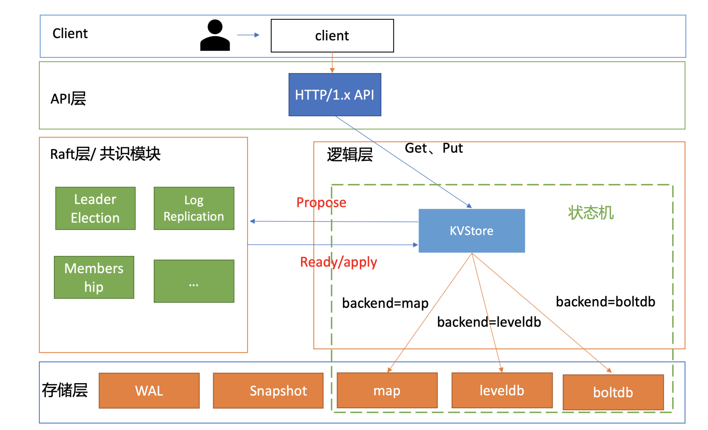

### API设计

API是软件系统对外的语言，它是应用编程接口的缩写，由一组接口定义和协议组成。

在设计API的时候，我们往往会考虑以下几个因素：

- 性能。如etcd v2使用的是简单的HTTP/1.x，性能上无法满足大规模Kubernetes集群等场景的诉求，因此etcd v3使用的是基于HTTP/2的gRPC协议。
- 易用性、可调试性。如有的内部高并发服务为了满足性能等诉求，使用的是UDP协议。相比HTTP协议，UDP协议显然在易用性、可调试性上存在一定的差距。
- 开发效率、跨平台、可移植性。相比基于裸UDP、TCP协议设计的接口，如果你使用Protobuf等IDL语言，它支持跨平台、代码自动自动生成，开发效率更高。
- 安全性。如相比HTTP协议，使用HTTPS协议可对通信数据加密更安全，可适用于不安全的网络环境（比如公网传输）。
- 接口幂等性。幂等性简单来说，就是同样一个接口请求一次与多次的效果一样。若你的接口对外保证幂等性，则可降低使用者的复杂度。

因为我们场景的是POC(Proof of concept)、Demo开发，因此在metcd项目中，我们优先考虑点是易用性、可调试性，选择HTTP/1.x协议，接口上为了满足key-value操作，支持Get和Put接口即可。

假设metcd项目使用3379端口，Put和Get接口，如下所示。

- Put接口，设置key-value

```bash
curl -L http://127.0.0.1:3379/hello -XPUT -d world
```

- Get接口，查询key-value

```bash
curl -L http://127.0.0.1:3379/hello
world
```

#### 复制状态机

了解完API设计，那最核心的复制状态机是如何工作的呢？

我们知道etcd是基于下图复制状态机实现的分布式KV服务，复制状态机由共识模块、日志模块、状态机组成。


我们的实战项目metcd，也正是使用与之一样的模型，并且使用etcd项目中实现的Raft算法库作为共识模块，此算法库已被广泛应用在etcd、cockroachdb、dgraph等开源项目中。

以下是复制状态机的写请求流程：

- client发起一个写请求（put hello = world）；
- server向Raft共识模块提交请求，共识模块生成一个写提案日志条目。若server是Leader，则把日志条目广播给其他节点，并持久化日志条目到WAL中；
- 当一半以上节点持久化日志条目后，Leader的共识模块将此日志条目标记为已提交（committed），并通知其他节点提交；
- server从共识模块获取已经提交的日志条目，异步应用到状态机存储中（boltdb/leveldb/memory），然后返回给client。

#### 多存储引擎

了解完复制状态机模型后，我和你再深入介绍下状态机。状态机中最核心模块当然是存储引擎，那要如何同时支持多种存储引擎呢？

metcd项目将基于etcd本身自带的raftexample项目进行快速开发，而raftexample本身只支持内存存储。

因此我们通过将KV存储接口进行抽象化设计，实现支持多存储引擎。KVStore interface的定义如下所示。

```scss
type KVStore interface {
   // LookUp get key value
   Lookup(key string) (string, bool)

   // Propose propose kv request into raft state machine
   Propose(k, v string)

   // ReadCommits consume entry from raft state machine into KvStore map until error
   ReadCommits(commitC <-chan *string, errorC <-chan error)

   // Snapshot return KvStore snapshot
   Snapshot() ([]byte, error)

   // RecoverFromSnapshot recover data from snapshot
   RecoverFromSnapshot(snapshot []byte) error

   // Close close backend databases
   Close() err
}
```

基于KV接口抽象化的设计，我们只需要针对具体的存储引擎，实现对应的操作即可。

我们期望支持三种存储引擎，分别是内存map、boltdb、leveldb，并做一系列简化设计。一组metcd实例，通过metcd启动时的配置来决定使用哪种存储引擎。不同业务场景不同实例，比如读多写少的存储引擎可使用boltdb，写多读少的可使用leveldb。

接下来我和你重点介绍下存储引擎的选型及原理。

##### boltdb

boltdb是一个基于B+ tree实现的存储引擎库，在[10](https://time.geekbang.org/column/article/342527?utm_term=zeus18YAD&utm_source=app&utm_medium=geektime)中我已和你详细介绍过原理。

boltdb为什么适合读多写少？

对于读请求而言，一般情况下它可直接从内存中基于B+ tree遍历，快速获取数据返回给client，不涉及经过磁盘I/O。

对于写请求，它基于B+ tree查找写入位置，更新key-value。事务提交时，写请求包括B+ tree重平衡、分裂、持久化ditry page、持久化freelist、持久化meta page流程。同时，ditry page可能分布在文件的各个位置，它发起的是随机写磁盘I/O。

因此在boltdb中，完成一个写请求的开销相比读请求是大很多的。正如我在[16](https://time.geekbang.org/column/article/345588)和[17](https://time.geekbang.org/column/article/346471)中给你介绍的一样，一个3节点的8核16G空集群，线性读性能可以达到19万QPS，而写QPS仅为5万。

##### leveldb

那要如何设计适合写多读少的存储引擎呢?

最简单的思路当然是写内存最快。可是内存有限的，无法支撑大容量的数据存储，不持久化数据会丢失。

那能否直接将数据顺序追加到文件末尾（AOF）呢？因为磁盘的特点是顺序写性能比较快。

当然可以。[Bitcask](https://en.wikipedia.org/wiki/Bitcask)存储模型就是采用AOF模式，把写请求顺序追加到文件。Facebook的图片存储[Haystack](https://www.usenix.org/legacy/event/osdi10/tech/full_papers/Beaver.pdf)根据其论文介绍，也是使用类似的方案来解决大规模写入痛点。

那在AOF写入模型中如何实现查询数据呢？

很显然通过遍历文件一个个匹配key是可以的，但是它的性能是极差的。为了实现高性能的查询，最理想的解决方案从直接从内存中查询，但是内存是有限的，那么我们能否通过内存索引来记录一个key-value数据在文件中的偏移量，实现从磁盘快速读取呢？

是的，这正是[Bitcask](https://en.wikipedia.org/wiki/Bitcask)存储模型的查询的实现，它通过内存哈希表维护各个key-value数据的索引，实现了快速查找key-value数据。不过，内存中虽然只保存key索引信息，但是当key较多的时候，其对内存要求依然比较高。

快速了解完存储引擎提升写性能的核心思路（随机写转化为顺序写）之后，那leveldb它的原理是怎样的呢？与Bitcask存储模型有什么不一样？

leveldb是基于LSM tree(log-structured merge-tree)实现的key-value存储，它的架构如下图所示（[引用自微软博客](https://microsoft.github.io/MLOS/notebooks/LevelDbTuning/)）。

它提升写性能的核心思路同样是将随机写转化为顺序写磁盘WAL文件和内存，结合了我们上面讨论的写内存和磁盘两种方法。数据持久化到WAL文件是为了确保机器crash后数据不丢失。

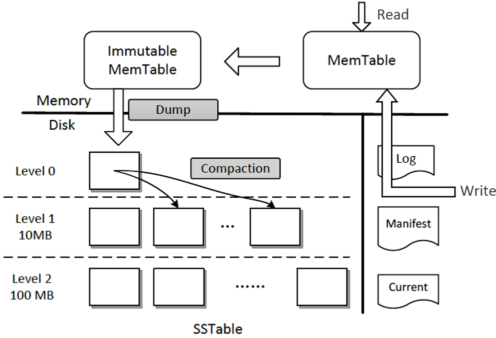

那么它要如何解决内存不足和查询的痛点问题呢？

核心解决方案是分层的设计和基于一系列对象的转换和压缩。接下来我给你分析一下上面架构图写流程和后台compaction任务：

- 首先写请求顺序写入Log文件(WAL)；
- 更新内存的Memtable。leveldb Memtable后端数据结构实现是skiplist，skiplist相比平衡二叉树，实现简单却同样拥有高性能的读写；
- 当Memtable达到一定的阈值时，转换成不可变的Memtable，也就是只读不可写；
- leveldb后台Compact任务会将不可变的Memtable生成SSTable文件，它有序地存储一系列key-value数据。注意SST文件按写入时间进行了分层，Level层次越小数据越新。Manifest文件记录了各个SSTable文件处于哪个层级、它的最小与最大key范围；
- 当某个level下的SSTable文件数目超过一定阈值后，Compact任务会从这个level的SSTable中选择一个文件（level>0），将其和高一层级的level+1的SSTable文件合并；
- 注意level 0是由Immutable直接生成的，因此level 0 SSTable文件中的key-value存在相互重叠。而level > 0时，在和更高一层SSTable合并过程中，参与的SSTable文件是多个，leveldb会确保各个SSTable中的key-value不重叠。

了解完写流程，读流程也就简单了，核心步骤如下：

- 从Memtable跳跃表中查询key；
- 未找到则从Immutable中查找；
- Immutable仍未命中，则按照leveldb的分层属性，因level 0 SSTable文件是直接从Immutable生成的，level 0存在特殊性，因此你需要从level 0遍历SSTable查找key；
- level 0中若未命中，则从level 1乃至更高的层次查找。level大于0时，各个SSTable中的key是不存在相互重叠的。根据manifest记录的key-value范围信息，可快递定位到具体的SSTable。同时leveldb基于[bloom filter](https://en.wikipedia.org/wiki/Bloom_filter)实现了快速筛选SSTable，因此查询效率较高。

更详细原理你可以参考一下[leveldb](https://github.com/google/leveldb)源码。

### 实现分析

从API设计、复制状态机、多存储引擎支持等几个方面你介绍了metcd架构设计后，接下来我就和你重点介绍下共识模块、状态机支持多存储引擎模块的核心实现要点。

#### Raft算法库

共识模块使用的是etcd [Raft算法库](https://github.com/etcd-io/etcd/tree/v3.4.9/raft)，它是一个经过大量业务生产环境检验、具备良好可扩展性的共识算法库。

它提供了哪些接口给你使用? 如何提交一个提案，并且获取Raft共识模块输出结果呢？

##### Raft API

Raft作为一个库，它对外最核心的对象是一个名为[Node](https://github.com/etcd-io/etcd/blob/v3.4.9/raft/node.go#L125:L203)的数据结构。Node表示Raft集群中的一个节点，它的输入与输出接口如下图所示，下面我重点和你介绍它的几个接口功能：

- Campaign，状态转换成Candidate，发起新一轮Leader选举；
- Propose，提交提案接口；
- Ready，Raft状态机输出接口，它的返回是一个输出Ready数据结构类型的管道，应用需要监听此管道，获取Ready数据，处理其中的各个消息（如持久化未提交的日志条目到WAL中，发送消息给其他节点等）；
- Advance，通知Raft状态机，应用已处理上一个输出的Ready数据，等待发送下一个Ready数据；
- TransferLeaderShip，尝试将Leader转移到某个节点；
- Step，向Raft状态机提交收到的消息，比如当Leader广播完MsgApp消息给Follower节点后，Leader收到Follower节点回复的MsgAppResp消息时，就通过Step接口将此消息提交给Raft状态机驱动其工作；
- ReadIndex，用于实现线性读。

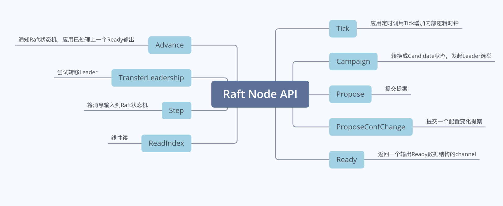

上面提到的Raft状态机的输出[Ready结构](https://github.com/etcd-io/etcd/blob/v3.4.9/raft/node.go#L52:L90)含有哪些信息呢? 下图是其详细字段，含义如下：

- SoftState，软状态。包括集群Leader和节点状态，不需要持久化到WAL；
- pb.HardState，硬状态。与软状态相反，包括了节点当前Term、Vote等信息，需要持久化到WAL中；
- ReadStates，用于线性一致性读；
- Entries，在向其他节点发送消息之前需持久化到WAL中；
- Messages，持久化Entries后，发送给其他节点的消息；
- Committed Entries，已提交的日志条目，需要应用到存储状态机中；
- Snapshot，快照需保存到持久化存储中；
- MustSync，HardState和Entries是否要持久化到WAL中；

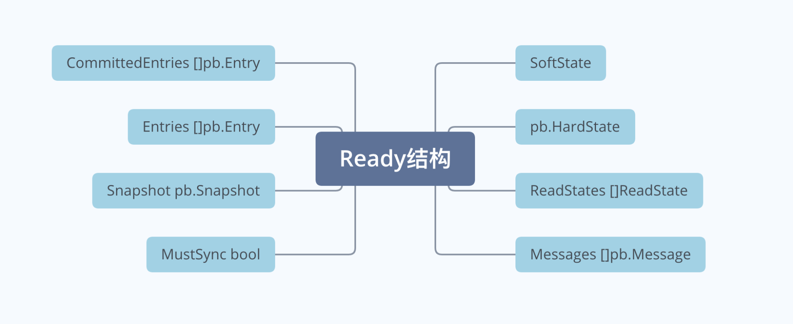

了解完API后，我们接下来继续看看代码如何使用Raft的Node API。

正如我在[04](https://time.geekbang.org/column/article/337604)中和你介绍的，etcd Raft库的设计抽象了网络、Raft日志存储等模块，它本身并不会进行网络、存储相关的操作，上层应用需结合自己业务场景选择内置的模块或自定义实现网络、存储、日志等模块。

因此我们在使用Raft库时，需要先自定义好相关网络、存储等模块，再结合上面介绍的Raft Node API，就可以完成一个Node的核心操作了。其数据结构定义如下：

```go
// A key-value stream backed by raft
type raftNode struct {
   proposeC    <-chan string            // proposed messages (k,v)
   confChangeC <-chan raftpb.ConfChange // proposed cluster config changes
   commitC     chan<- *string           // entries committed to log (k,v)
   errorC      chan<- error             // errors from raft session
   id          int      // client ID for raft session
   ......
   node        raft.Node
   raftStorage *raft.MemoryStorage
   wal         *wal.WAL
   transport *rafthttp.Transport
}
```

这个数据结构名字叫raftNode，它表示Raft集群中的一个节点。它是由我们业务应用层设计的一个组合结构。从结构体定义中你可以看到它包含了Raft核心数据结构Node(raft.Node)、Raft日志条目内存存储模块(raft.MemoryStorage）、WAL持久化模块(wal.WAL)以及网络模块(rafthttp.Transport)。

同时，它提供了三个核心的管道与业务逻辑模块、存储状态机交互：

- proposeC，它用来接收client发送的写请求提案消息；
- confChangeC，它用来接收集群配置变化消息；
- commitC，它用来输出Raft共识模块已提交的日志条目消息。

在metcd项目中因为我们是直接基于raftexample定制开发，因此日志持久化存储、网络都使用的是etcd自带的WAL和rafthttp模块。

[WAL](https://github.com/etcd-io/etcd/blob/v3.4.9/wal/wal.go)模块中提供了核心的保存未持久化的日志条目和快照功能接口，你可以参考[03](https://time.geekbang.org/column/article/336766)节写请求中我和你介绍的原理。

[rafthttp](https://github.com/etcd-io/etcd/tree/v3.4.9/etcdserver/api/rafthttp)模块基于HTTP协议提供了各个节点间的消息发送能力，metcd使用如下：

```yaml
rc.transport = &rafthttp.Transport{
   Logger:      zap.NewExample(),
   ID:          types.ID(rc.id),
   ClusterID:   0x1000,
   Raft:        rc,
   ServerStats: stats.NewServerStats("", ""),
   LeaderStats: stats.NewLeaderStats(strconv.Itoa(rc.id)),
   ErrorC:      make(chan error),
}
```

搞清楚Raft模块的输入、输出API，设计好raftNode结构，复用etcd的WAL、网络等模块后，接下来我们就只需要实现如下两个循环逻辑，处理业务层发送给proposeC和confChangeC消息、将Raft的Node输出Ready结构进行相对应的处理即可。精简后的代码如下所示：

```go
func (rc *raftNode) serveChannels() {
   // send proposals over raft
   go func() {
      confChangeCount := uint64(0)
      for rc.proposeC != nil && rc.confChangeC != nil {
         select {
         case prop, ok := <-rc.proposeC:
            if !ok {
               rc.proposeC = nil
            } else {
               // blocks until accepted by raft state machine
               rc.node.Propose(context.TODO(), []byte(prop))
            }

         case cc, ok := <-rc.confChangeC:
            if !ok {
               rc.confChangeC = nil
            } else {
               confChangeCount++
               cc.ID = confChangeCount
               rc.node.ProposeConfChange(context.TODO(), cc)
            }
         }
      }
   }()

   // event loop on raft state machine updates
   for {
      select {
      case <-ticker.C:
         rc.node.Tick()

      // store raft entries to wal, then publish over commit channel
      case rd := <-rc.node.Ready():
         rc.wal.Save(rd.HardState, rd.Entries)
         if !raft.IsEmptySnap(rd.Snapshot) {
            rc.saveSnap(rd.Snapshot)
            rc.raftStorage.ApplySnapshot(rd.Snapshot)
            rc.publishSnapshot(rd.Snapshot)
         }
         rc.raftStorage.Append(rd.Entries)
         rc.transport.Send(rd.Messages)
         if ok := rc.publishEntries(rc.entriesToApply(rd.CommittedEntries)); !ok {
            rc.stop()
            return
         }
         rc.maybeTriggerSnapshot()
         rc.node.Advance()
      }
   }
}
```

代码简要分析如下：

- 从proposeC中取出提案消息，通过raft.Node.Propose API提交提案；
- 从confChangeC取出配置变更消息，通过raft.Node.ProposeConfChange API提交配置变化消息；
- 从raft.Node中获取Raft算法状态机输出到Ready结构中，将rd.Entries和rd.HardState通过WAL模块持久化，将rd.Messages通过rafthttp模块，发送给其他节点。将rd.CommittedEntries应用到业务存储状态机。

以上就是Raft实现的核心流程，接下来我来和你聊聊业务存储状态机。

#### 支持多存储引擎

在整体架构设计时，我和你介绍了为了使metcd项目能支撑多存储引擎，我们将KVStore进行了抽象化设计，因此我们只需要实现各个存储引擎相对应的API即可。

这里我以Put接口为案例，分别给你介绍下各个存储引擎的实现。

##### boltdb

首先是boltdb存储引擎，它的实现如下，你也可以去[10](https://time.geekbang.org/column/article/342527)里回顾一下它的API和原理。

```go
func (s *boltdbKVStore) Put(key, value string) error {
   s.mu.Lock()
   defer s.mu.Unlock()
   // Start a writable transaction.
   tx, err := s.db.Begin(true)
   if err != nil {
      return err
   }
   defer tx.Rollback()

   // Use the transaction...
   bucket, err := tx.CreateBucketIfNotExists([]byte("keys"))
   if err != nil {
      log.Printf("failed to put key %s, value %s, err is %v", key, value, err)
      return err
   }
   err = bucket.Put([]byte(key), []byte(value))
   if err != nil {
      log.Printf("failed to put key %s, value %s, err is %v", key, value, err)
      return err
   }

   // Commit the transaction and check for error.
   if err := tx.Commit(); err != nil {
      log.Printf("failed to commit transaction, key %s, err is %v", key, err)
      return err
   }
   log.Printf("backend:%s,put key:%s,value:%s succ", s.config.backend, key, value)
   return nil
```

##### leveldb

其次是leveldb，我们使用的是[goleveldb](https://github.com/syndtr/goleveldb)，它基于Google开源的c++ [leveldb](https://github.com/google/leveldb)版本实现。它提供的常用API如下所示。

- 通过OpenFile API创建或打开一个leveldb数据库。

```go
db, err := leveldb.OpenFile("path/to/db", nil)
...
defer db.Close()
```

- 通过DB.Get/Put/Delete API操作数据。

```go
data, err := db.Get([]byte("key"), nil)
...
err = db.Put([]byte("key"), []byte("value"), nil)
...
err = db.Delete([]byte("key"), nil)
...
```

了解其接口后，通过goleveldb的库，client调用就非常简单了，下面是metcd项目中，leveldb存储引擎Put接口的实现。

```go
func (s *leveldbKVStore) Put(key, value string) error {
   err := s.db.Put([]byte(key), []byte(value), nil)
   if err != nil {
      log.Printf("failed to put key %s, value %s, err is %v", key, value, err)
      return err
   }
   log.Printf("backend:%s,put key:%s,value:%s succ", s.config.backend, key, value)
   return nil
}
```

#### 读写流程

介绍完在metcd项目中如何使用Raft共识模块、支持多存储引擎后，我们再从整体上介绍下在metcd中写入和读取一个key-value的流程。

##### 写流程

当你通过如下curl命令发起一个写操作时，写流程如下面架构图序号所示:

```bash
curl -L http://127.0.0.1:3379/hello -XPUT -d world
```

- client通过curl发送HTTP PUT请求到server；
- server收到后，将消息写入到KVStore的ProposeC管道；
- raftNode循环逻辑将消息通过Raft模块的Propose接口提交；
- Raft模块输出Ready结构，server将日志条目持久化后，并发送给其他节点；
- 集群多数节点持久化此日志条目后，这个日志条目被提交给存储状态机KVStore执行；
- KVStore根据启动的backend存储引擎名称，调用对应的Put接口即可。

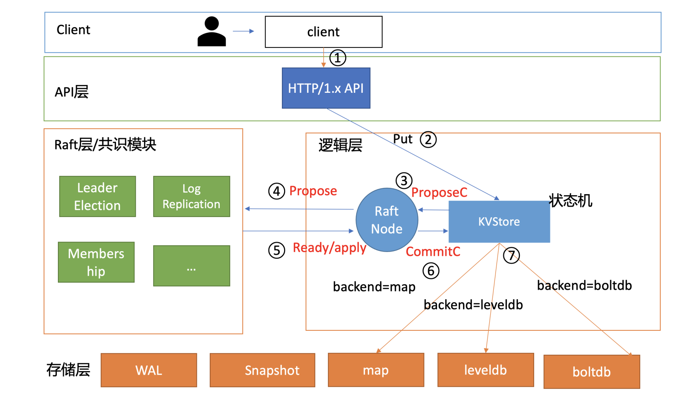

##### 读流程

当你通过如下curl命令发起一个读操作时，读流程如下面架构图序号所示：

```bash
curl -L http://127.0.0.1:3379/hello
world
```

- client通过curl发送HTTP Get请求到server；
- server收到后，根据KVStore的存储引擎，从后端查询出对应的key-value数据。

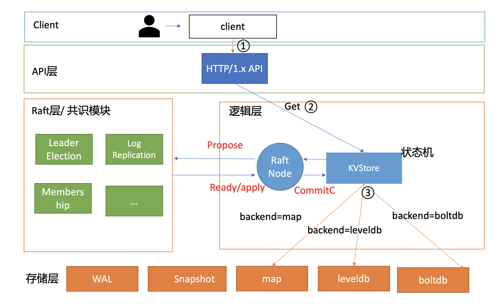

### 小结

最后，我来总结下我们今天的内容。我这节课分别从整体架构设计和实现分析，给你介绍了如何基于Raft从0到1构建一个支持多存储引擎的分布式key-value数据库。

在整体架构设计上，我给你介绍了API设计核心因素，它们分别是性能、易用性、开发效率、安全性、幂等性。其次我和你介绍了复制状态机的原理，它由共识模块、日志模块、存储状态机模块组成。最后我和你深入分析了多存储引擎设计，重点介绍了leveldb原理，它将随机写转换为顺序写日志和内存，通过一系列分层、创新的设计实现了优异的写性能，适合读少写多。

在实现分析上，我和你重点介绍了Raft算法库的核心对象Node API。对于一个库而言，我们重点关注的是其输入、输出接口，业务逻辑层可通过Propose接口提交提案，通过Ready结构获取Raft算法状态机的输出内容。其次我和你介绍了Raft算法库如何与WAL模块、Raft日志存储模块、网络模块协作完成一个写请求。

最后为了支持多存储引擎，我们分别基于boltdb、leveldb实现了KVStore相关接口操作，并通过读写流程图，从整体上为你介绍了一个读写请求在metcd中是如何工作的。

麻雀虽小，五脏俱全。希望能通过这个迷你项目解答你对如何构建一个简易分布式KV服务的疑问，以及让你对etcd的工作原理有更深的理解。

## k8s案例

通过在Kubernetes集群中创建一个Pod的案例，为你分析etcd在其中发挥的作用，带你深入了解Kubernetes是如何使用etcd的。

希望通过本节课，帮助你从etcd的角度更深入理解Kubernetes，让你知道在Kubernetes集群中每一步操作的背后，etcd会发生什么。更进一步，当你在Kubernetes集群中遇到etcd相关错误的时候，能从etcd角度理解错误含义，高效进行故障诊断。

### Kubernetes基础架构

在带你详细了解etcd在Kubernetes里的应用之前，我先和你简单介绍下Kubernetes集群的整体架构，帮你搞清楚etcd在Kubernetes集群中扮演的角色与作用。

下图是Kubernetes集群的架构图（[引用自Kubernetes官方文档](https://kubernetes.io/docs/concepts/overview/components/)），从图中你可以看到，它由Master节点和Node节点组成。

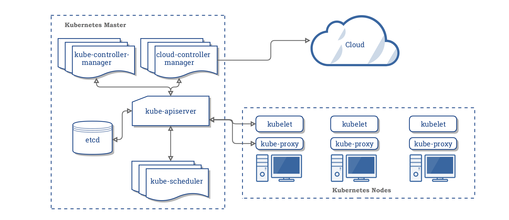

控制面Master节点主要包含以下组件：

- kube-apiserver，负责对外提供集群各类资源的增删改查及Watch接口，它是Kubernetes集群中各组件数据交互和通信的枢纽。kube-apiserver在设计上可水平扩展，高可用Kubernetes集群中一般多副本部署。当收到一个创建Pod写请求时，它的基本流程是对请求进行认证、限速、授权、准入机制等检查后，写入到etcd即可。
- kube-scheduler是调度器组件，负责集群Pod的调度。基本原理是通过监听kube-apiserver获取待调度的Pod，然后基于一系列筛选和评优算法，为Pod分配最佳的Node节点。
- kube-controller-manager包含一系列的控制器组件，比如Deployment、StatefulSet等控制器。控制器的核心思想是监听、比较资源实际状态与期望状态是否一致，若不一致则进行协调工作使其最终一致。
- etcd组件，Kubernetes的元数据存储。

Node节点主要包含以下组件：

- kubelet，部署在每个节点上的Agent的组件，负责Pod的创建运行。基本原理是通过监听APIServer获取分配到其节点上的Pod，然后根据Pod的规格详情，调用运行时组件创建pause和业务容器等。
- kube-proxy，部署在每个节点上的网络代理组件。基本原理是通过监听APIServer获取Service、Endpoint等资源，基于Iptables、IPVS等技术实现数据包转发等功能。

从Kubernetes基础架构介绍中你可以看到，kube-apiserver是唯一直接与etcd打交道的组件，各组件都通过kube-apiserver实现数据交互，它们极度依赖kube-apiserver提供的资源变化**监听机制**。而kube-apiserver对外提供的监听机制，也正是由我们基础篇[08](https://time.geekbang.org/column/article/341060)中介绍的etcd **Watch特性**提供的底层支持。

### 创建Pod案例

接下来我们就以在Kubernetes集群中创建一个nginx服务为例，通过这个案例来详细分析etcd在Kubernetes集群创建Pod背后是如何工作的。

下面是创建一个nginx服务的YAML文件，Workload是Deployment，期望的副本数是1。

```yaml
apiVersion: apps/v1
kind: Deployment
metadata:
  name: nginx-deployment
  labels:
    app: nginx
spec:
  replicas: 1
  selector:
    matchLabels:
      app: nginx
  template:
    metadata:
      labels:
        app: nginx
    spec:
      containers:
      - name: nginx
        image: nginx:1.14.2
        ports:
        - containerPort: 80
```

假设此YAML文件名为nginx.yaml，首先我们通过如下的kubectl create -f nginx.yml命令创建Deployment资源。

```bash
$ kubectl create -f nginx.yml
deployment.apps/nginx-deployment created
```

创建之后，我们立刻通过如下命令，带标签查询Pod，输出如下：

```sql
$ kubectl get po -l app=nginx
NAME                                READY   STATUS    RESTARTS   AGE
nginx-deployment-756d9fd5f9-fkqnf   1/1     Running   0          8s
```

那么在kubectl create命令发出，nginx Deployment资源成功创建的背后，kube-apiserver是如何与etcd打交道的呢？ 它是通过什么接口**安全写入**资源到etcd的？

同时，使用kubectl带标签查询Pod背后，kube-apiserver是直接从**缓存读取**还是向etcd发出一个**线性读**或**串行读**请求呢？ 若同namespace下存在大量的Pod，此操作性能又是怎样的呢?

接下来我就和你聊聊kube-apiserver收到创建和查询请求后，是如何与etcd交互的。

### kube-apiserver请求执行链路

kube-apiserver作为Kubernetes集群交互的枢纽、对外提供API供用户访问的组件，因此保障集群安全、保障本身及后端etcd的稳定性的等重任也是非它莫属。比如校验创建请求发起者是否合法、是否有权限操作相关资源、是否出现Bug产生大量写和读请求等。

[下图是kube-apiserver的请求执行链路](https://speakerdeck.com/sttts/kubernetes-api-codebase-tour?slide=18)（引用自sttts分享的PDF），当收到一个请求后，它主要经过以下处理链路来完成以上若干职责后，才能与etcd交互。

核心链路如下：

- 认证模块，校验发起的请求的用户身份是否合法。支持多种方式，比如x509客户端证书认证、静态token认证、webhook认证等。
- 限速模块，对请求进行简单的限速，默认读400/s写200/s，不支持根据请求类型进行分类、按优先级限速，存在较多问题。Kubernetes 1.19后已新增Priority and Fairness特性取代它，它支持将请求重要程度分类进行限速，支持多租户，可有效保障Leader选举之类的高优先级请求得到及时响应，能防止一个异常client导致整个集群被限速。
- 审计模块，可记录用户对资源的详细操作行为。
- 授权模块，检查用户是否有权限对其访问的资源进行相关操作。支持多种方式，RBAC(Role-based access control)、ABAC(Attribute-based access control)、Webhhook等。Kubernetes 1.12版本后，默认授权机制使用的RBAC。
- 准入控制模块，提供在访问资源前拦截请求的静态和动态扩展能力，比如要求镜像的拉取策略始终为AlwaysPullImages。

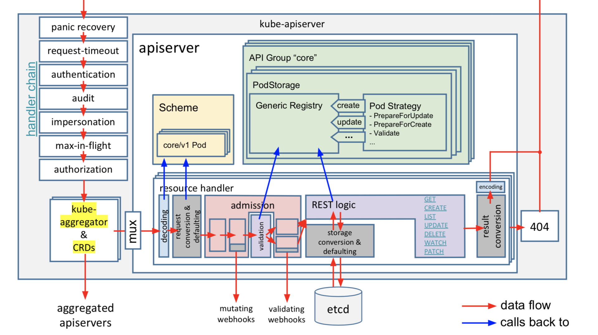

经过上面一系列的模块检查后，这时kube-apiserver就开始与etcd打交道了。在了解kube-apiserver如何将我们创建的Deployment资源写入到etcd前，我先和你介绍下Kubernetes的资源是如何组织、存储在etcd中。

### Kubernetes资源存储格式

我们知道etcd仅仅是个key-value存储，但是在Kubernetes中存在各种各样的资源，并提供了以下几种灵活的资源查询方式：

- 按具体资源名称查询，比如PodName、kubectl get po/PodName。
- 按namespace查询，获取一个namespace下的所有Pod，比如kubectl get po -n kube-system。
- 按标签名，标签是极度灵活的一种方式，你可以为你的Kubernetes资源打上各种各样的标签，比如上面案例中的kubectl get po -l app=nginx。

你知道以上这几种查询方式它们的性能优劣吗？假设你是Kubernetes开发者，你会如何设计存储格式来满足以上功能点？

首先是按具体资源名称查询。它本质就是个key-value查询，只需要写入etcd的key名称与资源key一致即可。

其次是按namespace查询。这种查询也并不难。因为我们知道etcd支持范围查询，若key名称前缀包含namespace、资源类型，查询的时候指定namespace和资源类型的组合的最小开始区间、最大结束区间即可。

最后是标签名查询。这种查询方式非常灵活，业务可随时添加、删除标签，各种标签可相互组合。实现标签查询的办法主要有以下两种：

- 方案一，在etcd中存储标签数据，实现通过标签可快速定位（时间复杂度O(1)）到具体资源名称。然而一个标签可能容易实现，但是在Kubernetes集群中，它支持按各个标签组合查询，各个标签组合后的数量相当庞大。在etcd中维护各种标签组合对应的资源列表，会显著增加kube-apiserver的实现复杂度，导致更频繁的etcd写入。
- 方案二，在etcd中不存储标签数据，而是由kube-apiserver通过范围遍历etcd获取原始数据，然后基于用户指定标签，来筛选符合条件的资源返回给client。此方案优点是实现简单，但是大量标签查询可能会导致etcd大流量等异常情况发生。

那么Kubernetes集群选择的是哪种实现方式呢?

下面是一个Kubernetes集群中的coredns一系列资源在etcd中的存储格式：

```bash
/registry/clusterrolebindings/system:coredns
/registry/clusterroles/system:coredns
/registry/configmaps/kube-system/coredns
/registry/deployments/kube-system/coredns
/registry/events/kube-system/coredns-7fcc6d65dc-6njlg.1662c287aabf742b
/registry/events/kube-system/coredns-7fcc6d65dc-6njlg.1662c288232143ae
/registry/pods/kube-system/coredns-7fcc6d65dc-jvj26
/registry/pods/kube-system/coredns-7fcc6d65dc-mgvtb
/registry/pods/kube-system/coredns-7fcc6d65dc-whzq9
/registry/replicasets/kube-system/coredns-7fcc6d65dc
/registry/secrets/kube-system/coredns-token-hpqbt
/registry/serviceaccounts/kube-system/coredns
```

从中你可以看到，一方面Kubernetes资源在etcd中的存储格式由prefix + “/” + 资源类型 + “/” + namespace + “/” + 具体资源名组成，基于etcd提供的范围查询能力，非常简单地支持了按具体资源名称查询和namespace查询。

kube-apiserver提供了如下参数给你配置etcd prefix，并支持将资源存储在多个etcd集群。

```sql
--etcd-prefix string     Default: "/registry"
The prefix to prepend to all resource paths in etcd.
--etcd-servers stringSlice
List of etcd servers to connect with (scheme://ip:port), comma separated.
--etcd-servers-overrides stringSlice
Per-resource etcd servers overrides, comma separated. The individual override format: group/resource#servers, where servers are URLs, 
semicolon separated.
```

另一方面，我们未看到任何标签相关的key。Kubernetes实现标签查询的方式显然是方案二，即由kube-apiserver通过范围遍历etcd获取原始数据，然后基于用户指定标签，来筛选符合条件的资源返回给client（资源key的value中记录了资源YAML文件内容等，如标签）。

也就是当你执行”kubectl get po -l app=nginx”命令，按标签查询Pod时，它会向etcd发起一个范围遍历整个default namespace下的Pod操作。

```bash
$ kubectl get po -l app=nginx -v 8
I0301 23:45:25.597465   32411 loader.go:359] Config loaded from file /root/.kube/config
I0301 23:45:25.603182   32411 round_trippers.go:416] GET https://ip:port/api/v1/namespaces/default/pods?
labelSelector=app%3Dnginx&limit=500
```

etcd收到的请求日志如下，由此可见当一个namespace存在大量Pod等资源时，若频繁通过kubectl，使用标签查询Pod等资源，后端etcd将出现较大的压力。

```ruby
{
    "level":"debug",
    "ts":"2021-03-01T23:45:25.609+0800",
    "caller":"v3rpc/interceptor.go:181",
    "msg":"request stats",
    "start time":"2021-03-01T23:45:25.608+0800",
    "time spent":"1.414135ms",
    "remote":"127.0.0.1:44664",
    "response type":"/etcdserverpb.KV/Range",
    "request count":0,
    "request size":61,
    "response count":11,
    "response size":81478,
    "request content":"key:"/registry/pods/default/" range_end:"/registry/pods/default0" limit:500 "
}
```

了解完Kubernetes资源的存储格式后，我们再看看nginx Deployment资源是如何由kube-apiserver写入etcd的。

### 通用存储模块

kube-apiserver启动的时候，会将每个资源的APIGroup、Version、Resource Handler注册到路由上。当请求经过认证、限速、授权、准入控制模块检查后，请求就会被转发到对应的资源逻辑进行处理。

同时，kube-apiserver实现了类似数据库ORM机制的通用资源存储机制，提供了对一个资源创建、更新、删除前后的hook能力，将其封装成策略接口。当你新增一个资源时，你只需要编写相应的创建、更新、删除等策略即可，不需要写任何etcd的API。

下面是kube-apiserver通用存储模块的创建流程图：

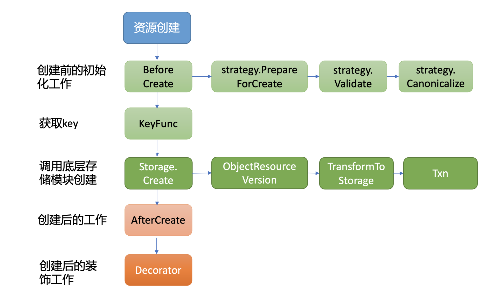

从图中你可以看到，创建一个资源主要由BeforeCreate、Storage.Create以及AfterCreate三大步骤组成。

当收到创建nginx Deployment请求后，通用存储模块首先会回调各个资源自定义实现的BeforeCreate策略，为资源写入etcd做一些初始化工作。

下面是Deployment资源的创建策略实现，它会进行将deployment.Generation设置为1等操作。

```go
// PrepareForCreate clears fields that are not allowed to be set by end users on creation.
func (deploymentStrategy) PrepareForCreate(ctx context.Context, obj runtime.Object) {
   deployment := obj.(*apps.Deployment)
   deployment.Status = apps.DeploymentStatus{}
   deployment.Generation = 1

   pod.DropDisabledTemplateFields(&deployment.Spec.Template, nil)
}
```

执行完BeforeCreate策略后，它就会执行Storage.Create接口，也就是由它真正开始调用底层存储模块etcd3，将nginx Deployment资源对象写入etcd。

那么Kubernetes是使用etcd Put接口写入资源key-value的吗？如果是，那要如何防止同名资源并发创建被覆盖的问题？

#### 资源安全创建及更新

我们知道etcd提供了Put和Txn接口给业务添加key-value数据，但是Put接口在并发场景下若收到key相同的资源创建，就会导致被覆盖。

因此Kubernetes很显然无法直接通过etcd Put接口来写入数据。

而我们[09](https://time.geekbang.org/column/article/341935)节中介绍的etcd事务接口Txn，它正是为了多key原子更新、并发操作安全性等而诞生的，它提供了丰富的冲突检查机制。

Kubernetes集群使用的正是事务Txn接口来防止并发创建、更新被覆盖等问题。当执行完BeforeCreate策略后，这时kube-apiserver就会调用Storage的模块的Create接口写入资源。1.6版本后的Kubernete集群默认使用的存储是etcd3，它的创建接口简要实现如下：

```go
// Create implements storage.Interface.Create.
func (s *store) Create(ctx context.Context, key string, obj, out runtime.Object, ttl uint64) error {
   ......
   key = path.Join(s.pathPrefix, key)

   opts, err := s.ttlOpts(ctx, int64(ttl))
   if err != nil {
      return err
   }

   newData, err := s.transformer.TransformToStorage(data, authenticatedDataString(key))
   if err != nil {
      return storage.NewInternalError(err.Error())
   }

   startTime := time.Now()
   txnResp, err := s.client.KV.Txn(ctx).If(
      notFound(key),
   ).Then(
      clientv3.OpPut(key, string(newData), opts...),
   ).Commit
```

从上面的代码片段中，我们可以得出首先它会按照我们介绍的Kubernetes资源存储格式拼接key。

然后若TTL非0，它会根据TTL从leaseManager获取可复用的Lease ID。Kubernetes集群默认若不同key（如Kubernetes的Event资源对象）的TTL差异在1分钟内，可复用同一个Lease ID，避免大量Lease影响etcd性能和稳定性。

其次若开启了数据加密，在写入etcd前数据还将按加密算法进行转换工作。

最后就是使用etcd的Txn接口，向etcd发起一个创建deployment资源的Txn请求。

那么etcd收到kube-apiserver的请求是长什么样子的呢？

下面是etcd收到创建nginx deployment资源的请求日志：

```ruby
{
    "level":"debug",
    "ts":"2021-02-11T09:55:45.914+0800",
    "caller":"v3rpc/interceptor.go:181",
    "msg":"request stats",
    "start time":"2021-02-11T09:55:45.911+0800",
    "time spent":"2.697925ms",
    "remote":"127.0.0.1:44822",
    "response type":"/etcdserverpb.KV/Txn",
    "request count":1,
    "request size":479,
    "response count":0,
    "response size":44,
    "request content":"compare:<target:MOD key:"/registry/deployments/default/nginx-deployment" mod_revision:0 > success:<request_put:<key:"/registry/deployments/default/nginx-deployment" value_size:421 >> failure:<>"
}
```

从这个请求日志中，你可以得到以下信息：

- 请求的模块和接口，KV/Txn；
- key路径，/registry/deployments/default/nginx-deployment，由prefix + “/” + 资源类型 + “/” + namespace + “/” + 具体资源名组成；
- 安全的并发创建检查机制，mod_revision为0时，也就是此key不存在时，才允许执行put更新操作。

通过Txn接口成功将数据写入到etcd后，kubectl create -f nginx.yml命令就执行完毕，返回给client了。在以上介绍中你可以看到，kube-apiserver并没有任何逻辑去真正创建Pod，但是为什么我们可以马上通过kubectl get命令查询到新建并成功运行的Pod呢？

这就涉及到了基础架构图中的控制器、调度器、Kubelet等组件。下面我就为你浅析它们是如何基于etcd提供的Watch机制工作，最终实现创建Pod、调度Pod、运行Pod的。

### Watch机制在Kubernetes中应用

正如我们基础架构中所介绍的，kube-controller-manager组件中包含一系列WorkLoad的控制器。Deployment资源就由其中的Deployment控制器来负责的，那么它又是如何感知到新建Deployment资源，最终驱动ReplicaSet控制器创建出Pod的呢？

获取数据变化的方案，主要有轮询和推送两种方案组成。轮询会产生大量expensive request，并且存在高延时。而etcd Watch机制提供的流式推送能力，赋予了kube-apiserver对外提供数据监听能力。

我们知道在etcd中版本号是个逻辑时钟，随着client对etcd的增、删、改操作而全局递增，它被广泛应用在MVCC、事务、Watch特性中。

尤其是在Watch特性中，版本号是数据增量同步的核心。当client因网络等异常出现连接闪断后，它就可以通过版本号从etcd server中快速获取异常后的事件，无需全量同步。

那么在Kubernetes集群中，它提供了什么概念来实现增量监听逻辑呢？

答案是Resource Version。

#### Resource Version与etcd版本号

Resource Version是Kubernetes API中非常重要的一个概念，顾名思义，它是一个Kubernetes资源的内部版本字符串，client可通过它来判断资源是否发生了变化。同时，你可以在Get、List、Watch接口中，通过指定Resource Version值来满足你对数据一致性、高性能等诉求。

那么Resource Version有哪些值呢？跟etcd版本号是什么关系？

下面我分别以Get和Watch接口中的Resource Version参数值为例，为你剖析它与etcd的关系。

在Get请求查询案例中，ResourceVersion主要有以下这三种取值：

第一种是未指定ResourceVersion，默认空字符串。kube-apiserver收到一个此类型的读请求后，它会向etcd发出共识读/线性读请求获取etcd集群最新的数据。

第二种是设置ResourceVersion=“0”，赋值字符串0。kube-apiserver收到此类请求时，它可能会返回任意资源版本号的数据，但是优先返回较新版本。一般情况下它直接从kube-apiserver缓存中获取数据返回给client，有可能读到过期的数据，适用于对数据一致性要求不高的场景。

第三种是设置ResourceVersion为一个非0的字符串。kube-apiserver收到此类请求时，它会保证Cache中的最新ResourceVersion大于等于你传入的ResourceVersion，然后从Cache中查找你请求的资源对象key，返回数据给client。基本原理是kube-apiserver为各个核心资源（如Pod）维护了一个Cache，通过etcd的Watch机制来实时更新Cache。当你的Get请求中携带了非0的ResourceVersion，它会等待缓存中最新ResourceVersion大于等于你Get请求中的ResoureVersion，若满足条件则从Cache中查询数据，返回给client。若不满足条件，它最多等待3秒，若超过3秒，Cache中的最新ResourceVersion还小于Get请求中的ResourceVersion，就会返回ResourceVersionTooLarge错误给client。

你要注意的是，若你使用的Get接口，那么kube-apiserver会取资源key的ModRevision字段填充Kubernetes资源的ResourceVersion字段（v1.meta/ObjectMeta.ResourceVersion）。若你使用的是List接口，kube-apiserver会在查询时，使用etcd当前版本号填充ListMeta.ResourceVersion字段（v1.meta/ListMeta.ResourceVersion）。

那么当我们执行kubectl get po查询案例时，它的ResouceVersion是什么取值呢? 查询的是kube-apiserver缓存还是etcd最新共识数据?

如下所示，你可以通过指定kubectl日志级别为6，观察它向kube-apiserver发出的请求参数。从下面请求日志里你可以看到，默认是未指定Resource Version，也就是会发出一个共识读/线性读请求给etcd，获取etcd最新共识数据。

```sql
kubectl get po -l app=nginx -v 6
4410 loader.go:359] Config loaded from file /root/.kube/config
4410 round_trippers.go:438] GET https://*.*.*.*:*/api/v1/namespaces/default/pods?labelSelector=app%3Dnginx&limit=500 200 OK in 8 milliseconds
```

这里要提醒下你，在规模较大的集群中，尽量不要使用kubectl频繁查询资源。正如我们上面所分析的，它会直接查询etcd数据，可能会产生大量的expensive request请求，之前我就有见过业务这样用，然后导致了集群不稳定。

介绍完查询案例后，我们再看看Watch案例中，它的不同取值含义是怎样的呢?

它同样含有查询案例中的三种取值，官方定义的含义分别如下：

- 未指定ResourceVersion，默认空字符串。一方面为了帮助client建立初始状态，它会将当前已存在的资源通过Add事件返回给client。另一方面，它会从etcd当前版本号开始监听，后续新增写请求导致数据变化时可及时推送给client。
- 设置ResourceVersion=“0”，赋值字符串0。它同样会帮助client建立初始状态，但是它会从任意版本号开始监听（当前kube-apiserver的实现指定ResourceVersion=0和不指定行为一致，在获取初始状态后，都会从cache最新的ResourceVersion开始监听），这种场景可能会导致集群返回陈旧的数据。
- 设置ResourceVersion为一个非0的字符串。从精确的版本号开始监听数据，它只会返回大于等于精确版本号的变更事件。

Kubernetes的控制器组件就基于以上的Watch特性，在快速感知到新建Deployment资源后，进入一致性协调逻辑，创建ReplicaSet控制器，整体交互流程如下所示。

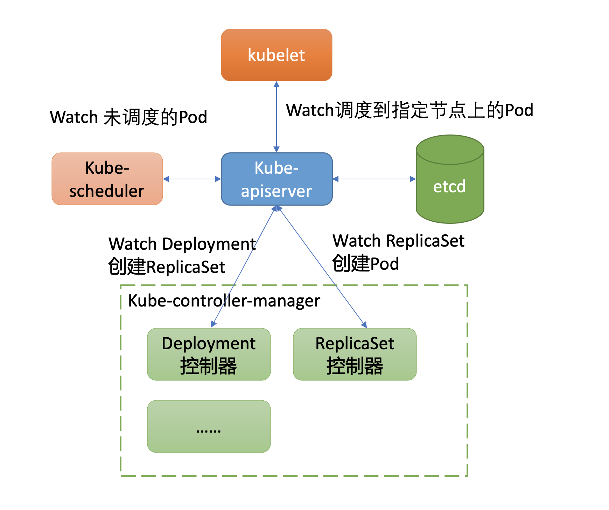

Deployment控制器创建ReplicaSet资源对象的日志如下所示。

```ruby
{
    "level":"debug",
    "ts":"2021-02-11T09:55:45.923+0800",
    "caller":"v3rpc/interceptor.go:181",
    "msg":"request stats",
    "start time":"2021-02-11T09:55:45.917+0800",
    "time spent":"5.922089ms",
    "remote":"127.0.0.1:44828",
    "response type":"/etcdserverpb.KV/Txn",
    "request count":1,
    "request size":766,
    "response count":0,
    "response size":44,
    "request content":"compare:<target:MOD key:"/registry/replicasets/default/nginx-deployment-756d9fd5f9" mod_revision:0 > success:<request_put:<key:"/registry/replicasets/default/nginx-deployment-756d9fd5f9" value_size:697 >> failure:<>"
}
```

真正创建Pod则是由ReplicaSet控制器负责，它同样基于Watch机制感知到新的RS资源创建后，发起请求创建Pod，确保实际运行Pod数与期望一致。

```ruby
{
    "level":"debug",
    "ts":"2021-02-11T09:55:46.023+0800",
    "caller":"v3rpc/interceptor.go:181",
    "msg":"request stats",
    "start time":"2021-02-11T09:55:46.019+0800",
    "time spent":"3.519326ms",
    "remote":"127.0.0.1:44664",
    "response type":"/etcdserverpb.KV/Txn",
    "request count":1,
    "request size":822,
    "response count":0,
    "response size":44,
    "request content":"compare:<target:MOD key:"/registry/pods/default/nginx-deployment-756d9fd5f9-x6r6q" mod_revision:0 > success:<request_put:<key:"/registry/pods/default/nginx-deployment-756d9fd5f9-x6r6q" value_size:754 >> failure:<>"
}
```

在这过程中也产生了若干Event，下面是etcd收到新增Events资源的请求，你可以看到Event事件key关联了Lease，这个Lease正是由我上面所介绍的leaseManager所负责创建。

```ruby
{
    "level":"debug",
    "ts":"2021-02-11T09:55:45.930+0800",
    "caller":"v3rpc/interceptor.go:181",
    "msg":"request stats",
    "start time":"2021-02-11T09:55:45.926+0800",
    "time spent":"3.259966ms",
    "remote":"127.0.0.1:44632",
    "response type":"/etcdserverpb.KV/Txn",
    "request count":1,
    "request size":449,
    "response count":0,
    "response size":44,
    "request content":"compare:<target:MOD key:"/registry/events/default/nginx-deployment.16628eb9f79e0ab0" mod_revision:0 > success:<request_put:<key:"/registry/events/default/nginx-deployment.16628eb9f79e0ab0" value_size:369 lease:5772338802590698925 >> failure:<>"
}
```

Pod创建出来后，这时kube-scheduler监听到待调度的Pod，于是为其分配Node，通过kube-apiserver的Bind接口，将调度后的节点IP绑定到Pod资源上。kubelet通过同样的Watch机制感知到新建的Pod后，发起Pod创建流程即可。

以上就是当我们在Kubernetes集群中创建一个Pod后，Kubernetes和etcd之间交互的简要分析。

### 小结1

最后我们来小结下今天的内容。我通过一个创建Pod案例，首先为你解读了Kubernetes集群的etcd存储格式，每个资源的保存路径为prefix + “/” + 资源类型 + “/” + namespace + “/” + 具体资源名组成。结合etcd3的范围查询，可快速实现按namesapace、资源名称查询。按标签查询则是通过kube-apiserver遍历指定namespace下的资源实现的，若未从kube-apiserver的Cache中查询，请求较频繁，很可能导致etcd流量较大，出现不稳定。

随后我和你介绍了kube-apiserver的通用存储模块，它通过在创建、查询、删除、更新操作前增加一系列的Hook机制，实现了新增任意资源只需编写相应的Hook策略即可。我还重点和你介绍了创建接口，它主要由拼接key、获取Lease ID、数据转换、写入etcd组成，重点是它通过使用事务接口实现了资源的安全创建及更新。

最后我给你讲解了Resoure Version在Kubernetes集群中的大量应用，重点和你分析了Get和Watch请求案例中的Resource Version含义，帮助你了解Resource Version本质，让你能根据业务场景和对一致性的容忍度，正确的使用Resource Version以满足业务诉求。


### 大集群核心问题分析

今天我就和你聊聊为了支撑15000节点，Kubernetes和etcd的做的一系列优化。我将重点和你分析Kubernetes针对etcd的瓶颈是如何从应用层采取一系列优化措施，去解决大规模集群场景中各个痛点。

当你遇到etcd性能瓶颈时，希望这节课介绍的大规模Kubernetes集群的最佳实践经验和优化技术，能让你获得启发，帮助你解决类似问题。

在大规模Kubernetes集群中会遇到哪些问题呢？

大规模Kubernetes集群的外在表现是节点数成千上万，资源对象数量高达几十万。本质是更频繁地查询、写入更大的资源对象。

首先是查询相关问题。在大集群中最重要的就是如何最大程度地减少expensive request。因为对几十万级别的对象数量来说，按标签、namespace查询Pod，获取所有Node等场景时，很容易造成etcd和kube-apiserver OOM和丢包，乃至雪崩等问题发生。

其次是写入相关问题。Kubernetes为了维持上万节点的心跳，会产生大量写请求。而按照我们基础篇介绍的etcd MVCC、boltdb、线性读等原理，etcd适用场景是读多写少，大量写请求可能会导致db size持续增长、写性能达到瓶颈被限速、影响读性能。

最后是大资源对象相关问题。etcd适合存储较小的key-value数据，etcd本身也做了一系列硬限制，比如key的value大小默认不能超过1.5MB。

本讲我就和你重点分析下Kubernetes是如何优化以上问题，以实现支撑上万节点的。以及我会简单和你讲下etcd针对Kubernetes场景做了哪些优化。

### 如何减少expensive request

首先是第一个问题，Kubernetes如何减少expensive request？

在这个问题中，我将Kubernetes解决此问题的方案拆分成几个核心点和你分析。

#### 分页

首先List资源操作是个基本功能点。各个组件在启动的时候，都不可避免会产生List操作，从etcd获取集群资源数据，构建初始状态。因此优化的第一步就是要避免一次性读取数十万的资源操作。

解决方案是Kubernetes List接口支持分页特性。分页特性依赖底层存储支持，早期的etcd v2并未支持分页被饱受诟病，非常容易出现kube-apiserver大流量、高负载等问题。在etcd v3中，实现了指定返回Limit数量的范围查询，因此也赋能kube-apiserver 对外提供了分页能力。

如下所示，在List接口的ListOption结构体中，Limit和Continue参数就是为了实现分页特性而增加的。

Limit表示一次List请求最多查询的对象数量，一般为500。如果实际对象数量大于Limit，kube-apiserver则会更新ListMeta的Continue字段，client发起的下一个List请求带上这个字段就可获取下一批对象数量。直到kube-apiserver返回空的Continue值，就获取完成了整个对象结果集。

```csharp
// ListOptions is the query options to a standard REST 
list call.
type ListOptions struct {
   ...
   Limit int64 `json:"limit,omitempty" 
protobuf:"varint,7,opt,name=limit"`
   Continue string `json:"continue,omitempty" 
protobuf:"bytes,8,opt,name=continue"`
}
```

了解完kube-apiserver的分页特性后，我们接着往下看Continue字段具体含义，以及它是如何影响etcd查询结果的。

我们知道etcd分页是通过范围查询和Limit实现，ListOption中的Limit对应etcd查询接口中的Limit参数。你可以大胆猜测下，Continue字段是不是跟查询的范围起始key相关呢？

Continue字段的确包含查询范围的起始key，它本质上是个结构体，还包含APIVersion和ResourceVersion。你之所以看到的是一个奇怪字符串，那是因为kube-apiserver使用base64库对其进行了URL编码，下面是它的原始结构体。

```go
type continueToken struct {
   APIVersion      string `json:"v"`
   ResourceVersion int64  `json:"rv"`
   StartKey        string `json:"start"`
}
```

当kube-apiserver收到带Continue的分页查询时，解析Continue，获取StartKey、ResourceVersion，etcd查询Range接口指定startKey，增加clienv3.WithRange、clientv3.WithLimit、clientv3.WithRev即可。

当你通过分页多次查询Kubernetes资源对象，得到的最终结果集合与不带Limit查询结果是一致的吗？kube-apiserver是如何保证分页查询的一致性呢？ 这个问题我把它作为了思考题，我们一起讨论。

#### 资源按namespace拆分

通过分页特性提供机制避免一次拉取大量资源对象后，接下来就是业务最佳实践上要避免同namespace存储大量资源，尽量将资源对象拆分到不同namespace下。

为什么拆分到不同namespace下有助于提升性能呢?

正如我在[19](https://time.geekbang.org/column/article/347992)中所介绍的，Kubernetes资源对象存储在etcd中的key前缀包含namespace，因此它相当于是个高效的索引字段。etcd treeIndex模块从B-tree中匹配前缀时，可快速过滤出符合条件的key-value数据。

Kubernetes社区承诺[SLO](https://github.com/kubernetes/community/blob/master/sig-scalability/slos/slos.md)达标的前提是，你在使用Kubernetes集群过程中必须合理配置集群和使用扩展特性，并遵循[一系列条件限制](https://github.com/kubernetes/community/blob/master/sig-scalability/configs-and-limits/thresholds.md)（比如同namespace下的Service数量不超过5000个）。

#### Informer机制

各组件启动发起一轮List操作加载完初始状态数据后，就进入了控制器的一致性协调逻辑。在一致性协调逻辑中，在19讲Kubernetes 基础篇中，我和你介绍了Kubernetes使用的是Watch特性来获取数据变化通知，而不是List定时轮询，这也是减少List操作一大核心策略。

Kubernetes社区在client-go项目中提供了一个通用的Informer组件来负责client与kube-apiserver进行资源和事件同步，显著降低了开发者使用Kubernetes API、开发高性能Kubernetes扩展组件的复杂度。

Informer机制的Reflector封装了Watch、List操作，结合本地Cache、Indexer，实现了控制器加载完初始状态数据后，接下来的其他操作都只需要从本地缓存读取，极大降低了kube-apiserver和etcd的压力。

下面是Kubernetes社区给出的一个控制器使用Informer机制的架构图。黄色部分是控制器相关基础组件，蓝色部分是client-go的Informer机制的组件，它由Reflector、Queue、Informer、Indexer、Thread safe store(Local Cache)组成。

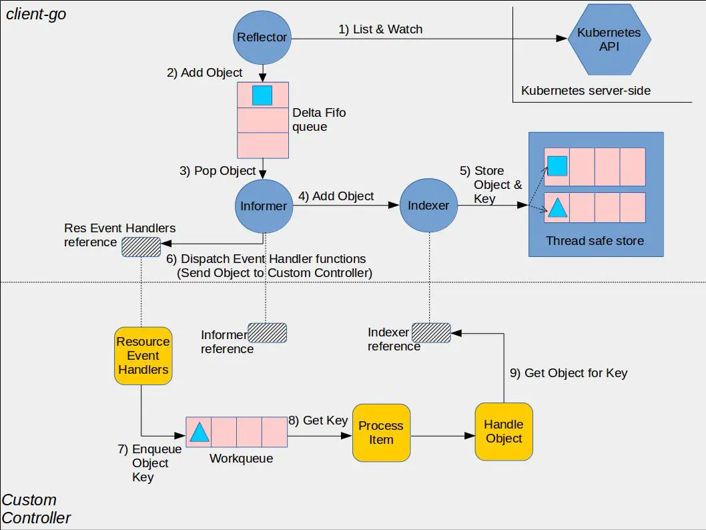

Informer机制的基本工作流程如下：

- client启动或与kube-apiserver出现连接中断再次Watch时，报”too old resource version”等错误后，通过Reflector组件的List操作，从kube-apiserver获取初始状态数据，随后通过Watch机制实时监听数据变化。
- 收到事件后添加到Delta FIFO队列，由Informer组件进行处理。
- Informer将delta FIFO队列中的事件转发给Indexer组件，Indexer组件将事件持久化存储在本地的缓存中。
- 控制器开发者可通过Informer组件注册Add、Update、Delete事件的回调函数。Informer组件收到事件后会回调业务函数，比如典型的控制器使用场景，一般是将各个事件添加到WorkQueue中，控制器的各个协调goroutine从队列取出消息，解析key，通过key从Informer机制维护的本地Cache中读取数据。

通过以上流程分析，你可以发现除了启动、连接中断等场景才会触发List操作，其他时候都是从本地Cache读取。

那连接中断等场景为什么触发client List操作呢？

#### Watch bookmark机制

要搞懂这个问题，你得了解kube-apiserver Watch特性的原理。

接下来我就和你介绍下Kubernetes的Watch特性。我们知道Kubernetes通过全局递增的Resource Version来实现增量数据同步逻辑，尽量避免连接中断等异常场景下client发起全量List同步操作。

那么在什么场景下会触发全量List同步操作呢？这就取决于client请求的Resource Version以及kube-apiserver中是否还保存了相关的历史版本数据。

在[08](https://time.geekbang.org/column/article/341060)Watch特性中，我和你提到实现历史版本数据存储两大核心机制，滑动窗口和MVCC。与etcd v3使用MVCC机制不一样的是，Kubernetes采用的是滑动窗口机制。

kube-apiserver的滑动窗口机制是如何实现的呢?

它通过为每个类型资源（Pod,Node等）维护一个cyclic buffer，来存储最近的一系列变更事件实现。

下面Kubernetes核心的watchCache结构体中的cache数组、startIndex、endIndex就是用来实现cyclic buffer的。滑动窗口中的第一个元素就是cache[startIndex%capacity]，最后一个元素则是cache[endIndex%capacity]。

```go
// watchCache is a "sliding window" (with a limited capacity) of objects
// observed from a watch.
type watchCache struct {
   sync.RWMutex

   // Condition on which lists are waiting for the fresh enough
   // resource version.
   cond *sync.Cond

   // Maximum size of history window.
   capacity int

   // upper bound of capacity since event cache has a dynamic size.
   upperBoundCapacity int

   // lower bound of capacity since event cache has a dynamic size.
   lowerBoundCapacity int

   // cache is used a cyclic buffer - its first element (with the smallest
   // resourceVersion) is defined by startIndex, its last element is defined
   // by endIndex (if cache is full it will be startIndex + capacity).
   // Both startIndex and endIndex can be greater than buffer capacity -
   // you should always apply modulo capacity to get an index in cache array.
   cache      []*watchCacheEvent
   startIndex int
   endIndex   int

   // store will effectively support LIST operation from the "end of cache
   // history" i.e. from the moment just after the newest cached watched event.
   // It is necessary to effectively allow clients to start watching at now.
   // NOTE: We assume that <store> is thread-safe.
   store cache.Indexer

   // ResourceVersion up to which the watchCache is propagated.
   resourceVersion uint64
}
```

下面我以Pod资源的历史事件滑动窗口为例，和你聊聊它在什么场景可能会触发client全量List同步操作。

如下图所示，kube-apiserver启动后，通过List机制，加载初始Pod状态数据，随后通过Watch机制监听最新Pod数据变化。当你不断对Pod资源进行增加、删除、修改后，携带新Resource Version（简称RV）的Pod事件就会不断被加入到cyclic buffer。假设cyclic buffer容量为100，RV1是最小的一个Watch事件的Resource Version，RV 100是最大的一个Watch事件的Resource Version。

当版本号为RV101的Pod事件到达时，RV1就会被淘汰，kube-apiserver维护的Pod最小版本号就变成了RV2。然而在Kubernetes集群中，不少组件都只关心cyclic buffer中与自己相关的事件。

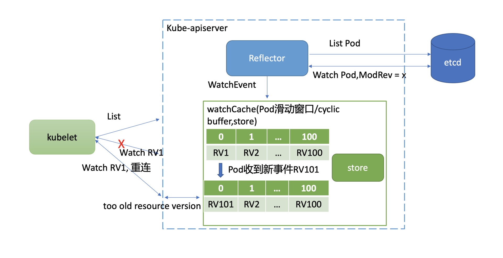

比如图中的kubelet只关注运行在自己节点上的Pod，假设只有RV1是它关心的Pod事件版本号，在未实现Watch bookmark特性之前，其他RV2到RV101的事件是不会推送给它的，因此它内存中维护的Resource Version依然是RV1。

若此kubelet随后与kube-apiserver连接出现异常，它将使用版本号RV1发起Watch重连操作。但是kube-apsierver cyclic buffer中的Pod最小版本号已是RV2，因此会返回”too old resource version”错误给client，client只能发起List操作，在获取到最新版本号后，才能重新进入监听逻辑。

那么我们能否定时将最新的版本号推送给各个client来解决以上问题呢?

是的，这就是Kubernetes的Watch bookmark机制核心思想。即使队列中无client关注的更新事件，Informer机制的Reflector组件中Resource Version也需要更新。

Watch bookmark机制通过新增一个bookmark类型的事件来实现的。kube-apiserver会通过定时器将各类型资源最新的Resource Version推送给kubelet等client，在client与kube-apiserver网络异常重连等场景，大大降低了client重建Watch的开销，减少了relist expensive request。

#### 更高效的Watch恢复机制

虽然Kubernetes社区通过Watch bookmark机制缓解了client与kube-apiserver重连等场景下可能导致的relist expensive request操作，然而在kube-apiserver重启、滚动更新时，它依然还是有可能导致大量的relist操作，这是为什么呢？ 如何进一步减少kube-apiserver重启场景下的List操作呢？

如下图所示，在kube-apiserver重启后，kubelet等client会立刻带上Resource Version发起重建Watch的请求。问题就在kube-apiserver重启后，watchCache中的cyclic buffer是空的，此时watchCache中的最小Resource Version(listResourceVersion)是etcd的最新全局版本号，也就是图中的RV200。

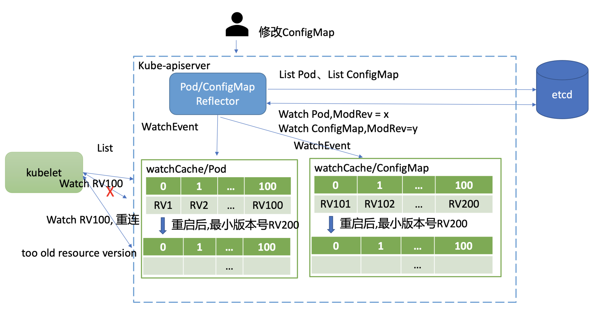

在不少场景下，client请求重建Watch的Resource Version是可能小于listResourceVersion的。

比如在上面的这个案例图中，集群内Pod稳定运行未发生变化，kubelet假设收到了最新的RV100事件。然而这个集群其他资源如ConfigMap，被管理员不断的修改，它就会导致导致etcd版本号新增，ConfigMap滑动窗口也会不断存储变更事件，从图中可以看到，它记录最大版本号为RV200。

因此kube-apiserver重启后，client请求重建Pod Watch的Resource Version是RV100，而Pod watchCache中的滑动窗口最小Resource Version是RV200。很显然，RV100不在Pod watchCache所维护的滑动窗口中，kube-apiserver就会返回”too old resource version”错误给client，client只能发起relist expensive request操作同步最新数据。

为了进一步降低kube-apiserver重启对client Watch中断的影响，Kubernetes在1.20版本中又进一步实现了[更高效的Watch恢复机制](https://github.com/kubernetes/enhancements/tree/master/keps/sig-api-machinery/1904-efficient-watch-resumption)。它通过etcd Watch机制的Notify特性，实现了将etcd最新的版本号定时推送给kube-apiserver。kube-apiserver在将其转换成ResourceVersion后，再通过bookmark机制推送给client，避免了kube-apiserver重启后client可能发起的List操作。

### 如何控制db size

分析完Kubernetes如何减少expensive request，我们再看看Kubernetes是如何控制db size的。

首先，我们知道Kubernetes的kubelet组件会每隔10秒上报一次心跳给kube-apiserver。

其次，Node资源对象因为包含若干个镜像、数据卷等信息，导致Node资源对象会较大，一次心跳消息可能高达15KB以上。

最后，etcd是基于COW(Copy-on-write)机制实现的MVCC数据库，每次修改都会产生新的key-value，若大量写入会导致db size持续增长。

早期Kubernetes集群由于以上原因，当节点数成千上万时，kubelet产生的大量写请求就较容易造成db大小达到配额，无法写入。

那么如何解决呢？

本质上还是Node资源对象大的问题。实际上我们需要更新的仅仅是Node资源对象的心跳状态，而在etcd中我们存储的是整个Node资源对象，并未将心跳状态拆分出来。

因此Kuberentes的解决方案就是将Node资源进行拆分，把心跳状态信息从Node对象中剥离出来，通过下面的Lease对象来描述它。

```rust
// Lease defines a lease concept.
type Lease struct {
   metav1.TypeMeta `json:",inline"`
   metav1.ObjectMeta `json:"metadata,omitempty" protobuf:"bytes,1,opt,name=metadata"`
   Spec LeaseSpec `json:"spec,omitempty" protobuf:"bytes,2,opt,name=spec"`
}

// LeaseSpec is a specification of a Lease.
type LeaseSpec struct {
   HolderIdentity *string `json:"holderIdentity,omitempty" protobuf:"bytes,1,opt,name=holderIdentity"`
   LeaseDurationSeconds *int32 `json:"leaseDurationSeconds,omitempty" protobuf:"varint,2,opt,name=leaseDurationSeconds"`
   AcquireTime *metav1.MicroTime `json:"acquireTime,omitempty" protobuf:"bytes,3,opt,name=acquireTime"`
   RenewTime *metav1.MicroTime `json:"renewTime,omitempty" protobuf:"bytes,4,opt,name=renewTime"`
   LeaseTransitions *int32 `json:"leaseTransitions,omitempty" protobuf:"varint,5,opt,name=leaseTransitions"`
}
```

因为Lease对象非常小，更新的代价远小于Node对象，所以这样显著降低了kube-apiserver的CPU开销、etcd db size，Kubernetes 1.14版本后已经默认启用Node心跳切换到Lease API。

### 如何优化key-value大小

最后，我们再看看Kubernetes是如何解决etcd key-value大小限制的。

在成千上万个节点的集群中，一个服务可能背后有上万个Pod。而服务对应的Endpoints资源含有大量的独立的endpoints信息，这会导致Endpoints资源大小达到etcd的value大小限制，etcd拒绝更新。

另外，kube-proxy等组件会实时监听Endpoints资源，一个endpoint变化就会产生较大的流量，导致kube-apiserver等组件流量超大、出现一系列性能瓶颈。

如何解决以上Endpoints资源过大的问题呢？

答案依然是拆分、化大为小。Kubernetes社区设计了EndpointSlice概念，每个EndpointSlice最大支持保存100个endpoints，成功解决了key-value过大、变更同步导致流量超大等一系列瓶颈。

### etcd优化

Kubernetes社区在解决大集群的挑战的同时，etcd社区也在不断优化、新增特性，提升etcd在Kubernetes场景下的稳定性和性能。这里我简单列举两个，一个是etcd并发读特性，一个是Watch特性的Notify机制。

#### 并发读特性

通过以上介绍的各种机制、策略，虽然Kubernetes能大大缓解expensive read request问题，但是它并不是从本质上来解决问题的。

为什么etcd无法支持大量的read expensive request呢？

除了我们一直强调的容易导致OOM、大流量导致丢包外，etcd根本性瓶颈是在etcd 3.4版本之前，expensive read request会长时间持有MVCC模块的buffer读锁RLock。而写请求执行完后，需升级锁至Lock，expensive request导致写事务阻塞在升级锁过程中，最终导致写请求超时。

为了解决此问题，etcd 3.4版本实现了并发读特性。核心解决方案是去掉了读写锁，每个读事务拥有一个buffer。在收到读请求创建读事务对象时，全量拷贝写事务维护的buffer到读事务buffer中。

通过并发读特性，显著降低了List Pod和CRD等expensive read request对写性能的影响，延时不再突增、抖动。

#### 改善Watch Notify机制

为了配合Kubernetes社区实现更高效的Watch恢复机制，etcd改善了Watch Notify机制，早期Notify消息发送间隔是固定的10分钟。

在etcd 3.4.11版本中，新增了–experimental-watch-progress-notify-interval参数使Notify间隔时间可配置，最小支持为100ms，满足了Kubernetes业务场景的诉求。

最后，你要注意的是，默认通过clientv3 Watch API创建的watcher是不会开启此特性的。你需要创建Watcher的时候，设置clientv3.WithProgressNotify选项，这样etcd server就会定时发送提醒消息给client，消息中就会携带etcd当前最新的全局版本号。

### 小结2

最后我们来小结下今天的内容。

首先我和你剖析了大集群核心问题，即expensive request、db size、key-value大小。

针对expensive request，我分别为你阐述了Kubernetes的分页机制、资源按namespace拆分部署策略、核心的Informer机制、优化client与kube-apiserver连接异常后的Watch恢复效率的bookmark机制、以及进一步优化kube-apiserver重建场景下Watch恢复效率的Notify机制。从这个问题优化思路中我们可以看到，优化无止境。从大方向到边界问题，Kubernetes社区一步步将expensive request降低到极致。

针对db size和key-value大小，Kubernetes社区的解决方案核心思想是拆分，通过Lease和EndpointSlice资源对象成功解决了大规模集群过程遇到db size和key-value瓶颈。

最后etcd社区也在努力提升、优化相关特性，etcd 3.4版本中的并发读特性和可配置化的Watch Notify间隔时间就是最典型的案例。自从etcd被redhat捐赠给CNCF后，etcd核心就围绕着Kubernetes社区展开工作，努力打造更快、更稳的etcd

## 分布式锁

我们经常会遇到各种场景要求对共享资源进行互斥操作，否则整个系统的数据一致性就会出现问题。典型场景如商品库存操作、Kubernertes调度器为Pod分配运行的Node。

那要如何实现对共享资源进行互斥操作呢？

锁就是其中一个非常通用的解决方案。在单节点多线程环境，你使用本地的互斥锁就可以完成资源的互斥操作。然而单节点存在单点故障，为了保证服务高可用，你需要多节点部署。在多节点部署的分布式架构中，你就需要使用分布式锁来解决资源互斥操作了。

但是为什么有的业务使用了分布式锁还会出现各种严重超卖事故呢？分布式锁的实现和使用过程需要注意什么？

今天，我就和你聊聊分布式锁背后的故事，我将通过一个茅台超卖的案例，为你介绍基于Redis实现的分布锁优缺点，引出分布式锁的核心要素，对比分布式锁的几种业界典型实现方案，深入剖析etcd分布式锁的实现。

希望通过这节课，让你了解etcd分布式锁的应用场景、核心原理，在业务开发过程中，优雅、合理的使用分布式锁去解决各类资源互斥、并发操作问题。

### 从茅台超卖案例看分布式锁要素

首先我们从去年一个因Redis分布式锁实现问题导致[茅台超卖案例](https://juejin.cn/post/6854573212831842311)说起，在这个网友分享的真实案例中，因茅台的稀缺性，事件最终定级为P0级生产事故，后果影响严重。

那么它是如何导致超卖的呢？

首先和你简单介绍下此案例中的Redis简易分布式锁实现方案，它使用了Redis SET命令来实现。

```sql
SET key value [EX seconds|PX milliseconds|EXAT timestamp|PXAT milliseconds-timestamp|KEEPTTL] [NX|XX] 
[GET]
```

简单给你介绍下SET命令重点参数含义：

- `EX` 设置过期时间，单位秒；
- `NX` 当key不存在的时候，才设置key；
- `XX` 当key存在的时候，才设置key。

此业务就是基于Set key value EX 10 NX命令来实现的分布式锁，并通过JAVA的try-finally语句，执行Del key语句来释放锁，简易流程如下：

```vbnet
# 对资源key加锁，key不存在时创建，并且设置，10秒自动过期
SET key value EX 10 NX
业务逻辑流程1，校验用户身份
业务逻辑流程2，查询并校验库存(get and compare)
业务逻辑流程3，库存>0，扣减库存(Decr stock)，生成秒杀茅台订单

# 释放锁
Del key
```

以上流程中其实存在以下思考点:

- NX参数有什么作用?
- 为什么需要原子的设置key及过期时间？
- 为什么基于Set key value EX 10 NX命令还出现了超卖呢?
- 为什么大家都比较喜欢使用Redis作为分布式锁实现？

首先来看第一个问题，NX参数的作用。NX参数是为了保证当分布式锁不存在时，只有一个client能写入此key成功，获取到此锁。我们使用分布式锁的目的就是希望在高并发系统中，有一种互斥机制来防止彼此相互干扰，保证数据的一致性。

**因此分布式锁的第一核心要素就是互斥性、安全性。在同一时间内，不允许多个client同时获得锁。**

再看第二个问题，假设我们未设置key自动过期时间，在Set key value NX后，如果程序crash或者发生网络分区后无法与Redis节点通信，毫无疑问其他client将永远无法获得锁。这将导致死锁，服务出现中断。

有的同学意识到这个问题后，使用如下SETNX和EXPIRE命令去设置key和过期时间，这也是不正确的，因为你无法保证SETNX和EXPIRE命令的原子性。

```vbnet
# 对资源key加锁，key不存在时创建
SETNX key value
# 设置KEY过期时间
EXPIRE key 10
业务逻辑流程

# 释放锁
Del key
```

**这就是分布式锁第二个核心要素，活性。在实现分布式锁的过程中要考虑到client可能会出现crash或者网络分区，你需要原子申请分布式锁及设置锁的自动过期时间，通过过期、超时等机制自动释放锁，避免出现死锁，导致业务中断。**

再看第三个问题，为什么使用了Set key value EX 10 NX命令，还出现了超卖呢？

原来是抢购活动开始后，加锁逻辑中的业务流程1访问的用户身份服务出现了高负载，导致阻塞在校验用户身份流程中(超时30秒)，然而锁10秒后就自动过期了，因此其他client能获取到锁。关键是阻塞的请求执行完后，它又把其他client的锁释放掉了，导致进入一个恶性循环。

因此申请锁时，写入的value应确保唯一性（随机值等）。client在释放锁时，应通过Lua脚本原子校验此锁的value与自己写入的value一致，若一致才能执行释放工作。

更关键的是库存校验是通过get and compare方式，它压根就无法防止超卖。正确的解决方案应该是通过LUA脚本实现Redis比较库存、扣减库存操作的原子性（或者在每次只能抢购一个的情况下，通过判断[Redis Decr命令](https://redis.io/commands/DECR)的返回值即可。此命令会返回扣减后的最新库存，若小于0则表示超卖）。

**从这个问题中我们可以看到，分布式锁实现具备一定的复杂度，它不仅依赖存储服务提供的核心机制，同时依赖业务领域的实现。无论是遭遇高负载、还是宕机、网络分区等故障，都需确保锁的互斥性、安全性，否则就会出现严重的超卖生产事故。**

再看最后一个问题，为什么大家都比较喜欢使用Redis做分布式锁的实现呢?

考虑到在秒杀等业务场景上存在大量的瞬间、高并发请求，加锁与释放锁的过程应是高性能、高可用的。而Redis核心优点就是快、简单，是随处可见的基础设施，部署、使用也及其方便，因此广受开发者欢迎。

**这就是分布式锁第三个核心要素，高性能、高可用。加锁、释放锁的过程性能开销要尽量低，同时要保证高可用，确保业务不会出现中断。**

那么除了以上案例中人为实现问题导致的锁不安全因素外，基于Redis实现的以上分布式锁还有哪些安全性问题呢？

### Redis分布式锁问题

我们从茅台超卖案例中为你总结出的分布式核心要素（互斥性、安全性、活性、高可用、高性能）说起。

首先，如果我们的分布式锁跑在单节点的Redis Master节点上，那么它就存在单点故障，无法保证分布式锁的高可用。

于是我们需要一个主备版的Redis服务，至少具备一个Slave节点。

我们又知道Redis是基于主备异步复制协议实现的Master-Slave数据同步，如下图所示，若client A执行SET key value EX 10 NX命令，redis-server返回给client A成功后，Redis Master节点突然出现crash等异常，这时候Redis Slave节点还未收到此命令的同步。

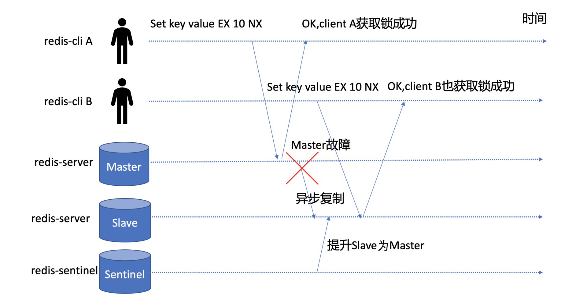

若你部署了Redis Sentinel等主备切换服务，那么它就会以Slave节点提升为主，此时Slave节点因并未执行SET key value EX 10 NX命令，因此它收到client B发起的加锁的此命令后，它也会返回成功给client。

那么在同一时刻，集群就出现了两个client同时获得锁，分布式锁的互斥性、安全性就被破坏了。

除了主备切换可能会导致基于Redis实现的分布式锁出现安全性问题，在发生网络分区等场景下也可能会导致出现脑裂，Redis集群出现多个Master，进而也会导致多个client同时获得锁。

如下图所示，Master节点在可用区1，Slave节点在可用区2，当可用区1和可用区2发生网络分区后，部署在可用区2的Redis Sentinel服务就会将可用区2的Slave提升为Master，而此时可用区1的Master也在对外提供服务。因此集群就出现了脑裂，出现了两个Master，都可对外提供分布式锁申请与释放服务，分布式锁的互斥性被严重破坏。

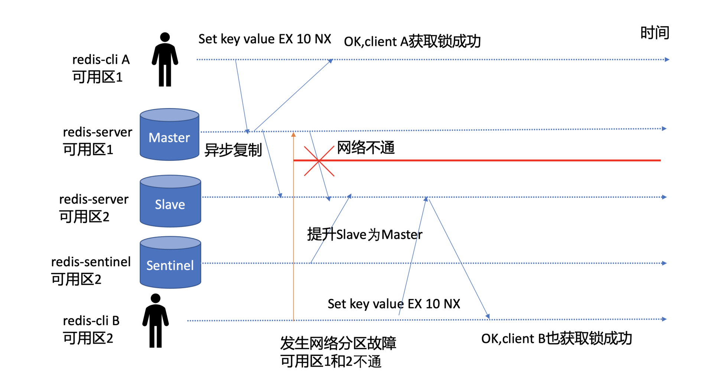

**主备切换、脑裂是Redis分布式锁的两个典型不安全的因素，本质原因是Redis为了满足高性能，采用了主备异步复制协议，同时也与负责主备切换的Redis Sentinel服务是否合理部署有关。**

有没有其他方案解决呢？

当然有，Redis作者为了解决SET key value [EX] 10 [NX]命令实现分布式锁不安全的问题，提出了[RedLock算法](https://redis.io/topics/distlock)。它是基于多个独立的Redis Master节点的一种实现（一般为5）。client依次向各个节点申请锁，若能从多数个节点中申请锁成功并满足一些条件限制，那么client就能获取锁成功。

它通过独立的N个Master节点，避免了使用主备异步复制协议的缺陷，只要多数Redis节点正常就能正常工作，显著提升了分布式锁的安全性、可用性。

但是，它的实现建立在一个不安全的系统模型上的，它依赖系统时间，当时钟发生跳跃时，也可能会出现安全性问题。你要有兴趣的话，可以详细阅读下分布式存储专家Martin对[RedLock的分析文章](https://martin.kleppmann.com/2016/02/08/how-to-do-distributed-locking.html)，Redis作者的也专门写了[一篇文章进行了反驳](http://antirez.com/news/101)。

### 分布式锁常见实现方案

了解完Redis分布式锁的一系列问题和实现方案后，我们再看看还有哪些典型的分布式锁实现。

除了Redis分布式锁，其他使用最广的应该是ZooKeeper分布式锁和etcd分布式锁。

ZooKeeper也是一个典型的分布式元数据存储服务，它的分布式锁实现基于ZooKeeper的临时节点和顺序特性。

首先什么是临时节点呢？

临时节点具备数据自动删除的功能。当client与ZooKeeper连接和session断掉时，相应的临时节点就会被删除。

其次ZooKeeper也提供了Watch特性可监听key的数据变化。

[使用Zookeeper加锁的伪代码如下](https://www.usenix.org/legacy/event/atc10/tech/full_papers/Hunt.pdf)：

```csharp
Lock
1 n = create(l + “/lock-”, EPHEMERAL|SEQUENTIAL)
2 C = getChildren(l, false)
3 if n is lowest znode in C, exit
4 p = znode in C ordered just before n
5 if exists(p, true) wait for watch event
6 goto 2
Unlock
1 delete(n)
```

接下来我重点给你介绍一下基于etcd的分布式锁实现。

### etcd分布式锁实现

那么基于etcd实现的分布式锁是如何确保安全性、互斥性、活性的呢？

#### 事务与锁的安全性

从Redis案例中我们可以看到，加锁的过程需要确保安全性、互斥性。比如，当key不存在时才能创建，否则查询相关key信息，而etcd提供的事务能力正好可以满足我们的诉求。

正如我在[09](https://time.geekbang.org/column/article/341935)中给你介绍的事务特性，它由IF语句、Then语句、Else语句组成。其中在IF语句中，支持比较key的是修改版本号mod_revision和创建版本号create_revision。

在分布式锁场景，你就可以通过key的创建版本号create_revision来检查key是否已存在，因为一个key不存在的话，它的create_revision版本号就是0。

若create_revision是0，你就可发起put操作创建相关key，具体代码如下:

```css
txn := client.Txn(ctx).If(v3.Compare(v3.CreateRevision(k), 
"=", 0))
```

你要注意的是，实现分布式锁的方案有多种，比如你可以通过client是否成功创建一个固定的key，来判断此client是否获得锁，你也可以通过多个client创建prefix相同，名称不一样的key，哪个key的revision最小，最终就是它获得锁。至于谁优谁劣，我作为思考题的一部分，留给大家一起讨论。

相比Redis基于主备异步复制导致锁的安全性问题，etcd是基于Raft共识算法实现的，一个写请求需要经过集群多数节点确认。因此一旦分布式锁申请返回给client成功后，它一定是持久化到了集群多数节点上，不会出现Redis主备异步复制可能导致丢数据的问题，具备更高的安全性。

#### Lease与锁的活性

通过事务实现原子的检查key是否存在、创建key后，我们确保了分布式锁的安全性、互斥性。那么etcd是如何确保锁的活性呢? 也就是发生任何故障，都可避免出现死锁呢？

正如在[06](https://time.geekbang.org/column/article/339337)租约特性中和你介绍的，Lease就是一种活性检测机制，它提供了检测各个客户端存活的能力。你的业务client需定期向etcd服务发送”特殊心跳”汇报健康状态，若你未正常发送心跳，并超过和etcd服务约定的最大存活时间后，就会被etcd服务移除此Lease和其关联的数据。

通过Lease机制就优雅地解决了client出现crash故障、client与etcd集群网络出现隔离等各类故障场景下的死锁问题。一旦超过Lease TTL，它就能自动被释放，确保了其他client在TTL过期后能正常申请锁，保障了业务的可用性。

具体代码如下:

```css
txn := client.Txn(ctx).If(v3.Compare(v3.CreateRevision(k), "=", 0))
txn = txn.Then(v3.OpPut(k, val, v3.WithLease(s.Lease())))
txn = txn.Else(v3.OpGet(k))
resp, err := txn.Commit()
if err != nil {
    return err
}
```

#### Watch与锁的可用性

当一个持有锁的client crash故障后，其他client如何快速感知到此锁失效了，快速获得锁呢，最大程度降低锁的不可用时间呢？

答案是Watch特性。正如在08 Watch特性中和你介绍的，Watch提供了高效的数据监听能力。当其他client收到Watch Delete事件后，就可快速判断自己是否有资格获得锁，极大减少了锁的不可用时间。

具体代码如下所示：

```go
var wr v3.WatchResponse
wch := client.Watch(cctx, key, v3.WithRev(rev))
for wr = range wch {
   for _, ev := range wr.Events {
      if ev.Type == mvccpb.DELETE {
         return nil
      }
   }
}
```

#### etcd自带的concurrency包

为了帮助你简化分布式锁、分布式选举、分布式事务的实现，etcd社区提供了一个名为concurrency包帮助你更简单、正确地使用分布式锁、分布式选举。

下面我简单为你介绍下分布式锁[concurrency](https://github.com/etcd-io/etcd/tree/v3.4.9/clientv3/concurrency)包的使用和实现，它的使用非常简单，如下代码所示，核心流程如下：

- 首先通过concurrency.NewSession方法创建Session，本质是创建了一个TTL为10的Lease。
- 其次得到session对象后，通过concurrency.NewMutex创建了一个mutex对象，包含Lease、key prefix等信息。
- 然后通过mutex对象的Lock方法尝试获取锁。
- 最后使用结束，可通过mutex对象的Unlock方法释放锁。

```go
cli, err := clientv3.New(clientv3.Config{Endpoints: endpoints})
if err != nil {
   log.Fatal(err)
}
defer cli.Close()
// create two separate sessions for lock competition
s1, err := concurrency.NewSession(cli, concurrency.WithTTL(10))
if err != nil {
   log.Fatal(err)
}
defer s1.Close()
m1 := concurrency.NewMutex(s1, "/my-lock/")
// acquire lock for s1
if err := m1.Lock(context.TODO()); err != nil {
   log.Fatal(err)
}
fmt.Println("acquired lock for s1")
if err := m1.Unlock(context.TODO()); err != nil {
   log.Fatal(err)
}
fmt.Println("released lock for s1")
```

那么mutex对象的Lock方法是如何加锁的呢？

核心还是使用了我们上面介绍的事务和Lease特性，当CreateRevision为0时，它会创建一个prefix为/my-lock的key（ /my-lock + LeaseID)，并获取到/my-lock prefix下面最早创建的一个key（revision最小），分布式锁最终是由写入此key的client获得，其他client则进入等待模式。

详细代码如下：

```go
m.myKey = fmt.Sprintf("%s%x", m.pfx, s.Lease())
cmp := v3.Compare(v3.CreateRevision(m.myKey), "=", 0)
// put self in lock waiters via myKey; oldest waiter holds lock
put := v3.OpPut(m.myKey, "", v3.WithLease(s.Lease()))
// reuse key in case this session already holds the lock
get := v3.OpGet(m.myKey)
// fetch current holder to complete uncontended path with only one RPC
getOwner := v3.OpGet(m.pfx, v3.WithFirstCreate()...)
resp, err := client.Txn(ctx).If(cmp).Then(put, getOwner).Else(get, getOwner).Commit()
if err != nil {
   return err
}
```

那未获得锁的client是如何等待的呢?

答案是通过Watch机制各自监听prefix相同，revision比自己小的key，因为只有revision比自己小的key释放锁，我才能有机会，获得锁，如下代码所示，其中waitDelete会使用我们上面的介绍的Watch去监听比自己小的key，详细代码可参考[concurrency mutex](https://github.com/etcd-io/etcd/blob/v3.4.9/clientv3/concurrency/mutex.go)的实现。

```go
// wait for deletion revisions prior to myKey
hdr, werr := waitDeletes(ctx, client, m.pfx, m.myRev-1)
// release lock key if wait failed
if werr != nil {
   m.Unlock(client.Ctx())
} else {
   m.hdr = hdr
}
```

### 小结

最后我们来小结下今天的内容。

今天我通过一个Redis分布式锁实现问题——茅台超卖案例，给你介绍了分布式锁的三个主要核心要素，它们分别如下：

- 安全性、互斥性。在同一时间内，不允许多个client同时获得锁。
- 活性。无论client出现crash还是遭遇网络分区，你都需要确保任意故障场景下，都不会出现死锁，常用的解决方案是超时和自动过期机制。
- 高可用、高性能。加锁、释放锁的过程性能开销要尽量低，同时要保证高可用，避免单点故障。

随后我通过这个案例，继续和你分析了Redis SET命令创建分布式锁的安全性问题。单Redis Master节点存在单点故障，一主多备Redis实例又因为Redis主备异步复制，当Master节点发生crash时，可能会导致同时多个client持有分布式锁，违反了锁的安全性问题。

为了优化以上问题，Redis作者提出了RedLock分布式锁，它基于多个独立的Redis Master节点工作，只要一半以上节点存活就能正常工作，同时不依赖Redis主备异步复制，具有良好的安全性、高可用性。然而它的实现依赖于系统时间，当发生时钟跳变的时候，也会出现安全性问题。

最后我和你重点介绍了etcd的分布式锁实现过程中的一些技术点。它通过etcd事务机制，校验CreateRevision为0才能写入相关key。若多个client同时申请锁，则client通过比较各个key的revision大小，判断是否获得锁，确保了锁的安全性、互斥性。通过Lease机制确保了锁的活性，无论client发生crash还是网络分区，都能保证不会出现死锁。通过Watch机制使其他client能快速感知到原client持有的锁已释放，提升了锁的可用性。最重要的是etcd是基于Raft协议实现的高可靠、强一致存储，正常情况下，不存在Redis主备异步复制协议导致的数据丢失问题。

## APISIX

从简单的数据库账号密码配置，到[confd](https://github.com/kelseyhightower/confd)支持以etcd为后端存储的本地配置及模板管理，再到[Apache APISIX](https://github.com/apache/apisix)等API Gateway项目使用etcd存储服务配置、路由信息等，最后到Kubernetes更实现了Secret和ConfigMap资源对象来解决配置管理的问题。

那么它们是如何实现实时、动态调整服务配置而不需要重启相关服务的呢？

今天我就和你聊聊etcd在配置和服务发现场景中的应用。我将以开源项目Apache APISIX为例，为你分析服务发现的原理，带你了解etcd的key-value模型，Watch机制，鉴权机制，Lease特性，事务特性在其中的应用。

希望通过这节课，让你了解etcd在配置系统和服务发现场景工作原理，帮助你选型适合业务场景的配置系统、服务发现组件。同时，在使用Apache APISIX等开源项目过程中遇到etcd相关问题时，你能独立排查、分析，并向社区提交issue和PR解决。

### 服务发现

首先和你聊聊服务发现，服务发现是指什么？为什么需要它呢?

为了搞懂这个问题，我首先和你分享下程序部署架构的演进。

#### 单体架构

在早期软件开发时使用的是单体架构，也就是所有功能耦合在同一个项目中，统一构建、测试、发布。单体架构在项目刚启动的时候，架构简单、开发效率高，比较容易部署、测试。但是随着项目不断增大，它具有若干缺点，比如：

- 所有功能耦合在同一个项目中，修复一个小Bug就需要发布整个大工程项目，增大引入问题风险。同时随着开发人员增多、单体项目的代码增长、各模块堆砌在一起、代码质量参差不齐，内部复杂度会越来越高，可维护性差。
- 无法按需针对仅出现瓶颈的功能模块进行弹性扩容，只能作为一个整体继续扩展，因此扩展性较差。
- 一旦单体应用宕机，将导致所有服务不可用，因此可用性较差。

#### 分布式及微服务架构

如何解决以上痛点呢？

当然是将单体应用进行拆分，大而化小。如何拆分呢？ 这里我就以一个我曾经参与重构建设的电商系统为案例给你分析一下。在一个单体架构中，完整的电商系统应包括如下模块：

- 商城系统，负责用户登录、查看及搜索商品、购物车商品管理、优惠券管理、订单管理、支付等功能。
- 物流及仓储系统，根据用户订单，进行发货、退货、换货等一系列仓储、物流管理。
- 其他客服系统、客户管理系统等。

因此在分布式架构中，你可以按整体功能，将单体应用垂直拆分成以上三大功能模块，各个功能模块可以选择不同的技术栈实现，按需弹性扩缩容，如下图所示。

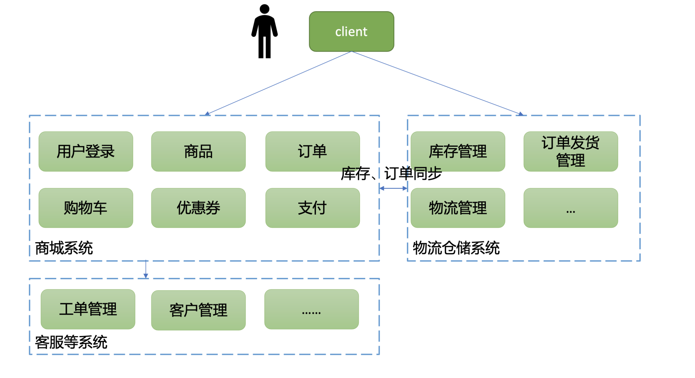

那什么又是微服务架构呢？

它是对各个功能模块进行更细立度的拆分，比如商城系统模块可以拆分成：

- 用户鉴权模块；
- 商品模块；
- 购物车模块；
- 优惠券模块；
- 支付模块；
- ……

在微服务架构中，每个模块职责更单一、独立部署、开发迭代快，如下图所示。

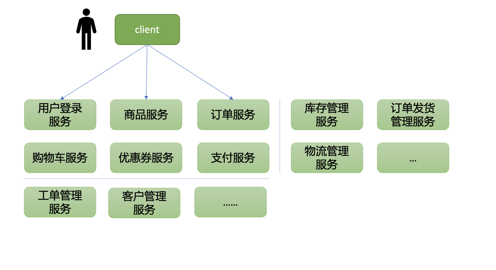

那么在分布式及微服务架构中，各个模块之间如何及时知道对方网络地址与端口、协议，进行接口调用呢？

### 为什么需要服务发现中间件?

其实这个知道的过程，就是服务发现。在早期的时候我们往往通过硬编码、配置文件声明各个依赖模块的网络地址、端口，然而这种方式在分布式及微服务架构中，其运维效率、服务可用性是远远不够的。

那么我们能否实现通过一个特殊服务就查询到各个服务的后端部署地址呢？ 各服务启动的时候，就自动将IP和Port、协议等信息注册到特殊服务上，当某服务出现异常的时候，特殊服务就自动删除异常实例信息？

是的，当然可以，这个特殊服务就是注册中心服务，你可以基于etcd、ZooKeeper、consul等实现。

### etcd服务发现原理

那么如何基于etcd实现服务发现呢?

下面我给出了一个通用的服务发现原理架构图，通过此图，为你介绍下服务发现的基本原理。详细如下：

- 整体上分为四层，client层、proxy层(可选)、业务server、etcd存储层组成。引入proxy层的原因是使client更轻、逻辑更简单，无需直接访问存储层，同时可通过proxy层支持各种协议。
- client层通过负载均衡访问proxy组件。proxy组件启动的时候，通过etcd的Range RPC方法从etcd读取初始化服务配置数据，随后通过Watch接口持续监听后端业务server扩缩容变化，实时修改路由。
- proxy组件收到client的请求后，它根据从etcd读取到的对应服务的路由配置、负载均衡算法（比如Round-robin）转发到对应的业务server。
- 业务server启动的时候，通过etcd的写接口Txn/Put等，注册自身地址信息、协议到高可用的etcd集群上。业务server缩容、故障时，对应的key应能自动从etcd集群删除，因此相关key需要关联lease信息，设置一个合理的TTL，并定时发送keepalive请求给Leader续租，以防止租约及key被淘汰。

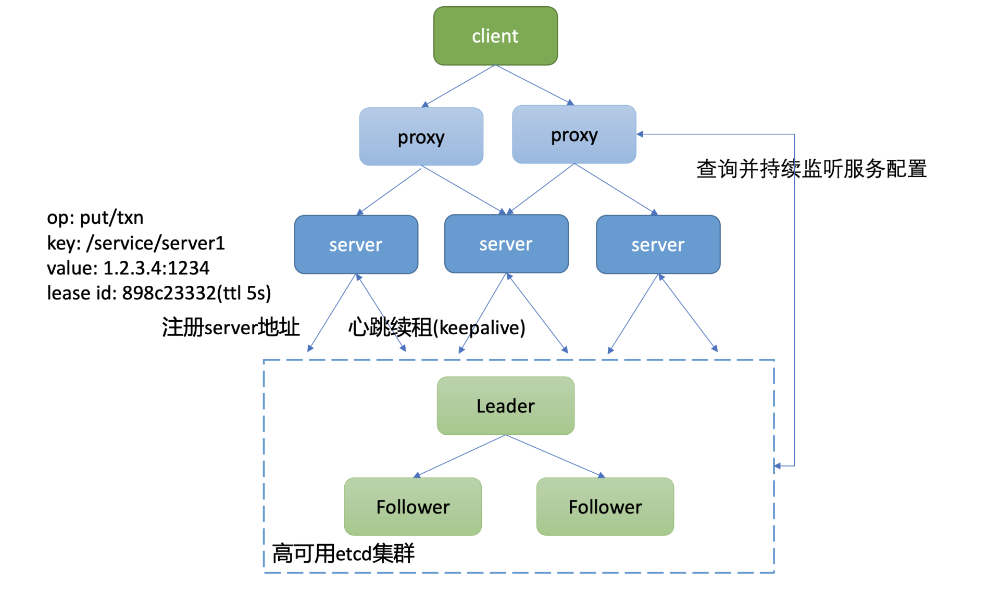

当然，在分布式及微服务架构中，我们面对的问题不仅仅是服务发现，还包括如下痛点：

- 限速；
- 鉴权；
- 安全；
- 日志；
- 监控；
- 丰富的发布策略；
- 链路追踪；
- ……

为了解决以上痛点，各大公司及社区开发者推出了大量的开源项目。这里我就以国内开发者广泛使用的Apache APISIX项目为例，为你分析etcd在其中的应用，了解下它是怎么玩转服务发现的。

### Apache APISIX原理

Apache APISIX它具备哪些功能呢？

它的本质是一个无状态、高性能、实时、动态、可水平扩展的API网关。核心原理就是基于你配置的服务信息、路由规则等信息，将收到的请求通过一系列规则后，正确转发给后端的服务。

Apache APISIX其实就是上面服务发现原理架构图中的proxy组件，如下图红色虚线框所示。

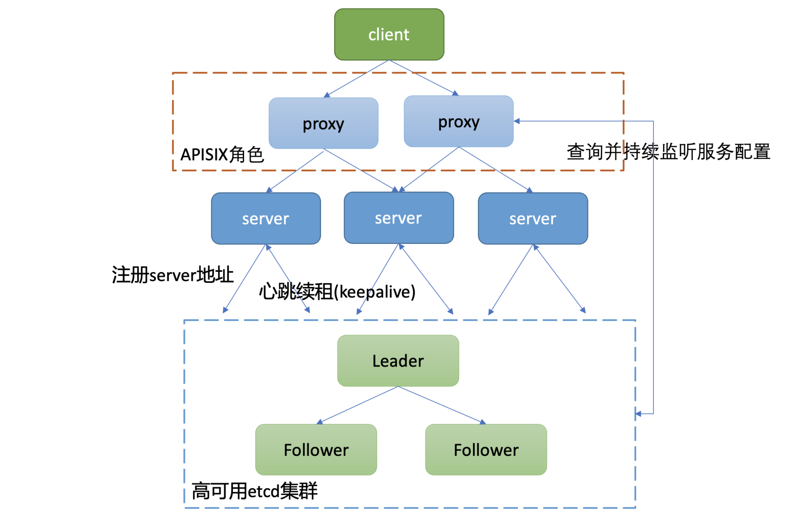

Apache APISIX详细架构图如下（[引用自社区项目文档](https://github.com/apache/apisix)）。从图中你可以看到，它由控制面和数据面组成。

控制面顾名思义，就是你通过Admin API下发服务、路由、安全配置的操作。控制面默认的服务发现存储是etcd，当然也支持consul、nacos等。

你如果没有使用过Apache APISIX的话，可以参考下这个[example](https://github.com/apache/apisix-docker/tree/master/example)，快速、直观的了解下Apache APISIX是如何通过Admin API下发服务和路由配置的。

数据面是在实现基于服务路由信息数据转发的基础上，提供了限速、鉴权、安全、日志等一系列功能，也就是解决了我们上面提的分布式及微服务架构中的典型痛点。

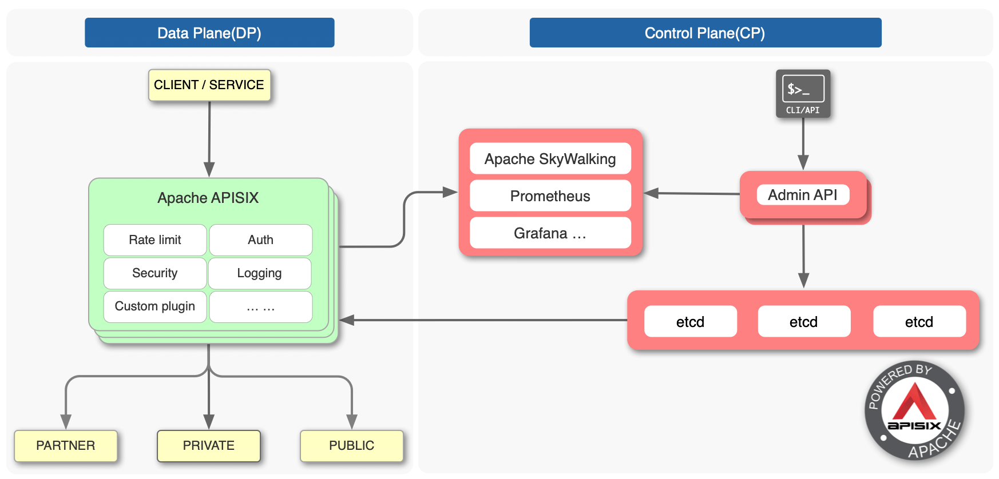

那么当我们通过控制面API新增一个服务时，Apache APISIX是是如何实现实时、动态调整服务配置，而不需要重启网关服务的呢？

下面，我就和你聊聊etcd在Apache APISIX项目中的应用。

### etcd在Apache APISIX中的应用

在搞懂这个问题之前，我们先看看Apache APISIX在etcd中，都存储了哪些数据呢？它的数据存储格式是怎样的？

#### 数据存储格式

下面我参考Apache APISIX的[example](https://github.com/apache/apisix-docker/tree/master/example)案例（apisix:2.3），通过Admin API新增了两个服务、路由规则后，执行如下查看etcd所有key的命令：

```sql
etcdctl get "" --prefix --keys-only
```

etcd输出结果如下：

```javascript
/apisix/consumers/
/apisix/data_plane/server_info/f7285805-73e9-4ce4-acc6-a38d619afdc3
/apisix/global_rules/
/apisix/node_status/
/apisix/plugin_metadata/
/apisix/plugins
/apisix/plugins/
/apisix/proto/
/apisix/routes/
/apisix/routes/12
/apisix/routes/22
/apisix/services/
/apisix/services/1
/apisix/services/2
/apisix/ssl/
/apisix/ssl/1
/apisix/ssl/2
/apisix/stream_routes/
/apisix/upstreams/
```

然后我们继续通过etcdctl get命令查看下services都存储了哪些信息呢？

```ruby
root@e9d3b477ca1f:/opt/bitnami/etcd# etcdctl get /apisix/services --prefix
/apisix/services/
init_dir
/apisix/services/1
{"update_time":1614293352,"create_time":1614293352,"upstream":{"type":"roundrobin","nodes":{"172.18.5.12:80":1},"hash_on":"vars","scheme":"http","pass_host":"pass"},"id":"1"}
/apisix/services/2
{"update_time":1614293361,"create_time":1614293361,"upstream":
{"type":"roundrobin","nodes":{"172.18.5.13:80":1},"hash_on":"vars","scheme":"http","pass_host":"pass"},"id":"2"}
```

从中我们可以总结出如下信息：

- Apache APSIX 2.x系列版本使用的是etcd3。
- 服务、路由、ssl、插件等配置存储格式前缀是/apisix + “/” + 功能特性类型（routes/services/ssl等），我们通过Admin API添加的路由、服务等配置就保存在相应的前缀下。
- 路由和服务配置的value是个Json对象，其中服务对象包含了id、负载均衡算法、后端节点、协议等信息。

了解完Apache APISIX在etcd中的数据存储格式后，那么它是如何动态、近乎实时地感知到服务配置变化的呢？

#### Watch机制的应用

与Kubernetes一样，它们都是通过etcd的**Watch机制**来实现的。

Apache APISIX在启动的时候，首先会通过Range操作获取网关的配置、路由等信息，随后就通过Watch机制，获取增量变化事件。

使用Watch机制最容易犯错的地方是什么呢？

答案是不处理Watch返回的相关错误信息，比如已压缩ErrCompacted错误。Apache APISIX项目在从etcd v2中切换到etcd v3早期的时候，同样也犯了这个错误。

去年某日收到小伙伴求助，说使用Apache APISIX后，获取不到新的服务配置了，是不是etcd出什么Bug了？

经过一番交流和查看日志，发现原来是Apache APISIX未处理ErrCompacted错误导致的。根据我们[07](https://time.geekbang.org/column/article/340226)Watch原理的介绍，当你请求Watch的版本号已被etcd压缩后，etcd就会取消这个watcher，这时你需要重建watcher，才能继续监听到最新数据变化事件。

查清楚问题后，小伙伴向社区提交了issue反馈，随后Apache APISIX相关同学通过[PR 2687](https://github.com/apache/apisix/pull/2687)修复了此问题，更多信息你可参考Apache APISIX访问etcd[相关实现代码文件](https://github.com/apache/apisix/blob/v2.3/apisix/core/etcd.lua)。

#### 鉴权机制的应用

除了Watch机制，Apache APISIX项目还使用了鉴权，毕竟配置网关是个高危操作，那它是如何使用etcd鉴权机制的呢？ **etcd鉴权机制**中最容易踩的坑是什么呢？

答案是不复用client和鉴权token，频繁发起Authenticate操作，导致etcd高负载。正如我在[17](https://time.geekbang.org/column/article/346471)和你介绍的，一个8核32G的高配节点在100个连接时，Authenticate QPS仅为8。可想而知，你如果不复用token，那么出问题就很自然不过了。

Apache APISIX是否也踩了这个坑呢？

Apache APISIX是基于Lua构建的，使用的是[lua-resty-etcd](https://github.com/api7/lua-resty-etcd/blob/master/lib/resty/etcd/v3.lua)这个项目访问etcd，从相关[issue](https://github.com/apache/apisix/issues/2899)反馈看，的确也踩了这个坑。社区用户反馈后，随后通过复用client、更完善的token复用机制解决了Authenticate的性能瓶颈，详细信息你可参考[PR 2932](https://github.com/apache/apisix/pull/2932)、[PR 100](https://github.com/api7/lua-resty-etcd/pull/100)。

除了以上介绍的Watch机制、鉴权机制，Apache APISIX还使用了etcd的Lease特性和事务接口。

#### Lease特性的应用

为什么Apache APISIX项目需要Lease特性呢？

服务发现的核心工作原理是服务启动的时候将地址信息登录到注册中心，服务异常时自动从注册中心删除。

这是不是跟我们前面[05](https://time.geekbang.org/column/article/338524)节介绍的应用场景很匹配呢？

没错，Apache APISIX通过etcd v2的TTL特性、etcd v3的Lease特性来实现类似的效果，它提供的增加服务路由API，支持设置TTL属性，如下面所示：

```php
# Create a route expires after 60 seconds, then it's deleted automatically
$ curl http://127.0.0.1:9080/apisix/admin/routes/2?ttl=60 -H 'X-API-KEY: edd1c9f034335f136f87ad84b625c8f1' -X PUT -i -d '
{
    "uri": "/aa/index.html",
    "upstream": {
        "type": "roundrobin",
        "nodes": {
            "39.97.63.215:80": 1
        }
    }
}'
```

当一个路由设置非0 TTL后，Apache APISIX就会为它创建Lease，关联key，相关代码如下：

```lua
-- lease substitute ttl in v3
local res, err
if ttl then
    local data, grant_err = etcd_cli:grant(tonumber(ttl))
    if not data then
        return nil, grant_err
    end
    res, err = etcd_cli:set(prefix .. key, value, {prev_kv = true, lease = data.body.ID})
else
    res, err = etcd_cli:set(prefix .. key, value, {prev_kv = true})
end
```

#### 事务特性的应用

介绍完Lease特性在Apache APISIX项目中的应用后，我们再来思考两个问题。为什么它还依赖etcd的事务特性呢？简单的执行put接口有什么问题？

答案是它跟Kubernetes是一样的使用目的。使用事务是为了防止并发场景下的数据写冲突，比如你可能同时发起两个Patch Admin API去修改配置等。如果简单地使用put接口，就会导致第一个写请求的结果被覆盖。

Apache APISIX是如何使用事务接口提供的乐观锁机制去解决并发冲突的问题呢？

核心依然是我们前面课程中一直强调的mod_revision，它会比较事务提交时的mod_revision与预期是否一致，一致才能执行put操作，Apache APISIX相关使用代码如下：

```lua
local compare = {
    {
        key = key,
        target = "MOD",
        result = "EQUAL",
        mod_revision = mod_revision,
    }
}
local success = {
    {
        requestPut = {
            key = key,
            value = value,
            lease = lease_id,
        }
    }
}
local res, err = etcd_cli:txn(compare, success)
if not res then
    return nil, err
end
```

关于Apache APISIX事务特性的引入、背景以及更详细的实现，你也可以参考[PR 2216](https://github.com/apache/apisix/pull/2216)。

### 小结

最后我们来小结下今天的内容。今天我给你介绍了服务部署架构的演进，我们从单体架构的缺陷开始、到分布式及微服务架构的诞生，和你分享了分布式及微服务架构中面临的一系列痛点（如服务发现，鉴权，安全，限速等等）。

而开源项目Apache APISIX正是一个基于etcd的项目，它为后端存储提供了一系列的解决方案，我通过它的架构图为你介绍了其控制面和数据面的工作原理。

随后我从数据存储格式、Watch机制、鉴权机制、Lease特性以及事务特性维度，和你分析了它们在Apache APISIX项目中的应用。

数据存储格式上，APISIX采用典型的prefix + 功能特性组织格式。key是相关配置id，value是个json对象，包含一系列业务所需要的核心数据。你需要注意的是Apache APISIX 1.x版本使用的etcd v2 API，2.x版本使用的是etcd v3 API，要求至少是etcd v3.4版本以上。

Watch机制上，APISIX依赖它进行配置的动态、实时更新，避免了传统的修改配置，需要服务重启等缺陷。

鉴权机制上，APISIX使用密码认证，进行多租户认证、授权，防止用户出现越权访问，保护网关服务的安全。

Lease及事务特性上，APISIX通过Lease来设置自动过期的路由规则，解决服务发现中的节点异常自动剔除等问题，通过事务特性的乐观锁机制来实现并发场景下覆盖更新等问题。

希望通过本节课的学习，让你从etcd角度更深入了解APISIX项目的原理，了解etcd各个特性在其中的应用，学习它的最佳实践经验和经历的各种坑，避免重复踩坑。在以后的工作中，在你使用APISIX等开源项目遇到etcd相关错误时，能独立分析、排查，甚至给社区提交PR解决。

## 协调服务选型

在软件开发过程中，当我们需要解决配置、服务发现、分布式锁等业务痛点，在面对[etcd](https://github.com/etcd-io/etcd)、[ZooKeeper](https://github.com/apache/zookeeper)、[Consul](https://github.com/hashicorp/consul)、[Nacos](https://github.com/alibaba/nacos)等一系列候选开源项目时，我们应该如何结合自己的业务场景，选择合适的分布式协调服务呢？

今天，我就和你聊聊主要分布式协调服务的对比。我将从基本架构、共识算法、数据模型、重点特性、容灾能力等维度出发，带你了解主要分布式协调服务的基本原理和彼此之间的差异性。

希望通过这节课，让你对etcd、ZooKeeper、Consul原理和特性有一定的理解，帮助你选型适合业务场景的配置系统、服务发现组件。

### 基本架构及原理

在详细和你介绍对比etcd、ZooKeeper、Consul特性之前，我们先从整体架构上来了解一下各开源项目的核心架构及原理。

#### etcd架构及原理

首先是etcd，etcd我们知道它是基于复制状态机实现的分布式协调服务。如下图所示，由Raft共识模块、日志模块、基于boltdb持久化存储的状态机组成。


以下是etcd基于复制状态机模型的写请求流程：

- client发起一个写请求（put x = 3）；
- etcdserver模块向Raft共识模块提交请求，共识模块生成一个写提案日志条目。若server是Leader，则把日志条目广播给其他节点，并持久化日志条目到WAL中；
- 当一半以上节点持久化日志条目后，Leader的共识模块将此日志条目标记为已提交（committed），并通知其他节点提交；
- etcdserver模块从Raft共识模块获取已经提交的日志条目，异步应用到boltdb状态机存储中，然后返回给client。

更详细的原理我就不再重复描述，你可以参考[02](https://time.geekbang.org/column/article/335932)读和[03](https://time.geekbang.org/column/article/336766)写两节原理介绍。

#### ZooKeeper架构及原理

接下来我和你简要介绍下[ZooKeeper](https://zookeeper.apache.org/doc/current/zookeeperOver.html)原理，下图是它的架构图。

如下面架构图所示，你可以看到ZooKeeper中的节点与etcd类似，也划分为Leader节点、Follower节点、Observer节点（对应的Raft协议的Learner节点）。同时，写请求统一由Leader处理，读请求各个节点都能处理。

不一样的是它们的读行为和共识算法。

- 在读行为上，ZooKeeper默认读可能会返回stale data，而etcd使用的线性读，能确保读取到反应集群共识的最新数据。
- 共识算法上，etcd使用的是Raft，ZooKeeper使用的是Zab。

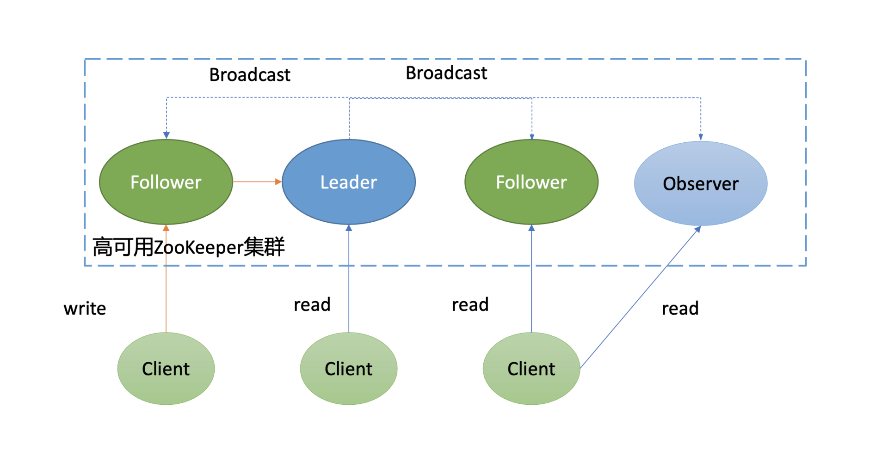

那什么是Zab协议呢？

Zab协议可以分为以下阶段：

- Phase 0，Leader选举（Leader Election)。一个节点只要求获得半数以上投票，就可以当选为准Leader；
- Phase 1，发现（Discovery）。准Leader收集其他节点的数据信息，并将最新的数据复制到自身；
- Phase 2，同步（Synchronization）。准Leader将自身最新数据复制给其他落后的节点，并告知其他节点自己正式当选为Leader；
- Phase 3，广播（Broadcast）。Leader正式对外服务，处理客户端写请求，对消息进行广播。当收到一个写请求后，它会生成Proposal广播给各个Follower节点，一半以上Follower节点应答之后，Leader再发送Commit命令给各个Follower，告知它们提交相关提案；

ZooKeeper是如何实现的Zab协议的呢？

ZooKeeper在实现中并未严格按[论文](https://marcoserafini.github.io/papers/zab.pdf)定义的分阶段实现，而是对部分阶段进行了整合，分别如下：

- Fast Leader Election。首先ZooKeeper使用了一个名为Fast Leader Election的选举算法，通过Leader选举安全规则限制，确保选举出来的Leader就含有最新数据， 避免了Zab协议的Phase 1阶段准Leader收集各个节点数据信息并复制到自身，也就是将Phase 0和Phase 1进行了合并。
- Recovery Phase。各个Follower发送自己的最新数据信息给Leader，Leader根据差异情况，选择发送SNAP、DIFF差异数据、Truncate指令删除冲突数据等，确保Follower追赶上Leader数据进度并保持一致。
- Broadcast Phase。与Zab论文Broadcast Phase一致。

总体而言，从分布式系统CAP维度来看，ZooKeeper与etcd类似的是，它也是一个CP系统，在出现网络分区等错误时，它优先保障的数据一致性，牺牲的是A可用性。

#### Consul架构及原理

了解完ZooKeeper架构及原理后，我们再看看Consul，它的架构和原理是怎样的呢？

下图是[Consul架构图](https://www.consul.io/docs/architecture)（引用自HashiCorp官方文档）。

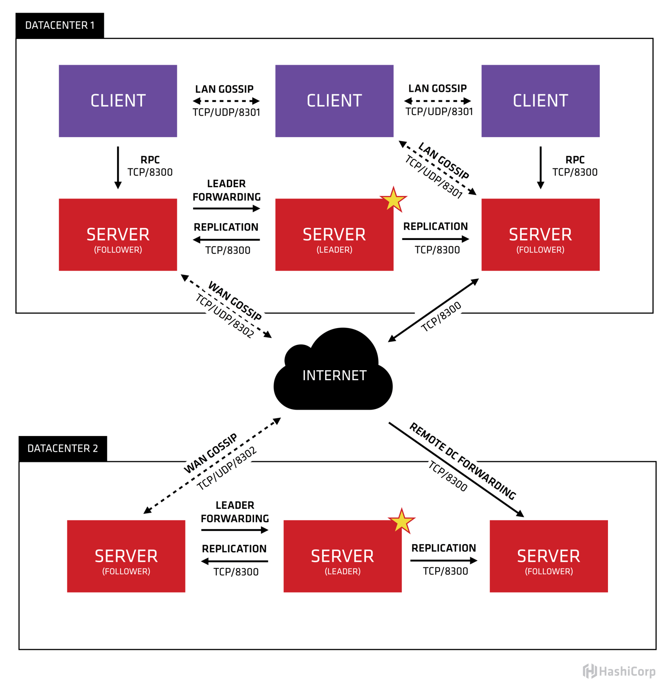

从图中你可以看到，它由Client、Server、Gossip协议、Raft共识算法、两个数据中心组成。每个数据中心内的Server基于Raft共识算法复制日志，Server节点分为Leader、Follower等角色。Client通过Gossip协议发现Server地址、分布式探测节点健康状态等。

那什么是Gossip协议呢？

Gossip中文名称叫流言协议，它是一种消息传播协议。它的核心思想其实源自我们生活中的八卦、闲聊。我们在日常生活中所看到的劲爆消息其实源于两类，一类是权威机构如国家新闻媒体发布的消息，另一类则是大家通过微信等社交聊天软件相互八卦，一传十，十传百的结果。

Gossip协议的基本工作原理与我们八卦类似，在Gossip协议中，如下图所示，各个节点会周期性地选择一定数量节点，然后将消息同步给这些节点。收到消息后的节点同样做出类似的动作，随机的选择节点，继续扩散给其他节点。

最终经过一定次数的扩散、传播，整个集群的各个节点都能感知到此消息，各个节点的数据趋于一致。Gossip协议被广泛应用在多个知名项目中，比如Redis Cluster集群版，Apache Cassandra，AWS Dynamo。

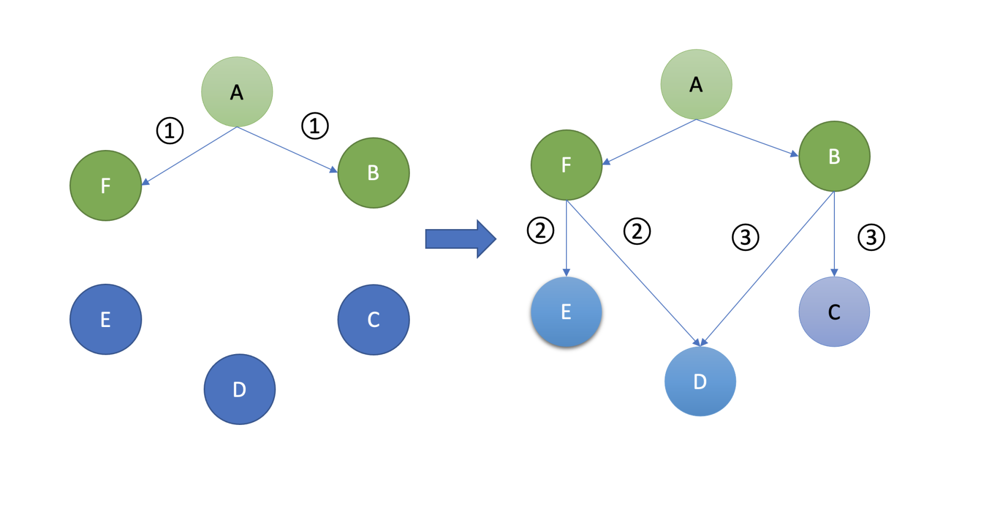

了解完Gossip协议，我们再看看架构图中的多数据中心，Consul支持数据跨数据中心自动同步吗？

你需要注意的是，虽然Consul天然支持多数据中心，但是多数据中心内的服务数据并不会跨数据中心同步，各个数据中心的Server集群是独立的。不过，Consul提供了[Prepared Query](https://www.consul.io/api-docs/query)功能，它支持根据一定的策略返回多数据中心下的最佳的服务实例地址，使你的服务具备跨数据中心容灾。

比如当你的API网关收到用户请求查询A服务，API网关服务优先从缓存中查找A服务对应的最佳实例。若无缓存则向Consul发起一个Prepared Query请求查询A服务实例，Consul收到请求后，优先返回本数据中心下的服务实例。如果本数据中心没有或异常则根据数据中心间 RTT 由近到远查询其它数据中心数据，最终网关可将用户请求转发给最佳的数据中心下的实例地址。

了解完Consul的Gossip协议、多数据中心支持，我们再看看Consul是如何处理读请求的呢?

Consul支持以下三种模式的读请求：

- 默认（default）。默认是此模式，绝大部分场景下它能保证数据的强一致性。但在老的Leader出现网络分区被隔离、新的Leader被选举出来的一个极小时间窗口内，可能会导致stale read。这是因为Consul为了提高读性能，使用的是基于Lease机制来维持Leader身份，避免了与其他节点进行交互确认的开销。
- 强一致性（consistent）。强一致性读与etcd默认线性读模式一样，每次请求需要集群多数节点确认Leader身份，因此相比default模式读，性能会有所下降。
- 弱一致性（stale)。任何节点都可以读，无论它是否Leader。可能读取到陈旧的数据，类似etcd的串行读。这种读模式不要求集群有Leader，因此当集群不可用时，只要有节点存活，它依然可以响应读请求。

### 重点特性比较

初步了解完etcd、ZooKeeper、Consul架构及原理后，你可以看到，他们都是基于共识算法实现的强一致的分布式存储系统，并都提供了多种模式的读机制。

除了以上共性，那么它们之间有哪些差异呢？ 下表是etcd开源社区总结的一个[详细对比项](https://etcd.io/docs/current/learning/why/)，我们就从并发原语、健康检查及服务发现、数据模型、Watch特性等功能上详细比较下它们功能和区别。

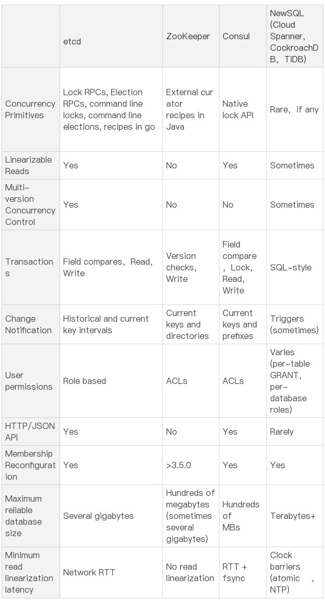

#### 并发原语

etcd和ZooKeeper、Consul的典型应用场景都是分布式锁、Leader选举，以上场景就涉及到并发原语控制。然而etcd和ZooKeeper并未提供原生的分布式锁、Leader选举支持，只提供了核心的基本数据读写、并发控制API，由应用上层去封装。

为了帮助开发者更加轻松的使用etcd去解决分布式锁、Leader选举等问题，etcd社区提供了[concurrency包](https://github.com/etcd-io/etcd/tree/v3.4.9/clientv3/concurrency)来实现以上功能。同时，在etcdserver中内置了Lock和Election服务，不过其也是基于concurrency包做了一层封装而已，clientv3并未提供Lock和Election服务API给Client使用。 ZooKeeper所属的Apache社区提供了[Apache Curator Recipes](http://curator.apache.org/curator-recipes/index.html)库来帮助大家快速使用分布式锁、Leader选举功能。

相比etcd、ZooKeeper依赖应用层基于API上层封装，Consul对分布式锁就提供了[原生的支持](https://www.consul.io/commands/lock)，可直接通过命令行使用。

总体而言，etcd、ZooKeeper、Consul都能解决分布式锁、Leader选举的痛点，在选型时，你可能会重点考虑其提供的API语言是否与业务服务所使用的语言一致。

#### 健康检查、服务发现

分布式协调服务的另外一个核心应用场景是服务发现、健康检查。

与并发原语类似，etcd和ZooKeeper并未提供原生的服务发现支持。相反，Consul在服务发现方面做了很多解放用户双手的工作，提供了服务发现的框架，帮助你的业务快速接入，并提供了HTTP和DNS两种获取服务方式。

比如下面就是通过DNS的方式获取服务地址：

```ruby
$ dig @127.0.0.1 -p 8600 redis.service.dc1.consul. ANY
```

最重要的是它还集成了分布式的健康检查机制。与etcd和ZooKeeper健康检查不一样的是，它是一种基于client、Gossip协议、分布式的健康检查机制，具备低延时、可扩展的特点。业务可通过Consul的健康检查机制，实现HTTP接口返回码、内存乃至磁盘空间的检测。

Consul提供了[多种机制给你注册健康检查](https://learn.hashicorp.com/tutorials/consul/service-registration-health-checks)，如脚本、HTTP、TCP等。

脚本是怎么工作的呢？介绍Consul架构时，我们提到过的Agent角色的任务之一就是执行分布式的健康检查。

比如你将如下脚本放在Agent相应目录下，当Linux机器内存使用率超过70%的时候，它会返回告警状态。

```bash
{
  "check":
    "id": "mem-util"
    "name": "Memory utilization"
    "args":
      "/bin/sh"
      "-c"
      "/usr/bin/free | awk '/Mem/{printf($3/$2*100)}' | awk '{ print($0); if($1 > 70) exit 1;}'
    ]
    "interval": "10s"
    "timeout": "1s
  }
}
```

相比Consul，etcd、ZooKeeper它们提供的健康检查机制和能力就非常有限了。

etcd提供了Lease机制来实现活性检测。它是一种中心化的健康检查，依赖用户不断地发送心跳续租、更新TTL。

ZooKeeper使用的是一种名为临时节点的状态来实现健康检查。当client与ZooKeeper节点连接断掉时，ZooKeeper就会删除此临时节点的key-value数据。它比基于心跳机制更复杂，也给client带去了更多的复杂性，所有client必须维持与ZooKeeper server的活跃连接并保持存活。

#### 数据模型比较

从并发原语、健康检查、服务发现等维度了解完etcd、ZooKeeper、Consul的实现区别之后，我们再从数据模型上对比下三者。

首先etcd正如我们在[07](https://time.geekbang.org/column/article/340226)节MVCC和[10](https://time.geekbang.org/column/article/342527)节boltdb所介绍的，它是个扁平的key-value模型，内存索引通过B-tree实现，数据持久化存储基于B+ tree的boltdb，支持范围查询、适合读多写少，可容纳数G的数据。

[ZooKeeper的数据模型](https://www.usenix.org/legacy/event/atc10/tech/full_papers/Hunt.pdf)如下。

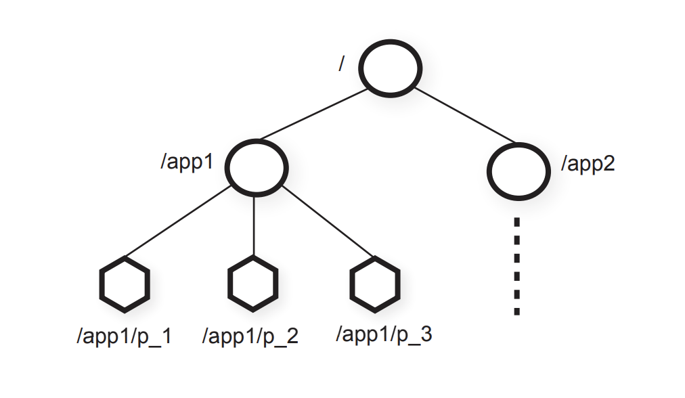

如上图所示，它是一种层次模型，你可能已经发现，etcd v2的内存数据模型与它是一样的。ZooKeeper作为分布式协调服务的祖师爷，早期etcd v2的确就是参考它而设计的。

ZooKeeper的层次模型中的每个节点叫Znode，它分为持久性和临时型两种。

- 持久性顾名思义，除非你通过API删除它，否则它将永远存在。
- 临时型是指它与客户端会话绑定，若客户端会话结束或出现异常中断等，它都将被ZooKeeper server自动删除，被广泛应用于活性检测。

同时你创建节点的时候，还可以指定一个顺序标识，这样节点名创建出来后就具有顺序性，一般应用于分布式选举等场景中。

那ZooKeeper是如何实现以上层次模型的呢？

ZooKeeper使用的是内存ConcurrentHashMap来实现此数据结构，因此具有良好的读性能。但是受限于内存的瓶颈，一般ZooKeeper的数据库文件大小是几百M左右。

Consul的数据模型及存储是怎样的呢？

它也提供了常用key-value操作，它的存储引擎是基于[Radix Tree](https://en.wikipedia.org/wiki/Radix_tree#)实现的[go-memdb](https://github.com/hashicorp/go-memdb)，要求value大小不能超过512个字节，数据库文件大小一般也是几百M左右。与boltdb类似，它也支持事务、MVCC。

#### Watch特性比较

接下来我们再看看Watch特性的比较。

正在我在08节Watch特性中所介绍的，etcd v3的Watch是基于MVCC机制实现的，而Consul是采用滑动窗口实现的。Consul存储引擎是基于[Radix Tree](https://en.wikipedia.org/wiki/Radix_tree#)实现的，因此它不支持范围查询和监听，只支持前缀查询和监听，而etcd都支持。

相比etcd、Consul，ZooKeeper的Watch特性有更多的局限性，它是个一次性触发器。

在ZooKeeper中，client对Znode设置了Watch时，如果Znode内容发生改变，那么client就会获得Watch事件。然而此Znode再次发生变化，那client是无法收到Watch事件的，除非client设置了新的Watch。

#### 其他比较

最后我们再从其他方面做些比较。

- 线性读。etcd和Consul都支持线性读，而ZooKeeper并不具备。
- 权限机制比较。etcd实现了RBAC的权限校验，而ZooKeeper和Consul实现的ACL。
- 事务比较。etcd和Consul都提供了简易的事务能力，支持对字段进行比较，而ZooKeeper只提供了版本号检查能力，功能较弱。
- 多数据中心。在多数据中心支持上，只有Consul是天然支持的，虽然它本身不支持数据自动跨数据中心同步，但是它提供的服务发现机制、[Prepared Query](https://www.consul.io/api-docs/query)功能，赋予了业务在一个可用区后端实例故障时，可将请求转发到最近的数据中心实例。而etcd和ZooKeeper并不支持。

### 小结

最后我们来小结下今天的内容。首先我和你从顶层视角介绍了etcd、ZooKeeper、Consul基本架构及核心原理。

从共识算法角度上看，etcd、Consul是基于Raft算法实现的数据复制，ZooKeeper则是基于Zab算法实现的。Raft算法由Leader选举、日志同步、安全性组成，而Zab协议则由Leader选举、发现、同步、广播组成。无论Leader选举还是日志复制，它们都需要集群多数节点存活、确认才能继续工作。

从CAP角度上看，在发生网络分区时，etcd、Consul、ZooKeeper都是一个CP系统，无法写入新数据。同时，etcd、Consul、ZooKeeper提供了各种模式的读机制，总体上可分为强一致性读、非强一致性读。

其中etcd和Consul则提供了线性读，ZooKeeper默认是非强一致性读，不过业务可以通过sync()接口，等待Follower数据追赶上Leader进度，以读取最新值。

接下来我从并发原语、健康检查、服务发现、数据模型、Watch特性、多数据中心比较等方面和你重点介绍了三者的实现与区别。

其中Consul提供了原生的分布式锁、健康检查、服务发现机制支持，让业务可以更省心，不过etcd和ZooKeeper也都有相应的库，帮助你降低工作量。Consul最大的亮点则是对多数据中心的支持。

最后如果业务使用Go语言编写的，国内一般使用etcd较多，文档、书籍、最佳实践案例丰富。Consul在国外应用比较多，中文文档及实践案例相比etcd较少。ZooKeeper一般是Java业务使用较多，广泛应用在大数据领域。另外Nacos也是个非常优秀的开源项目，支持服务发现、配置管理等，是Java业务的热门选择。

## 高可用集群

在使用etcd过程中，我们经常会面临着一系列问题与选择，比如：

- etcd是使用虚拟机还是容器部署，各有什么优缺点？
- 如何及时发现etcd集群隐患项（比如数据不一致）？
- 如何及时监控及告警etcd的潜在隐患（比如db大小即将达到配额）？
- 如何优雅的定时、甚至跨城备份etcd数据？
- 如何模拟磁盘IO等异常来复现Bug、故障？

今天，我就和你聊聊如何解决以上问题。我将通过从etcd集群部署、集群组建、监控体系、巡检、备份及还原、高可用、混沌工程等维度，带你了解如何构建一个高可靠的etcd集群运维体系。

希望通过这节课，让你对etcd集群运维过程中可能会遇到的一系列问题和解决方案有一定的了解，帮助你构建高可靠的etcd集群运维体系，助力业务更快、更稳地运行。

### 整体解决方案

那要如何构建高可靠的etcd集群运维体系呢?

我通过下面这个思维脑图给你总结了etcd运维体系建设核心要点，它由etcd集群部署、成员管理、监控及告警体系、备份及还原、巡检、高可用及自愈、混沌工程等维度组成。

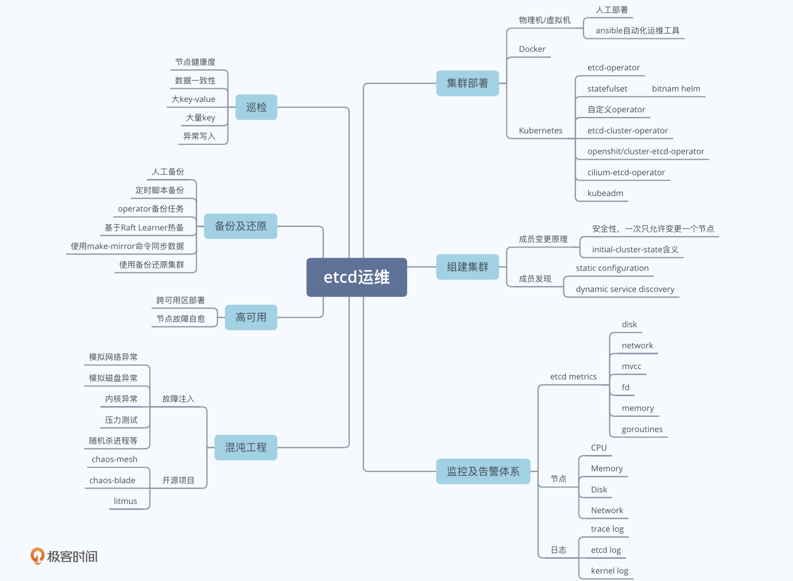

### 集群部署

要想使用etcd集群，我们面对的第一个问题是如何选择合适的方案去部署etcd集群。

首先是计算资源的选择，它本质上就是计算资源的交付演进史，分别如下：

- 物理机；
- 虚拟机；
- 裸容器（如Docker实例）；
- Kubernetes容器编排。

物理机资源交付慢、成本高、扩缩容流程费时，一般情况下大部分业务团队不再考虑物理机，除非是超大规模的上万个节点的Kubernetes集群，对CPU、内存、网络资源有着极高诉求。

虚拟机是目前各个云厂商售卖的主流实例，无论是基于KVM还是Xen实现，都具有良好的稳定性、隔离性，支持故障热迁移，可弹性伸缩，被etcd、数据库等存储业务大量使用。

在基于物理机和虚拟机的部署方案中，我推荐你使用ansible、puppet等自动运维工具，构建标准、自动化的etcd集群搭建、扩缩容流程。基于ansible部署etcd集群可以拆分成以下若干个任务:

- 下载及安装etcd二进制到指定目录；
- 将etcd加入systemd等服务管理；
- 为etcd增加配置文件，合理设置相关参数；
- 为etcd集群各个节点生成相关证书，构建一个安全的集群；
- 组建集群版（静态配置、动态配置，发现集群其他节点）；
- 开启etcd服务，启动etcd集群。

详细你可以参考digitalocean[这篇博客文章](https://www.digitalocean.com/community/tutorials/how-to-set-up-and-secure-an-etcd-cluster-with-ansible-on-ubuntu-18-04)，它介绍了如何使用ansible去部署一个安全的etcd集群，并给出了对应的yaml任务文件。

容器化部署则具有极速的交付效率、更灵活的资源控制、更低的虚拟化开销等一系列优点。自从Docker诞生后，容器化部署就风靡全球。有的业务直接使用裸Docker容器来跑etcd集群。然而裸Docker容器不具备调度、故障自愈、弹性扩容等特性，存在较大局限性。

随后为了解决以上问题，诞生了以Kubernetes、Swarm为首的容器编排平台，Kubernetes成为了容器编排之战中的王者，大量业务使用Kubernetes来部署etcd、ZooKeeper等有状态服务。在开源社区中，也诞生了若干个etcd的Kubernetes容器化解决方案，分别如下：

- etcd-operator；
- bitnami etcd/statefulset；
- etcd-cluster-operator；
- openshit/cluster-etcd-operator；
- kubeadm。

[etcd-operator](https://github.com/coreos/etcd-operator)目前已处于Archived状态，无人维护，基本废弃。同时它是基于裸Pod实现的，要做好各种备份。在部分异常情况下存在集群宕机、数据丢失风险，我仅建议你使用它的数据备份etcd-backup-operator。

[bitnami etcd](https://bitnami.com/stack/etcd/helm)提供了一个helm包一键部署etcd集群，支持各个云厂商，支持使用PV、PVC持久化存储数据，底层基于StatefulSet实现，较稳定。目前不少开源项目使用的是它。

你可以通过如下helm命令，快速在Kubernete集群中部署一个etcd集群。

```bash
helm repo add bitnami https://charts.bitnami.com/bitnami
helm install my-release bitnami/etcd
```

[etcd-cluster-operator](https://github.com/improbable-eng/etcd-cluster-operator)和openshit/[cluster-etcd-operator](https://github.com/openshift/cluster-etcd-operator)比较小众，目前star不多，但是有相应的开发者维护，你可参考下它们的实现思路，与etcd-operator基于Pod、bitnami etcd基于Statefulset实现不一样的是，它们是基于ReplicaSet和Static Pod实现的。

最后要和你介绍的是[kubeadm](https://kubernetes.io/docs/setup/production-environment/tools/kubeadm/setup-ha-etcd-with-kubeadm/)，它是Kubernetes集群中的etcd高可用部署方案的提供者，kubeadm是基于Static Pod部署etcd集群的。Static Pod相比普通Pod有其特殊性，它是直接由节点上的kubelet进程来管理，无需通过kube-apiserver。

创建Static Pod方式有两种，分别是配置文件和HTTP。kubeadm使用的是配置文件，也就是在kubelet监听的静态Pod目录下（一般是/etc/kubernetes/manifests）放置相应的etcd Pod YAML文件即可，如下图所示。

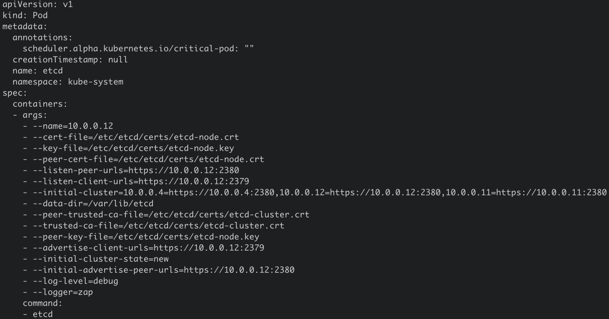

注意在这种部署方式中，部署etcd的节点需要部署docker、kubelet、kubeadm组件，依赖较重。

### 集群组建

和你聊完etcd集群部署的几种模式和基本原理后，我们接下来看看在实际部署过程中最棘手的部分，那就是集群组建。因为集群组建涉及到etcd成员管理的原理和节点发现机制。

在[特别放送](https://time.geekbang.org/column/article/349619)里，超凡已通过一个诡异的故障案例给你介绍了成员管理的原理，并深入分析了etcd集群添加节点、新建集群、从备份恢复等场景的核心工作流程。etcd目前通过一次只允许添加一个节点的方式，可安全的实现在线成员变更。

你要特别注意，当变更集群成员节点时，节点的initial-cluster-state参数的取值可以是new或existing。

- new，一般用于初始化启动一个新集群的场景。当设置成new时，它会根据initial-cluster-token、initial-cluster等参数信息计算集群ID、成员ID信息。
- existing，表示etcd节点加入一个已存在的集群，它会根据peerURLs信息从Peer节点获取已存在的集群ID信息，更新自己本地配置、并将本身节点信息发布到集群中。

那么当你要组建一个三节点的etcd集群的时候，有哪些方法呢?

在etcd中，无论是Leader选举还是日志同步，都涉及到与其他节点通信。因此组建集群的第一步得知道集群总成员数、各个成员节点的IP地址等信息。

这个过程就是发现（Discovery）。目前etcd主要通过两种方式来获取以上信息，分别是**static configuration**和**dynamic service discovery**。

**static configuration**是指集群总成员节点数、成员节点的IP地址都是已知、固定的，根据我们上面介绍的initial-cluster-state原理，有如下两个方法可基于静态配置组建一个集群。

- 方法1，三个节点的initial-cluster-state都配置为new，静态启动，initial-cluster参数包含三个节点信息即可，详情你可参考[社区文档](https://etcd.io/docs/v3.4.0/op-guide/clustering/)。
- 方法2，第一个节点initial-cluster-state设置为new，独立成集群，随后第二和第三个节点都为existing，通过扩容的方式，不断加入到第一个节点所组成的集群中。

如果成员节点信息是未知的，你可以通过**dynamic service discovery**机制解决。

etcd社区还提供了通过公共服务来发现成员节点信息，组建集群的方案。它的核心是集群内的各个成员节点向公共服务注册成员地址等信息，各个节点通过公共服务来发现彼此，你可以参考[官方详细文档。](https://etcd.io/docs/v3.4.0/dev-internal/discovery_protocol/)

### 监控及告警体系

当我们把集群部署起来后，在业务开始使用之前，部署监控是必不可少的一个环节，它是我们保障业务稳定性，提前发现风险、隐患点的重要核心手段。那么要如何快速监控你的etcd集群呢？

正如我在[14](https://time.geekbang.org/column/article/343645)和[15](https://time.geekbang.org/column/article/344621)里和你介绍延时、内存时所提及的，etcd提供了丰富的metrics来展示整个集群的核心指标、健康度。metrics按模块可划分为磁盘、网络、MVCC事务、gRPC RPC、etcdserver。

磁盘相关的metrics及含义如下图所示。

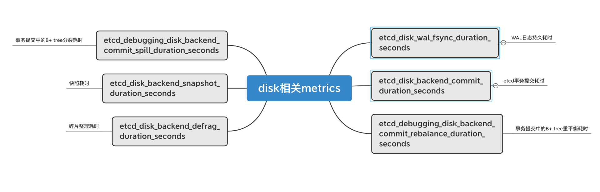

网络相关的metrics及含义如下图所示。

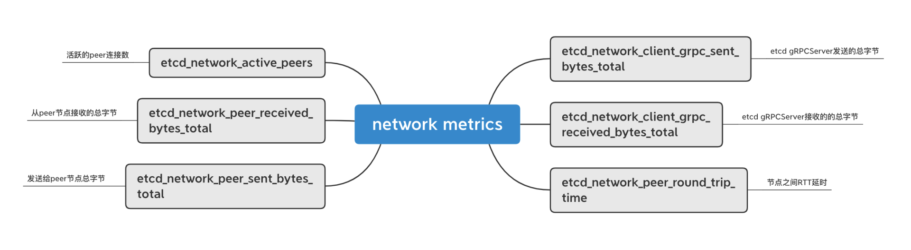

mvcc相关的较多，我在下图中列举了部分其含义，如下所示。

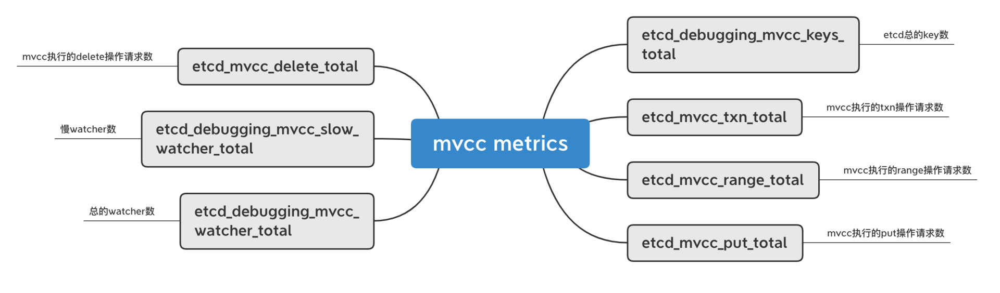

etcdserver相关的如下，集群是否有leader、堆积的proposal数等都在此模块。

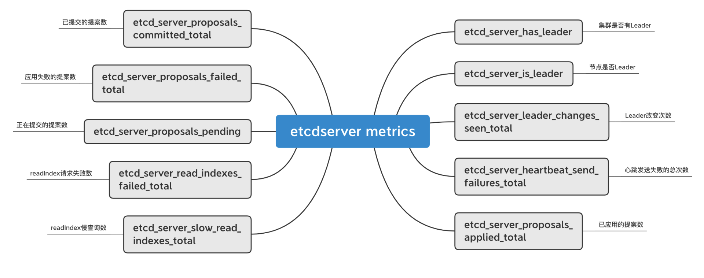

更多metrics，你可以通过如下方法查看。

```bash
curl 127.0.0.1:2379/metrics
```

了解常见的metrics后，我们只需要配置Prometheus服务，采集etcd集群的2379端口的metrics路径。

采集的方案一般有两种，[静态配置](https://etcd.io/docs/v3.4.0/op-guide/monitoring/)和动态配置。

静态配置是指添加待监控的etcd target到Prometheus配置文件，如下所示。

```yaml
global:
  scrape_interval: 10s
scrape_configs:
  - job_name: test-etcd
    static_configs:
    - targets:
 ['10.240.0.32:2379','10.240.0.33:2379','10.240.0.34:2379']
```

静态配置的缺点是每次新增集群、成员变更都需要人工修改配置，而动态配置就可解决这个痛点。

动态配置是通过Prometheus-Operator的提供ServiceMonitor机制实现的，当你想采集一个etcd实例时，若etcd服务部署在同一个Kubernetes集群，你只需要通过Kubernetes的API创建一个如下的ServiceMonitor资源即可。若etcd集群与Promehteus-Operator不在同一个集群，你需要去创建、更新对应的集群Endpoint。

那Prometheus是如何知道该采集哪些服务的metrics信息呢?

答案ServiceMonitor资源通过Namespace、Labels描述了待采集实例对应的Service Endpoint。

```yaml
apiVersion: monitoring.coreos.com/v1
kind: ServiceMonitor
metadata:
  name: prometheus-prometheus-oper-kube-etcd
  namespace: monitoring
spec:
  endpoints:
  - bearerTokenFile: /var/run/secrets/kubernetes.io/serviceaccount/token
    port: http-metrics
    scheme: https
    tlsConfig:
      caFile: /etc/prometheus/secrets/etcd-certs/ca.crt
      certFile: /etc/prometheus/secrets/etcd-certs/client.crt
      insecureSkipVerify: true
      keyFile: /etc/prometheus/secrets/etcd-certs/client.key
  jobLabel: jobLabel
  namespaceSelector:
    matchNames:
    - kube-system
  selector:
    matchLabels:
      app: prometheus-operator-kube-etcd
      release: prometheus
```

采集了metrics监控数据后，下一步就是要基于metrics监控数据告警了。你可以通过Prometheus和[Alertmanager](https://github.com/prometheus/alertmanager)组件实现，那你应该为哪些核心指标告警呢？

当然是影响集群可用性的最核心的metric。比如是否有Leader、Leader切换次数、WAL和事务操作延时。etcd社区提供了一个[丰富的告警规则](https://github.com/etcd-io/etcd/blob/v3.4.9/Documentation/op-guide/etcd3_alert.rules)，你可以参考下。

最后，为了方便你查看etcd集群运行状况和提升定位问题的效率，你可以基于采集的metrics配置个[grafana可视化面板](https://github.com/etcd-io/etcd/blob/v3.4.9/Documentation/op-guide/grafana.json)。下面我给你列出了集群是否有Leader、总的key数、总的watcher数、出流量、WAL持久化延时的可视化面板。

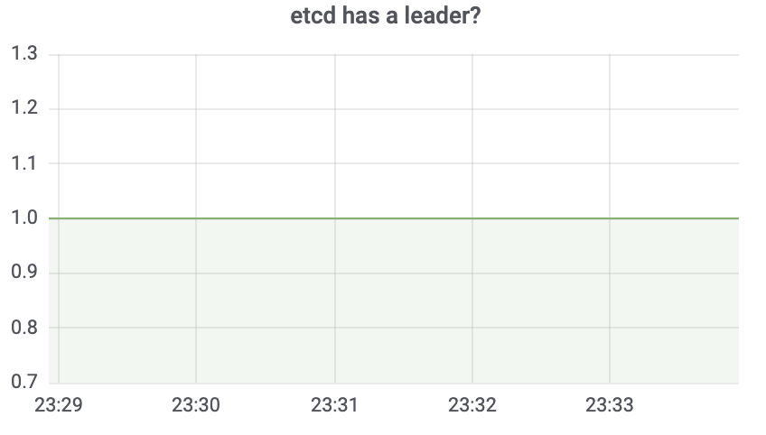-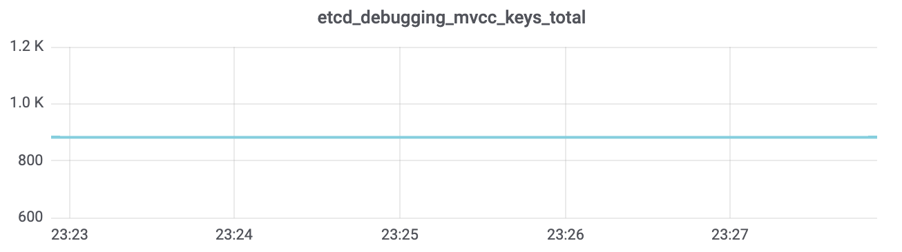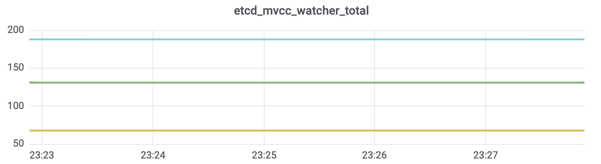-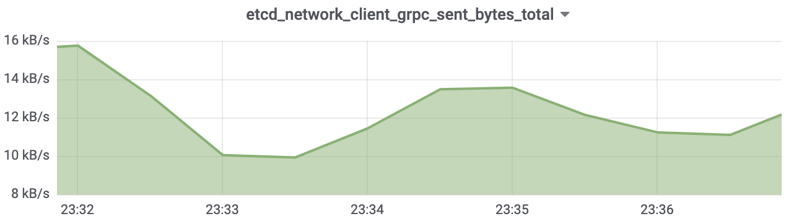-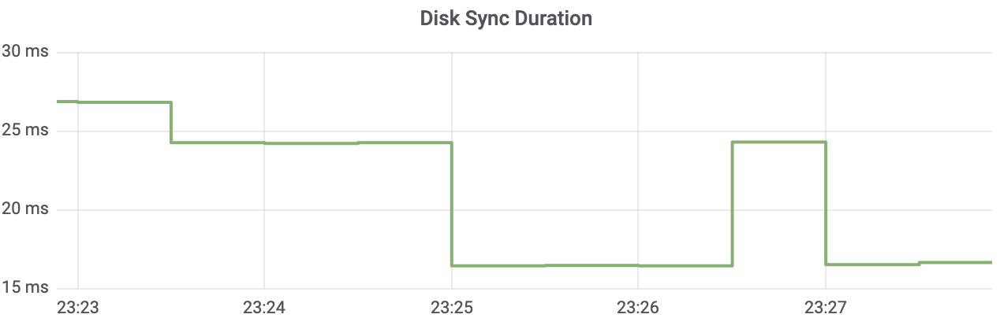

### 备份及还原

监控及告警就绪后，就可以提供给业务在生产环境使用了吗？

当然不行，数据是业务的安全红线，所以你还需要做好最核心的数据备份工作。

如何做呢？

主要有以下方法，首先是通过etcdctl snapshot命令行人工备份。在发起重要变更的时候，你可以通过如下命令进行备份，并查看快照状态。

```lua
ETCDCTL_API=3 etcdctl --endpoints $ENDPOINT 
snapshot save snapshotdb
ETCDCTL_API=3 etcdctl --write-out=table snapshot status snapshotdb
```

其次是通过定时任务进行定时备份，建议至少每隔1个小时备份一次。

然后是通过[etcd-backup-operator](https://github.com/coreos/etcd-operator/blob/master/doc/user/walkthrough/backup-operator.md#:~:text=etcd backup operator backs up,storage such as AWS S3.)进行自动化的备份，类似ServiceMonitor，你可以通过创建一个备份任务CRD实现。CRD如下：

```yaml
apiVersion: "etcd.database.coreos.com/v1beta2"
kind: "EtcdBackup"
metadata:
  name: example-etcd-cluster-periodic-backup
spec:
  etcdEndpoints: [<etcd-cluster-endpoints>]
  storageType: S3
  backupPolicy:
    # 0 > enable periodic backup
    backupIntervalInSecond: 125
    maxBackups: 4
  s3:
    # The format of "path" must be: "<s3-bucket-name>/<path-to-backup-file>"
    # e.g: "mybucket/etcd.backup"
    path: <full-s3-path>
    awsSecret: <aws-secret>
```

最后你可以通过给etcd集群增加Learner节点，实现跨地域热备。因Learner节点属于非投票成员的节点，因此它并不会影响你集群的性能。它的基本工作原理是当Leader收到写请求时，它会通过Raft模块将日志同步给Learner节点。你需要注意的是，在etcd 3.4中目前只支持1个Learner节点，并且只允许串行读。

### 巡检

完成集群部署、了解成员管理、构建好监控及告警体系并添加好定时备份策略后，这时终于可以放心给业务使用了。然而在后续业务使用过程中，你可能会遇到各类问题，而这些问题很可能是metrics监控无法发现的，比如如下：

- etcd集群因重启进程、节点等出现数据不一致；
- 业务写入大 key-value 导致 etcd 性能骤降；
- 业务异常写入大量key数，稳定性存在隐患；
- 业务少数 key 出现写入 QPS 异常，导致 etcd 集群出现限速等错误；
- 重启、升级 etcd 后，需要人工从多维度检查集群健康度；
- 变更 etcd 集群过程中，操作失误可能会导致 etcd 集群出现分裂；

……

因此为了实现高效治理etcd集群，我们可将这些潜在隐患总结成一个个自动化检查项，比如：

- 如何高效监控 etcd 数据不一致性？
- 如何及时发现大 key-value?
- 如何及时通过监控发现 key 数异常增长？
- 如何及时监控异常写入 QPS?
- 如何从多维度的对集群进行自动化的健康检测，更安心变更？
- ……

如何将这些 etcd 的最佳实践策略反哺到现网大规模 etcd 集群的治理中去呢？

答案就是巡检。

参考ServiceMonitor和EtcdBackup机制，你同样可以通过CRD的方式描述此巡检任务，然后通过相应的Operator实现此巡检任务。比如下面就是一个数据一致性巡检的YAML文件，其对应的Operator组件会定时、并发检查其关联的etcd集群各个节点的key差异数。

```vbnet
apiVersion: etcd.cloud.tencent.com/v1beta1
kind: EtcdMonitor
metadata:  
creationTimestamp: "2020-06-15T12:19:30Z"  
generation: 1  
labels:    
clusterName: gz-qcloud-etcd-03    
region: gz    
source: etcd-life-cycle-operator  
name: gz-qcloud-etcd-03-etcd-node-key-diff  
namespace: gz
spec:  
clusterId: gz-qcloud-etcd-03  
metricName: etcd-node-key-diff  
metricProviderName: cruiser  
name: gz-qcloud-etcd-03  
productName: tke  
region: gz
status:  
records:  
- endTime: "2021-02-25T11:22:26Z"    
message: collectEtcdNodeKeyDiff,etcd cluster gz-qcloud-etcd-03,total key num is      
122143,nodeKeyDiff is 0     
startTime: "2021-02-25T12:39:28Z"  
updatedAt: "2021-02-25T12:39:28Z"
```

### 高可用及自愈

通过以上机制，我们已经基本建设好一个高可用的etcd集群运维体系了。最后再给你提供几个集群高可用及自愈的小建议：

- 若etcd集群性能已满足业务诉求，可容忍一定的延时上升，建议你将etcd集群做高可用部署，比如对3个节点来说，把每个节点部署在独立的可用区，可容忍任意一个可用区故障。
- 逐步尝试使用Kubernetes容器化部署etcd集群。当节点出现故障时，能通过Kubernetes的自愈机制，实现故障自愈。
- 设置合理的db quota值，配置合理的压缩策略，避免集群db quota满从而导致集群不可用的情况发生。

### 混沌工程

在使用etcd的过程中，你可能会遇到磁盘、网络、进程异常重启等异常导致的故障。如何快速复现相关故障进行问题定位呢？

答案就是混沌工程。一般常见的异常我们可以分为如下几类：

- 磁盘IO相关的。比如模拟磁盘IO延时上升、IO操作报错。之前遇到的一个底层磁盘硬件异常导致IO延时飙升，最终触发了etcd死锁的Bug，我们就是通过模拟磁盘IO延时上升后来验证的。
- 网络相关的。比如模拟网络分区、网络丢包、网络延时、包重复等。
- 进程相关的。比如模拟进程异常被杀、重启等。之前遇到的一个非常难定位和复现的数据不一致Bug，我们就是通过注入进程异常重启等故障，最后成功复现。
- 压力测试相关的。比如模拟CPU高负载、内存使用率等。

开源社区在混沌工程领域诞生了若干个优秀的混沌工程项目，如chaos-mesh、chaos-blade、litmus。这里我重点和你介绍下[chaos-mesh](https://github.com/chaos-mesh/chaos-mesh)，它是基于Kubernetes实现的云原生混沌工程平台，下图是其架构图（引用自社区）。

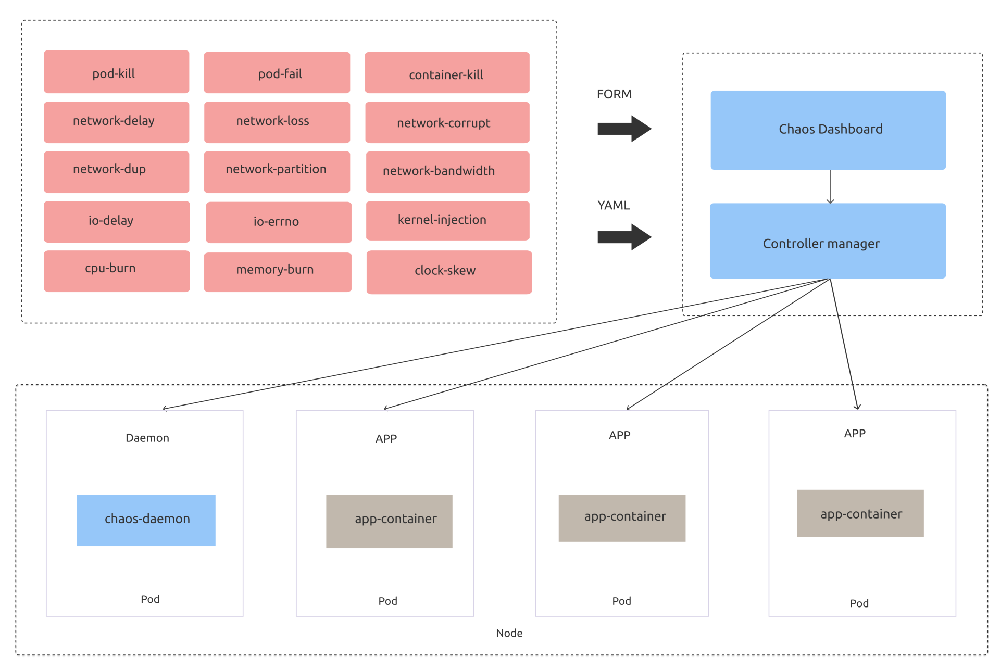

为了实现以上异常场景的故障注入，chaos-mesh定义了若干种资源类型，分别如下：

- IOChaos，用于模拟文件系统相关的IO延时和读写错误等。
- NetworkChaos，用于模拟网络延时、丢包等。
- PodChaos，用于模拟业务Pod异常，比如Pod被杀、Pod内的容器重启等。
- StressChaos，用于模拟CPU和内存压力测试。

当你希望给etcd Pod注入一个磁盘IO延时的故障时，你只需要创建此YAML文件就好。

```yaml
apiVersion: chaos-mesh.org/v1alpha1
kind: IoChaos
metadata:
  name: io-delay-example
spec:
  action: latency
  mode: one
  selector:
    labelSelectors:
      app: etcd
  volumePath: /var/run/etcd
  path: '/var/run/etcd/**/*'
  delay: '100ms'
  percent: 50
  duration: '400s'
  scheduler:
    cron: '@every 10m'
```

### 小结

最后我们来小结下今天的内容。

今天我通过从集群部署、集群组建、监控及告警体系、备份、巡检、高可用、混沌工程几个维度，和你深入介绍了如何构建一个高可靠的etcd集群运维体系。

在集群部署上，当你的业务集群规模非常大、对稳定性有着极高的要求时，推荐使用大规格、高性能的物理机、虚拟机独占部署，并且使用ansible等自动化运维工具，进行标准化的操作etcd，避免人工一个个修改操作。

对容器化部署来说，Kubernetes场景推荐你使用kubeadm，其他场景可考虑分批、逐步使用bitnami提供的etcd helm包，它是基于statefulset、PV、PVC实现的，各大云厂商都广泛支持，建议在生产环境前，多验证各个极端情况下的行为是否符合你的预期。

在集群组建上，各个节点需要一定机制去发现集群中的其他成员节点，主要可分为**static configuration**和**dynamic service discovery**。

static configuration是指集群中各个成员节点信息是已知的，dynamic service discovery是指你可以通过服务发现组件去注册自身节点信息、发现集群中其他成员节点信息。另外我和你介绍了重要参数initial-cluster-state的含义，它也是影响集群组建的一个核心因素。

在监控及告警体系上，我和你介绍了etcd网络、磁盘、etcdserver、gRPC核心的metrics。通过修改Prometheues配置文件，添加etcd target，你就可以方便的采集etcd的监控数据。我还给你介绍了ServiceMonitor机制，你可通过它实现动态新增、删除、修改待监控的etcd实例，灵活的、高效的采集etcd Metrcis。

备份及还原上，重点和你介绍了etcd snapshot命令，etcd-backup-operator的备份任务CRD机制，推荐使用后者。

最后是巡检、混沌工程，它能帮助我们高效治理etcd集群，及时发现潜在隐患，低成本、快速的复现Bug和故障等。

## 成员变更

在etcd的日常运营过程中，大部分同学接触到最多的运维操作就是集群成员变更操作，无论是节点出现性能瓶颈需要扩容，还是节点故障需要替换，亦或是需要从备份来恢复集群，都离不开成员变更。

然而如果你对etcd不是非常了解，在变更时未遵循一定的规范，那么很容易在成员变更时出现问题，导致集群恢复时间过长，进而造成业务受到影响。今天这节课，我们就从一次诡异的故障说起，来和你聊聊etcd成员变更的实现和演进，看看etcd是如何实现动态成员变更的。希望通过这节课，帮助你搞懂etcd集群成员管理的原理，安全的变更线上集群成员，从容的应对与集群成员管理相关的各类问题。

### 从一次诡异的故障说起

首先让我们来看一个实际生产环境中遇到的案例。

某天我收到了一个小伙伴的紧急求助，有一个3节点集群，其中一个节点发生了故障后，由于不规范变更，没有先将节点剔除集群，而是直接删除了数据目录，然后重启了节点。

之后该节点就不停的panic，此时其他两个节点正常。诡异的是，此时执行member remove操作却报错集群没有Leader，但是用endpoint status命令可以看到集群是有Leader存在的。更加奇怪的是，过了几个小时后，该节点又自动恢复了（如下图）。

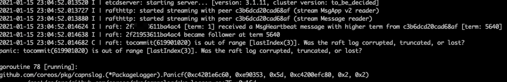

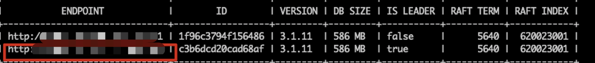

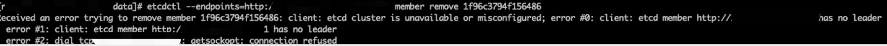

你可以先自己思考下，可能是什么原因导致了这几个问题？有没有办法能够在这种场景下快速恢复集群呢？

如果暂时没什么思路，不要着急，相信学完这节课的成员变更原理后，你就能够独立分析类似的问题，并快速地提供正确、安全的恢复方式。

### 静态配置变更 VS 动态配置变更

接下来我们就来看下，要实现成员变更，都有哪些方案。

最简单的方案就是将集群停服，更新所有节点配置，再重新启动集群。但很明显，这个方案会造成变更期间集群不可用。对于一个分布式高可用的服务来说，这是不可接受的。而且手工变更配置很容易因为人为原因造成配置修改错误，从而造成集群启动失败等问题发生。

既然将所有节点同时关闭来更新配置我们无法接受，那么我们能否实现一个方案，通过滚动更新的方式增删节点来逐个更新节点配置，尽量减少配置更新对集群的影响呢？zookeeper 3.5.0之前就是采用的这个方案来降低配置更新对集群可用性的影响。

但这种方案还是有一定的缺点。一是要对存量节点配置进行手动更新，没有一个很好的校验机制，如果配置更新错误的话很容易对集群造成影响。二是滚动更新配置的过程中节点要进行重启，存量的连接要断开重连。在连接数和负载较高的场景下，大量连接重连也会对集群稳定性造成一定的影响。

针对这两个问题，有没有进一步的优化空间呢？作为程序员，我们的目标肯定是要尽量消除人工操作，将手工操作自动化，这样才能避免人为错误。

那么我们能否能够在配置实际应用之前，通过程序来做好一系列的检查工作，当所有检查通过后，再实际应用新的配置呢？同样，为了避免重启节点，我们能否通过API和共识算法，将新的配置动态同步到老的节点呢？

etcd目前采用的正是上面这种实现方式。它将成员变更操作分为了两个阶段（如下图）：

- 第一个阶段，通过API提交成员变更信息，在API层进行一系列校验，尽量避免因为人为原因造成的配置错误。如果新的配置通过校验，则通过Raft共识算法将新的配置信息同步到整个集群，等到整个集群达成共识后，再应用新的配置。
- 第二个阶段，启动新的节点，并实际加入到集群中（或者移除老的节点，然后老节点自动退出）。

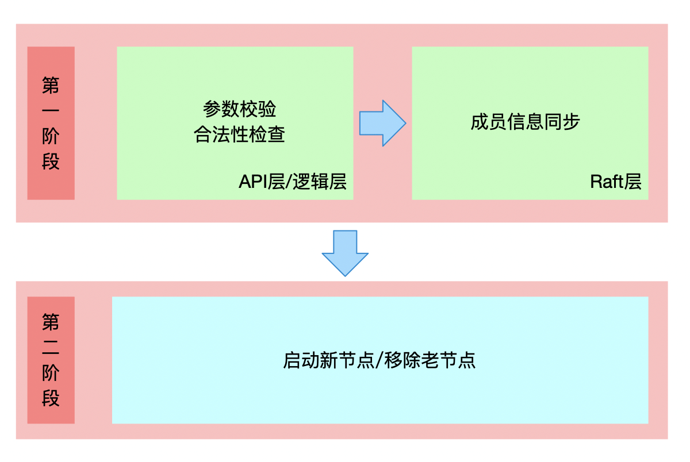

接下来我们就先来看下。etcd如何基于Raft来实现成员信息同步。

### 如何通过Raft实现成员信息同步

#### 成员变更流程

在[04节课](https://time.geekbang.org/column/article/337604)中，我们已经了解到，Raft将一致性问题拆分成了3个子问题，即Leader选举、日志复制以及安全性。基于日志复制，我们可以将成员变更信息作为一个日志条目，通过日志同步的方式同步到整个集群。那么问题来了，日志同步后，我们应该什么时候应用新的配置呢，直接应用新的配置会造成什么问题吗？

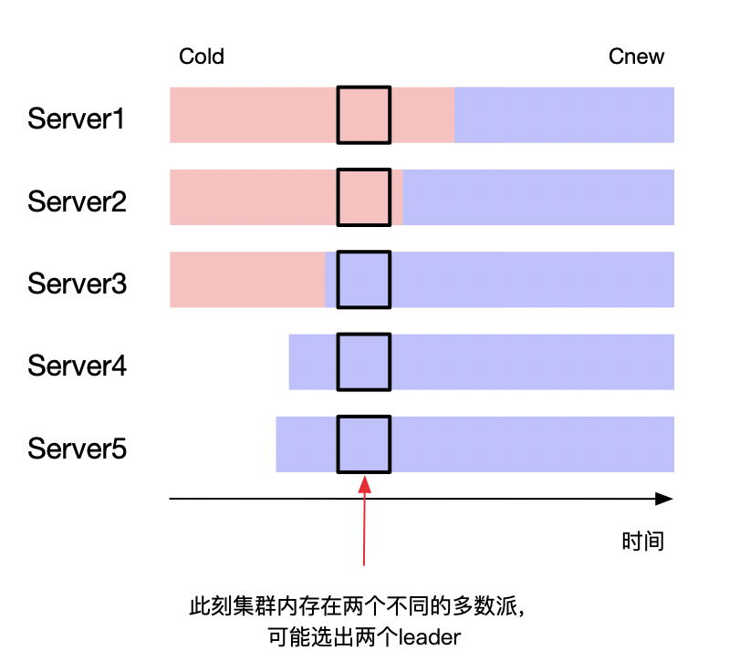

如上图所示（参考自[Raft论文](https://web.stanford.edu/~ouster/cgi-bin/papers/raft-atc14)），当我们将3个节点集群扩展到5个节点的时候，我们可以看到，对于老的3节点配置来说，它的多数派是2个节点。而对于新的5节点配置集群来说，它的多数派是3个节点。

在箭头指向的时刻，新老配置同时生效，老的配置中Server1和Server2组成了多数派，新的配置中Server3、Server4、Server5组成了新的多数派。此时集群中存在两个多数派，可能会选出两个Leader，违背了安全性。

那么有没有方式能避免这个问题，保证变更的安全性呢？一方面我们可以引入**两阶段提交**来解决这个问题，另一方面我们可以通过增加一定约束条件来达到目标。如下图所示，当我们一次只变更一个节点的时候我们可以发现，无论是从奇数节点扩缩到偶数节点，还是从偶数节点扩缩到奇数节点，扩缩容前后配置中的多数派必然有一个节点存在交叉（既存在于老的配置的多数派中，也存在于新的配置的多数派中）。

我们知道在Raft里，竞选出的Leader必须获得一半以上节点投票，这就保证了选出的Leader必然会拥有重叠节点的投票。而一个节点在一轮投票中只能投票给一个候选者，这就保证了新老配置最终选出的Leader必然是一致的。

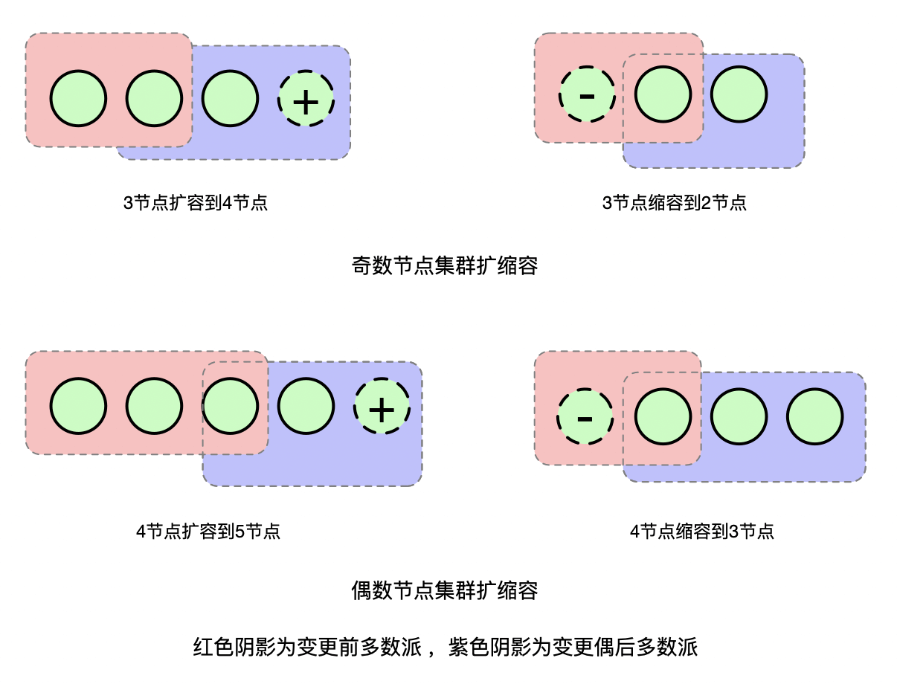

因此，我们通过增加一次只变更一个成员这个约束，就可以得到一个很简单的成员变更实现方式：

- 在一次只变更一个节点的场景下，每个节点只需要应用当前收到的日志条目中最新的成员配置即可（即便该配置当前还没有commit）。
- 在一个变更未结束时，禁止提交新的成员变更。

这样就保证了一个成员变更可以安全地进行，同时在变更的过程中，不影响正常的读写请求，也不会造成老的节点重启，提升了服务的稳定性。

需要注意的是，etcd并没有严格按照Raft论文来实现成员变更，它应用新的配置时间点是在应用层apply时，通知Raft模块进行ApplyConfChange操作来进行配置切换，而不是在将配置变更追加到Raftlog时立刻进行切换。

到目前为止，etcd就完整地实现了一个成员信息同步的流程。如果是扩容的话，接下来只需要启动之前配置的新节点就可以了。

#### 为什么需要Learner

那么这个实现方案有没有什么风险呢？我们一起来分析下。

举个例子，当我们将集群从3节点扩容到4节点的时候，集群的法定票数（quorum）就从2变成了3。而我们新加的节点在刚启动的时候，是没有任何日志的，这时就需要从Leader同步快照才能对外服务。

如果数据量比较大的话，快照同步耗时会比较久。在这个过程中如果其他节点发生了故障，那么集群可用节点就变成了2个。而在4节点集群中，日志需要同步到3个以上节点才能够写入成功，此时集群是无法写入的。

由于法定票数增加，同时新节点同步日志时间长不稳定，从而增大了故障的概率。那么我们是否能通过某种方式来尽量缩短日志同步的时间呢？

答案就是Learner节点（在Raft论文中也叫catch up）。etcd 3.4实现了Leaner节点的能力，新节点可以以Learner的形式加入到集群中。Learner节点不参与投票，即加入后不影响集群现有的法定票数，不会因为它的加入而影响到集群原有的可用性。

Learner节点不能执行写操作和一致性读，Leader会将日志同步给Learner节点，当Learner节点的日志快追上Leader节点时（etcd 3.4 Learner已同步的日志条目Index达到Leader的90%即认为ready），它就成为Ready状态，可被提升为Voting Member。此时将Learner提升为Voting Member，可以大大缩短日志同步时间，降低故障的概率。

另外，由于Learner节点不参与投票，因此即使因为网络问题同步慢也不会影响集群读写性能和可用性，可以利用这个特性来方便的实现**异地热备**的能力。

#### 联合一致性（joint consensus）

虽然一次添加一个节点在实现上可以降低很大的复杂度，但它同样也有一些缺陷。

例如在跨zone容灾的场景下，假设一个集群有三个节点A，B，C，分别属于不同的zone，你无法在不影响跨多zone容灾能力的情况下替换其中一个节点。假设我们要用同一个zone的D节点来替换C节点（如下图）：

- 如果我们采用**先增后减**的形式，先将D加到集群中，此时集群节点数变为了4，法定票数变为了3。如果C，D所在的zone挂掉，则集群只剩下两个可用节点，变为不可用状态。
- 如果我们采用**先减后增**的形式，先将C节点移除，此时集群中剩2个节点，法定票数为2。如果A或者B所在的zone挂掉了，集群同样不可用。

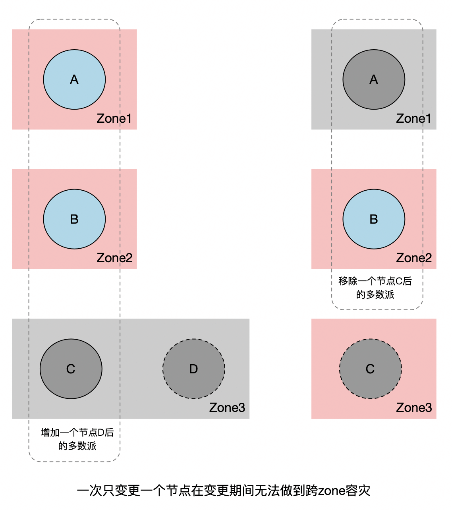

当然，通过Learner节点可以很大程度上降低这个问题发生的概率。但我们如果能够实现多节点成员变更的话，则可以从根本上解决这个问题。

多节点成员变更也是Raft论文中最初提到的实现成员变更的方式，为了保证成员变更的安全性，我们可以通过**两阶段提交**来实现同时变更多个成员，两阶段提交的实现方式有多种，在Raft中是通过引入一个过渡配置来实现的，即引入**联合一致性（joint consensus）**来解决这个问题。如下图（引用自[Raft论文](https://web.stanford.edu/~ouster/cgi-bin/papers/OngaroPhD.pdf)）所示：

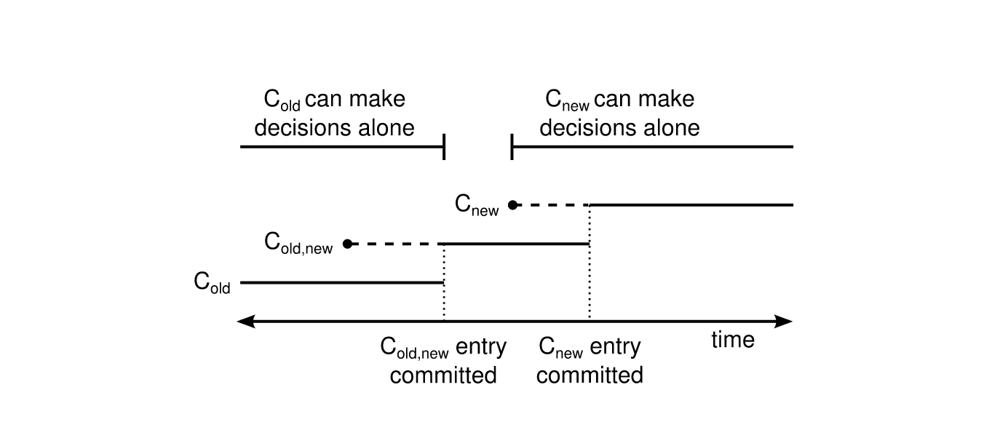

我们可以看到，Raft引入了一个过渡配置：Cold,new。当新的配置提案发起时，Leader会先生成Cold,new状态的配置。当集群处于这个配置时，需要Cold和Cnew的多数派都同意commit，新的提案才能被commit。当Cold,new被commit后，就可以安全切换到新的配置Cnew了，当Cnew被提交后，整个变更操作就完成了。

通过引入joint consensus，我们可以看到不会存在Cold和Cnew同时独立做决定的情况，保证了成员变更的安全性。

进一步推广的话，通过引入joint consensus，我们可以在多个成员变更过程中继续提交新的配置。但这么做不仅会带来额外的复杂度，而且基本上不会带来实际的收益。因此在工程实现上我们一般还是只允许同一时间只能进行一次成员变更，并且在变更过程中，禁止提交新的变更。

etcd 3.4的Raft模块实现了joint consensus，可以允许同时对多个成员或单个成员进行变更。但目前应用层并未支持这个能力，还是只允许一次变更一个节点。它的实现仍然同Raft论文有一定的区别，Raft论文是在配置变更提案追加到Raftlog时就切换配置，而etcd的Raft实现是在apply过程才进行配置切换。当Cold,new配置apply之后，就可以返回给客户端成功了。但此时变更还未完全结束，新的日志条目仍然需要Cold和Cnew多数派都同意才能够提交，Raft模块会通过追加一个空的配置变更条目，将配置从Cold,new切换到Cnew。当Cnew apply后，新的日志条目就只需要Cnew多数派同意即可，整个成员变更信息同步完成。

### 集群扩容节点完整流程

上边讲完了成员信息同步流程，我们就可以来看下向一个已有集群扩容一个新节点的整体流程是怎样的（整体流程如下图）。

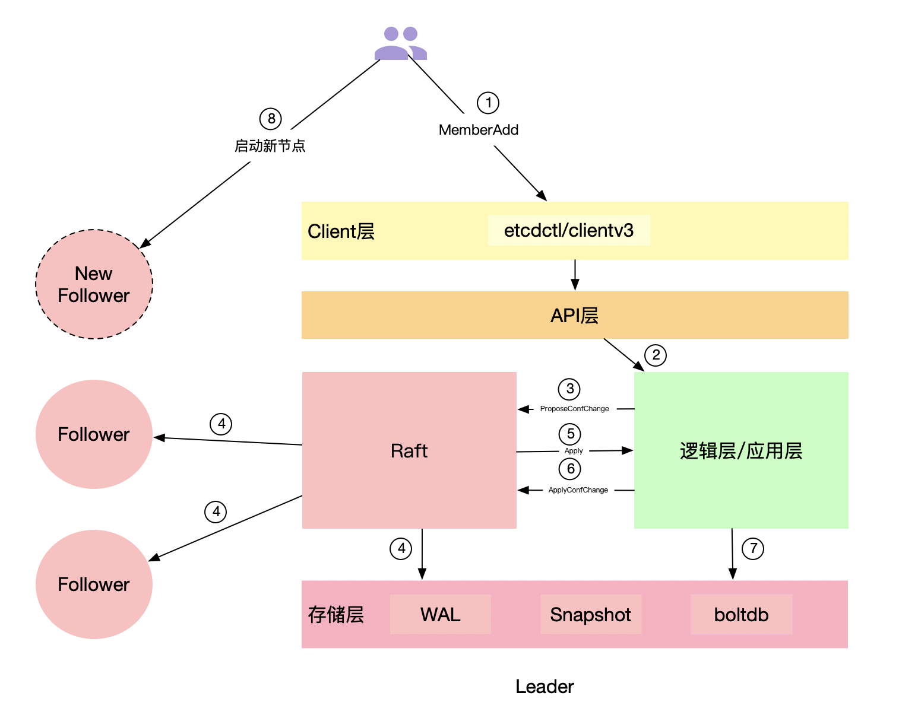

首先，我们可以通过etcdctl或者clientv3库提供的API来向成员管理模块发起一个MemberAdd请求。成员管理模块在收到请求后，会根据你提供的peer-urls地址来构建一个Member成员（注意此时构建的Member成员的Name为空），然后请求etcdserver进行添加操作。

```sql
ETCDCTL_API=3 etcdctl --endpoints=http://1.1.1.1:2379 
member add node-4 --peer-urls=http://4.4.4.4:2380
```

在开启strict-reconfig-check的情况下（默认开启），etcdserver会先进行一系列检查，比如检查当前集群启动的节点数是否满足法定票数要求，当前集群所有投票节点是否都存活等。

检查通过后，则向Raft模块发起一个ProposeConfChange提案，带上新增的节点信息。提案在apply时，会通知Raft模块切换配置，同时更新本节点server维护的member和peer节点信息（如果是移除节点操作的话，被移除节点apply之后延时1s etcd进程会主动退出），并将当前的成员信息更新到etcdserver维护的ConfState结构中。在snapshot的时候会进行持久化（具体作用我们后边会介绍），然后返回给客户端成功。

如果你用的是etcdctl的话，应该可以看到如下输出：

```makefile
Member 96af95420b65e5f5 added to cluster 81a549bdbfd5c3a8

ETCD_NAME="node-4"
ETCD_INITIAL_CLUSTER="node-1=http://1.1.1.1:2380,node-2=http://2.2.2.2:2380,node-3=http://3.3.3.3:2380,node-4=https://4.4.4.4:2380"
ETCD_INITIAL_ADVERTISE_PEER_URLS="https://4.4.4.4:2380"
ETCD_INITIAL_CLUSTER_STATE="existing"
```

通过使用命令返回的环境变量参数，我们就可以启动新的节点了（注意，这里一定要保证你的启动参数和命令返回的环境变量一致）。

新节点启动时，会先校验一系列启动参数，根据是否存在WAL目录来判断是否是新节点，根据initial-cluster-state参数的值为new或existing来判断是加入新集群还是加入已存在集群。

如果是已存在集群添加新节点的情况（也就是不存在WAL目录，且initial-cluster-state值为existing。如果存在WAL目录，则认为是已有节点，会忽略启动参数中的initial-cluster-state和initial-cluster等参数，直接从snapshot中和WAL中获取成员列表信息），则会从配置的peerURLs中获取其他成员列表，连接集群来获取已存在的集群信息和成员信息，更新自己的本地配置。

然后会启动RaftNode，进行一系列的初始化操作后，etcdserver就可以启动了。启动时，会通过goroutine异步执行publish操作，通过Raft模块将自己发布到集群中。

在发布之前，该节点在集群内的Name是空，etcd会认为unstarted，发布时会通过Raft模块更新节点的Name和clientURLs到集群中，从而变成started状态。发布之后，该节点就可以监听客户端端口，对外提供服务了。在执行publish的同时，会启动监听peer端口，用于接收Leader发送的snapshot和日志。

### 新集群如何组建

上边介绍了已存在集群扩容的场景，那么新建集群时又是怎样的呢？

新建集群和加节点的启动流程大体上一致，这里有两个不同的点：

一个是在新集群创建时，构建集群的member信息会直接从启动参数获取，区别于加节点场景从已存在集群查询。这就要求新集群每个节点初始化配置的initial-cluster、initial-cluster-state、initial-cluster-token参数必须相同，因为节点依赖这个来构建集群初始化信息，参数相同才能保证编码出来的MemberId和ClusterId相同。

另一个需要注意的点是在启动Raft Node的过程中，如果是新建集群的话，会多一步BootStrap流程。该流程会将initial-cluster中声明的Peer节点转换为ConfChangeAddNode类型的ConfChange日志条目追加到Raftlog中，并设置为commited状态。然后直接通过applyConfChange来应用该配置，并在应用层开始apply流程时再次apply该配置变更命令（这里重复应用相同配置不会有其他影响）。

你知道etcd为什么要这么做吗？这么做的一个好处是，命令会通过WAL持久化，集群成员状态也会通过snapshot持久化。当我们遇到后续节点重启等场景时，就可以直接应用snapshot和WAL中的配置进行重放，来生成实际的成员配置，而不用再从启动参数读取。因为启动参数可能因为动态重配置而不再准确，而snapshot和WAL中的配置可以保证最新。

### 如何从备份恢复集群

除了新建集群和集群扩缩容外，备份恢复同样十分重要。在集群一半以上节点挂掉后，就只能从备份来恢复了。

我们可以通过etcdctl snapshot save命令或者clientv3库提供的snapshot API来对集群进行备份。备份后的数据除了包含业务数据外，还包含一些集群的元数据信息（例如成员信息）。

有了备份之后，我们就可以通过etcdctl snapshot restore命令来进行数据恢复。这个命令的参数你一定不要搞错，我建议你对照[官方文档](https://etcd.io/docs/v3.4.0/op-guide/recovery/)来。每个节点恢复数据时的name和initial-advertise-peer-urls是有区别的，如果所有节点都用一样的话，最后你可能会恢复成多个独立的集群，我曾经就见到有业务这样搞出过问题。

我们接着来看下snapshot restore都干了哪些事情（如下图）。

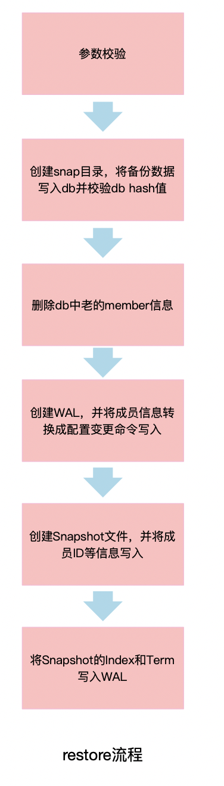

首先，它会根据你提供的参数进行一系列校验，检查snapshot的hash值等。如果检查通过的话，会创建snap目录并将snapshot拷贝到v3的db文件，设置consistentIndex值为当前提供的initial-cluster参数中包含的成员数量，并从db中删除老的成员信息。

然后，它会根据你提供的参数信息来构建WAL文件和snap文件。从你提供的配置中来获取peer节点信息，并转换为ConfChangeAddNode类型的ConfChange日志条目写入WAL文件，同时更新commit值，并将term设置为1。

之后snapshot restore会将peer节点作为Voters写入snapshot metadata的ConfState中，并更新Term和Index。snapshot保存后，WAL会随后保存当前snapshot的Term和Index，用于索引snapshot文件。

当每个节点的数据恢复后，我们就可以正常启动节点了。因为restore命令构造了WAL和snapshot，因此节点启动相当于一个正常集群进行重启。在启动Raft模块时，会通过snapshot的ConfState来更新Raft模块的配置信息，并在应用层apply时会重放从WAL中获取到的ConfChangeAddNode类型的ConfChange日志条目，更新应用层和Raft模块配置。

至此，集群恢复完成。

### 故障分析

了解完etcd集群成员变更的原理后，我们再回到开篇的问题，不晓得现在你有没有一个大概的思路呢？接下来就让我们运用这节课和之前学习的内容，一起来分析下这个问题。

首先，这个集群初始化时是直接启动的3节点集群，且集群创建至今没有过成员变更。那么当删除数据重启时，异常节点会认为自己是新建集群第一次启动，所以在启动Raft模块时，会将peer节点信息转换成ConfChangeAddNode类型的ConfChange日志条目追加到Raftlog中，然后设置committed Index为投票节点数量。我们是3节点集群，所以此时committed Index设置为3，并设置term为1，然后在本地apply该日志条目，应用初始化配置信息，然后启动etcdserver。

Leader在检测到该节点存活后，会向该节点发送心跳信息，同步日志条目。Leader本地会维护每个peer节点的Match和Next Index，Match表示已经同步到该节点的日志条目Index，Next表示下一次要同步的Index。

当Leader向Follower节点发送心跳时，会从Match和Leader当前的commit Index中选择一个较小的，伴随心跳消息同步到Follower节点。Follower节点在收到Leader的commit Index时，会更新自己本地的commit Index。

但Follower节点发现该commit Index比自己当前最新日志的Index还要新（按照我们之前的分析，异常节点当前最新的Index为3（日志也证明了这一点），而Leader发送的commit Index是之前节点正常时的commit值，肯定比3这个值要大），便认为raftlog肯定有损坏或者丢失，于是异常节点就会直接panic退出。最后就出现了我们之前看到的不停重启不停panic的现象。

那么为什么执行member remove操作会报没有Leader呢？我们之前提到过，执行成员变更前会进行一系列前置检查（如下图）。在移除节点时，etcd首先会检查移除该节点后剩余的活跃节点是否满足集群法定票数要求。满足要求后，会检查该节点是否宕机（连接不通）。如果是宕机节点，则可以直接移除。

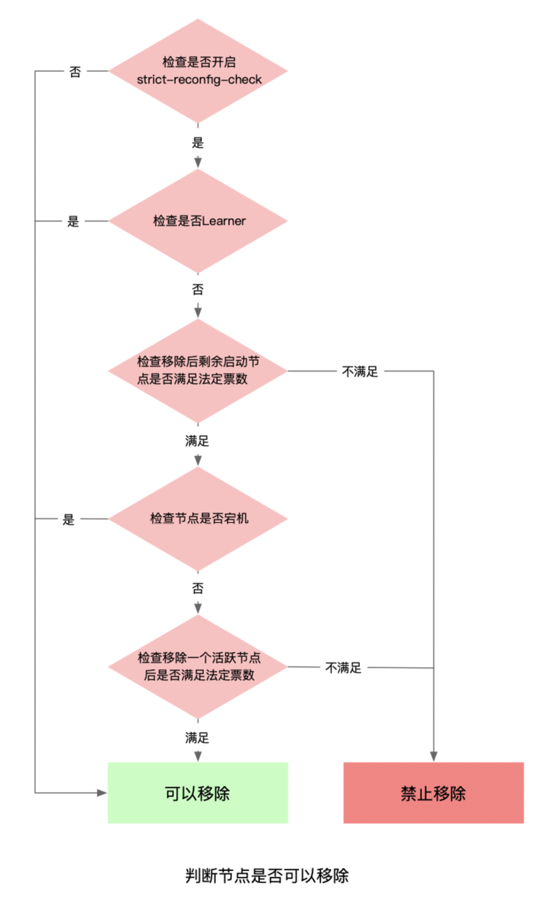

但由于我们的节点不停重启，每次重启建立peer连接时会激活节点状态，因此没有统计到宕机的节点中。

最后会统计集群中当前可用的节点，该统计方式要求节点必须在5s前激活，因为节点刚启动5s内认为etcd还没有ready，所以不会统计到可用节点中，即当前可用节点数为2。

然后再判断移除一个可用节点后，当前剩余节点是否满足法定票数要求，我们这个案例中为 2 - 1 < 1+ ((3-1)/2)，不满足法定票数要求，所以服务端会返回ErrUnhealthy报错给客户端（我们这个场景其实是由于etcd针对不可用节点的判断没有排除异常的要移除节点导致）。

由于用户当时使用的是etcdctl v2的API，所以客户端最终会将该错误转换成http code 503，客户端识别到503，就会认为当前集群没Leader（这里v2客户端代码对v3 grpc错误码转换判断不是很准确，有误导性），打印我们之前看到的no Leader错误。

最后一个问题，为什么后来panic节点会自动恢复呢？答案是中间由于IO高负载，发生了心跳超时，造成了Leader选举。

新的Leader选举出来后，会重置自己维护的peer节点的Match Index为0，因此发送给异常Follower心跳时带上的commit Index即为0。所以Follower不会再因为commit Index小于自己最新日志而panic。而Leader探测到Follower的Index和自己差距太大后，就发送snapshot给Follower，Follower接收snapshot后恢复正常。

这个case了解原理后，如果希望快速恢复的话也很简单：完全停掉异常Follower节点后，再执行member remove，然后将节点移除，清理数据再重新加入到集群（或者通过move-leader命令手动触发一次Leader切换，但该方式比较trick，并不通用）。

以上就是这个案例的完整分析，希望通过这个case，能让你认识到规范变更的重要性，在不了解原理的情况下，一定要按照官方文档来操作，不要凭感觉操作。

### 小结

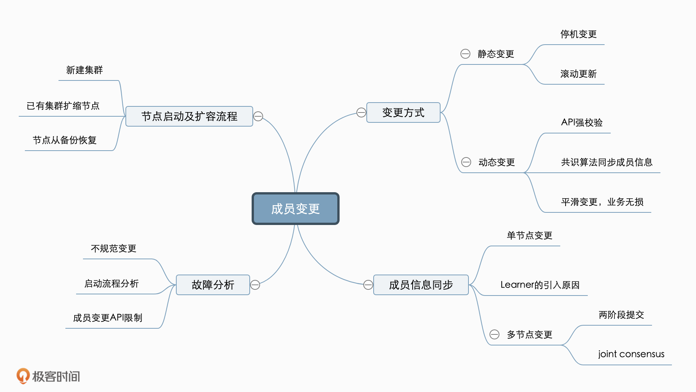

最后我们来小结下今天的内容，今天我从一个诡异的成员变更故障案例讲起，为你介绍了etcd实现成员变更的原理，分别为你分析了etcd成员变更在Raft层和应用层的实现，并分析了各个实现方案的优缺点。

其次我带你过了一遍etcd成员变更的演进方案：从只支持Member变更到支持Learner节点（non-voting Member），Raft层从只支持单节点变更到支持多节点变更。成员变更的方案越来越完善、稳定，运维人员在变更期间发生故障的概率也越来越低。

之后我以新增节点为例，深入为你分析了从配置提交到节点启动对外服务的完整流程，以及新集群启动和恢复过程中涉及到的成员变更原理。

最后，通过我们这节课和之前的课程学到的原理，我和你一步一步深入分析了下开篇的故障问题可能发生的原因以及快速恢复的方法。希望通过这节课，让你对etcd成员变更方案有一个深入的了解，在遇到类似的问题时能够快速定位问题并解决，提升业务的稳定性。

## 分布式系统总结

**如果要用一个核心词来总结这个专栏，那我希望是问题及任务式驱动。**

从我的个人经验上来看，我每次进一步学习etcd的动力，其实都是源于某个棘手的问题。数据不一致、死锁等一系列棘手问题，它们会倒逼我走出舒适区，实现更进一步成长。

从专栏目录中你也可以看到，每讲都是围绕着一个**问题**深入展开。在具体写作思路上，我会先从整体上给你介绍整体架构、解决方案，让你有个全局的认识。随后围绕每个点，按照由浅入深的思路给你分析各种解决方案。

另外，**任务式驱动**也是激励你不断学习的一个非常好的手段，通过任务实践你可以获得满满的成就感，建立正向反馈。你在学习etcd专栏的过程中，可结合自己的实际情况，为自己设立几个进阶任务，下面我给你列举了部分：

- 从0到1搭建一个etcd集群（可以先从单节点再到多节点，并进行节点的增删操作）；
- 业务应用中使用etcd的核心API；
- 自己动手实现一个分布式锁的包；
- 阅读etcd的源码，写篇源码分析博客 （可从早期的etcd v2开始）；
- 基于raftexample实现一个支持多存储引擎的KV服务；
- 基于Kubernetes的Operator机制，实现一个etcd operator，创建一个CRD资源就可新建一个集群；
- ……

我希望带给你的不仅仅是etcd原理与实践案例，更希望你收获的是一系列分布式核心问题解决方案，它们不仅能帮助你搞懂etcd背后的设计思想与实现，更像是一把通往分布式存储系统之门的钥匙，让你更轻松地学习、理解其他存储系统。

那你可能会问了，为什么搞懂etcd就能更深入理解分布式存储系统呢？

因为etcd相比其他分布式系统如HBase等，它足够简洁、轻量级，又涵盖了分布式系统常见的问题和核心概念，如API、数据模型、共识算法、存储引擎、事务、快照、WAL等，非常适合新人去学习。

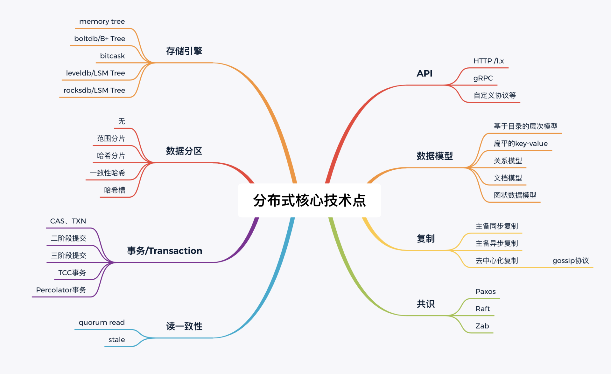

上图我为你总结了etcd以及其他分布式系统的核心技术点，下面我再和你简要分析一下几个分布式核心问题及解决方案，并以Redis Cluster集群模式作为对比案例，希望能够帮助你触类旁通。

首先是服务可用性问题。分布式存储系统的解决方案是共识算法、复制模型。etcd使用的是Raft共识算法，一个写请求至少要一半以上节点确认才能成功，可容忍少数节点故障，具备高可用、强一致的目标。[Redis Cluster](https://redis.io/topics/cluster-spec)则使用的是主备异步复制和Gossip协议，基于主备异步复制协议，可将数据同步到多个节点，实现高可用。同时，通过Gossip协议发现集群中的其他节点、传递集群分片等元数据信息等操作，不依赖于元数据存储组件，实现了去中心化，降低了集群运维的复杂度。

然后是数据如何存取的问题。分布式存储系统的解决方案是存储引擎。除了etcd使用的boltdb，常见的存储引擎还有我们实践篇[18](https://time.geekbang.org/column/article/347136)中所介绍bitcask、leveldb、rocksdb（leveldb优化版）等。不同的分布式存储系统在面对不同业务痛点时（读写频率、是否支持事务等），所选择的解决方案不一样。etcd v2使用的是内存tree，etcd v3则使用的是boltdb，而Redis Cluster则使用的是基于内存实现的各类数据结构。

最后是如何存储大量数据的问题。分布式存储系统的解决方案是一系列的分片算法。etcd定位是个小型的分布式协调服务、元数据存储服务，因此etcd v2和etcd v3都不支持分片，每个节点含有全量的key-value数据。而Redis Cluster定位是个分布式、大容量的分布式缓存解决方案，因此它必须要使用分片机制，将数据打散在各个节点上。目前Redis Cluster使用的分片算法是哈希槽，它根据你请求的key，基于crc16哈希算法计算slot值，每个slot分配给对应的node节点处理。

```ini
HASH_SLOT = CRC16(key) mod 16384
```

etcd 作为最热门的云原生存储之一，在腾讯、阿里、Google、AWS、美团、字节跳动、拼多多、Shopee、明源云等公司都有大量的应用，覆盖的业务不仅仅是 Kubernetes 相关的各类容器产品，更有视频、推荐、安全、游戏、存储、集群调度等核心业务。

更快、更稳是etcd未来继续追求的方向，etcd社区将紧密围绕Kubernetes社区做一系列的优化工作，提供集群降级、自动将Non-Voting的Learner节点提升为Voting Member等特性，彻底解决饱受开发者诟病的版本管理等问题。

希望这个专栏一方面能帮助你遵循最佳实践，高效解决核心业务中各类痛点问题，另一方面能轻松帮你搞定面试过程中常见etcd问题，拿到满意的offer。

当然，我发现很多同学只是默默地收藏，一直在“潜水”。我希望在这最后一课里，大家一块来“灌灌水”，分享一下你自己的etcd学习方法以及你对这门课的感受。我为你准备了一份[问卷](https://jinshuju.net/f/sz6QOc)，希望你花两分钟填一下，说不定你就是我们这门课的“小锦鲤”~

最后，再次感谢，我们留言区和加餐见！

