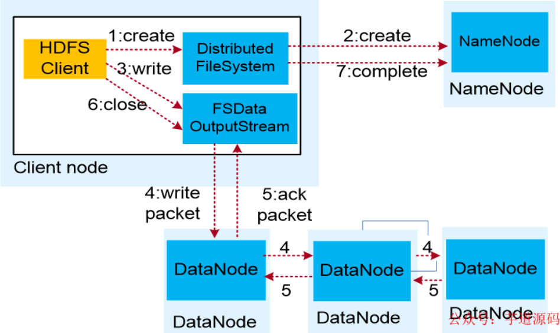

## hdfs

### 文件系统的基本概述

- 文件系统定义：文件系统是一种存储和组织计算机数据的方法，它使得对其访问和查找变得容易。
- 文件名：在文件系统中，文件名是用于定位存储位置。
- 元数据（Metadata）：保存文件属性的数据，如文件名，文件长度，文件所属用户组，文件存储位置等。
- 数据块（Block）：存储文件的最小单元。对存储介质划分了固定的区域，使用时按这些区域分配使用。

### HDFS的概述

“HDFS(Hadoop Distributed File System)基于Google发布的GFS论文设计开发。HDFS是Hadoop技术框架中的分布式文件系统，对部署在多台独立物理机器上的文件进行管理

 

可用于多种场景，如：网站用户行为数据存储。生态系统数据存储。气象数据存储。

#### HDFS的优点和缺点

其除具备其它分布式文件系统相同特性外，还有自己特有的特性：

- 高容错性：认为硬件总是不可靠的。
- 高吞吐量：为大量数据访问的应用提供高吞吐量支持。
- 大文件存储：支持存储TB-PB级别的数据

#### 不适用场景

- 低时间延迟数据访问的应用，例如几十毫秒范围。
  - 原因：HDFS是为高数据吞吐量应用优化的，这样就会造成以高时间延迟为代价。
- 大量小文件 。
  - 原因：NameNode启动时，将文件系统的元数据加载到内存，因此文件系统所能存储的文件总数受限于NameNode内存容量。，那么需要的内存空间将是非常大的。
- 多用户写入，任意修改文件。
  - 原因：现在HDFS文件只有一个writer，而且写操作总是写在文件的末尾

#### 流式数据访问

- 流式数据访问：在数据集生成后，长时间在此数据集上进行各种分析。每次分析都将涉及该数据集的大部分数据甚至全部数据，因此读取整个数据集的时间延迟比读取第一条记录的时间延迟更重要。
- 与流数据访问对应的是随机数据访问：它要求定位、查询或修改数据的延迟较小，比较适合于创建数据后再多次读写的情况，传统关系型数据库很符合这一点

### HDFS的架构

HDFS架构包含三个部分：NameNode，DataNode，Client。

- NameNode：NameNode用于存储、生成文件系统的元数据。运行一个实例。
- DataNode：DataNode用于存储实际的数据，将自己管理的数据块上报给NameNode ，运行多个实例。
- Client：支持业务访问HDFS，从NameNode ,DataNode获取数据返回给业务。多个实例，和业务一起运行。

#### HDFS数据的写入流程

 

- 业务应用调用HDFS Client提供的API，请求写入文件。
- HDFS Client联系NameNode，NameNode在元数据中创建文件节点。
- 业务应用调用write API写入文件。
- HDFS Client收到业务数据后，从NameNode获取到数据块编号、位置信息后，联系DataNode，并将需要写入数据的DataNode建立起流水线。完成后，客户端再通过自有协议写入数据到DataNode1，再由DataNode1复制到DataNode2, DataNode3。
- 写完的数据，将返回确认信息给HDFS Client。
- 所有数据确认完成后，业务调用HDFS Client关闭文件。
- 业务调用close, flush后HDFSClient联系NameNode，确认数据写完成，NameNode持久化元数据

#### HDFS数据的读取流程

 

- 业务应用调用HDFS Client提供的API打开文件。
- HDFS Client联系NameNode，获取到文件信息（数据块、DataNode位置信息）。
- 业务应用调用read API读取文件。
- HDFS Client根据从NameNode获取到的信息，联系DataNode，获取相应的数据块。(Client采用就近原则读取数据)。
- HDFS Client会与多个DataNode通讯获取数据块。
- 数据读取完成后，业务调用close关闭连接

### HDFS的关键特性

 

#### HDFS的高可靠性（HA）

- HDFS的高可靠性（HA）主要体现在利用zookeeper实现主备NameNode，以解决单点NameNode故障问题。
- ZooKeeper主要用来存储HA下的状态文件，主备信息。ZK个数建议3个及以上且为奇数个。
- NameNode主备模式，主提供服务，备同步主元数据并作为主的热备。
- ZKFC(ZooKeeper Failover Controller)用于监控NameNode节点的主备状态。
- JN(JournalNode)用于存储Active NameNode生成的Editlog。Standby NameNode加载JN上Editlog，同步元数据。

#### ZKFC控制NameNode主备仲裁

- ZKFC作为一个精简的仲裁代理，其利用zookeeper的分布式锁功能，实现主备仲裁，再通过命令通道，控制NameNode的主备状态。ZKFC与NN部署在一起，两者个数相同。

#### 元数据同步

- 主NameNode对外提供服务。生成的Editlog同时写入本地和JN，同时更新主NameNode内存中的元数据。
- 备NameNode监控到JN上Editlog变化时，加载Editlog进内存，生成新的与主NameNode一样的元数据。元数据同步完成。
- 主备的FSImage仍保存在各自的磁盘中，不发生交互。FSImage是内存中元数据定时写到本地磁盘的副本，也叫元数据镜像。

#### 元数据持久化

- EditLog:记录用户的操作日志，用以在FSImage的基础上生成新的文件系统镜像。
- FSImage:用以阶段性保存文件镜像。
- FSImage.ckpt:在内存中对fsimage文件和EditLog文件合并（merge）后产生新的fsimage，写到磁盘上，这个过程叫checkpoint.。备用NameNode加载完fsimage和EditLog文件后，会将merge后的结果同时写到本地磁盘和NFS。此时磁盘上有一份原始的fsimage文件和一份新生成的checkpoint文件：fsimage.ckpt. 而后将fsimage.ckpt改名为fsimage（覆盖原有的fsimage）。
- EditLog.new: NameNode每隔1小时或Editlog满64MB就触发合并,合并时,将数据传到Standby NameNode时,因数据读写不能同步进行,此时NameNode产生一个新的日志文件Editlog.new用来存放这段时间的操作日志。Standby NameNode合并成fsimage后回传给主NameNode替换掉原有fsimage,并将Editlog.new 命名为Editlog。

#### HDFS联邦（Federation）

 

- 产生原因：单Active NN的架构使得HDFS在集群扩展性和性能上都有潜在的问题，当集群大到一定程度后，NN进程使用的内存可能会达到上百G，NN成为了性能的瓶颈。
- 应用场景：超大规模文件存储。如互联网公司存储用户行为数据、电信历史数据、语音数据等超大规模数据存储。此时NameNode的内存不足以支撑如此庞大的集群。常用的估算公式为1G对应1百万个块，按缺省块大小计算的话，大概是128T (这个估算比例是有比较大的富裕的，其实，即使是每个文件只有一个块，所有元数据信息也不会有1KB/block)。
- Federation简单理解：各NameNode负责自己所属的目录。与Linux挂载磁盘到目录类似，此时每个NameNode只负责整个hdfs集群中部分目录。如NameNode1负责/database目录，那么在/database目录下的文件元数据都由NameNode1负责。各NameNode间元数据不共享，每个NameNode都有对应的standby。
- 块池（block pool）:属于某一命名空间(NS)的一组文件块。联邦环境下，每个namenode维护一个命名空间卷（namespace volume），包括命名空间的元数据和在该空间下的文件的所有数据块的块池。
- namenode之间是相互独立的，两两之间并不互相通信，一个失效也不会影响其他namenode。
- datanode向集群中所有namenode注册，为集群中的所有块池存储数据。
- NameSpace（NS）：命名空间。HDFS的命名空间包含目录、文件和块。可以理解为NameNode所属的逻辑目录

### 数据副本机制

 

#### 副本距离计算公式

- Distance(Rack1/D1, Rack1/D1)=0，同一台服务器的距离为0。
- Distance(Rack1/D1, Rack1/D3)=2，同一机架不同的服务器距离为2。
- Distance(Rack1/D1, Rack2/D1)=4，不同机架的服务器距离为4。

#### 副本放置策略

- 第一个副本在本节点。
- 第二个副本在远端机架的节点。
- 第三个副本看之前的两个副本是否在同一机架，如果是则选择其他机架，否则选择和第一个副本相同机架的不同节点，第四个及以上，随机选择副本存放位置。

如果写请求方所在机器是其中一个DataNode,则直接存放在本地,否则随机在集群中选择一个DataNode。

- Rack1：表示机架1。
- D1：表示DataNode节点1。
- B1：表示节点上的block块1。

### HDFS数据存储策略

默认情况下，HDFS NameNode自动选择DataNode保存数据的副本。在实际业务中，存在以下场景：

- DataNode上存在的不同的存储设备，数据需要选择一个合适的存储设备分级存储数据。
- DataNode不同目录中的数据重要程度不同，数据需要根据目录标签选择一个合适的DataNode节点保存。
- DataNode集群使用了异构服务器，关键数据需要保存在具有高度可靠性的节点组中

#### 分级存储

配置DataNode使用分级存储

 

- HDFS的分级存储框架提供了RAM_DISK（内存盘）、DISK（机械硬盘）、ARCHIVE（高密度低成本存储介质）、SSD（固态硬盘）四种存储类型的存储设备。
- 通过对四种存储类型进行合理组合，即可形成适用于不同场景的存储策略。

#### 标签存储

配置DataNode使用标签存储：

 

- 用户需要通过数据特征灵活配置HDFS文件数据块的存储节点。通过设置HDFS目 录/文件对应一个标签表达式，同时设置每个Datanode对应一个或多个标签，从而给文件的数据块存储指定了特定范围的Datanode。
- 当使用基于标签的数据块摆放策略，为指定的文件选择DataNode节点进行存放时，会根据文件的标签表达式选择出将要存放的Datanode节点范围，然后在这些Datanode节点范围内，选择出合适的存放节点。

支持用户将数据块的各个副本存放在指定具有不同标签的节点，如某个文件的数据块的2个副本放置在标签L1对应节点中，该数据块的其他副本放置在标签L2对应的节点中。支持选择节点失败情况下的策略，如随机从全部节点中选一个。简单的说：**给DataNode设置标签，被存储的数据也有标签。当存储数据时，数据就会存储到标签相同的DataNode中**

#### 节点组存储

 

关键数据根据实际业务需要保存在具有高度可靠性的节点中，通过修改DataNode的存储策略，系统可以将数据强制保存在指定的节点组中。

**使用约束：**

- 第一份副本将从强制机架组（机架组2）中选出，如果在强制机架组中没有可用节点，则写入失败。
- 第二份副本将从本地客户端机器或机架组中的随机节点中（当客户端机器机架组不为强制机架组时）选出。
- 第三份副本将从其他机架组中选出。
- 各副本应存放在不同的机架组中。如果所需副本的数量大于可用的机架组数量，则会将多出的副本存放在随机机架组中。
- 由于副本数量的增加或数据块受损导致再次备份时，如果有一份以上的副本缺失或无法存放至强制机架组，将不会进行再次备份。系统将会继续尝试进行重新备份，直至强制组中有正常节点恢复可用状态。
- 简单的说：就是强制某些关键数据存储到指定服务器中

#### Colocation同分布

- 同分布(Colocation)的定义：将存在关联关系的数据或可能要进行关联操作的数据存储在相同的存储节点上。
- 按照下图存放，假设要将文件A和文件D进行关联操作，此时不可避免地要进行大量的数据搬迁，整个集群将由于数据传输占据大量网络带宽，严重影响大数据的处理速度与系统性能。

 

- HDFS文件同分布的特性，将那些需进行关联操作的文件存放在相同数据节点上，在进行关联操作计算时避免了到其他的数据节点上获取数据，大大降低网络带宽的占用。
- 使用同分布特性，文件A、D进行join时，由于其对应的block都在相同节点，因此大大降低资源消耗。

 

- Hadoop实现文件同分布，即存在相关联的多个文件的所有块都分布在同一存储节点上。文件级同分布实现文件的快速访问，避免了因数据搬迁带来的大量网络开销。

### HDFS数据完整性保障

HDFS主要目的是保证存储数据完整性，对于各组件的失效，做了可靠性处理。

- 重建失效数据盘的副本数据
  - DataNode向NameNode周期上报失败时，NameNode发起副本重建动作以恢复丢失副本。
- 集群数据均衡
  - HDFS架构设计了数据均衡机制，此机制保证数据在各个DataNode上分布是平均的。
- 元数据可靠性保证
  - 采用日志机制操作元数据，同时元数据存放在主备NameNode上。
  - 快照机制实现了文件系统常见的快照机制，保证数据误操作时，能及时恢复。
- 安全模式
  - HDFS提供独有安全模式机制，在数据节点故障，硬盘故障时，能防止故障扩散。
- 重建失效数据盘的副本数据
  - DataNode与NameNode之间通过心跳周期汇报数据状态，NameNode管理数据块是否上报完整，如果DataNode因硬盘损坏未上报数据块，
  - NameNode将发起副本重建动作以恢复丢失的副本。
- 安全模式防止故障扩散
  - 当节点硬盘故障时，进入安全模式，HDFS只支持访问元数据，此时HDFS 上的数据是只读的，其他的操作如创建、删除文件等操作都会导致失败。待硬盘问题解决、数据恢复后，再退出安全模式。

### 小结

- 统一的文件系统
  - HDFS对外仅呈现一个统一的文件系统。
- 空间回收机制
  - 支持回收站机制，以及副本数的动态设置机制。
- 数据组织
  - 数据存储以数据块为单位，存储在操作系统的HDFS文件系统上。
- 访问方式
  - 提供JAVA API，HTTP方式，SHELL方式访问HDFS数据。
- 磁盘使用率
  - 比如磁盘100G，用了30G，使用率30%。

负载均衡避免了节点间数据分布不均匀，导致热点节点问题。

### 思考题

- HDFS是什么，适合于做什么？
  - 运行在通用硬件上的分布式文件系统。适合于大文件存储与访问、流式数据访问。
- HDFS包含那些角色？
  - NameNode、DataNode、Client。
- 请简述HDFS的读写流。
  - 读取：Client联系NameNode，获取文件信息。Client根据从NameNode获取到的信息，联系DataNode，获取相应的数据块；数据读取完成后，业务调用close关闭连接。
  - 写入：Client联系NameNode，NameNode在元数据中创建文件节点；Client联系DataNode并建立流水线，完成后，客户端再通过自有协议写入数据到 DataNode1，再由DataNode1复制到DataNode2,DataNode3；业务调用close关 闭连接；Client联系NameNode，确认数据写完成