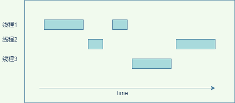
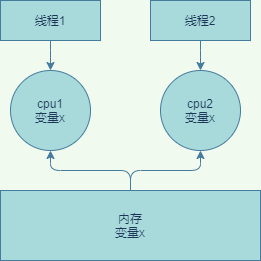

## 1. 并发问题的本质
### 1.1. 计算机性能
&emsp;&emsp;我们知道计算机有这么几大核心组件，CPU、内存、I/O 设备，它们的性能的差异就非常明显，cpu的速度远远大于内存，而内存的速度也远远大于磁盘IO的。而一个应用如果性能要求很高，往往取决于最慢的组件，如何合理的平衡它们的性能差异。计算机和应用的设计者做了如下的事情：
* cpu自身增加了缓存，cpu可以不去访问内存。
* cpu太快了，操作系统增加了多进程、多线程来提升cpu的利用率  

* 应用程序代码编译的时候，编译器会做编译优化。比如java会做一些指令重排序。  

&emsp;&emsp;有了上述的优化，计算机应用的性能得到了大幅的提升，但是有失必有得，以上的优化就带来了并发安全问题了。java的并发安全问题的原因大致可以总结如下：  
### 1.2. 缓存导致的可见性问题
  
&emsp;&emsp;如图所示。所有线程都是操作同一个 CPU 的缓存，一个线程对缓存的写，对另外一个线程来说一定是可见的。线程 1 和线程 2 都是操作同一个 CPU 里面的缓存，所以线程 1更新了变量 2 的值，那么线程 1 之后再访问变量 2，得到的一定是x的最新值，但是如果是多核的话，两个cpu没有交流，都是各自缓存，最后更新到内存中会出现不一致的问题。
### 1.3. 线程切换带来的原子性。
&emsp;&emsp;我们把一个或者多个操作在 CPU 执行的过程中不被中断的特性称为原子性。  
&emsp;&emsp;比如我们java的i++;操作就不是原子性的，它包括三个cpu指令:
* 变量i从内存加载到 CPU 的寄存器
* 在寄存器中执行 +1 操作
* 将结果写入内存(如果使用了cpu缓存，则不会写入内存，而是写入到cpu缓存)  
如果多个线程调用该代码，由于是非原子性的，会导致i+1还没有操作挂起了cpu，然后另一个线程也进行i+1。导致了最终的结果不一致了。
### 1.4. 编译优化导致的有序性
编译会结合cpu的情况对代码的cpu指令进行重排序，最终可能导致安全问题。最典型的就是一个单例
```
public class Singleton {
  static Singleton instance;
  static Singleton getInstance(){
    if (instance == null) {
      synchronized(Singleton.class) {
        if (instance == null)
          instance = new Singleton();
        }
    }
    return instance;
  }
}
```
&emsp;&emsp;如上面的代码所示，如果多线程调用可能会产生空指针异常。为什么多个线程会出现控制指针呢？
出在 new 操作上，我们以为的 new 操作应该是：
1. 分配一块内存 M；
2. 在内存 M 上初始化 Singleton 对象；
3. 然后 M 的地址赋值给 instance 变量。  

但是实际上优化后的执行路径却是这样的：  
1. 分配一块内存 M；
2. 将 M 的地址赋值给 instance 变量；
3. 最后在内存 M 上初始化 Singleton 对象。  

&emsp;&emsp;这样就会导致，我们假设线程 A 先执行 getInstance() 方法，当执行完指令 2 时恰好发生了线程切换，切换到了线程 B 上；如果此时线程 B 也执行 getInstance() 方法，那么线程 B 在执行第一个判断时会发现 instance != null ，所以直接返回 instance，而此时的 instance 是没有初始化过的，如果我们这个时候访问 instance 的成员变量就可能触发空指针异常。
### 1.4. 小结
&emsp;&emsp;可见性、原子性、有序性这些原本为了优化计算机性能反而会影响计算机性能，特意提到缓存导致的可见性问题，线程切换带来的原子性问题，编译优化带来的有序性问题。这都是并发问题的根源。

**PS：通常long类型为64位，所以在32位的机器上，对long类型的数据操作通常需要多条指令组合出来，无法保证原子性，所以并发的时候会出问题**
## 2. java语言如何处理并发问题
我们知道并发问题主要有三大原因引起的，可见性、有序性、原子性。每种语言都会遇到这些并发问题，java语言如何预防这些问题呢？  
java语言提供了volatile、synchronized、final、六项 Happens-Before 规则来帮助编程者避免这些问题。  
### 2.1. volatile关键字
volatile不仅在java有，在C 语言里也有，它表达的是：告诉编译器，对这个变量的读写，不能使用 CPU 缓存，必须从内存中读取或者写入。在1.5 以前版本中，这个关键词只起到了禁用缓存作用，之后的版本中
根据Happens-Before 规则对 volatile 语义进行了增强。
### 2.2. Happens-Before 规则
```
class VolatileExample {
  int x = 0;
  volatile boolean v = false;
  public void doWrite() {
    x = 11;
    v = true;
  }
  public void doRead() {
    if (v == true) {
    
    }
  }
}
```
Happens-Before 约束了编译器的优化行为，虽允许编译器优化，但是要求编译器优化后一定遵守 Happens-Before 规则。  
该规则一共有六项。  
*  顺序性   
   程序前面对某个变量的修改一定是对后续操作可见的
*  volatile 
   变量的写操作，一定会发生在这个volatile 变量的读操作之前。
*  传递性  
  如上面的代码  
  x=11,一定发生在v=true前面（规则1），而v是一个volatile，v=true一定发生在v==true前面，所以传递性就是x=11一定发生在v==true的前面，所以就不会有顺序导致的并发问题了。
*  管程中的锁规则，如下图的代码，线程A对x的修改，线程B能够看到
```
// 此处自动加隐式锁
synchronized (this) { 
  // x 是共享变量
  if (x < 5) {
    x = 2; 
  }  
}
// 此处自动释放锁
```
PS：java的管程就是指synchronized的实现，在进入同步块之前，会自动加锁，而在代码块执行完会自动释放锁，加锁以及释放锁都是编译器帮我们实现的

*  线程 start() 规则   
  它是指主线程 A 启动子线程 B 后，子线程 B 能够看到主线程在启动子线程 B 前的操作
```
Thread B = new Thread(()->{
  print(x)//x == 5
});
// 此处对共享变量 var 修改
x = 5;
// 启动子线程
B.start();
```

*  线程 join() 规则  
  它是指主线程 A 等待子线程 B 完成（主线程 A 通过调用子线程 B 的 join() 方法实现），当子线程 B 完成后（主线程 A 中 join() 方法返回），主线程能够看到子线程的操作

```
Thread B = new Thread(()->{
  // 此处对共享变量 var 修改
  x = 1;
});
// 例如此处对共享变量修改，
// 则这个修改结果对线程 B 可见
// 主线程启动子线程
B.start();
B.join()
// 子线程所有对共享变量的修改
// 在主线程调用 B.join() 之后皆可见
// x==1
```
### 2.3. final关键字
final 修饰变量时，代表变量生而不变，1.5 以前的版本可能会优化出错，在 1.5 以后 Java 内存模型对 final 类型变量的重排。只要我们提供没有“逸出”，就不会出问题。  

**注意：逸出是指在构造函数将对象赋给某一个全局变量，别的线程读取对象的变量可能是空的或者为0,如下的代码就是逸出的例子**
```
// 以下代码来源于【参考 1】
final int x;
// 错误的构造函数
public gouzaohanshu() { 
  x = 1;
  // 此处 即使将this 逸出了，线程通过 global.obj 读取 x 是有可能读到 0 
  global.obj = this;
}
```
### 2.4 小结
&emsp;&emsp;Happens-Before 的语义本质上是一种可见性，A Happens-Before B 意味着 A 事件对 B 事件来说是可见的，无论 A 事件和 B 事件是否发生在同一个线程里。例如 A 事件发生在线程 1 上，B 事件发生在线程 2 上，Happens-Before 规则保证线程 2 上也能看到 A 事件的发生。    
&emsp;&emsp;因此，设置一个多线程的都操作的共享变量通常有三种方式来保证它的可见性。
* 使用volatile关键字修饰变量
* 在synchronized关键字对共享变量的赋值代码块加锁，由于Happen-before管程锁的规则，可以使得后续的线程可以看到共享变量的值
* A线程启动后，使用A.JOIN()方法来完成运行，后续线程再启动，则一定可以看到
### 3. 总结
&emsp;&emsp;前面介绍了线程安全问题的根源是三大件，可见性、原子性、有序性导致，而java为此提供了多种方式如volatile、final、happens-before原则来避免线程安全问题发生。
## 3. java锁
## 4. 死锁
## 5. 性能问题
## 6. 管程

## 10. 并发程序开发思路