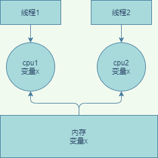
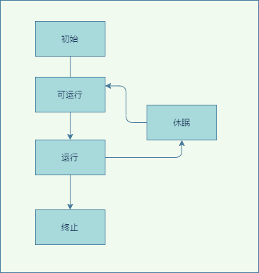

## 1. 并发问题始作俑者
### 1.1. 计算机性能
&emsp;&emsp;我们知道计算机有这么几大核心组件，CPU、内存、I/O 设备，它们的性能的差异就非常明显，cpu的速度远远大于内存，而内存的速度也远远大于磁盘IO的。而一个应用如果性能要求很高，往往取决于最慢的组件，如何合理的平衡它们的性能差异。计算机和应用的设计者做了如下的事情：
* cpu自身增加了缓存，cpu可以不去访问内存。
* cpu太快了，操作系统增加了多进程、多线程来提升cpu的利用率  

* 应用程序代码编译的时候，编译器会做编译优化。比如java会做一些指令重排序。  

&emsp;&emsp;有了上述的优化，计算机应用的性能得到了大幅的提升，但是有失必有得，以上的优化就带来了并发安全问题了。java的并发安全问题的原因大致可以总结如下：  
### 1.2. 缓存导致的可见性问题
  
&emsp;&emsp;如图所示。所有线程都是操作同一个 CPU 的缓存，一个线程对缓存的写，对另外一个线程来说一定是可见的。线程 1 和线程 2 都是操作同一个 CPU 里面的缓存，所以线程 1更新了变量 2 的值，那么线程 1 之后再访问变量 2，得到的一定是x的最新值，但是如果是多核的话，两个cpu没有交流，都是各自缓存，最后更新到内存中会出现不一致的问题。
### 1.3. 线程切换带来的原子性。
&emsp;&emsp;我们把一个或者多个操作在 CPU 执行的过程中不被中断的特性称为原子性。  
&emsp;&emsp;比如我们java的i++;操作就不是原子性的，它包括三个cpu指令:
* 变量i从内存加载到 CPU 的寄存器
* 在寄存器中执行 +1 操作
* 将结果写入内存(如果使用了cpu缓存，则不会写入内存，而是写入到cpu缓存)  
如果多个线程调用该代码，由于是非原子性的，会导致i+1还没有操作挂起了cpu，然后另一个线程也进行i+1。导致了最终的结果不一致了。
### 1.4. 编译优化导致的有序性
编译会结合cpu的情况对代码的cpu指令进行重排序，最终可能导致安全问题。最典型的就是一个单例
```
public class Singleton {
  static Singleton instance;
  static Singleton getInstance(){
    if (instance == null) {
      synchronized(Singleton.class) {
        if (instance == null)
          instance = new Singleton();
        }
    }
    return instance;
  }
}
```
&emsp;&emsp;如上面的代码所示，如果多线程调用可能会产生空指针异常。为什么多个线程会出现控制指针呢？
出在 new 操作上，我们以为的 new 操作应该是：
1. 分配一块内存 M；
2. 在内存 M 上初始化 Singleton 对象；
3. 然后 M 的地址赋值给 instance 变量。  

但是实际上优化后的执行路径却是这样的：  
1. 分配一块内存 M；
2. 将 M 的地址赋值给 instance 变量；
3. 最后在内存 M 上初始化 Singleton 对象。  

&emsp;&emsp;这样就会导致，我们假设线程 A 先执行 getInstance() 方法，当执行完指令 2 时恰好发生了线程切换，切换到了线程 B 上；如果此时线程 B 也执行 getInstance() 方法，那么线程 B 在执行第一个判断时会发现 instance != null ，所以直接返回 instance，而此时的 instance 是没有初始化过的，如果我们这个时候访问 instance 的成员变量就可能触发空指针异常。
### 1.4. 小结
&emsp;&emsp;可见性、原子性、有序性这些原本为了优化计算机性能反而会影响计算机性能，特意提到缓存导致的可见性问题，线程切换带来的原子性问题，编译优化带来的有序性问题。这都是并发问题的根源。

**PS：通常long类型为64位，所以在32位的机器上，对long类型的数据操作通常需要多条指令组合出来，无法保证原子性，所以并发的时候会出问题**
## 2. java的并发理论
并发问题在所有的语言都会
### 2.1. java内存模型
## 3. java锁
## 4. 死锁
## 5. 性能问题
## 6. 管程
## 7. java线程生命周期
### 7.1. 线程的概念
线程是操作系统里的一个概念，不同的开发语言如 Java等都对其进行了封装，线程和时间有关，它有一个生命周期。我们只需要关注线程状态的转换就可以。线程是一个通用性的概念。  
  
* 初始状态，编程语言的创建，此刻操作系统还没有创建
* 可运行状态，可以分配 CPU 执行
* 有空闲的 CPU 时，操作系统会将其分配给一个处于可运行状态的线程
* 如果调用一个阻塞的 API，线程的状态就会转换到休眠状态，同时释放 CPU 使用权，休眠状态的线程永远没有机会获得 CPU 使用权，当等待的事件出现了，线程就会从休眠状态转换到可运行状态。
* 线程执行完或者出现异常就会进入终止状态，线程的生命周期就结束了。
<br>
### 7.2. java线程状态
java语言对操作系统的线程进行了进一步的封装，新增了几个状态，一共有：
* NEW（初始化状态）
* RUNNABLE（可运行 / 运行状态）
* BLOCKED（阻塞状态）
* WAITING（无时限等待）
* TIMED_WAITING（有时限等待）
* TERMINATED（终止状态）  
  
其实上面的阻塞或者等待状态都是属于操作系统的休眠状态（BLOCKED、WAITING、TIMED_WAITING ），只是说java对这几种状态的转换机制做了区分，只要我们理解它们转换状态的机制，就能记住这些状态。
### 7.3. java线程的流转  
#### 7.3.1. new->runnable  
java刚创建出来的 Thread 对象就是 NEW 状态，java创建线程有两种方法。一种是继承thread，另一种是实现runaable接口，此时但操作系统还没有感知到，需要调用线程对象的start的方法。然后就转变为RUNNABLE。
```
// Task
class Task implements Runnable {
  @Override
  public void run() {
    //do something
  }
}
Thread thread = new Thread(new Task());
```
#### 7.3.2. runnable->blocked  
只有一种场景会触发这种转换，就是线程等待 synchronized 的隐式锁。即：
* synchronized 修饰的代码执行时，代码块同一时刻只允许一个线程执行，其他线程只能等待，等待的线程就会从 RUNNABLE 转换到 BLOCKED 状态
* 等待的线程获得 synchronized 隐式锁时，就又会从 BLOCKED 转换到 RUNNABLE 状态    

**注意：线程调用阻塞式 API 时，是否会转换到 BLOCKED 状态呢？在操作系统层面，线程是会转换到休眠状态的，但是在 JVM 层面，Java 线程的状态不会发生变化，也就是说 Java 线程的状态会依然保持 RUNNABLE 状态。JVM 层面并不关心操作系统调度相关的状态**
#### 7.3.3. runnable->WAITING
一共有三个场景会产生该转换：  
*  synchronized 隐式锁的线程，调用无参数的 Object.wait() 
* 调用无参数的 ThreadA.join() 方法,意思就是当前线程，使用threadA调用join（）方法，threadA线程没有执行完，会watting阻塞，直到执行完毕。
* LockSupport.park()，当前线程会阻塞，线程的状态会从 RUNNABLE 转换到 WAITING，并发包中的锁都是基于它实现的，LockSupport.unpark(Thread thread) 可唤醒目标线程，目标线程的状态又会从 WAITING 状态转换到 RUNNABLE

#### 7.3.4. runnable -> TIMED_WAITING。  
这个一共有5种场景可以转化
* Thread.sleep(long millis) 
* 获取了synchronized的隐式锁后，Object.wait(long timeout) 
* Thread.join(long millis) 
* 调用带超时参数的 LockSupport.parkNanos(Object blocker, long deadline) 方法
* 调用带超时参数的 LockSupport.parkUntil(long deadline) 
  
所以这里 TIMED_WAITING 和 WAITING 状态的区别就是是否有超时事件

#### 7.3.5. runnable -> TERMINATED
如果一个线程种由异常抛出会导致线程终止，会进入这个状态，或者比如我们一个线程等待网络读写，有时候不希望它一直等下去，想直接终止如何做呢？  
* stop方法, 该会直接终止线程，不过不建议使用了。  
  这个操作很危险，比如线程持有一个ReentrantLock锁，正常情况下，需要释放锁的，但是直接终止会释放不了锁，后面其它的线程将凉凉了。  类似于suspend() 、resume() 都不建议去使用了。  

**PS：隐式锁还是可以释放滴。block不能响应中断。**
* interrupt()方法， 当调用了线程的interrupt的方法，将会告知线程你被中断了，你看着办吧。java由两种方式告知
  * 异常通知，比如调用wait()、join()、sleep() 方法就会要捕获一个InterruptedException异常，如果出现了该异常，就代表该线程被终止了，你需要处理后事了
  * 自己检测，如果方法没有这种方法调用，可以在线程的代码中检测isInterrupted()是否为true，代表线程被终止了.
  
**注意：抛出interrupt异常后，中断标示会自动清除掉变成false,即isInterrupted为false**

## 8. 系统线程设计 
### 8.1 系统性能指标
我们衡量一个系统的好坏，一般有两个核心指标：吞吐量和延迟；一个是空间维度，一个是时间维度。同等条件下延迟越低、吞吐量越大。我们如何来提升这两个指标呢？  
一般有两个方向来去优化：
* 加快处理速度
* 压榨机器性能

io密集型的：最佳线程数 =CPU 核数 * [ 1 +（I/O 耗时 / CPU 耗时）]，这样就能把硬件的压榨到极值。压测时，我们需要重点关注 CPU、I/O 设备的利用率和性能指标（响应时间、吞吐量）之间的关系。
PS：有的经验为IO密集型的线程数为配置：2 * CPU 的核数 + 1，定性的io密集或者cpu密集很难在定量的维度上反应出性能瓶颈，而且公式上忽略了线程数增加带来的cpu消耗，性能优化还是要定量比较好，这样不会盲目，比如io已经成为了瓶颈，增加线程或许带来不了性能提升，这个时候是不是可以考虑用cpu换取带宽，压缩数据，或者逻辑上少发送一些。最后一个问题，我的答案是大部分应用环境是合理的，老师也说了是积累了一些调优经验后给出的方案，没有特殊需求，初始值可以设置成这样。

### 8.1 系统性能指标

### 8.2 系统多线程的优势

### 8.3 线程数设计

## 9. java线程安全
## 10. 并发程序开发思路