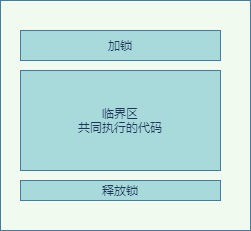
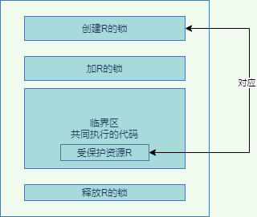
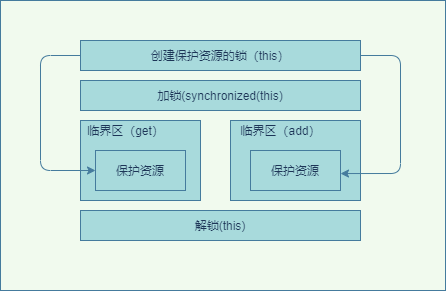

## 1. 开头
&emsp;&emsp;我们在前面已经说过，并发问题其中有个原子性所导致。  
所谓原子性即：一个或者多个操作在 CPU 执行的过程中不被中断的特性。比如long 型变量在 32 位机器上就可能因为一次操作被操作系统拆为两次执行了。  
  
* 单核时代  
  同一时刻只有一个线程执行，禁止 CPU 中断，意味着操作系统不会重新调度线程，也就是禁止了线程切换，获得 CPU 使用权的线程就可以不间断地执行，所以两次写操作一定是：要么都被执行，要么都没有被执行，具有原子性  
* 多核时代  
  同一时刻，有可能有两个线程同时在执行，一个线程执行在 CPU-1 上，一个线程执行在 CPU-2 上，此时禁止 CPU 中断，只能保证 CPU 上的线程连续执行，并不能保证同一时刻只有一个线程执行，如果这两个线程同时写 long 型变量高 32 位的话，那就有可能出现诡异的问题了。

&emsp;&emsp;同一时刻只有一个线程执行”这个条件非常重要，我们称之为互斥。如何来保证线程间的互斥，这里引入了锁模型。  

## 2. 互斥锁模型
&emsp;&emsp;线程在进入临界区之前，首先尝试加锁 lock()，如果成功，则进入临界区，此时我们称这个线程持有锁；否则呢就等待，直到持有锁的线程解锁；持有锁的线程执行完临界区的代码后，执行解锁 unlock()。  
  
当然，上面是简单的锁模型，现实之中，锁一定是对应一种受保护的资源的，所以更详细的所模型如图所示  

* 为保护资源 R 就得为它创建一把锁 LR
* 临界区时添上加锁操作和解锁操作
* 受保护资源和锁是有一个关联关系的  

## 3. java的互斥锁实现  
我们这里再回顾一下原子性导致的线程安全问题。  
```
class Cal {
  long value = 0L;
  long get() {
    return value;
  }
  void add() {
    value += 1;
  }
}
```
如上代码，多线程调用add，value添加不是原子的，会导致和预期结果不一致
### 3.1. synchronized关键字  
我们对以上的代码加上synchronized关键，那么同一时刻只有一个线程执行内部的代码。
```
class Cal {
  long value = 0L;
  long get() {
    return value;
  }
 synchronized void add() {
    value += 1;
  }
}
```
多个线程同时执行 add() 方法，可见性是可以保证的，也就说如果有 1000 个线程执行 add() 方法，最终结果一定是 value 的值增加了 1000  
**注意：get() 方法并没有加锁操作，所以可见性没法保证，如何解决呢？其实也是 get() 方法也 synchronized 一下**
  

### 3.2. 锁与受保护资源
受保护资源和锁之间的关联关系是 N:1 的关系，如上面的例子，get和add都是资源，但是只有一把锁（this） ，但是需要注意如果例子是  
```
class Cal {
  long static value = 0L;
  synchronized long get() {
    return value;
  }
 synchronized static void add() {
    value += 1;
  }
}
```
如上的代码的成员变量是long static value = 0L;是静态变量，synchronized static void add()是静态方法，那么就会出现get的可见性问题。
因为出现了两把锁， this、SafeCalc.class

**PS：加锁本质就是在锁对象的对象头中写入当前线程id, sync锁的对象monitor指针指向一个ObjectMonitor对象，所有线程加入他的entrylist里面，去cas抢锁，更改state加1拿锁，执行完代码，释放锁state减1，和aqs机制差不多，只是所有线程不阻塞，cas抢锁，没有队列，属于非公平锁。
wait的时候，线程进waitset休眠，等待notify唤醒**

### 3.3. 小结
&emsp;&emsp;synchronized 是 Java 在语言层面提供的互斥原语，其实 Java 里面还有很多其他类型的锁，但是原理都是锁模型，只是加锁和释放锁方式不一样