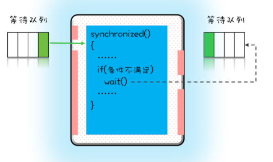

## 1. 等待-通知机制
&emsp;&emsp;当我们在互斥锁内访问一个在资源的时候，如果资源不可用，需要等待，而这个等待不可以占用系统cpu资源，有什么办法可以解决呢？  
可以使用java的等待-通知机制  
## 2. synchronized实现
### 2.1. synchronized的wait
&emsp;&emsp;当有一个线程进入临界区后，其他线程就只能进入该锁的一个等待队列，当那个进入临界区的的线程因为条件不满足，调用wati后，当前线程会释放锁，也进入到**另一个等待队列**中，即处于阻塞状态，其它线程有机会获取到锁，进入临界区了。  
  
&emsp;&emsp;之前的那个线程要进行的条件满足了怎么办呢，可以使用notify()、notifyAll() ，会通知那个等待队列的线程，告诉它条件已经满足了。它们被激活重新要获取互斥锁了。但是要注意可能进入条件判断的时候，条件又不满足，因为满足时之前的判断，有可能被其它的线程抢占了。    


### 2.2. notify、notifyAll
&emsp;&emsp;notify() 是会随机地通知等待队列中的一个线程，而 notifyAll() 会通知等待队列中的所有线程。notify()使用有风险，有可能某些线程永远不会被通知到，所以我们尽量使用 notifyAll()

**注意： wait()、notify()、notifyAll() 一定是在synchronized内部被锁对象调用，否则被jvm抛出IllegalMonitorStateException异常**

### 2.3. 经典示例
```
class Allocator {
  private List<Object> als;
  // 一次性申请所有资源
  synchronized void apply(
    Object from, Object to){
    // 经典写法
    while(als.contains(from) ||
         als.contains(to)){
      try{
        wait();
      }catch(Exception e){
      }   
    } 
    als.add(from);
    als.add(to);  
  }
  // 归还资源
  synchronized void free(
    Object from, Object to){
    als.remove(from);
    als.remove(to);
    notifyAll();
  }
}
```
PS：wait与sleep都会放弃CPU，等待再次调度，但是有很多区别的？  
* wait会释放锁而sleep不会释放锁资源
* wait只能在同步方法和同步块中使用，而sleep任何地方都可以
* wait无需捕捉异常，而sleep需要
* sleep是Thread的方法，而wait是Object类的方法