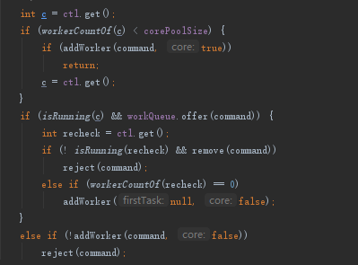

## 1. Java线程池  
java的线程池就是一个任务执行器，它有submit（有返回值）和excute（无返回值）两种提交任务的方式。

## 2. 线程池功能  
* Shutdown方法，停止接收新任务，等待所有的任务执行完后，关闭线程池。
* ShutdownNow，停止接收新任务，任务都关闭。
* Excutors提供了四种创建线程的方法
* newSingleThreadExecutor，单线程池
* newFixedThreadPool，固定大小的线程池，队列无限大
* newCachedThreadPool，可缓存的线程池，核心为0，线程数无线大，但可以回收。
* newScheduledThreadPool，支持时间和周期的线程池  

## 3. 线程池原理
  
### 3.1. 执行流程
* 提交任务时，判断当前线程数是否小于核心数，如果小于则创建线程，并作为核心数。
* 线程数大于核心数，添加至队列
* 线程数大于核心数，队列满了，尝试新增新增线程设置为非核心，如果成功返回，不成功则拒绝。  
  
**注意：由此可见只有阻塞队列满了后，才会创建非核心线程**     

### 3.2. 线程池参数  
* corePoolSize：核心线程数
* maximumPoolSize：最大线程数，当队列放不下了，新增的线程加上核心线程数不大于这个数
* workQueue：当任务数大于这个核心线程数就会放入阻塞队列中了
* keepAliveTime：新增的非核心线程数空闲时间
* threadFactory：创建线程时可以定义创建线程的属性
* Handler：当队列放不下了，也无法创建非核心线程了，就会被拒绝，拒绝后的策略的定义

### 3.3. 线程池的队列
线程池是使用阻塞队列来实现缓存
ArrayBlockingQueue（数组）、LinkedBlockingQueue（链表）、PriorityBlockingQueue（顺序）、SynchronizedQueue（交替）

### 3.4. 拒绝策略
线程默认是抛异常策略，还可以指定丢且任务、丢弃队列最前面的任务并提交新任务、使用发起者线程处理任务这三种策略。

### 3.5. 线程池设计思想
线程池为什么设计为队列满+核心线程数满了才创建新线程？  
Java原生线程池偏向cpu密集，如果创建过多的线程反而会降低整体效率，所以优先将其缓冲下来。最大线程数这个参数更像是无奈之举，在最坏的情况下做最后的努力，去新建线程去帮助消化任务。出现需要额外增加线程的事件会少，所以是最坏的情况下创建一些线程来帮助处理，大部分都用核心线程数处理。  

## 4. 总结