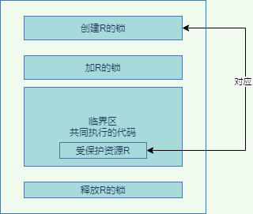
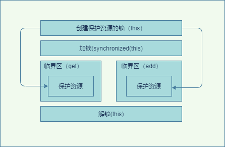
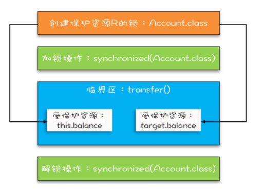
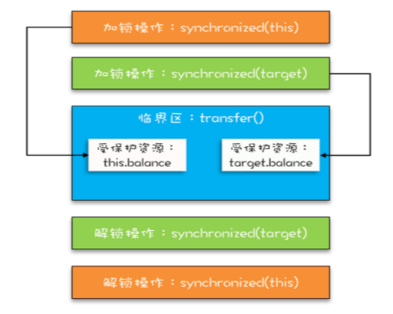

## 1. 开头
&emsp;&emsp;我们在前面已经说过，并发问题其中有个原子性所导致。  
所谓原子性即：一个或者多个操作在 CPU 执行的过程中不被中断的特性。比如long 型变量在 32 位机器上就可能因为一次操作被操作系统拆为两次执行了。  
  

* 单核时代  
  同一时刻只有一个线程执行，禁止 CPU 中断，意味着操作系统不会重新调度线程，也就是禁止了线程切换，获得 CPU 使用权的线程就可以不间断地执行，所以两次写操作一定是：要么都被执行，要么都没有被执行，具有原子性  
* 多核时代  
  同一时刻，有可能有两个线程同时在执行，一个线程执行在 CPU-1 上，一个线程执行在 CPU-2 上，此时禁止 CPU 中断，只能保证 CPU 上的线程连续执行，并不能保证同一时刻只有一个线程执行，如果这两个线程同时写 long 型变量高 32 位的话，那就有可能出现诡异的问题了。

&emsp;&emsp;同一时刻只有一个线程执行”这个条件非常重要，我们称之为互斥。如何来保证线程间的互斥，这里引入了锁模型。  

## 2. 互斥锁模型
&emsp;&emsp;线程在进入临界区之前，首先尝试加锁 lock()，如果成功，则进入临界区，此时我们称这个线程持有锁；否则呢就等待，直到持有锁的线程解锁；持有锁的线程执行完临界区的代码后，执行解锁 unlock()。  
  
当然，上面是简单的锁模型，现实之中，锁一定是对应一种受保护的资源的，所以更详细的所模型如图所示  


* 为保护资源 R 就得为它创建一把锁 LR
* 临界区时添上加锁操作和解锁操作
* 受保护资源和锁是有一个关联关系的  

## 3. java使用互斥锁  
我们这里再回顾一下原子性导致的线程安全问题。  
```
class Cal {
  long value = 0L;
  long get() {
    return value;
  }
  void add() {
    value += 1;
  }
}
```
如上代码，多线程调用add，value添加不是原子的，会导致和预期结果不一致
### 3.1. synchronized关键字  
我们对以上的代码加上synchronized关键，那么同一时刻只有一个线程执行内部的代码。
```
class Cal {
  long value = 0L;
  long get() {
    return value;
  }
 synchronized void add() {
    value += 1;
  }
}
```
多个线程同时执行 add() 方法，可见性是可以保证的，也就说如果有 1000 个线程执行 add() 方法，最终结果一定是 value 的值增加了 1000  
**注意：get() 方法并没有加锁操作，所以可见性没法保证，如何解决呢？其实也是 get() 方法也 synchronized 一下**
  

### 3.2. 锁与受保护资源
受保护资源和锁之间的关联关系是 N:1 的关系，如上面的例子，get和add都是资源，但是只有一把锁（this） ，但是需要注意如果例子是  
```
class Cal {
  long static value = 0L;
  synchronized long get() {
    return value;
  }
 synchronized static void add() {
    value += 1;
  }
}
```
如上的代码的成员变量是long static value = 0L;是静态变量，synchronized static void add()是静态方法，那么就会出现get的可见性问题。
因为出现了两把锁， this、SafeCalc.class

**PS：加锁本质就是在锁对象的对象头中写入当前线程id, sync锁的对象monitor指针指向一个ObjectMonitor对象，所有线程加入他的entrylist里面，去cas抢锁，更改state加1拿锁，执行完代码，释放锁state减1，和aqs机制差不多，只是所有线程不阻塞，cas抢锁，没有队列，属于非公平锁。
wait的时候，线程进waitset休眠，等待notify唤醒**


`在释放锁之前一定会将数据写回主内存`：
 一旦一个代码块或者方法被Synchronized所修饰，那么它执行完毕之后，被锁住的对象所做的任何修改都要在释放之前，从线程内存写回到主内存。也就是说他不会存在线程内存和主内存内容不一致的情况。
 `在获取锁之后一定从主内存中读取数据`：
 同样的，线程在进入代码块得到锁之后，被锁定的对象的数据也是直接从主内存中读取出来的，由于上一个线程在释放的时候会把修改好的内容回写到主内存，所以线程从主内存中读取到数据一定是最新的。
 就是通过这样的原理，Synchronized关键字保证了我们每一次的执行都是可靠的，它保证了可见性

### 3.2.1. 细粒度锁
&emsp;&emsp;synchronized 是 Java 在语言层面提供的互斥原语，其实 Java 里面还有很多其他类型的锁，但是原理都是锁模型，只是加锁和释放锁方式不一样。这里需要非常注意受保护资源和锁之间合理的关联关系应该是 N:1 的关系，切记不能用多把锁来保护一个资源，但是需要使用不同的锁对受保护资源进行精细化管理，能够提升性能，而这种锁就叫做细粒度锁。 如下面的代码就是密码和余额是两个锁保护，也可以用同一把锁，但是会造成性能很差。 
```
class Account {
  // 锁：保护账户余额
  private final Object balLock
    = new Object();
  // 账户余额  
  private Integer balance;
  // 锁：保护账户密码
  private final Object pwLock
    = new Object();
  // 账户密码
  private String password;
 
  // 取款
  void withdraw(Integer amt) {
    synchronized(balLock) {
      if (this.balance > amt){
        this.balance -= amt;
      }
    }
  } 
  // 查看余额
  Integer getBalance() {
    synchronized(balLock) {
      return balance;
    }
  }
 
  // 更改密码
  void updatePassword(String pw){
    synchronized(pwLock) {
      this.password = pw;
    }
  } 
  // 查看密码
  String getPassword() {
    synchronized(pwLock) {
      return password;
    }
  }
}
```
**注意：不能用可变对象做锁，如使用balance、password就不能当作锁，因为可能它们的值会发生变化。**

### 3.2.1. 有关联的资源锁
```
class Account {
  private int balance;
  // 转账
  synchronized void transfer(
      Account target, int amt){
    if (this.balance > amt) {
      this.balance -= amt;
      target.balance += amt;
    }
  } 
}
```
如上代码如果多线程进行转账操作，那么就会有安全问题，this 这把锁可以保护自己的余额 this.balance，却保护不了别人的余额 target.balance ，正确的方式应该是：
```
class Account {
  private Object lock；
  private int balance;
  private Account();
  // 创建 Account 时传入同一个 lock 对象
  public Account(Object lock) {
    this.lock = lock;
  } 
  // 转账
  void transfer(Account target, int amt){
    // 此处检查所有对象共享的锁
    synchronized(lock) {
      if (this.balance > amt) {
        this.balance -= amt;
        target.balance += amt;
      }
    }
  }
}
```
或者
```
lass Account {
  private int balance;
  // 转账
  void transfer(Account target, int amt){
    synchronized(Account.class) {
      if (this.balance > amt) {
        this.balance -= amt;
        target.balance += amt;
      }
    }
  } 
}
```
用 Account.class 作为共享的锁。Account.class 是所有 Account 对象共享的,无需在创建 Account 对象时传入了，代码更简单  
  

### 3.3. 小结
**如上图所示，有关联关系的资源需要用一把相同的锁才可以保证其安全性。因为两个资源都要操作，而这个操作需要保证其原子性，需要其中间状态对外不可见，不可以多个线程同时操作这些资源，用同一把锁就可以保证了对其它线程的隔离了。当然如果资源之间没有关系，很好处理，每个资源一把锁就可以了**

## 4. 死锁  
接着上一个例子，如果转账使用Account.class对象作为锁，那么所有的转账都是同一把锁，性能会很差，因为转账操作都是串行的。如何来解决这个问题呢？
### 4.1. 锁拆分
这里有两个有关联的资源，我们可以用两把锁来分别锁这两个资源，转出账户要操作时，将转出的账户锁住，别的线程就无法使用转出账户了，然后继续操作转入账户，先要获取锁，如果这个锁在操作那么就需要等待了。这种锁就是细粒度锁。使用细粒度锁可以提高并行度，是性能优化的一个重要手段。
```
class Account {
  private int balance;
  // 转账
  void transfer(Account target, int amt){
    // 锁定转出账户
    synchronized(this) { ①        A
      // 锁定转入账户
      synchronized(target) {           
        if (this.balance > amt) { ②
          this.balance -= amt;
          target.balance += amt;
        }
      }
    }
  } 
}
```


### 4.2. 死锁场景
使用细粒度锁是有代价的，这个代价就是可能会导致死锁，具体步骤为：
* T1 执行账户 A 转账户 B 的操作，账户 A.transfer(账户 B)；
* 同时线程 T2 执行账户 B 转账户 A 的操作，账户 B.transfer(账户 A)。
* 当 T1 和 T2 同时执行完①处的代码时，T1 获得了账户 A 的锁（对于 T1，this 是账户 A）
* 而 T2 获得了账户 B 的锁（对于 T2，this 是账户 B）。
* 之后 T1 和 T2 在执行②处的代码时，T1 试图获取账户 B 的锁时，发现账户 B 已经被锁定（被 T2 锁定），所以 T1 开始等待；
* T2 则试图获取账户 A 的锁时，发现账户 A 已经被锁定（被 T1 锁定），所以 T2 也开始等待。
* 于是 T1 和 T2 会无期限地等待下去，也就是我们所说的死锁了
  
### 4.3. 死锁预防
如果发生了死锁，没有特别好的方法取解决，只能时重启或者放弃一个线程。如何来预防死锁呢？
有大佬总结了这几项可以预防死锁的发生

#### 4.3.1. 破坏占用且等待条件
如转账的操作，如果进行转账，两把锁必须都能获取到，任意一把锁被别人占有，那么就不能进入临界区。因此需要引入一个"管理员"Allocator的角色来管理锁
```
class Allocator {
  private List<Object> als =
    new ArrayList<>();
  // 一次性申请所有资源
  synchronized boolean apply(
    Object from, Object to){
    if(als.contains(from) ||
         als.contains(to)){
      return false;  
    } else {
      als.add(from);
      als.add(to);  
    }
    return true;
  }
  // 归还资源
  synchronized void free(
    Object from, Object to){
    als.remove(from);
    als.remove(to);
  }
}
 
class Account {
  // actr 应该为单例
  private Allocator actr;
  private int balance;
  // 转账
  void transfer(Account target, int amt){
    // 一次性申请转出账户和转入账户，直到成功
    while(!actr.apply(this, target))
      ；
    try{
      // 锁定转出账户
      synchronized(this){              
        // 锁定转入账户
        synchronized(target){           
          if (this.balance > amt){
            this.balance -= amt;
            target.balance += amt;
          }
        }
      }
    } finally {
      actr.free(this, target)
    }
  } 
}
```
如上的代码Allocator保持单例，如果有任意的要操作的对象在list之中，那么就会一直等待。
synchronized(Account.class) 锁了Account类相关的所有操作。相当于文中说的包场了，只要与Account有关联，通通需要等待当前线程操作完成。while死循环的方式只锁定了当前操作的两个相关的对象。两种影响到的范围不同

#### 4.3.2. 破坏不可抢占条件
java.util.concurrent 提供了lock等锁可以主动释放等待
#### 4.3.3. 破坏循环等待条件
对资源进行排序，然后按序申请资源,比如id小的总是先获取锁，那么就不存在互相获取锁的问题了。
```
class Account {
  private int id;
  private int balance;
  // 转账
  void transfer(Account target, int amt){
    Account left = this        ①
    Account right = target;    ②
    if (this.id > target.id) { ③
      left = target;           ④
      right = this;            ⑤
    }                          ⑥
    // 锁定序号小的账户
    synchronized(left){
      // 锁定序号大的账户
      synchronized(right){ 
        if (this.balance > amt){
          this.balance -= amt;
          target.balance += amt;
        }
      }
    }
  } 
}
```

## 5. 总结
如何保证多线程的原子性问题呢，需要通过互斥锁来保证资源隔离，而互斥锁的粒度越大性能越差，比如class对象作为锁相当于全局串行执行了，于是使用多把锁来分别锁住对应的资源，但是如果出现了循环调用就可能导致死锁，为了避免死锁，有三种解决方法，即 资源级别的串行、固定顺序锁、使用能够自己释放的锁。总而言之使用锁的时候需要密切注意是否会发生死锁。