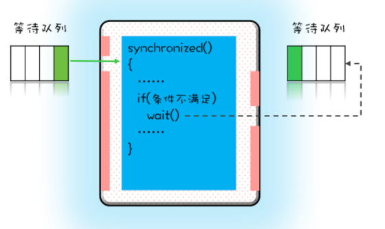
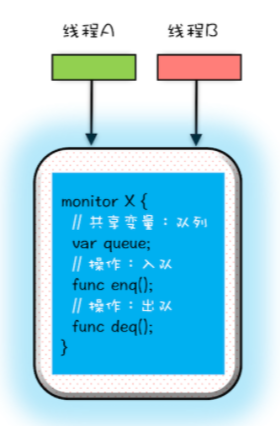
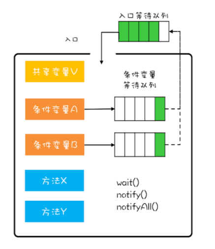

## 1. 等待-通知机制介绍
&emsp;&emsp;当我们在互斥锁内访问一个在资源的时候，如果资源不可用，需要等待，而这个等待不可以占用系统cpu资源，有什么办法可以解决呢？  
可以使用java的等待-通知机制  

## 2. synchronized实现
### 2.1. synchronized的wait
&emsp;&emsp;当有一个线程进入临界区后，其他线程就只能进入该锁的一个等待队列，当那个进入临界区的的线程因为条件不满足，调用wati后，当前线程会释放锁，也进入到**另一个等待队列**中，即处于阻塞状态，其它线程有机会获取到锁，进入临界区了。  
  
&emsp;&emsp;之前的那个线程要进行的条件满足了怎么办呢，可以使用notify()、notifyAll() ，会通知那个等待队列的线程，告诉它条件已经满足了。它们被激活重新要获取互斥锁了。但是要注意可能进入条件判断的时候，条件又不满足，因为满足时之前的判断，有可能被其它的线程抢占了。    


### 2.2. notify、notifyAll
&emsp;&emsp;notify() 是会随机地通知等待队列中的一个线程，而 notifyAll() 会通知等待队列中的所有线程。notify()使用有风险，有可能某些线程永远不会被通知到，所以我们尽量使用 notifyAll()

**注意： wait()、notify()、notifyAll() 一定是在synchronized内部被锁对象调用，否则被jvm抛出IllegalMonitorStateException异常**

### 2.3. 经典示例
```
class Allocator {
  private List<Object> als;
  // 一次性申请所有资源
  synchronized void apply(
    Object from, Object to){
    // 经典写法
    while(als.contains(from) ||
         als.contains(to)){
      try{
        wait();
      }catch(Exception e){
      }   
    } 
    als.add(from);
    als.add(to);  
  }
  // 归还资源
  synchronized void free(
    Object from, Object to){
    als.remove(from);
    als.remove(to);
    notifyAll();
  }
}
```
PS：wait与sleep都会放弃CPU，等待再次调度，但是有很多区别的？  
* wait会释放锁而sleep不会释放锁资源
* wait只能在同步方法和同步块中使用，而sleep任何地方都可以
* wait无需捕捉异常，而sleep需要
* sleep是Thread的方法，而wait是Object类的方法

## 2. 管程（monitor）   
​	管程，对应的英文是 Monitor,也称之为监视器, 指的是管理共享变量以及对共享变量的操作过程,让他们支持并发

​	操作系统原理课程告诉我，用信号量能解决所有并发问题。而管程和信号量是等价的，所谓等价指的是用管程能够实现信号量，也能用信号量实现管程。但是管程更容易使用，所以 Java 选择了管程。      

### 2.1. 管程模型     
&emsp;&emsp;在管程的发展史上，先后出现过三种不同的管程模型，分别是：Hasen 模型、Hoare 模型和 MESA 模型。Java 管程的实现参考的也是 MESA 模型。   
&emsp;&emsp;管程需要保证同一时刻只有一个线程操作共享变量即互斥，第二个需要与其它的线程通讯即通知等待。管程是如何做到的呢？  
#### 2.1.1. mesa模型
      
如图所示，管程 X 将共享变量 queue 这个队列和相关的操作入队 enq()、出队 deq() 都封装起来了；线程 A 和线程 B 如果想访问共享变量 queue，只能通过调用管程提供的 enq()、deq() 方法来实现；enq()、deq() 保证互斥性，只允许一个线程进入管程。这样解决了互斥问题。  
这种模型如何解决线程间的同步问题呢，答案是条件变量队列,每个条件变量都对应有一个等待队列,这个和之前的synchronized的例子很像的
     
**注意：当线程满足条件会从等待队列里面出来，但是出来之后不是马上执行，而是重新进入到入口等待队列里面**  
PS:语言内置的管程（synchronized）对 MESA 模型进行了精简。MESA 模型中，条件变量可以有多个，Java 语言内置的管程里只有一个条件变量，Java SDK 并发包实现的管程支持多个条件变量，不过并发包里的锁，需要开发人员自己进行加锁和解锁操作
#### 2.1.2. mesa模型例子
这里实现了一个阻塞队列，队列就是共享变量，但是有不同的条件，为空的话，出队需要阻塞，满了话，入队需要阻塞，这里就有两个条件变量. 
```
public class BlockedQueue<T>{
  final Lock lock =
    new ReentrantLock();
  // 条件变量：队列不满  
  final Condition notFull =
    lock.newCondition();
  // 条件变量：队列不空  
  final Condition notEmpty =
    lock.newCondition();
 
  // 入队
  void enq(T x) {
    lock.lock();
    try {
      while (队列已满){
        // 等待队列不满 
        notFull.await();
      }  
      // 省略入队操作...
      // 入队后, 通知可出队
      notEmpty.signal();
    }finally {
      lock.unlock();
    }
  }
  // 出队
  void deq(){
    lock.lock();
    try {
      while (队列已空){
        // 等待队列不空
        notEmpty.await();
      }
      // 省略出队操作...
      // 出队后，通知可入队
      notFull.signal();
    }finally {
      lock.unlock();
    }  
  }
}
```
这段示例代码中，使用了Java并发包里面的 Lock 和 Condition。这里的关键点为：
* 对于入队操作，如果队列已满，就需要等待直到队列不满，所以这里用了notFull.await();。
* 对于出队操作，如果队列为空，就需要等待直到队列不空，所以就用了notEmpty.await();。
* 如果入队成功，那么队列就不空了，就需要通知条件变量：队列不空notEmpty对应的等待队列。
* 如果出队成功，那就队列就不满了，就需要通知条件变量：队列不满notFull对应的等待队列。

#### 2.1.3. 唤醒方式
除非经过深思熟虑，否则尽量使用 notifyAll()，除非满足三个条件可以是使用notify() ：  
* 所有等待线程拥有相同的等待条件；
* 所有等待线程被唤醒后，执行相同的操作；
* 只需要唤醒一个线程。


### 2.2. 模型对比  
**对于 MESA 管程来说，有一个编程范式，就是需要在一个 while 循环里面调用 wait()。这个是 MESA 管程特有的，因为被唤醒后只是进入阻塞队列，不一定能立即执行**。这是因为不同的模型执行顺序不一样。
* Hasen 模型里面，要求 notify() 放在代码的最后，这样 T2 通知完 T1 后，T2 就结束了，然后 T1 再执行，这样就能保证同一时刻只有一个线程执行。
* Hoare 模型里面，T2 通知完 T1 后，T2 阻塞，T1 马上执行；等 T1 执行完，再唤醒 T2，也能保证同一时刻只有一个线程执行。但是相比 Hasen 模型，T2 多了一次阻塞唤醒操作。
* MESA 管程里面，T2 通知完 T1 后，T2 还是会接着执行，T1 并不立即执行，仅仅是从条件变量的等待队列进到入口等待队列里面。这样做的好处是 notify() 不用放到代码的最后，T2 也没有多余的阻塞唤醒操作。但是也有个副作用，就是当 T1 再次执行的时候，可能曾经满足的条件，现在已经不满足了，所以需要以循环方式检验条件变量。


### 3. 总结
​	为了保证同一时刻只有一个线程操作共享变量即互斥并且能够精细管理线程之间协作，降低锁的粒度能够等待唤醒其它线程，java利用管程的模型设计了一系列的方法来实现多线程编程。

