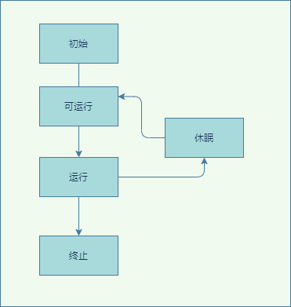
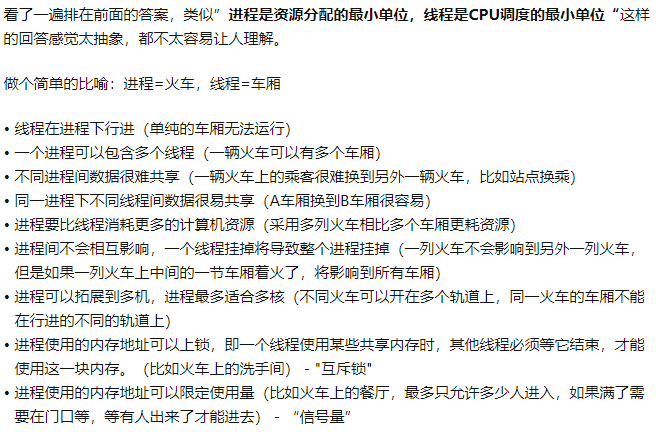
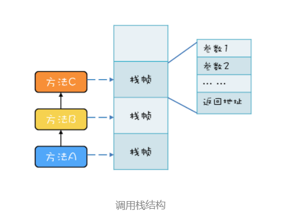
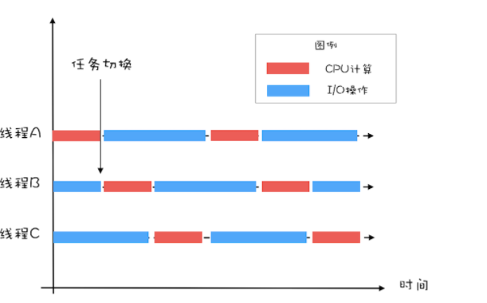

## 1. java线程生命周期
### 1.1. 线程的概念
线程是操作系统里的一个概念，不同的开发语言如 Java等都对其进行了封装，线程和时间有关，它有一个生命周期。我们只需要关注线程状态的转换就可以。线程是一个通用性的概念。  
  
* 初始状态，编程语言的创建，此刻操作系统还没有创建
* 可运行状态，可以分配 CPU 执行
* 有空闲的 CPU 时，操作系统会将其分配给一个处于可运行状态的线程
* 如果调用一个阻塞的 API，线程的状态就会转换到休眠状态，同时释放 CPU 使用权，休眠状态的线程永远没有机会获得 CPU 使用权，当等待的事件出现了，线程就会从休眠状态转换到可运行状态。
* 线程执行完或者出现异常就会进入终止状态，线程的生命周期就结束了。

#### 1.1.1. 线程与进程的区别？
进程是操作系统分配资源的最小单位，线程是cpu执行的最小单位  


#### 1.1.2. 守护线程
当把jvm所有的线程都是守护线程时，jvm会关闭。

#### 1.1.3. java线程常见方法
* Thread（class方法）  
  Sleep、currentthread、name、daeam、Thread.yield()、t.join（等待t的线程执行完）
* Thread对象  
  wait、wait(xxx)、notify、notifyall、Wait。当前线程变成unrunable，并释放该线程持有这个对象的锁。Notify，通知在这个对象unrunable的一个线程就绪，notifyall是所有的

**注意：notify/notifyAll/wait等方法存在于顶级对象Object中的原因，在使用这3个方法时，必须处于synchronized代码块或者synchronized方法中，否则就会抛出IllegalMonitorStateException异常**

* Callable  
  实现callable的线程task，可以有返回值，标准的线程是没有返回值的。


### 1.2. java线程状态
java语言对操作系统的线程进行了进一步的封装，新增了几个状态，一共有：
* NEW（初始化状态）
* RUNNABLE（可运行 / 运行状态）
* BLOCKED（阻塞状态）
* WAITING（无时限等待）
* TIMED_WAITING（有时限等待）
* TERMINATED（终止状态）  
  

其实上面的阻塞或者等待状态都是属于操作系统的休眠状态（BLOCKED、WAITING、TIMED_WAITING ），只是说java对这几种状态的转换机制做了区分，只要我们理解它们转换状态的机制，就能记住这些状态。  
### 1.3. java线程的流转  
#### 1.3.1. new->runnable  
java刚创建出来的 Thread 对象就是 NEW 状态，java创建线程有两种方法。一种是继承thread，另一种是实现runaable接口，此时但操作系统还没有感知到，需要调用线程对象的start的方法。然后就转变为RUNNABLE。
```
// Task
class Task implements Runnable {
  @Override
  public void run() {
    //do something
  }
}
Thread thread = new Thread(new Task());
```
#### 1.3.2. runnable->blocked  
只有一种场景会触发这种转换，就是线程等待 synchronized 的隐式锁。即：
* synchronized 修饰的代码执行时，代码块同一时刻只允许一个线程执行，其他线程只能等待，等待的线程就会从 RUNNABLE 转换到 BLOCKED 状态
* 等待的线程获得 synchronized 隐式锁时，就又会从 BLOCKED 转换到 RUNNABLE 状态    

**注意：线程调用阻塞式 API 时，是否会转换到 BLOCKED 状态呢？在操作系统层面，线程是会转换到休眠状态的，但是在 JVM 层面，Java 线程的状态不会发生变化，也就是说 Java 线程的状态会依然保持 RUNNABLE 状态。JVM 层面并不关心操作系统调度相关的状态**
#### 1.3.3. runnable->WAITING
一共有三个场景会产生该转换：  
*  synchronized 隐式锁的线程，调用无参数的 Object.wait() 
* 调用无参数的 ThreadA.join() 方法,意思就是当前线程，使用threadA调用join（）方法，threadA线程没有执行完，会watting阻塞，直到执行完毕。
* LockSupport.park()，当前线程会阻塞，线程的状态会从 RUNNABLE 转换到 WAITING，并发包中的锁都是基于它实现的，LockSupport.unpark(Thread thread) 可唤醒目标线程，目标线程的状态又会从 WAITING 状态转换到 RUNNABLE

#### 1.3.4. runnable -> TIMED_WAITING。  
这个一共有5种场景可以转化
* Thread.sleep(long millis) 
* 获取了synchronized的隐式锁后，Object.wait(long timeout) 
* Thread.join(long millis) 
* 调用带超时参数的 LockSupport.parkNanos(Object blocker, long deadline) 方法
* 调用带超时参数的 LockSupport.parkUntil(long deadline) 
  

所以这里 TIMED_WAITING 和 WAITING 状态的区别就是是否有超时事件

#### 1.3.5. runnable -> TERMINATED
如果一个线程种由异常抛出会导致线程终止，会进入这个状态，或者比如我们一个线程等待网络读写，有时候不希望它一直等下去，想直接终止如何做呢？  
* stop方法, 该会直接终止线程，不过不建议使用了。  
  这个操作很危险，比如线程持有一个ReentrantLock锁，正常情况下，需要释放锁的，但是直接终止会释放不了锁，后面其它的线程将凉凉了。  类似于suspend() 、resume() 都不建议去使用了。  

**PS：隐式锁还是可以释放滴。block不能响应中断。**
* interrupt()方法， 当调用了线程的interrupt的方法，将会告知线程你被中断了，你看着办吧。java由两种方式告知
  * 异常通知，比如调用wait()、join()、sleep() 方法就会要捕获一个InterruptedException异常，如果出现了该异常，就代表该线程被终止了，你需要处理后事了
  * 自己检测，如果方法没有这种方法调用，可以在线程的代码中检测isInterrupted()是否为true，代表线程被终止了.
  

**注意：抛出interrupt异常后，中断标示会自动清除掉变成false,即isInterrupted为false**

### 1.4. java线程的局部变量  
Java 方法里面的局部变量是否存在并发问题？  
答案是完全没有，因为每个线程都有自己的调用栈，局部变量保存在线程各自的调用栈里面，不会共享，所以自然也就没有并发问题  
  
PS：这里补充一下栈溢出原因：  
每调用一个方法就会在栈上创建一个栈帧，方法调用结束后就会弹出该栈帧，而栈的大小不是无限的，所以递归调用次数过多的话就会导致栈溢出。而递归调用的特点是每递归一次，就要创建一个新的栈帧，而且还要保留之前的环境（栈帧），直到遇到结束条件。所以递归调用一定要明确好结束条件，不要出现死循环，而且要避免栈太深。

## 2. 系统线程设计  

### 2.1 系统性能指标
我们衡量一个系统的好坏，一般有两个核心指标：吞吐量和延迟；一个是空间维度，一个是时间维度。同等条件下延迟越低、吞吐量越大。我们如何来提升这两个指标呢？  
一般有两个方向来去优化：
* 加快处理速度
* 压榨机器性能
### 2.2 小结
&emsp;&emsp;io密集型的：最佳线程数 =CPU 核数 * [ 1 +（I/O 耗时 / CPU 耗时）]，这样就能把硬件的压榨到极值。压测时，我们需要重点关注 CPU、I/O 设备的利用率和性能指标（响应时间、吞吐量）之间的关系。  
PS：有的经验为IO密集型的线程数为配置：2 * CPU 的核数 + 1，定性的io密集或者cpu密集很难在定量的维度上反应出性能瓶颈，而且公式上忽略了线程数增加带来的cpu消耗，性能优化还是要定量比较好，这样不会盲目，比如io已经成为了瓶颈，增加线程或许带来不了性能提升，这个时候是不是可以考虑用cpu换取带宽，压缩数据，或者逻辑上少发送一些。

## 3. 总结   
本篇了解了线程的状态和java线程的状态已经它们的转换，最后对如何设计线程数做了一下简单的分析。