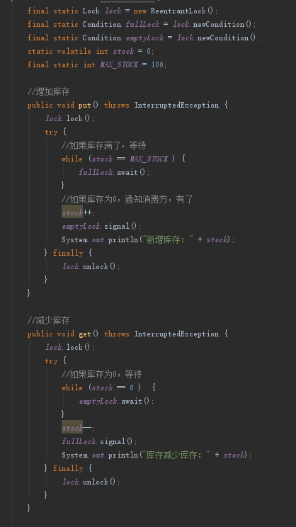
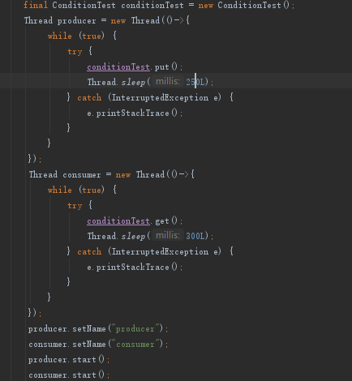
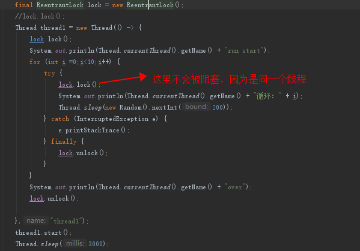
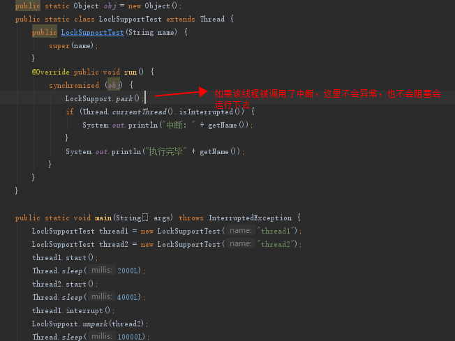
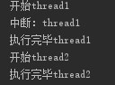

## 1. 背景

### 1.1. 为什么需要lock
&emsp;&emsp;在之前我们已经讨论过并发编程中需要解决重要问题主要有两种：互斥和同步；互斥可以使用各种互斥锁。同步也叫做线程协作，需要通过管程模型来实现，synchronized其实已经实现了管程模型。但是java sdk还提供了其它的管程工具。既然synchronized已经满足了，jdk为什么还提供了其它的工具呢？  
* synchronized，在以前性能很长，不过1.6以后已经优化过来了
* 死锁问题的解决方案， synchronized 申请资源的时候，如果申请不到，线程直接进入阻塞状态了，而线程进入阻塞状态，啥都干不了，也释放不了线程已经占有的资源
  
&emsp;&emsp;总的来说，synchronized不够灵活，粒度不够小，如果需要支持更高的性能，则需要将锁的粒度设置的更小，java提供了locks相关的功能，帮助开发者更加方便和灵活的控制需要加锁的部分。  

&emsp;&emsp;jdk重新设计一把互斥锁去解决这个问题？jdk设计下的互斥 锁方案主要有如下特点？  
* 能够响应中断，如果果阻塞状态的线程能够响应中断信号，也就是说当我们给阻塞的线程发送中断信号的时候，能够唤醒它，那它就有机会释放曾经持有的锁 A。这样就破坏了不可抢占条件了
* 支持超时，如果等待时间超出时间限制返回错误
* 非阻塞获取锁，获取锁的时候，立马直到结果，不会阻塞  
* 支持条件变量
  
&emsp;&emsp;jdk的Lock接口就是弥补synchronized的问题的方案。  
### 1.2. lock的常用接口
```
// 支持中断的 API，线程如果处于sleep或者wait的时候，对线程进行Interrupt，会产生异常。这个方法会优先响应中断信号，即当被Interrupt后，会抛异常，如果catch了，run方法会继续执行。而lock()方法如果被打断，甚至说主线程已经运行完毕，子线程仍然在会阻塞住。
void lockInterruptibly() throws InterruptedException;
// 支持超时的 API
boolean tryLock(long time, TimeUnit unit) throws InterruptedException;
// 支持非阻塞获取锁的 API
boolean tryLock();
boolean tryLock();
//尝试获取锁，如果获取失败则返回false，也可以设置一个时间
void unlock();
//当前线程释放锁
Condition newCondition();
//先顶一个锁，通过这锁获取两个condition，condition可以交换使用，如下图的生产者和消费者使用condition的例子
```  
### 1.3. lock使用简单使用案例
    
  
  

## 2. lock的实现机制
### 2.1. lock的可见性保障
Java 里多线程的可见性是通过 Happens-Before 规则保证的，而 synchronized 之所以能够保证可见性，也是因为有一条 synchronized 相关的规则：synchronized 的解锁 Happens-Before 于后续对这个锁的加锁。如代码示例：
```
class X {
  private final Lock rtl =
  new ReentrantLock();
  int value;
  public void addOne() {
    // 获取锁
    rtl.lock();  
    try {
      value+=1;
    } finally {
      // 保证锁能释放
      rtl.unlock();
    }
  }
}
```
以上代码将没有并发问题，其原理为Happens-Before 规则：
* 顺序性规则：对于线程 T1，value+=1 Happens-Before 释放锁的操作 unlock()
* ReentrantLock，内部持有一个 volatile 的成员变量 state，获取锁的时候，会读写 state 的值；解锁的时候，也会读写 state 的值，也就是说，在执行 value+=1 之前，程序先读写了一次 volatile 变量 state，在执行 value+=1 之后，又读写了一次 volatile 变量 state。由于 state = 1 会先读取 state，所以线程 T1 的 unlock() 操作 Happens-Before 线程先于T2 的 lock() 操作。
*  传递性规则：线程 T1 的 value+=1 Happens-Before 线程 T2 的 lock() 操作
### 2.2. 可重入锁
&emsp;&emsp;所谓可重入锁，顾名思义，指的是线程可以重复获取同一把锁。ReentrantLock就是这种锁的具体实现。  
&emsp;&emsp;Java中一个可重入锁的实现为ReentrantLock，顾名思义，一个线程拿到一个锁后，同一个线程来获取同一把锁的时候是被放行的。Synchronized（object）也是一个可重入锁。下面代码截图是一个ReentrantLock重入的例子,Synchronized的例子类似。
ReentrantLock的构造方法中可以设置公平和非公平，公平代表获取锁的顺序可以根据申请的先后顺序，但是会带来额外的系统开销，非公平就是cpu自行选择。不指定就是默认非公平。具体的例子的代码就不贴出来了。
### 2.2.1. 可重入锁示例（一）

### 2.2.2. 可重入锁示例（二）
如下的代码：  
* 当某个线程1，走到了（1）加锁了
* 当内部调用需要get（）的时候，get也需要加锁
* 但是ReentrantLock是一个可重入锁，不会阻塞。如果锁 rtl 是不可重入的，那么线程 T1 此时会被阻塞
```
class X {
  private final Lock rtl =
  new ReentrantLock();
  int value;
  public int get() {
    // 获取锁
    rtl.lock();   （2）
    try {
      return value;
    } finally {
      // 保证锁能释放
      rtl.unlock();
    }
  }
  public void addOne() {
    // 获取锁
    rtl.lock();  
    try {
      value = 1 + get(); （1）
    } finally {
      // 保证锁能释放
      rtl.unlock();
    }
  }
}
```

### 2.3. 公平锁与非公平锁
&emsp;&emsp;如果使用ReentrantLock实现，之前说过，构造函数传入 true 就表示需要构造一个公平锁，反之则表示要构造一个非公平锁。我们在之前说过锁的外面有一个等待队列，一个线程没有获得锁，就会进入等待队列，公平锁，唤醒的策略就是谁等待的时间长，就唤醒谁，非公平锁就是不一定保证公平，有可能等待时间短的线程反而先被唤醒。

### 2.4. 使用lock原则
 Doug Lea说的：
* 永远只在更新对象的成员变量时加锁
* 永远只在访问可变的成员变量时加锁
* 永远不在调用其他对象的方法时加锁


## 3. 条件变量  
上一部分介绍了lock锁相关的机制，知道了lock对synchronized进行增强了3点，这个已经对管程的模型有了很好的实现了，但是管程模型中还涉及到了非常重要的条件变量，jdk是怎么做到的呢?  
答案是Condition 实现了管程模型里面的条件变量
### 3.1. 利用条件变量实现阻塞队列
```
public class BlockedQueue<T>{
  final Lock lock =
    new ReentrantLock();
  // 条件变量：队列不满  
  final Condition notFull =
    lock.newCondition();
  // 条件变量：队列不空  
  final Condition notEmpty =
    lock.newCondition();
 
  // 入队
  void enq(T x) {
    lock.lock();
    try {
      while (队列已满){
        // 等待队列不满
        notFull.await();
      }  
      // 省略入队操作...
      // 入队后, 通知可出队
      notEmpty.signal();
    }finally {
      lock.unlock();
    }
  }
  // 出队
  void deq(){
    lock.lock();
    try {
      while (队列已空){
        // 等待队列不空
        notEmpty.await();
      }  
      // 省略出队操作...
      // 出队后，通知可入队
      notFull.signal();
    }finally {
      lock.unlock();
    }  
  }
}
```  
这个代码在线程同步那一章已经进行了说明。  
在使用condition的时候，一定要注意设计唤醒线程，使用await()、signal()、signalAll()

### 3.2. 异步转同步
一般使用类似rpc框架的时候，使用的时候表面上看是同步调用，其实内部是做了异步转同步的操作，例如我们调用dubbo的rpc方法时，其实内部使用了DefaultFuture.get() 的机制，调用 get() 方法等待 RPC 返回结果  
```
public class DubboInvoker{
  Result doInvoke(Invocation inv){
    return currentClient 
      .request(inv, timeout)
      .get();
  }
}
```
* 当 RPC 返回结果之前，阻塞调用线程，让调用线程等待；
* 当 RPC 返回结果后，唤醒调用线程，让调用线程重新执行;

这个其实是管程的思想，没有数据先阻塞着，有了返回结果则被唤醒，返回数据， 和上面的阻塞队列非常像，有数据则返回，没有数据就等着。

```
// 创建锁与条件变量
private final Lock lock 
    = new ReentrantLock();
private final Condition done 
    = lock.newCondition();
 
// 调用方通过该方法等待结果
Object get(int timeout){
  long start = System.nanoTime();
  lock.lock();
  try {
	while (!isDone()) {
	  done.await(timeout);
      long cur=System.nanoTime();
	  if (isDone() || 
          cur-start > timeout){
	    break;
	  }
	}
  } finally {
	lock.unlock();
  }
  if (!isDone()) {
	throw new TimeoutException();
  }
  return returnFromResponse();
}
// RPC 结果是否已经返回
boolean isDone() {
  return response != null;
}
// RPC 结果返回时调用该方法   
private void doReceived(Response res) {
  lock.lock();
  try {
    response = res;
    if (done != null) {
      done.signal();
    }
  } finally {
    lock.unlock();
  }
}
```
这里我们解释下这个代码：  
*  get() 方法等待 RPC 返回结果
*  调用 lock() 获取锁，在 finally 里面调用 unlock() 释放锁
*  经典范式，在循环中调用 await() 方法来实现等待。
PS：为什么使用循环而不是if，在之前有过探讨
*  RPC 结果返回时，会调用 doReceived() 方法
*  调用 lock() 获取锁，在 finally 里面调用 unlock() 释放锁，取锁后通过调用 signal() 来通知调用线程，结果已经返回，不用继续等待了。

## 4. lock使用的常见问题
### 4.1. 活锁
```
class Account {
  private int balance;
  private final Lock lock
          = new ReentrantLock();
  // 转账
  void transfer(Account tar, int amt){
    while (true) {
      if(this.lock.tryLock()) {
        try {
          if (tar.lock.tryLock()) {
            try {
              this.balance -= amt;
              tar.balance += amt;
            } finally {
              tar.lock.unlock();
            }
          }//if
        } finally {
          this.lock.unlock();
        }
      }//if
    }//while
  }//transfer
}
```

* 死循环啊，有锁没群，都出不来。
* 如果抛开死循环，也会造成活锁，状态不稳定。当然这个也看场景，假如冲突窗口很小，又在单机多核的话，活锁的可能性还是很小的，可以接受

### 4.2. 使用signal还是singnalAll
  尽量使用singnalAll,dubbo的那个代码使用singnal是不太好的，后续它们改成了singnallAll

## 5. locksupport  
这是一个静态工具类，有系列锁相关的方法  
* public static void park(Object blocker);  
  暂停当前线程
* public static void parkNanos(Object blocker, long nanos)  
  暂停当前线程，不过有超时时间的限制
* public static void parkUntil(Object blocker, long deadline)  
  暂停当前线程，直到某个时间
* public static void park()  
  无期限暂停当前线程
* public static void parkNanos(long nanos)  
  暂停当前线程，不过有超时时间的限制
* public static void parkUntil(long deadline)  
  暂停当前线程，直到某个时间
* public static void unpark(Thread thread)  
  恢复当前线程,因为可能是别的线程去恢复，所以需要传入目标线程。
  
  
代码示例：   
  
 

注意：当线程对象进行中断后，park()方法不会抛异常，不会阻塞，会处于可运行状态。如下图代码

## 6. 总结

Lock&Condition 实现的管程相对于 synchronized 实现的管程来说更加灵活、功能也更丰富。