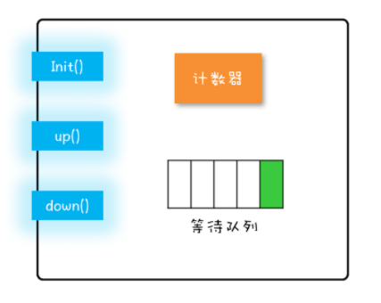

## 1. 信号量模型
&emsp;&emsp;信号量又叫做红绿灯。和现实中的红绿灯很相似，保证资源不能同时去执行。
### 1.1. 信号量的模型
信号量模型中一共有三个关键点：  
* 一个计数器
* 一个等待队列
* 三个方法  
  * init()  
    设置计数器的初始值
  * down()  
    计数器的值减 1；如果此时计数器的值小于 0，则当前线程将被阻塞，否则当前线程可以继续执行
  * up()  
    计数器的值加 1；如果此时计数器的值小于或者等于 0，则唤醒等待队列中的一个线程，并将其从等待队列中移除

**注意：有人肯定认为up()中的判断条件应该>=0，这可能理解为生产者-消费者模式中的生产者了。可以这么想，>0就意味着没有阻塞的线程了，所以只有<=0的情况才需要唤醒一个等待的线程。其实down()和up()是成对出现的，并且是先调用down()获得锁，处理完成再调用up()释放锁，如果信号量初始值为1，应该是不会出现>0的情况的，除非故意调先用up()，这也失去了信号量本身的意义了**  
  
**PS：在SDK里面，信号量模型是由java.util.concurrent.Semaphore 实现的，Semaphore 这个类能够保证这三个方法都是原子操作**

### 1.2. 信号量代码实现参考
信号量的代码模型如下：
```
class Semaphore{
  // 计数器
  int count;
  // 等待队列
  Queue queue;
  // 初始化操作
  Semaphore(int c){
    this.count=c;
  }
  void down(){
    this.count--;
    if(this.count<0){
      // 将当前线程插入等待队列
      // 阻塞当前线程
    }
  }
  void up(){
    this.count++;
    if(this.count<=0) {
      // 移除等待队列中的某个线程 T
      // 唤醒线程 T
    }
  }
}
```
## 2. 信号量基本使用
Semaphore是jdk实现的信号量，acquire() 就是信号量里的 down() 操作，release() 就是信号量里的 up() 操作。如使用信号量来实现count++的原子操作；
```
static int count;
// 初始化信号量
static final Semaphore s 
    = new Semaphore(1);
// 用信号量保证互斥    
static void addOne() {
  s.acquire();
  try {
    count+=1;
  } finally {
    s.release();
  }
}
```
分析如上代码如下：
*  T1 acquire()把信号量里的计数器减为 0
*  T2进入则将计数器减为 -1，并阻塞
*  T1 release是计数器+1，计数器满足条件，唤醒执行T2

## 3. 信号量限流器的实践
信号量是一个互斥锁，但是它有一个特殊的功能就是Semaphore 可以允许多个线程访问一个临界区，这个功能有什么用呢？  
如果我们把计数器的值设置成对象池里对象的个数 N，就能完美解决对象池的限流问题了。具体的代码如下：  
```
class ObjPool<T, R> {
  final List<T> pool;
  // 用信号量实现限流器
  final Semaphore sem;
  // 构造函数
  ObjPool(int size, T t){
    pool = new Vector<T>(){};
    for(int i=0; i<size; i++){
      pool.add(t);
    }
    sem = new Semaphore(size);
  }
  // 利用对象池的对象，调用 func
  R exec(Function<T,R> func) {
    T t = null;
    sem.acquire();
    try {
      t = pool.remove(0);
      return func.apply(t);
    } finally {
      pool.add(t);
      sem.release();
    }
  }
}
// 创建对象池
ObjPool<Long, String> pool = 
  new ObjPool<Long, String>(10, 2);
// 通过对象池获取 t，之后执行  
pool.exec(t -> {
    System.out.println(t);
    return t.toString();
});
```
如上的限流器的机制为：
*  new ObjPool<Long, String>(10, 2) 初始化对象池大小为10，信号零为10
*  poll执行的的时候，前 10 个线程调用 acquire() 方法，都能继续执行
*  后面执行的都会被阻塞
*  只有每调用一次release的时候才会释放一个阻塞的线程。
  
**注意：上面list容器必须是线程安全的，不能类似于arraylist的容器，否则会并发有问题。**
## 4. 总结
信号量简单易用，在一些特定场景下还是非常容易使用的，但是比如在实现阻塞队列方面，就没有condition的管程模型方便。