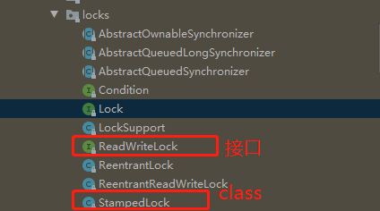
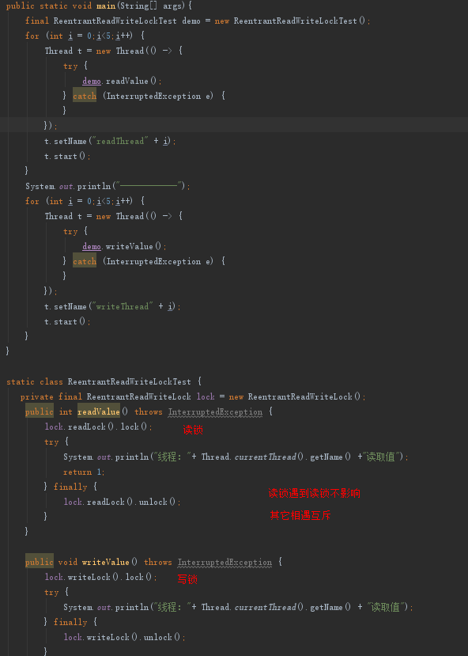

## 1. 开头  
&emsp;&emsp;前面我们已经说过，锁的范围越大性能越差，在不同的场景下，需要使用不同粒度的锁从而提升下性能。在一些读多写少的
场景下，我们就可以使用java sdk实现的读写锁ReadWriteLock和StampedLock锁  

## 3. ReadWriteLock锁
&emsp;&emsp;使用普通的lock或者Synchronized这种锁，是具有排他性的，即同一时间不允许其它的线程执行。因为线程安全问题就是共享变量的变更产生的问题。但是大部分情况读操作并不影响线程安全，只有写入的时候才会导致共享变量的安全问题。读写锁将锁拆分，使得使用者可以灵活处理，在可以共享读的地方不上锁，但是如果有写的时候就互斥。  
&emsp;&emsp;ReadWriteLock读写锁的基本特点如下：  
* 同一时刻允许多个线程对共享资源进行读操作；
* 同一时刻只允许一个线程对共享资源进行写操作；
* 当进行写操作时，同一时刻其他线程的读操作会被阻塞；
* 当进行读操作时，同一时刻所有线程的写操作会被阻塞  

基本示例如：  

### 3.1. 只从内存中读写的缓存  
```
class Cache<K,V> {
  final Map<K, V> m =
    new HashMap<>();
  final ReadWriteLock rwl =
    new ReentrantReadWriteLock();
  // 读锁
  final Lock r = rwl.readLock();
  // 写锁
  final Lock w = rwl.writeLock();
  
  //读缓存
  V get(K key) {
    r.lock();
    try { 
        return m.get(key); 
    } finally { 
        r.unlock(); 
    }
  }
  
  //写缓存
  V put(String key, Data v) {
    w.lock();
    try { 
        return m.put(key, v); 
    } finally { 
        w.unlock(); 
    }
  }
}
```

### 3.2. 按需加载缓存写法范式  

```
class Cache<K,V> {
  final Map<K, V> m =
    new HashMap<>();
  final ReadWriteLock rwl = 
    new ReentrantReadWriteLock();
  final Lock r = rwl.readLock();
  final Lock w = rwl.writeLock();
 
  V get(K key) {
    V v = null;
    // 读缓存
    r.lock();         ①
    try {
      v = m.get(key); ②
    } finally{
      r.unlock();     ③
    }
    // 缓存中存在，返回
    if(v != null) {   ④
      return v;
    }  
    // 缓存中不存在，查询数据库
    w.lock();         ⑤
    try {
      // 再次验证
      // 其他线程可能已经查询过数据库
      v = m.get(key); ⑥
      if(v == null){  ⑦
        // 查询数据库
        v= 省略代码无数
        m.put(key, v);
      }
    } finally{
      w.unlock();
    }
    return v; 
  }
}
```
**注意：在写入逻辑中需要m.get(key)重新查询一缓存，因为有可能多个线程同时进入到写入这里，这样会导致都要查询数据库，如果数据量特别大的话，会导致缓存穿透，极端会导致数据库崩溃。**  

**PS：一般设计缓存的时候，需要考虑同步机制，可以采用超时机制，也可以采用定时同步和双写机制，需要具体场景具体分析了.**

### 3.3. 锁的升级和降级  
* 锁的升级不被允许，ReadWriteLock不允许持有读锁时再获取写锁, 如下的代码w.lock会一直阻塞，这时很危险的。
```
// 读缓存
r.lock();         ①
try {
  v = m.get(key); ②
  if (v == null) {
    w.lock();
    try {
      // 再次验证并更新缓存
      // 省略详细代码
    } finally{
      w.unlock();
    }
  }
} finally{
  r.unlock();     ③
}
```

* 锁可以降级,如下代码， 线程持有w.lock()的时候，然后再调用 r.lock()， 相当于降级为读锁了。即本线程在释放写锁之前，获取读锁一定是可以立刻获取到的，不存在其他线程持有读锁或者写锁（读写锁互斥），所以java允许锁降级，此刻别的线程是可以读的，但是降级之前是不能读的。
```
 // 获取读锁
    r.lock();
    if (!cacheValid) {
      // 释放读锁，因为不允许读锁的升级
      r.unlock();
      // 获取写锁
      w.lock();
      try {
        // 再次检查状态  
        if (!cacheValid) {
          data = ...
          cacheValid = true;
        }
        // 释放写锁前，降级为读锁
        // 降级是可以的
        r.lock(); ①
      } finally {
        // 释放写锁
        w.unlock(); 
      }
    }
    // 此处仍然持有读锁
    try {
        use(data);
    } finally {
        r.unlock();
    }
```

PS: 排查程序cpu利用低且有假死现象的步骤：  
* ps -ef | grep java查看pid
* top -p查看java中的线程
* 使用jstack将其堆栈信息保存下来，查看是否是锁升级导致的阻塞问题
* 查看代码是否有读锁里面获取写锁的情况

### 3.4. 小结
&emsp;&emsp;ReadWriteLock提供了读写锁来帮助开发者控制锁的粒度从而提升程序的性能，其中缓存的实现就是例子，需要注意缓存的写法范式。  
&emsp;&emsp;读写锁可以进行降级，即再释放写锁之前，可以调用读锁的lock降级为读锁。要非常注意不可以升级，如果在读锁中获取写锁，将会出现阻塞。  
可以总结读写锁的特性为：
* 获取写锁的前提是读锁和写锁均未被占用
* 获取读锁的前提是没有其他线程占用写锁
* 申请写锁时不中断其他线程申请读锁
* 公平锁如果过有写申请，能禁止读锁

## 4. StampedLock锁
 StampedLock是jdk8提供的读写锁，它的性能比ReadWriteLock要更好，更适合读多写少的场景。  
StampedLock与ReadWriteLock相比，支持了三种模式。
* 写锁，和ReadWriteLock类似
* 悲观读锁，和ReadWriteLock类似
* 乐观读  
StampedLock写锁和悲观读锁加锁成功之后，都会返回一个stamp，然后解锁的时候，需要传入这个stamp。  


## 4.1. 乐观读
StampedLock 的性能之所以比 ReadWriteLock 还要好。即如果有线程获取了乐观读，并允许一个线程获取写锁的。一下是一个使用了乐观读的官方示例：
```
class Point {
  private int x, y;
  final StampedLock sl = new StampedLock();
  // 计算到原点的距离  
  int distanceFromOrigin() {
    // 乐观读
    long stamp = sl.tryOptimisticRead();
    // 读入局部变量，
    // 读的过程数据可能被修改
    int curX = x, curY = y;
    // 判断执行读操作期间，
    // 是否存在写操作，如果存在，
    // 则 sl.validate 返回 false
    if (!sl.validate(stamp)){
      // 升级为悲观读锁
      stamp = sl.readLock();
      try {
        curX = x;
        curY = y;
      } finally {
        // 释放悲观读锁
        sl.unlockRead(stamp);
      }
    }
    return Math.sqrt(
      curX * curX + curY * curY);
  }
}
```
以上的机制：  
* 通过调用 tryOptimisticRead() 获取了一个 stamp，这个是获取乐观锁
* 将共享变量 x 和 y 读入方法的局部变量中
* tryOptimisticRead() 是无锁的，所以共享变量 x 和 y 读入方法局部变量时，x 和 y 有可能被其他线程修改了
* 通过调用 validate(stamp) 验证是否被修改了
* 如果不升级为悲观锁，则需要在一个循环里反复执行乐观读，直到执行乐观读操作的期间没有写操作（只有这样才能保证 x 和 y 的正确性和一致性），而循环读会浪费大量的 CPU。升级为悲观读锁，代码简练且不易出错

PS： 如果处理业务需要保持互斥，那么就用互斥锁，如果不需要保持互斥才可以用读写锁。一般来讲缓存是不需要保持互斥性的，能接受瞬间的不一致，这里是可以接收短暂的不一致的

## 4.2. StampedLock使用范式
一般使用StampedLock锁的时候有一个前人总结的使用模式如下：  
* 使用乐观读锁的范式，一般先获取乐观读锁，再校验、再升级锁
```
final StampedLock sl = new StampedLock();
 
// 乐观读
long stamp =  sl.tryOptimisticRead();
// 读入方法局部变量
......
// 校验 stamp
if (!sl.validate(stamp)){
  // 升级为悲观读锁
  stamp = sl.readLock();
  try {
    // 读入方法局部变量
    .....
  } finally {
    // 释放悲观读锁
    sl.unlockRead(stamp);
  }
}
// 使用方法局部变量执行业务操作
......
```
* 使用写锁的范式  
```
long stamp = sl.writeLock();
try {
  // 写共享变量
  ......
} finally {
  sl.unlockWrite(stamp);
}
```

## 4.3. 注意事项
* StampedLock的功能是ReadWriteLock 的子集，不支持冲入
* 不支持条件变量
* 如果线程阻塞在 StampedLock 的 readLock() 或者 writeLock() 上时，此时调用该阻塞线程的 interrupt() 方法，会导致 CPU 飙升

