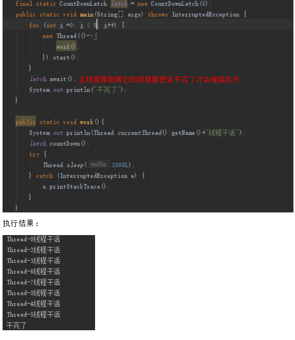
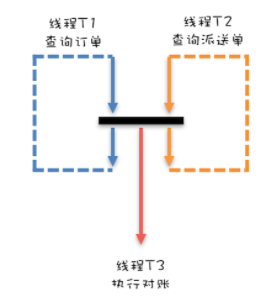
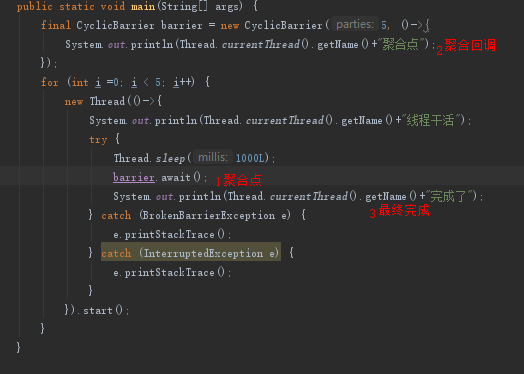
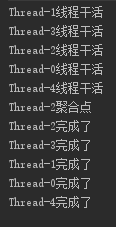
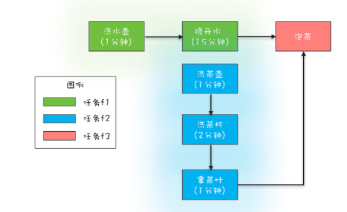

## 1. 概述
我们再多线程的场景下，通常有这样的使用场景：多线程从数据库中查询数据，然后结果汇总输出。这种情况如何直到所有的线程已经处理完成并进行下一步的操作呢？ 我们可以采用线程的join的方法，如下示例代码： 
```
  // 查询未对账订单
  Thread T1 = new Thread(()->{
    pos = getPOrders();
  });
  T1.start();
  // 查询派送单
  Thread T2 = new Thread(()->{
    dos = getDOrders();
  });
  T2.start();
  // 等待 T1、T2 结束
  T1.join();
  T2.join();
  // 执行对账操作
  diff = check(pos, dos);
  // 差异写入差异库
  save(diff);
```
这种非常原始的方法其实并不是最佳的方案，jdk提供了一些列的线程同步相关的工具类供我们使用。

## 1. CountDownLatch
上面的代码可以解决一定的问题，但是实际生产中一般不会自己创建线程，都是使用线程池的，而线程池的线程不会结束，所以join方法永远也等待不到结束的。这样如何解决等待都完成的场景呢？  
其实有很多种方式可以实现我们的目标，我们可以使用全局变量count计数的方式，也可以使用条件变量的方式，但是jdk已经为我们提供了优雅的解决方案-CountDownLatch 。
## 1.1. CountDownLatch示例1
如下的代码示例：  
```
// 创建 2 个线程的线程池
Executor executor =  Executors.newFixedThreadPool(2);
while(存在未对账订单){
  // 计数器初始化为 2
  CountDownLatch latch = 
    new CountDownLatch(2);
  // 查询未对账订单
  executor.execute(()-> {
    pos = getPOrders();
    latch.countDown();
  });
  // 查询派送单
  executor.execute(()-> {
    dos = getDOrders();
    latch.countDown();
  });
  
  // 等待两个查询操作结束
  latch.await();
  
  // 执行对账操作
  diff = check(pos, dos);
  // 差异写入差异库
  save(diff);
}
```
如上代码CountDownLatch  是一个计数器，每个线程结束都为countdown，在latch的await上，当都countdown后，就可以执行后面的save代码了。  

## 1.2. CountDownLatch示例2

## 2. CyclicBarrier
上面的代码代码是一个循环操作，查询未对账订单、查询派送单完成后，等着check和save，但是如果check和save耗时很长，那么下一轮的两个查询就一直要等待。是不是可以两个查询查询完了就能够通知对账，然后继续查询呢？ 有点类似于生产者和消费者模型了。  
    
我们同样可以使用利用一个计数器，如计数器初始化为 2，线程 T1 和 T2 生产完一条数据都将计数器减 1，如果计数器大于 0 则线程 T1 或者 T2 等待。如果计数器等于 0，则通知线程 T3，并唤醒等待的线程 T1 或者 T2，与此同时，将计数器重置为 2，这样线程 T1 和线程 T2 生产下一条数据的时候就可以继续使用这个计数器了。但是jdk依然为这种场景提供了优雅的解决方案了。

## 2.1. CyclicBarrier案例1
```
// 订单队列
Vector<P> pos;
// 派送单队列
Vector<D> dos;
// 执行回调的线程池 
Executor executor = 
  Executors.newFixedThreadPool(1);
final CyclicBarrier barrier =
  new CyclicBarrier(2, ()->{
    executor.execute(()->check());
  });
  
void check(){
  P p = pos.remove(0);
  D d = dos.remove(0);
  // 执行对账操作
  diff = check(p, d);
  // 差异写入差异库
  save(diff);
}
  
void checkAll(){
  // 循环查询订单库
  Thread T1 = new Thread(()->{
    while(存在未对账订单){
      // 查询订单库
      pos.add(getPOrders());
      // 等待
      barrier.await();
    }
  });
  T1.start();  
  // 循环查询运单库
  Thread T2 = new Thread(()->{
    while(存在未对账订单){
      // 查询运单库
      dos.add(getDOrders());
      // 等待
      barrier.await();
    }
  });
  T2.start();
}
```
**注意：线程池大小为1是必要的，如果设置为多个，有可能会两个线程 A 和 B 同时查询，A 的订单先返回，B 的派送单先返回，造成队列中的数据不匹配；所以1个线程实现生产数据串行执行，保证数据安全。而且必须要使用线程池，而且这里必须要使用线程池，因为CyclicBarrier 是同步调用回调函数之后才唤醒等待的线程，如果我们在回调函数里直接调用 check() 方法，那就意味着在执行 check() 的时候，是不能同时执行 getPOrders() 和 getDOrders() 的，这样就起不到提升性能的作用**
## 2.2. CyclicBarrier案例2
  
    
可以在任务中设置一个聚合点，当一定数量的任务都执行到这个点后，可以执行一个回调函数，然后再各个线程继续
## 3. 总结
* CountDownLatch 主要用来解决一个线程等待多个线程的场景；
* CyclicBarrier 是一组线程之间互相等待，而且具备自动重置的功能，一旦计数器减到 0 会自动重置到你设置的初始值，CyclicBarrier 还可以设置回调函数，可以说是功能丰富


## 3. CompletableFuture  
当我们并行处理两个业务方法时，如前面所示，可以采用
```
new Thread(()->doBizA())
  .start();
new Thread(()->doBizB())
  .start();  
```
但是java在1.8版本提供了 CompletableFuture 这个类，大大提升了java并发编程的能力。  

选取一个执行结果返回，竞争获胜的返回。

### 3.1. 创建CompletableFuture对象
```
static CompletableFuture<Void> runAsync(Runnable runnable)
static <U> CompletableFuture<U> supplyAsync(Supplier<U> supplier)
// 可以指定线程池  
static CompletableFuture<Void> runAsync(Runnable runnable, Executor executor)
static <U> CompletableFuture<U> supplyAsync(Supplier<U> supplier, Executor executor)  
```
如上是创建CompletableFuture对象的四个方法 ,runAsync没有返回值，supplyAsync有返回值


### 3.2. 主要方法
这个和拉姆达表达式很紧密，可以组合多种不同的功能。这里只是简单的阐述一下它大知的一些功能。
* 竞争（supplyAsync有返回值、runAsync没有返回值）
  CompletableFuture.supplyAsync(()->{}）.applyToEither.(CompletableFuture.supplyAsync(()->{}),,(s)->{return s;}).join();
* 异常，捕获线程的异常
 CompletableFuture.supplyAsync(()->{ throw new RuntimeException("exception test!")}).exceptionally(e->{System.out.println(e.getMessage());return "Hello world!";}).join();
* 组合，将两个线程的结果组合thenCombine
* 接收，thenAccept
* 变换，thenApplyAsync  

### 3.4. 功能分类  
CompletableFuture 类还实现了 CompletionStage 接口，这个接口的功能很多，我们对这些功能分为：串行关系、并行关系、汇聚关系（and和or）；
* 串行关系
  * thenApply，支持参数返回值
  * thenAccept，支持参数不支持返回值
  * thenRun，不持支持参数也不支持返回值
  * thenCompose，会新创建出一个子流程，最终结果和 thenApply 系列是相同的
  
  ```
    CompletableFuture<String> f0 = 
    CompletableFuture.supplyAsync(
      () -> "Hello World")      //①
    .thenApply(s -> s + " QQ")  //②
    .thenApply(String::toUpperCase);//③
    System.out.println(f0.join());
    // 输出结果
    HELLO WORLD QQ
  ```
  如上图代码所示：虽然这是一个异步流程，①②③却是串行执行的，②依赖①的执行结果，③依赖②的执行结果

* 汇聚关系 
  * AND 汇聚关系
    * thenCombine
    * thenAcceptBoth
    * runAfterBoth
  * OR 汇聚关系, 表示任意的任务日完就会往下走
    * applyToEither
    * acceptEither
    * runAfterEither
    ```
      CompletableFuture<String> f1 = 
      CompletableFuture.supplyAsync(()->{
        int t = getRandom(5, 10);
        sleep(t, TimeUnit.SECONDS);
        return String.valueOf(t);
    });
    
    CompletableFuture<String> f2 = 
      CompletableFuture.supplyAsync(()->{
        int t = getRandom(5, 10);
        sleep(t, TimeUnit.SECONDS);
        return String.valueOf(t);
    });
    
    CompletableFuture<String> f3 = 
      f1.applyToEither(f2,s -> s);
    
    System.out.println(f3.join());
  ```
  
  ```
  
  ```
* 异常处理
fn、consumer、action如果抛出了异常，我们可以采用CompletableFuture的链式编程来处理异常。
```
CompletableFuture<Integer> 
  f0 = CompletableFuture
    .supplyAsync(()->7/0))
    .thenApply(r->r*10)
    .exceptionally(e->0);
System.out.println(f0.join());

```

我这里利用completablefuture来实现一个烧水泡茶的的多线程  
    
代码示例：
```
// 任务 1：洗水壶 -> 烧开水
CompletableFuture<Void> f1 = 
  CompletableFuture.runAsync(()->{
  System.out.println("T1: 洗水壶...");
  sleep(1, TimeUnit.SECONDS);
 
  System.out.println("T1: 烧开水...");
  sleep(15, TimeUnit.SECONDS);
});
// 任务 2：洗茶壶 -> 洗茶杯 -> 拿茶叶
CompletableFuture<String> f2 = 
  CompletableFuture.supplyAsync(()->{
  System.out.println("T2: 洗茶壶...");
  sleep(1, TimeUnit.SECONDS);
 
  System.out.println("T2: 洗茶杯...");
  sleep(2, TimeUnit.SECONDS);
 
  System.out.println("T2: 拿茶叶...");
  sleep(1, TimeUnit.SECONDS);
  return " 龙井 ";
});
// 任务 3：任务 1 和任务 2 完成后执行：泡茶
CompletableFuture<String> f3 = 
  f1.thenCombine(f2, (__, tf)->{
    System.out.println("T1: 拿到茶叶:" + tf);
    System.out.println("T1: 泡茶...");
    return " 上茶:" + tf;
  });
// 等待任务 3 执行结果
System.out.println(f3.join());
 
void sleep(int t, TimeUnit u) {
  try {
    u.sleep(t);
  }catch(InterruptedException e){}
}
// 一次执行结果：
T1: 洗水壶...
T2: 洗茶壶...
T1: 烧开水...
T2: 洗茶杯...
T2: 拿茶叶...
T1: 拿到茶叶: 龙井
T1: 泡茶...
上茶: 龙井
```

**注意：在实际的工程代码使用CompletableFuture读取数据库的异步操作，需要放到线程池中，避免线程饥饿，并且注意处理异常。**

### 3.5. 小结
