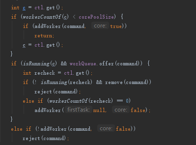

## 1. Java线程池  
### 1.1. 为什么要使用线程池
&emsp;&emsp;线程是一个重量级的对象，应该避免频繁创建和销毁，创建一个线程，需要调用操作系统内核的 API，然后操作系统要为线程分配一系列的资源，这个成本就很高。为避免频繁创建线程。我们使用池化技术来管理线程。即使用线程池。不过和一般的池化技术不同，Java 提供的线程池里面压根就没有申请线程和释放线程的方法。
### 1.2. 什么是线程池。
&emsp;&emsp;目前业界线程池的设计，普遍采用的都是生产者 - 消费者模式，一般的核心思想即是ThreadPool 的内部，我们维护了一个阻塞队列 workQueue 和一组工作线程，工作线程的个数由构造函数中的 poolSize 来指定。用户通过调用 execute() 方法来提交 Runnable 任务，execute() 方法的内部实现仅仅是将任务加入到 workQueue 中。ThreadPool 内部维护的工作线程会消费 workQueue 中的任务并执行任务，相关的代码就是代码处的 while 循环  
&emsp;&emsp;java的线程池就是一个任务执行器，它有submit（有返回值）和excute（无返回值）两种提交任务的方式。

## 2. 线程池功能  
* Shutdown方法，停止接收新任务，等待所有的任务执行完后，关闭线程池。
* ShutdownNow，停止接收新任务，任务都关闭。
* Excutors提供了四种创建线程的方法
  * newSingleThreadExecutor，单线程池
  * newFixedThreadPool，固定大小的线程池，队列无限大
  * newCachedThreadPool，可缓存的线程池，核心为0，线程数无线大，但可以回收。
  * newScheduledThreadPool，支持时间和周期的线程池  


## 3. 线程池原理
  
### 3.1. 执行流程
* 提交任务时，判断当前线程数是否小于核心数，如果小于则创建线程，并作为核心数。
* 线程数大于核心数，添加至队列
* 线程数大于核心数，队列满了，尝试新增新增线程设置为非核心，如果成功返回，不成功则拒绝。  
  

**注意：由此可见只有阻塞队列满了后，才会创建非核心线程**     

### 3.2. 线程池参数  
* corePoolSize：核心线程数
* maximumPoolSize：最大线程数，新增的线程加上核心线程数不大于这个数
* workQueue：当任务数大于这个核心线程数就会放入阻塞队列中了
* keepAliveTime：新增的非核心线程数空闲时间
* threadFactory：创建线程时可以定义创建线程的属性
* Handler：**当队列放不下了，也无法创建非核心线程了，就会被拒绝，拒绝后的策略的定义**
  * AbortPolicy默认，抛异常
  * CallerRunsPolicy，提交任务的线程自己去执行该任务
  * DiscardOldestPolicy，丢弃最老的任务，其实就是把最早进入工作队列的任务丢弃，然后把新任务加入到工作队列

### 3.3. 线程池的队列
线程池是使用阻塞队列来实现缓存
ArrayBlockingQueue（数组）、LinkedBlockingQueue（链表）、PriorityBlockingQueue（顺序）、SynchronizedQueue（交替）

**注意：强烈建议使用有界队列**

### 3.4. 拒绝策略
线程默认是抛异常策略，还可以指定丢且任务、丢弃队列最前面的任务并提交新任务、使用发起者线程处理任务这三种策略。

### 3.5. 线程池设计思想
线程池为什么设计为队列满+核心线程数满了才创建新线程？  
Java原生线程池偏向cpu密集，如果创建过多的线程反而会降低整体效率，所以优先将其缓冲下来。最大线程数这个参数更像是无奈之举，在最坏的情况下做最后的努力，去新建线程去帮助消化任务。出现需要额外增加线程的事件会少，所以是最坏的情况下创建一些线程来帮助处理，大部分都用核心线程数处理。  

## 4. future在线程池中的使用
### 4.1. future接口
首先看下future接口方法的功能

* boolean cancel   
  取消任务
* boolean mayInterruptIfRunning);  
  
* boolean isCancelled()  
  判断任务是否已取消  
* boolean isDone()  
  判断任务是否已结束
* get()  
  获得任务执行结果
* get(long timeout, TimeUnit unit)
  获得任务执行结果，支持超时  

线程池提供了三种提交任务的方式：  
* Future<?> submit(Runnable task)
  Runnable是没有返回值的，这里的future只能那个判断有没有完成
* Future<T> submit(Callable<T> task)
  Callable是有返回值的，可以通过调用其 get() 方法来获取任务的执行结果
* Future<T> submit(Runnable task, T result)  
  Future 对象是 f，f.get() 的返回值就是传给 submit() 方法的参数 result，result 相当于主线程和子线程之间的桥梁，通过它主子线程可以共享数据.
  经典用法：
  ```
    ExecutorService executor 
    = Executors.newFixedThreadPool(1);
    // 创建 Result 对象 r
    Result r = new Result();
    r.setAAA(a);
    // 提交任务
    Future<Result> future = 
    executor.submit(new Task(r), r);  
    Result fr = future.get();
    // 下面等式成立
    fr === r;
    fr.getAAA() === a;
    fr.getXXX() === x
    
    class Task implements Runnable{
    Result r;
    // 通过构造函数传入 result
    Task(Result r){
        this.r = r;
    }
    void run() {
        // 可以操作 result
        a = r.getAAA();
        r.setXXX(x);
    }
    }
  ```

  ### 4.2. future task工具类  
  FutureTask是一个纯工具类，FutureTask 实现了 Runnable 和 Future 接口，所以它即可以当作任务提交，也可以获取执行结果。  
  ```
    // 创建 FutureTask
    FutureTask<Integer> futureTask = new FutureTask<>(()-> 1+2);
    // 创建线程池
    ExecutorService es = Executors.newCachedThreadPool();
    // 提交 FutureTask 
    es.submit(futureTask);
    // 获取计算结果
    Integer result = futureTask.get();
  ```
在之前我们用CompletableFuture实现了烧水泡茶，这里我们可以用future task来实现

```
// 创建任务 T2 的 FutureTask
FutureTask<String> ft2
  = new FutureTask<>(new T2Task());
// 创建任务 T1 的 FutureTask
FutureTask<String> ft1
  = new FutureTask<>(new T1Task(ft2));
// 线程 T1 执行任务 ft1
Thread T1 = new Thread(ft1);
T1.start();
// 线程 T2 执行任务 ft2
Thread T2 = new Thread(ft2);
T2.start();
// 等待线程 T1 执行结果
System.out.println(ft1.get());
 
// T1Task 需要执行的任务：
// 洗水壶、烧开水、泡茶
class T1Task implements Callable<String>{
  FutureTask<String> ft2;
  // T1 任务需要 T2 任务的 FutureTask
  T1Task(FutureTask<String> ft2){
    this.ft2 = ft2;
  }
  @Override
  String call() throws Exception {
    System.out.println("T1: 洗水壶...");
    TimeUnit.SECONDS.sleep(1);
    
    System.out.println("T1: 烧开水...");
    TimeUnit.SECONDS.sleep(15);
    // 获取 T2 线程的茶叶  
    String tf = ft2.get();
    System.out.println("T1: 拿到茶叶:"+tf);
 
    System.out.println("T1: 泡茶...");
    return " 上茶:" + tf;
  }
}
// T2Task 需要执行的任务:
// 洗茶壶、洗茶杯、拿茶叶
class T2Task implements Callable<String> {
  @Override
  String call() throws Exception {
    System.out.println("T2: 洗茶壶...");
    TimeUnit.SECONDS.sleep(1);
 
    System.out.println("T2: 洗茶杯...");
    TimeUnit.SECONDS.sleep(2);
 
    System.out.println("T2: 拿茶叶...");
    TimeUnit.SECONDS.sleep(1);
    return " 龙井 ";
  }
}
// 一次执行结果：
T1: 洗水壶...
T2: 洗茶壶...
T1: 烧开水...
T2: 洗茶杯...
T2: 拿茶叶...
T1: 拿到茶叶: 龙井
T1: 泡茶...
上茶: 龙井
```
*  创建了两个 FutureTask——ft1 和 ft2
*  ft1 完成洗水壶、烧开水、泡茶的任务
*  ft2 完成洗茶壶、洗茶杯、拿茶叶的任务
*  这里需要注意的是 ft1 这个任务在执行泡茶任务前，需要等待 ft2 把茶叶拿来，所以 ft1 内部需要引用 ft2
*  并在执行泡茶之前，调用 ft2 的 get() 方法实现等待  


  ## 5. 批量执行多线程  
  ### 5.1. 场景
   假设有三个异步任务，任务完成后分别做一个操作。如何写代码呢？可以将获取的结果通过线程池放入到阻塞队列中，通过阻塞队列阻塞的获取结果。代码如下：  
   ```
    // 创建线程池
    ExecutorService executor = Executors.newFixedThreadPool(3);
    // 创建 CompletionService
    CompletionService<Integer> cs = new ExecutorCompletionService<>(executor);
    // 异步向电商 S1 询价
    cs.submit(()->getPriceByS1());
    // 异步向电商 S2 询价
    cs.submit(()->getPriceByS2());
    // 异步向电商 S3 询价
    cs.submit(()->getPriceByS3());
    // 将询价结果异步保存到数据库
    for (int i=0; i<3; i++) {
        Integer r = cs.take().get();
        executor.execute(()->save(r));
    }
   ```
   但是生产环境一般不这么使用，jdk提供了线程的解决方案
 ### 5.2. CompletionService 
 &emsp;&emsp;CompletionService 的实现原理也是内部维护了一个阻塞队列，当任务执行结束就把任务的执行结果加入到阻塞队列中，不同的是 CompletionService 是把任务执行结果的 Future 对象加入到阻塞队列中，而上面的示例代码是把任务最终的执行结果放入了阻塞队列
 该接口的主要方法为：
 * Future<V> submit(Callable<V> task);
   和ThreadPoolExecutor的方法类似
 * Future<V> submit(Runnable task, V result);
   和ThreadPoolExecutor的方法类似
 * Future<V> take() throws InterruptedException;
   如果阻塞队列是空的，那么调用 take()
 * Future<V> poll();
 * Future<V> poll(long timeout, TimeUnit unit) throws InterruptedException;

如何使用这个接口实现上述的需求呢？代码如下
```
// 创建线程池
ExecutorService executor = Executors.newFixedThreadPool(3);
// 创建 CompletionService
CompletionService<Integer> cs = new ExecutorCompletionService<>(executor);
// 异步向电商 S1 询价
cs.submit(()->getPriceByS1());
// 异步向电商 S2 询价
cs.submit(()->getPriceByS2());
// 异步向电商 S3 询价
cs.submit(()->getPriceByS3());
// 将询价结果异步保存到数据库
for (int i=0; i<3; i++) {
  Integer r = cs.take().get();
  executor.execute(()->save(r));
}

```
* 创建了一个线程池 executor 、一个 CompletionService 对象 cs 和一个Future<Integer>类型的列表 futures
* 每次通过调用 CompletionService 的 submit() 方法提交一个异步任务，会返回一个 Future 对象，我们把这些 Future 对象保存在列表 futures 中。
* 通过调用 cs.take().get()，我们能够拿到最快返回的任务执行结果
* 只要我们拿到一个正确返回的结果，就可以取消所有任务并且返回最终结果了

 ### 5.3. dubbo的fork案例
我们以dubbo的的Forking 的集群模式为例：并行地调用多个查询服务，只要有一个成功返回结果，整个服务就可以返回了，如何实现这样的需求呢？  
我们同样可以使用CompletionService。
```
// 创建线程池
ExecutorService executor =
  Executors.newFixedThreadPool(3);
// 创建 CompletionService
CompletionService<Integer> cs =
  new ExecutorCompletionService<>(executor);
// 用于保存 Future 对象
List<Future<Integer>> futures =
  new ArrayList<>(3);
// 提交异步任务，并保存 future 到 futures 
futures.add(
  cs.submit(()->geocoderByS1()));
futures.add(
  cs.submit(()->geocoderByS2()));
futures.add(
  cs.submit(()->geocoderByS3()));
// 获取最快返回的任务执行结果
Integer r = 0;
try {
  // 只要有一个成功返回，则 break
  for (int i = 0; i < 3; ++i) {
    r = cs.take().get();
    // 简单地通过判空来检查是否成功返回
    if (r != null) {
      break;
    }
  }
} finally {
  // 取消所有任务
  for(Future<Integer> f : futures)
    f.cancel(true);
}
// 返回结果
return r;
```
以上代码和前一节的代码类似，只不过只要有结果了就跳出循环了。这里会将还在执行的任务取消掉


 ### 5.4. 小结  
 CompletionService 将线程池 Executor 和阻塞队列 BlockingQueue 的功能融合在了一起，轻松实现后续处理的有序性，避免无谓的等待，同时还可以快速实现诸如 Forking Cluster 这样的需求。