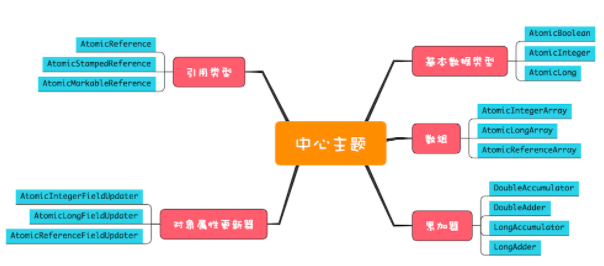
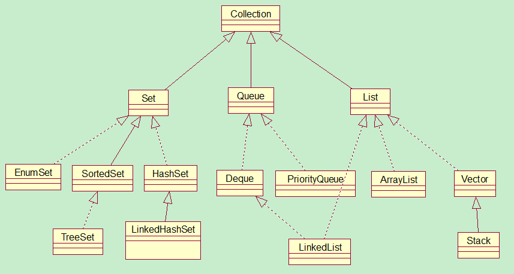
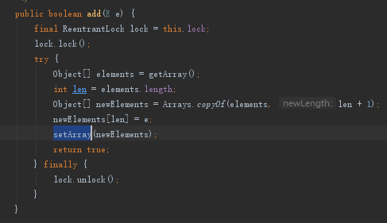
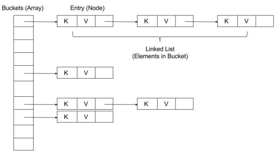
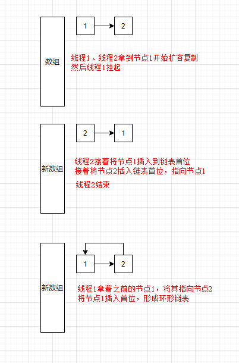
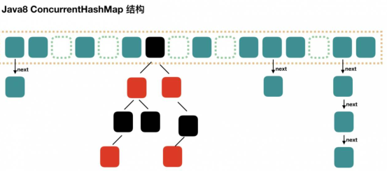

## 1. 开头  
前面介绍各种锁来解决原子性的问题，jdk也提供了一些并发容器，你可以直接操作这些容器从而避免并发问题。比如jdk提供的原子类和也一些支持并发容器，比如currenthashmap等等。


## 2. 并发原子类  
### 2.1. 累加案例
add10K() 这个方法不是线程安全的，可见性问题可以用 volatile 来解决，而原子性问题我们前面一直都是采用的互斥锁方案 ，但是可能性能不太好。对于简单的原子性问题，提供了无锁方案，实现了一系列的原子类。如下的代码实现类累加的操作：
```
public class Test {
  AtomicLong count = 
    new AtomicLong(0);
  void add10K() {
    int idx = 0;
    while(idx++ < 10000) {
      count.getAndIncrement();
    }
  }
}
```
### 2.2. 并发原子类
#### 2.2.1. 并发原子类分类  
  
&emsp;&emsp;jdk中的并发原子类有很多。我们可以将jdk中的并发原子类分为5种，原子化的基本数据类型、原子化的对象引用类型、原子化数组、原子化对象属性更新器和原子化的累加器  

* 基本数据类型  
  类似：AtomicBoolean、AtomicInteger、AtomicLong。  
  可以实现比如原子累加，原子更新等等compareAndSet、getAndAdd的方法，比较简单，可以查看其api
* 原子化的对象引用类型  
  AtomicReference、AtomicStampedReference、AtomicMarkableReference。  
  和基本类型类似，但是需要注意aba的问题。什么是aba问题，见后面
* 原子化数组  
  AtomicIntegerArray、AtomicLongArray 、 AtomicReferenceArray。  
  可以原子化地更新数组里面的每一个元素。这些类提供的方法和原子化的基本数据类型的区别仅仅是：每个方法多了一个数组的索引参数，所以这里也不再赘述了
* 原子化对象属性更新器  
  AtomicIntegerFieldUpdater、AtomicLongFieldUpdater 、AtomicReferenceFieldUpdater  
  利用它们可以原子化地更新对象的属性。这个功能是利用反射实现的。**需要注意的是对象属性必须是 volatile 类型的，只有这样才能保证可见性**，如果对象属性不是 volatile 类型的，newUpdater() 方法会抛出 IllegalArgumentException 这个运行时异常。在使用的时候需要传入一个对象引用  
  如它的compareAndSet方法：
  ```
    boolean compareAndSet(
    T obj, 
    int expect, 
    int update)
  ```
* 原子化的累加器  
  DoubleAccumulator、DoubleAdder、LongAccumulator 、LongAdder    
  这四个类仅仅用来执行累加操作，相比原子化的基本数据类型，速度更快，但是不支持 compareAndSet() 方法，而且核心并非使用cas，LongAdder的原理就是将并发操作共享变量的压力分散至各个线程。它内部维护了一个cell数组。不同的线程新增的数据分散到cell里，取出的数据将是cell的汇总。示意图如下：
  我们可以容易得到，这种分散的算法将会提高写的性能，而读需要聚合各个cell的数据性能必然有所降低。  
    


#### 2.2.2. 并发原子类原理

&emsp;&emsp;Atomic工具类时一种锁技术，无锁技术使用的是CAS。CPU 为了解决并发问题，提供了 CAS 指令。是硬件支持的。作为一条 CPU 指令，CAS 指令本身是能够保证原子性的。  
&emsp;&emsp;使用 CAS 来解决并发问题，一般都会伴随着自旋，而所谓自旋，其实就是循环尝试。例如，实现一个线程安全的count += 1操作，“CAS+ 自旋”的实现方案如下所示
```
class SimulatedCAS{
  volatile int count;
  // 实现 count+=1
  addOne(){
    do {
      newValue = count+1; //①
    }while(count !=
      cas(count,newValue) //②
  }
  // 模拟实现 CAS，仅用来帮助理解
  synchronized int cas( int expect, int newValue){
    // 读目前 count 的值
    int curValue = count;
    // 比较目前 count 值是否 == 期望值
    if(curValue == expect){
      // 如果是，则更新 count 的值
      count= newValue;
    }
    // 返回写入前的值
    return curValue;
  }
}
```
上面的代码是我们自己实现的cas来进行累加，开头我们利用jdk实现的atomiclong来实现的，它的内部的原理是什么呢？  
如下代码，compareAndSwapLong() 是一个 native 方法，只有当内存中共享变量的值等于 expected 时，才会将共享变量的值更新为 x，并且返回 true；否则返回 fasle，和上面的代码很相似
```
public final long getAndAddLong(
  Object o, long offset, long delta){
  long v;
  do {
    // 读取内存中的值
    v = getLongVolatile(o, offset);
  } while (!compareAndSwapLong(
      o, offset, v, v + delta));
  return v;
}
// 原子性地将变量更新为 x
// 条件是内存中的值等于 expected
// 更新成功则返回 true
native boolean compareAndSwapLong(
  Object o, long offset, 
  long expected,
  long x);
```  

注意：在很多源码中，我们可以看到compareAndSet()，compareAndSet() 的语义和 CAS 指令的语义的差别仅仅是返回值不同而已，compareAndSet() 里面如果更新成功，则会返回 true，否则返回 false   
```
do {
  // 获取当前值
  oldV = xxxx；
  // 根据当前值计算新值
  newV = ...oldV...
}while(!compareAndSet(oldV,newV);
```
#### 2.2.3. ABA问题  
&emsp;&emsp;cas(count,newValue) 返回的值等于count，是否就能够认为 count 的值没有被其他线程更新过呢？显然不是的。但是大多数情况下我们并不关心 ABA 问题。除了个别情况，例如原子化的更新对象很可能就需要关心 ABA 问题，因为两个 A 虽然相等，但是第二个 A 的属性可能已经发生变化了。所以在使用 CAS 方案的时候，一定要先 check 一下。如何进行check呢？  
思路其实很简单，增加一个版本号维度就可以了。每次执行 CAS 操作，附加再更新一个版本号，只要保证版本号是递增的，那么即便 A 变成 B 之后再变回 A，版本号也不会变回来（版本号递增的）  

AtomicStampedReference 实现的 CAS 方法就增加了版本号参数。  
```
boolean compareAndSet(
  V expectedReference,
  V newReference,
  int expectedStamp,
  int newStamp) 
```
AtomicMarkableReference,将版本号简化成了一个 Boolean 值
```
boolean compareAndSet(
  V expectedReference,
  V newReference,
  boolean expectedMark,
  boolean newMark)
```
**注意：cas不会出现死锁但是能出现饥饿和活锁问题，原子类能够解决一些简单的原子性问题，但你可能会发现，上面我们所有原子类的方法都是针对一个共享变量的，如果你需要解决多个变量的原子性问题，建议还是使用互斥锁方案**  


**注意：使用无锁技术和有锁技术哪一个更好，这么比较没有太大的意义，当并发很小的时候无锁好些，但是当并发特别大，无锁会导致循环获取锁，无谓的坚持将会浪费一定的资源。所以还不及直接放弃。这就是乐观锁和悲观锁之争**  

### 2.3. 案例
使用原子对象来设置库存的上限和下限  
```
public class SafeWM {
  class WMRange{
    final int upper;
    final int lower;
    WMRange(int upper,int lower){
    // 省略构造函数实现
    }
  }
  final AtomicReference<WMRange>
    rf = new AtomicReference<>(
      new WMRange(0,0)
    );
  // 设置库存上限
  void setUpper(int v){
    WMRange nr;
    WMRange or;
    do{
      //此句代码一定要注意放在循环里面
      or = rf.get();
      // 检查参数合法性
      if(v < or.lower){
        throw new IllegalArgumentException();
      }
      nr = new
        WMRange(v, or.lower);
    }while(!rf.compareAndSet(or, nr));
  }
}
```

### 2.4. 小结  
无锁方案相对于互斥锁方案，优点非常多，首先性能好，其次是基本不会出现死锁问题（但可能出现饥饿和活锁问题，因为自旋会反复重试）。Java 提供的原子类大部分都实现了 compareAndSet() 方法，基于 compareAndSet() 方法，你可以构建自己的无锁数据结构

## 3. 并发容器  
&emsp;&emsp;前面介绍了一些并发原子类的使用和基本原理，在java中还有一类常见的工具，容器， List、Map、Set、Queue，并不是所有的 Java 容器都是线程安全。我们常用的ArrayList, HashMap等都是非线程安全的，在jdk1.5之前也提供了同步容器，Vector、Stack 、Hashtable，但所有方法都用 synchronized 来保证互斥，串行度太高了。因此 Java 在 1.5 及之后版本提供了性能更高的容器，我们一般称为并发容器,涵盖了四大类型的容器。
### 3.1. 并发容器分类
  
  

### 3.2. list并发容器
&emsp;&emsp;ArrayList基于数组，通过index访问，扩容成本高，查找快，默认10，扩容乘以1.5
有并发安全问题。遍历的时候，如果size变化了，会产生ConcurrentModificationException
。    
&emsp;&emsp;LinkedList，基于链表，无需扩容，查找慢，有并发安全问题。遍历的时候，如果size变化了，会产生ConcurrentModificationException 。同时也对一些方法做了限制：  
* Collections.synchronizedList，强制将 List 的操作加上同步
* Arrays.asList，不允许添加删除，但是可以 set 替换元素
* Collections.unmodifiableList，不允许修改内容，包括添加删除和 set  

&emsp;&emsp;jdk提供了CopyOnWriteArrayList的并发容器，写的时候会将共享变量新复制一份出来，这样做的好处是读操作完全无锁  
    
  
使用注意事项：  
* 适用于写操作非常少的场景，而且能够容忍读写的短暂不一致。
* CopyOnWriteArrayList写操作是互斥的
* CopyOnWriteArrayList 迭代器是只读的，不支持增删改。因为迭代器遍历的仅仅是一个快照，而对快照进行增删改是没有意义的  

### 3.3. Map并发容器

#### 3.3.1. hashMap
hashmap是线程不安全的，这里可以看下hashmap的原理：  
    
&emsp;&emsp;hashmap会根据key计算hash值存入对应的数组里，如果出现hash冲突，当会以单链表的方式扩展存储。当没有hash冲突的时候，查询效率为o(1),但是当有hash冲突后，需要遍历链表，查询效率会变成o(n)，在jdk8以前，冲突后使用单链表扩展，但是可能会导致链表非常深，jdk8后采用红黑树加以优化（长度超过8会转化为红黑树）了，查找效率变为o(logN)了。并且jdk数组的长度为2的倍数，以便cpu高效进行模运算。  
&emsp;&emsp;在hashmap新建的时候会指定容量（默认16），当超过负载因子（0.75）后，会进行扩容2倍。扩容的时候，从原来的链表取出元素，然后计算下表，放入到新链表中，放入新元素的从链表头插入元素的。  
&emsp;&emsp;Jdk7的这个方式多线程会在rehash的时候产生死循环。  
&emsp;&emsp;具体过程如下：
* 原链表A->B->null
* 两个线程同时开始扩容，开始复制A、B
* 线程1拿到A后，cpu切换
* 线程2拿到A后，插入新链表第一位置
* 线程2拿到B后，插入新链表第一位置，并指向A
* 新链表结构变为,B->A->null
* 线程1操作，从链表取出B，将A执行B，数组指向设置为A结束
* 形成了循环指向了
      
  
&emsp;&emsp;Hashmap的特点：  
* 将容量设计为2的n次方，数学上证明可以减少冲突的概率，第二可以取模运行更高效。
* Java8引入红黑树，当链表大于8后变为树结构，从而提高性能。
* Java8优化了高位运算（定位数组索引需要：hash、高位运算、取模），通过hash值的高16位异或低16位在length太大和或太小性能的开销比较平衡。
* Java8在扩容的时候不需要重新计算hash，会通过位运算比较来知道新的hash，并且扩容的时候，不会像8一样，链表倒置。
* Keys扩容后是无序的，慎用多个key组成的字符串
* 多线程写会冲突，可能会导致数据丢失。因为同一hash时，插入链表头可能被覆盖
  

&emsp;&emsp;LinkedHashMap继承了hashmap，即拥有hashmap的功能，并维护了一个双向链表，来保证顺序
包括插入顺序和访问顺序，同样的和hashmap有线程安全问题

#### 3.3.1. 并发Map    
正因为hashmap不安全，jdk提供了并发容器。    
&emsp;&emsp;如果让hashmap变成线程安全，我们可以直接加上锁，它就变成线程安全了，hashtable就是这样的。但是性能就非常差，我们想到可以将锁的粒度减小不就可以了，于是java7的分段锁的hashmap就诞生了  
&emsp;&emsp;ConcurrentHashMap默认16个Segment，降低锁粒度。Segment数组又包含了hashmap的entry数组。获取size比较麻烦，需要各个段聚合，会计算3次是否发生变化，变化了再锁住重新算。  
&emsp;&emsp;Java 8为进一步提高并发性，摒弃了分段锁的方案，而是直接使用一个大的数组。通过cas、volatile、synchronized保持并发安全性，通过维护的size字段来提供获取map的大小。
* ConcurrentHashMap，无序的，key不允许为空  
**注意：Java7中的HashMap在执行put操作时会涉及到扩容，由于扩容时链表并发操作会造成链表成环，所以可能导致cpu飙升100%。需要使用ConcurrentHashMap代替**    
  
* ConcurrentSkipListMap，有序的，key不允许为空，基于跳表，跳表插入、删除、查询操作平均的时间复杂度是 O(log n)

### 3.4. set并发容器
* CopyOnWriteArraySet，和list的类似
* ConcurrentSkipListSet，和map的类似

### 3.5. queue并发容器
queue容器本身就比较复杂，且多。对于并发的queue，我们这里先来对其分类，可以按照2个维度分类  
阻塞和非阻塞分：  
* 阻塞  
  当队列已满时，入队操作阻塞；当队列已空时，出队操作阻塞
* 非阻塞
  不会阻塞  

出入队列的方式来分：  
* 单端  
  只能队尾入队，队首出队
* 双端  
  双端指的是队首队尾皆可入队出队  

按照以上的分类我们可以对其进行组合起来分类  
* 单端阻塞队列  
   ArrayBlockingQueue、LinkedBlockingQueue、SynchronousQueue、LinkedTransferQueue、PriorityBlockingQueue、DelayQueue  
   内部一般会持有一个队列或者链表  
   
* 双端阻塞队列  
  LinkedBlockingDeque  
  
* 单端非阻塞队列  
  ConcurrentLinkedQueue
* 双端非阻塞队列  
  ConcurrentLinkedDeque  

注意：实际生产中建议使用有界队列，但只有 ArrayBlockingQueue 和 LinkedBlockingQueue 是支持有界的，


## 3. AQS原理
AbstractQueuedSynchronizer，简称AQS，顾名思义抽象的队列式的同步器，ReentrantLock、Semaphore、CountDownLatch等底层的实现都是依靠这个AQS，而AQS中也大量使用了CAS机制。AQS实现主要用到了这个三个原理：


以java的重入公平锁(ReentrantLock)为例
 1) acquire  
     
   以上代码总结下来，会判断当前锁状态是不是可用的，可用会判断是不是有线程在队列中，如果不在队列中说明可以拿到锁。如果锁不可用，则判断是不是自己的，因为是可重入，是自己的就获取成功了。当然设置锁属性的时候使用CAS技术。
 1) addWaiter

尾分叉


## 4. ThreadLocal  
特点
* 线程本地变量
* 每个线程一个副本
* 隐式传参
* 及时清理