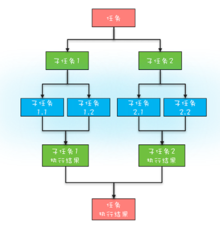
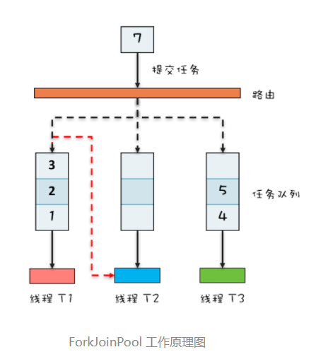

## 1. 开头  
&emsp;&emsp;简单的并并任务我们可以使用“线程池 +Future”，有聚合关系的任务我们可以使用强大的CompletableFuture，批量的并行任务我们可以采用CompletionServicel来解决。  
&emsp;&emsp;以上是日常开发中常用的并行任务模型，其实还有一种任务模型：大名鼎鼎的分而治之模型。把一个复杂的问题分解成多个相似的子问题，然后再把子问题分解成更小的子问题，直到子问题简单到可以直接求解。分治这种任务模型其实是很普遍的，jdk也是提供了这种并行计算的 Fork/Join工具类，这种工具是可以支持分治的任务模型的。  

## 2. 分治任务模型
  
* 任务分解，也就是将任务迭代地分解为子任务，直至子任务可以直接计算出结果
* 结果合并，即逐层合并子任务的执行结果，直至获得最终结果


## 3. Fork/Join工具

### 3.1. 基本介绍
&emsp;&emsp;Fork 对应的是分治任务模型里的任务分解，Join 对应的是结果合并。  
&emsp;&emsp;Fork/Join框架一共有两类组件组成：
* 分治任务的线程池 ForkJoinPool  
  调用分治任务线程池的 invoke() 方法来启动分治任务
* 分治任务 ForkJoinTask
  * 它的最核心的方法有fork()、join()，其中 fork() 方法会异步地执行一个子任务，而 join() 方法则会阻塞当前线程来等待子任务的执行结果
  * ForkJoinTask 有两个子类，RecursiveAction 和 RecursiveTask。这两个子类都定义了抽象方法 compute()，需要使用者具体实现，不过需要注意的是一个有返回值一个没有返回值。


### 3.2. Fork/Join原理  
  
&emsp;&emsp;我们知道ForkJoinPool可以对应于ThreadPoolExecutor，但是不同的是ThreadPoolExecutor 内部只有一个任务队列，而 ForkJoinPool 内部有多个任务队列，当我们通过 ForkJoinPool 的 invoke() 或者 submit() 方法提交任务时，ForkJoinPool 根据一定的路由规则把任务提交到一个任务队列中，如果任务在执行过程中会创建出子任务，那么子任务会提交到工作线程对应的任务队列中  
&emsp;&emsp;如果工作线程空闲了，那它可以“窃取”其他工作任务队列里的任务，这样可以保证所有的线程都有活干。  
**注意：窃取的时候是从任务队列不同的端进行消费，这样能避免很多不必要的数据竞争**

### 3.3. 实现斐波那契
我们利用上述的介绍，来并行计算一个斐波那契值。
```
static void main(String[] args){
  
  // 创建分治任务线程池  
  ForkJoinPool fjp = new ForkJoinPool(4);

  // 创建分治任务
  Fibonacci fib = new Fibonacci(30);   
  
  // 启动分治任务  
  Integer result = fjp.invoke(fib);

  // 输出结果  
  System.out.println(result);

}
// 递归任务
static class Fibonacci extends RecursiveTask<Integer>{
 
  final int n;
 
  Fibonacci(int n){
      this.n = n;
  }
  
  protected Integer compute(){

    if (n <= 1)
      return n;
    
    Fibonacci f1 = new Fibonacci(n - 1);

    // 创建子任务  
    f1.fork();

    Fibonacci f2 = new Fibonacci(n - 2);

    // 等待子任务结果，并合并结果  
    return f2.compute() + f1.join();
  }
}
```

### 3.4. 统计单词数量  
有一个需求是统计一个大文件里面每个单词的数量，如何做呢？  
我们可以分而治之的方法快速统计：    
&emsp;&emsp;二分法递归地将一个文件拆分成更小的文件，直到文件里只有一行数据，然后统计这一行数据里单词的数量，最后再逐级汇总结果.
```
static void main(String[] args){
  String[] fc = {"hello world", "hello me", "hello fork", "hello join", "fork join in world"};
  
  // 创建 ForkJoin 线程池    
  ForkJoinPool fjp =  new ForkJoinPool(3);
  
  // 创建任务    
  MR mr = new MR(fc, 0, fc.length);  

  // 启动任务    
  Map<String, Long> result = fjp.invoke(mr);
  
  // 输出结果    
  result.forEach((k, v)-> System.out.println(k+":"+v));
}


//MR 模拟类
static class MR extends RecursiveTask<Map<String, Long>> {
 
  private String[] fc;
 
  private int start, end;
 
  // 构造函数
  MR(String[] fc, int fr, int to){
    this.fc = fc;
    this.start = fr;
    this.end = to;
  }

  @Override protected 
  Map<String, Long> compute(){

    if (end - start == 1) {
      return calc(fc[start]);

    } else {

      int mid = (start+end)/2;

      MR mr1 = new MR(fc, start, mid);

      mr1.fork();

      MR mr2 = new MR(fc, mid, end);
      
      // 计算子任务，并返回合并的结果    
      return merge(mr2.compute(),  mr1.join());
    }
  }


  // 合并两个的结果
  private Map<String, Long> merge(Map<String, Long> r1,  Map<String, Long> r2) {
    
    Map<String, Long> result =  new HashMap<>();
    
    result.putAll(r1);
    
    // 合并结果
    r2.forEach((k, v) -> {
      
      Long c = result.get(k);
      
      if (c != null)
        result.put(k, c+v);
      else 
        result.put(k, v);
    
    });
    
    return result;
  }


  // 统计一行的单词数量
  private Map<String, Long> calc(String line) {


    Map<String, Long> result =  new HashMap<>();
    
    // 分割单词    
    String [] words = line.split("\\s+");
    
    // 统计单词数量    
    for (String w : words) {
     
      Long v = result.get(w);
     
      if (v != null) 
        result.put(w, v+1);
      else
        result.put(w, 1L);
    }

    return result;
  }
}
```
**注意：不可以将 merge(mr2.compute(),  mr1.join())的参数交换位置，如果join在前面会先首先让当前线程阻塞在join()上。当join()执行完才会执行mr2.compute(),这样并行度就下来了**


## 4. 总结  
使用fork-join有点像使用归并排序，执行下一层的时候，可以fork下，归并的时候join下。  
**注意：Java 1.8 提供的 Stream API 里面并行流也是以 ForkJoinPool 为基础的。不过需要你注意的是，默认情况下所有的并行流计算都共享一个 ForkJoinPool，这个共享的 ForkJoinPool 默认的线程数是 CPU 的核数；如果所有的并行流计算都是 CPU 密集型计算的话，完全没有问题，但是如果存在 I/O 密集型的并行流计算，那么很可能会因为一个很慢的 I/O 计算而拖慢整个系统的性能。所以建议用不同的 ForkJoinPool 执行不同类型的计算任务**  
如下的代码例子：
```
// 采购订单
PurchersOrder po;
CompletableFuture<Boolean> cf = 
  CompletableFuture.supplyAsync(()->{
    // 在数据库中查询规则
    return findRuleByJdbc();
  }).thenApply(r -> {
    // 规则校验
    return check(po, r);
});
Boolean isOk = cf.join();
```
&emsp;&emsp;findRuleByJdbc() 这个方法隐藏着一个阻塞式 I/O，这意味着会阻塞调用线程。默认情况下所有的 CompletableFuture 共享一个 ForkJoinPool，当有阻塞式 I/O 时，可能导致所有的 ForkJoinPool 线程都阻塞，进而影响整个系统的性能