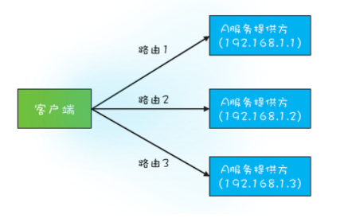

## 1. 开头  
&emsp;&emsp;并发问题都是写造成的，为了不产生并发问题，我们是不是可以压根不进行共享呢？    
&emsp;&emsp;是的，有现成的并发设计模式专门来使得变量不共享：  
* Immutability 模式  
  不变性（Immutability）模式，简单来说就是对象一旦被创建之后，状态就不再发生变化，变量一旦被赋值，就不允许修改了（没有写操作）；没有修改操作，也就是保持了不变性。需要注意对象属性的不可变性才是完全的不可变。
* Copy-on-Write 模式  
  使用 Copy-on-Write 模式需要注意性能问题
* 线程本地存储模式  
  使用线程本地存储模式需要注意异步执行问题

## 2. 不可变模式 
### 2.1. java实现不可变类 
&emsp;&emsp;将一个类所有的属性都设置成 final 的，并且只允许存在只读方法，那么这个类基本上就具备不可变性了，把这个类也设置成为final的，这样这个类就可以不被继承，不可变了，这样更加的严格。  
&emsp;&emsp;Java 的 String 就是不可变类。每次修改其实是创建了一个新的String。比如我们可以看value[] 和 replace() 的源码如下：
```
public final class String {
  private final char value[];
  // 字符替换
  String replace(char oldChar, 
      char newChar) {
    // 无需替换，直接返回 this  
    if (oldChar == newChar){
      return this;
    }
 
    int len = value.length;
    int i = -1;
    /* avoid getfield opcode */
    char[] val = value; 
    // 定位到需要替换的字符位置
    while (++i < len) {
      if (val[i] == oldChar) {
        break;
      }
    }
    // 未找到 oldChar，无需替换
    if (i >= len) {
      return this;
    } 
    // 创建一个 buf[]，这是关键
    // 用来保存替换后的字符串
    char buf[] = new char[len];
    for (int j = 0; j < i; j++) {
      buf[j] = val[j];
    }
    while (i < len) {
      char c = val[i];
      buf[i] = (c == oldChar) ? 
        newChar : c;
      i++;
    }
    // 创建一个新的字符串返回
    // 原字符串不会发生任何变化
    return new String(buf, true);
  }
}
```  
从上面的代码可以看出只要做了修改，其实是创建了一个新的对象了。  

### 2.2. java的享元模式
&emsp;由上面可知，不可变类在使用过程中，可能产生了大量的对象，如何解决这一问题呢？  
答案是享元模式，也就是用对象池：  
* 创建之前，首先去对象池里看看是不是存在；
* 如果已经存在，就利用对象池里的对象；
* 如果不存在，就会新创建一个对象，并且把这个新创建出来的对象放进对象池里。  
  
比如我们的包装类就是使用的对象池。这里我们看下Long类型内部持有一个缓存池保存了[-128,127]之间的数字。初始化的时候就会放入进去
```
Long valueOf(long l) {
  final int offset = 128;
  // [-128,127] 直接的数字做了缓存
  if (l >= -128 && l <= 127) { 
    return LongCache
      .cache[(int)l + offset];
  }
  return new Long(l);
}
// 缓存，等价于对象池
// 仅缓存 [-128,127] 直接的数字
static class LongCache {
  static final Long cache[] 
    = new Long[-(-128) + 127 + 1];
 
  static {
    for(int i=0; i<cache.length; i++)
      cache[i] = new Long(i-128);
  }
}
```  

**注意：我们不能使用享元模式类型的对象作为锁，因为可能多个线程持有的享元模式对象池可能是同一个，锁可能错乱。**
```
class A {
  Long al=Long.valueOf(1);
  public void setAX(){
    synchronized (al) {
      // 省略代码无数
    }
  }
}
class B {
  Long bl=Long.valueOf(1);
  public void setBY(){
    synchronized (bl) {
      // 省略代码无数
    }
  }
}
```
上面两把锁在对象池中其实是一个对象，会互相影响  


### 2.3. 注意事项
* 对象的所有属性都是 final 的，并不能保证不可变性；  
  * 因为如果属性是一个普通对象，那么就可以修改
  * 不可变对象虽是不可变的，但是使用的时候如果没有原子性保证，其实也是不安全的，可以使用原子类来保证原子性。
* 不可变对象也需要正确发布。  

如下的代码就是示例用原子类解决了不可变对象引用的原子性问题：  
```
public class SafeWM {

  //不可变class
  class WMRange{
    final int upper;
    final int lower;
    WMRange(int upper,int lower){
    // 省略构造函数实现
    }
  }

  //构建原子类对象传入不可变对象
  final AtomicReference<WMRange> rf = new AtomicReference<>(new WMRange(0,0));

  // 设置库存上限
  void setUpper(int v){
    while(true){
      WMRange or = rf.get();
      // 检查参数合法性
      if(v < or.lower){
        throw new IllegalArgumentException();
      }
      WMRange nr = new WMRange(v, or.lower);
      if(rf.compareAndSet(or, nr)){
        return;
      }
    }
  }
}
```

### 2.4. 小结  
&emsp;&emsp;不可变模式非常普遍，Java 语言里面的 String 和 Long、Integer、Double 等基础类型的包装类都在使用，并且使用了享元模式来缓解创建对象多的问题


## 3. Copy-on-Write模式  
&emsp;&emsp;Copy-on-Write，经常被缩写为 COW 或者 CoW，顾名思义就是写时复制。更多地体现的是一种延时策略，只有在真正需要复制的时候才复制，而不是提前复制好。同时 Copy-on-Write 还支持按需复制，所以 Copy-on-Write 在操作系统领域是能够提升性能的。

### 3.1. Copy-on-Write的应用领域  
* 类 Unix 的操作系统  
  传统的fork() 函数会创建父进程的一个完整副本，Linux 中的 fork() 函数就聪明得多了，fork() 子进程的时候，并不复制整个进程的地址空间，而是让父子进程共享同一个地址空间；只用在父进程或者子进程需要写入的时候才会复制地址空间，从而使父子进程拥有各自的地址空间，同时 Copy-on-Write 还支持按需复制，这与java中的copy on write不一样，java中的会复制一整块内存，操作系统的性能更高。
* 文件系统  
  Btrfs (B-Tree File System)、aufs（advanced multi-layered unification filesystem）
* Docker 容器镜像的设计是 Copy-on-Write
* 分布式源码管理系统 Git 背后的设计思想
  
**注意：如果容器经常被修改或者这个数组本身就非常大的时候，是不建议使用的。反之，如果是修改非常少、数组数量也不大，并且对读性能要求苛刻的场景，使用 Copy-on-Write 容器效果就非常好**  

### 3.2. Copy-on-Write案例
rpc框架的路由信息更新，每次 RPC 调用都需要通过负载均衡器来计算目标服务的 IP 和端口号，而负载均衡器需要通过路由表获取接口的所有路由信息，访问路由表这个操作的性能要求是很高的，对数据的一致性要求并不高。典型的读多写少类问题      
   
对于上面的业务场景，CopyOnWriteArrayList 和 CopyOnWriteArraySet 天生就适用这种场景。  
示例代码：
```
// 路由信息
public final class Router{
  private final String  ip;
  private final Integer port;
  private final String  iface;
  // 构造函数
  public Router(String ip, Integer port, String iface){
    this.ip = ip;
    this.port = port;
    this.iface = iface;
  }
  // 重写 equals 方法
  public boolean equals(Object obj){
    if (obj instanceof Router) {
      Router r = (Router)obj;
      return iface.equals(r.iface) &&
             ip.equals(r.ip) &&
             port.equals(r.port);
    }
    return false;
  }
  public int hashCode() {
    // 省略 hashCode 相关代码
  }
}
// 路由表信息
public class RouterTable {
  //Key: 接口名
  //Value: 路由集合
  ConcurrentHashMap<String, CopyOnWriteArraySet<Router>> rt = new ConcurrentHashMap<>();
  // 根据接口名获取路由表
  public Set<Router> get(String iface){
    return rt.get(iface);
  }
  // 删除路由
  public void remove(Router router) {
    Set<Router> set=rt.get(router.iface);
    if (set != null) {
      set.remove(router);
    }
  }
  // 增加路由
  public void add(Router router) {
    Set<Router> set = rt.computeIfAbsent(route.iface, r -> 
        new CopyOnWriteArraySet<>());
    set.add(router);
  }
}
```

以上代码就是使用CopyOnWriteArraySet，添加新的路由信息时，不影响老的，可能有个稍微的延迟。但是没有关系，弱一致性。  


### 3.3. 小结  
 Copy-on-Write和不可变联系紧密， String、Integer、Long 等都是基于 Copy-on-Write 方案实现的。它也有缺点的，那就是消耗内存，每次修改都需要复制一个新的对象出来。不过现在gc技术不断成熟，这一点的影响慢慢在减小。

 **PS：为什么没有CopyOnWriteLinkedList呢？那是因为CopyOnWriteLinkedList的链表结构读取效率比较低，就违背了读多写少的设计初衷，而且链表的新增删除压根就不需要复制，性能损耗也不大，所以没有必要**  


## 4. ThreadLocal  
 &emsp;&emsp;多个线程同时读写同一共享变量存在并发问题，因此没有共享，就没有问题了。Java 语言提供的线程本地存储（ThreadLocal）就能够做到不同线程之间就没有干扰了。  
 例如我们使用threadlocal实现线程安全的date处理
 ```
 static class SafeDateFormat {
  // 定义 ThreadLocal 变量
  static final ThreadLocal<DateFormat> tl=ThreadLocal.withInitial(()-> new SimpleDateFormat("yyyy-MM-dd HH:mm:ss"));
      
  static DateFormat get(){
    return tl.get();
  }
}
// 不同线程执行下面代码
// 返回的 df 是不同的
DateFormat df = SafeDateFormat.get()；
 ```
在java中，一般是采用 ThreadLocal 来传递一些上下文信息，例如 Spring 使用 ThreadLocal 来传递事务信息，注意在异步场景中，不可以使用 Spring 的事务管理器，因为ThreadLocal内的变量是线程级别的，而异步编程意味着线程不同，不同线程的变量不可以共享。
### 4.1. threadlocal原理 
&emsp;&emsp;ThreadLocal 的目标是让不同的线程有不同的变量 V，那最直接的方法就是创建一个 Map，它的 Key 是线程，Value 是每个线程拥有的变量 V，ThreadLocal 内部持有这样的一个 Map 就可以了。  
  
* thread私有变量threadlocalMap
* threadlocalmap存储，threadlocal:value    

示例代码如下： 
```
class Thread {
  // 内部持有 ThreadLocalMap
  ThreadLocal.ThreadLocalMap threadLocals;
}
class ThreadLocal<T>{
  public T get() {
    // 首先获取线程持有的
    //ThreadLocalMap
    ThreadLocalMap map = Thread.currentThread().threadLocals;
    // 在 ThreadLocalMap 中
    // 查找变量
    Entry e = map.getEntry(this);
    return e.value;  
  }
  static class ThreadLocalMap{
    // 内部是数组而不是 Map
    Entry[] table;
    // 根据 ThreadLocal 查找 Entry
    Entry getEntry(ThreadLocal key){
      // 省略查找逻辑
    }
    //Entry 定义
    static class Entry extends
    WeakReference<ThreadLocal>{
      Object value;
    }
  }
}
```
**注意：这里的map的持有方是属于thread，而不是threadlocal,这里和我们直觉不太一样，ThreadLocal 仅仅是一个代理工具类，内部并不持有任何与线程相关的数据，所有和线程相关的数据都存储在 Thread 里面，为什么会这样呢？**   
&emsp;&emsp;因为这样设计不容易产生内存泄露， 因为Java 的实现中 Thread 持有 ThreadLocalMap，对 ThreadLocal 的引用还是弱引用（WeakReference），只要 Thread 对象可以被回收，那么 ThreadLocalMap 就能被回收。Java 的这种实现方案虽然看上去复杂一些，但是更加安全  

### 4.2. ThreadLocal与线程池  
&emsp;&emsp;我们在线程池中使用 ThreadLocal就可能导致内存泄露，因为线程池中线程的存活时间太长，往往都是和程序同生共死的，这就意味着 Thread 持有的 ThreadLocalMap 一直都不会被回收  
&emsp;&emsp;所以在线程池使用需要特别注意，需要手动释放。可以参考：
```
ExecutorService es;
ThreadLocal tl;
es.execute(()->{
  //ThreadLocal 增加变量
  tl.set(obj);
  try {
    // 省略业务逻辑代码
  }finally {
    // 手动清理 ThreadLocal 
    tl.remove();
  }
});
```

### 4.3. InheritableThreadLocal   
如果你需要子线程继承父线程的线程变量，Java 提供了 InheritableThreadLocal 来支持这种特性，用法和ThreadLocal类似，但是同样不建议在线程池中使用 InheritableThreadLocal，因为同样可能导致内存泄漏，而且线程池的线程是动态的，继承关系混乱。

