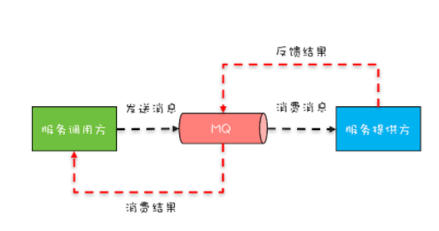
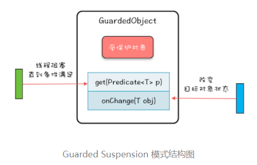

## 1. 背景  
&emsp;&emsp;在实际的生产过程中，比如发送一个异步消息，发送完成后，别人会返回一个成功的消息，但是这个消息是另一个线程接收的，这种场景如何使用多线程编程实现呢？答案是可以采用**保护性暂停模式**。
    


## 2. Guarded Suspension（保护性暂停） 
### 2.1. 基本原理 
保护性暂停的基本原理如下：  
  
* get() 方法通过条件变量的 await() 方法实现等待
* onChanged() 方法通过条件变量的 signalAll() 方法实现唤醒功能 

&emsp;&emsp;它的核心原理就是利用条件变量，Guarded Suspension 模式本质上是一种等待唤醒机制的实现，只不过 Guarded Suspension 模式将其规范化了，它还有一个更形象的非官方名字-多线程版本的 if，
其核心的代码如下：  
```
class GuardedObject<T>{
  // 受保护的对象
  T obj;
  final Lock lock = new ReentrantLock();
  final Condition done = lock.newCondition();
  final int timeout=1;
  // 获取受保护对象  
  T get(Predicate<T> p) {
    lock.lock();
    try {
      //MESA 管程推荐写法
      while(!p.test(obj)){
        done.await(timeout, TimeUnit.SECONDS);
      }
    }catch(InterruptedException e){
      throw new RuntimeException(e);
    }finally{
      lock.unlock();
    }
    // 返回非空的受保护对象
    return obj;
  }
  // 事件通知方法
  void onChanged(T obj) {
    lock.lock();
    try {
      this.obj = obj;
      done.signalAll();
    } finally {
      lock.unlock();
    }
  }
}
```

### 2.2. 使用案例  
上面只是一个简单的使用条件变量来实现保护性暂停，在实际生产中一定是多个消息，每个消息对应一个等待，这种怎么实现呢？其实很简单，将上面的GuardedObject内部持有一个全局静态map，每个消息的GuardedObject都放入到这个map中，onchange时，使用静态方法传入key(一般是消息的唯一key)，来触发signall即可。Dubbo 中 DefaultFuture 也是采用类似的机制。
#### 2.2.1. 定义GuardedObject
```
class GuardedObject<T>{
  // 受保护的对象
  T obj;
  final Lock lock = new ReentrantLock();
  final Condition done = lock.newCondition();
  final int timeout=2;
  // 保存所有 GuardedObject
  final static Map<Object, GuardedObject> gos=new ConcurrentHashMap<>();
  // 静态方法创建 GuardedObject
  static <K> GuardedObject create(K key){
    GuardedObject go=new GuardedObject();
    gos.put(key, go);
    return go;
  }
  static <K, T> void fireEvent(K key, T obj){
    GuardedObject go=gos.remove(key);
    if (go != null){
      go.onChanged(obj);
    }
  }
  // 获取受保护对象  
  T get(Predicate<T> p) {
    lock.lock();
    try {
      //MESA 管程推荐写法
      while(!p.test(obj)){
        done.await(timeout,  TimeUnit.SECONDS);
      }
    }catch(InterruptedException e){
      throw new RuntimeException(e);
    }finally{
      lock.unlock();
    }
    // 返回非空的受保护对象
    return obj;
  }
  // 事件通知方法
  void onChanged(T obj) {
    lock.lock();
    try {
      this.obj = obj;
      done.signalAll();
    } finally {
      lock.unlock();
    }
  }
}
```
**注意：调用了GuardedObect.create方法但是没有任何其他线程调用fireEvent方法会造成内存泄漏**
#### 2.2.2. 发送消息使用
```
  int id= 序号生成器.get();
  // 创建一消息
  Message msg1 = new Message(id,"{...}");
  // 创建 GuardedObject 实例
  GuardedObject<Message> go = GuardedObject.create(id);  
  // 发送消息
  send(msg1);
  // 等待 MQ 消息
  Message r = go.get(t->t != null);  
}
void onMessage(Message msg){
  // 唤醒等待的线程
  GuardedObject.fireEvent(msg.id, msg);
}
```


## 3. Balking模式  
&emsp;&emsp;保护性暂停模式解决了发送消息等待另一个线程接收结果的问题，还有一种场景也需要用到这种多线程if模式，比如，各种编辑器提供的自动保存功能，存盘操作的前提是文件做过修改，如果文件没有执行过修改操作，就需要快速放弃存盘操作，我们可以使用互斥锁来实现，具体的代码如下：
```
// 自动存盘操作
void autoSave(){
  synchronized(this){
    if (!changed) {
      return;
    }
    changed = false;
  }
  // 执行存盘操作
  // 省略且实现
  this.execSave();
}
// 编辑操作
void edit(){
  // 省略编辑逻辑
  ......
  synchronized(this){
    changed = true;
  }
}  
```
* 共享变量是一个状态变量，业务逻辑依赖于这个状态变量的状态
* 当状态满足某个条件时，执行某个业务逻辑
* 放到多线程场景里，就是另一种多线程版本的 if

## 3.1. Balking的标准范式
我们可以将上述的编辑操作中的修改状态提取出来，并发处理逻辑和业务逻辑分开，这样就形成了标准的Balking的标准范式
```
boolean changed=false;
// 自动存盘操作
void autoSave(){
  synchronized(this){
    if (!changed) {
      return;
    }
    changed = false;
  }
  // 执行存盘操作
  // 省略且实现
  this.execSave();
}
// 编辑操作
void edit(){
  // 省略编辑逻辑
  ......
  change();
}
// 改变状态
void change(){
  synchronized(this){
    changed = true;
  }
}
```

## 3.1. volatile版Balking模式  
&emsp;&emsp;一般情况我们建议采用Balking的标准范式来解决实际问题。如果对于原子性没有要求，也可以采用volatile来实现。  

例如之前的例子，我们需要将java应用中的路由信息保存到本地磁盘中，使用调度方式能保证同一时刻只有一个线程执行 autoSave() 方法，我们就可以采用volatile半的用 Balking 模式实现，具体代码如下：
```
// 路由表信息
public class RouterTable {
  //Key: 接口名
  //Value: 路由集合
  ConcurrentHashMap<String, CopyOnWriteArraySet<Router>> rt = new ConcurrentHashMap<>();    
  // 路由表是否发生变化
  volatile boolean changed;
  // 将路由表写入本地文件的线程池
  ScheduledExecutorService ses= Executors.newSingleThreadScheduledExecutor();
  // 启动定时任务
  // 将变更后的路由表写入本地文件
  public void startLocalSaver(){
    ses.scheduleWithFixedDelay(()->{
      autoSave();
    }, 1, 1, MINUTES);
  }
  // 保存路由表到本地文件
  void autoSave() {
    if (!changed) {
      return;
    }
    changed = false;
    // 将路由表写入本地文件
    // 省略其方法实现
    this.save2Local();
  }
  // 删除路由
  public void remove(Router router) {
    Set<Router> set=rt.get(router.iface);
    if (set != null) {
      set.remove(router);
      // 路由表已发生变化
      changed = true;
    }
  }
  // 增加路由
  public void add(Router router) {
    Set<Router> set = rt.computeIfAbsent(
      route.iface, r -> 
        new CopyOnWriteArraySet<>());
    set.add(router);
    // 路由表已发生变化
    changed = true;
  }
}
```

## 3.2. 应用场景
* 对象初始化
    ```
    class InitTest{
        boolean inited = false;
        synchronized void init(){
            if(inited){
            return;
            }
            // 省略 doInit 的实现
            doInit();
            inited=true;
        }
    }
    ```
* 单例模式
  ```
    class Singleton{
        private static volatile Singleton singleton;
        // 构造方法私有化  
        private Singleton() {}
        // 获取实例（单例）
        public static Singleton getInstance() {
            // 第一次检查
            if(singleton==null){
                synchronize{Singleton.class){
                    // 获取锁后二次检查
                    if(singleton==null){
                        singleton=new Singleton();
                    }
                }
            }
            return singleton;
        }
    }
  ```
  以上代码利用了双重检查（Double Check）方案，一旦 Singleton 对象被成功创建之后，就不会执行 synchronized(Singleton.class){}相关的代码，这也是一种Balking模式


  ## 4. 总结

  Guarded Suspension和Balking模式模式都是线程安全的 if，不同之处在于，Guarded Suspension 模式会等待 if 条件为真，而 Balking 模式不会等待。这里一定要注意，实现 Balking 模式最容易忽视的就是竞态条件问题。比如
  ```
  class Test{
        volatile boolean inited = false;
        int count = 0;
        void init(){
            // 存在竞态条件
            if(inited){
            return;
            }
            // 有可能多个线程执行到这里
            inited = true;
            // 计算 count 的值
            count = calc();
        }
    }  
  ```