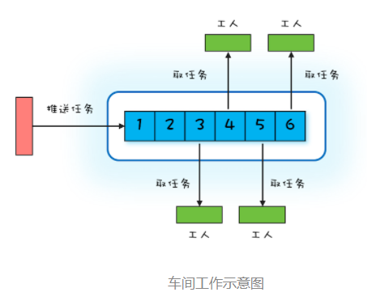

## 1. 开头  
之前讲过，并发需要解决的的核心问题主要有三个：分工、同步、互斥。而解决分工的问题有一系列的设计模式常用的有：
* Thread-Per-Message 模式
* Worker Thread 模式
* 生产者 - 消费者模式


## 2. Thread-Per-Message模式  
&emsp;&emsp;通常我们处理一个事情，我们自己搞不定，需要委托别人办理，比如写一个server，主线程通常会创建一个子线程，委托子线程去处理请求，这应该能够大大的提升性能。这种委托他人办理的方式，在并发编程领域被总结为一种设计模式，叫做Thread-Per-Message 模式。

### 2.1. Thread实现
我们可以为每个请求都创建一个java线程。
```
final ServerSocketChannel ssc = ServerSocketChannel.open().bind(new InetSocketAddress(8080));
// 处理请求    
try {
  while (true) {
    // 接收请求
    SocketChannel sc = ssc.accept();
    // 每个请求都创建一个线程
    new Thread(()->{
      try {
        // 读 Socket
        ByteBuffer rb = ByteBuffer.allocateDirect(1024);
        sc.read(rb);
        // 模拟处理请求
        Thread.sleep(2000);
        // 写 Socket
        ByteBuffer wb = (ByteBuffer)rb.flip();
        sc.write(wb);
        // 关闭 Socket
        sc.close();
      }catch(Exception e){
        throw new UncheckedIOException(e);
      }
    }).start();
  }
} finally {
  ssc.close();
}   
```
&emsp;&emsp;如上述代码所示，每来一个请求，都创建了一个 Java 线程。这样其实是非常耗费资源的，因为创建线程是非常重量级的操作。
一般来说，可以使用线程池代替频繁创建线程的请求。其实在其它语言中，比如go语言，创建的不是和操作系统一一对应的线程，而是叫做携程的东西，创建成本很低。这种直接使用 Thread-Per-Message 模式就完全没问题了。  
**注意：这种模式存在线程的频繁创建、销毁以及是否可能导致 OOM**

&emsp;&emsp;java如何来创建轻量级的线程呢？可以采用Fiber技术


### 2.2. Fiber实现  
OpenJDK 有个 Loom 项目，就是要解决 Java 语言的轻量级线程问题，提供了fiber请轻量级线程。  
```
final ServerSocketChannel ssc = ServerSocketChannel.open().bind(new InetSocketAddress(8080));
// 处理请求
try{
  while (true) {
    // 接收请求
    final SocketChannel sc = serverSocketChannel.accept();
    Fiber.schedule(()->{
      try {
        // 读 Socket
        ByteBuffer rb = ByteBuffer.allocateDirect(1024);
        sc.read(rb);
        // 模拟处理请求
        LockSupport.parkNanos(2000*1000000);
        // 写 Socket
        ByteBuffer wb = (ByteBuffer)rb.flip()
        sc.write(wb);
        // 关闭 Socket
        sc.close();
      } catch(Exception e){
        throw new UncheckedIOException(e);
      }
    });
  }//while
}finally{
  ssc.close();
}
```
这种通过Fiber.schedule创建的轻量级线程，经过测试后性能还是非常不错的。


### 2.3. 小结  
&emsp;&emsp;Thread-Per-Message 模式在 Java 领域并不是那么知名，根本原因在于 Java 语言里的线程是一个重量级的对象，但是java正在不断的探索轻量级的线程。  


## 3. work thread模式  
&emsp;&emsp;频繁地创建、销毁线程非常影响性能,要想有效避免线程的频繁创建、销毁以及 OOM 问题可以采用Java 领域使用最多的 Worker Thread 模式  

### 3.1. work thread机制
  
其实这种工作模式对应到现实世界里，其实指的就是车间里的工人，我们可以在java使用阻塞队列来实现，其实java的线程池就是线程的实现方案  


### 3.2. work thread案例
```
ExecutorService es = Executors.newFixedThreadPool(500);
final ServerSocketChannel ssc = ServerSocketChannel.open().bind(new InetSocketAddress(8080));
// 处理请求    
try {
  while (true) {
    // 接收请求
    SocketChannel sc = ssc.accept();
    // 将请求处理任务提交给线程池
    es.execute(()->{
      try {
        // 读 Socket
        ByteBuffer rb = ByteBuffer.allocateDirect(1024);
        sc.read(rb);
        // 模拟处理请求
        Thread.sleep(2000);
        // 写 Socket
        ByteBuffer wb = 
          (ByteBuffer)rb.flip();
        sc.write(wb);
        // 关闭 Socket
        sc.close();
      }catch(Exception e){
        throw new UncheckedIOException(e);
      }
    });
  }
} finally {
  ssc.close();
  es.shutdown();
}   
```

### 3.3. work thread注意事项  
* 创建线程池需要注意使用有界队列
  ```
  ExecutorService es = new ThreadPoolExecutor(50, 500, 60L, TimeUnit.SECONDS,
  // 注意要创建有界队列
  new LinkedBlockingQueue<Runnable>(2000),
  // 建议根据业务需求实现 ThreadFactory
  r->{
    return new Thread(r, "echo-"+ r.hashCode());
  },
  // 建议根据业务需求实现 RejectedExecutionHandler
  new ThreadPoolExecutor.CallerRunsPolicy());

  ```

  * 注意线程池的线程死锁  
    如果提交到相同线程池的任务不是相互独立的，而是有依赖关系的，那么就有可能导致线程死锁  

反例1：
  ```
    //L1、L2 阶段共用的线程池
    ExecutorService es = Executors.newFixedThreadPool(2);
    //L1 阶段的闭锁    
    CountDownLatch l1=new CountDownLatch(2);
    for (int i=0; i<2; i++){
        System.out.println("L1");
        // 执行 L1 阶段任务
        es.execute(()->{
            //L2 阶段的闭锁 
            CountDownLatch l2=new CountDownLatch(2);
            // 执行 L2 阶段子任务
            for (int j=0; j<2; j++){
                es.execute(()->{
                    System.out.println("L2");
                    l2.countDown();
                });
            }
            // 等待 L2 阶段任务执行完
            l2.await();
            l1.countDown();
        });
    }
    // 等着 L1 阶段任务执行完
    l1.await();
    System.out.println("end");
  ```  
  线程池中的两个线程全部都阻塞在 l2.await(),因为线程池里的线程都阻塞了，没有空闲的线程执行 L2 阶段的任务了。  


反例2：
  ```
    ExecutorService pool = Executors.newSingleThreadExecutor();
    pool.submit(() -> {
    try {
        String qq=pool.submit(()->"QQ").get();
        System.out.println(qq);
    } catch (Exception e) {
    }
    });
  ```
  newSingleThreadExecutor线程池只有单个线程，先将外部线程提交给线程池，外部线程等待内部线程执行完成，但由于线程池只有单线程，导致内部线程一直没有执行的机会，相当于内部线程需要线程池的资源，外部线程需要内部线程的结果，导致死锁

  **注意：提交到相同线程池中的任务一定是相互独立的，否则就一定要慎重**