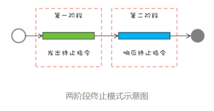

## 1. 开头
&emsp;&emsp;之前也都提到了如何终止一个线程，我们再来回顾下，一个线程的终止一共有两种途径：
* 线程执行完毕，自然终止
* 别的线程主动终止某一线程  

第一种没有什么好说的，对于第二种Java 语言的 Thread 类中曾经提供了一个 stop() 方法，但是这个方法非常粗暴，直接就关闭，线程无法处理后事。java提供了其它的终止线程的方式。  

## 2. 两阶段终止模式  
对于如何优雅终止线程，前人总结出了一套成熟的方案，叫做两阶段终止模式。具体的机制如下：
  

* 第一个阶段主要是线程 T1 向线程 T2发送终止指令
* 第二阶段则是线程 T2响应终止指令

### 2.1. 原理分析  
  
&emsp;&emsp;这里我们再回顾下现成的状态，终止状态只能由runnable状态到终止状态。如果处于休眠状态，要靠 Java Thread 类提供的interrupt() 方法，它可以将休眠状态的线程转换到 RUNNABLE 状态，到了这个状态后，一般我们采用的方法是设置一个标志位，然后线程会在合适的时机检查这个标志位，如果发现符合终止条件，则自动退出 run() 方法。这个过程其实就是我们前面提到的第二阶段：响应终止指令。这就是两阶段终止的完整操作。


### 2.2. 终止线程案例  
&emsp;&emsp;下面的示例代码是监控代理简化之后的实现，start() 方法会启动一个新的线程 rptThread 来执行监控数据采集和回传的功能，stop() 方法需要优雅地终止线程 rptThread，那 stop() 相关功能该如何实现呢？
```
class Proxy {
  // 线程终止标志位
  volatile boolean terminated = false;
  boolean started = false;
  // 采集线程
  Thread rptThread;
  // 启动采集功能
  synchronized void start(){
    // 不允许同时启动多个采集线程
    if (started) {
      return;
    }
    started = true;
    terminated = false;
    rptThread = new Thread(()->{
      while (!terminated){
        // 省略采集、回传实现
        report();
        // 每隔两秒钟采集、回传一次数据
        try {
          Thread.sleep(2000);
        } catch (InterruptedException e){
          // 重新设置线程中断状态
          Thread.currentThread().interrupt();
        }
      }
      // 执行到此处说明线程马上终止
      started = false;
    });
    rptThread.start();
  }
  // 终止采集功能
  synchronized void stop(){
    // 设置中断标志位
    terminated = true;
    // 中断线程 rptThread
    rptThread.interrupt();
  }
}
``` 
这里为什么要使用 isTerminated 作为线程终止标志位呢？  
&emsp;&emsp;因为可能在线程的 run() 方法中调用第三方类库提供的方法，而我们没有办法保证第三方类库正确处理了线程的中断异常，例如第三方类库在捕获到 Thread.sleep() 方法抛出的中断异常后，没有重新设置线程的中断状态，那么就会导致线程不能够正常终止。所以强烈建议你设置自己的线程终止标志位


### 2.3. 线程池终止线程  
* shutdown  
  保守的关闭线程池的方法。线程池执行 shutdown() 后，就会拒绝接收新的任务，但是会等待线程池中正在执行的任务和已经进入阻塞队列的任务都执行完之后才最终关闭线程池
* shutdownNow()  
  激进关闭线程池的方法，线程池执行 shutdownNow() 后，会拒绝接收新的任务，同时还会中断线程池中正在执行的任务，已经进入阻塞队列的任务也被剥夺了执行的机会，不过这些被剥夺执行机会的任务会作为 shutdownNow() 方法的返回值返回

PS：对于生产者 - 消费者服务的线程终止，可以采用“毒丸”，即毒丸对象是生产者生产的一条特殊任务，然后当消费者线程读到“毒丸”对象时，会立即终止自身的执行。我们可以按照如下代码的范式进行结束：  
```
class Logger {
  // 用于终止日志执行的“毒丸”
  final LogMsg poisonPill = new LogMsg(LEVEL.ERROR, "");
  // 任务队列  
  final BlockingQueue<LogMsg> bq = new BlockingQueue<>();
  // 只需要一个线程写日志
  ExecutorService es = Executors.newFixedThreadPool(1);
  // 启动写日志线程
  void start(){
    File file=File.createTempFile("foo", ".log");
    final FileWriter writer = new FileWriter(file);
    this.es.execute(()->{
      try {
        while (true) {
          LogMsg log = bq.poll(5, TimeUnit.SECONDS);
          // 如果是“毒丸”，终止执行  
          if(poisonPill.equals(logMsg)){
            break;
          }  
          // 省略执行逻辑
        }
      } catch(Exception e){
        
      } finally {
        try {
          writer.flush();
          writer.close();
        }catch(IOException e){}
      }
    });  
  }
  // 终止写日志线程
  public void stop() {
    // 将“毒丸”对象加入阻塞队列
    bq.add(poisonPill);
    es.shutdown();
  }
}
```


## 3. 总结  
&emsp;&emsp;对于thread来说有两个关键点：
* 一个是仅检查终止标志位是不够的，因为线程的状态可能处于休眠态
* 另一个是仅检查线程的中断状态也是不够的，因为我们依赖的第三方类库很可能没有正确处理中断异常 

&emsp;&emsp;对于线程池来说
* shutdownNow()粗暴
* shutdown保守，需要谨慎使用。